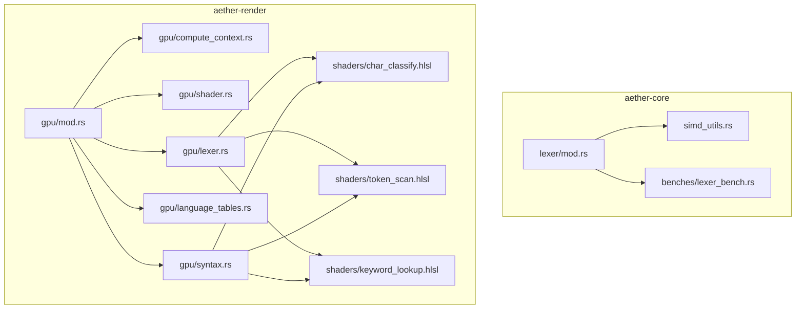
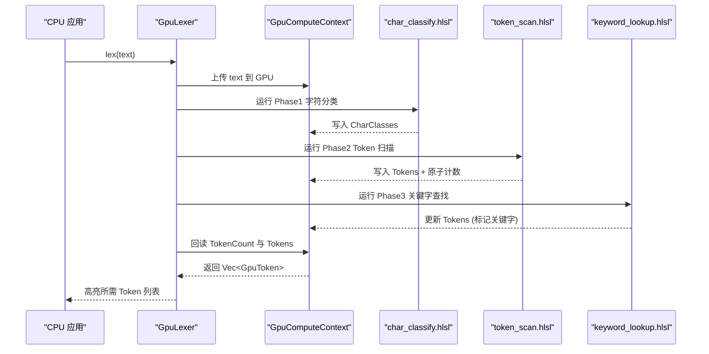
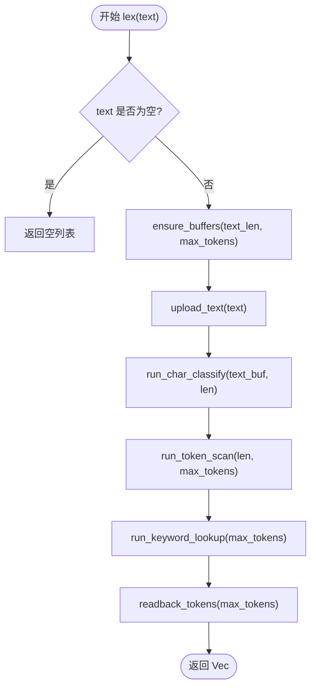
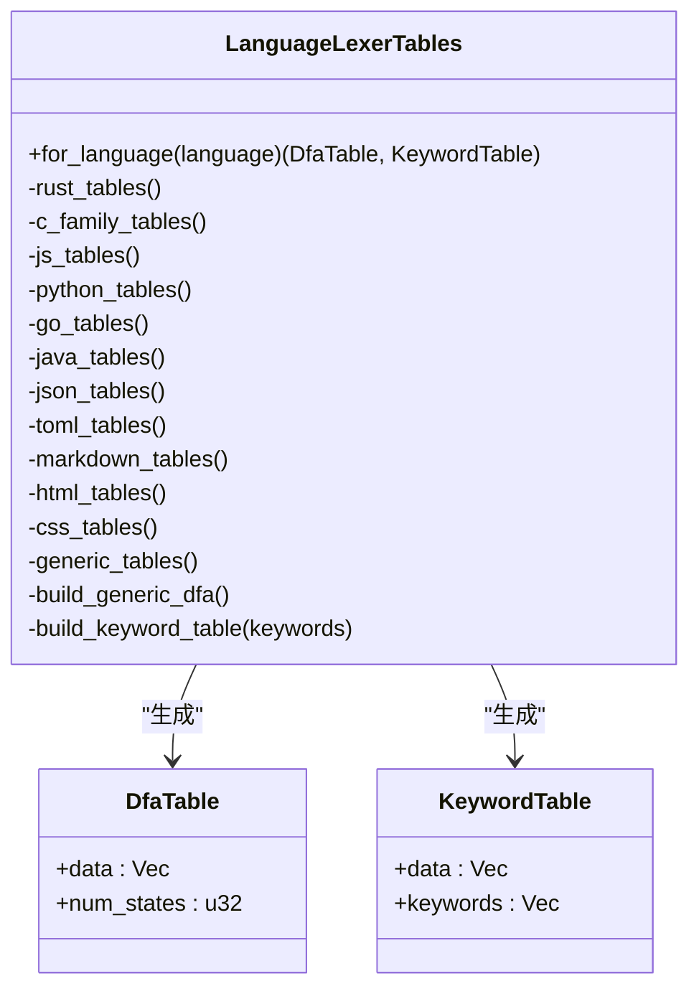
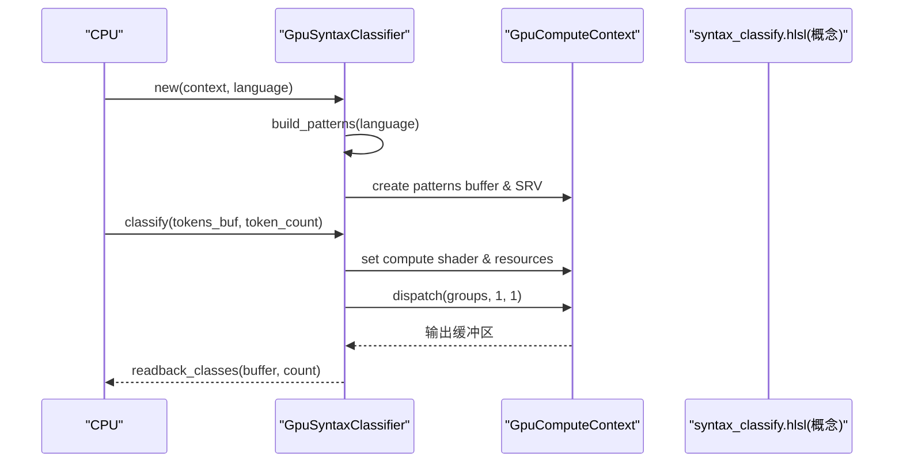
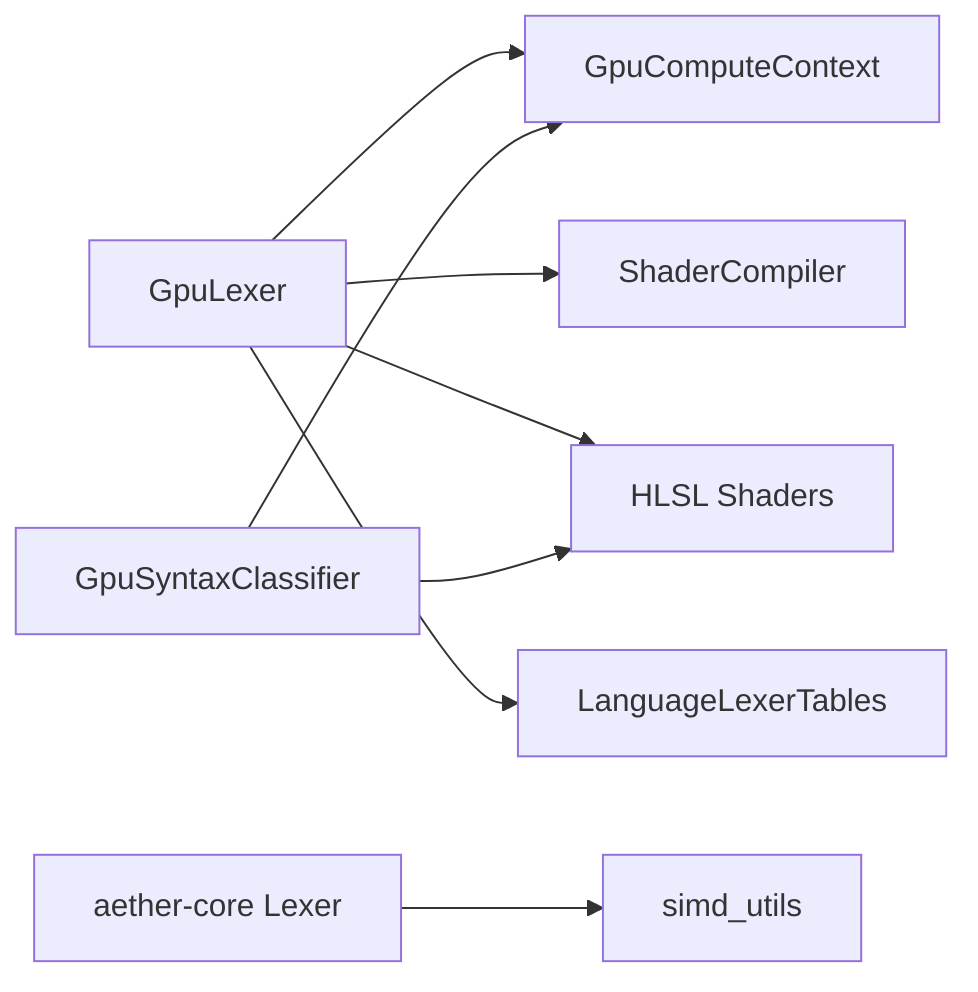

# 语法高亮加速

<cite>
**本文引用的文件**
- [crates/aether-render/src/gpu/mod.rs](file://crates/aether-render/src/gpu/mod.rs)
- [crates/aether-render/src/gpu/lexer.rs](file://crates/aether-render/src/gpu/lexer.rs)
- [crates/aether-render/src/gpu/language_tables.rs](file://crates/aether-render/src/gpu/language_tables.rs)
- [crates/aether-render/src/gpu/syntax.rs](file://crates/aether-render/src/gpu/syntax.rs)
- [crates/aether-render/src/gpu/shader.rs](file://crates/aether-render/src/gpu/shader.rs)
- [crates/aether-render/src/gpu/compute_context.rs](file://crates/aether-render/src/gpu/compute_context.rs)
- [crates/aether-render/src/gpu/shaders/token_scan.hlsl](file://crates/aether-render/src/gpu/shaders/token_scan.hlsl)
- [crates/aether-render/src/gpu/shaders/char_classify.hlsl](file://crates/aether-render/src/gpu/shaders/char_classify.hlsl)
- [crates/aether-render/src/gpu/shaders/keyword_lookup.hlsl](file://crates/aether-render/src/gpu/shaders/keyword_lookup.hlsl)
- [crates/aether-core/src/lexer/mod.rs](file://crates/aether-core/src/lexer/mod.rs)
- [crates/aether-core/src/simd_utils.rs](file://crates/aether-core/src/simd_utils.rs)
- [crates/aether-core/benches/lexer_bench.rs](file://crates/aether-core/benches/lexer_bench.rs)
</cite>

## 目录
1. [简介](#简介)
2. [项目结构](#项目结构)
3. [核心组件](#核心组件)
4. [架构总览](#架构总览)
5. [详细组件分析](#详细组件分析)
6. [依赖关系分析](#依赖关系分析)
7. [性能考量](#性能考量)
8. [故障排查指南](#故障排查指南)
9. [结论](#结论)
10. [附录：配置与使用示例](#附录：配置与使用示例)

## 简介
本技术文档围绕“语法高亮加速模块”展开，重点说明基于 GPU（Direct3D11 Compute Shader）的并行词法分析实现，包括三阶段流水线：字符分类、Token 扫描、关键字匹配。同时覆盖语言表的数据结构与查询优化（查找表构建、内存布局、缓存策略）、多语言支持及扩展机制，并给出性能优化建议（SIMD、内存对齐、批量处理）以及可操作的配置与使用指引。

## 项目结构
该功能横跨两个 crate：
- aether-core：提供通用词法接口、语言识别、SIMD 工具函数与基准测试。
- aether-render：提供 GPU 计算上下文、Shader 编译、GPU 词法器、语言表生成与语法分类器。

图表来源
- [crates/aether-render/src/gpu/mod.rs:1-10](file://crates/aether-render/src/gpu/mod.rs#L1-L10)
- [crates/aether-render/src/gpu/compute_context.rs:17-36](file://crates/aether-render/src/gpu/compute_context.rs#L17-L36)
- [crates/aether-render/src/gpu/shader.rs:7-10](file://crates/aether-render/src/gpu/shader.rs#L7-L10)
- [crates/aether-render/src/gpu/lexer.rs:48-77](file://crates/aether-render/src/gpu/lexer.rs#L48-L77)
- [crates/aether-render/src/gpu/language_tables.rs:1-35](file://crates/aether-render/src/gpu/language_tables.rs#L1-L35)
- [crates/aether-render/src/gpu/syntax.rs:39-54](file://crates/aether-render/src/gpu/syntax.rs#L39-L54)

章节来源
- [crates/aether-render/src/gpu/mod.rs:1-10](file://crates/aether-render/src/gpu/mod.rs#L1-L10)
- [crates/aether-core/src/lexer/mod.rs:1-111](file://crates/aether-core/src/lexer/mod.rs#L1-L111)

## 核心组件
- GPU 计算上下文：封装 D3D11 设备、缓冲区创建、SRV/UAV 绑定、Compute Shader 调度与数据回读。
- GPU 词法器：三阶段流水线（字符分类→Token 扫描→关键字查找），管理工作缓冲区和常量缓冲区。
- 语言表生成器：为不同语言生成 DFA 状态转换表和关键字哈希表。
- 语法分类器：基于 Token 流进行简单语法模式匹配（函数声明/调用、类型名、变量等）。
- Shader 编译器：将 HLSL 源码编译为 CSO 字节码，供运行时加载。
- SIMD 工具：CPU 侧高性能文本处理（换行计数、空白跳过、前缀匹配等）。

章节来源
- [crates/aether-render/src/gpu/compute_context.rs:17-36](file://crates/aether-render/src/gpu/compute_context.rs#L17-L36)
- [crates/aether-render/src/gpu/lexer.rs:48-77](file://crates/aether-render/src/gpu/lexer.rs#L48-L77)
- [crates/aether-render/src/gpu/language_tables.rs:1-35](file://crates/aether-render/src/gpu/language_tables.rs#L1-L35)
- [crates/aether-render/src/gpu/syntax.rs:39-54](file://crates/aether-render/src/gpu/syntax.rs#L39-L54)
- [crates/aether-render/src/gpu/shader.rs:7-10](file://crates/aether-render/src/gpu/shader.rs#L7-L10)
- [crates/aether-core/src/simd_utils.rs:1-8](file://crates/aether-core/src/simd_utils.rs#L1-L8)

## 架构总览
GPU 词法分析采用三阶段并行流水线，每个阶段由独立的 Compute Shader 完成，通过共享内存和原子计数器协调线程组间结果写入。

图表来源
- [crates/aether-render/src/gpu/lexer.rs:187-221](file://crates/aether-render/src/gpu/lexer.rs#L187-L221)
- [crates/aether-render/src/gpu/shaders/char_classify.hlsl:61-88](file://crates/aether-render/src/gpu/shaders/char_classify.hlsl#L61-L88)
- [crates/aether-render/src/gpu/shaders/token_scan.hlsl:66-79](file://crates/aether-render/src/gpu/shaders/token_scan.hlsl#L66-L79)
- [crates/aether-render/src/gpu/shaders/keyword_lookup.hlsl:20-35](file://crates/aether-render/src/gpu/shaders/keyword_lookup.hlsl#L20-L35)

## 详细组件分析

### GPU 词法器（GpuLexer）
- 职责：管理 GPU 资源、编排三阶段流水线、分配/复用工作缓冲区、上传输入与回读结果。
- 关键数据结构：
  - GpuToken：包含起始位置、长度、类型、关键字 ID、语法分类等字段，与 HLSL 中的 Token 结构对齐。
  - 常量缓冲区：DFA 表、关键字完美哈希表。
  - 工作缓冲区：字符分类输出、Token 列表、原子计数器。
- 执行流程：
  - ensure_buffers：按需分配或扩容字符分类、Token、计数器缓冲区。
  - upload_text：将 UTF-8 文本上传至 GPU。
  - run_char_classify：按 256 线程组分派，逐字符分类。
  - run_token_scan：识别 Token 边界与长度，原子递增写入全局索引。
  - run_keyword_lookup：对标识符进行关键字匹配，更新 token_type 与 keyword_id。
  - readback_tokens：读取 Token 数量与列表，返回给 CPU。

图表来源
- [crates/aether-render/src/gpu/lexer.rs:187-221](file://crates/aether-render/src/gpu/lexer.rs#L187-L221)
- [crates/aether-render/src/gpu/lexer.rs:258-314](file://crates/aether-render/src/gpu/lexer.rs#L258-L314)
- [crates/aether-render/src/gpu/lexer.rs:321-370](file://crates/aether-render/src/gpu/lexer.rs#L321-L370)
- [crates/aether-render/src/gpu/lexer.rs:372-401](file://crates/aether-render/src/gpu/lexer.rs#L372-L401)

章节来源
- [crates/aether-render/src/gpu/lexer.rs:11-77](file://crates/aether-render/src/gpu/lexer.rs#L11-L77)
- [crates/aether-render/src/gpu/lexer.rs:187-401](file://crates/aether-render/src/gpu/lexer.rs#L187-L401)

### 语言表生成器（LanguageLexerTables）
- 职责：根据语言名称生成 DFA 状态转换表与关键字哈希表，供 GPU 词法器使用。
- 支持语言：Rust、C/C++、JavaScript/TypeScript、Python、Go、Java、JSON、TOML、Markdown、HTML、CSS 等。
- DFA 表：256 × num_states 字节的一维数组，表示状态转移；当前实现提供通用 DFA（字母、数字、字符串、注释、空白、标点等）。
- 关键字表：以完美哈希形式存储，便于在 GPU 端快速查找。

图表来源
- [crates/aether-render/src/gpu/language_tables.rs:1-35](file://crates/aether-render/src/gpu/language_tables.rs#L1-L35)
- [crates/aether-render/src/gpu/language_tables.rs:718-800](file://crates/aether-render/src/gpu/language_tables.rs#L718-L800)

章节来源
- [crates/aether-render/src/gpu/language_tables.rs:1-800](file://crates/aether-render/src/gpu/language_tables.rs#L1-L800)

### 语法分类器（GpuSyntaxClassifier）
- 职责：基于 Token 流进行简单语法模式识别（如函数声明/调用、类型名、变量声明、字段访问、宏调用等），输出语法分类与置信度。
- 模式定义：CPU 侧构造 SyntaxPattern 序列，推送到 GPU 作为只读 SRV。
- 执行：按 Token 数量分派线程组，匹配模式后写入输出缓冲区。

图表来源
- [crates/aether-render/src/gpu/syntax.rs:74-124](file://crates/aether-render/src/gpu/syntax.rs#L74-L124)
- [crates/aether-render/src/gpu/syntax.rs:146-234](file://crates/aether-render/src/gpu/syntax.rs#L146-L234)

章节来源
- [crates/aether-render/src/gpu/syntax.rs:10-54](file://crates/aether-render/src/gpu/syntax.rs#L10-L54)
- [crates/aether-render/src/gpu/syntax.rs:74-142](file://crates/aether-render/src/gpu/syntax.rs#L74-L142)

### Shader 编译器与常量缓冲区
- ShaderCompiler：封装 d3dcompiler_47.dll，将 HLSL 源码编译为 CSO 字节码，并提供便捷方法用于各阶段 Shader。
- LexerConstants：向 Shader 传递文本长度、最大 Token 数、DFA 状态数、关键字表大小等参数。

章节来源
- [crates/aether-render/src/gpu/shader.rs:7-100](file://crates/aether-render/src/gpu/shader.rs#L7-L100)
- [crates/aether-render/src/gpu/shader.rs:118-150](file://crates/aether-render/src/gpu/shader.rs#L118-L150)

### GPU 计算上下文（GpuComputeContext）
- 职责：创建 D3D11 设备/上下文、创建各类缓冲区（结构化、UAV、SRV）、设置 Compute Shader、调度线程组、数据回读。
- 关键点：
  - create_structured_buffer：为 Token/SyntaxClass 等结构化数据创建带 UAV 的缓冲区。
  - read_buffer/write_buffer：通过暂存缓冲区实现 CPU-GPU 数据传输。
  - dispatch/set_compute_shader/set_shader_resources/set_unordered_access_views：统一 API 封装底层 Direct3D11 调用。

章节来源
- [crates/aether-render/src/gpu/compute_context.rs:17-36](file://crates/aether-render/src/gpu/compute_context.rs#L17-L36)
- [crates/aether-render/src/gpu/compute_context.rs:96-114](file://crates/aether-render/src/gpu/compute_context.rs#L96-L114)
- [crates/aether-render/src/gpu/compute_context.rs:122-206](file://crates/aether-render/src/gpu/compute_context.rs#L122-L206)
- [crates/aether-render/src/gpu/compute_context.rs:208-272](file://crates/aether-render/src/gpu/compute_context.rs#L208-L272)
- [crates/aether-render/src/gpu/compute_context.rs:274-349](file://crates/aether-render/src/gpu/compute_context.rs#L274-L349)

### HLSL 着色器实现要点
- char_classify.hlsl：每线程处理一个字符，查表得到字符类别，写入 CharClasses。
- token_scan.hlsl：基于字符类别识别 Token 边界与长度，使用原子计数器写入全局 Token 索引。
- keyword_lookup.hlsl：对标识符进行 FNV-1a 哈希与完美哈希表查找，若命中则标记为关键字并记录 keyword_id。

章节来源
- [crates/aether-render/src/gpu/shaders/char_classify.hlsl:61-88](file://crates/aether-render/src/gpu/shaders/char_classify.hlsl#L61-L88)
- [crates/aether-render/src/gpu/shaders/token_scan.hlsl:66-79](file://crates/aether-render/src/gpu/shaders/token_scan.hlsl#L66-L79)
- [crates/aether-render/src/gpu/shaders/token_scan.hlsl:141-313](file://crates/aether-render/src/gpu/shaders/token_scan.hlsl#L141-L313)
- [crates/aether-render/src/gpu/shaders/keyword_lookup.hlsl:20-35](file://crates/aether-render/src/gpu/shaders/keyword_lookup.hlsl#L20-L35)
- [crates/aether-render/src/gpu/shaders/keyword_lookup.hlsl:44-83](file://crates/aether-render/src/gpu/shaders/keyword_lookup.hlsl#L44-L83)
- [crates/aether-render/src/gpu/shaders/keyword_lookup.hlsl:85-102](file://crates/aether-render/src/gpu/shaders/keyword_lookup.hlsl#L85-L102)

## 依赖关系分析
- GpuLexer 依赖：
  - GpuComputeContext：资源管理与调度。
  - ShaderCompiler：HLSL 编译。
  - HLSL 着色器：三阶段流水线逻辑。
  - 语言表：DFA 表与关键字表。
- 语言表生成器依赖：
  - 通用 DFA 构建函数。
  - 关键字集合（按语言定制）。
- 语法分类器依赖：
  - 模式定义（CPU 侧）。
  - HLSL 语法分类器（概念性，需配合实际 CSO）。
- CPU 侧 Lexer 与 SIMD：
  - Language::lex_full 静态分发，避免动态分发开销。
  - simd_utils 提供高效文本处理工具。

图表来源
- [crates/aether-render/src/gpu/lexer.rs:48-77](file://crates/aether-render/src/gpu/lexer.rs#L48-L77)
- [crates/aether-render/src/gpu/syntax.rs:39-54](file://crates/aether-render/src/gpu/syntax.rs#L39-L54)
- [crates/aether-core/src/lexer/mod.rs:179-195](file://crates/aether-core/src/lexer/mod.rs#L179-L195)
- [crates/aether-core/src/simd_utils.rs:1-8](file://crates/aether-core/src/simd_utils.rs#L1-L8)

章节来源
- [crates/aether-render/src/gpu/lexer.rs:48-77](file://crates/aether-render/src/gpu/lexer.rs#L48-L77)
- [crates/aether-render/src/gpu/syntax.rs:39-54](file://crates/aether-render/src/gpu/syntax.rs#L39-L54)
- [crates/aether-core/src/lexer/mod.rs:179-195](file://crates/aether-core/src/lexer/mod.rs#L179-L195)
- [crates/aether-core/src/simd_utils.rs:1-8](file://crates/aether-core/src/simd_utils.rs#L1-L8)

## 性能考量
- 并行化粒度：
  - 字符分类与 Token 扫描按 256 线程组分派，适合大规模文本并行处理。
  - 关键字查找按 Token 数量分派，减少无关计算。
- 内存布局与对齐：
  - GpuToken 与 HLSL Token 结构严格对齐，避免跨语言结构体差异导致的内存错位。
  - 结构化缓冲区使用 StructureByteStride 指定元素大小，确保 GPU 正确访问。
- 原子操作与竞争：
  - Token 写入使用 InterlockedAdd 保证全局索引唯一性，避免并发写入冲突。
- SIMD 与 CPU 优化：
  - 使用 bytecount/memchr 利用 AVX2/SSE2 运行时分派，提升换行计数与字节查找性能。
  - 空白跳过采用 16 字节 SWAR 批量检测，减少分支与边界检查。
- 批量处理：
  - 确保缓冲区一次性分配并复用，减少频繁分配/释放开销。
  - 大文件场景下，合理估算 max_tokens 以避免过度分配。

[本节为通用性能讨论，不直接分析具体文件]

## 故障排查指南
- Shader 编译失败：
  - 检查 HLSL 源码是否正确，entry_point 与 target 是否匹配。
  - 查看错误信息输出，定位语法或语义错误。
- 空 Shader 字节码：
  - 确保传入非空 bytecode，否则 create_compute_shader 会返回错误。
- 缓冲区越界：
  - 确认 TextLength、MaxTokens、NumStates 等常量正确设置。
  - 检查 Token 写入时 global_token_idx < MaxTokens 的条件。
- 数据回读异常：
  - 确保使用 Staging 缓冲区并通过 Map/Unmap 正确拷贝数据。
  - 核对回读长度与预期一致。

章节来源
- [crates/aether-render/src/gpu/shader.rs:22-80](file://crates/aether-render/src/gpu/shader.rs#L22-L80)
- [crates/aether-render/src/gpu/compute_context.rs:96-114](file://crates/aether-render/src/gpu/compute_context.rs#L96-L114)
- [crates/aether-render/src/gpu/shaders/token_scan.hlsl:294-307](file://crates/aether-render/src/gpu/shaders/token_scan.hlsl#L294-L307)
- [crates/aether-render/src/gpu/compute_context.rs:274-349](file://crates/aether-render/src/gpu/compute_context.rs#L274-L349)

## 结论
本模块通过 GPU 并行流水线实现了高效的语法高亮加速，结合语言表生成与 SIMD 优化，在多语言场景下具备良好的可扩展性与性能表现。未来可进一步引入更复杂的语法模式匹配与增量更新机制，以提升大文件编辑体验。

[本节为总结性内容，不直接分析具体文件]

## 附录：配置与使用示例

### 配置语言表
- 选择语言：调用 for_language("rust")、for_language("c") 等获取对应 DFA 表与关键字表。
- 构建 DFA 表：使用 build_generic_dfa() 或为特定语言定制。
- 构建关键字表：传入关键字列表，生成完美哈希表。

章节来源
- [crates/aether-render/src/gpu/language_tables.rs:18-35](file://crates/aether-render/src/gpu/language_tables.rs#L18-L35)
- [crates/aether-render/src/gpu/language_tables.rs:718-800](file://crates/aether-render/src/gpu/language_tables.rs#L718-L800)

### 执行并行词法分析
- 创建 GpuLexer：传入 GpuComputeContext、DFA 表与关键字表。
- 调用 lex(text)：自动完成三阶段流水线并返回 Token 列表。
- 回读结果：从 GPU 缓冲区读取 TokenCount 与 Tokens。

章节来源
- [crates/aether-render/src/gpu/lexer.rs:86-114](file://crates/aether-render/src/gpu/lexer.rs#L86-L114)
- [crates/aether-render/src/gpu/lexer.rs:187-221](file://crates/aether-render/src/gpu/lexer.rs#L187-L221)
- [crates/aether-render/src/gpu/lexer.rs:372-401](file://crates/aether-render/src/gpu/lexer.rs#L372-L401)

### 获取高亮结果
- 解析 GpuToken：根据 token_type 与 syntax_class 映射到渲染颜色。
- 关键字高亮：若 token_type 为 TOKEN_KEYWORD，使用 keyword_id 查找样式。
- 语法高亮：结合 GpuSyntaxClassifier 输出进行更精细的分类。

章节来源
- [crates/aether-render/src/gpu/lexer.rs:11-46](file://crates/aether-render/src/gpu/lexer.rs#L11-L46)
- [crates/aether-render/src/gpu/syntax.rs:10-37](file://crates/aether-render/src/gpu/syntax.rs#L10-L37)

### 多语言支持与自定义扩展
- 新增语言：在 for_language 中添加分支，提供关键字列表与 DFA 表。
- 扩展语法模式：在 build_patterns 中添加新规则，调整优先级与输出分类。
- 集成 CPU 侧 Lexer：通过 Language::create_lexer 或 Language::lex_full 使用静态分发。

章节来源
- [crates/aether-render/src/gpu/language_tables.rs:18-35](file://crates/aether-render/src/gpu/language_tables.rs#L18-L35)
- [crates/aether-render/src/gpu/syntax.rs:146-234](file://crates/aether-render/src/gpu/syntax.rs#L146-L234)
- [crates/aether-core/src/lexer/mod.rs:159-195](file://crates/aether-core/src/lexer/mod.rs#L159-L195)

### 性能基准参考
- 使用 criterion 对不同语言的 Lexer 进行基准测试，评估吞吐与延迟。
- 样本涵盖 Rust、JS/TS、Python、C 等常见语言片段。

章节来源
- [crates/aether-core/benches/lexer_bench.rs:136-162](file://crates/aether-core/benches/lexer_bench.rs#L136-L162)