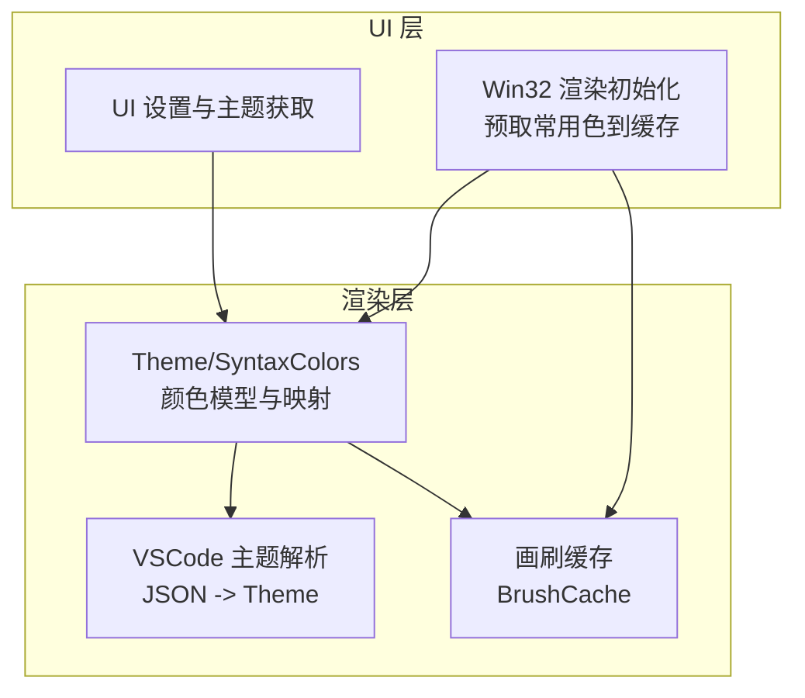
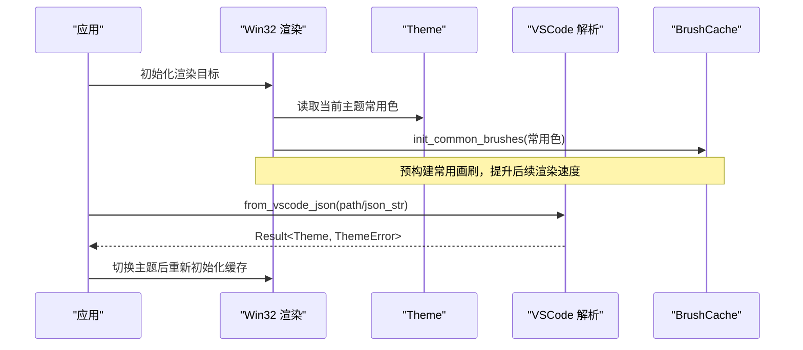
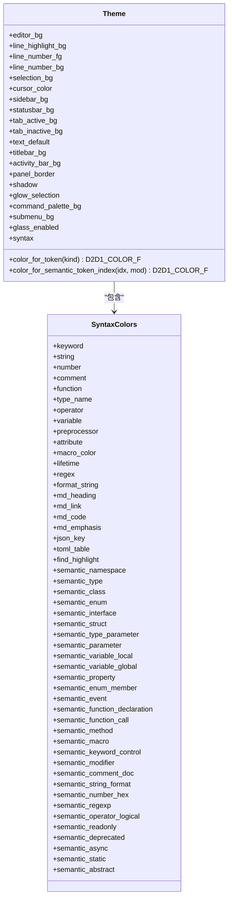
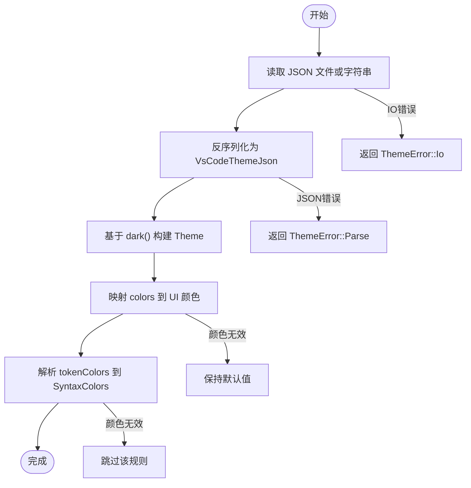
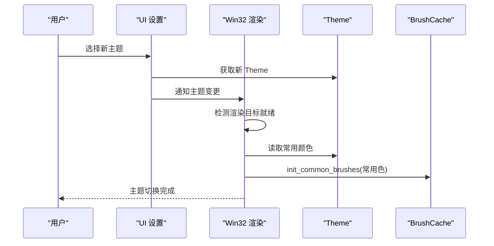
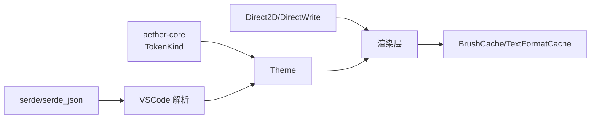

# 主题系统

<cite>
**本文引用的文件**
- [crates/aether-render/src/theme.rs](file://crates/aether-render/src/theme.rs)
- [crates/aether-render/src/vscode_theme.rs](file://crates/aether-render/src/vscode_theme.rs)
- [crates/aether-ui/src/theme.rs](file://crates/aether-ui/src/theme.rs)
- [crates/aether-win32/src/theme.rs](file://crates/aether-win32/src/theme.rs)
- [crates/aether-render/src/d2d/brush_cache.rs](file://crates/aether-render/src/d2d/brush_cache.rs)
- [crates/aether-win32/src/render/mod.rs](file://crates/aether-win32/src/render/mod.rs)
</cite>

## 目录
1. [简介](#简介)
2. [项目结构](#项目结构)
3. [核心组件](#核心组件)
4. [架构总览](#架构总览)
5. [详细组件分析](#详细组件分析)
6. [依赖关系分析](#依赖关系分析)
7. [性能考量](#性能考量)
8. [故障排查指南](#故障排查指南)
9. [结论](#结论)
10. [附录：开发指南与最佳实践](#附录开发指南与最佳实践)

## 简介
本技术文档围绕“主题系统”展开，系统性阐述颜色模型、字体配置、样式继承机制；详细说明 VSCode 主题格式的解析与转换（JSON 配置文件处理、颜色映射与规则应用）；文档化主题切换的实现（动态加载、缓存机制与性能优化）；解释自定义主题的创建方法（颜色方案定义、语法高亮规则、UI 元素样式）；并提供具体代码示例路径以展示如何定义主题、应用样式和动态切换主题；最后给出主题开发指南、兼容性处理与回退机制。

## 项目结构
主题系统主要分布在渲染层与 UI 层：
- 渲染层主题模型与 VSCode 主题解析：aether-render
- UI 层主题访问器：aether-ui、aether-win32
- 渲染资源缓存：aether-render/d2d/brush_cache.rs
- 渲染上下文初始化与主题色预取：aether-win32/render/mod.rs

图表来源
- [crates/aether-render/src/theme.rs:8-86](file://crates/aether-render/src/theme.rs#L8-L86)
- [crates/aether-render/src/vscode_theme.rs:12-31](file://crates/aether-render/src/vscode_theme.rs#L12-L31)
- [crates/aether-render/src/d2d/brush_cache.rs:24-34](file://crates/aether-render/src/d2d/brush_cache.rs#L24-L34)
- [crates/aether-win32/src/render/mod.rs:174-204](file://crates/aether-win32/src/render/mod.rs#L174-L204)

章节来源
- [crates/aether-render/src/theme.rs:8-86](file://crates/aether-render/src/theme.rs#L8-L86)
- [crates/aether-render/src/vscode_theme.rs:12-31](file://crates/aether-render/src/vscode_theme.rs#L12-L31)
- [crates/aether-render/src/d2d/brush_cache.rs:24-34](file://crates/aether-render/src/d2d/brush_cache.rs#L24-L34)
- [crates/aether-win32/src/render/mod.rs:174-204](file://crates/aether-win32/src/render/mod.rs#L174-L204)

## 核心组件
- 主题数据模型：包含编辑器背景、行号、选择区、光标、侧边栏、状态栏、标签页、标题栏、面板边框、阴影、命令面板、子菜单等颜色字段，以及语法高亮颜色集合与玻璃效果开关。
- 语法颜色集合：覆盖关键字、字符串、数字、注释、函数、类型名、操作符、变量、预处理、属性、宏、生命周期、正则、格式化字符串、Markdown 相关、JSON/TOML 特定、查找高亮及语义令牌颜色。
- VSCode 主题解析：将 VSCode 的 JSON 主题文件解析为内部 Theme，支持 colors、tokenColors、可选 semanticTokenColors 等字段，并具备错误类型与显示实现。
- 画刷缓存：避免每帧创建 COM 对象，采用预存数组 + HashMap 的回退策略，限制最大条目数防止无界增长。
- 渲染初始化：在渲染目标就绪后，从当前主题提取常用颜色并预构建画刷，同时初始化文本格式缓存与图标几何，减少首帧卡顿。

章节来源
- [crates/aether-render/src/theme.rs:8-86](file://crates/aether-render/src/theme.rs#L8-L86)
- [crates/aether-render/src/vscode_theme.rs:12-31](file://crates/aether-render/src/vscode_theme.rs#L12-L31)
- [crates/aether-render/src/d2d/brush_cache.rs:24-34](file://crates/aether-render/src/d2d/brush_cache.rs#L24-L34)
- [crates/aether-win32/src/render/mod.rs:174-204](file://crates/aether-win32/src/render/mod.rs#L174-L204)

## 架构总览
主题系统采用分层设计：
- 数据层：Theme 与 SyntaxColors 定义颜色与映射关系。
- 解析层：VsCodeThemeJson 与解析函数将外部 JSON 转换为内部 Theme。
- 渲染层：BrushCache 与 TextFormatCache 提供高性能绘制资源。
- 集成层：Win32 渲染模块在渲染目标就绪时预取主题色并初始化缓存。

图表来源
- [crates/aether-win32/src/render/mod.rs:174-204](file://crates/aether-win32/src/render/mod.rs#L174-L204)
- [crates/aether-render/src/vscode_theme.rs:103-117](file://crates/aether-render/src/vscode_theme.rs#L103-L117)
- [crates/aether-render/src/d2d/brush_cache.rs:50-65](file://crates/aether-render/src/d2d/brush_cache.rs#L50-L65)

## 详细组件分析

### 颜色模型与样式继承
- 颜色模型：使用 D2D1_COLOR_F（RGBA 浮点）表示颜色，统一在渲染层进行绘制。
- 样式继承：Theme::color_for_token 将 TokenKind 映射到 SyntaxColors 中的对应颜色；未匹配或空白/未知 token 回退到 text_default。
- 语义令牌：通过 color_for_semantic_token_index 将语义令牌索引映射到语义颜色字段，超出范围回退到 text_default。

图表来源
- [crates/aether-render/src/theme.rs:8-86](file://crates/aether-render/src/theme.rs#L8-L86)
- [crates/aether-render/src/theme.rs:246-278](file://crates/aether-render/src/theme.rs#L246-L278)
- [crates/aether-render/src/theme.rs:213-244](file://crates/aether-render/src/theme.rs#L213-L244)

章节来源
- [crates/aether-render/src/theme.rs:8-86](file://crates/aether-render/src/theme.rs#L8-L86)
- [crates/aether-render/src/theme.rs:213-278](file://crates/aether-render/src/theme.rs#L213-L278)

### VSCode 主题格式解析与转换
- 数据结构：VsCodeThemeJson 包含 name、type、colors、tokenColors、semanticHighlighting、semanticTokenColors。
- 解析流程：from_vscode_json/from_vscode_json_str 读取并反序列化为 VsCodeThemeJson，再调用 from_vscode 构建 Theme。
- 颜色映射：colors 键值映射到 Theme 的 UI 颜色字段；tokenColors 通过 parse_syntax_colors 映射到 SyntaxColors。
- 颜色解析：parse_hex_color 支持 #RGB、#RRGGBB、#RRGGBBAA，非法输入返回 ThemeError::InvalidColor。
- 回退机制：当缺少字段或颜色无效时，保持 dark 默认值。

图表来源
- [crates/aether-render/src/vscode_theme.rs:103-117](file://crates/aether-render/src/vscode_theme.rs#L103-L117)
- [crates/aether-render/src/vscode_theme.rs:120-175](file://crates/aether-render/src/vscode_theme.rs#L120-L175)
- [crates/aether-render/src/vscode_theme.rs:178-234](file://crates/aether-render/src/vscode_theme.rs#L178-L234)
- [crates/aether-render/src/vscode_theme.rs:236-281](file://crates/aether-render/src/vscode_theme.rs#L236-L281)

章节来源
- [crates/aether-render/src/vscode_theme.rs:12-31](file://crates/aether-render/src/vscode_theme.rs#L12-L31)
- [crates/aether-render/src/vscode_theme.rs:103-175](file://crates/aether-render/src/vscode_theme.rs#L103-L175)
- [crates/aether-render/src/vscode_theme.rs:178-281](file://crates/aether-render/src/vscode_theme.rs#L178-L281)

### 主题切换与动态加载
- 动态加载：通过 from_vscode_json/from_vscode_json_str 可在运行时加载新主题。
- 缓存机制：主题切换后，Win32 渲染模块在渲染目标就绪时重新初始化 BrushCache 与 TextFormatCache，确保新主题颜色立即生效。
- 性能优化：预取常用颜色到 BrushCache，减少每帧创建 COM 对象的开销；限制缓存条目数量，避免内存膨胀。

图表来源
- [crates/aether-ui/src/theme.rs:17-25](file://crates/aether-ui/src/theme.rs#L17-L25)
- [crates/aether-win32/src/render/mod.rs:174-204](file://crates/aether-win32/src/render/mod.rs#L174-L204)
- [crates/aether-render/src/d2d/brush_cache.rs:50-65](file://crates/aether-render/src/d2d/brush_cache.rs#L50-L65)

章节来源
- [crates/aether-ui/src/theme.rs:17-25](file://crates/aether-ui/src/theme.rs#L17-L25)
- [crates/aether-win32/src/render/mod.rs:174-204](file://crates/aether-win32/src/render/mod.rs#L174-L204)
- [crates/aether-render/src/d2d/brush_cache.rs:50-65](file://crates/aether-render/src/d2d/brush_cache.rs#L50-L65)

### 自定义主题创建方法
- 颜色方案定义：在 VSCode 主题 JSON 中定义 colors 键值对，如 editor.background、editor.foreground、statusBar.background 等。
- 语法高亮规则：在 tokenColors 中定义 scope 与 settings.foreground，支持单个或多个 scope。
- UI 元素样式：扩展 keys 如 titleBar.activeBackground、activityBar.background、sideBar.border、dropdown.background、menu.background 以适配玻璃主题。
- 应用与切换：通过 from_vscode_json/from_vscode_json_str 加载主题，并在渲染目标就绪时刷新缓存。

章节来源
- [crates/aether-render/src/vscode_theme.rs:120-175](file://crates/aether-render/src/vscode_theme.rs#L120-L175)
- [crates/aether-render/src/vscode_theme.rs:178-234](file://crates/aether-render/src/vscode_theme.rs#L178-L234)
- [crates/aether-render/src/vscode_theme.rs:103-117](file://crates/aether-render/src/vscode_theme.rs#L103-L117)

### 代码示例路径
- 定义主题：参考 VSCode 主题 JSON 结构与解析逻辑
  - [crates/aether-render/src/vscode_theme.rs:12-31](file://crates/aether-render/src/vscode_theme.rs#L12-L31)
  - [crates/aether-render/src/vscode_theme.rs:120-175](file://crates/aether-render/src/vscode_theme.rs#L120-L175)
- 应用样式：通过 Theme::color_for_token 与 color_for_semantic_token_index 获取颜色
  - [crates/aether-render/src/theme.rs:213-278](file://crates/aether-render/src/theme.rs#L213-L278)
- 动态切换主题：从 JSON 文件或字符串加载并刷新缓存
  - [crates/aether-render/src/vscode_theme.rs:103-117](file://crates/aether-render/src/vscode_theme.rs#L103-L117)
  - [crates/aether-win32/src/render/mod.rs:174-204](file://crates/aether-win32/src/render/mod.rs#L174-L204)

## 依赖关系分析
- Theme 依赖 aether_core::lexer::TokenKind 进行 token 到颜色的映射。
- VSCode 主题解析依赖 serde/serde_json 进行 JSON 反序列化。
- 渲染层依赖 Direct2D/DirectWrite 进行绘制与文本布局。
- Win32 渲染模块依赖 BrushCache 与 TextFormatCache 进行资源缓存。

图表来源
- [crates/aether-render/src/theme.rs:1-5](file://crates/aether-render/src/theme.rs#L1-L5)
- [crates/aether-render/src/vscode_theme.rs:1-8](file://crates/aether-render/src/vscode_theme.rs#L1-L8)
- [crates/aether-render/src/d2d/brush_cache.rs:1-13](file://crates/aether-render/src/d2d/brush_cache.rs#L1-L13)

章节来源
- [crates/aether-render/src/theme.rs:1-5](file://crates/aether-render/src/theme.rs#L1-L5)
- [crates/aether-render/src/vscode_theme.rs:1-8](file://crates/aether-render/src/vscode_theme.rs#L1-L8)
- [crates/aether-render/src/d2d/brush_cache.rs:1-13](file://crates/aether-render/src/d2d/brush_cache.rs#L1-L13)

## 性能考量
- 画刷缓存：预存常用颜色画笔，线性扫描命中率高；HashMap 回退限制最大条目数，避免无界增长。
- 文本格式缓存：按字体大小初始化常用格式，减少重复创建。
- 图标几何缓存：一次性构建 SVG 图标几何，避免首次渲染卡顿。
- 窗口化缓存：编辑器的可见区域缓存与签名校验，减少不必要的高亮计算。

章节来源
- [crates/aether-render/src/d2d/brush_cache.rs:15-22](file://crates/aether-render/src/d2d/brush_cache.rs#L15-L22)
- [crates/aether-render/src/d2d/brush_cache.rs:50-65](file://crates/aether-render/src/d2d/brush_cache.rs#L50-L65)
- [crates/aether-win32/src/render/mod.rs:174-204](file://crates/aether-win32/src/render/mod.rs#L174-L204)

## 故障排查指南
- 颜色解析失败：检查十六进制颜色格式是否合法（#RGB、#RRGGBB、#RRGGBBAA），非法颜色会触发 ThemeError::InvalidColor。
- JSON 解析失败：确认 JSON 结构符合 VsCodeThemeJson 定义，错误类型为 ThemeError::Parse。
- IO 错误：主题文件路径不存在或权限不足，错误类型为 ThemeError::Io。
- 主题回退：当字段缺失或颜色无效时，自动回退到 dark 默认值，确保界面可用。

章节来源
- [crates/aether-render/src/vscode_theme.rs:83-101](file://crates/aether-render/src/vscode_theme.rs#L83-L101)
- [crates/aether-render/src/vscode_theme.rs:236-281](file://crates/aether-render/src/vscode_theme.rs#L236-L281)
- [crates/aether-render/src/vscode_theme.rs:480-505](file://crates/aether-render/src/vscode_theme.rs#L480-L505)

## 结论
主题系统通过清晰的数据模型、健壮的解析器与高效的缓存机制，实现了灵活的 VSCode 主题支持与高性能渲染。颜色模型与样式继承确保了语法高亮的一致性；动态加载与缓存优化保障了主题切换的流畅性；错误处理与回退机制提升了系统的鲁棒性。遵循本文的开发指南与最佳实践，可快速创建与集成自定义主题。

## 附录：开发指南与最佳实践
- 颜色方案定义：
  - 使用标准 VSCode 键值（如 editor.background、editor.foreground）。
  - 可选扩展键值适配玻璃主题（如 titleBar.activeBackground、activityBar.background）。
- 语法高亮规则：
  - 在 tokenColors 中定义 scope 与 foreground。
  - 支持单个或多个 scope，忽略未知或非法颜色。
- 主题切换：
  - 运行时加载 JSON 或字符串，确保渲染目标就绪后刷新缓存。
  - 预取常用颜色到 BrushCache，减少首帧卡顿。
- 兼容性与回退：
  - 缺失字段或非法颜色时回退到 dark 默认值。
  - 语义令牌索引越界时回退到 text_default。
- 性能优化：
  - 限制缓存条目数量，避免内存膨胀。
  - 窗口化缓存与签名校验，减少不必要计算。

章节来源
- [crates/aether-render/src/vscode_theme.rs:120-175](file://crates/aether-render/src/vscode_theme.rs#L120-L175)
- [crates/aether-render/src/vscode_theme.rs:178-234](file://crates/aether-render/src/vscode_theme.rs#L178-L234)
- [crates/aether-render/src/d2d/brush_cache.rs:50-65](file://crates/aether-render/src/d2d/brush_cache.rs#L50-L65)
- [crates/aether-win32/src/render/mod.rs:174-204](file://crates/aether-win32/src/render/mod.rs#L174-L204)