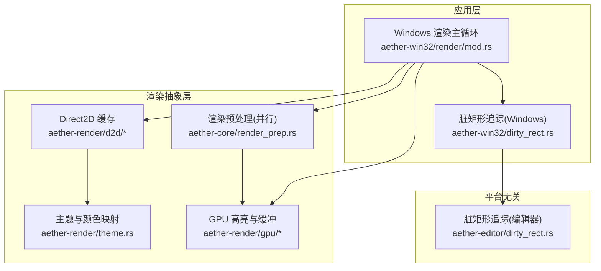
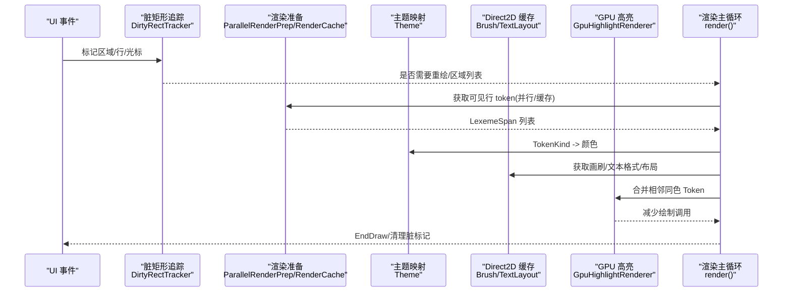
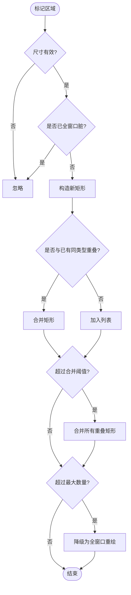
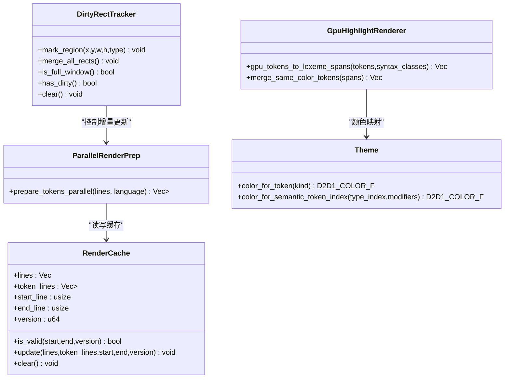
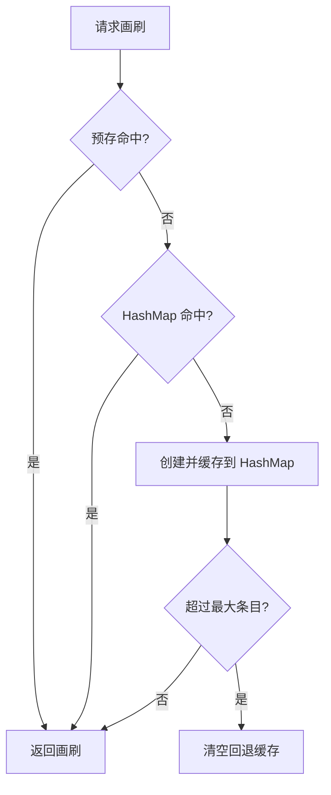
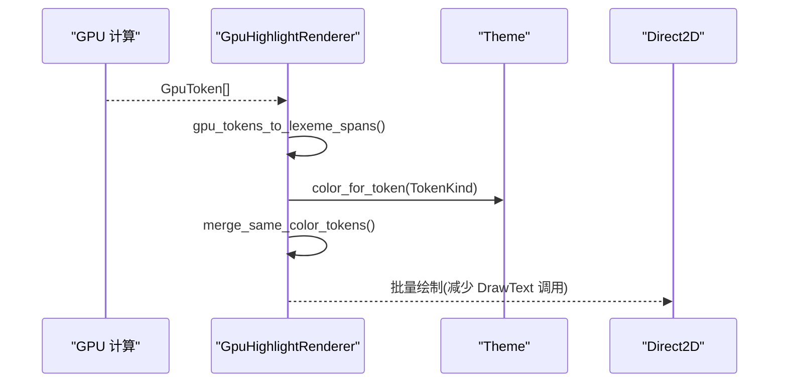
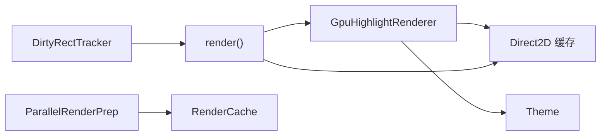

# 渲染优化

<cite>
**本文引用的文件**
- [crates/aether-editor/src/dirty_rect.rs](file://crates/aether-editor/src/dirty_rect.rs)
- [crates/aether-win32/src/dirty_rect.rs](file://crates/aether-win32/src/dirty_rect.rs)
- [crates/aether-render/src/gpu/render.rs](file://crates/aether-render/src/gpu/render.rs)
- [crates/aether-render/src/gpu/buffer.rs](file://crates/aether-render/src/gpu/buffer.rs)
- [crates/aether-render/src/theme.rs](file://crates/aether-render/src/theme.rs)
- [crates/aether-render/src/d2d/brush_cache.rs](file://crates/aether-render/src/d2d/brush_cache.rs)
- [crates/aether-render/src/d2d/text.rs](file://crates/aether-render/src/d2d/text.rs)
- [crates/aether-core/src/render_prep.rs](file://crates/aether-core/src/render_prep.rs)
- [crates/aether-win32/src/render/mod.rs](file://crates/aether-win32/src/render/mod.rs)
- [crates/aether-render/src/gpu/benchmark.rs](file://crates/aether-render/src/gpu/benchmark.rs)
</cite>

## 目录
1. [简介](#简介)
2. [项目结构](#项目结构)
3. [核心组件](#核心组件)
4. [架构总览](#架构总览)
5. [详细组件分析](#详细组件分析)
6. [依赖关系分析](#依赖关系分析)
7. [性能考量](#性能考量)
8. [故障排查指南](#故障排查指南)
9. [结论](#结论)
10. [附录](#附录)

## 简介
本技术文档聚焦“渲染优化模块”，围绕脏矩形算法、增量更新与批量绘制优化，系统阐述渲染准备流程（数据预处理、状态管理、绘制指令生成），并给出性能监控与分析工具、硬件加速策略（GPU 资源管理、纹理压缩、批处理优化）以及跨平台适配建议。文档同时提供可操作的代码路径指引与基准测试方法，帮助读者在实际工程中落地高效渲染循环。

## 项目结构
本项目采用多 crate 分层组织：
- aether-core：通用能力（如并行渲染预处理、词法分析接口）
- aether-render：渲染抽象与 GPU/Direct2D 实现（主题、画刷缓存、文本布局缓存、GPU 缓冲区与高亮渲染器）
- aether-editor / aether-win32：编辑器与 Windows 平台集成（脏矩形追踪、渲染主循环、设备丢失恢复等）



图表来源
- [crates/aether-win32/src/render/mod.rs:141-1153](file://crates/aether-win32/src/render/mod.rs#L141-L1153)
- [crates/aether-win32/src/dirty_rect.rs:1-707](file://crates/aether-win32/src/dirty_rect.rs#L1-L707)
- [crates/aether-editor/src/dirty_rect.rs:1-707](file://crates/aether-editor/src/dirty_rect.rs#L1-L707)
- [crates/aether-core/src/render_prep.rs:1-194](file://crates/aether-core/src/render_prep.rs#L1-L194)
- [crates/aether-render/src/theme.rs:1-487](file://crates/aether-render/src/theme.rs#L1-L487)
- [crates/aether-render/src/d2d/brush_cache.rs:1-558](file://crates/aether-render/src/d2d/brush_cache.rs#L1-L558)
- [crates/aether-render/src/gpu/render.rs:1-220](file://crates/aether-render/src/gpu/render.rs#L1-L220)

章节来源
- [crates/aether-win32/src/render/mod.rs:141-1153](file://crates/aether-win32/src/render/mod.rs#L141-L1153)
- [crates/aether-core/src/render_prep.rs:1-194](file://crates/aether-core/src/render_prep.rs#L1-L194)

## 核心组件
- 脏矩形追踪与区域合并：在编辑器与 Windows 层均实现 DirtyRectTracker，支持按区域类型标记、重叠合并、阈值降级为全窗口重绘。
- 渲染命令推断：根据状态变化（光标、选择、滚动、侧边栏/面板更新等）推断最小必要重绘范围，避免无变化时的 FullRedraw。
- 渲染准备与缓存：并行预处理可见行 token，结合 RenderCache 减少重复计算；Direct2D 侧通过 BrushCache、TextFormatCache、TextLayoutCache 降低 COM 对象创建开销。
- GPU 高亮与缓冲：将 GPU 生成的 Token 转换为 LexemeSpan，合并相邻同色 Token 减少 DrawText 调用；使用 DoubleBuffer 与 GpuBufferPool 复用 GPU 缓冲。
- 主题与颜色映射：统一 TokenKind 到 D2D1_COLOR_F 的映射，支持语义 token 颜色索引。

章节来源
- [crates/aether-editor/src/dirty_rect.rs:1-707](file://crates/aether-editor/src/dirty_rect.rs#L1-L707)
- [crates/aether-win32/src/dirty_rect.rs:1-707](file://crates/aether-win32/src/dirty_rect.rs#L1-L707)
- [crates/aether-core/src/render_prep.rs:1-194](file://crates/aether-core/src/render_prep.rs#L1-L194)
- [crates/aether-render/src/d2d/brush_cache.rs:1-558](file://crates/aether-render/src/d2d/brush_cache.rs#L1-L558)
- [crates/aether-render/src/gpu/render.rs:1-220](file://crates/aether-render/src/gpu/render.rs#L1-L220)
- [crates/aether-render/src/theme.rs:1-487](file://crates/aether-render/src/theme.rs#L1-L487)

## 架构总览
渲染管线从 UI 事件驱动的状态变更开始，经脏矩形追踪确定需要重绘的区域，随后进入渲染准备阶段（并行预处理 token、读取缓存），再根据主题与缓存进行 Direct2D/GPU 绘制。渲染主循环负责设备丢失恢复、帧末清理与性能统计。



图表来源
- [crates/aether-win32/src/render/mod.rs:141-1153](file://crates/aether-win32/src/render/mod.rs#L141-L1153)
- [crates/aether-core/src/render_prep.rs:1-194](file://crates/aether-core/src/render_prep.rs#L1-L194)
- [crates/aether-render/src/theme.rs:1-487](file://crates/aether-render/src/theme.rs#L1-L487)
- [crates/aether-render/src/d2d/brush_cache.rs:1-558](file://crates/aether-render/src/d2d/brush_cache.rs#L1-L558)
- [crates/aether-render/src/gpu/render.rs:1-220](file://crates/aether-render/src/gpu/render.rs#L1-L220)

## 详细组件分析

### 脏矩形算法与增量更新
- 区域类型与合并：DirtyRegionType 覆盖标题栏、菜单栏、活动栏、侧边栏、编辑器内容、标签栏、状态栏、右侧/底部面板、查找替换、对话框、全窗口。DirtyRect 支持 intersects、merge、contains，用于快速判断与合并。
- 追踪器策略：DirtyRectTracker 维护 rects 列表与 full_window_dirty 标志；mark_region 会跳过无效尺寸、忽略已有全窗口标记、对同类型重叠区域进行合并；当 rects 数量超过 merge_threshold 时触发 merge_all_rects；超过 max_rects 则降级为全窗口重绘。
- 便捷标记：mark_editor_line、mark_cursor、mark_status_bar 简化常见场景；is_*_dirty 系列方法提供区域级查询。
- 渲染命令推断：RenderCommand::infer_from_state 根据状态位推断最小重绘范围，无变化时返回 None，避免 FullRedraw。



图表来源
- [crates/aether-editor/src/dirty_rect.rs:120-162](file://crates/aether-editor/src/dirty_rect.rs#L120-L162)
- [crates/aether-editor/src/dirty_rect.rs:336-356](file://crates/aether-editor/src/dirty_rect.rs#L336-L356)
- [crates/aether-editor/src/dirty_rect.rs:368-426](file://crates/aether-editor/src/dirty_rect.rs#L368-L426)

章节来源
- [crates/aether-editor/src/dirty_rect.rs:1-707](file://crates/aether-editor/src/dirty_rect.rs#L1-L707)
- [crates/aether-win32/src/dirty_rect.rs:1-707](file://crates/aether-win32/src/dirty_rect.rs#L1-L707)

### 渲染准备流程（数据预处理、状态管理、绘制指令生成）
- 并行预处理：ParallelRenderPrep 使用 rayon 对可见行进行并行 token 分析，行数较少或线程数不足时回退单线程；RenderCache 缓存可见行文本与 token_lines，基于 start/end line 与 version 失效检测。
- 状态管理：DirtyRectTracker 维护当前帧脏区域与全窗口标记；渲染主循环在 EndDraw 成功后清除脏标记，失败时保留全窗口脏标记以立即恢复。
- 绘制指令生成：GpuHighlightRenderer 将 GPU Token 转为 LexemeSpan，并通过 merge_same_color_tokens 合并相邻同色 Token，减少 DrawText 调用次数；Theme 提供 TokenKind 到颜色的映射；Direct2D 缓存（BrushCache、TextFormatCache、TextLayoutCache）避免每帧创建 COM 对象。



图表来源
- [crates/aether-core/src/render_prep.rs:1-194](file://crates/aether-core/src/render_prep.rs#L1-L194)
- [crates/aether-editor/src/dirty_rect.rs:87-366](file://crates/aether-editor/src/dirty_rect.rs#L87-L366)
- [crates/aether-render/src/gpu/render.rs:7-126](file://crates/aether-render/src/gpu/render.rs#L7-L126)
- [crates/aether-render/src/theme.rs:246-279](file://crates/aether-render/src/theme.rs#L246-L279)

章节来源
- [crates/aether-core/src/render_prep.rs:1-194](file://crates/aether-core/src/render_prep.rs#L1-L194)
- [crates/aether-editor/src/dirty_rect.rs:87-366](file://crates/aether-editor/src/dirty_rect.rs#L87-L366)
- [crates/aether-render/src/gpu/render.rs:7-126](file://crates/aether-render/src/gpu/render.rs#L7-L126)
- [crates/aether-render/src/theme.rs:246-279](file://crates/aether-render/src/theme.rs#L246-L279)

### 批量绘制优化与 Direct2D 缓存
- 画刷缓存：BrushCache 预存常用颜色画笔（线性扫描小数组），未命中时回退 FxHashMap；超过 MAX_BRUSH_CACHE_ENTRIES 清空回退缓存，避免无界增长。
- 文本格式缓存：TextFormatCache 预初始化 code/line_number/center 三种常用格式，get_format 顺序：预存数组 → HashMap → 新建；超过条目限制时清空回退缓存。
- 文本布局缓存：TextLayoutCache 采用 young/old 两代淘汰策略，热点布局晋升回 young，消除周期性全清导致的掉帧；字体大小变化时自动清空。
- 文本测量与 DPI：TextRenderer 使用 DirectWrite 实测等宽字符宽度与行高，支持 DPI 缩放与基础字体大小调整。



图表来源
- [crates/aether-render/src/d2d/brush_cache.rs:50-105](file://crates/aether-render/src/d2d/brush_cache.rs#L50-L105)
- [crates/aether-render/src/d2d/brush_cache.rs:128-268](file://crates/aether-render/src/d2d/brush_cache.rs#L128-L268)
- [crates/aether-render/src/d2d/brush_cache.rs:393-470](file://crates/aether-render/src/d2d/brush_cache.rs#L393-L470)
- [crates/aether-render/src/d2d/text.rs:19-153](file://crates/aether-render/src/d2d/text.rs#L19-L153)

章节来源
- [crates/aether-render/src/d2d/brush_cache.rs:1-558](file://crates/aether-render/src/d2d/brush_cache.rs#L1-L558)
- [crates/aether-render/src/d2d/text.rs:1-153](file://crates/aether-render/src/d2d/text.rs#L1-L153)

### GPU 高亮与缓冲管理
- Token 转换与合并：gpu_tokens_to_lexeme_spans 将 GPU Token 转为 LexemeSpan，resolve_token_kind 优先使用语法分类（置信度阈值），否则回退到 token_type_to_kind；merge_same_color_tokens 合并相邻同色 Token 减少绘制调用。
- 双缓冲与池化：DoubleBuffer<T> 实现 CPU/GPU 并行读写；GpuBufferPool 复用 ID3D11Buffer，减少分配/释放成本；GpuBufferManager 提供文本输入、Token 输出、字符分类、计数器缓冲的创建。



图表来源
- [crates/aether-render/src/gpu/render.rs:7-126](file://crates/aether-render/src/gpu/render.rs#L7-L126)
- [crates/aether-render/src/gpu/buffer.rs:1-48](file://crates/aether-render/src/gpu/buffer.rs#L1-L48)
- [crates/aether-render/src/theme.rs:246-279](file://crates/aether-render/src/theme.rs#L246-L279)

章节来源
- [crates/aether-render/src/gpu/render.rs:1-220](file://crates/aether-render/src/gpu/render.rs#L1-L220)
- [crates/aether-render/src/gpu/buffer.rs:1-48](file://crates/aether-render/src/gpu/buffer.rs#L1-L48)

### 渲染主循环与设备丢失恢复
- 主循环职责：检查窗口尺寸与冻结状态、确保渲染目标存在、预初始化常用画刷与文本格式、执行各区域绘制、EndDraw 后清理脏标记；连续失败达到阈值强制重建渲染目标。
- 设备丢失恢复：识别可恢复错误码（设备丢失、显示状态无效），调用 handle_device_lost 重建资源，并清理 IconCache 等。

```mermaid
sequenceDiagram
participant Loop as "render()"
participant Target as "渲染目标"
participant Cache as "缓存(画刷/格式)"
participant DR as "脏矩形"
Loop->>Target : 确保目标存在
Loop->>Cache : 预初始化常用资源
Loop->>DR : 查询脏区域
Loop->>Loop : 绘制各区域
Loop->>Target : EndDraw
alt 成功
Loop->>DR : clear()
else 失败
Loop->>Target : handle_device_lost()
Loop->>Cache : 清理并重建
end
```

图表来源
- [crates/aether-win32/src/render/mod.rs:141-1153](file://crates/aether-win32/src/render/mod.rs#L141-L1153)

章节来源
- [crates/aether-win32/src/render/mod.rs:141-1153](file://crates/aether-win32/src/render/mod.rs#L141-L1153)

## 依赖关系分析
- 耦合与内聚：
  - DirtyRectTracker 与 render() 强耦合（控制增量更新与帧末清理）。
  - ParallelRenderPrep 与 RenderCache 内聚于“渲染准备”职责，解耦于具体绘制后端。
  - GpuHighlightRenderer 依赖 Theme 与 Direct2D 缓存，降低绘制调用次数。
- 外部依赖：
  - Direct2D/DirectWrite：画刷、文本格式与布局对象的生命周期由缓存管理。
  - Direct3D11：GPU 缓冲区通过 GpuBufferPool 复用。
  - rayon：并行预处理提高吞吐。
- 潜在循环依赖：
  - 当前结构清晰，未见直接循环导入；注意在新增模块时保持“平台无关逻辑在上层、平台实现在下层”。



图表来源
- [crates/aether-editor/src/dirty_rect.rs:87-366](file://crates/aether-editor/src/dirty_rect.rs#L87-L366)
- [crates/aether-core/src/render_prep.rs:1-194](file://crates/aether-core/src/render_prep.rs#L1-L194)
- [crates/aether-render/src/gpu/render.rs:7-126](file://crates/aether-render/src/gpu/render.rs#L7-L126)
- [crates/aether-render/src/d2d/brush_cache.rs:1-558](file://crates/aether-render/src/d2d/brush_cache.rs#L1-L558)
- [crates/aether-win32/src/render/mod.rs:141-1153](file://crates/aether-win32/src/render/mod.rs#L141-L1153)

章节来源
- [crates/aether-editor/src/dirty_rect.rs:87-366](file://crates/aether-editor/src/dirty_rect.rs#L87-L366)
- [crates/aether-core/src/render_prep.rs:1-194](file://crates/aether-core/src/render_prep.rs#L1-L194)
- [crates/aether-render/src/gpu/render.rs:7-126](file://crates/aether-render/src/gpu/render.rs#L7-L126)
- [crates/aether-render/src/d2d/brush_cache.rs:1-558](file://crates/aether-render/src/d2d/brush_cache.rs#L1-L558)
- [crates/aether-win32/src/render/mod.rs:141-1153](file://crates/aether-win32/src/render/mod.rs#L141-L1153)

## 性能考量
- 帧率与吞吐：
  - 使用 LexerBenchmark 对比 GPU/CPU/tree-sitter 方案，统计平均/最小/最大耗时、MB/s、ms/行与加速比。
  - 在 render() 中记录关键阶段耗时（可选 tracing trace），结合脏矩形数量评估增量更新效果。
- 内存与对象分配：
  - BrushCache/TextFormatCache/TextLayoutCache 显著减少 COM 对象创建；两代淘汰避免周期性全清导致的抖动。
  - GpuBufferPool 复用 ID3D11Buffer，降低 GPU 内存分配压力。
- 瓶颈识别：
  - 若 rects 数量频繁超过 max_rects，考虑增大阈值或优化区域粒度。
  - 若 merge_same_color_tokens 收益低，检查 Token 粒度与相邻合并条件。
  - 若 EndDraw 失败频繁，关注设备丢失与资源重建路径。
- 优化建议：
  - 合理设置 merge_threshold 与 max_rects，平衡局部更新与全量重绘。
  - 预初始化常用颜色与文本格式，提升命中率。
  - 对大文件启用并行预处理，但需评估线程数与任务粒度。
  - 使用 DoubleBuffer 实现 CPU/GPU 并行，避免等待。

[本节为通用指导，不直接分析具体文件]

## 故障排查指南
- 设备丢失与渲染目标失效：
  - 识别可恢复错误码（设备丢失、显示状态无效），调用 handle_device_lost 重建资源；连续失败达到阈值强制重建，防止窗口永久冻结。
- 脏标记未清理：
  - 确认 EndDraw 成功后调用 dirty_tracker.clear()；失败帧保留全窗口脏标记以立即恢复。
- 文本渲染异常：
  - 检查 TextLayoutCache 字体大小变化时是否清空；确认 measure_monospace_width 与布局创建一致（不含 null 终止符）。
- 性能抖动：
  - 观察 BrushCache/TextFormatCache 是否超过最大条目并触发清空；必要时调优阈值或增加预初始化项。

章节来源
- [crates/aether-win32/src/render/mod.rs:1082-1153](file://crates/aether-win32/src/render/mod.rs#L1082-L1153)
- [crates/aether-render/src/d2d/brush_cache.rs:393-470](file://crates/aether-render/src/d2d/brush_cache.rs#L393-L470)
- [crates/aether-render/src/d2d/text.rs:54-97](file://crates/aether-render/src/d2d/text.rs#L54-L97)

## 结论
本渲染优化模块通过脏矩形算法、并行预处理、Direct2D/GPU 缓存与缓冲池化，实现了高效的增量更新与批量绘制。渲染主循环具备设备丢失恢复能力，配合性能基准工具可持续定位瓶颈并优化。建议在工程实践中结合脏矩形数量、绘制调用次数与对象分配情况，动态调整阈值与缓存策略，以获得稳定流畅的用户体验。

[本节为总结性内容，不直接分析具体文件]

## 附录
- 高效渲染循环示例（代码路径指引）：
  - 渲染主循环入口与设备丢失恢复：[crates/aether-win32/src/render/mod.rs:141-1153](file://crates/aether-win32/src/render/mod.rs#L141-L1153)
  - 脏矩形标记与命令推断：[crates/aether-editor/src/dirty_rect.rs:120-426](file://crates/aether-editor/src/dirty_rect.rs#L120-L426)
  - 并行预处理与缓存：[crates/aether-core/src/render_prep.rs:1-194](file://crates/aether-core/src/render_prep.rs#L1-L194)
  - Direct2D 缓存与文本测量：[crates/aether-render/src/d2d/brush_cache.rs:50-470](file://crates/aether-render/src/d2d/brush_cache.rs#L50-L470), [crates/aether-render/src/d2d/text.rs:19-153](file://crates/aether-render/src/d2d/text.rs#L19-L153)
  - GPU 高亮与缓冲复用：[crates/aether-render/src/gpu/render.rs:7-220](file://crates/aether-render/src/gpu/render.rs#L7-L220), [crates/aether-render/src/gpu/buffer.rs:1-48](file://crates/aether-render/src/gpu/buffer.rs#L1-L48)
- 性能基准测试（代码路径指引）：
  - 基准框架与报告输出：[crates/aether-render/src/gpu/benchmark.rs:1-287](file://crates/aether-render/src/gpu/benchmark.rs#L1-L287)

[本节为附录，不直接分析具体文件]