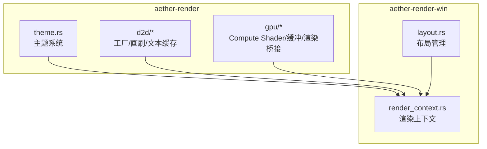
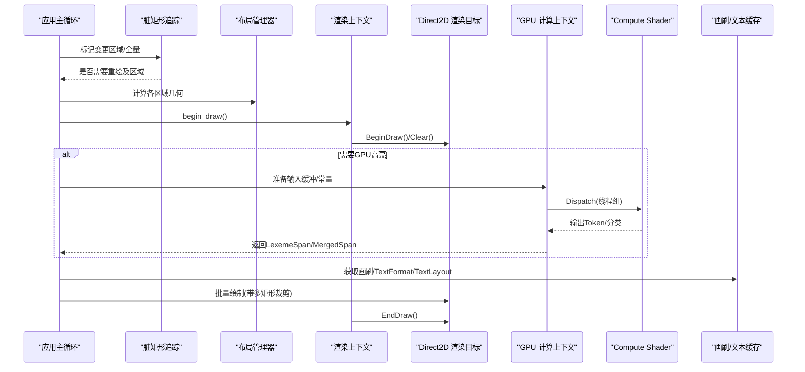
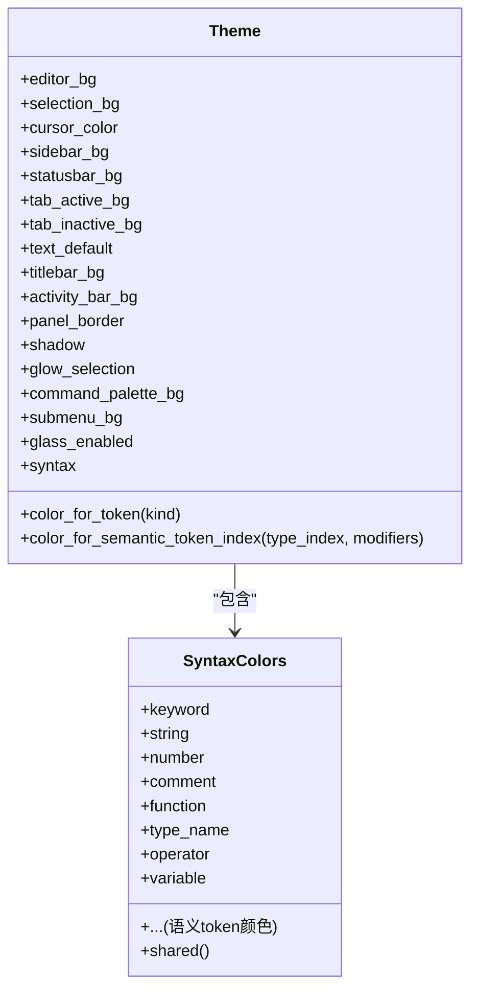
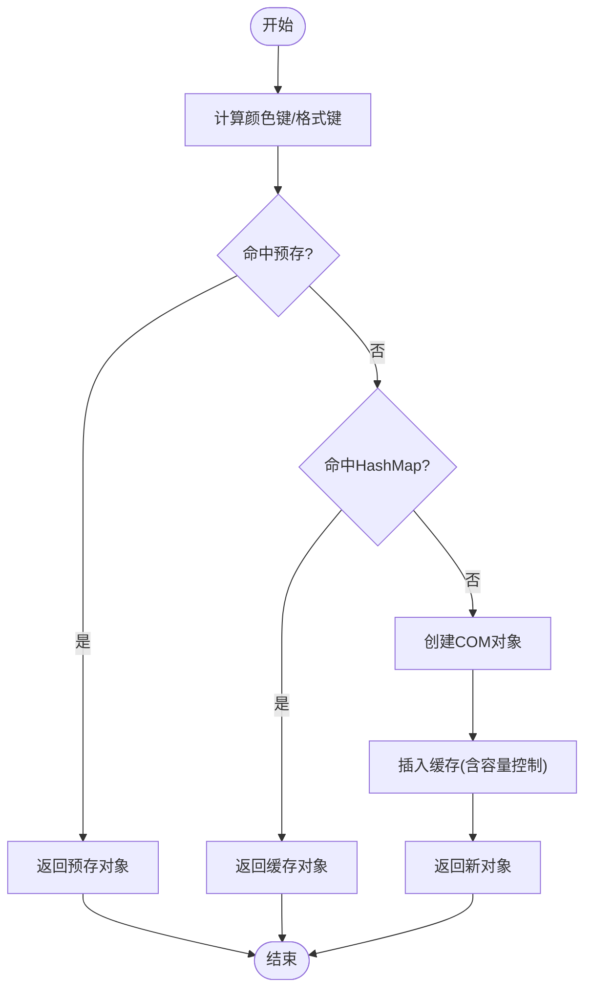
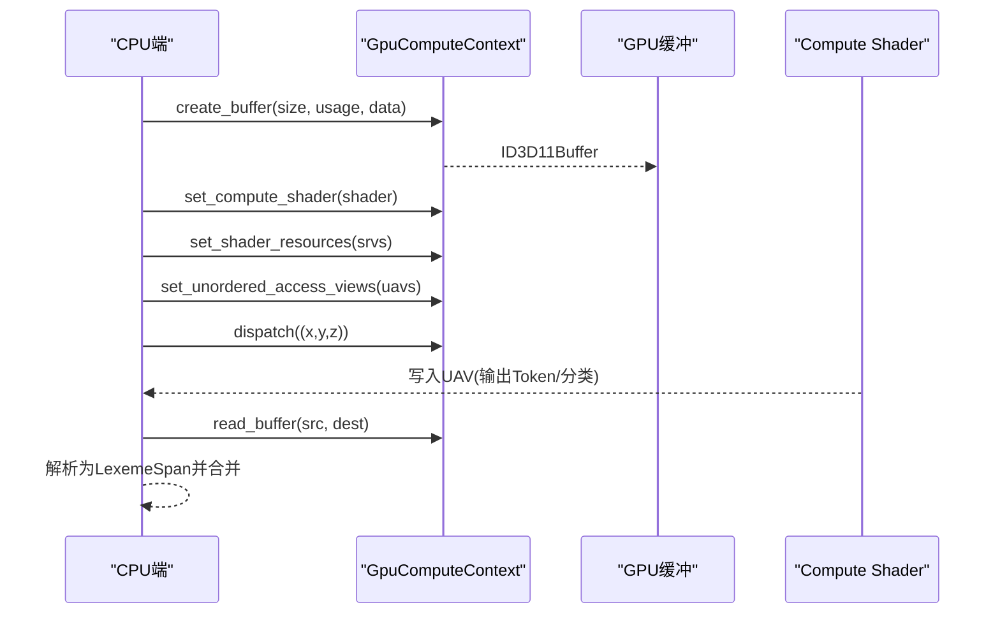
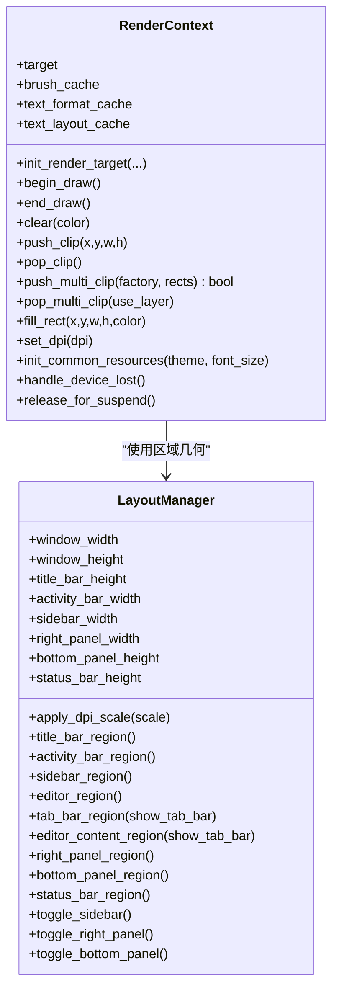
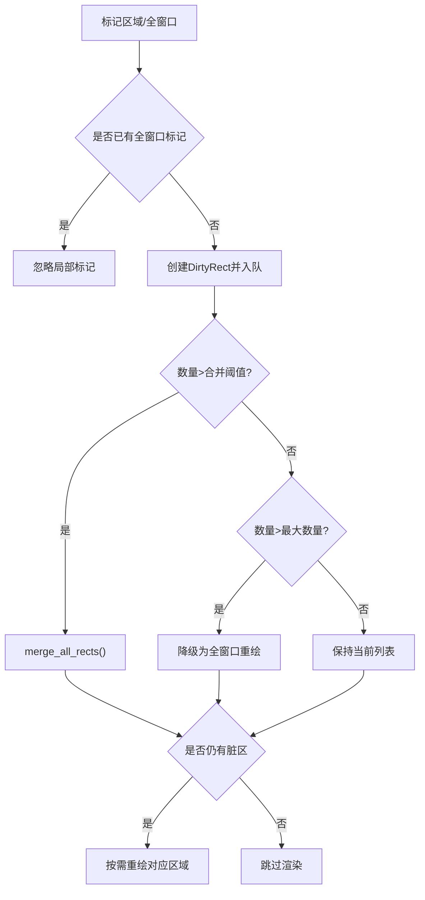
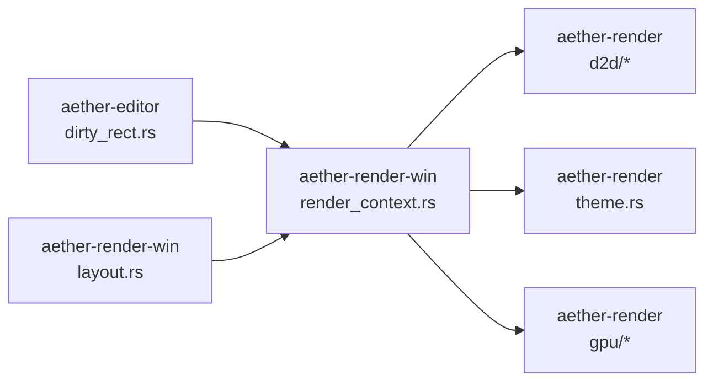

# 渲染引擎

<cite>
**本文引用的文件**
- [crates/aether-render/src/lib.rs](file://crates/aether-render/src/lib.rs)
- [crates/aether-render/src/theme.rs](file://crates/aether-render/src/theme.rs)
- [crates/aether-render/src/d2d/mod.rs](file://crates/aether-render/src/d2d/mod.rs)
- [crates/aether-render/src/d2d/factory.rs](file://crates/aether-render/src/d2d/factory.rs)
- [crates/aether-render/src/d2d/brush_cache.rs](file://crates/aether-render/src/d2d/brush_cache.rs)
- [crates/aether-render/src/gpu/mod.rs](file://crates/aether-render/src/gpu/mod.rs)
- [crates/aether-render/src/gpu/render.rs](file://crates/aether-render/src/gpu/render.rs)
- [crates/aether-render/src/gpu/compute_context.rs](file://crates/aether-render/src/gpu/compute_context.rs)
- [crates/aether-render/src/gpu/shader.rs](file://crates/aether-render/src/gpu/shader.rs)
- [crates/aether-render/src/gpu/buffer.rs](file://crates/aether-render/src/gpu/buffer.rs)
- [crates/aether-render-win/src/render_context.rs](file://crates/aether-render-win/src/render_context.rs)
- [crates/aether-render-win/src/layout.rs](file://crates/aether-render-win/src/layout.rs)
- [crates/aether-editor/src/dirty_rect.rs](file://crates/aether-editor/src/dirty_rect.rs)
</cite>

## 目录
1. [简介](#简介)
2. [项目结构](#项目结构)
3. [核心组件](#核心组件)
4. [架构总览](#架构总览)
5. [详细组件分析](#详细组件分析)
6. [依赖关系分析](#依赖关系分析)
7. [性能考量](#性能考量)
8. [故障排查指南](#故障排查指南)
9. [结论](#结论)
10. [附录](#附录)

## 简介
本技术文档面向“牧羊人编辑器”的渲染子系统，系统性阐述 Direct2D/DirectWrite 自绘 UI 管线、GPU 加速（Compute Shader）语法高亮与着色、主题系统、脏矩形优化算法，以及跨平台与浏览器支持的注意事项。文档提供数据流图与组件交互图，并给出可定位的代码片段路径，便于开发者深入理解与二次开发。

## 项目结构
渲染子系统由两个主要 crate 组成：
- aether-render：跨平台渲染抽象与 GPU 计算管线（DirectX 11 Compute Shader），包含主题、画刷缓存、文本格式缓存、GPU 缓冲区与着色器编译等。
- aether-render-win：Windows 平台适配层，封装 Direct2D 渲染目标、布局管理与渲染上下文。

图表来源
- [crates/aether-render/src/lib.rs:1-5](file://crates/aether-render/src/lib.rs#L1-L5)
- [crates/aether-render/src/d2d/mod.rs:1-5](file://crates/aether-render/src/d2d/mod.rs#L1-L5)
- [crates/aether-render/src/gpu/mod.rs:1-10](file://crates/aether-render/src/gpu/mod.rs#L1-L10)
- [crates/aether-render-win/src/render_context.rs:1-20](file://crates/aether-render-win/src/render_context.rs#L1-L20)
- [crates/aether-render-win/src/layout.rs:222-254](file://crates/aether-render-win/src/layout.rs#L222-L254)

章节来源
- [crates/aether-render/src/lib.rs:1-5](file://crates/aether-render/src/lib.rs#L1-L5)
- [crates/aether-render/src/d2d/mod.rs:1-5](file://crates/aether-render/src/d2d/mod.rs#L1-L5)
- [crates/aether-render/src/gpu/mod.rs:1-10](file://crates/aether-render/src/gpu/mod.rs#L1-L10)
- [crates/aether-render-win/src/render_context.rs:1-20](file://crates/aether-render-win/src/render_context.rs#L1-L20)
- [crates/aether-render-win/src/layout.rs:222-254](file://crates/aether-render-win/src/layout.rs#L222-L254)

## 核心组件
- 主题系统：集中管理 UI 颜色、语义 token 颜色、毛玻璃开关与默认主题。
- Direct2D 渲染目标与画刷/文本缓存：避免每帧创建 COM 对象，提升绘制性能。
- GPU 计算上下文：封装 D3D11 设备/上下文、缓冲区、着色器加载与调度。
- 渲染上下文（Win）：聚合渲染目标、缓存、裁剪与 DPI 处理，统一对外接口。
- 布局管理器：计算窗口各区域几何，支持 DPI 缩放与面板动画。
- 脏矩形追踪：按区域类型合并与降级策略，减少重绘面积。

章节来源
- [crates/aether-render/src/theme.rs:7-86](file://crates/aether-render/src/theme.rs#L7-L86)
- [crates/aether-render/src/d2d/factory.rs:14-63](file://crates/aether-render/src/d2d/factory.rs#L14-L63)
- [crates/aether-render/src/d2d/brush_cache.rs:24-105](file://crates/aether-render/src/d2d/brush_cache.rs#L24-L105)
- [crates/aether-render/src/gpu/compute_context.rs:17-45](file://crates/aether-render/src/gpu/compute_context.rs#L17-L45)
- [crates/aether-render-win/src/render_context.rs:6-31](file://crates/aether-render-win/src/render_context.rs#L6-L31)
- [crates/aether-render-win/src/layout.rs:222-254](file://crates/aether-render-win/src/layout.rs#L222-L254)
- [crates/aether-editor/src/dirty_rect.rs:87-112](file://crates/aether-editor/src/dirty_rect.rs#L87-L112)

## 架构总览
渲染管线分为两条并行路径：CPU 路径负责 UI 布局与 Direct2D 绘制；GPU 路径负责基于 Compute Shader 的词法分析（字符分类、Token 扫描、关键字查找、语法分类），将结果映射为 Token 区间并用于高亮绘制。

图表来源
- [crates/aether-editor/src/dirty_rect.rs:114-162](file://crates/aether-editor/src/dirty_rect.rs#L114-L162)
- [crates/aether-render-win/src/render_context.rs:65-79](file://crates/aether-render-win/src/render_context.rs#L65-L79)
- [crates/aether-render/src/gpu/compute_context.rs:232-249](file://crates/aether-render/src/gpu/compute_context.rs#L232-L249)
- [crates/aether-render/src/gpu/render.rs:74-126](file://crates/aether-render/src/gpu/render.rs#L74-L126)
- [crates/aether-render/src/d2d/brush_cache.rs:107-138](file://crates/aether-render/src/d2d/brush_cache.rs#L107-L138)

## 详细组件分析

### 主题系统（Theme）
- 职责：定义 UI 基础色、状态栏/侧边栏/标签栏颜色、选择高亮、光标颜色、毛玻璃开关，以及语法高亮与语义 token 颜色。
- 关键能力：
  - 提供 dark/glass 两种预设主题，glass 启用半透明背景与光晕效果。
  - 通过 TokenKind 或语义 token 索引快速映射到对应颜色。
  - 共享 SyntaxColors 构造以复用大量颜色值，降低重复代码。

图表来源
- [crates/aether-render/src/theme.rs:7-86](file://crates/aether-render/src/theme.rs#L7-L86)
- [crates/aether-render/src/theme.rs:148-279](file://crates/aether-render/src/theme.rs#L148-L279)

章节来源
- [crates/aether-render/src/theme.rs:7-86](file://crates/aether-render/src/theme.rs#L7-L86)
- [crates/aether-render/src/theme.rs:148-279](file://crates/aether-render/src/theme.rs#L148-L279)

### Direct2D/DirectWrite 渲染目标与缓存
- 渲染目标：封装 ID2D1HwndRenderTarget，支持 DPI、尺寸调整、轴对齐裁剪与多矩形裁剪（Union GeometryGroup + Layer）。
- 画刷缓存：预存常用颜色画笔，未命中回退到 HashMap，限制最大条目数防止无界增长。
- 文本格式缓存：预存常用 TextFormat（代码/行号/居中），支持测量文本宽度与光标 x 坐标。
- 文本布局缓存：两代淘汰（young/old）策略，字体大小变化时自动清空，避免频繁创建 IDWriteTextLayout。

图表来源
- [crates/aether-render/src/d2d/brush_cache.rs:67-105](file://crates/aether-render/src/d2d/brush_cache.rs#L67-L105)
- [crates/aether-render/src/d2d/brush_cache.rs:225-268](file://crates/aether-render/src/d2d/brush_cache.rs#L225-L268)
- [crates/aether-render/src/d2d/brush_cache.rs:413-464](file://crates/aether-render/src/d2d/brush_cache.rs#L413-L464)

章节来源
- [crates/aether-render/src/d2d/factory.rs:33-162](file://crates/aether-render/src/d2d/factory.rs#L33-L162)
- [crates/aether-render/src/d2d/brush_cache.rs:24-105](file://crates/aether-render/src/d2d/brush_cache.rs#L24-L105)
- [crates/aether-render/src/d2d/brush_cache.rs:107-138](file://crates/aether-render/src/d2d/brush_cache.rs#L107-L138)
- [crates/aether-render/src/d2d/brush_cache.rs:381-464](file://crates/aether-render/src/d2d/brush_cache.rs#L381-L464)

### GPU 加速渲染（Compute Shader）
- 计算上下文：封装 D3D11 设备/上下文，支持创建结构化/读写/暂存缓冲、SRV/UAV、设置并调度 Compute Shader。
- 着色器编译：运行时使用 d3dcompiler_47.dll 将 HLSL 编译为 CSO，并提供便捷入口点。
- 缓冲区管理：提供文本输入、Token 输出、字符分类与计数器缓冲区的创建。
- 渲染桥接：将 GPU 输出的 GpuToken 转换为 LexemeSpan，并按相邻同色合并以减少 DrawText 调用次数。

图表来源
- [crates/aether-render/src/gpu/compute_context.rs:116-206](file://crates/aether-render/src/gpu/compute_context.rs#L116-L206)
- [crates/aether-render/src/gpu/compute_context.rs:232-312](file://crates/aether-render/src/gpu/compute_context.rs#L232-L312)
- [crates/aether-render/src/gpu/shader.rs:22-100](file://crates/aether-render/src/gpu/shader.rs#L22-L100)
- [crates/aether-render/src/gpu/buffer.rs:18-46](file://crates/aether-render/src/gpu/buffer.rs#L18-L46)
- [crates/aether-render/src/gpu/render.rs:7-32](file://crates/aether-render/src/gpu/render.rs#L7-L32)
- [crates/aether-render/src/gpu/render.rs:74-126](file://crates/aether-render/src/gpu/render.rs#L74-L126)

章节来源
- [crates/aether-render/src/gpu/compute_context.rs:17-45](file://crates/aether-render/src/gpu/compute_context.rs#L17-L45)
- [crates/aether-render/src/gpu/compute_context.rs:116-206](file://crates/aether-render/src/gpu/compute_context.rs#L116-L206)
- [crates/aether-render/src/gpu/compute_context.rs:232-312](file://crates/aether-render/src/gpu/compute_context.rs#L232-L312)
- [crates/aether-render/src/gpu/shader.rs:22-100](file://crates/aether-render/src/gpu/shader.rs#L22-L100)
- [crates/aether-render/src/gpu/buffer.rs:18-46](file://crates/aether-render/src/gpu/buffer.rs#L18-L46)
- [crates/aether-render/src/gpu/render.rs:7-32](file://crates/aether-render/src/gpu/render.rs#L7-L32)
- [crates/aether-render/src/gpu/render.rs:74-126](file://crates/aether-render/src/gpu/render.rs#L74-L126)

### Windows 渲染上下文与布局
- 渲染上下文：统一管理 Direct2D 渲染目标、画刷/文本格式/布局缓存，提供 begin/end_draw、clear、push/pop 裁剪、fill_rect、DPI 更新与设备丢失处理。
- 布局管理器：计算标题栏、活动栏、侧边栏、编辑器、标签栏、右侧/底部面板、状态栏的区域，支持 DPI 缩放、面板可见性切换与侧边栏动画。

图表来源
- [crates/aether-render-win/src/render_context.rs:6-31](file://crates/aether-render-win/src/render_context.rs#L6-L31)
- [crates/aether-render-win/src/render_context.rs:33-155](file://crates/aether-render-win/src/render_context.rs#L33-L155)
- [crates/aether-render-win/src/render_context.rs:157-233](file://crates/aether-render-win/src/render_context.rs#L157-L233)
- [crates/aether-render-win/src/layout.rs:222-254](file://crates/aether-render-win/src/layout.rs#L222-L254)
- [crates/aether-render-win/src/layout.rs:316-335](file://crates/aether-render-win/src/layout.rs#L316-L335)
- [crates/aether-render-win/src/layout.rs:337-509](file://crates/aether-render-win/src/layout.rs#L337-L509)
- [crates/aether-render-win/src/layout.rs:540-648](file://crates/aether-render-win/src/layout.rs#L540-L648)

章节来源
- [crates/aether-render-win/src/render_context.rs:6-31](file://crates/aether-render-win/src/render_context.rs#L6-L31)
- [crates/aether-render-win/src/render_context.rs:33-155](file://crates/aether-render-win/src/render_context.rs#L33-L155)
- [crates/aether-render-win/src/render_context.rs:157-233](file://crates/aether-render-win/src/render_context.rs#L157-L233)
- [crates/aether-render-win/src/layout.rs:222-254](file://crates/aether-render-win/src/layout.rs#L222-L254)
- [crates/aether-render-win/src/layout.rs:316-335](file://crates/aether-render-win/src/layout.rs#L316-L335)
- [crates/aether-render-win/src/layout.rs:337-509](file://crates/aether-render-win/src/layout.rs#L337-L509)
- [crates/aether-render-win/src/layout.rs:540-648](file://crates/aether-render-win/src/layout.rs#L540-L648)

### 脏矩形优化算法
- 区域类型：标题栏、菜单栏、活动栏、侧边栏、编辑器内容、标签栏、状态栏、右侧/底部面板、对话框、全窗口。
- 合并策略：同类型相交矩形合并；超过阈值触发全部合并；超过最大数量降级为全窗口重绘。
- 命令推断：根据状态变化（光标移动、选择变化、文本编辑、滚动、侧边栏/面板/状态变化、对话框显示）推断最小重绘范围，无变化时跳过渲染。

图表来源
- [crates/aether-editor/src/dirty_rect.rs:114-162](file://crates/aether-editor/src/dirty_rect.rs#L114-L162)
- [crates/aether-editor/src/dirty_rect.rs:336-365](file://crates/aether-editor/src/dirty_rect.rs#L336-L365)
- [crates/aether-editor/src/dirty_rect.rs:368-426](file://crates/aether-editor/src/dirty_rect.rs#L368-L426)

章节来源
- [crates/aether-editor/src/dirty_rect.rs:87-112](file://crates/aether-editor/src/dirty_rect.rs#L87-L112)
- [crates/aether-editor/src/dirty_rect.rs:114-162](file://crates/aether-editor/src/dirty_rect.rs#L114-L162)
- [crates/aether-editor/src/dirty_rect.rs:336-365](file://crates/aether-editor/src/dirty_rect.rs#L336-L365)
- [crates/aether-editor/src/dirty_rect.rs:368-426](file://crates/aether-editor/src/dirty_rect.rs#L368-L426)

## 依赖关系分析
- aether-render 暴露模块：d2d、gpu、theme、vscode_theme。
- aether-render-win 依赖 aether-render 的 d2d 与 theme，并通过 render_context 聚合资源。
- 布局管理器独立于渲染后端，仅输出几何信息供上层决定绘制区域。
- 脏矩形追踪位于编辑器层，驱动渲染频率与范围。

图表来源
- [crates/aether-render/src/lib.rs:1-5](file://crates/aether-render/src/lib.rs#L1-L5)
- [crates/aether-render-win/src/render_context.rs:1-20](file://crates/aether-render-win/src/render_context.rs#L1-L20)
- [crates/aether-editor/src/dirty_rect.rs:87-112](file://crates/aether-editor/src/dirty_rect.rs#L87-L112)
- [crates/aether-render-win/src/layout.rs:222-254](file://crates/aether-render-win/src/layout.rs#L222-L254)

章节来源
- [crates/aether-render/src/lib.rs:1-5](file://crates/aether-render/src/lib.rs#L1-L5)
- [crates/aether-render-win/src/render_context.rs:1-20](file://crates/aether-render-win/src/render_context.rs#L1-L20)
- [crates/aether-editor/src/dirty_rect.rs:87-112](file://crates/aether-editor/src/dirty_rect.rs#L87-L112)
- [crates/aether-render-win/src/layout.rs:222-254](file://crates/aether-render-win/src/layout.rs#L222-L254)

## 性能考量
- 画刷与文本格式/布局缓存：显著减少 COM 对象创建与销毁开销，热点条目优先存活。
- 多矩形裁剪：使用 GeometryGroup + PushLayer 实现精确裁剪，避免包围盒膨胀导致的过度绘制。
- GPU 词法分析：Compute Shader 并行处理字符分类与 Token 扫描，结合 MergedSpan 合并减少 DrawText 调用。
- 脏矩形合并与降级：在高频小区域变更时保持高效，极端情况下回退到全窗口重绘保证稳定性。
- 双缓冲与缓冲区池：避免 CPU/GPU 同步等待，复用 GPU 缓冲区降低分配成本。

[本节为通用性能指导，不直接分析具体文件]

## 故障排查指南
- 设备丢失：调用 handle_device_lost/release_for_suspend 清理渲染目标与缓存，随后重建。
- 着色器编译失败：检查 d3dcompiler_47.dll 可用性、HLSL 源码与目标模型（cs_5_0），查看错误日志。
- 多矩形裁剪失效：确认 push_multi_clip 返回标志与 pop_multi_clip 匹配；单矩形走快路径时使用 PopAxisAlignedClip。
- 文本位置偏差：确保 TextLayout 创建不含 null 终止符，与测量函数保持一致。
- 内存泄漏：注意 BrushCache/TextLayoutCache 的最大条目限制与清空时机，避免无界增长。

章节来源
- [crates/aether-render-win/src/render_context.rs:219-233](file://crates/aether-render-win/src/render_context.rs#L219-L233)
- [crates/aether-render/src/gpu/shader.rs:22-80](file://crates/aether-render/src/gpu/shader.rs#L22-L80)
- [crates/aether-render/src/d2d/factory.rs:164-273](file://crates/aether-render/src/d2d/factory.rs#L164-L273)
- [crates/aether-render/src/d2d/brush_cache.rs:413-464](file://crates/aether-render/src/d2d/brush_cache.rs#L413-L464)

## 结论
该渲染引擎通过 Direct2D/DirectWrite 自绘 UI 与 DirectX 11 Compute Shader 协同工作，实现了高性能的语法高亮与流畅的界面渲染。主题系统提供灵活的视觉配置，脏矩形优化有效减少重绘开销。建议在大规模文本编辑场景下优先启用 GPU 词法分析与缓存策略，并结合多矩形裁剪与双缓冲以获得最佳性能。

[本节为总结性内容，不直接分析具体文件]

## 附录
- 代码示例路径（用于定位实现细节）：
  - 主题颜色映射：[crates/aether-render/src/theme.rs:246-279](file://crates/aether-render/src/theme.rs#L246-L279)
  - 多矩形裁剪：[crates/aether-render/src/d2d/factory.rs:164-273](file://crates/aether-render/src/d2d/factory.rs#L164-L273)
  - GPU 词法转换与合并：[crates/aether-render/src/gpu/render.rs:7-32](file://crates/aether-render/src/gpu/render.rs#L7-L32), [crates/aether-render/src/gpu/render.rs:74-126](file://crates/aether-render/src/gpu/render.rs#L74-L126)
  - 计算上下文调度：[crates/aether-render/src/gpu/compute_context.rs:232-249](file://crates/aether-render/src/gpu/compute_context.rs#L232-L249)
  - 渲染上下文初始化与 DPI：[crates/aether-render-win/src/render_context.rs:33-46](file://crates/aether-render-win/src/render_context.rs#L33-L46), [crates/aether-render-win/src/render_context.rs:182-187](file://crates/aether-render-win/src/render_context.rs#L182-L187)
  - 布局 DPI 缩放：[crates/aether-render-win/src/layout.rs:316-335](file://crates/aether-render-win/src/layout.rs#L316-L335)
  - 脏矩形推断命令：[crates/aether-editor/src/dirty_rect.rs:387-426](file://crates/aether-editor/src/dirty_rect.rs#L387-L426)

- 性能基准测试建议：
  - 大文件（>1MB）语法高亮延迟对比：关闭/开启 GPU 词法分析。
  - 高频输入（打字/删除）帧率与重绘面积统计：观察脏矩形数量与合并效果。
  - 主题切换与毛玻璃效果对绘制时间的影响：评估画刷/布局缓存命中率。

[本节为实践建议，不直接分析具体文件]