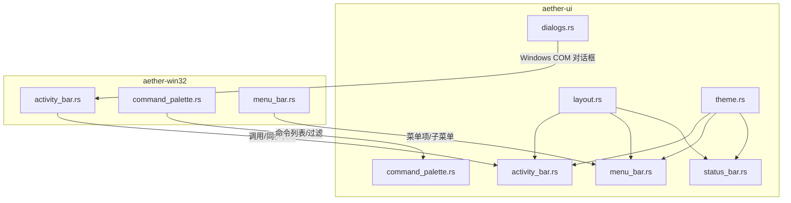
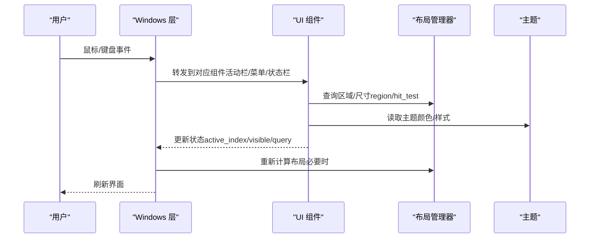
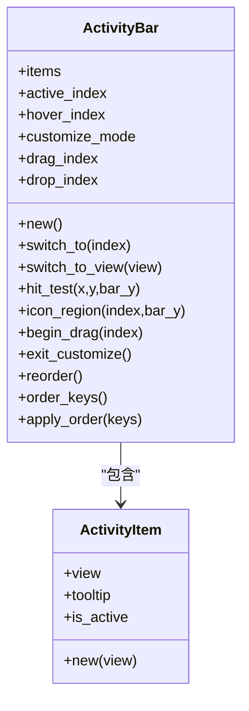
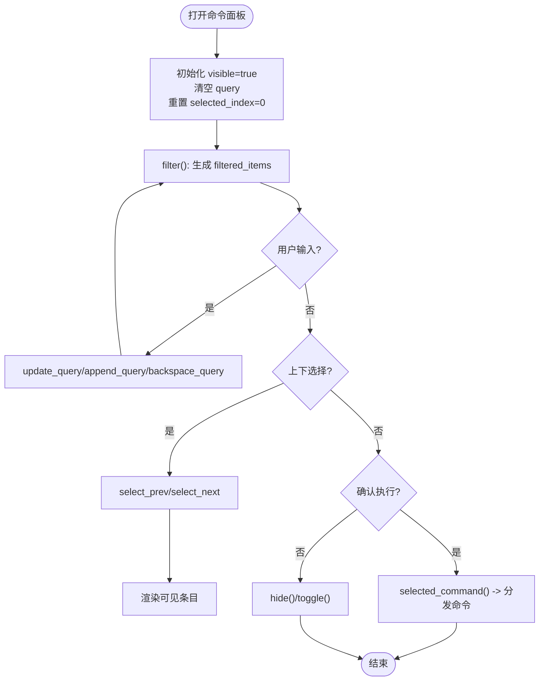
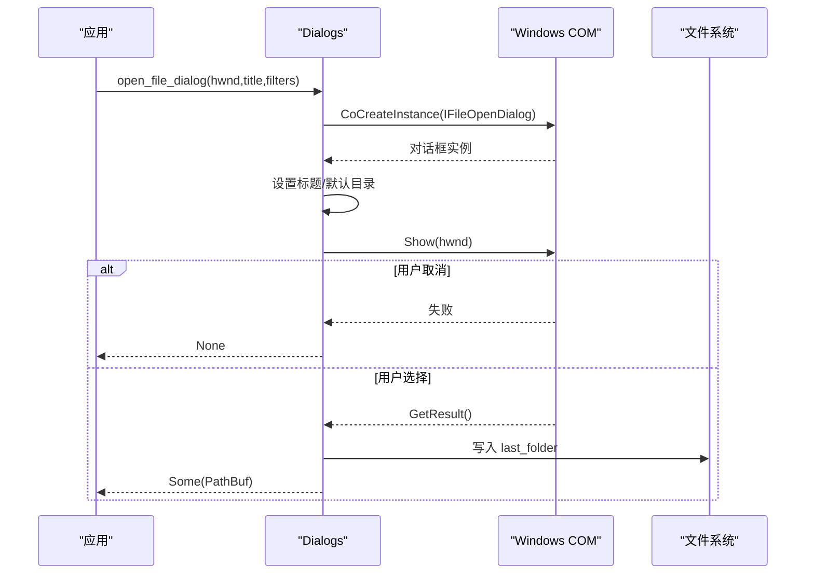
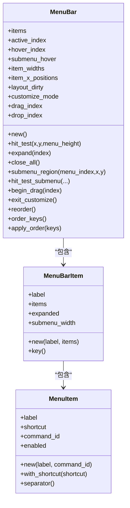
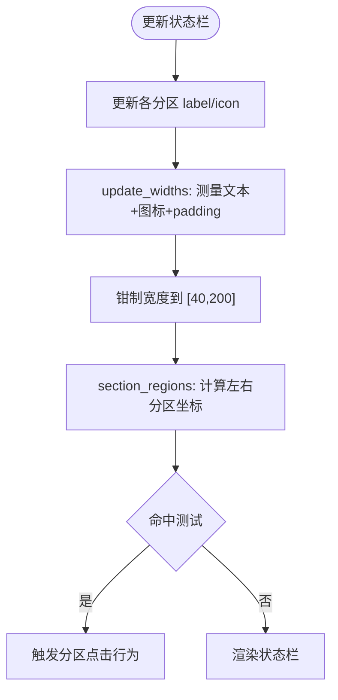
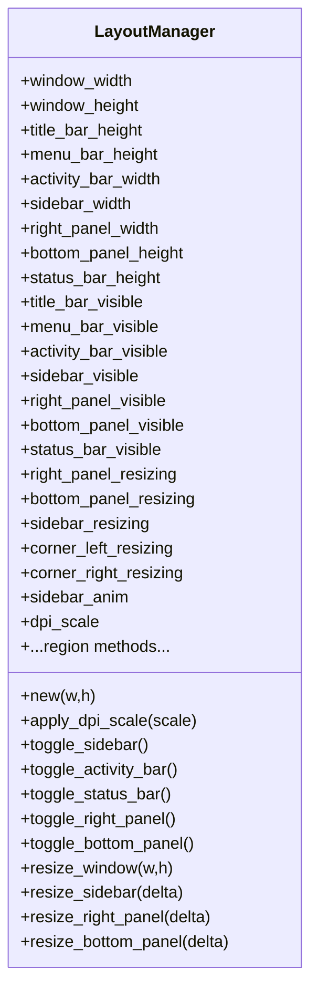
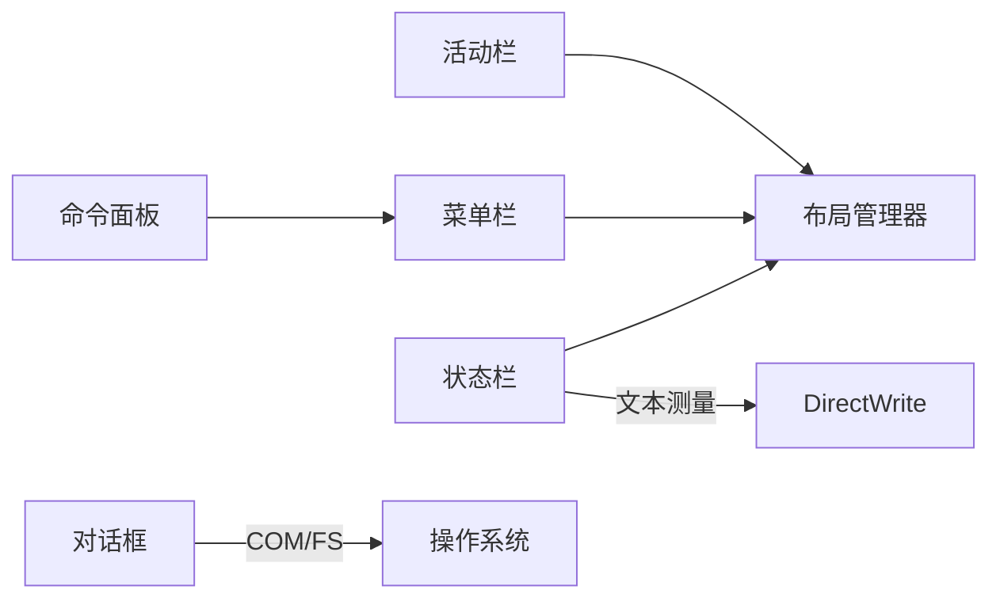

# UI 组件

<cite>
**本文引用的文件**
- [crates/aether-ui/src/lib.rs](file://crates/aether-ui/src/lib.rs)
- [crates/aether-win32/src/lib.rs](file://crates/aether-win32/src/lib.rs)
- [crates/aether-ui/src/activity_bar.rs](file://crates/aether-ui/src/activity_bar.rs)
- [crates/aether-win32/src/activity_bar.rs](file://crates/aether-win32/src/activity_bar.rs)
- [crates/aether-ui/src/command_palette.rs](file://crates/aether-ui/src/command_palette.rs)
- [crates/aether-win32/src/command_palette.rs](file://crates/aether-win32/src/command_palette.rs)
- [crates/aether-ui/src/dialogs.rs](file://crates/aether-ui/src/dialogs.rs)
- [crates/aether-ui/src/menu_bar.rs](file://crates/aether-ui/src/menu_bar.rs)
- [crates/aether-win32/src/menu_bar.rs](file://crates/aether-win32/src/menu_bar.rs)
- [crates/aether-ui/src/status_bar.rs](file://crates/aether-ui/src/status_bar.rs)
- [crates/aether-ui/src/layout.rs](file://crates/aether-ui/src/layout.rs)
- [crates/aether-ui/src/theme.rs](file://crates/aether-ui/src/theme.rs)
</cite>

## 目录
1. [简介](#简介)
2. [项目结构](#项目结构)
3. [核心组件](#核心组件)
4. [架构总览](#架构总览)
5. [详细组件分析](#详细组件分析)
6. [依赖关系分析](#依赖关系分析)
7. [性能与内存优化建议](#性能与内存优化建议)
8. [故障排查指南](#故障排查指南)
9. [结论](#结论)
10. [附录：自定义组件开发指南](#附录自定义组件开发指南)

## 简介
本文件为 Aether 编辑器的 UI 组件系统提供系统化文档，覆盖活动栏、命令面板、对话框、菜单栏、状态栏等内置组件的实现要点、属性、事件与回调机制、生命周期管理、样式与主题支持、组合复用最佳实践，以及跨组件通信和数据流管理。同时给出性能优化与内存管理建议，并附带自定义组件开发指南（接口定义、事件处理、渲染逻辑）。

## 项目结构
UI 组件在两个 crate 中分层组织：
- aether-ui：纯 UI 数据模型与布局/主题/交互逻辑（平台无关）
- aether-win32：Windows 平台集成层（窗口消息、COM 对话框、渲染上下文等）

图表来源
- [crates/aether-ui/src/layout.rs:222-648](file://crates/aether-ui/src/layout.rs#L222-L648)
- [crates/aether-ui/src/activity_bar.rs:1-256](file://crates/aether-ui/src/activity_bar.rs#L1-L256)
- [crates/aether-ui/src/menu_bar.rs:1-672](file://crates/aether-ui/src/menu_bar.rs#L1-L672)
- [crates/aether-ui/src/status_bar.rs:1-326](file://crates/aether-ui/src/status_bar.rs#L1-L326)
- [crates/aether-ui/src/theme.rs:1-26](file://crates/aether-ui/src/theme.rs#L1-L26)
- [crates/aether-ui/src/dialogs.rs:1-414](file://crates/aether-ui/src/dialogs.rs#L1-L414)
- [crates/aether-win32/src/activity_bar.rs:1-256](file://crates/aether-win32/src/activity_bar.rs#L1-L256)
- [crates/aether-win32/src/command_palette.rs:1-442](file://crates/aether-win32/src/command_palette.rs#L1-L442)
- [crates/aether-win32/src/menu_bar.rs:1-672](file://crates/aether-win32/src/menu_bar.rs#L1-L672)

章节来源
- [crates/aether-ui/src/lib.rs:1-34](file://crates/aether-ui/src/lib.rs#L1-L34)
- [crates/aether-win32/src/lib.rs:1-58](file://crates/aether-win32/src/lib.rs#L1-L58)

## 核心组件
- 活动栏（ActivityBar）：左侧导航图标集合，支持切换视图、拖拽重排、持久化顺序。
- 命令面板（CommandPalette）：命令搜索与执行入口，支持模糊匹配、快捷键提示、可见条目限制。
- 对话框（Dialogs）：基于 Windows COM 的文件/文件夹选择与消息框封装，包含上次目录记忆与信任目录管理。
- 菜单栏（MenuBar）：多级菜单、子菜单展开、命中测试、拖拽重排、持久化顺序。
- 状态栏（StatusBar）：多区域信息展示（错误计数、编码、语言、Git 分支等），支持动态宽度测量与点击响应。
- 布局管理器（LayoutManager）：统一计算标题栏、活动栏、侧边栏、编辑器、右侧/底部面板、状态栏的几何区域，支持 DPI 缩放与动画收起/展开。
- 主题（Theme）：玻璃/深色主题获取与 UI 设置开关。

章节来源
- [crates/aether-ui/src/activity_bar.rs:1-256](file://crates/aether-ui/src/activity_bar.rs#L1-L256)
- [crates/aether-ui/src/command_palette.rs:1-442](file://crates/aether-ui/src/command_palette.rs#L1-L442)
- [crates/aether-ui/src/dialogs.rs:1-414](file://crates/aether-ui/src/dialogs.rs#L1-L414)
- [crates/aether-ui/src/menu_bar.rs:1-672](file://crates/aether-ui/src/menu_bar.rs#L1-L672)
- [crates/aether-ui/src/status_bar.rs:1-326](file://crates/aether-ui/src/status_bar.rs#L1-L326)
- [crates/aether-ui/src/layout.rs:1-800](file://crates/aether-ui/src/layout.rs#L1-L800)
- [crates/aether-ui/src/theme.rs:1-26](file://crates/aether-ui/src/theme.rs#L1-L26)

## 架构总览
UI 组件通过“状态 + 布局 + 渲染”三层协作：
- 状态层：各组件维护自身状态（如活动栏 active_index、命令面板 query/filter、菜单展开状态等）。
- 布局层：LayoutManager 统一计算各区域几何；组件内部提供 hit_test 与 region 计算。
- 渲染层：根据主题与布局绘制；Windows 层负责窗口消息、COM 对话框、DWrite 文本测量等。

图表来源
- [crates/aether-ui/src/layout.rs:222-648](file://crates/aether-ui/src/layout.rs#L222-L648)
- [crates/aether-ui/src/activity_bar.rs:1-256](file://crates/aether-ui/src/activity_bar.rs#L1-L256)
- [crates/aether-ui/src/menu_bar.rs:1-672](file://crates/aether-ui/src/menu_bar.rs#L1-L672)
- [crates/aether-ui/src/status_bar.rs:1-326](file://crates/aether-ui/src/status_bar.rs#L1-L326)
- [crates/aether-ui/src/theme.rs:1-26](file://crates/aether-ui/src/theme.rs#L1-L26)

## 详细组件分析

### 活动栏（ActivityBar）
- 数据结构
  - ActivityItem：包含视图类型、tooltip、是否激活。
  - ActivityBar：items、active_index、hover_index、customize_mode、drag/drop 索引。
- 关键方法
  - switch_to / switch_to_view：切换当前活动视图。
  - hit_test / icon_region：基于 ACTIVITY_BAR_WIDTH 与按钮尺寸进行命中检测。
  - begin_drag / exit_customize / reorder：进入自定义模式，拖拽重排并修正 active_index。
  - order_keys / apply_order：持久化顺序与恢复。
- 生命周期与状态同步
  - 初始化默认项（资源管理器、源代码管理、远程资源管理器）。
  - 重排后保持高亮跟随；应用配置时合并默认项。
- 样式与主题
  - 使用 layout 常量与 icons 模块；主题由上层渲染决定。
- 组合与复用
  - 与 SidebarContent 映射（Explorer→FileTree 等）。
- 事件与回调
  - 点击、悬停、拖拽开始/结束、放置目标变更。

图表来源
- [crates/aether-ui/src/activity_bar.rs:1-256](file://crates/aether-ui/src/activity_bar.rs#L1-L256)
- [crates/aether-ui/src/layout.rs:33-96](file://crates/aether-ui/src/layout.rs#L33-L96)

章节来源
- [crates/aether-ui/src/activity_bar.rs:1-256](file://crates/aether-ui/src/activity_bar.rs#L1-L256)
- [crates/aether-win32/src/activity_bar.rs:1-256](file://crates/aether-win32/src/activity_bar.rs#L1-L256)
- [crates/aether-ui/src/layout.rs:33-96](file://crates/aether-ui/src/layout.rs#L33-L96)

### 命令面板（CommandPalette）
- 数据结构
  - CommandPaletteItem：label、description、shortcut、command_id、icon。
  - CommandPalette：visible、query、items、filtered_items、selected_index、max_visible_items。
- 关键方法
  - show/hide/toggle：显示/隐藏/切换。
  - update_query/append_query/backspace_query：输入处理。
  - select_prev/select_next：上下选择。
  - selected_command：获取选中命令 ID。
  - filter：基于 label/description 的包含匹配（可扩展 fuzzy-matcher）。
- 生命周期与状态同步
  - new 构建命令列表；show 时清空查询并重置选择。
- 样式与主题
  - 图标来自 icons 模块；文本测量由渲染层完成。
- 组合与复用
  - 与 MenuBar.CommandId 对齐，便于统一分发。
- 事件与回调
  - 输入、选择变化、确认执行。

图表来源
- [crates/aether-ui/src/command_palette.rs:1-442](file://crates/aether-ui/src/command_palette.rs#L1-L442)
- [crates/aether-win32/src/command_palette.rs:1-442](file://crates/aether-win32/src/command_palette.rs#L1-L442)

章节来源
- [crates/aether-ui/src/command_palette.rs:1-442](file://crates/aether-ui/src/command_palette.rs#L1-L442)
- [crates/aether-win32/src/command_palette.rs:1-442](file://crates/aether-win32/src/command_palette.rs#L1-L442)

### 对话框（Dialogs）
- 功能
  - 打开文件夹/文件/保存文件对话框（Windows COM IFileOpenDialog/IFileSaveDialog）。
  - 错误/信息/确认对话框（MessageBoxW）。
  - 上次打开目录记忆（last_folder）。
  - 已信任工作区目录管理（trusted_folders）。
- 生命周期与资源管理
  - ComGuard RAII 确保 CoInitializeEx/CoUninitialize 配对。
  - 路径字符串宽字符转换与内存释放。
- 错误处理
  - 失败返回 None；错误/信息/确认对话框直接阻塞等待用户操作。
- 持久化
  - last_folder.txt 存储上次目录；trusted_folders.txt 存储信任列表。

图表来源
- [crates/aether-ui/src/dialogs.rs:1-414](file://crates/aether-ui/src/dialogs.rs#L1-L414)

章节来源
- [crates/aether-ui/src/dialogs.rs:1-414](file://crates/aether-ui/src/dialogs.rs#L1-L414)

### 菜单栏（MenuBar）
- 数据结构
  - MenuItem：label、shortcut、command_id、enabled。
  - MenuBarItem：label、items、expanded、submenu_width。
  - MenuBar：items、active_index、hover_index、submenu_hover、item_widths、item_x_positions、layout_dirty、customize_mode、drag/drop 索引。
- 关键方法
  - hit_test/submenu_region/hit_test_submenu：主菜单与子菜单命中。
  - expand/close_all：展开/关闭菜单。
  - begin_drag/exit_customize/reorder：自定义模式与重排。
  - order_keys/apply_order：持久化顺序与恢复。
- 生命周期与状态同步
  - 新建设置默认菜单项；重排后标记 layout_dirty 以重建布局。
- 样式与主题
  - 子菜单宽度缓存 submenu_width；图标与文本由渲染层处理。
- 组合与复用
  - 与 CommandId 统一，便于命令分发。

图表来源
- [crates/aether-ui/src/menu_bar.rs:1-672](file://crates/aether-ui/src/menu_bar.rs#L1-L672)
- [crates/aether-win32/src/menu_bar.rs:1-672](file://crates/aether-win32/src/menu_bar.rs#L1-L672)

章节来源
- [crates/aether-ui/src/menu_bar.rs:1-672](file://crates/aether-ui/src/menu_bar.rs#L1-L672)
- [crates/aether-win32/src/menu_bar.rs:1-672](file://crates/aether-win32/src/menu_bar.rs#L1-L672)

### 状态栏（StatusBar）
- 数据结构
  - StatusBarIndex：Status、Errors、CursorPos、Encoding、Language、GitBranch。
  - StatusBarSection：label、width、clickable、icon。
  - StatusBar：sections、hover_index。
- 关键方法
  - update_git_branch/update_cursor_position/update_language/update_status：更新各分区内容。
  - section_regions：计算左右分区 x 坐标，跳过 width<=0 的分区。
  - hit_test：返回原始 sections 索引。
  - update_widths：基于 TextFormatCache 测量文本宽度，叠加图标与内边距，钳制到 [40,200]。
- 生命周期与状态同步
  - 默认隐藏 Status/CursorPos/GitBranch（width=0），按需显示。
- 样式与主题
  - 图标来自 icons；文本测量依赖 DirectWrite。
- 组合与复用
  - 与 Git/LSP/Editor 状态联动。

图表来源
- [crates/aether-ui/src/status_bar.rs:1-326](file://crates/aether-ui/src/status_bar.rs#L1-L326)

章节来源
- [crates/aether-ui/src/status_bar.rs:1-326](file://crates/aether-ui/src/status_bar.rs#L1-L326)

### 布局管理器（LayoutManager）
- 职责
  - 计算标题栏、菜单栏、活动栏、侧边栏、编辑器、右侧/底部面板、状态栏的 Region。
  - 支持 DPI 缩放、侧边栏动画收起/展开、右下角/左下角拐角手柄调整。
- 关键方法
  - title_bar_region/menu_bar_region/activity_bar_region/sidebar_region/editor_region/tab_bar_region/editor_content_region/right_panel_region/bottom_panel_region/status_bar_region。
  - toggle_sidebar/toggle_activity_bar/toggle_status_bar/toggle_right_panel/toggle_bottom_panel。
  - resize_window/resize_sidebar/resize_right_panel/resize_bottom_panel。
  - apply_dpi_scale：按比例换算用户可调尺寸。
- 生命周期与状态同步
  - 窗口大小变化或可见性切换时重新计算区域；动画结束后更新 visible/width。

图表来源
- [crates/aether-ui/src/layout.rs:222-648](file://crates/aether-ui/src/layout.rs#L222-L648)

章节来源
- [crates/aether-ui/src/layout.rs:1-800](file://crates/aether-ui/src/layout.rs#L1-L800)

### 主题（Theme）
- 提供玻璃主题与经典深色主题获取。
- UiSettings 控制玻璃效果开关。

章节来源
- [crates/aether-ui/src/theme.rs:1-26](file://crates/aether-ui/src/theme.rs#L1-L26)

## 依赖关系分析
- 组件间耦合
  - 活动栏与布局管理器：通过 ActivityBarView 与布局常量协调位置与尺寸。
  - 命令面板与菜单栏：共享 CommandId，便于统一命令分发。
  - 状态栏与编辑器/LSP/Git：通过更新方法同步显示。
- 外部依赖
  - Windows COM：对话框与消息框。
  - DirectWrite：文本测量（状态栏宽度计算）。
- 潜在循环依赖
  - 无直接循环；通过枚举与常量解耦。

图表来源
- [crates/aether-ui/src/activity_bar.rs:1-256](file://crates/aether-ui/src/activity_bar.rs#L1-L256)
- [crates/aether-ui/src/menu_bar.rs:1-672](file://crates/aether-ui/src/menu_bar.rs#L1-L672)
- [crates/aether-ui/src/status_bar.rs:1-326](file://crates/aether-ui/src/status_bar.rs#L1-L326)
- [crates/aether-ui/src/dialogs.rs:1-414](file://crates/aether-ui/src/dialogs.rs#L1-L414)
- [crates/aether-ui/src/layout.rs:222-648](file://crates/aether-ui/src/layout.rs#L222-L648)

章节来源
- [crates/aether-ui/src/activity_bar.rs:1-256](file://crates/aether-ui/src/activity_bar.rs#L1-L256)
- [crates/aether-ui/src/menu_bar.rs:1-672](file://crates/aether-ui/src/menu_bar.rs#L1-L672)
- [crates/aether-ui/src/status_bar.rs:1-326](file://crates/aether-ui/src/status_bar.rs#L1-L326)
- [crates/aether-ui/src/dialogs.rs:1-414](file://crates/aether-ui/src/dialogs.rs#L1-L414)
- [crates/aether-ui/src/layout.rs:222-648](file://crates/aether-ui/src/layout.rs#L222-L648)

## 性能与内存优化建议
- 文本测量缓存
  - 状态栏使用 TextFormatCache 测量文本宽度，避免重复计算。
- 过滤与可见条目限制
  - 命令面板维护 filtered_items 并限制 max_visible_items，减少渲染压力。
- 布局增量更新
  - 菜单栏重排后仅标记 layout_dirty，按需重建布局。
- 动画与节流
  - 侧边栏收起/展开使用 200ms 线性插值，避免频繁重绘。
- 内存管理
  - 对话框 COM 对象使用 RAII 守卫确保释放；路径字符串正确释放内存。
- 建议
  - 对大列表采用虚拟滚动（命令面板可考虑分页加载）。
  - 将频繁变化的状态（如错误计数）局部更新，避免全量重绘。
  - 使用不可变数据快照配合 diff 更新，降低渲染成本。

[本节为通用指导，不直接分析具体文件]

## 故障排查指南
- 活动栏重排异常
  - 检查 reorder 边界条件与 active_index 修正逻辑。
  - 参考：[crates/aether-ui/src/activity_bar.rs:119-185](file://crates/aether-ui/src/activity_bar.rs#L119-L185)
- 命令面板过滤不生效
  - 确认 update_query 后调用 filter；检查 label/description 小写匹配。
  - 参考：[crates/aether-ui/src/command_palette.rs:264-328](file://crates/aether-ui/src/command_palette.rs#L264-L328)
- 对话框崩溃或无法释放
  - 确保 ComGuard 正确初始化/释放；检查 CoTaskMemFree 调用。
  - 参考：[crates/aether-ui/src/dialogs.rs:11-36](file://crates/aether-ui/src/dialogs.rs#L11-L36)
- 状态栏宽度异常
  - 检查 update_widths 钳制范围与图标占用；确认 TextFormatCache 可用。
  - 参考：[crates/aether-ui/src/status_bar.rs:161-191](file://crates/aether-ui/src/status_bar.rs#L161-L191)
- 菜单栏子菜单定位偏移
  - 使用 item_x_positions 而非累计宽度；确认渲染端更新位置。
  - 参考：[crates/aether-ui/src/menu_bar.rs:277-314](file://crates/aether-ui/src/menu_bar.rs#L277-L314)

章节来源
- [crates/aether-ui/src/activity_bar.rs:119-185](file://crates/aether-ui/src/activity_bar.rs#L119-L185)
- [crates/aether-ui/src/command_palette.rs:264-328](file://crates/aether-ui/src/command_palette.rs#L264-L328)
- [crates/aether-ui/src/dialogs.rs:11-36](file://crates/aether-ui/src/dialogs.rs#L11-L36)
- [crates/aether-ui/src/status_bar.rs:161-191](file://crates/aether-ui/src/status_bar.rs#L161-L191)
- [crates/aether-ui/src/menu_bar.rs:277-314](file://crates/aether-ui/src/menu_bar.rs#L277-L314)

## 结论
Aether 的 UI 组件系统以清晰的状态-布局-渲染分层实现，提供了活动栏、命令面板、对话框、菜单栏、状态栏等核心能力，并通过布局管理器统一管理几何与可见性。组件间通过枚举与常量解耦，具备良好的扩展性与可维护性。结合主题系统与 Windows 平台集成，实现了跨平台的 UI 体验。建议在后续迭代中引入更精细的虚拟滚动、增量更新与性能监控，进一步提升大型工作区的流畅度。

[本节为总结，不直接分析具体文件]

## 附录：自定义组件开发指南
- 接口定义
  - 定义组件状态结构（如 ActivityBar/CommandPalette），明确公开字段与方法。
  - 使用枚举表示视图/命令类型（如 ActivityBarView/CommandId）。
- 事件处理
  - 提供 hit_test/region 方法用于命中检测；暴露 begin_drag/exit_customize 等交互入口。
  - 命令面板支持输入、选择、确认等事件；菜单栏支持展开/关闭、子菜单命中。
- 渲染逻辑
  - 依赖布局管理器计算区域；使用主题获取颜色与样式。
  - 文本测量使用 TextFormatCache；图标来自 icons 模块。
- 生命周期管理
  - 初始化默认状态；在窗口大小/DPI 变化时更新布局。
  - 动画（如侧边栏收起）使用定时器与插值。
- 数据流管理
  - 单向数据流：事件 → 状态更新 → 布局重算 → 渲染。
  - 组件间通信：通过共享 CommandId 与布局常量；对话框结果回传至调用方。
- 最佳实践
  - 保持状态最小化与不可变更新；避免深层嵌套状态。
  - 使用测试覆盖关键逻辑（如活动栏重排、命令面板过滤、状态栏宽度钳制）。

[本节为通用指导，不直接分析具体文件]