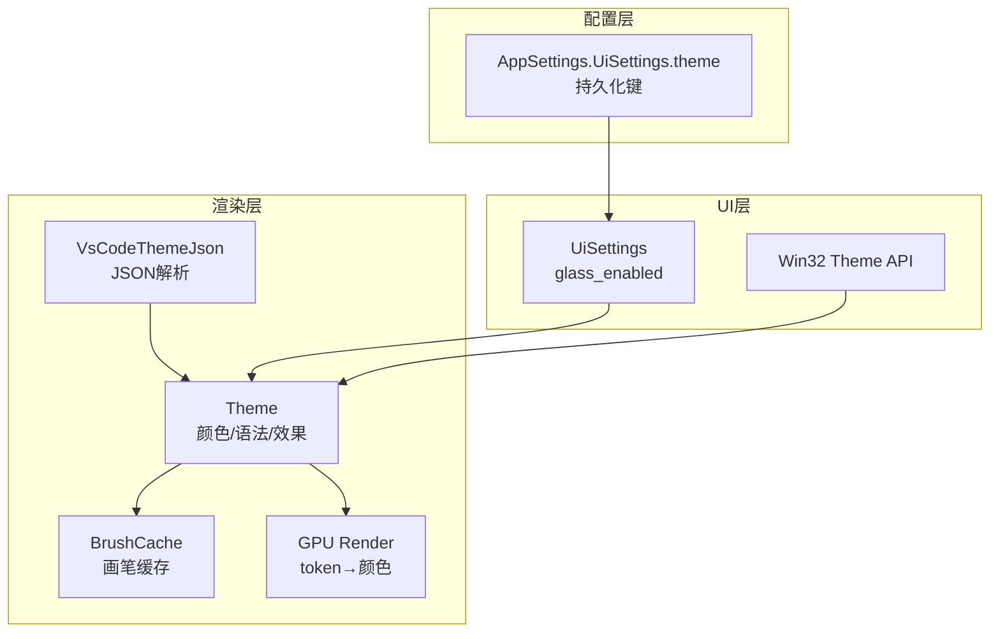
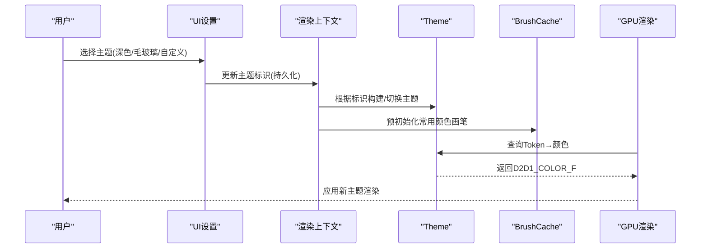
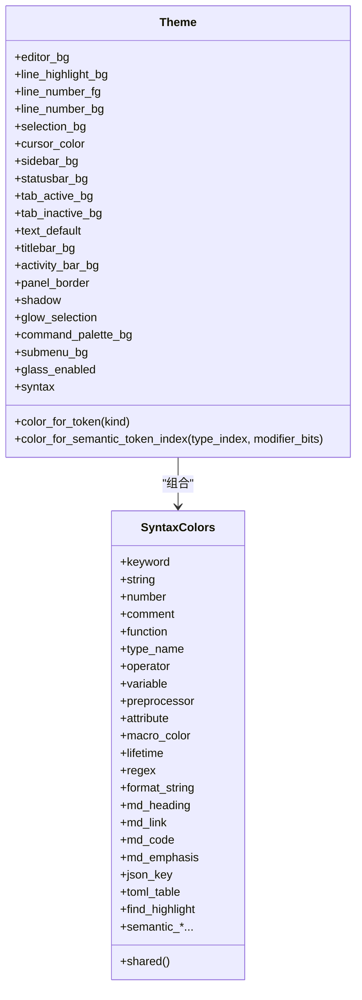
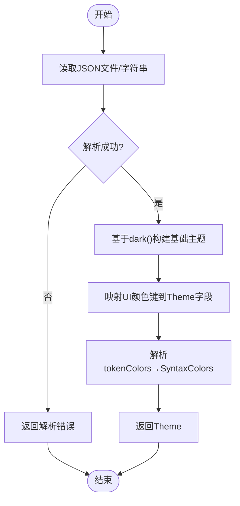
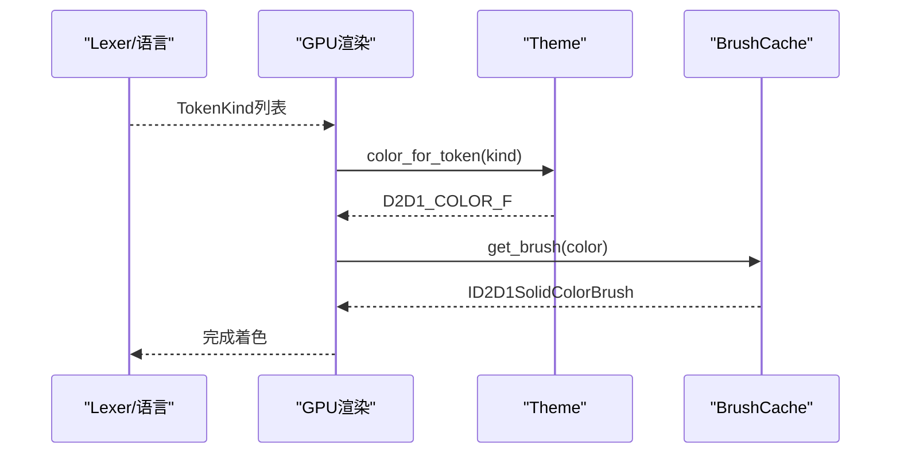
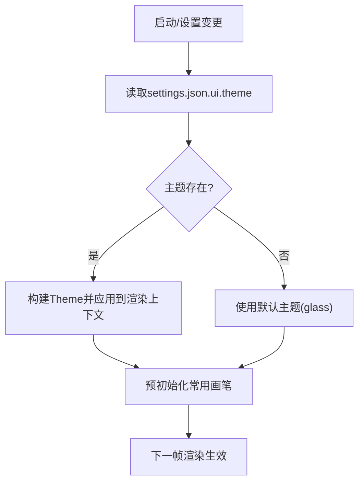
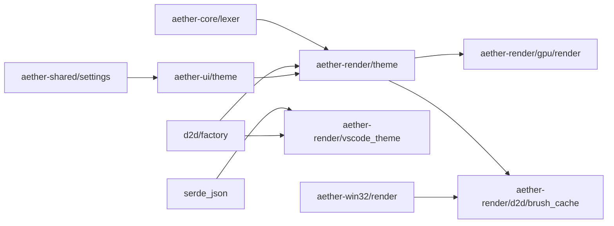

# 主题系统

<cite>
**本文引用的文件**
- [crates/aether-render/src/theme.rs](file://crates/aether-render/src/theme.rs)
- [crates/aether-render/src/vscode_theme.rs](file://crates/aether-render/src/vscode_theme.rs)
- [crates/aether-ui/src/theme.rs](file://crates/aether-ui/src/theme.rs)
- [crates/aether-win32/src/theme.rs](file://crates/aether-win32/src/theme.rs)
- [crates/aether-shared/src/settings.rs](file://crates/aether-shared/src/settings.rs)
- [crates/aether-render/src/d2d/brush_cache.rs](file://crates/aether-render/src/d2d/brush_cache.rs)
- [crates/aether-render/src/gpu/render.rs](file://crates/aether-render/src/gpu/render.rs)
- [crates/aether-render-win/src/render_context.rs](file://crates/aether-render-win/src/render_context.rs)
- [crates/aether-win32/src/render/mod.rs](file://crates/aether-win32/src/render/mod.rs)
</cite>

## 目录
1. [简介](#简介)
2. [项目结构](#项目结构)
3. [核心组件](#核心组件)
4. [架构总览](#架构总览)
5. [详细组件分析](#详细组件分析)
6. [依赖关系分析](#依赖关系分析)
7. [性能考虑](#性能考虑)
8. [故障排查指南](#故障排查指南)
9. [结论](#结论)
10. [附录](#附录)

## 简介
本文件系统化阐述主题系统的设计与实现，覆盖颜色主题、字体主题与图标主题的分离管理；主题加载机制、动态切换与持久化存储；主题变量定义、继承与覆盖规则；主题API（查询、变量解析、样式应用）；自定义主题开发指南（文件格式、命名约定、兼容性）；VSCode主题导入与预览机制；以及与渲染引擎的集成和性能优化策略。目标是让非专业读者也能理解并安全扩展主题能力。

## 项目结构
主题系统横跨多个crate：
- aether-render：主题数据模型、内置主题、VS Code主题导入、语法高亮映射、GPU/D2D渲染接口对接。
- aether-ui / aether-win32：UI层对主题的轻量封装与默认值提供。
- aether-shared：设置持久化（包含主题标识）。
- 渲染上下文与画刷缓存：在渲染路径中高效复用画笔与文本格式，降低主题切换开销。

图表来源
- [crates/aether-render/src/theme.rs:8-31](file://crates/aether-render/src/theme.rs#L8-L31)
- [crates/aether-render/src/vscode_theme.rs:10-31](file://crates/aether-render/src/vscode_theme.rs#L10-L31)
- [crates/aether-render/src/d2d/brush_cache.rs:28-66](file://crates/aether-render/src/d2d/brush_cache.rs#L28-L66)
- [crates/aether-render/src/gpu/render.rs:123-124](file://crates/aether-render/src/gpu/render.rs#L123-L124)
- [crates/aether-ui/src/theme.rs:3-25](file://crates/aether-ui/src/theme.rs#L3-L25)
- [crates/aether-shared/src/settings.rs:180-219](file://crates/aether-shared/src/settings.rs#L180-L219)

章节来源
- [crates/aether-render/src/theme.rs:8-31](file://crates/aether-render/src/theme.rs#L8-L31)
- [crates/aether-render/src/vscode_theme.rs:10-31](file://crates/aether-render/src/vscode_theme.rs#L10-L31)
- [crates/aether-ui/src/theme.rs:3-25](file://crates/aether-ui/src/theme.rs#L3-L25)
- [crates/aether-shared/src/settings.rs:180-219](file://crates/aether-shared/src/settings.rs#L180-L219)

## 核心组件
- 主题数据模型：集中定义编辑器背景、行号、选择区、光标、侧边栏、状态栏、标签页、标题栏、面板边框、阴影、命令面板、子菜单等颜色，以及语法高亮颜色集合与毛玻璃开关。
- 内置主题：深色不透明主题与毛玻璃半透明主题，共享语法颜色构造，便于统一维护。
- VS Code主题导入：从标准VS Code JSON主题文件解析UI颜色与Token规则，映射到内部主题。
- 渲染集成：将主题颜色映射为GPU/D2D绘制所需颜色；通过画刷缓存减少重复创建。
- UI封装：提供获取默认主题与深色主题的便捷函数，屏蔽底层差异。
- 设置持久化：以字符串形式记录当前主题标识，配合UI层进行动态切换。

章节来源
- [crates/aether-render/src/theme.rs:8-31](file://crates/aether-render/src/theme.rs#L8-L31)
- [crates/aether-render/src/theme.rs:148-211](file://crates/aether-render/src/theme.rs#L148-L211)
- [crates/aether-render/src/vscode_theme.rs:103-175](file://crates/aether-render/src/vscode_theme.rs#L103-L175)
- [crates/aether-render/src/d2d/brush_cache.rs:50-66](file://crates/aether-render/src/d2d/brush_cache.rs#L50-L66)
- [crates/aether-ui/src/theme.rs:17-25](file://crates/aether-ui/src/theme.rs#L17-L25)
- [crates/aether-shared/src/settings.rs:180-219](file://crates/aether-shared/src/settings.rs#L180-L219)

## 架构总览
主题系统采用“数据模型 + 导入器 + 渲染桥接”的分层设计：
- 数据模型层：Theme/SyntaxColors 描述所有可渲染的颜色与效果开关。
- 导入层：支持从VS Code JSON主题构建Theme，具备错误处理与回退策略。
- 渲染桥接层：将Token语义或通用TokenKind映射为主题颜色，并通过画刷缓存提升性能。
- UI与设置层：保存用户选择的主题标识，并在需要时重建渲染资源。

图表来源
- [crates/aether-render/src/theme.rs:148-211](file://crates/aether-render/src/theme.rs#L148-L211)
- [crates/aether-render/src/vscode_theme.rs:103-175](file://crates/aether-render/src/vscode_theme.rs#L103-L175)
- [crates/aether-render/src/d2d/brush_cache.rs:50-66](file://crates/aether-render/src/d2d/brush_cache.rs#L50-L66)
- [crates/aether-render/src/gpu/render.rs:123-124](file://crates/aether-render/src/gpu/render.rs#L123-L124)
- [crates/aether-shared/src/settings.rs:180-219](file://crates/aether-shared/src/settings.rs#L180-L219)

## 详细组件分析

### 主题数据模型与内置主题
- Theme 包含UI区域颜色、语法高亮颜色集合、毛玻璃开关等字段，适合直接用于D2D/GPU着色。
- SyntaxColors 集中管理语法相关颜色，并提供共享构造方法，避免重复代码。
- 内置 dark() 与 glass() 主题分别提供不透明与半透明两种视觉风格，默认值为毛玻璃主题。

图表来源
- [crates/aether-render/src/theme.rs:8-86](file://crates/aether-render/src/theme.rs#L8-L86)
- [crates/aether-render/src/theme.rs:148-278](file://crates/aether-render/src/theme.rs#L148-L278)

章节来源
- [crates/aether-render/src/theme.rs:8-86](file://crates/aether-render/src/theme.rs#L8-L86)
- [crates/aether-render/src/theme.rs:148-278](file://crates/aether-render/src/theme.rs#L148-L278)

### VS Code主题导入与变量解析
- 支持从文件路径或JSON字符串加载VS Code主题，解析colors与tokenColors，映射到Theme与SyntaxColors。
- 颜色解析支持#RGB/#RRGGBB/#RRGGBBAA，非法颜色会保留默认值，确保鲁棒性。
- tokenColors按scope匹配关键字、字符串、注释、数字、函数、类型名、Markdown元素等，未知scope忽略。

图表来源
- [crates/aether-render/src/vscode_theme.rs:103-175](file://crates/aether-render/src/vscode_theme.rs#L103-L175)
- [crates/aether-render/src/vscode_theme.rs:236-281](file://crates/aether-render/src/vscode_theme.rs#L236-L281)
- [crates/aether-render/src/vscode_theme.rs:178-234](file://crates/aether-render/src/vscode_theme.rs#L178-L234)

章节来源
- [crates/aether-render/src/vscode_theme.rs:103-175](file://crates/aether-render/src/vscode_theme.rs#L103-L175)
- [crates/aether-render/src/vscode_theme.rs:178-234](file://crates/aether-render/src/vscode_theme.rs#L178-L234)
- [crates/aether-render/src/vscode_theme.rs:236-281](file://crates/aether-render/src/vscode_theme.rs#L236-L281)

### 主题API：查询、变量解析与样式应用
- 查询API：
  - color_for_token(TokenKind) → D2D1_COLOR_F：通用Token到颜色映射。
  - color_for_semantic_token_index(u32, u32) → D2D1_COLOR_F：语义Token索引到颜色映射。
- 变量解析：
  - from_vscode_json/from_vscode_json_str：从VS Code主题构建Theme。
  - parse_hex_color：十六进制颜色字符串解析。
- 样式应用：
  - GPU渲染调用 theme.color_for_token(kind) 获取颜色。
  - D2D画刷缓存预初始化常用颜色，减少每帧分配。

图表来源
- [crates/aether-render/src/theme.rs:213-278](file://crates/aether-render/src/theme.rs#L213-L278)
- [crates/aether-render/src/vscode_theme.rs:236-281](file://crates/aether-render/src/vscode_theme.rs#L236-L281)
- [crates/aether-render/src/gpu/render.rs:123-124](file://crates/aether-render/src/gpu/render.rs#L123-L124)
- [crates/aether-render/src/d2d/brush_cache.rs:50-66](file://crates/aether-render/src/d2d/brush_cache.rs#L50-L66)

章节来源
- [crates/aether-render/src/theme.rs:213-278](file://crates/aether-render/src/theme.rs#L213-L278)
- [crates/aether-render/src/vscode_theme.rs:236-281](file://crates/aether-render/src/vscode_theme.rs#L236-L281)
- [crates/aether-render/src/gpu/render.rs:123-124](file://crates/aether-render/src/gpu/render.rs#L123-L124)
- [crates/aether-render/src/d2d/brush_cache.rs:50-66](file://crates/aether-render/src/d2d/brush_cache.rs#L50-L66)

### 动态切换与持久化存储
- 持久化：UiSettings.theme 字段保存主题标识字符串，随settings.json读写。
- 动态切换：UI层根据当前主题标识构建对应Theme，并在渲染目标就绪后重新初始化画刷缓存。
- 兼容性与回退：若主题标识无效或解析失败，回退到默认主题（毛玻璃）。

图表来源
- [crates/aether-shared/src/settings.rs:180-219](file://crates/aether-shared/src/settings.rs#L180-L219)
- [crates/aether-render/src/theme.rs:281-284](file://crates/aether-render/src/theme.rs#L281-L284)
- [crates/aether-win32/src/render/mod.rs:170-175](file://crates/aether-win32/src/render/mod.rs#L170-L175)

章节来源
- [crates/aether-shared/src/settings.rs:180-219](file://crates/aether-shared/src/settings.rs#L180-L219)
- [crates/aether-render/src/theme.rs:281-284](file://crates/aether-render/src/theme.rs#L281-L284)
- [crates/aether-win32/src/render/mod.rs:170-175](file://crates/aether-win32/src/render/mod.rs#L170-L175)

### 自定义主题开发指南
- 文件格式：遵循VS Code主题JSON结构，至少包含 colors 与 tokenColors。
- 变量命名约定：
  - UI颜色键：如 editor.background、editor.foreground、sideBar.background、statusBar.background、tab.activeBackground、tab.inactiveBackground、titleBar.activeBackground、activityBar.background、sideBar.border、dropdown.background、menu.background。
  - Token scope：如 keyword、string、comment、constant.numeric、entity.name.function、entity.name.type、markup.heading、markup.link、markup.inline.raw、markup.bold 等。
- 兼容性保证：
  - 非法颜色自动忽略并保留默认值。
  - 未知scope忽略，不影响其他规则。
  - 缺失字段时使用dark()默认值填充。
- 预览机制：
  - 通过from_vscode_json/from_vscode_json_str即时构建Theme，可在设置界面中实时预览。
  - 渲染目标就绪后预初始化常用画笔，确保预览流畅。

章节来源
- [crates/aether-render/src/vscode_theme.rs:103-175](file://crates/aether-render/src/vscode_theme.rs#L103-L175)
- [crates/aether-render/src/vscode_theme.rs:178-234](file://crates/aether-render/src/vscode_theme.rs#L178-L234)
- [crates/aether-render/src/vscode_theme.rs:236-281](file://crates/aether-render/src/vscode_theme.rs#L236-L281)
- [crates/aether-win32/src/render/mod.rs:170-175](file://crates/aether-win32/src/render/mod.rs#L170-L175)

### 字体主题与图标主题
- 字体主题：当前仓库未提供独立的字体主题模块；字体大小等通过UiSettings.font_size等字段管理（具体实现位于设置层）。
- 图标主题：当前仓库未提供独立图标主题模块；活动栏与菜单顺序通过activity_bar_order/menu_bar_order等字段管理。
- 建议：未来可扩展为独立的字体主题与图标主题模块，保持与颜色主题一致的加载与切换机制。

[本节为概念性说明，不直接分析具体文件]

## 依赖关系分析
- 主题模块依赖：
  - aether-render/theme 依赖 aether-core/lexer::TokenKind 进行Token映射。
  - aether-render/vscode_theme 依赖 serde_json 解析JSON，依赖 d2d/factory::color_f 生成颜色。
  - aether-render/gpu/render 调用 theme.color_for_token 获取颜色。
  - aether-render/d2d/brush_cache 提供画刷缓存，减少主题切换开销。
  - aether-win32/render 在渲染目标就绪后预初始化画笔。
  - aether-shared/settings 持久化主题标识。

图表来源
- [crates/aether-render/src/theme.rs:1-5](file://crates/aether-render/src/theme.rs#L1-L5)
- [crates/aether-render/src/vscode_theme.rs:1-8](file://crates/aether-render/src/vscode_theme.rs#L1-L8)
- [crates/aether-render/src/gpu/render.rs:123-124](file://crates/aether-render/src/gpu/render.rs#L123-L124)
- [crates/aether-render/src/d2d/brush_cache.rs:28-66](file://crates/aether-render/src/d2d/brush_cache.rs#L28-L66)
- [crates/aether-win32/src/render/mod.rs:170-175](file://crates/aether-win32/src/render/mod.rs#L170-L175)
- [crates/aether-shared/src/settings.rs:180-219](file://crates/aether-shared/src/settings.rs#L180-L219)

章节来源
- [crates/aether-render/src/theme.rs:1-5](file://crates/aether-render/src/theme.rs#L1-L5)
- [crates/aether-render/src/vscode_theme.rs:1-8](file://crates/aether-render/src/vscode_theme.rs#L1-L8)
- [crates/aether-render/src/gpu/render.rs:123-124](file://crates/aether-render/src/gpu/render.rs#L123-L124)
- [crates/aether-render/src/d2d/brush_cache.rs:28-66](file://crates/aether-render/src/d2d/brush_cache.rs#L28-L66)
- [crates/aether-win32/src/render/mod.rs:170-175](file://crates/aether-win32/src/render/mod.rs#L170-L175)
- [crates/aether-shared/src/settings.rs:180-219](file://crates/aether-shared/src/settings.rs#L180-L219)

## 性能考虑
- 画刷缓存：预初始化常用颜色画笔，命中数组快速返回，未命中回退哈希表，显著降低每帧分配。
- 渲染节流：主渲染循环避免0尺寸渲染与最小化冻结时的重绘，减少无用计算。
- 并行预处理：核心库使用rayon并行分块Lexing，提高大文档预处理速度。
- 主题切换优化：仅在渲染目标就绪后重建画笔，避免频繁COM对象创建。

章节来源
- [crates/aether-render/src/d2d/brush_cache.rs:28-66](file://crates/aether-render/src/d2d/brush_cache.rs#L28-L66)
- [crates/aether-win32/src/render/mod.rs:146-175](file://crates/aether-win32/src/render/mod.rs#L146-L175)
- [crates/aether-core/src/render_prep.rs:44-60](file://crates/aether-core/src/render_prep.rs#L44-L60)

## 故障排查指南
- 主题JSON解析失败：检查colors与tokenColors格式，确认颜色为合法十六进制字符串；错误类型为Parse或InvalidColor。
- 文件不存在：from_vscode_json返回Io错误，请确认路径正确。
- 颜色无效：非法颜色会被忽略，保留默认值；可通过单元测试验证颜色解析逻辑。
- 渲染目标丢失：当target为None时，需重新初始化并预初始化画笔。

章节来源
- [crates/aether-render/src/vscode_theme.rs:83-101](file://crates/aether-render/src/vscode_theme.rs#L83-L101)
- [crates/aether-render/src/vscode_theme.rs:236-281](file://crates/aether-render/src/vscode_theme.rs#L236-L281)
- [crates/aether-win32/src/render/mod.rs:170-175](file://crates/aether-win32/src/render/mod.rs#L170-L175)

## 结论
主题系统以清晰的数据模型与导入机制为核心，结合高效的渲染集成与画刷缓存，实现了稳定、可扩展且高性能的主题能力。通过VS Code主题导入与设置持久化，用户可以轻松定制与切换主题。未来可进一步扩展字体与图标主题模块，完善预览与热重载体验。

## 附录
- 推荐实践：
  - 自定义主题优先覆盖关键UI颜色与常用Token scope。
  - 使用毛玻璃主题以获得现代视觉效果，必要时回退到深色不透明主题。
  - 在设置界面中提供主题预览，利用from_vscode_json_str即时构建Theme。
- 兼容性：
  - 保持对旧版JSON结构的兼容，忽略未知字段。
  - 对非法输入进行健壮处理，确保应用稳定性。

[本节为补充说明，不直接分析具体文件]