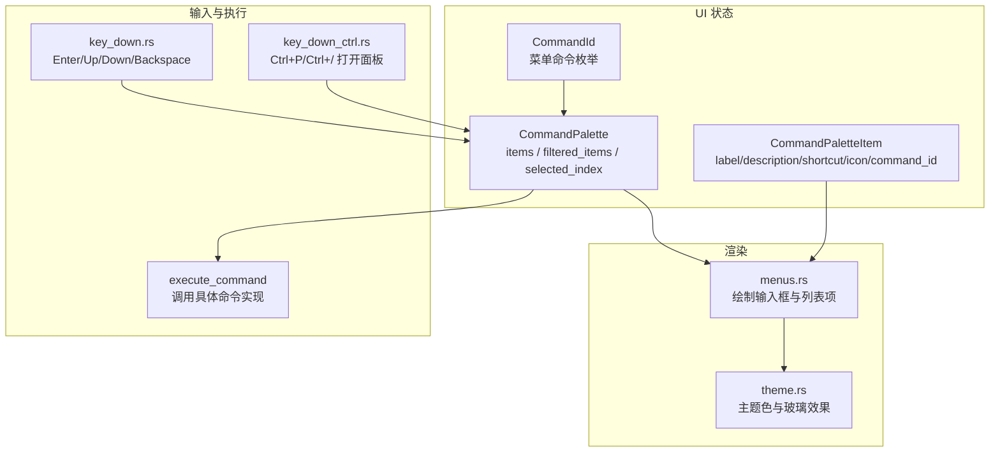
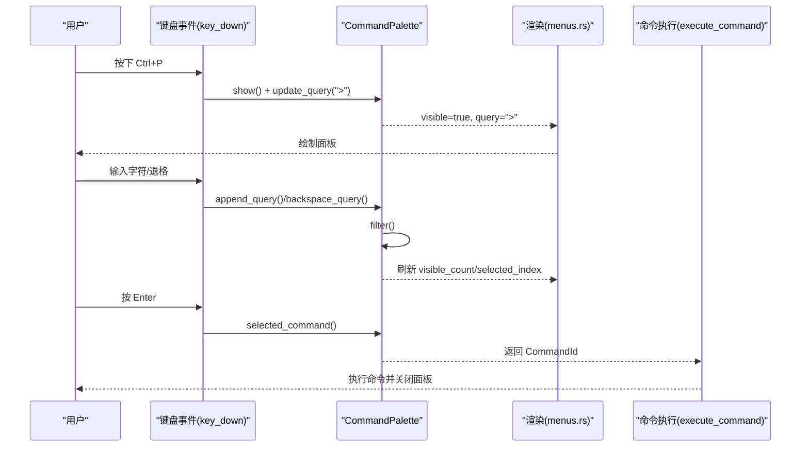
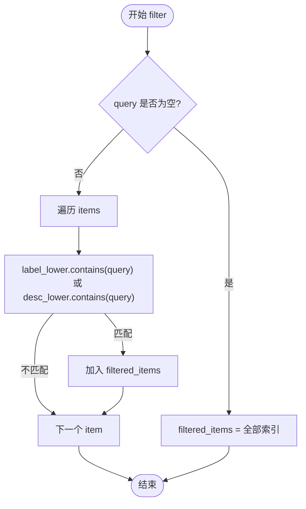
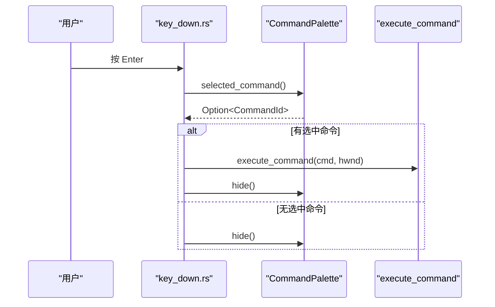
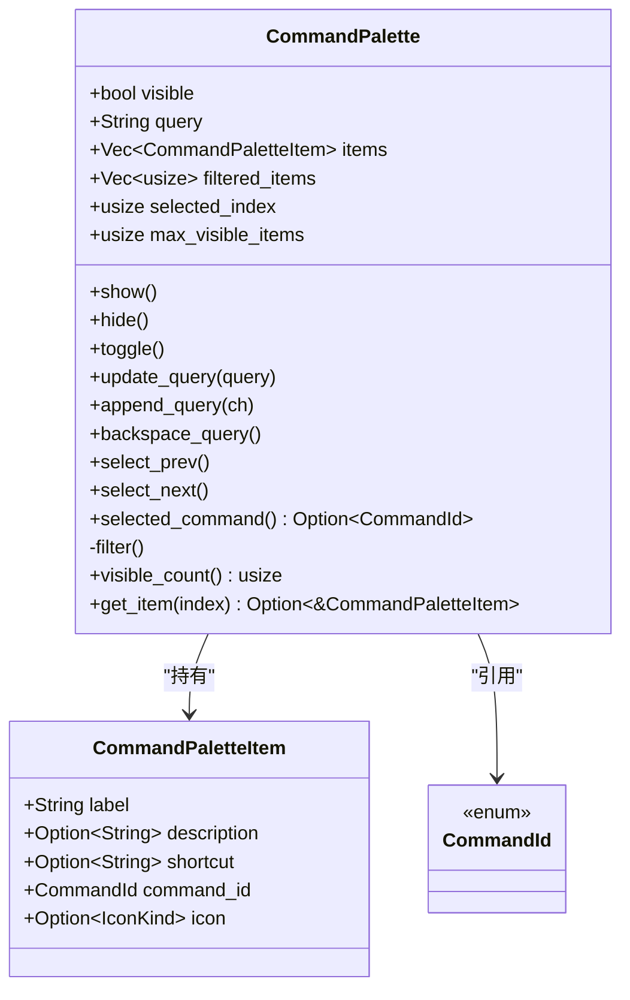

# 命令面板组件

<cite>
**本文引用的文件**
- [crates/aether-ui/src/command_palette.rs](file://crates/aether-ui/src/command_palette.rs)
- [crates/aether-win32/src/command_palette.rs](file://crates/aether-win32/src/command_palette.rs)
- [crates/aether-ui/src/menu_bar.rs](file://crates/aether-ui/src/menu_bar.rs)
- [crates/aether-win32/src/render/menus.rs](file://crates/aether-win32/src/render/menus.rs)
- [crates/aether-win32/src/window/keyboard_handler/key_down.rs](file://crates/aether-win32/src/window/keyboard_handler/key_down.rs)
- [crates/aether-win32/src/window/keyboard_handler/key_down_ctrl.rs](file://crates/aether-win32/src/window/keyboard_handler/key_down_ctrl.rs)
- [crates/aether-render/src/theme.rs](file://crates/aether-render/src/theme.rs)
- [crates/aether-render/src/vscode_theme.rs](file://crates/aether-render/src/vscode_theme.rs)
</cite>

## 目录
1. [简介](#简介)
2. [项目结构](#项目结构)
3. [核心组件](#核心组件)
4. [架构总览](#架构总览)
5. [详细组件分析](#详细组件分析)
6. [依赖关系分析](#依赖关系分析)
7. [性能考虑](#性能考虑)
8. [故障排查指南](#故障排查指南)
9. [结论](#结论)
10. [附录](#附录)

## 简介
本文件为“命令面板”组件的完整技术文档，覆盖以下方面：
- 命令注册机制与分组管理
- 搜索算法、结果排序与高亮显示
- 键盘导航（上下选择、回车执行、退格编辑）
- 命令执行流程、参数传递与异步处理
- 扩展接口（自定义命令注册、分组）
- 主题定制与样式覆盖
- 与其他 UI 组件的集成方式与数据流
- 添加新命令与优化搜索性能的实践示例

## 项目结构
命令面板由 UI 层状态与渲染层绘制两部分组成，并通过窗口键盘事件驱动交互。

图表来源
- [crates/aether-ui/src/command_palette.rs:1-442](file://crates/aether-ui/src/command_palette.rs#L1-L442)
- [crates/aether-win32/src/render/menus.rs:1150-1400](file://crates/aether-win32/src/render/menus.rs#L1150-L1400)
- [crates/aether-win32/src/window/keyboard_handler/key_down.rs:1060-1106](file://crates/aether-win32/src/window/keyboard_handler/key_down.rs#L1060-L1106)
- [crates/aether-win32/src/window/keyboard_handler/key_down_ctrl.rs:164-190](file://crates/aether-win32/src/window/keyboard_handler/key_down_ctrl.rs#L164-L190)
- [crates/aether-render/src/theme.rs:1-219](file://crates/aether-render/src/theme.rs#L1-L219)

章节来源
- [crates/aether-ui/src/command_palette.rs:1-442](file://crates/aether-ui/src/command_palette.rs#L1-L442)
- [crates/aether-win32/src/render/menus.rs:1150-1400](file://crates/aether-win32/src/render/menus.rs#L1150-L1400)
- [crates/aether-win32/src/window/keyboard_handler/key_down.rs:1060-1106](file://crates/aether-win32/src/window/keyboard_handler/key_down.rs#L1060-L1106)
- [crates/aether-win32/src/window/keyboard_handler/key_down_ctrl.rs:164-190](file://crates/aether-win32/src/window/keyboard_handler/key_down_ctrl.rs#L164-L190)
- [crates/aether-render/src/theme.rs:1-219](file://crates/aether-render/src/theme.rs#L1-L219)

## 核心组件
- CommandPaletteItem：描述一个命令条目，包含标签、可选描述、快捷键、图标和命令 ID。
- CommandPalette：维护可见性、查询字符串、全部命令列表、过滤后的索引列表、当前选中项索引以及最大可见条目数。提供构建命令列表、显示/隐藏、查询更新、过滤、上下选择、获取选中命令等能力。
- CommandId：统一的命令标识枚举，用于菜单、命令面板与命令执行之间的解耦。

章节来源
- [crates/aether-ui/src/command_palette.rs:1-341](file://crates/aether-ui/src/command_palette.rs#L1-L341)
- [crates/aether-ui/src/menu_bar.rs:35-123](file://crates/aether-ui/src/menu_bar.rs#L35-L123)

## 架构总览
命令面板的工作流如下：
- 初始化时构建命令列表（硬编码或可扩展），每个条目绑定 CommandId。
- 用户通过 Ctrl+P 或 Ctrl+/ 打开面板，清空查询并重置选中项。
- 每次输入变更触发过滤，生成 filtered_items（原始 items 的索引）。
- 键盘上下键移动选中项；回车执行选中命令；退格删除字符。
- 渲染层根据 visible_count 与 selected_index 绘制输入框与列表项，支持主题色与玻璃效果。
- 执行命令通过 execute_command 分发到具体业务逻辑。

图表来源
- [crates/aether-win32/src/window/keyboard_handler/key_down_ctrl.rs:164-190](file://crates/aether-win32/src/window/keyboard_handler/key_down_ctrl.rs#L164-L190)
- [crates/aether-win32/src/window/keyboard_handler/key_down.rs:1060-1106](file://crates/aether-win32/src/window/keyboard_handler/key_down.rs#L1060-L1106)
- [crates/aether-ui/src/command_palette.rs:241-341](file://crates/aether-ui/src/command_palette.rs#L241-L341)
- [crates/aether-win32/src/render/menus.rs:1150-1400](file://crates/aether-win32/src/render/menus.rs#L1150-L1400)

## 详细组件分析

### 命令注册机制与分组管理
- 命令注册：在 CommandPalette::build_command_list 中集中声明所有可用命令，每个条目包含 label、description、shortcut、icon 与 command_id。
- 分组策略：通过 label 前缀（如“文件:”、“编辑:”、“视图:”、“转到:”、“运行:”、“终端:”、“搜索:”、“AI:”、“帮助:”、“Markdown:”）实现视觉分组。该分组是约定式而非数据结构化分组，便于快速识别命令类别。
- 扩展建议：如需动态扩展，可在 build_command_list 中追加条目；若需结构化分组，可引入分组字段并在渲染时按组渲染。

章节来源
- [crates/aether-ui/src/command_palette.rs:36-239](file://crates/aether-ui/src/command_palette.rs#L36-L239)
- [crates/aether-win32/src/command_palette.rs:36-239](file://crates/aether-win32/src/command_palette.rs#L36-L239)

### 搜索算法与结果排序
- 当前实现：filter 方法对每个 item 的 label 与 description 进行小写化后，使用子串包含匹配（contains）筛选出匹配的索引集合 filtered_items。
- 排序策略：保持原始 items 的顺序，未做额外评分排序。
- 高亮显示：当前渲染层仅绘制文本，未对匹配片段进行高亮。
- 性能说明：O(N) 线性扫描，N 为命令数量；对于当前规模足够高效。

图表来源
- [crates/aether-ui/src/command_palette.rs:307-328](file://crates/aether-ui/src/command_palette.rs#L307-L328)
- [crates/aether-win32/src/command_palette.rs:307-328](file://crates/aether-win32/src/command_palette.rs#L307-L328)

章节来源
- [crates/aether-ui/src/command_palette.rs:307-328](file://crates/aether-ui/src/command_palette.rs#L307-L328)
- [crates/aether-win32/src/command_palette.rs:307-328](file://crates/aether-win32/src/command_palette.rs#L307-L328)

### 键盘导航与交互
- 打开面板：Ctrl+P 或 Ctrl+/ 触发 show()，并可选择预填查询（例如 “>”）。
- 输入编辑：append_query/backspace_query 更新查询并重新过滤。
- 上下选择：select_next/select_prev 调整 selected_index，边界保护避免越界。
- 执行命令：Enter 获取 selected_command() 并调用 execute_command，随后 hide() 面板。
- 取消：Esc 隐藏面板（在 key_down 分支中处理）。

图表来源
- [crates/aether-win32/src/window/keyboard_handler/key_down.rs:1066-1077](file://crates/aether-win32/src/window/keyboard_handler/key_down.rs#L1066-L1077)
- [crates/aether-ui/src/command_palette.rs:299-305](file://crates/aether-ui/src/command_palette.rs#L299-L305)

章节来源
- [crates/aether-win32/src/window/keyboard_handler/key_down.rs:1060-1106](file://crates/aether-win32/src/window/keyboard_handler/key_down.rs#L1060-L1106)
- [crates/aether-win32/src/window/keyboard_handler/key_down_ctrl.rs:164-190](file://crates/aether-win32/src/window/keyboard_handler/key_down_ctrl.rs#L164-L190)
- [crates/aether-ui/src/command_palette.rs:241-305](file://crates/aether-ui/src/command_palette.rs#L241-L305)

### 命令执行流程、参数传递与异步处理
- 命令执行入口：key_down 中调用 execute_command(cmd, hwnd)，将选中的 CommandId 与窗口句柄传入。
- 参数传递：当前实现以 CommandId 作为唯一参数，无额外参数对象；如需扩展，可在 CommandId 上携带上下文或通过全局状态传递。
- 异步处理：命令执行的具体实现位于各业务模块（如终端、AI、文件操作等），可能涉及异步 I/O；命令面板本身只负责触发与关闭 UI。

章节来源
- [crates/aether-win32/src/window/keyboard_handler/key_down.rs:1066-1077](file://crates/aether-win32/src/window/keyboard_handler/key_down.rs#L1066-L1077)

### 扩展接口：自定义命令注册与分组
- 静态注册：在 build_command_list 中添加新的 CommandPaletteItem，并映射到 CommandId。
- 动态注册（建议）：可引入注册表 API，允许插件或运行时新增命令；当前仓库未提供该接口，可按需扩展。
- 分组管理：当前基于 label 前缀约定分组；如需结构化分组，可增加 group 字段并在渲染时按组展示。

章节来源
- [crates/aether-ui/src/command_palette.rs:36-239](file://crates/aether-ui/src/command_palette.rs#L36-L239)
- [crates/aether-ui/src/menu_bar.rs:35-123](file://crates/aether-ui/src/menu_bar.rs#L35-L123)

### 主题定制与样式覆盖
- 主题色：命令面板背景、边框、输入框背景、文本颜色均来自 Theme 配置；玻璃模式下使用半透明背景与面板边框。
- VS Code 主题兼容：可通过 VS Code 主题 JSON 的 dropdown.background 与 menu.background 映射到 command_palette_bg 与 submenu_bg。
- 渲染细节：menus.rs 中根据 theme.glass_enabled 选择不同背景色，并使用 brush_cache 缓存笔刷以提升性能。

章节来源
- [crates/aether-render/src/theme.rs:1-219](file://crates/aether-render/src/theme.rs#L1-L219)
- [crates/aether-render/src/vscode_theme.rs:144-169](file://crates/aether-render/src/vscode_theme.rs#L144-L169)
- [crates/aether-win32/src/render/menus.rs:1150-1216](file://crates/aether-win32/src/render/menus.rs#L1150-L1216)

### 与其他 UI 组件的集成与数据流
- 菜单栏：CommandId 统一用于菜单项与命令面板，确保行为一致。
- 渲染层：menus.rs 读取 ui.command_palette 的状态（visible、query、selected_index、visible_count）进行绘制。
- 键盘处理器：key_down.rs 与 key_down_ctrl.rs 将键盘事件路由到命令面板，并触发状态更新与重绘。
- 数据流：键盘事件 → 更新 CommandPalette 状态 → 触发渲染 → 执行命令 → 更新其他 UI 状态。

章节来源
- [crates/aether-ui/src/menu_bar.rs:35-123](file://crates/aether-ui/src/menu_bar.rs#L35-L123)
- [crates/aether-win32/src/render/menus.rs:1150-1400](file://crates/aether-win32/src/render/menus.rs#L1150-L1400)
- [crates/aether-win32/src/window/keyboard_handler/key_down.rs:1060-1106](file://crates/aether-win32/src/window/keyboard_handler/key_down.rs#L1060-L1106)
- [crates/aether-win32/src/window/keyboard_handler/key_down_ctrl.rs:164-190](file://crates/aether-win32/src/window/keyboard_handler/key_down_ctrl.rs#L164-L190)

## 依赖关系分析
- CommandPalette 依赖 CommandId（来自 menu_bar），用于绑定命令。
- 渲染依赖 Theme（aether-render），控制颜色与玻璃效果。
- 键盘事件依赖窗口状态 EDITOR_STATE，访问 ui.command_palette 并调用 execute_command。
- 命令执行可能依赖其他子系统（终端、AI、文件系统等），但命令面板本身不直接耦合这些实现。

图表来源
- [crates/aether-ui/src/command_palette.rs:1-341](file://crates/aether-ui/src/command_palette.rs#L1-L341)
- [crates/aether-ui/src/menu_bar.rs:35-123](file://crates/aether-ui/src/menu_bar.rs#L35-L123)

章节来源
- [crates/aether-ui/src/command_palette.rs:1-341](file://crates/aether-ui/src/command_palette.rs#L1-L341)
- [crates/aether-ui/src/menu_bar.rs:35-123](file://crates/aether-ui/src/menu_bar.rs#L35-L123)

## 性能考虑
- 搜索复杂度：当前 filter 为 O(N)，适合当前命令规模；若命令数量增长，可考虑：
  - 引入模糊匹配库（如 fuzzy-matcher）提升匹配质量与速度。
  - 对 label/description 建立倒排索引或前缀树，加速前缀匹配。
  - 增量过滤：仅在查询变化时计算，已实现。
- 渲染优化：使用 brush_cache 与 text_format_cache 减少重复创建开销；仅绘制 visible_count 项，避免全量渲染。
- 输入节流：当前每次按键都触发 filter 与重绘；在高频率输入场景下可考虑防抖（debounce）以降低重绘次数。

[本节为通用指导，不直接分析具体文件]

## 故障排查指南
- 面板不显示：检查 key_down_ctrl 是否触发 show()，并确保 visible 标志正确设置。
- 搜索无结果：确认 filter 逻辑是否正确小写化与包含匹配；验证 items 是否已构建。
- 上下键无效：检查 filtered_items 是否为空；确保 select_next/select_prev 边界保护有效。
- 回车不执行：确认 selected_command() 返回 Some(CommandId)；检查 execute_command 是否被调用。
- 主题异常：核对 Theme 配置与 VS Code 主题映射；确认 menus.rs 中 brush_cache 使用正确。

章节来源
- [crates/aether-win32/src/window/keyboard_handler/key_down.rs:1060-1106](file://crates/aether-win32/src/window/keyboard_handler/key_down.rs#L1060-L1106)
- [crates/aether-win32/src/window/keyboard_handler/key_down_ctrl.rs:164-190](file://crates/aether-win32/src/window/keyboard_handler/key_down_ctrl.rs#L164-L190)
- [crates/aether-win32/src/render/menus.rs:1150-1216](file://crates/aether-win32/src/render/menus.rs#L1150-L1216)

## 结论
命令面板采用简洁清晰的状态机设计，通过 CommandId 解耦命令定义与执行，配合键盘事件与渲染层实现流畅的用户体验。当前搜索为简单包含匹配，满足现有规模需求；未来可引入更强大的模糊匹配与排序策略以提升查找效率与准确性。主题系统支持玻璃效果与 VS Code 主题映射，便于定制化外观。

[本节为总结，不直接分析具体文件]

## 附录

### 添加新命令的步骤
- 在 CommandPalette::build_command_list 中添加新的 CommandPaletteItem，并映射到 CommandId。
- 在 CommandId 枚举中新增对应值（若尚未存在）。
- 在命令执行处（execute_command）实现对应逻辑。
- 可选：为命令添加图标与快捷键提示。

章节来源
- [crates/aether-ui/src/command_palette.rs:36-239](file://crates/aether-ui/src/command_palette.rs#L36-L239)
- [crates/aether-ui/src/menu_bar.rs:35-123](file://crates/aether-ui/src/menu_bar.rs#L35-L123)

### 优化搜索性能的建议
- 引入模糊匹配库（如 fuzzy-matcher）提升匹配质量。
- 对长列表使用分页或虚拟滚动（当前已限制 visible_count）。
- 对高频查询进行缓存或去抖，减少重复计算。

[本节为通用指导，不直接分析具体文件]

### 主题定制示例
- 修改 Theme::dark 或 Theme::glass 中的 command_palette_bg、submenu_bg 等字段。
- 使用 VS Code 主题的 dropdown.background 与 menu.background 映射到命令面板背景与子菜单背景。
- 在玻璃模式下，确保 panel_border 与 shadow 配置正确以获得最佳视觉效果。

章节来源
- [crates/aether-render/src/theme.rs:148-219](file://crates/aether-render/src/theme.rs#L148-L219)
- [crates/aether-render/src/vscode_theme.rs:144-169](file://crates/aether-render/src/vscode_theme.rs#L144-L169)