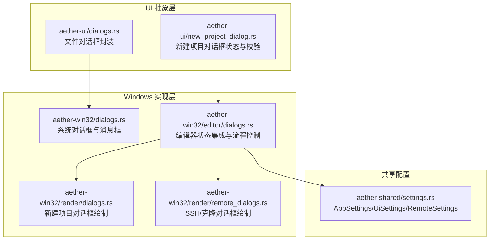
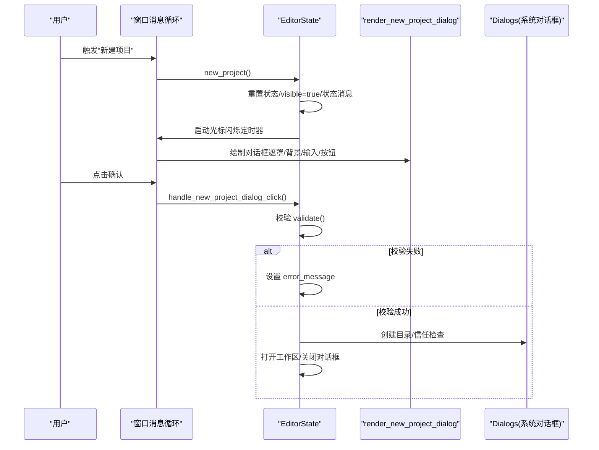
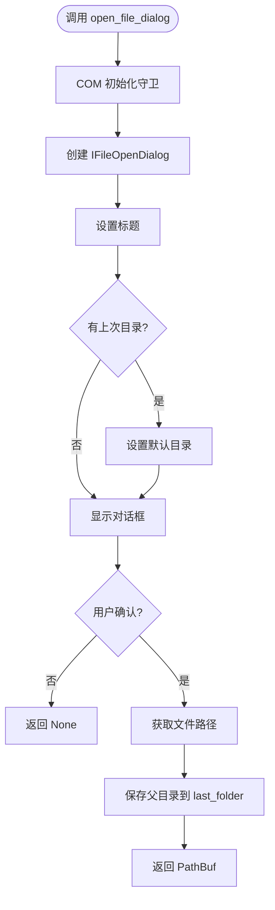
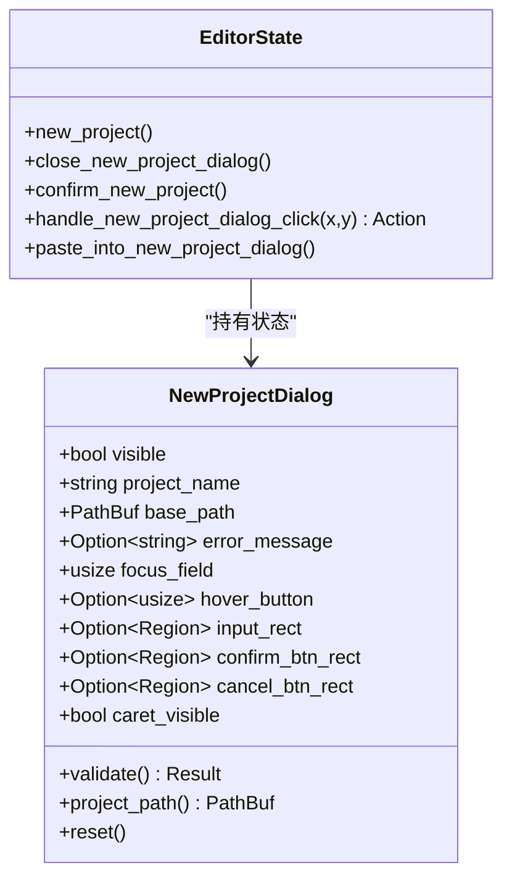
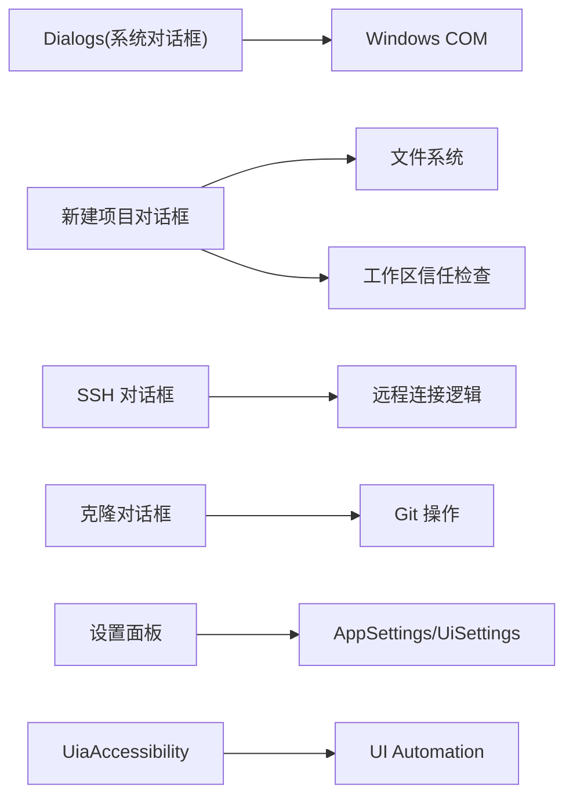

# 对话框组件

<cite>
**本文引用的文件**
- [crates/aether-ui/src/dialogs.rs](file://crates/aether-ui/src/dialogs.rs)
- [crates/aether-win32/src/dialogs.rs](file://crates/aether-win32/src/dialogs.rs)
- [crates/aether-win32/src/editor/dialogs.rs](file://crates/aether-win32/src/editor/dialogs.rs)
- [crates/aether-win32/src/render/dialogs.rs](file://crates/aether-win32/src/render/dialogs.rs)
- [crates/aether-win32/src/render/remote_dialogs.rs](file://crates/aether-win32/src/render/remote_dialogs.rs)
- [crates/aether-ui/src/new_project_dialog.rs](file://crates/aether-ui/src/new_project_dialog.rs)
- [crates/aether-shared/src/settings.rs](file://crates/aether-shared/src/settings.rs)
- [crates/aether-win32/src/uia.rs](file://crates/aether-win32/src/uia.rs)
</cite>

## 目录
1. [简介](#简介)
2. [项目结构](#项目结构)
3. [核心组件](#核心组件)
4. [架构总览](#架构总览)
5. [详细组件分析](#详细组件分析)
6. [依赖关系分析](#依赖关系分析)
7. [性能考虑](#性能考虑)
8. [故障排查指南](#故障排查指南)
9. [结论](#结论)
10. [附录](#附录)

## 简介
本文件为“对话框组件”的完整技术文档，覆盖以下内置对话框与能力：
- 系统级文件选择对话框（打开文件夹、打开文件、保存文件）
- 新建项目对话框（输入项目名称、校验、创建并打开工作区）
- SSH 连接对话框（主机/端口/用户名/认证方式/密码或密钥）
- 克隆仓库对话框（输入仓库 URL）
- 设置面板（通用/AI/模型/外观/远程/更新等页面）

文档重点说明：
- 生命周期管理（显示/隐藏、焦点、定时器、事件通知）
- 模态行为（遮罩层、阻塞交互）
- 数据绑定机制（状态字段与渲染区域映射）
- 布局系统与响应式（DPI 缩放、居中、固定宽高）
- 主题适配（颜色、字体、画刷缓存）
- API 接口（参数传递、回调处理、错误处理）
- 自定义对话框开发指南（模板、验证、交互）
- 可访问性支持与国际化现状
- 与主窗口的通信机制与状态同步策略

## 项目结构
对话框相关代码分布在 UI 抽象层与 Windows 平台实现层：
- aether-ui：跨平台 UI 抽象（文件对话框封装、新建项目对话框数据结构与校验）
- aether-win32：Windows 具体实现（Direct2D 绘制、系统消息框、编辑器状态集成）
- aether-shared：配置与持久化（AppSettings、UiSettings、RemoteSettings）
- aether-win32/uia：无障碍支持（UI Automation）

图表来源
- [crates/aether-ui/src/dialogs.rs:44-245](file://crates/aether-ui/src/dialogs.rs#L44-L245)
- [crates/aether-win32/src/dialogs.rs:44-245](file://crates/aether-win32/src/dialogs.rs#L44-L245)
- [crates/aether-win32/src/editor/dialogs.rs:4-153](file://crates/aether-win32/src/editor/dialogs.rs#L4-L153)
- [crates/aether-win32/src/render/dialogs.rs:4-405](file://crates/aether-win32/src/render/dialogs.rs#L4-L405)
- [crates/aether-win32/src/render/remote_dialogs.rs:4-800](file://crates/aether-win32/src/render/remote_dialogs.rs#L4-L800)
- [crates/aether-shared/src/settings.rs:6-23](file://crates/aether-shared/src/settings.rs#L6-L23)

章节来源
- [crates/aether-ui/src/dialogs.rs:44-245](file://crates/aether-ui/src/dialogs.rs#L44-L245)
- [crates/aether-win32/src/dialogs.rs:44-245](file://crates/aether-win32/src/dialogs.rs#L44-L245)
- [crates/aether-win32/src/editor/dialogs.rs:4-153](file://crates/aether-win32/src/editor/dialogs.rs#L4-L153)
- [crates/aether-win32/src/render/dialogs.rs:4-405](file://crates/aether-win32/src/render/dialogs.rs#L4-L405)
- [crates/aether-win32/src/render/remote_dialogs.rs:4-800](file://crates/aether-win32/src/render/remote_dialogs.rs#L4-L800)
- [crates/aether-shared/src/settings.rs:6-23](file://crates/aether-shared/src/settings.rs#L6-L23)

## 核心组件
- 文件对话框封装（Dialogs）
  - 提供 open_folder_dialog、open_file_dialog、save_file_dialog、open_c_file
  - 使用 COM 初始化守卫确保线程安全与资源释放
  - 记忆上次打开目录，提升用户体验
- 新建项目对话框（NewProjectDialog + EditorState 集成）
  - 状态包含可见性、项目名称、基础路径、错误信息、焦点字段、按钮区域、光标闪烁
  - 校验规则：非空、非法字符检查、路径存在性检查
  - 确认后创建目录、信任检查、打开工作区
- SSH 连接对话框
  - 字段：主机、端口、用户名、认证类型（密码/私钥/Agent）、密码或密钥路径、密码短语
  - 动态显示认证相关字段，敏感信息以掩码展示
- 克隆仓库对话框
  - 字段：仓库 URL
  - 错误提示与按钮交互
- 设置面板（多标签页）
  - 通用、AI、模型、外观、远程、更新等页面
  - 滚动区域、导航项、保存/测试按钮、下拉字段渲染

章节来源
- [crates/aether-ui/src/dialogs.rs:44-245](file://crates/aether-ui/src/dialogs.rs#L44-L245)
- [crates/aether-ui/src/new_project_dialog.rs:13-99](file://crates/aether-ui/src/new_project_dialog.rs#L13-L99)
- [crates/aether-win32/src/editor/dialogs.rs:4-153](file://crates/aether-win32/src/editor/dialogs.rs#L4-L153)
- [crates/aether-win32/src/render/remote_dialogs.rs:4-800](file://crates/aether-win32/src/render/remote_dialogs.rs#L4-L800)
- [crates/aether-win32/src/render/dialogs.rs:4-405](file://crates/aether-win32/src/render/dialogs.rs#L4-L405)

## 架构总览
对话框由“状态驱动渲染 + 事件驱动交互”的模式构成：
- 状态：EditorState/RemoteState 中的对话框状态对象（可见性、输入值、错误信息、焦点、区域矩形）
- 渲染：render_* 函数根据状态绘制遮罩、背景、控件、文本、按钮区域
- 交互：鼠标点击检测命中区域，返回动作枚举；编辑器逻辑处理动作，更新状态并触发重绘
- 系统对话框：通过 Dialogs 调用系统 API，结果回写状态或触发后续流程

图表来源
- [crates/aether-win32/src/editor/dialogs.rs:4-75](file://crates/aether-win32/src/editor/dialogs.rs#L4-L75)
- [crates/aether-win32/src/render/dialogs.rs:4-405](file://crates/aether-win32/src/render/dialogs.rs#L4-L405)
- [crates/aether-win32/src/dialogs.rs:44-245](file://crates/aether-win32/src/dialogs.rs#L44-L245)

## 详细组件分析

### 文件选择对话框（系统级）
- 功能
  - 打开文件夹：设置选项为选择文件夹模式，默认起始目录为上次打开位置
  - 打开文件：设置标题与默认目录，返回选中文件路径
  - 保存文件：设置标题与默认文件名，返回目标路径
  - 快捷方法：打开 C 文件（过滤 .c/.h/*.*）
- 模态行为
  - 使用系统模态对话框，阻塞当前窗口直到用户操作完成
- 错误处理
  - 若用户取消或系统错误，返回 None；调用方需处理空结果
- 持久化
  - 记录上次打开目录到本地配置文件，提升下次打开体验

图表来源
- [crates/aether-ui/src/dialogs.rs:101-149](file://crates/aether-ui/src/dialogs.rs#L101-L149)
- [crates/aether-win32/src/dialogs.rs:101-149](file://crates/aether-win32/src/dialogs.rs#L101-L149)

章节来源
- [crates/aether-ui/src/dialogs.rs:44-245](file://crates/aether-ui/src/dialogs.rs#L44-L245)
- [crates/aether-win32/src/dialogs.rs:44-245](file://crates/aether-win32/src/dialogs.rs#L44-L245)

### 新建项目对话框
- 状态与数据绑定
  - visible：控制显示/隐藏
  - project_name：用户输入的项目名称
  - base_path：默认项目根目录
  - error_message：错误提示
  - focus_field：当前焦点字段索引
  - hover_button：悬停按钮索引（用于高亮）
  - input_rect/confirm_btn_rect/cancel_btn_rect：渲染时计算并存储，用于点击检测
- 生命周期
  - 打开：new_project() 重置状态、设置 visible=true、设置状态消息、启动光标闪烁定时器
  - 关闭：close_new_project_dialog() 设置 visible=false、停止定时器、发送可见性变化事件
  - 确认：confirm_new_project() 校验、创建目录、信任检查、打开工作区
- 布局与响应式
  - 基于 DPI 缩放计算宽高与居中坐标
  - 固定宽度/高度，内部元素按相对位置排列
- 主题适配
  - 使用 render_ctx.brush_cache 获取颜色画刷，统一主题色
  - 文本格式通过 text_format_cache 获取，保证字体一致
- 交互与验证
  - 鼠标点击检测命中区域，返回动作枚举（Confirm/Cancel/FocusInput/None）
  - 校验规则：非空、非法字符、路径存在性
- 错误处理
  - 校验失败：设置 error_message
  - 目录创建失败：显示错误消息框
  - 信任检查失败：提示已取消打开不受信任的工作区

图表来源
- [crates/aether-ui/src/new_project_dialog.rs:13-99](file://crates/aether-ui/src/new_project_dialog.rs#L13-L99)
- [crates/aether-win32/src/editor/dialogs.rs:4-153](file://crates/aether-win32/src/editor/dialogs.rs#L4-L153)

章节来源
- [crates/aether-ui/src/new_project_dialog.rs:13-99](file://crates/aether-ui/src/new_project_dialog.rs#L13-L99)
- [crates/aether-win32/src/editor/dialogs.rs:4-153](file://crates/aether-win32/src/editor/dialogs.rs#L4-L153)
- [crates/aether-win32/src/render/dialogs.rs:4-405](file://crates/aether-win32/src/render/dialogs.rs#L4-L405)

### SSH 连接对话框
- 字段与交互
  - 主机、端口、用户名：静态字段
  - 认证类型：密码/私钥/Agent，动态显示对应字段
  - 密码/密钥路径/密码短语：敏感信息以掩码显示
  - 焦点管理：focus_field 控制当前输入框高亮边框
- 布局与主题
  - 固定尺寸，居中显示，遮罩层阻止背景交互
  - 使用主题画刷与文本格式，保持一致视觉风格
- 错误处理
  - 错误消息区域显示验证或连接错误信息
- 按钮
  - 连接：执行连接逻辑（由上层处理）
  - 取消：关闭对话框

章节来源
- [crates/aether-win32/src/render/remote_dialogs.rs:4-564](file://crates/aether-win32/src/render/remote_dialogs.rs#L4-L564)

### 克隆仓库对话框
- 字段与交互
  - 仓库 URL：输入框，焦点高亮
  - 错误消息：显示验证或网络错误
  - 按钮：Clone/Cancel
- 布局与主题
  - 固定尺寸，居中显示，遮罩层
  - 使用主题画刷与文本格式

章节来源
- [crates/aether-win32/src/render/remote_dialogs.rs:566-800](file://crates/aether-win32/src/render/remote_dialogs.rs#L566-L800)

### 设置面板（多标签页）
- 页面与内容
  - 通用：外观、字体、自动保存偏好
  - AI：AI 接口配置
  - 模型：管理 AI 模型配置
  - 外观：主题与界面自定义
  - 远程：SSH 与容器远程连接
  - 更新：版本与更新策略
- 交互
  - 左侧导航栏切换标签页
  - 右侧内容区域滚动，支持滚动条可视化
  - 保存/测试按钮：保存配置或仅验证连接
- 数据绑定
  - 下拉字段：厂商/模型等，由调用方传入列表
  - 滚动偏移：scroll_offset 控制内容可视区域

章节来源
- [crates/aether-win32/src/render/settings_general.rs:246-674](file://crates/aether-win32/src/render/settings_general.rs#L246-L674)
- [crates/aether-win32/src/render/settings_ai.rs:1760-1952](file://crates/aether-win32/src/render/settings_ai.rs#L1760-L1952)

## 依赖关系分析
- 文件对话框依赖 Windows Shell COM 接口，使用 CoInitializeEx 初始化，RAII 守卫确保释放
- 新建项目对话框依赖文件系统操作与信任检查，结合编辑器状态管理
- SSH/克隆对话框依赖远程连接逻辑（由上层实现），渲染层仅负责 UI
- 设置面板依赖 AppSettings/UiSettings/RemoteSettings 进行配置读写
- 无障碍支持通过 UiaAccessibility 提供 UI Automation 接口，便于屏幕阅读器访问

图表来源
- [crates/aether-ui/src/dialogs.rs:44-245](file://crates/aether-ui/src/dialogs.rs#L44-L245)
- [crates/aether-win32/src/editor/dialogs.rs:36-75](file://crates/aether-win32/src/editor/dialogs.rs#L36-L75)
- [crates/aether-shared/src/settings.rs:6-23](file://crates/aether-shared/src/settings.rs#L6-L23)
- [crates/aether-win32/src/uia.rs:1-62](file://crates/aether-win32/src/uia.rs#L1-L62)

章节来源
- [crates/aether-ui/src/dialogs.rs:44-245](file://crates/aether-ui/src/dialogs.rs#L44-L245)
- [crates/aether-win32/src/editor/dialogs.rs:36-75](file://crates/aether-win32/src/editor/dialogs.rs#L36-L75)
- [crates/aether-shared/src/settings.rs:6-23](file://crates/aether-shared/src/settings.rs#L6-L23)
- [crates/aether-win32/src/uia.rs:1-62](file://crates/aether-win32/src/uia.rs#L1-L62)

## 性能考虑
- 画刷与文本格式缓存：避免重复创建，提升渲染性能
- 区域命中检测：仅在渲染时计算并存储矩形区域，减少每帧计算开销
- 定时器优化：光标闪烁使用定时器，关闭对话框时及时销毁
- 系统对话框：COM 初始化守卫避免重复初始化，减少资源泄漏风险
- 大文件处理：设置面板中滚动区域按需渲染，避免一次性加载全部内容

## 故障排查指南
- 文件对话框无法打开
  - 检查 COM 初始化是否成功，确认线程上下文正确
  - 查看 last_folder 配置文件是否可读可写
- 新建项目对话框校验失败
  - 检查项目名称是否包含非法字符
  - 确认基础目录是否存在且可写
- SSH 连接失败
  - 验证主机、端口、用户名是否正确
  - 检查认证类型与对应字段（密码/密钥路径/密码短语）
- 设置面板保存失败
  - 检查 settings.json 权限与磁盘空间
  - 查看是否有损坏配置备份（settings.json.corrupt）

章节来源
- [crates/aether-ui/src/dialogs.rs:313-413](file://crates/aether-ui/src/dialogs.rs#L313-L413)
- [crates/aether-win32/src/editor/dialogs.rs:36-75](file://crates/aether-win32/src/editor/dialogs.rs#L36-L75)
- [crates/aether-shared/src/settings.rs:385-453](file://crates/aether-shared/src/settings.rs#L385-L453)

## 结论
对话框组件通过清晰的状态驱动渲染与事件驱动交互，实现了文件选择、项目创建、远程连接与设置管理等核心功能。其设计遵循模块化与可维护性原则，支持主题适配、响应式布局与基本可访问性。未来可扩展更多对话框类型，增强国际化与无障碍支持，进一步提升用户体验。

## 附录

### API 接口参考
- 文件对话框
  - open_folder_dialog(hwnd, title) -> Option<PathBuf>
  - open_file_dialog(hwnd, title, filters) -> Option<PathBuf>
  - save_file_dialog(hwnd, title, default_name) -> Option<PathBuf>
  - open_c_file(hwnd) -> Option<PathBuf>
- 消息框
  - show_error(hwnd, title, message)
  - show_info(hwnd, title, message)
  - confirm_yes_no(hwnd, title, message) -> bool
- 新建项目对话框
  - new_project()
  - close_new_project_dialog()
  - confirm_new_project()
  - handle_new_project_dialog_click(x, y) -> Action
  - paste_into_new_project_dialog()

章节来源
- [crates/aether-ui/src/dialogs.rs:44-245](file://crates/aether-ui/src/dialogs.rs#L44-L245)
- [crates/aether-win32/src/editor/dialogs.rs:4-153](file://crates/aether-win32/src/editor/dialogs.rs#L4-L153)

### 自定义对话框开发指南
- 模板
  - 定义状态结构体（可见性、输入字段、错误信息、焦点、区域矩形）
  - 实现渲染函数：绘制遮罩、背景、控件、文本、按钮区域
  - 实现交互处理：鼠标点击检测、键盘输入、焦点管理
- 验证逻辑
  - 在确认前执行校验，设置错误信息或阻止提交
- 用户交互
  - 支持焦点切换、悬停高亮、回车确认、ESC 取消
- 主题适配
  - 使用 render_ctx 缓存画刷与文本格式，保持主题一致性
- 可访问性
  - 为关键控件添加 UIA 属性，便于屏幕阅读器识别
- 国际化
  - 将硬编码字符串提取为可翻译资源，支持多语言切换

[本节为概念性指导，不直接分析具体文件]

### 与主窗口的通信机制与状态同步策略
- 事件通知
  - 对话框可见性变化时发送 EditorEvent::DialogVisibilityChanged
- 状态集中管理
  - EditorState 持有所有对话框状态，渲染与交互均围绕状态展开
- 异步操作
  - 系统对话框与文件系统操作可能耗时，需避免阻塞主线程
- 持久化
  - 设置与配置通过 AppSettings 原子写入，确保数据一致性

章节来源
- [crates/aether-win32/src/editor/dialogs.rs:4-33](file://crates/aether-win32/src/editor/dialogs.rs#L4-L33)
- [crates/aether-shared/src/settings.rs:455-559](file://crates/aether-shared/src/settings.rs#L455-L559)