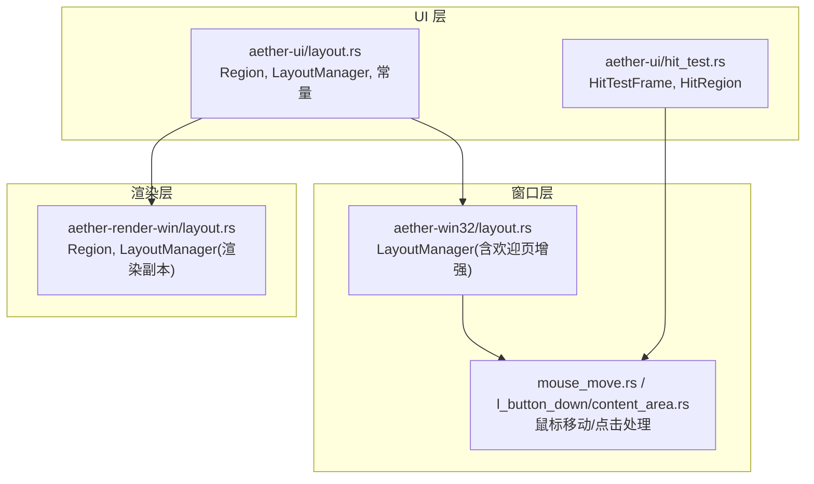
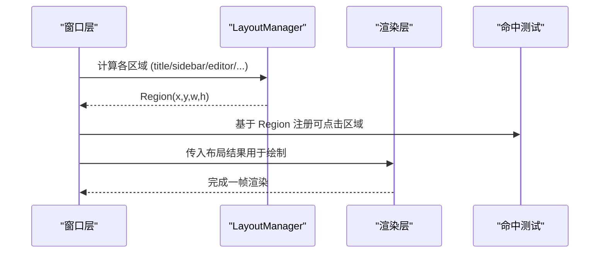
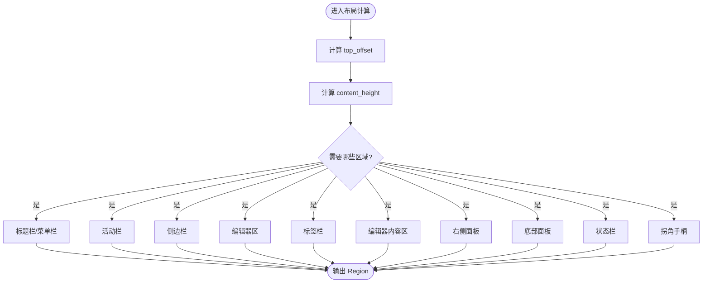
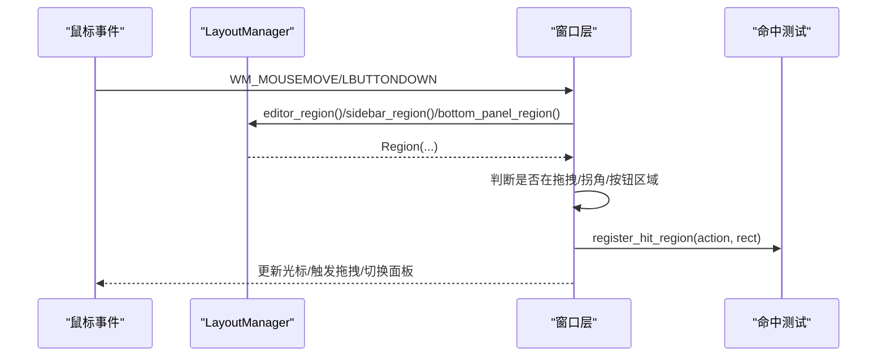
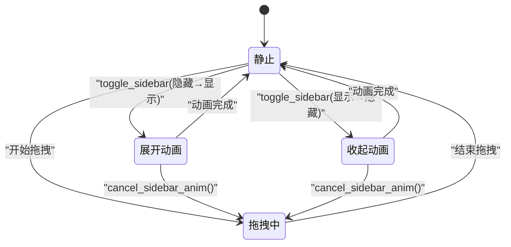
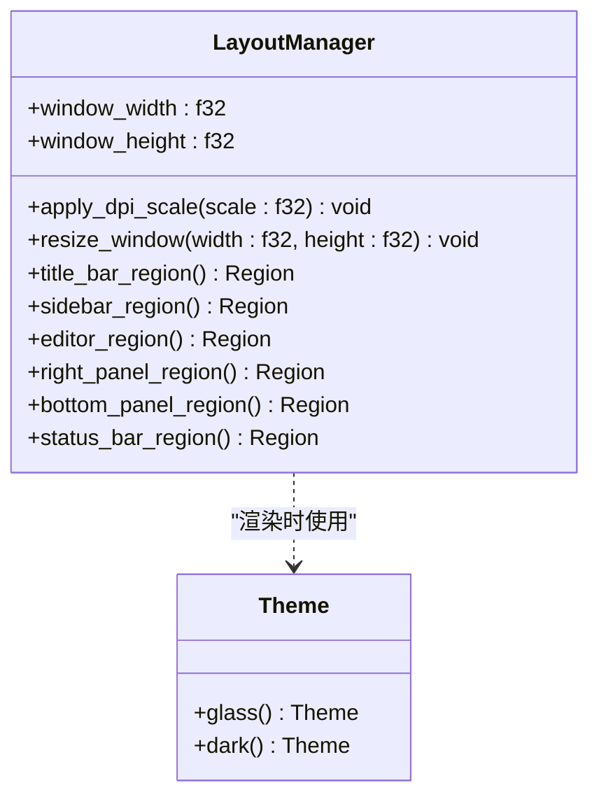
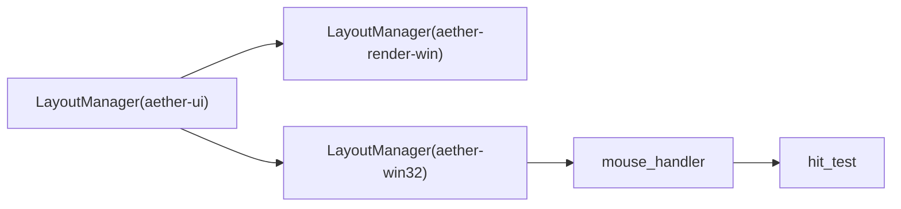

# 布局系统

<cite>
**本文引用的文件**
- [aether-ui/src/layout.rs](file://crates/aether-ui/src/layout.rs)
- [aether-render-win/src/layout.rs](file://crates/aether-render-win/src/layout.rs)
- [aether-win32/src/layout.rs](file://crates/aether-win32/src/layout.rs)
- [aether-ui/src/hit_test.rs](file://crates/aether-ui/src/hit_test.rs)
- [aether-win32/src/window/mouse_handler/mouse_move.rs](file://crates/aether-win32/src/window/mouse_handler/mouse_move.rs)
- [aether-win32/src/window/mouse_handler.rs](file://crates/aether-win32/src/window/mouse_handler.rs)
- [aether-win32/src/window/mouse_handler/l_button_down/content_area.rs](file://crates/aether-win32/src/window/mouse_handler/l_button_down/content_area.rs)
- [aether-ui/src/theme.rs](file://crates/aether-ui/src/theme.rs)
</cite>

## 目录
1. [简介](#简介)
2. [项目结构](#项目结构)
3. [核心组件](#核心组件)
4. [架构总览](#架构总览)
5. [详细组件分析](#详细组件分析)
6. [依赖关系分析](#依赖关系分析)
7. [性能考量](#性能考量)
8. [故障排查指南](#故障排查指南)
9. [结论](#结论)
10. [附录](#附录)

## 简介
本文件系统化梳理本项目中的 UI 布局子系统，覆盖区域划分、尺寸测量与重排、命中测试与鼠标事件分发、交互区域计算、API 接口（约束/尺寸/变换）、扩展机制（自定义容器/算法替换）以及性能优化策略（增量更新、虚拟滚动思路）。同时说明布局系统与主题系统的集成方式及响应式设计实现。

## 项目结构
布局相关代码主要分布在三个 crate：
- aether-ui：通用布局模型与管理器（Region、LayoutManager、常量、动画等）
- aether-render-win：渲染侧的布局副本（与 UI 层保持一致的区域计算）
- aether-win32：窗口层布局管理器（含欢迎页模式增强），以及与鼠标事件、拖拽、面板调整联动

图表来源
- [aether-ui/src/layout.rs:222-648](file://crates/aether-ui/src/layout.rs#L222-L648)
- [aether-render-win/src/layout.rs:222-648](file://crates/aether-render-win/src/layout.rs#L222-L648)
- [aether-win32/src/layout.rs:237-700](file://crates/aether-win32/src/layout.rs#L237-L700)
- [aether-win32/src/window/mouse_handler/mouse_move.rs:1140-1193](file://crates/aether-win32/src/window/mouse_handler/mouse_move.rs#L1140-L1193)
- [aether-win32/src/window/mouse_handler/l_button_down/content_area.rs:107-153](file://crates/aether-win32/src/window/mouse_handler/l_button_down/content_area.rs#L107-L153)

章节来源
- [aether-ui/src/layout.rs:1-221](file://crates/aether-ui/src/layout.rs#L1-L221)
- [aether-render-win/src/layout.rs:1-221](file://crates/aether-render-win/src/layout.rs#L1-L221)
- [aether-win32/src/layout.rs:1-236](file://crates/aether-win32/src/layout.rs#L1-L236)

## 核心组件
- Region：二维矩形区域，提供 contains/right/bottom 等基础几何方法，用于所有子区域的定位与命中判断。
- LayoutManager：布局引擎核心，维护窗口尺寸、各区域尺寸与可见性、DPI 缩放、动画状态，并提供计算各区域的方法（标题栏、菜单栏、活动栏、侧边栏、编辑器区、标签栏、编辑器内容区、右侧面板、底部面板、状态栏、拐角手柄）。
- TitlebarButtons：标题栏按钮布局单一事实源，集中计算按钮位置，避免多处重复导致的命中错位。
- SidebarAnim：侧边栏展开/收起的线性插值动画，持续 200ms。
- HitTestFrame/HitRegion：命中测试记录框架，调试构建下收集每帧可点击区域并输出 JSONL；release 构建零开销。

章节来源
- [aether-ui/src/layout.rs:222-648](file://crates/aether-ui/src/layout.rs#L222-L648)
- [aether-render-win/src/layout.rs:222-648](file://crates/aether-render-win/src/layout.rs#L222-L648)
- [aether-win32/src/layout.rs:237-700](file://crates/aether-win32/src/layout.rs#L237-L700)
- [aether-ui/src/hit_test.rs:1-178](file://crates/aether-ui/src/hit_test.rs#L1-L178)

## 架构总览
布局系统采用“声明式区域 + 计算式布局”的模式：
- 声明：通过常量定义默认尺寸（如标题栏高度、侧边栏宽度等），并通过可见性标志控制显示。
- 计算：每帧调用 LayoutManager 的各 region 方法，得到精确的 x/y/width/height。
- 交互：窗口层根据当前布局计算出的区域进行命中测试与事件分发（拖拽、调整大小、切换面板）。
- 渲染：渲染层复用相同的布局 API，保证 UI 与渲染一致。

图表来源
- [aether-win32/src/window/mouse_handler/mouse_move.rs:1140-1193](file://crates/aether-win32/src/window/mouse_handler/mouse_move.rs#L1140-L1193)
- [aether-ui/src/layout.rs:337-538](file://crates/aether-ui/src/layout.rs#L337-L538)
- [aether-ui/src/hit_test.rs:22-55](file://crates/aether-ui/src/hit_test.rs#L22-L55)

## 详细组件分析

### 区域与尺寸测量
- 顶部偏移 top_offset：累加标题栏与菜单栏高度，作为内容区的起始 y。
- 内容高度 content_height：从窗口高度中扣除标题栏、菜单栏、状态栏，确保非负。
- 各区域计算：
  - 标题栏/菜单栏：固定顶部，按可见性返回有效或空区域。
  - 活动栏：位于左侧，x=0，y=top_offset，高为 content_height。
  - 侧边栏：当活动栏可见时从 activity_bar_width 开始，否则从 0 开始；隐藏时宽度为 0。
  - 编辑器区：x 由活动栏与侧边栏占用决定，右边界受右侧面板影响；高为 content_height。
  - 标签栏：在编辑器区顶部，高度可选。
  - 编辑器内容区：排除标签栏与底部面板后剩余区域。
  - 右侧面板：靠右对齐，宽度可调。
  - 底部面板：位于编辑器区下半部分，不横跨活动栏/侧边栏。
  - 状态栏：固定在窗口底部。
  - 拐角手柄：仅在侧边栏+底部面板或右面板+底部面板同时可见时存在。

图表来源
- [aether-ui/src/layout.rs:337-538](file://crates/aether-ui/src/layout.rs#L337-L538)
- [aether-render-win/src/layout.rs:337-538](file://crates/aether-render-win/src/layout.rs#L337-L538)
- [aether-win32/src/layout.rs:374-578](file://crates/aether-win32/src/layout.rs#L374-L578)

章节来源
- [aether-ui/src/layout.rs:337-538](file://crates/aether-ui/src/layout.rs#L337-L538)
- [aether-render-win/src/layout.rs:337-538](file://crates/aether-render-win/src/layout.rs#L337-L538)
- [aether-win32/src/layout.rs:374-578](file://crates/aether-win32/src/layout.rs#L374-L578)

### 交互区域计算与命中测试
- 窗口层在鼠标移动/按下时，依据布局计算的 Region 确定：
  - 是否处于面板拖拽区域（右侧面板边缘、底部面板上边缘、侧边栏边缘）。
  - 是否处于拐角手柄区域（同时调整两条分割线）。
  - 是否处于标题栏按钮区域（通过 TitlebarButtons.compute 统一计算）。
- 命中测试模块 HitTestFrame 在调试构建中记录每帧可点击区域，便于自动化测试验证命中正确性。

图表来源
- [aether-win32/src/window/mouse_handler/mouse_move.rs:1140-1193](file://crates/aether-win32/src/window/mouse_handler/mouse_move.rs#L1140-L1193)
- [aether-win32/src/window/mouse_handler/l_button_down/content_area.rs:107-153](file://crates/aether-win32/src/window/mouse_handler/l_button_down/content_area.rs#L107-L153)
- [aether-ui/src/hit_test.rs:22-55](file://crates/aether-ui/src/hit_test.rs#L22-L55)

章节来源
- [aether-win32/src/window/mouse_handler/mouse_move.rs:1140-1193](file://crates/aether-win32/src/window/mouse_handler/mouse_move.rs#L1140-L1193)
- [aether-win32/src/window/mouse_handler/l_button_down/content_area.rs:107-153](file://crates/aether-win32/src/window/mouse_handler/l_button_down/content_area.rs#L107-L153)
- [aether-ui/src/hit_test.rs:1-178](file://crates/aether-ui/src/hit_test.rs#L1-L178)

### 布局动画与增量更新
- 侧边栏动画：toggle_sidebar 启动 200ms 线性插值，从 start_width 到 end_width；拖拽开始时 cancel_sidebar_anim 打断动画，避免跳变。
- 增量更新：拖拽过程中仅更新受影响区域（如侧边栏宽度、底部面板高度），并在 mouse_move 中节流重绘（约 120fps 最小帧间隔），减少频繁 InvalidateWindow 带来的性能压力。

图表来源
- [aether-ui/src/layout.rs:578-595](file://crates/aether-ui/src/layout.rs#L578-L595)
- [aether-render-win/src/layout.rs:578-595](file://crates/aether-render-win/src/layout.rs#L578-L595)
- [aether-win32/src/window/mouse_handler/mouse_move.rs:20-37](file://crates/aether-win32/src/window/mouse_handler/mouse_move.rs#L20-L37)

章节来源
- [aether-ui/src/layout.rs:578-595](file://crates/aether-ui/src/layout.rs#L578-L595)
- [aether-render-win/src/layout.rs:578-595](file://crates/aether-render-win/src/layout.rs#L578-L595)
- [aether-win32/src/window/mouse_handler/mouse_move.rs:20-37](file://crates/aether-win32/src/window/mouse_handler/mouse_move.rs#L20-L37)

### 主题系统集成与响应式设计
- DPI 缩放：apply_dpi_scale 将布局常量与用户可调尺寸按比例换算，确保高 DPI 显示器上 UI 元素尺寸正确。
- 主题：UI 层通过 theme.rs 暴露 glass_theme/dark_theme，供渲染层使用；布局本身与主题解耦，但尺寸与颜色由主题驱动。
- 响应式：通过窗口 resize_window 更新 window_width/window_height，重新计算各区域；侧边栏/右侧面板/底部面板支持动态调整，适应不同屏幕尺寸。

图表来源
- [aether-ui/src/layout.rs:316-335](file://crates/aether-ui/src/layout.rs#L316-L335)
- [aether-ui/src/theme.rs:1-26](file://crates/aether-ui/src/theme.rs#L1-L26)

章节来源
- [aether-ui/src/layout.rs:316-335](file://crates/aether-ui/src/layout.rs#L316-L335)
- [aether-ui/src/theme.rs:1-26](file://crates/aether-ui/src/theme.rs#L1-L26)

## 依赖关系分析
- 布局管理器与窗口层强耦合：窗口层依赖 LayoutManager 提供的区域计算进行事件分发与重绘。
- 渲染层复用相同布局 API：保证 UI 与渲染一致性。
- 命中测试模块独立：仅在调试构建启用，不影响 release 性能。

图表来源
- [aether-ui/src/layout.rs:222-648](file://crates/aether-ui/src/layout.rs#L222-L648)
- [aether-render-win/src/layout.rs:222-648](file://crates/aether-render-win/src/layout.rs#L222-L648)
- [aether-win32/src/layout.rs:237-700](file://crates/aether-win32/src/layout.rs#L237-L700)
- [aether-win32/src/window/mouse_handler/mouse_move.rs:1140-1193](file://crates/aether-win32/src/window/mouse_handler/mouse_move.rs#L1140-L1193)
- [aether-ui/src/hit_test.rs:1-178](file://crates/aether-ui/src/hit_test.rs#L1-L178)

章节来源
- [aether-ui/src/layout.rs:222-648](file://crates/aether-ui/src/layout.rs#L222-L648)
- [aether-render-win/src/layout.rs:222-648](file://crates/aether-render-win/src/layout.rs#L222-L648)
- [aether-win32/src/layout.rs:237-700](file://crates/aether-win32/src/layout.rs#L237-L700)
- [aether-win32/src/window/mouse_handler/mouse_move.rs:1140-1193](file://crates/aether-win32/src/window/mouse_handler/mouse_move.rs#L1140-L1193)
- [aether-ui/src/hit_test.rs:1-178](file://crates/aether-ui/src/hit_test.rs#L1-L178)

## 性能考量
- 节流重绘：面板拖拽期间限制重绘频率（最小帧间隔约 8ms），避免高回报率鼠标导致管线拥塞。
- 增量更新：仅更新受影响的区域（如侧边栏宽度变化只重绘侧边栏与相邻区域），减少整体重绘成本。
- 命中测试零开销：release 构建移除 Mutex 与文件 I/O，确保生产环境无额外负担。
- 动画平滑：200ms 线性插值提升用户体验，同时避免频繁状态切换。

[本节为通用性能指导，无需特定文件引用]

## 故障排查指南
- 命中错位：检查 TitlebarButtons.compute 是否被正确调用，确保按钮位置计算一致。
- 拖拽卡顿：确认 panel_drag_should_sync_paint 节流逻辑生效，避免每帧都重绘。
- 面板尺寸异常：检查 resize_* 方法的 clamp 逻辑，确保不超过窗口比例上限（如 0.8 倍）。
- 动画中断：拖拽开始时应调用 cancel_sidebar_anim，避免动画与拖拽冲突。

章节来源
- [aether-win32/src/window/mouse_handler/mouse_move.rs:20-37](file://crates/aether-win32/src/window/mouse_handler/mouse_move.rs#L20-L37)
- [aether-win32/src/window/mouse_handler.rs:44-68](file://crates/aether-win32/src/window/mouse_handler.rs#L44-L68)
- [aether-ui/src/layout.rs:540-576](file://crates/aether-ui/src/layout.rs#L540-L576)
- [aether-render-win/src/layout.rs:540-576](file://crates/aether-render-win/src/layout.rs#L540-L576)
- [aether-win32/src/layout.rs:580-616](file://crates/aether-win32/src/layout.rs#L580-L616)

## 结论
本布局系统以 Region 为基础，通过 LayoutManager 提供稳定、可预测的区域计算能力，结合窗口层的命中测试与事件分发，实现了灵活的界面布局与交互。通过 DPI 缩放、动画与节流重绘，系统在多分辨率与高刷新率场景下保持良好性能。未来可扩展自定义布局容器与算法，以满足更复杂的界面需求。

[本节为总结，无需特定文件引用]

## 附录

### API 接口概览
- 布局约束：
  - 常量：TITLE_BAR_HEIGHT、MENU_BAR_HEIGHT、ACTIVITY_BAR_WIDTH、SIDEBAR_WIDTH、STATUS_BAR_HEIGHT、TAB_BAR_HEIGHT、MIN_SIDEBAR_WIDTH、MAX_SIDEBAR_WIDTH、MIN_BOTTOM_PANEL_HEIGHT、MIN_RIGHT_PANEL_WIDTH、CORNER_HANDLE_SIZE、FILE_TREE_ROW_HEIGHT、FILE_TREE_INDENT、FILE_TREE_HEADER_HEIGHT、FILE_TREE_ARROW_COL。
  - 可见性标志：title_bar_visible、menu_bar_visible、activity_bar_visible、sidebar_visible、right_panel_visible、bottom_panel_visible、status_bar_visible。
- 尺寸计算：
  - top_offset()、content_height()、title_bar_region()、menu_bar_region()、activity_bar_region()、sidebar_region()、editor_region()、tab_bar_region(show_tab_bar)、editor_content_region(show_tab_bar)、right_panel_region()、bottom_panel_region()、status_bar_region()、corner_left_handle()、corner_right_handle()。
- 位置变换：
  - resize_window(width, height)、apply_dpi_scale(scale)。
- 交互操作：
  - toggle_sidebar()、toggle_activity_bar()、toggle_status_bar()、toggle_bottom_panel()、toggle_right_panel()、resize_sidebar(delta)、resize_right_panel(delta)、resize_bottom_panel(delta)、set_sidebar_width_or_collapse(desired_width)、cancel_sidebar_anim()。

章节来源
- [aether-ui/src/layout.rs:125-221](file://crates/aether-ui/src/layout.rs#L125-L221)
- [aether-ui/src/layout.rs:337-648](file://crates/aether-ui/src/layout.rs#L337-L648)
- [aether-render-win/src/layout.rs:125-221](file://crates/aether-render-win/src/layout.rs#L125-L221)
- [aether-render-win/src/layout.rs:337-648](file://crates/aether-render-win/src/layout.rs#L337-L648)
- [aether-win32/src/layout.rs:125-235](file://crates/aether-win32/src/layout.rs#L125-L235)
- [aether-win32/src/layout.rs:374-700](file://crates/aether-win32/src/layout.rs#L374-L700)

### 扩展机制
- 自定义布局容器：可通过组合 Region 与 LayoutManager 的方法，封装复杂容器的布局逻辑（如嵌套面板、自适应网格）。
- 布局算法替换：在窗口层或渲染层替换 LayoutManager 的实现，注入新的区域计算规则（例如基于 CSS 风格的 flex/grid 布局）。
- 主题集成：通过 theme.rs 提供的主题对象，统一控制颜色与样式，布局尺寸可与主题配置联动（如字体大小影响行高）。

[本节为概念性扩展指导，无需特定文件引用]