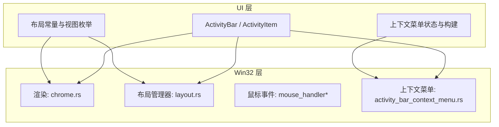
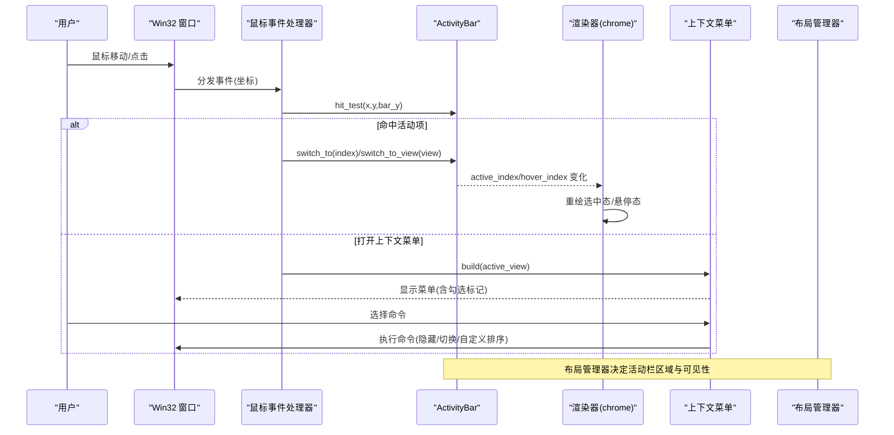
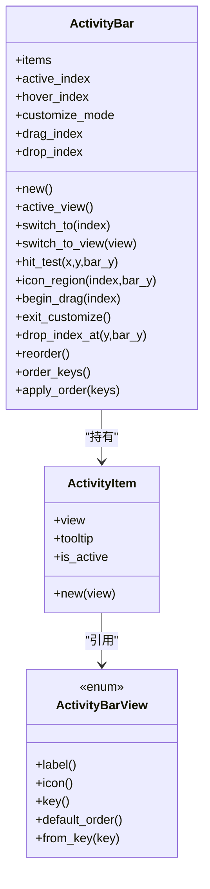
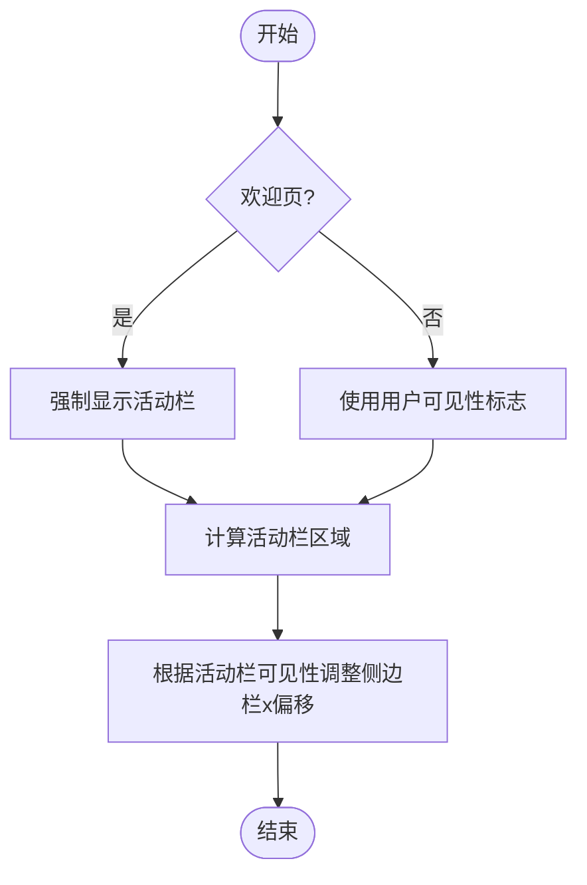
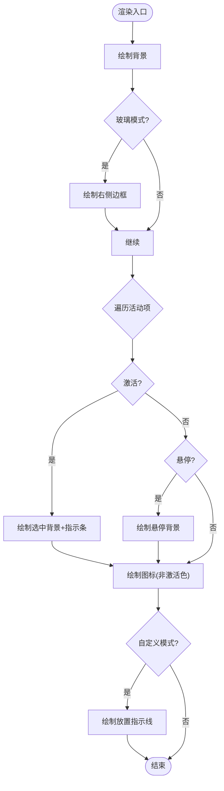
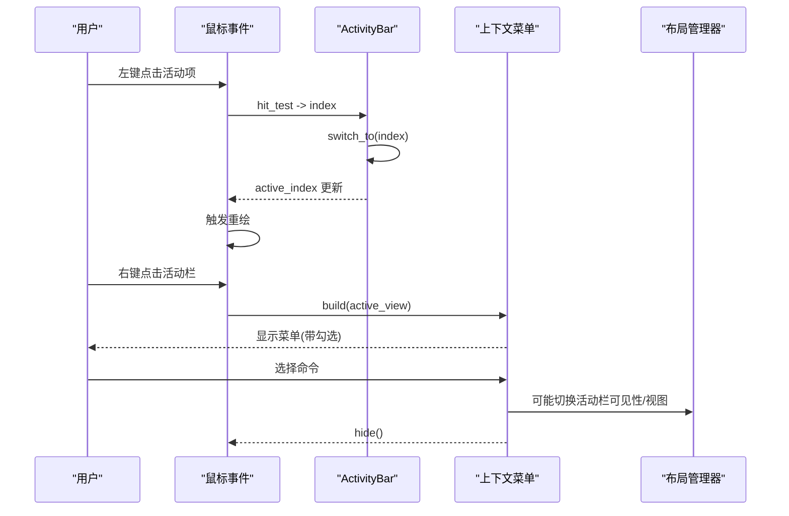
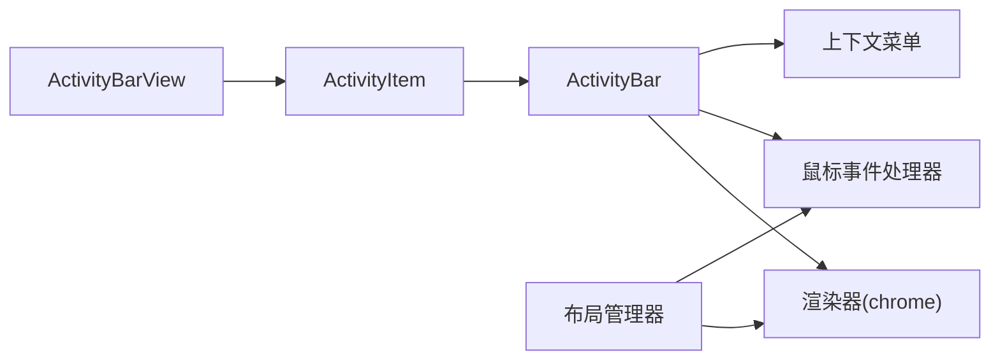

# 活动栏组件

<cite>
**本文引用的文件**
- [crates/aether-win32/src/activity_bar.rs](file://crates/aether-win32/src/activity_bar.rs)
- [crates/aether-ui/src/activity_bar.rs](file://crates/aether-ui/src/activity_bar.rs)
- [crates/aether-win32/src/layout.rs](file://crates/aether-win32/src/layout.rs)
- [crates/aether-ui/src/layout.rs](file://crates/aether-ui/src/layout.rs)
- [crates/aether-win32/src/render/chrome.rs](file://crates/aether-win32/src/render/chrome.rs)
- [crates/aether-win32/src/window/mouse_handler.rs](file://crates/aether-win32/src/window/mouse_handler.rs)
- [crates/aether-win32/src/window/mouse_handler/mouse_move.rs](file://crates/aether-win32/src/window/mouse_handler/mouse_move.rs)
- [crates/aether-win32/src/window/mouse_handler/l_button_down/top_area.rs](file://crates/aether-win32/src/window/mouse_handler/l_button_down/top_area.rs)
- [crates/aether-win32/src/activity_bar_context_menu.rs](file://crates/aether-win32/src/activity_bar_context_menu.rs)
- [crates/aether-ui/src/activity_bar_context_menu.rs](file://crates/aether-ui/src/activity_bar_context_menu.rs)
</cite>

## 目录
1. [简介](#简介)
2. [项目结构](#项目结构)
3. [核心组件](#核心组件)
4. [架构总览](#架构总览)
5. [详细组件分析](#详细组件分析)
6. [依赖关系分析](#依赖关系分析)
7. [性能与内存优化](#性能与内存优化)
8. [故障排查指南](#故障排查指南)
9. [结论](#结论)
10. [附录：扩展与定制示例](#附录扩展与定制示例)

## 简介
本文件为“活动栏”组件的完整技术文档，覆盖其实现原理、交互逻辑、生命周期管理、事件处理机制、上下文菜单集成、与编辑器面板的切换与状态同步、自定义扩展点、样式定制以及性能优化建议。目标是帮助开发者快速理解并安全地扩展现有功能或开发新的活动项。

## 项目结构
活动栏由 UI 层（aether-ui）与 Windows 平台层（aether-win32）共同实现：
- aether-ui：定义 ActivityBar/ActivityItem 数据结构、布局常量、视图枚举及基础行为（点击检测、拖拽重排、顺序持久化）。
- aether-win32：负责渲染、鼠标事件分发、上下文菜单构建与执行、窗口布局计算与可见性控制。

图表来源
- [crates/aether-win32/src/render/chrome.rs:1227-1419](file://crates/aether-win32/src/render/chrome.rs#L1227-L1419)
- [crates/aether-win32/src/layout.rs:33-96](file://crates/aether-win32/src/layout.rs#L33-L96)
- [crates/aether-win32/src/activity_bar_context_menu.rs:15-171](file://crates/aether-win32/src/activity_bar_context_menu.rs#L15-L171)

章节来源
- [crates/aether-win32/src/activity_bar.rs:1-186](file://crates/aether-win32/src/activity_bar.rs#L1-L186)
- [crates/aether-ui/src/activity_bar.rs:1-186](file://crates/aether-ui/src/activity_bar.rs#L1-L186)
- [crates/aether-win32/src/layout.rs:125-224](file://crates/aether-win32/src/layout.rs#L125-L224)
- [crates/aether-ui/src/layout.rs:125-209](file://crates/aether-ui/src/layout.rs#L125-L209)

## 核心组件
- ActivityItem：表示一个活动栏图标项，包含视图类型、提示文本、是否激活标志。
- ActivityBar：维护活动项列表、当前激活索引、悬停索引、自定义模式开关、拖拽源与目标索引；提供切换、命中测试、区域计算、拖拽重排、顺序持久化等方法。
- ActivityBarView：活动视图枚举，提供标签、图标、稳定键、默认顺序、从键解析等能力。
- LayoutManager：计算活动栏区域、侧边栏与编辑器区域的几何布局，管理活动栏可见性与欢迎页特殊行为。
- ActivityBarContextMenuState：右键菜单的状态、构建、命中测试、位置校正与 hover 更新。

章节来源
- [crates/aether-win32/src/activity_bar.rs:1-186](file://crates/aether-win32/src/activity_bar.rs#L1-L186)
- [crates/aether-win32/src/layout.rs:33-96](file://crates/aether-win32/src/layout.rs#L33-L96)
- [crates/aether-win32/src/layout.rs:358-447](file://crates/aether-win32/src/layout.rs#L358-L447)
- [crates/aether-win32/src/activity_bar_context_menu.rs:68-171](file://crates/aether-win32/src/activity_bar_context_menu.rs#L68-L171)

## 架构总览
活动栏在渲染时绘制背景、选中态高亮条、图标与悬停效果；在事件流中通过命中测试定位到具体图标项，触发切换或进入自定义排序模式；上下文菜单根据当前活动视图动态勾选对应项，并在点击后执行隐藏活动栏、切换视图等操作。

图表来源
- [crates/aether-win32/src/render/chrome.rs:1227-1419](file://crates/aether-win32/src/render/chrome.rs#L1227-L1419)
- [crates/aether-win32/src/activity_bar_context_menu.rs:121-171](file://crates/aether-win32/src/activity_bar_context_menu.rs#L121-L171)
- [crates/aether-win32/src/window/mouse_handler.rs:45-147](file://crates/aether-win32/src/window/mouse_handler.rs#L45-L147)

## 详细组件分析

### 活动栏数据模型与状态
- ActivityItem：封装单个活动项，tooltip 默认取自视图 label，is_active 用于渲染高亮。
- ActivityBar：
  - items：活动项列表，顺序可持久化。
  - active_index：当前激活项索引。
  - hover_index：鼠标悬停项索引。
  - customize_mode/drag_index/drop_index：自定义排序模式与拖拽状态。
  - 方法：active_view、switch_to、switch_to_view、hit_test、icon_region、begin_drag、exit_customize、drop_index_at、reorder、order_keys、apply_order。

图表来源
- [crates/aether-win32/src/activity_bar.rs:1-186](file://crates/aether-win32/src/activity_bar.rs#L1-L186)
- [crates/aether-win32/src/layout.rs:33-96](file://crates/aether-win32/src/layout.rs#L33-L96)

章节来源
- [crates/aether-win32/src/activity_bar.rs:1-186](file://crates/aether-win32/src/activity_bar.rs#L1-L186)
- [crates/aether-ui/src/activity_bar.rs:1-186](file://crates/aether-ui/src/activity_bar.rs#L1-L186)
- [crates/aether-win32/src/layout.rs:33-96](file://crates/aether-win32/src/layout.rs#L33-L96)

### 布局与可见性
- 布局常量：ACTIVITY_BAR_WIDTH、ACTIVITY_BAR_BUTTON_SIZE 等。
- LayoutManager：
  - activity_bar_region：计算活动栏矩形区域，支持欢迎页固定常驻。
  - sidebar_region/editor_region：根据活动栏可见性调整侧边栏与编辑器的起始 x 偏移。
  - toggle_activity_bar：切换活动栏可见性（欢迎页下不可关闭）。
  - apply_dpi_scale：DPI 缩放时按比例换算活动栏宽度等尺寸。

图表来源
- [crates/aether-win32/src/layout.rs:358-447](file://crates/aether-win32/src/layout.rs#L358-L447)
- [crates/aether-win32/src/layout.rs:650-657](file://crates/aether-win32/src/layout.rs#L650-L657)

章节来源
- [crates/aether-win32/src/layout.rs:125-224](file://crates/aether-win32/src/layout.rs#L125-L224)
- [crates/aether-win32/src/layout.rs:358-447](file://crates/aether-win32/src/layout.rs#L358-L447)
- [crates/aether-win32/src/layout.rs:650-657](file://crates/aether-win32/src/layout.rs#L650-L657)

### 渲染与视觉反馈
- 渲染流程：
  - 填充背景色（玻璃模式下使用主题色），非玻璃模式使用深色背景。
  - 若启用玻璃模式，绘制右侧柔和边框。
  - 遍历活动项：
    - 若为激活项：绘制选中背景与左侧高亮指示条。
    - 若为悬停项：绘制悬停背景。
    - 自定义模式下：对拖拽中的项添加半透明高亮覆盖。
    - 绘制图标（激活/非激活不同颜色）。
  - 注册命中区域以便调试与测试。
  - 自定义模式下：绘制放置指示线。

图表来源
- [crates/aether-win32/src/render/chrome.rs:1227-1419](file://crates/aether-win32/src/render/chrome.rs#L1227-L1419)

章节来源
- [crates/aether-win32/src/render/chrome.rs:1227-1419](file://crates/aether-win32/src/render/chrome.rs#L1227-L1419)

### 事件处理与交互逻辑
- 命中测试：
  - ActivityBar::hit_test：基于 ACTIVITY_BAR_WIDTH 与 ACTIVITY_BAR_BUTTON_SIZE 计算点击行索引。
  - ActivityBar::icon_region：返回指定索引的图标矩形区域。
- 左键点击：
  - 若命中活动项：调用 switch_to/switch_to_view 切换活动视图。
  - 若命中上下文菜单：执行对应命令（隐藏活动栏、切换视图、自定义排序等）。
- 右键点击：
  - 构建上下文菜单：根据当前活动视图设置勾选标记。
  - 打开菜单并做窗口边界校正。
- 鼠标移动：
  - 更新上下文菜单 hover_index，必要时触发重绘。
- 长按与拖拽：
  - begin_drag：进入自定义模式，记录 drag_index 与 drop_index。
  - reorder：将 drag_index 移动到 drop_index，保持 active_index 跟随。
  - 释放时持久化顺序到应用设置。

图表来源
- [crates/aether-win32/src/activity_bar.rs:52-137](file://crates/aether-win32/src/activity_bar.rs#L52-L137)
- [crates/aether-win32/src/activity_bar_context_menu.rs:121-171](file://crates/aether-win32/src/activity_bar_context_menu.rs#L121-L171)
- [crates/aether-win32/src/window/mouse_handler.rs:45-147](file://crates/aether-win32/src/window/mouse_handler.rs#L45-L147)
- [crates/aether-win32/src/window/mouse_handler/mouse_move.rs:501-509](file://crates/aether-win32/src/window/mouse_handler/mouse_move.rs#L501-L509)
- [crates/aether-win32/src/window/mouse_handler/l_button_down/top_area.rs:580-626](file://crates/aether-win32/src/window/mouse_handler/l_button_down/top_area.rs#L580-L626)

章节来源
- [crates/aether-win32/src/activity_bar.rs:52-137](file://crates/aether-win32/src/activity_bar.rs#L52-L137)
- [crates/aether-win32/src/activity_bar_context_menu.rs:121-171](file://crates/aether-win32/src/activity_bar_context_menu.rs#L121-L171)
- [crates/aether-win32/src/window/mouse_handler.rs:45-147](file://crates/aether-win32/src/window/mouse_handler.rs#L45-L147)
- [crates/aether-win32/src/window/mouse_handler/mouse_move.rs:501-509](file://crates/aether-win32/src/window/mouse_handler/mouse_move.rs#L501-L509)
- [crates/aether-win32/src/window/mouse_handler/l_button_down/top_area.rs:580-626](file://crates/aether-win32/src/window/mouse_handler/l_button_down/top_area.rs#L580-L626)

### 上下文菜单集成
- 菜单项：隐藏活动栏、自定义排序、分隔符、切换到各视图（资源管理器、源代码管理、终端、远程管理、AI 助手）。
- 构建：根据当前活动视图设置勾选标记。
- 命中测试：跳过分隔符，返回普通项索引。
- 位置校正：确保菜单不超出窗口边界。
- 命令执行：隐藏活动栏、切换视图、自定义排序（占位提示）。

章节来源
- [crates/aether-win32/src/activity_bar_context_menu.rs:15-171](file://crates/aether-win32/src/activity_bar_context_menu.rs#L15-L171)
- [crates/aether-win32/src/activity_bar_context_menu.rs:204-244](file://crates/aether-win32/src/activity_bar_context_menu.rs#L204-L244)
- [crates/aether-win32/src/window/mouse_handler/l_button_down/top_area.rs:580-626](file://crates/aether-win32/src/window/mouse_handler/l_button_down/top_area.rs#L580-L626)

### 与编辑器面板的切换逻辑和状态同步
- 切换逻辑：
  - 通过 ActivityBar::switch_to/switch_to_view 更新 active_index 与 is_active。
  - 渲染器依据 active_index 绘制选中态与指示条。
  - 布局管理器根据活动栏可见性调整侧边栏与编辑器区域。
- 状态同步：
  - 自定义排序完成后，持久化 order_keys 到应用设置，下次启动恢复顺序。
  - 欢迎页场景下活动栏固定常驻，侧边栏面板默认隐藏但可通过图标调起。

章节来源
- [crates/aether-win32/src/activity_bar.rs:52-186](file://crates/aether-win32/src/activity_bar.rs#L52-L186)
- [crates/aether-win32/src/render/chrome.rs:1227-1419](file://crates/aether-win32/src/render/chrome.rs#L1227-L1419)
- [crates/aether-win32/src/layout.rs:358-447](file://crates/aether-win32/src/layout.rs#L358-L447)
- [crates/aether-win32/src/window/mouse_handler.rs:92-107](file://crates/aether-win32/src/window/mouse_handler.rs#L92-L107)

## 依赖关系分析
- ActivityBar 依赖 ActivityBarView 获取标签、图标、键与默认顺序。
- 渲染器依赖布局常量与主题配置进行绘制。
- 鼠标事件处理器依赖 ActivityBar 的命中测试与状态变更。
- 上下文菜单依赖当前活动视图以构建勾选状态。
- 布局管理器统一管理活动栏、侧边栏、编辑器区域的几何与可见性。

图表来源
- [crates/aether-win32/src/activity_bar.rs:1-186](file://crates/aether-win32/src/activity_bar.rs#L1-L186)
- [crates/aether-win32/src/layout.rs:33-96](file://crates/aether-win32/src/layout.rs#L33-L96)
- [crates/aether-win32/src/render/chrome.rs:1227-1419](file://crates/aether-win32/src/render/chrome.rs#L1227-L1419)
- [crates/aether-win32/src/window/mouse_handler.rs:45-147](file://crates/aether-win32/src/window/mouse_handler.rs#L45-L147)
- [crates/aether-win32/src/activity_bar_context_menu.rs:121-171](file://crates/aether-win32/src/activity_bar_context_menu.rs#L121-L171)

章节来源
- [crates/aether-win32/src/activity_bar.rs:1-186](file://crates/aether-win32/src/activity_bar.rs#L1-L186)
- [crates/aether-win32/src/layout.rs:33-96](file://crates/aether-win32/src/layout.rs#L33-L96)
- [crates/aether-win32/src/render/chrome.rs:1227-1419](file://crates/aether-win32/src/render/chrome.rs#L1227-L1419)
- [crates/aether-win32/src/window/mouse_handler.rs:45-147](file://crates/aether-win32/src/window/mouse_handler.rs#L45-L147)
- [crates/aether-win32/src/activity_bar_context_menu.rs:121-171](file://crates/aether-win32/src/activity_bar_context_menu.rs#L121-L171)

## 性能与内存优化
- 渲染优化：
  - 使用 brush_cache 缓存画笔，减少重复创建开销。
  - 仅在状态变化时触发重绘（如 active_index/hover_index 变化）。
  - 自定义模式下仅绘制必要的指示线与半透明覆盖。
- 命中测试优化：
  - 基于常量尺寸进行 O(1) 数学计算，避免复杂几何判断。
- 内存管理：
  - ActivityBar 与 ActivityItem 为轻量结构体，频繁克隆成本低。
  - 自定义排序完成后立即持久化并清理拖拽状态，避免长期占用。
- DPI 适配：
  - 通过 apply_dpi_scale 统一缩放布局常量，避免多处以硬编码像素导致的性能抖动与重排。

[本节为通用指导，不直接分析具体文件]

## 故障排查指南
- 活动栏不显示：
  - 检查 LayoutManager.activity_bar_visible 与 welcome_active 的影响。
  - 确认 activity_bar_region 计算的 width 是否为 0。
- 点击无响应：
  - 验证 hit_test 使用的 ACTIVITY_BAR_WIDTH 与 ACTIVITY_BAR_BUTTON_SIZE 是否与渲染一致。
  - 检查鼠标事件是否正确分发到活动栏区域。
- 上下文菜单异常：
  - 确认 build(active_view) 是否正确设置勾选标记。
  - 检查 open_at 的窗口边界校正是否导致菜单位置异常。
- 自定义排序未保存：
  - 确认 on_l_button_up 中 persist_activity 分支是否执行 reorder 与 save。

章节来源
- [crates/aether-win32/src/layout.rs:358-447](file://crates/aether-win32/src/layout.rs#L358-L447)
- [crates/aether-win32/src/activity_bar.rs:73-137](file://crates/aether-win32/src/activity_bar.rs#L73-L137)
- [crates/aether-win32/src/activity_bar_context_menu.rs:195-244](file://crates/aether-win32/src/activity_bar_context_menu.rs#L195-L244)
- [crates/aether-win32/src/window/mouse_handler.rs:92-107](file://crates/aether-win32/src/window/mouse_handler.rs#L92-L107)

## 结论
活动栏组件通过清晰的数据结构与分层设计，实现了稳定的视图切换、直观的视觉反馈、灵活的自定义排序与上下文菜单集成。布局管理器确保了在不同场景下的正确显示与交互。遵循本文档的扩展指南与优化建议，可以安全地新增活动项或定制样式，同时保持良好的性能与用户体验。

[本节为总结，不直接分析具体文件]

## 附录：扩展与定制示例

### 新增活动项的步骤
- 定义新视图：
  - 在 ActivityBarView 中添加新变体，并提供 label、icon、key。
  - 如需保留默认顺序，更新 default_order。
- 初始化活动项：
  - 在 ActivityBar::new 中为 ActivityBarView 创建 ActivityItem。
- 渲染支持：
  - 确保渲染器能识别新视图的图标与选中态。
- 上下文菜单：
  - 在 ActivityBarContextMenuState::build 中添加对应菜单项与勾选逻辑。
- 事件处理：
  - 在鼠标事件中处理新视图的切换命令。

章节来源
- [crates/aether-win32/src/layout.rs:33-96](file://crates/aether-win32/src/layout.rs#L33-L96)
- [crates/aether-win32/src/activity_bar.rs:35-50](file://crates/aether-win32/src/activity_bar.rs#L35-L50)
- [crates/aether-win32/src/activity_bar_context_menu.rs:121-171](file://crates/aether-win32/src/activity_bar_context_menu.rs#L121-L171)
- [crates/aether-win32/src/window/mouse_handler/l_button_down/top_area.rs:580-626](file://crates/aether-win32/src/window/mouse_handler/l_button_down/top_area.rs#L580-L626)

### 样式定制要点
- 背景与边框：
  - 修改渲染器中的背景色与玻璃模式边框绘制逻辑。
- 选中态与悬停态：
  - 调整选中背景与指示条颜色、宽度。
  - 调整悬停背景颜色。
- 图标颜色：
  - 区分激活与非激活图标颜色，确保对比度。

章节来源
- [crates/aether-win32/src/render/chrome.rs:1227-1419](file://crates/aether-win32/src/render/chrome.rs#L1227-L1419)

### 自定义排序与持久化
- 进入自定义模式：
  - 调用 begin_drag 记录拖拽源与目标。
- 执行重排：
  - 调用 reorder 更新 items 顺序与 active_index。
- 持久化：
  - 在鼠标释放时保存 order_keys 到应用设置。

章节来源
- [crates/aether-win32/src/activity_bar.rs:98-186](file://crates/aether-win32/src/activity_bar.rs#L98-L186)
- [crates/aether-win32/src/window/mouse_handler.rs:92-107](file://crates/aether-win32/src/window/mouse_handler.rs#L92-L107)