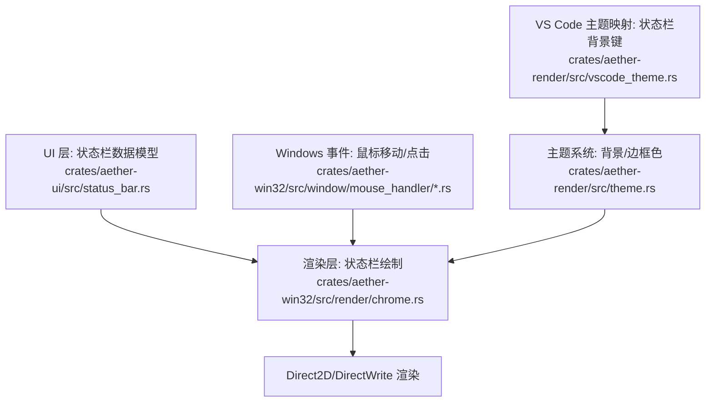
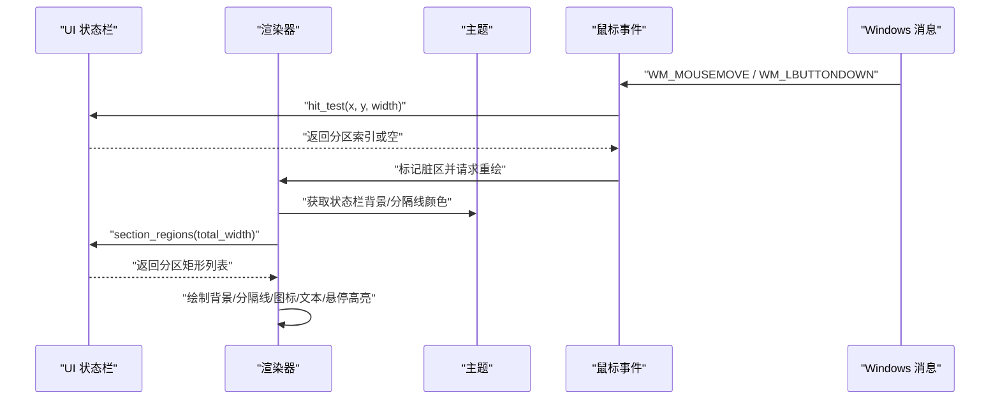
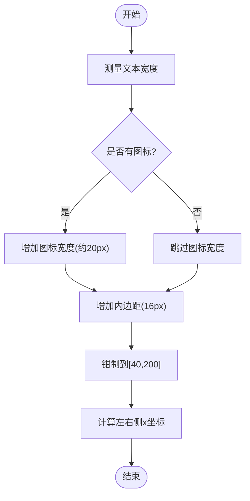
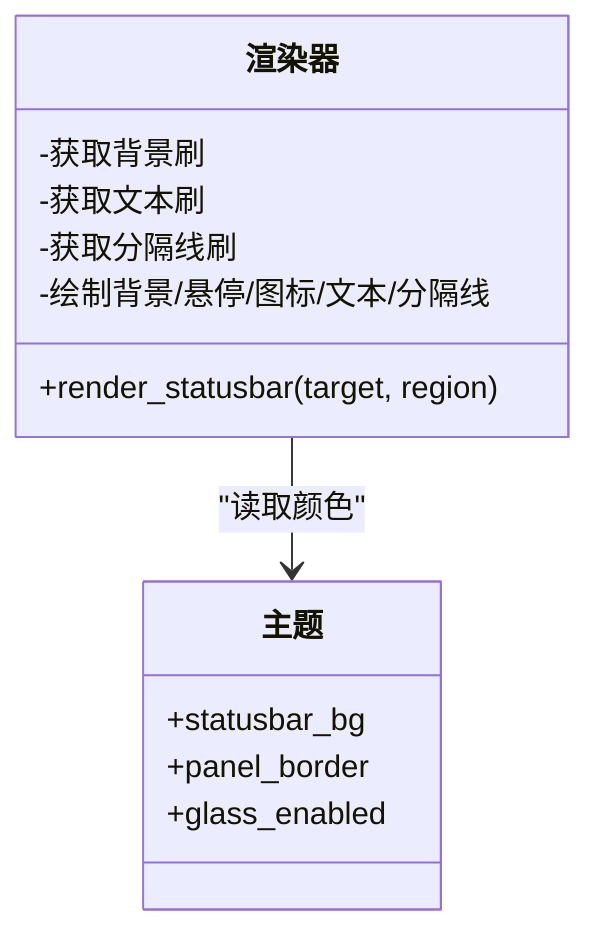
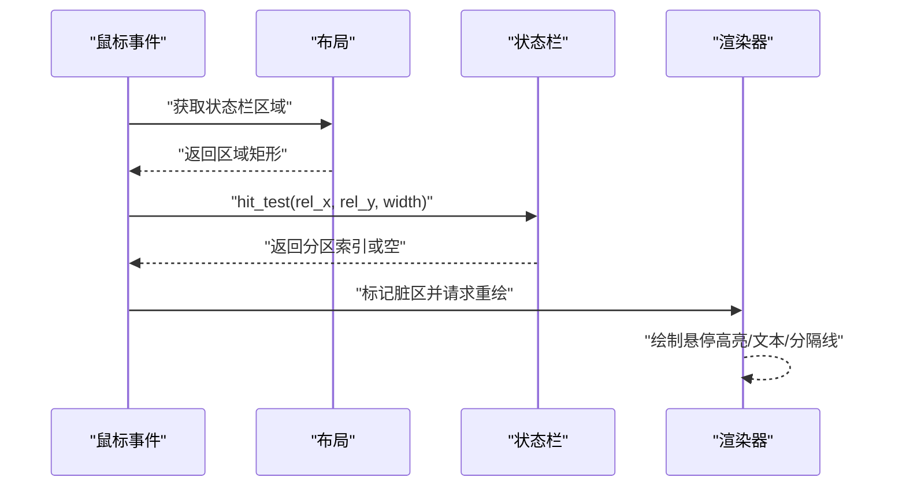
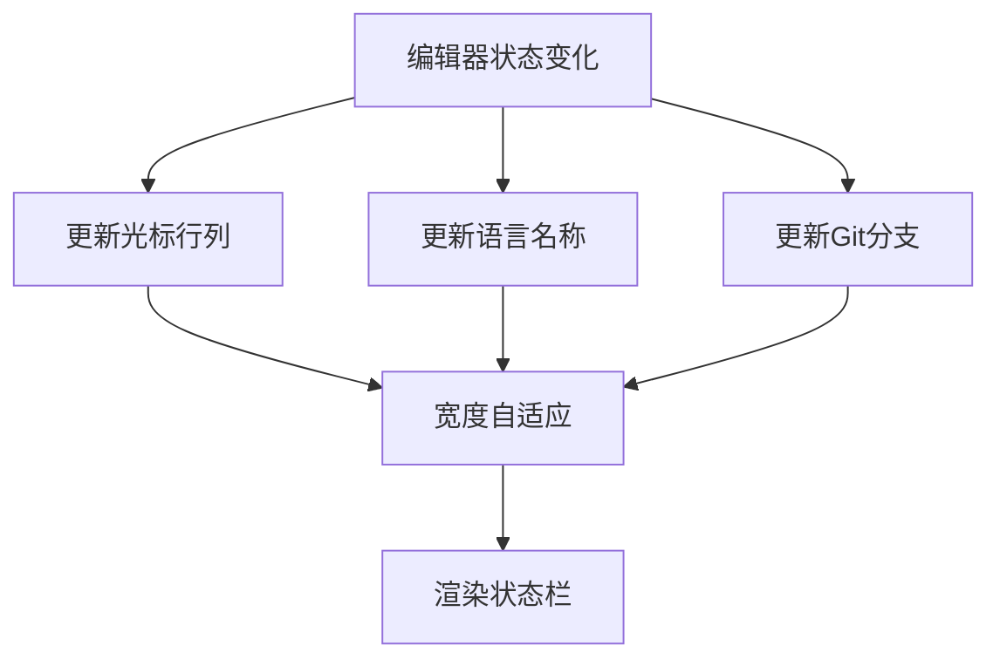

# 状态栏组件

<cite>
**本文引用的文件**
- [crates/aether-ui/src/status_bar.rs](file://crates/aether-ui/src/status_bar.rs)
- [crates/aether-win32/src/status_bar.rs](file://crates/aether-win32/src/status_bar.rs)
- [crates/aether-win32/src/render/chrome.rs](file://crates/aether-win32/src/render/chrome.rs)
- [crates/aether-render/src/theme.rs](file://crates/aether-render/src/theme.rs)
- [crates/aether-render/src/vscode_theme.rs](file://crates/aether-render/src/vscode_theme.rs)
- [crates/aether-win32/src/window/mouse_handler.rs](file://crates/aether-win32/src/window/mouse_handler.rs)
- [crates/aether-win32/src/window/mouse_handler/mouse_move.rs](file://crates/aether-win32/src/window/mouse_handler/mouse_move.rs)
- [crates/aether-win32/src/window/mouse_handler/l_button_down/content_area.rs](file://crates/aether-win32/src/window/mouse_handler/l_button_down/content_area.rs)
</cite>

## 目录
1. [简介](#简介)
2. [项目结构](#项目结构)
3. [核心组件](#核心组件)
4. [架构总览](#架构总览)
5. [详细组件分析](#详细组件分析)
6. [依赖关系分析](#依赖关系分析)
7. [性能考虑](#性能考虑)
8. [故障排查指南](#故障排查指南)
9. [结论](#结论)
10. [附录：扩展与定制示例](#附录：扩展与定制示例)

## 简介
本文件为“状态栏组件”的完整技术文档，覆盖以下主题：
- 实现原理：多区域布局、自适应宽度、点击命中检测、悬停反馈
- 生命周期管理：初始化、更新、渲染、销毁（由宿主窗口/渲染管线驱动）
- 事件处理与用户交互：鼠标移动悬停、点击判定、脏区重绘
- 与编辑器状态同步：光标位置、语言模式、Git 分支、编码等
- 扩展接口：新增状态项、注册自定义显示格式
- 主题适配：背景色、分隔线、玻璃态主题
- 性能优化：文本测量缓存、最小化重绘、宽度裁剪隐藏
- 代码级示例路径：如何添加新状态信息、如何实现复杂显示逻辑

## 项目结构
状态栏涉及 UI 层数据模型与 Windows 平台渲染层的协作：
- UI 层定义状态栏数据结构、分区枚举、布局计算、宽度自适应与命中测试
- 渲染层负责绘制背景、文字、图标、分隔线与悬停高亮
- 主题系统提供状态栏背景色与玻璃态边框颜色
- 鼠标事件处理器将鼠标坐标映射到状态栏分区并触发重绘

图表来源
- [crates/aether-ui/src/status_bar.rs:1-192](file://crates/aether-ui/src/status_bar.rs#L1-L192)
- [crates/aether-win32/src/render/chrome.rs:1-241](file://crates/aether-win32/src/render/chrome.rs#L1-L241)
- [crates/aether-render/src/theme.rs:1-200](file://crates/aether-render/src/theme.rs#L1-L200)
- [crates/aether-render/src/vscode_theme.rs:144-170](file://crates/aether-render/src/vscode_theme.rs#L144-L170)

章节来源
- [crates/aether-ui/src/status_bar.rs:1-192](file://crates/aether-ui/src/status_bar.rs#L1-L192)
- [crates/aether-win32/src/render/chrome.rs:1-241](file://crates/aether-win32/src/render/chrome.rs#L1-L241)
- [crates/aether-render/src/theme.rs:1-200](file://crates/aether-render/src/theme.rs#L1-L200)
- [crates/aether-render/src/vscode_theme.rs:144-170](file://crates/aether-render/src/vscode_theme.rs#L144-L170)

## 核心组件
- 状态栏分区索引枚举：用于稳定标识各分区（状态消息、错误计数、光标位置、编码、语言、Git 分支）
- 分区数据结构：包含标签文本、宽度、是否可点击、可选前置矢量图标
- 状态栏对象：维护分区列表与当前悬停分区索引
- 关键方法：
  - 更新 Git 分支显示
  - 更新光标行列号
  - 更新语言模式
  - 更新状态消息
  - 计算各区域坐标（支持左侧从左向右、右侧从右向左布局）
  - 点击命中测试（返回原始分区索引）
  - 根据文本测量自适应宽度（含图标与内边距，限制范围）

章节来源
- [crates/aether-ui/src/status_bar.rs:1-192](file://crates/aether-ui/src/status_bar.rs#L1-L192)
- [crates/aether-win32/src/status_bar.rs:1-192](file://crates/aether-win32/src/status_bar.rs#L1-L192)

## 架构总览
状态栏在渲染循环中完成“数据更新 → 布局计算 → 绘制”的流程；事件系统通过命中测试定位分区并触发交互。

图表来源
- [crates/aether-win32/src/window/mouse_handler/mouse_move.rs:1740-1757](file://crates/aether-win32/src/window/mouse_handler/mouse_move.rs#L1740-L1757)
- [crates/aether-win32/src/render/chrome.rs:1-241](file://crates/aether-win32/src/render/chrome.rs#L1-L241)
- [crates/aether-render/src/theme.rs:148-200](file://crates/aether-render/src/theme.rs#L148-L200)

## 详细组件分析

### 状态栏数据模型与布局
- 分区索引枚举确保 hit_test 返回值与 sections 一致，避免魔法数字
- 分区宽度自适应：使用 DirectWrite 文本测量，叠加图标占用与内边距，结果钳制到固定范围
- 布局策略：前三个分区位于左侧，后续分区位于右侧并从右向左排列；width<=0 的分区被跳过，不生成 region，从而自动隐藏

图表来源
- [crates/aether-ui/src/status_bar.rs:161-192](file://crates/aether-ui/src/status_bar.rs#L161-L192)
- [crates/aether-win32/src/status_bar.rs:161-192](file://crates/aether-win32/src/status_bar.rs#L161-L192)

章节来源
- [crates/aether-ui/src/status_bar.rs:1-192](file://crates/aether-ui/src/status_bar.rs#L1-L192)
- [crates/aether-win32/src/status_bar.rs:1-192](file://crates/aether-win32/src/status_bar.rs#L1-L192)

### 渲染流程与主题适配
- 渲染器获取状态栏背景色与文本颜色，并根据玻璃态主题选择分隔线颜色
- 绘制顺序：背景 → 悬停高亮（仅对 clickable 且命中分区）→ 图标 → 文本 → 分隔线
- 文本垂直居中：使用段落对齐设置，保证上下间距一致
- 主题来源：默认主题与 VS Code 主题映射（statusBar.background）

图表来源
- [crates/aether-win32/src/render/chrome.rs:1-241](file://crates/aether-win32/src/render/chrome.rs#L1-L241)
- [crates/aether-render/src/theme.rs:148-200](file://crates/aether-render/src/theme.rs#L148-L200)
- [crates/aether-render/src/vscode_theme.rs:144-170](file://crates/aether-render/src/vscode_theme.rs#L144-L170)

章节来源
- [crates/aether-win32/src/render/chrome.rs:1-241](file://crates/aether-win32/src/render/chrome.rs#L1-L241)
- [crates/aether-render/src/theme.rs:148-200](file://crates/aether-render/src/theme.rs#L148-L200)
- [crates/aether-render/src/vscode_theme.rs:144-170](file://crates/aether-render/src/vscode_theme.rs#L144-L170)

### 事件处理与用户交互
- 鼠标移动：计算光标类型，若命中状态栏且分区可点击则切换为手型指针
- 左键按下：点击编辑区时标记状态栏脏区以刷新行列信息
- 命中测试：基于分区矩形列表判断点击目标，返回原始分区索引

图表来源
- [crates/aether-win32/src/window/mouse_handler/mouse_move.rs:1740-1757](file://crates/aether-win32/src/window/mouse_handler/mouse_move.rs#L1740-L1757)
- [crates/aether-win32/src/window/mouse_handler/l_button_down/content_area.rs:1812-1829](file://crates/aether-win32/src/window/mouse_handler/l_button_down/content_area.rs#L1812-L1829)
- [crates/aether-ui/src/status_bar.rs:119-159](file://crates/aether-ui/src/status_bar.rs#L119-L159)

章节来源
- [crates/aether-win32/src/window/mouse_handler.rs:1-200](file://crates/aether-win32/src/window/mouse_handler.rs#L1-L200)
- [crates/aether-win32/src/window/mouse_handler/mouse_move.rs:1740-1757](file://crates/aether-win32/src/window/mouse_handler/mouse_move.rs#L1740-L1757)
- [crates/aether-win32/src/window/mouse_handler/l_button_down/content_area.rs:1812-1829](file://crates/aether-win32/src/window/mouse_handler/l_button_down/content_area.rs#L1812-L1829)
- [crates/aether-ui/src/status_bar.rs:119-159](file://crates/aether-ui/src/status_bar.rs#L119-L159)

### 与编辑器状态的同步机制
- 光标位置：根据当前行与可视列计算并更新状态栏
- 语言模式：根据编辑器当前语言映射为显示名称
- Git 分支：若处于仓库则显示当前分支名，否则隐藏该分区
- 状态消息：仅在分区可见时更新（width>0）

图表来源
- [crates/aether-win32/src/render/chrome.rs:73-133](file://crates/aether-win32/src/render/chrome.rs#L73-L133)
- [crates/aether-ui/src/status_bar.rs:76-117](file://crates/aether-ui/src/status_bar.rs#L76-L117)

章节来源
- [crates/aether-win32/src/render/chrome.rs:73-133](file://crates/aether-win32/src/render/chrome.rs#L73-L133)
- [crates/aether-ui/src/status_bar.rs:76-117](file://crates/aether-ui/src/status_bar.rs#L76-L117)

## 依赖关系分析
- UI 层依赖渲染层的文本测量缓存以计算分区宽度
- 渲染层依赖主题系统获取背景与分隔线颜色
- 事件系统依赖布局模块确定状态栏区域，并通过命中测试与状态栏交互

图表来源
- [crates/aether-ui/src/status_bar.rs:161-192](file://crates/aether-ui/src/status_bar.rs#L161-L192)
- [crates/aether-win32/src/render/chrome.rs:1-241](file://crates/aether-win32/src/render/chrome.rs#L1-L241)
- [crates/aether-render/src/theme.rs:148-200](file://crates/aether-render/src/theme.rs#L148-L200)

章节来源
- [crates/aether-ui/src/status_bar.rs:161-192](file://crates/aether-ui/src/status_bar.rs#L161-L192)
- [crates/aether-win32/src/render/chrome.rs:1-241](file://crates/aether-win32/src/render/chrome.rs#L1-L241)
- [crates/aether-render/src/theme.rs:148-200](file://crates/aether-render/src/theme.rs#L148-L200)

## 性能考虑
- 文本测量缓存：使用 DirectWrite 文本格式缓存减少重复测量开销
- 宽度自适应范围限制：将分区宽度钳制到合理区间，避免极端值导致布局抖动
- 隐藏分区优化：width<=0 的分区不参与布局与命中测试，减少绘制与计算
- 脏区重绘：仅在必要时标记状态栏脏区，避免全窗口重绘

章节来源
- [crates/aether-ui/src/status_bar.rs:161-192](file://crates/aether-ui/src/status_bar.rs#L161-L192)
- [crates/aether-win32/src/window/mouse_handler/l_button_down/content_area.rs:1812-1829](file://crates/aether-win32/src/window/mouse_handler/l_button_down/content_area.rs#L1812-L1829)

## 故障排查指南
- 分区未显示：检查对应分区的 width 是否为 0；确认 label 与 icon 是否为空
- 点击无响应：确认分区 clickable 标志与命中测试结果；检查鼠标坐标转换与区域计算
- 主题颜色异常：核对主题配置与 VS Code 主题键映射；确认玻璃态开关影响分隔线颜色
- 性能问题：评估文本测量频率；确认是否频繁触发全量重绘而非脏区重绘

章节来源
- [crates/aether-ui/src/status_bar.rs:119-192](file://crates/aether-ui/src/status_bar.rs#L119-L192)
- [crates/aether-win32/src/render/chrome.rs:1-241](file://crates/aether-win32/src/render/chrome.rs#L1-L241)
- [crates/aether-render/src/vscode_theme.rs:144-170](file://crates/aether-render/src/vscode_theme.rs#L144-L170)

## 结论
状态栏组件通过清晰的数据模型与布局算法实现了多区域自适应显示，结合事件系统与主题系统提供了良好的用户体验与可扩展性。其设计注重性能与可维护性，适合进一步扩展新的状态项与交互行为。

## 附录：扩展与定制示例
以下为具体操作路径，展示如何添加新状态信息与定制显示格式：
- 新增状态项
  - 在状态栏分区列表中增加新分区，设置 label、width、clickable、icon
  - 参考路径：[crates/aether-ui/src/status_bar.rs:31-74](file://crates/aether-ui/src/status_bar.rs#L31-L74)
- 更新状态信息
  - 调用相应更新方法（如更新光标位置、语言、Git 分支、状态消息）
  - 参考路径：[crates/aether-ui/src/status_bar.rs:76-117](file://crates/aether-ui/src/status_bar.rs#L76-L117)
- 自适应宽度与布局
  - 调用宽度自适应方法，确保文本与图标正确测量与显示
  - 参考路径：[crates/aether-ui/src/status_bar.rs:161-192](file://crates/aether-ui/src/status_bar.rs#L161-L192)
- 主题定制
  - 修改主题中的状态栏背景色与分隔线颜色
  - 参考路径：[crates/aether-render/src/theme.rs:148-200](file://crates/aether-render/src/theme.rs#L148-L200)
  - 通过 VS Code 主题键映射覆盖状态栏背景
  - 参考路径：[crates/aether-render/src/vscode_theme.rs:144-170](file://crates/aether-render/src/vscode_theme.rs#L144-L170)
- 复杂显示逻辑
  - 在渲染器中组合多个状态源（如语言+预览模式），动态生成显示文本
  - 参考路径：[crates/aether-win32/src/render/chrome.rs:104-133](file://crates/aether-win32/src/render/chrome.rs#L104-L133)

章节来源
- [crates/aether-ui/src/status_bar.rs:31-192](file://crates/aether-ui/src/status_bar.rs#L31-L192)
- [crates/aether-win32/src/render/chrome.rs:104-133](file://crates/aether-win32/src/render/chrome.rs#L104-L133)
- [crates/aether-render/src/theme.rs:148-200](file://crates/aether-render/src/theme.rs#L148-L200)
- [crates/aether-render/src/vscode_theme.rs:144-170](file://crates/aether-render/src/vscode_theme.rs#L144-L170)