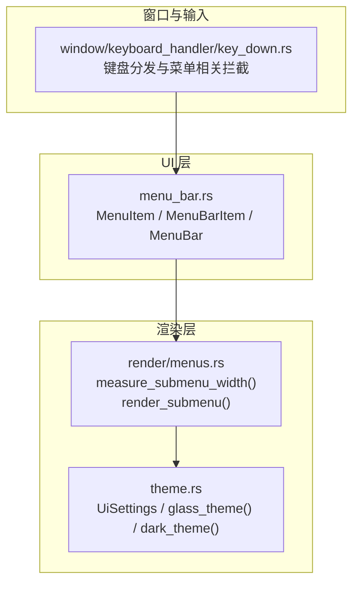
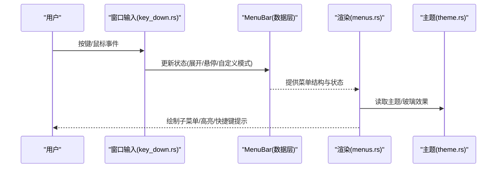
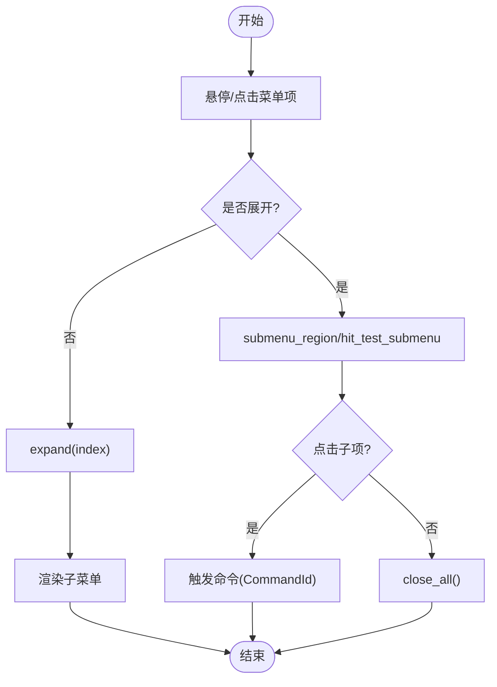
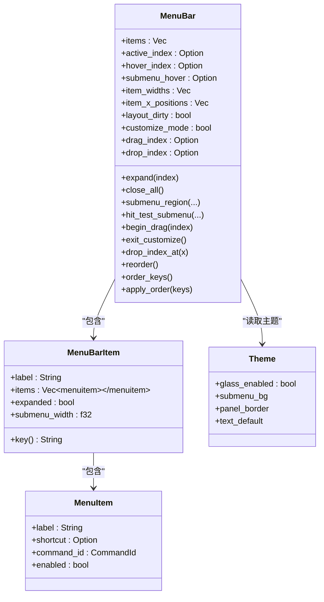
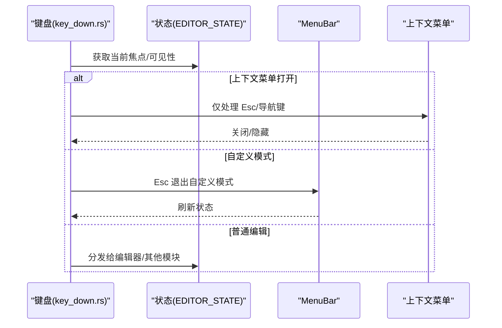
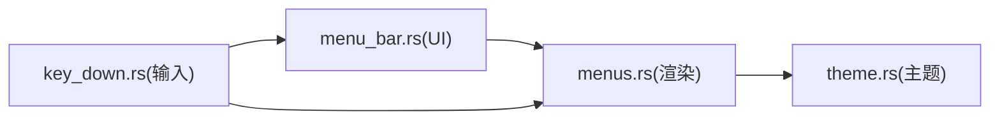

# 菜单栏组件

<cite>
**本文引用的文件**
- [crates/aether-ui/src/menu_bar.rs](file://crates/aether-ui/src/menu_bar.rs)
- [crates/aether-win32/src/menu_bar.rs](file://crates/aether-win32/src/menu_bar.rs)
- [crates/aether-win32/src/render/menus.rs](file://crates/aether-win32/src/render/menus.rs)
- [crates/aether-win32/src/theme.rs](file://crates/aether-win32/src/theme.rs)
- [crates/aether-win32/src/window/keyboard_handler/key_down.rs](file://crates/aether-win32/src/window/keyboard_handler/key_down.rs)
</cite>

## 目录
1. [简介](#简介)
2. [项目结构](#项目结构)
3. [核心组件](#核心组件)
4. [架构总览](#架构总览)
5. [详细组件分析](#详细组件分析)
6. [依赖关系分析](#依赖关系分析)
7. [性能与内存优化](#性能与内存优化)
8. [故障排查指南](#故障排查指南)
9. [结论](#结论)
10. [附录：扩展与定制](#附录：扩展与定制)

## 简介
本文件面向“菜单栏组件”的实现与使用，覆盖菜单项层次结构、动态生成、事件处理、渲染引擎、快捷键绑定、状态管理、平台集成与差异、扩展机制、主题定制、样式覆盖、复杂菜单示例、性能优化与内存管理等。该实现采用跨平台 UI 数据模型（aether-ui）与 Windows 平台渲染（aether-win32）分离的架构，确保逻辑与绘制解耦，便于在不同平台上复用同一套菜单数据结构。

## 项目结构
菜单栏由两部分组成：
- 跨平台 UI 层：定义菜单项、命令 ID、菜单分组及交互状态（展开、悬停、自定义排序等）。
- Windows 渲染层：负责子菜单测量、绘制、阴影、圆角、主题色、快捷键提示等视觉表现，并参与命中测试区域计算。

图表来源
- [crates/aether-ui/src/menu_bar.rs:1-176](file://crates/aether-ui/src/menu_bar.rs#L1-L176)
- [crates/aether-win32/src/render/menus.rs:834-1146](file://crates/aether-win32/src/render/menus.rs#L834-L1146)
- [crates/aether-win32/src/theme.rs:1-26](file://crates/aether-win32/src/theme.rs#L1-L26)
- [crates/aether-win32/src/window/keyboard_handler/key_down.rs:17-182](file://crates/aether-win32/src/window/keyboard_handler/key_down.rs#L17-L182)

章节来源
- [crates/aether-ui/src/menu_bar.rs:1-176](file://crates/aether-ui/src/menu_bar.rs#L1-L176)
- [crates/aether-win32/src/render/menus.rs:834-1146](file://crates/aether-win32/src/render/menus.rs#L834-L1146)
- [crates/aether-win32/src/theme.rs:1-26](file://crates/aether-win32/src/theme.rs#L1-L26)
- [crates/aether-win32/src/window/keyboard_handler/key_down.rs:17-182](file://crates/aether-win32/src/window/keyboard_handler/key_down.rs#L17-L182)

## 核心组件
- 菜单项 MenuItem：包含标签、可选快捷键、命令 ID、启用状态；支持分隔符构造。
- 命令 ID CommandId：集中定义所有菜单命令，并提供本地化标签映射。
- 菜单分组 MenuBarItem：包含分组标题、子项列表、展开状态、子菜单宽度缓存。
- 菜单栏 MenuBar：维护分组集合、当前激活/悬停索引、子菜单悬停项、布局尺寸、自定义模式与拖拽状态，提供展开/关闭、命中测试、重排、顺序持久化等方法。

章节来源
- [crates/aether-ui/src/menu_bar.rs:1-176](file://crates/aether-ui/src/menu_bar.rs#L1-L176)
- [crates/aether-win32/src/menu_bar.rs:1-176](file://crates/aether-win32/src/menu_bar.rs#L1-L176)

## 架构总览
菜单栏遵循“数据模型 + 渲染”的分离设计：
- UI 层负责菜单数据结构与交互状态（展开、悬停、自定义排序、拖拽），以及基础命中测试与布局信息。
- 渲染层负责精确文本测量、子菜单尺寸计算、绘制背景/边框/阴影/高亮、快捷键提示、主题适配。
- 窗口与输入层负责键盘消息分发，拦截特定场景（如自定义模式 Esc 退出、上下文菜单打开时仅响应 Esc）。

图表来源
- [crates/aether-win32/src/window/keyboard_handler/key_down.rs:17-182](file://crates/aether-win32/src/window/keyboard_handler/key_down.rs#L17-L182)
- [crates/aether-ui/src/menu_bar.rs:157-464](file://crates/aether-ui/src/menu_bar.rs#L157-L464)
- [crates/aether-win32/src/render/menus.rs:834-1146](file://crates/aether-win32/src/render/menus.rs#L834-L1146)
- [crates/aether-win32/src/theme.rs:1-26](file://crates/aether-win32/src/theme.rs#L1-L26)

## 详细组件分析

### 菜单项与命令体系
- MenuItem：支持通过构建器设置快捷键，separator() 用于插入分隔线。
- CommandId：集中枚举所有命令，label() 返回中文标签，便于统一国际化与显示。
- MenuBarItem：key() 方法去除助记符后缀，用于配置持久化的稳定键。

章节来源
- [crates/aether-ui/src/menu_bar.rs:1-123](file://crates/aether-ui/src/menu_bar.rs#L1-L123)
- [crates/aether-win32/src/menu_bar.rs:1-123](file://crates/aether-win32/src/menu_bar.rs#L1-L123)

### 菜单栏状态与交互
- 展开/关闭：expand/close_all 控制分组展开与全局关闭。
- 命中测试：hit_test 支持主菜单项命中；submenu_region/hit_test_submenu 支持子菜单项命中。
- 自定义模式：begin_drag/exit_customize/drop_index_at/reorder/order_keys/apply_order 支持长按进入自定义排序、拖拽放置、顺序持久化与恢复。

图表来源
- [crates/aether-ui/src/menu_bar.rs:277-464](file://crates/aether-ui/src/menu_bar.rs#L277-L464)
- [crates/aether-win32/src/render/menus.rs:834-1146](file://crates/aether-win32/src/render/menus.rs#L834-L1146)

章节来源
- [crates/aether-ui/src/menu_bar.rs:157-464](file://crates/aether-ui/src/menu_bar.rs#L157-L464)
- [crates/aether-win32/src/render/menus.rs:834-1146](file://crates/aether-win32/src/render/menus.rs#L834-L1146)

### 渲染引擎与主题
- 子菜单测量：measure_submenu_width 遍历子项，精确测量标签与快捷键宽度，考虑内边距与最小宽度，结果写入 MenuBarItem.submenu_width。
- 子菜单绘制：render_submenu 绘制背景、圆角、边框、阴影、悬停高亮、禁用态、快捷键提示；根据主题玻璃效果调整不透明度与边框颜色。
- 主题：UiSettings.glass_enabled 控制玻璃效果；glass_theme()/dark_theme() 提供主题实例。

图表来源
- [crates/aether-ui/src/menu_bar.rs:125-176](file://crates/aether-ui/src/menu_bar.rs#L125-L176)
- [crates/aether-win32/src/render/menus.rs:834-1146](file://crates/aether-win32/src/render/menus.rs#L834-L1146)
- [crates/aether-win32/src/theme.rs:1-26](file://crates/aether-win32/src/theme.rs#L1-L26)

章节来源
- [crates/aether-win32/src/render/menus.rs:834-1146](file://crates/aether-win32/src/render/menus.rs#L834-L1146)
- [crates/aether-win32/src/theme.rs:1-26](file://crates/aether-win32/src/theme.rs#L1-L26)

### 快捷键绑定与事件处理
- 快捷键展示：MenuItem.shortcut 在子菜单中右对齐显示，字体较小且弱化，提升层级感。
- 键盘分发：WM_KEYDOWN 入口先同步线程局部状态，再按优先级分发到各模块；当上下文菜单或搜索面板等处于活动状态时，优先拦截 Esc/方向键等，避免误触编辑器。
- 自定义模式：Esc 可退出 Activity Bar 与 Menu Bar 的自定义排序模式，并刷新状态。

图表来源
- [crates/aether-win32/src/window/keyboard_handler/key_down.rs:17-182](file://crates/aether-win32/src/window/keyboard_handler/key_down.rs#L17-L182)
- [crates/aether-win32/src/window/keyboard_handler/key_down.rs:372-400](file://crates/aether-win32/src/window/keyboard_handler/key_down.rs#L372-L400)

章节来源
- [crates/aether-win32/src/window/keyboard_handler/key_down.rs:17-182](file://crates/aether-win32/src/window/keyboard_handler/key_down.rs#L17-L182)
- [crates/aether-win32/src/window/keyboard_handler/key_down.rs:372-400](file://crates/aether-win32/src/window/keyboard_handler/key_down.rs#L372-L400)

### 平台集成与差异
- Windows 平台：使用 Direct2D/DirectWrite 进行高精度文本测量与绘制；子菜单强制不透明背景以保证可读性；阴影与圆角一致于应用内弹出菜单风格。
- 跨平台 UI：Menu 数据结构与交互逻辑独立于平台，可在其他平台复用。

章节来源
- [crates/aether-win32/src/render/menus.rs:834-1146](file://crates/aether-win32/src/render/menus.rs#L834-L1146)

### 扩展机制与菜单分组管理
- 扩展点：通过新增 CommandId 与 MenuItem 即可扩展功能；通过 MenuBarItem::new 添加新分组。
- 分组管理：支持自定义排序与持久化，apply_order 可合并默认项与用户配置，保留未覆盖项。

章节来源
- [crates/aether-ui/src/menu_bar.rs:178-275](file://crates/aether-ui/src/menu_bar.rs#L178-L275)
- [crates/aether-ui/src/menu_bar.rs:431-464](file://crates/aether-ui/src/menu_bar.rs#L431-L464)

### 主题定制与样式覆盖
- 主题开关：UiSettings.glass_enabled 控制玻璃效果；glass_theme()/dark_theme() 切换主题。
- 样式覆盖：子菜单背景、边框、阴影、悬停高亮、禁用态、快捷键提示颜色均从主题或固定配色派生，可通过主题对象调整。

章节来源
- [crates/aether-win32/src/theme.rs:1-26](file://crates/aether-win32/src/theme.rs#L1-L26)
- [crates/aether-win32/src/render/menus.rs:891-1043](file://crates/aether-win32/src/render/menus.rs#L891-L1043)

## 依赖关系分析
- UI 层依赖：无外部图形库，纯数据结构与状态机。
- 渲染层依赖：Direct2D/DirectWrite 用于绘制与文本测量；主题系统提供颜色与玻璃效果。
- 输入层依赖：Windows 消息循环与键盘钩子，按优先级分发到不同模块。

图表来源
- [crates/aether-ui/src/menu_bar.rs:157-464](file://crates/aether-ui/src/menu_bar.rs#L157-L464)
- [crates/aether-win32/src/render/menus.rs:834-1146](file://crates/aether-win32/src/render/menus.rs#L834-L1146)
- [crates/aether-win32/src/theme.rs:1-26](file://crates/aether-win32/src/theme.rs#L1-L26)
- [crates/aether-win32/src/window/keyboard_handler/key_down.rs:17-182](file://crates/aether-win32/src/window/keyboard_handler/key_down.rs#L17-L182)

章节来源
- [crates/aether-ui/src/menu_bar.rs:157-464](file://crates/aether-ui/src/menu_bar.rs#L157-L464)
- [crates/aether-win32/src/render/menus.rs:834-1146](file://crates/aether-win32/src/render/menus.rs#L834-L1146)
- [crates/aether-win32/src/theme.rs:1-26](file://crates/aether-win32/src/theme.rs#L1-L26)
- [crates/aether-win32/src/window/keyboard_handler/key_down.rs:17-182](file://crates/aether-win32/src/window/keyboard_handler/key_down.rs#L17-L182)

## 性能与内存优化
- 文本测量缓存：measure_submenu_width 使用 text_format_cache 测量宽度，避免重复创建格式对象；结果缓存至 submenu_width，减少重复计算。
- 绘制裁剪：使用 PushAxisAlignedClip 将悬停高亮限制在圆角背景内，避免溢出重绘。
- 主题画刷缓存：brush_cache 复用画刷对象，降低分配与销毁开销。
- 布局脏标记：layout_dirty 标志位仅在菜单项或 DPI 变化时置位，按需重建布局。
- 内存管理：菜单项与分组为值类型克隆传播，避免共享可变状态；自定义模式下的拖拽状态以 Option 表示，结束时清理。

章节来源
- [crates/aether-win32/src/render/menus.rs:834-1146](file://crates/aether-win32/src/render/menus.rs#L834-L1146)
- [crates/aether-ui/src/menu_bar.rs:157-176](file://crates/aether-ui/src/menu_bar.rs#L157-L176)

## 故障排查指南
- 子菜单宽度异常：检查 measure_submenu_width 是否被调用且成功测量；确认 MenuBarItem.submenu_width 已更新。
- 命中测试不准：确认 item_x_positions 与 item_widths 长度一致；必要时回退到累计宽度计算。
- 自定义模式无法退出：检查 key_down.rs 中 okd_escape_customize 是否生效；确保 exit_customize 被调用并刷新状态。
- 主题不一致：确认 UiSettings.glass_enabled 与主题选择；检查 render_submenu 中背景不透明处理是否符合预期。

章节来源
- [crates/aether-win32/src/render/menus.rs:834-1146](file://crates/aether-win32/src/render/menus.rs#L834-L1146)
- [crates/aether-ui/src/menu_bar.rs:277-314](file://crates/aether-ui/src/menu_bar.rs#L277-L314)
- [crates/aether-win32/src/window/keyboard_handler/key_down.rs:372-400](file://crates/aether-win32/src/window/keyboard_handler/key_down.rs#L372-L400)
- [crates/aether-win32/src/theme.rs:1-26](file://crates/aether-win32/src/theme.rs#L1-L26)

## 结论
菜单栏组件通过清晰的数据模型与渲染分离，实现了可扩展、可定制、高性能的菜单体验。其核心优势包括：
- 统一的命令体系与本地化标签。
- 精确的子菜单测量与一致的视觉风格。
- 完善的交互状态管理与自定义排序能力。
- 主题驱动的样式与玻璃效果。
- 健壮的键盘分发与上下文菜单拦截。

## 附录：扩展与定制

### 如何添加自定义菜单项
- 在 CommandId 中新增命令标识。
- 在对应 MenuBarItem 中添加 MenuItem，并设置 label、shortcut、command_id。
- 如需分组，新增 MenuBarItem::new 并加入 MenuBar.items。

章节来源
- [crates/aether-ui/src/menu_bar.rs:35-123](file://crates/aether-ui/src/menu_bar.rs#L35-L123)
- [crates/aether-ui/src/menu_bar.rs:178-275](file://crates/aether-ui/src/menu_bar.rs#L178-L275)

### 如何实现动态更新
- 运行时修改 MenuBar.items 或 MenuItem.enabled/shortcut。
- 设置 layout_dirty = true 以触发重新布局。
- 若涉及子菜单宽度变化，需重新调用 measure_submenu_width 并更新 submenu_width。

章节来源
- [crates/aether-ui/src/menu_bar.rs:157-176](file://crates/aether-ui/src/menu_bar.rs#L157-L176)
- [crates/aether-win32/src/render/menus.rs:834-884](file://crates/aether-win32/src/render/menus.rs#L834-L884)

### 复杂菜单结构示例
- 多层分组：文件、编辑、查看、运行、终端、帮助等分组，每个分组包含若干子项与分隔线。
- 快捷键提示：为常用操作绑定快捷键并在子菜单右侧显示。
- 自定义排序：支持长按进入自定义模式，拖拽分组调整顺序，并通过 apply_order 持久化。

章节来源
- [crates/aether-ui/src/menu_bar.rs:178-275](file://crates/aether-ui/src/menu_bar.rs#L178-L275)
- [crates/aether-ui/src/menu_bar.rs:379-464](file://crates/aether-ui/src/menu_bar.rs#L379-L464)

### 主题定制与样式覆盖
- 切换主题：使用 glass_theme() 或 dark_theme() 获取主题实例。
- 玻璃效果：UiSettings.glass_enabled 控制是否启用玻璃背景与边框。
- 子菜单样式：背景、边框、阴影、悬停高亮、禁用态、快捷键提示颜色均可通过主题或固定配色调整。

章节来源
- [crates/aether-win32/src/theme.rs:1-26](file://crates/aether-win32/src/theme.rs#L1-L26)
- [crates/aether-win32/src/render/menus.rs:891-1043](file://crates/aether-win32/src/render/menus.rs#L891-L1043)