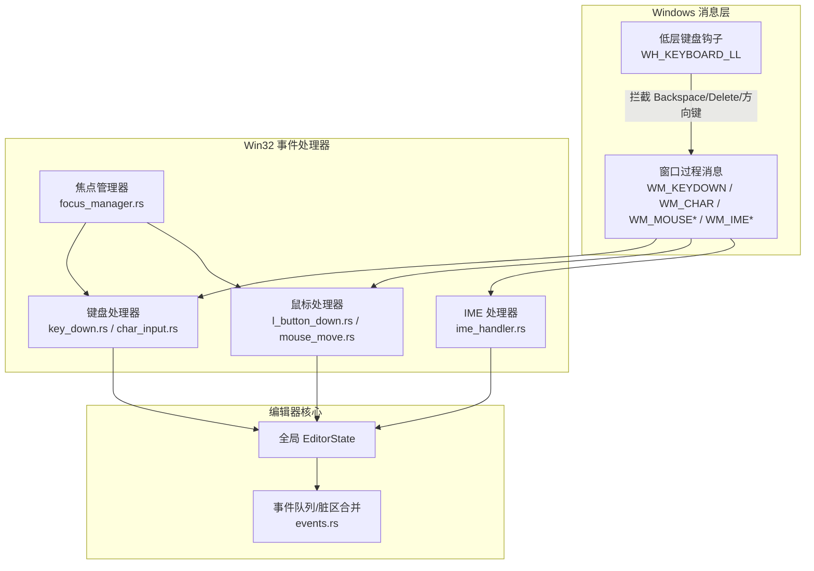
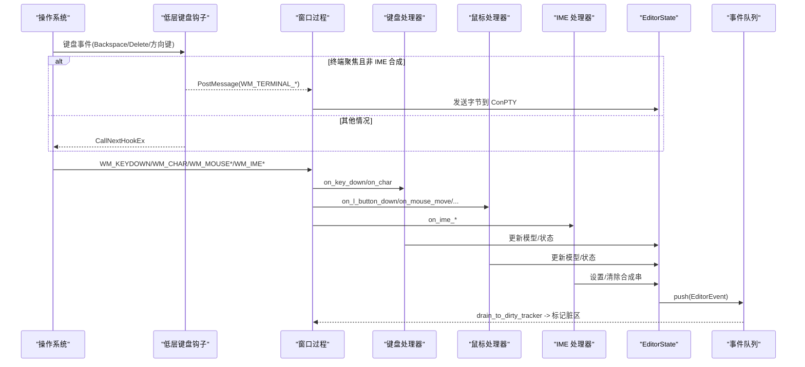
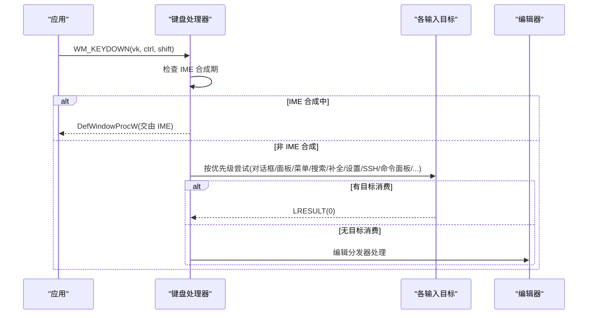
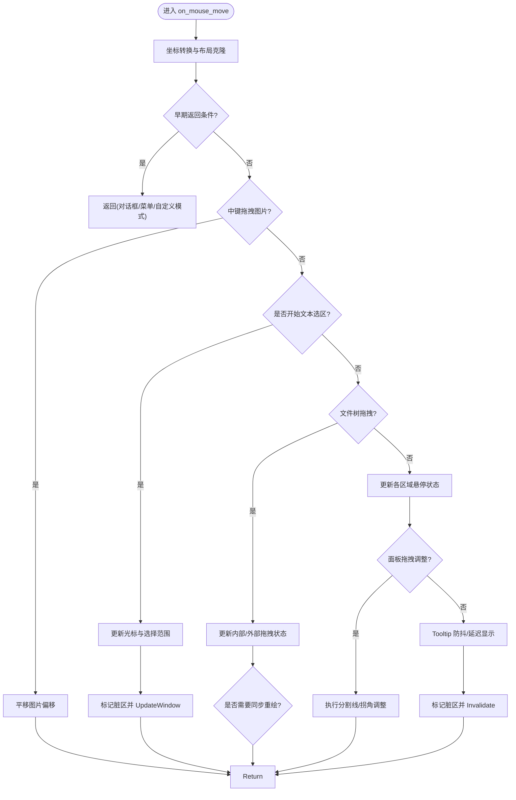
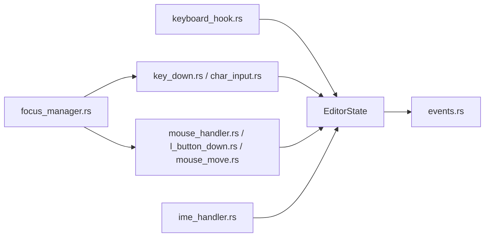

# 事件处理

<cite>
**本文引用的文件**
- [keyboard_handler.rs](file://crates/aether-win32/src/window/keyboard_handler.rs)
- [key_down.rs](file://crates/aether-win32/src/window/keyboard_handler/key_down.rs)
- [char_input.rs](file://crates/aether-win32/src/window/keyboard_handler/char_input.rs)
- [mouse_handler.rs](file://crates/aether-win32/src/window/mouse_handler.rs)
- [l_button_down.rs](file://crates/aether-win32/src/window/mouse_handler/l_button_down.rs)
- [mouse_move.rs](file://crates/aether-win32/src/window/mouse_handler/mouse_move.rs)
- [ime_handler.rs](file://crates/aether-win32/src/window/ime_handler.rs)
- [focus_manager.rs](file://crates/aether-win32/src/focus_manager.rs)
- [events.rs](file://crates/aether-editor/src/events.rs)
- [keyboard_hook.rs](file://crates/aether-win32/src/keyboard_hook.rs)
</cite>

## 目录
1. [简介](#简介)
2. [项目结构](#项目结构)
3. [核心组件](#核心组件)
4. [架构总览](#架构总览)
5. [详细组件分析](#详细组件分析)
6. [依赖关系分析](#依赖关系分析)
7. [性能考虑](#性能考虑)
8. [故障排查指南](#故障排查指南)
9. [结论](#结论)

## 简介
本文件为“事件处理系统”的权威文档，覆盖输入事件的捕获、转换与分发机制（键盘、鼠标、输入法），并深入说明事件路由算法（焦点管理、冒泡与捕获）、键盘处理（快捷键、组合键、IME）、鼠标处理（点击、拖拽、滚轮、悬停）以及 IME 集成（中文输入、候选词、合成窗口）。同时提供性能优化策略、调试方法与常见问题解决方案。

## 项目结构
事件处理在 Windows 平台由 aether-win32 负责消息捕获与分发，aether-editor 提供编辑器侧的事件总线与脏区合并，二者通过状态对象协作。

图表来源
- [keyboard_hook.rs:151-244](file://crates/aether-win32/src/keyboard_hook.rs#L151-L244)
- [key_down.rs:17-182](file://crates/aether-win32/src/window/keyboard_handler/key_down.rs#L17-L182)
- [char_input.rs:10-104](file://crates/aether-win32/src/window/keyboard_handler/char_input.rs#L10-L104)
- [mouse_handler.rs:17-15](file://crates/aether-win32/src/window/mouse_handler.rs#L17-L15)
- [ime_handler.rs:9-132](file://crates/aether-win32/src/window/ime_handler.rs#L9-L132)
- [focus_manager.rs:10-116](file://crates/aether-win32/src/focus_manager.rs#L10-L116)
- [events.rs:9-186](file://crates/aether-editor/src/events.rs#L9-L186)

章节来源
- [keyboard_handler.rs:1-13](file://crates/aether-win32/src/window/keyboard_handler.rs#L1-L13)
- [mouse_handler.rs:1-15](file://crates/aether-win32/src/window/mouse_handler.rs#L1-L15)
- [ime_handler.rs:1-8](file://crates/aether-win32/src/window/ime_handler.rs#L1-L8)
- [focus_manager.rs:1-8](file://crates/aether-win32/src/focus_manager.rs#L1-L8)
- [events.rs:1-7](file://crates/aether-editor/src/events.rs#L1-L7)

## 核心组件
- 低层键盘钩子：在系统级拦截特定按键（Backspace/Delete/方向键），绕过 IME 对终端输入的干扰，将动作以自定义消息回主线程投递到终端。
- 键盘处理器：WM_KEYDOWN 按优先级分发（对话框/面板/编辑器等），WM_CHAR 字符按优先级路由到各输入目标；支持 UTF-16 代理对与 IME 合成期避让。
- 鼠标处理器：左键按下/移动/双击/滚轮/水平滚轮/右键等，按区域优先级命中（对话框/菜单/活动栏/标签栏/侧边栏/AI 面板/设置页/欢迎页/编辑器），实现拖拽、选区、滚动、悬停反馈。
- IME 处理器：处理 WM_IME_STARTCOMPOSITION/COMPOSITION/ENDCOMPOSITION/CHAR，维护合成串显示与提交，避免重复插入。
- 焦点管理器：集中管理当前焦点目标（编辑器/终端/AI 面板/查找替换/命令面板/设置/对话框/无焦点），支持 push/pop 历史栈与窗口级焦点同步。
- 事件队列：收集一帧内事件，合并同类事件（如连续滚动/光标移动/选择变化），映射到脏区类型，驱动增量重绘。

章节来源
- [keyboard_hook.rs:1-55](file://crates/aether-win32/src/keyboard_hook.rs#L1-L55)
- [key_down.rs:17-182](file://crates/aether-win32/src/window/keyboard_handler/key_down.rs#L17-L182)
- [char_input.rs:10-104](file://crates/aether-win32/src/window/keyboard_handler/char_input.rs#L10-L104)
- [mouse_handler.rs:17-15](file://crates/aether-win32/src/window/mouse_handler.rs#L17-L15)
- [ime_handler.rs:9-132](file://crates/aether-win32/src/window/ime_handler.rs#L9-L132)
- [focus_manager.rs:10-116](file://crates/aether-win32/src/focus_manager.rs#L10-L116)
- [events.rs:9-186](file://crates/aether-editor/src/events.rs#L9-L186)

## 架构总览
下图展示从系统消息到 UI 更新的完整链路，包括焦点判定、事件路由、IME 合成与渲染脏区。

图表来源
- [keyboard_hook.rs:151-244](file://crates/aether-win32/src/keyboard_hook.rs#L151-L244)
- [key_down.rs:17-182](file://crates/aether-win32/src/window/keyboard_handler/key_down.rs#L17-L182)
- [char_input.rs:10-104](file://crates/aether-win32/src/window/keyboard_handler/char_input.rs#L10-L104)
- [mouse_handler.rs:17-15](file://crates/aether-win32/src/window/mouse_handler.rs#L17-L15)
- [ime_handler.rs:9-132](file://crates/aether-win32/src/window/ime_handler.rs#L9-L132)
- [events.rs:84-186](file://crates/aether-editor/src/events.rs#L84-L186)

## 详细组件分析

### 键盘事件处理
- WM_KEYDOWN 分发流程：
  - 进入时先同步线程局部状态到当前窗口，避免 Alt+Tab 后路由错误。
  - 若处于 IME 合成期，直接交给默认窗口过程，让 IMM32 处理退格/字母/方向键等。
  - 按优先级检查各类上下文（浏览器地址栏、搜索面板、文件树输入、上下文菜单、欢迎页、补全弹窗、设置字段、SSH/克隆对话框、命令面板等），首个匹配者消费消息。
  - Ctrl 组合键走专用调度器；Alt+方向键用于返回/前进导航占位。
  - 文件树输入激活时吞掉非 Ctrl 编辑器按键，防止误响应。
  - 最终调用编辑分发器处理编辑器相关按键。

- WM_CHAR 字符分发流程：
  - 处理 UTF-16 代理对，确保 BMP 外字符正确组合。
  - IME 合成期间跳过原始字符分发，避免重复插入。
  - 按优先级依次尝试各输入目标（浏览器地址栏、空标签搜索框、文件树输入、设置字段、沙盒评测字段、搜索面板、SSH/克隆对话框、新建项目、SSH 管理、命令面板、查找替换、终端、历史浮窗、AI 面板），最后广播到编辑器多光标。

- 快捷键与组合键：
  - Ctrl 组合键统一进入 key_down_ctrl 模块进行分发（具体绑定逻辑在该模块中实现）。
  - Alt+Left/Right 作为返回/前进导航的占位实现。
  - F2 触发文件树重命名；Delete 删除选中节点。

- IME 支持：
  - 在 WM_IME_COMPOSITION 中根据 GCS_RESULTSTR/GCS_COMPSTR 标志分别处理已提交文本与合成串。
  - 结果串提交后立即重置合成标志，使 Backspace 可立即作用于终端，避免“提交汉字后无法立即删除”。
  - 合成串为空或结束时清理本地合成状态，必要时关闭 IME（例如终端聚焦时）。

章节来源
- [key_down.rs:17-182](file://crates/aether-win32/src/window/keyboard_handler/key_down.rs#L17-L182)
- [char_input.rs:10-104](file://crates/aether-win32/src/window/keyboard_handler/char_input.rs#L10-L104)
- [ime_handler.rs:9-132](file://crates/aether-win32/src/window/ime_handler.rs#L9-L132)

#### 键盘事件分发序列图

图表来源
- [key_down.rs:17-182](file://crates/aether-win32/src/window/keyboard_handler/key_down.rs#L17-L182)

### 鼠标事件处理
- 左键按下（WM_LBUTTONDOWN）：
  - 坐标转换、布局克隆、退出自定义模式。
  - 按区域优先级命中：对话框/标题栏/用户菜单/资源管理器上下文菜单/文件节点上下文菜单/活动栏上下文菜单/标签上下文菜单/子菜单/历史对话浮动窗口/活动栏/面板调整/侧边栏/AI 面板/标签栏/查找面板/底部面板/设置页/沙盒页/欢迎页或编辑器。

- 鼠标移动（WM_MOUSEMOVE）：
  - 高回报率节流：面板拖拽同步重绘节流至约 120fps，避免消息洪流压垮管线。
  - 图片预览拖拽平移（中键拖拽）最高优先级。
  - 文本拖拽选区：检测阈值启动选区，更新光标位置与选择范围，仅当实际变化时标记脏区并强制 UpdateWindow 避免滞后。
  - 文件树拖拽：内部拖拽状态更新与外部 OLE 拖放切换。
  - 悬停状态更新：标题栏/活动栏/标签栏/文件树/设置/AI/欢迎页/状态栏，按需标记对应脏区。
  - Tooltip 防抖与延迟显示。

- 滚轮与水平滚轮：
  - Shift+滚轮横向滚动；Ctrl+滚轮在图片预览中缩放。
  - 标签栏区域滚轮平滑滚动标签。
  - 底部终端面板、右侧 AI 面板、设置页、沙盒页、侧边栏均支持各自滚动逻辑。
  - 水平滚轮仅在编辑器区域内响应。

- 双击与右键：
  - 双击选词（编辑器内容区）。
  - 右键打开上下文菜单并处理释放。

章节来源
- [l_button_down.rs:17-112](file://crates/aether-win32/src/window/mouse_handler/l_button_down.rs#L17-L112)
- [mouse_move.rs:39-323](file://crates/aether-win32/src/window/mouse_handler/mouse_move.rs#L39-L323)
- [mouse_handler.rs:44-188](file://crates/aether-win32/src/window/mouse_handler.rs#L44-L188)
- [mouse_handler.rs:190-406](file://crates/aether-win32/src/window/mouse_handler.rs#L190-L406)

#### 鼠标移动处理流程图

图表来源
- [mouse_move.rs:39-323](file://crates/aether-win32/src/window/mouse_handler/mouse_move.rs#L39-L323)

### 输入法（IME）集成
- 合成期管理：
  - WM_IME_STARTCOMPOSITION：初始化位置（由渲染阶段 set_candidate_window_position 同步）。
  - WM_IME_COMPOSITION：优先处理结果串（GCS_RESULTSTR）并提交；否则处理合成串（GCS_COMPSTR）更新显示；若无标志则取消合成。
  - WM_IME_ENDCOMPOSITION：清理合成串显示，必要时关闭 IME（终端聚焦时）。
  - WM_IME_CHAR：阻止 TranslateMessage 产生 WM_CHAR，避免中文输入字符重复插入。

- 与键盘钩子协同：
  - 键盘钩子在终端聚焦且非 IME 合成时拦截 Backspace/Delete/方向键，PostMessage 到主窗口，再发送到 ConPTY。
  - 键盘处理器在 IME 合成期将消息交给默认窗口过程，保证 IME 能正确处理退格/字母/方向键。

章节来源
- [ime_handler.rs:9-132](file://crates/aether-win32/src/window/ime_handler.rs#L9-L132)
- [keyboard_hook.rs:151-244](file://crates/aether-win32/src/keyboard_hook.rs#L151-L244)
- [key_down.rs:25-36](file://crates/aether-win32/src/window/keyboard_handler/key_down.rs#L25-L36)

### 焦点管理与事件路由
- 焦点目标：
  - 编辑器、终端、AI 面板、查找替换（含子焦点）、命令面板、设置、对话框、无焦点。
- 焦点栈：
  - push 保存当前焦点并切换；pop 恢复到上一个焦点，空栈回退到编辑器。
- 窗口级焦点：
  - WM_SETFOCUS/WM_KILLFOCUS 同步 window_focused 标志；current() 在失焦时返回 None。

- 路由策略：
  - 键盘/鼠标事件在进入处理器前会先同步线程局部状态到当前窗口，避免焦点错乱。
  - 键盘事件按优先级依次尝试各输入目标，首个匹配者消费；未消费则进入编辑器。
  - 鼠标事件按区域优先级命中，确保对话框/菜单/浮动窗口等顶层元素优先响应。

章节来源
- [focus_manager.rs:10-116](file://crates/aether-win32/src/focus_manager.rs#L10-L116)
- [char_input.rs:10-104](file://crates/aether-win32/src/window/keyboard_handler/char_input.rs#L10-L104)
- [l_button_down.rs:17-112](file://crates/aether-win32/src/window/mouse_handler/l_button_down.rs#L17-L112)

## 依赖关系分析
- 低层键盘钩子依赖全局句柄与主窗口 HWND，通过原子变量共享终端聚焦与 IME 合成状态。
- 键盘/鼠标/IME 处理器依赖全局 EditorState 进行状态读写与脏区标记。
- 事件队列依赖脏区追踪器，将事件映射为区域类型，驱动增量重绘。
- 焦点管理器独立于具体处理器，但被键盘/鼠标处理器用于判断当前焦点目标。

图表来源
- [keyboard_hook.rs:1-55](file://crates/aether-win32/src/keyboard_hook.rs#L1-L55)
- [key_down.rs:17-182](file://crates/aether-win32/src/window/keyboard_handler/key_down.rs#L17-L182)
- [char_input.rs:10-104](file://crates/aether-win32/src/window/keyboard_handler/char_input.rs#L10-L104)
- [mouse_handler.rs:17-15](file://crates/aether-win32/src/window/mouse_handler.rs#L17-L15)
- [ime_handler.rs:9-132](file://crates/aether-win32/src/window/ime_handler.rs#L9-L132)
- [events.rs:84-186](file://crates/aether-editor/src/events.rs#L84-L186)
- [focus_manager.rs:10-116](file://crates/aether-win32/src/focus_manager.rs#L10-L116)

## 性能考虑
- 高回报率鼠标节流：面板拖拽同步重绘节流至约 120fps，避免每条 WM_MOUSEMOVE 都触发重绘导致卡顿。
- 增量重绘：通过 DirtyRectTracker 标记具体区域（编辑器内容、标签栏、侧边栏、AI 面板、底部面板、状态栏、标题栏、对话框等），减少全窗口重绘。
- 强制即时重绘：在关键路径使用 UpdateWindow 绕过消息队列优先级，避免 WM_PAINT 被饿死导致的视觉滞后。
- 事件合并：事件队列合并连续滚动、光标移动、选择变化等，降低渲染压力。
- 脏区最小化：仅在状态变化时标记脏区，并在拖拽/选区更新时精确计算受影响区域。

[本节为通用性能指导，不直接分析具体文件]

## 故障排查指南
- 终端无法删除汉字：
  - 确认低层键盘钩子已安装并拦截 Backspace/Delete/方向键；检查终端聚焦标志与 IME 合成标志。
  - 验证 WM_TERMINAL_* 消息是否成功投递到主窗口并发送到 ConPTY。
  - 参考：[keyboard_hook.rs:151-244](file://crates/aether-win32/src/keyboard_hook.rs#L151-L244)

- IME 合成串未清除或重复插入：
  - 检查 WM_IME_COMPOSITION 是否正确处理 GCS_RESULTSTR/GCS_COMPSTR；确认 WM_IME_CHAR 被阻止以避免重复。
  - 参考：[ime_handler.rs:9-132](file://crates/aether-win32/src/window/ime_handler.rs#L9-L132)

- 鼠标拖拽卡顿或选区滞后：
  - 检查是否启用 UpdateWindow 强制即时重绘；确认脏区标记准确；验证节流逻辑是否合理。
  - 参考：[mouse_move.rs:39-323](file://crates/aether-win32/src/window/mouse_handler/mouse_move.rs#L39-L323)

- 键盘事件路由到错误窗口：
  - 确认进入处理器前先同步线程局部状态到当前窗口；检查焦点管理器状态。
  - 参考：[char_input.rs:10-104](file://crates/aether-win32/src/window/keyboard_handler/char_input.rs#L10-L104)

- 事件队列未生效或重绘过多：
  - 检查事件合并逻辑；确认 drain_to_dirty_tracker 正确映射区域类型。
  - 参考：[events.rs:84-186](file://crates/aether-editor/src/events.rs#L84-L186)

章节来源
- [keyboard_hook.rs:151-244](file://crates/aether-win32/src/keyboard_hook.rs#L151-L244)
- [ime_handler.rs:9-132](file://crates/aether-win32/src/window/ime_handler.rs#L9-L132)
- [mouse_move.rs:39-323](file://crates/aether-win32/src/window/mouse_handler/mouse_move.rs#L39-L323)
- [char_input.rs:10-104](file://crates/aether-win32/src/window/keyboard_handler/char_input.rs#L10-L104)
- [events.rs:84-186](file://crates/aether-editor/src/events.rs#L84-L186)

## 结论
本事件处理系统通过低层键盘钩子、分层消息处理器、焦点管理器与事件队列，实现了高效、可靠且可扩展的输入事件捕获、转换与分发。键盘、鼠标与 IME 的处理逻辑清晰分离，结合增量重绘与事件合并，显著提升了交互流畅度与渲染性能。针对常见输入问题提供了明确的排查路径与优化建议，便于后续维护与扩展。