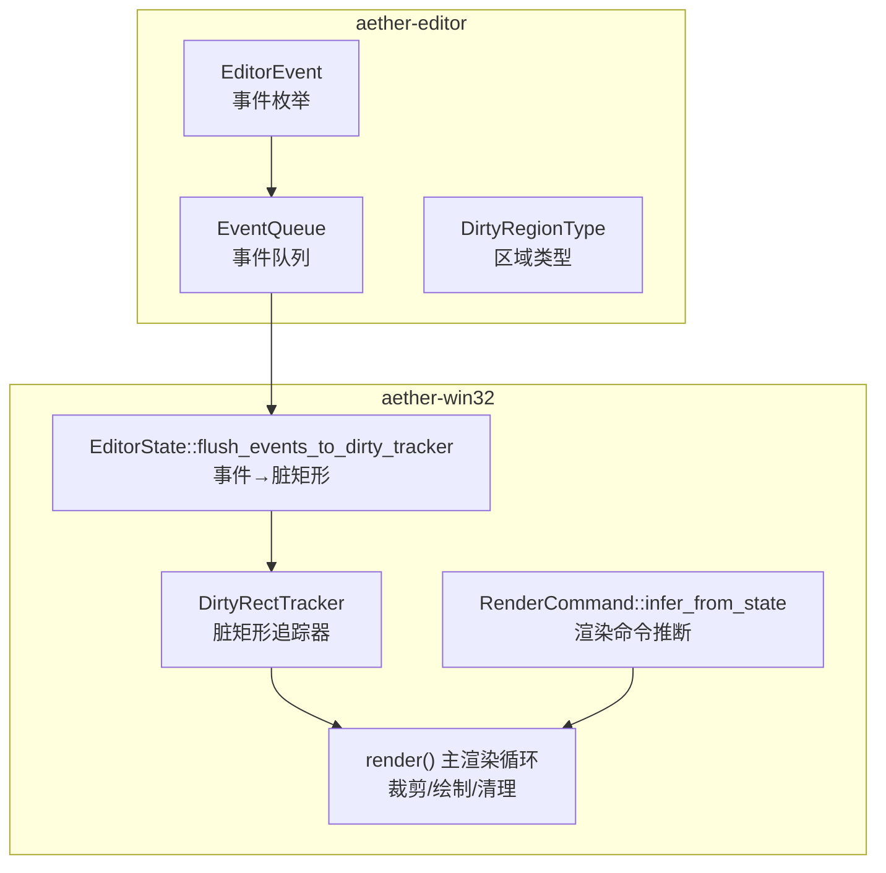
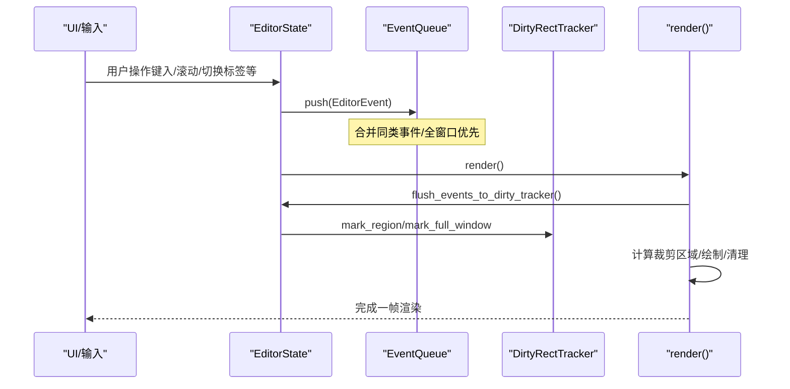
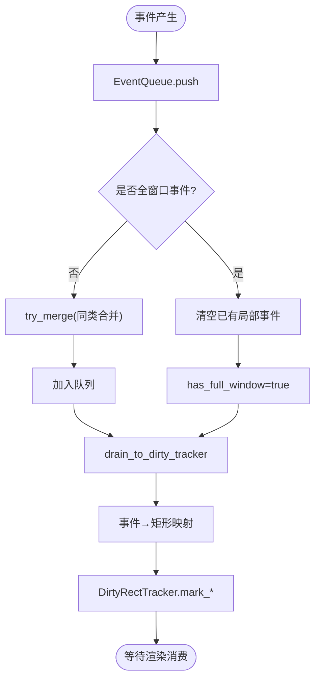
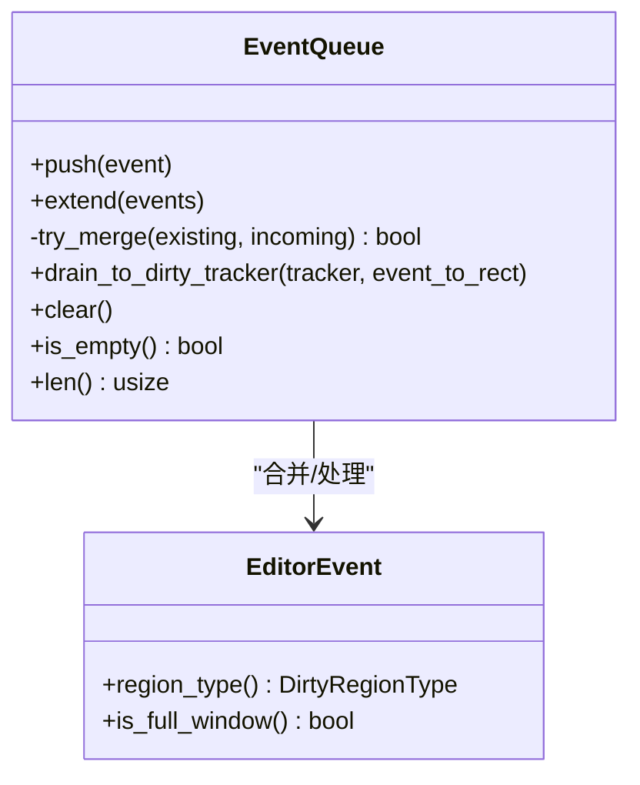
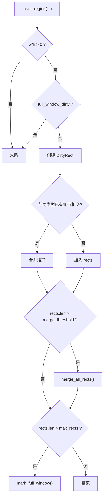
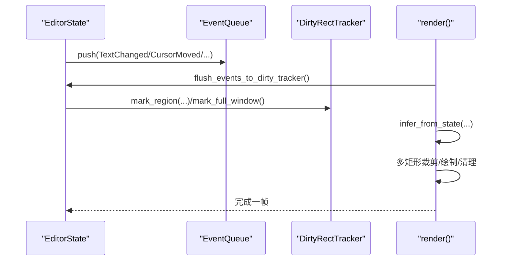
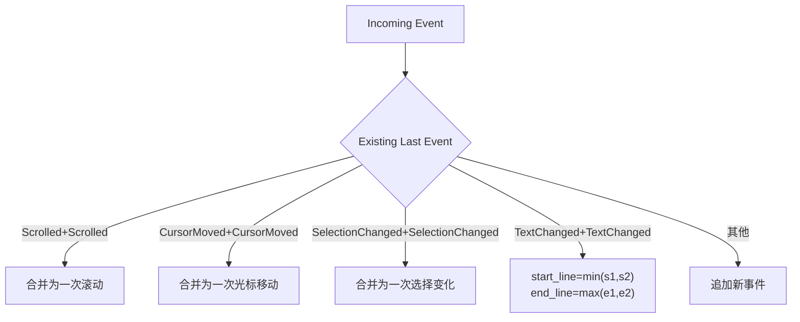
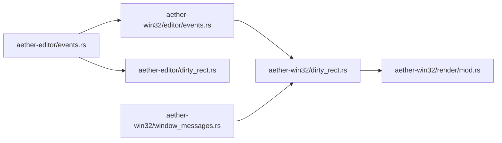

# 事件总线架构

<cite>
**本文引用的文件**
- [events.rs](file://crates/aether-editor/src/events.rs)
- [dirty_rect.rs](file://crates/aether-editor/src/dirty_rect.rs)
- [events.rs](file://crates/aether-win32/src/editor/events.rs)
- [dirty_rect.rs](file://crates/aether-win32/src/dirty_rect.rs)
- [mod.rs](file://crates/aether-win32/src/render/mod.rs)
- [window_messages.rs](file://crates/aether-win32/src/window/window_messages.rs)
</cite>

## 目录
1. [简介](#简介)
2. [项目结构](#项目结构)
3. [核心组件](#核心组件)
4. [架构总览](#架构总览)
5. [详细组件分析](#详细组件分析)
6. [依赖关系分析](#依赖关系分析)
7. [性能考量](#性能考量)
8. [故障排查指南](#故障排查指南)
9. [结论](#结论)
10. [附录：扩展与调试](#附录：扩展与调试)

## 简介
本文件为编辑器事件总线架构的全面文档，聚焦以下目标：
- 解释编辑器事件系统整体设计：EditorEvent 枚举、事件类型分类与生命周期管理。
- 深入说明 EventQueue 的实现机制：事件收集、合并算法与批量处理策略。
- 文档化脏矩形追踪器（DirtyRectTracker）的工作原理：区域标记、重绘优化与渲染性能提升。
- 解释事件与渲染层的解耦机制：模型层变更通知和视图层更新策略。
- 说明事件合并算法：连续滚动合并、光标移动合并、文本变化范围合并。
- 提供事件系统的扩展指南：新增事件类型与自定义处理器实现。
- 包含事件系统的调试工具与性能监控方法。

## 项目结构
事件系统横跨“编辑器核心”与“Win32 窗口/渲染层”两个 crate：
- aether-editor：定义 EditorEvent、EventQueue、DirtyRegionType 等基础类型与合并逻辑。
- aether-win32：在编辑器状态中消费事件队列，将其转换为脏矩形并驱动渲染；同时维护脏矩形追踪器与渲染命令推断。

**图表来源**
- [events.rs:9-64](file://crates/aether-editor/src/events.rs#L9-L64)
- [events.rs:66-186](file://crates/aether-editor/src/events.rs#L66-L186)
- [dirty_rect.rs:8-35](file://crates/aether-editor/src/dirty_rect.rs#L8-L35)
- [events.rs:122-221](file://crates/aether-win32/src/editor/events.rs#L122-L221)
- [dirty_rect.rs:87-366](file://crates/aether-win32/src/dirty_rect.rs#L87-L366)
- [mod.rs:146-542](file://crates/aether-win32/src/render/mod.rs#L146-L542)

**章节来源**
- [events.rs:9-64](file://crates/aether-editor/src/events.rs#L9-L64)
- [events.rs:66-186](file://crates/aether-editor/src/events.rs#L66-L186)
- [dirty_rect.rs:8-35](file://crates/aether-editor/src/dirty_rect.rs#L8-L35)
- [events.rs:122-221](file://crates/aether-win32/src/editor/events.rs#L122-L221)
- [dirty_rect.rs:87-366](file://crates/aether-win32/src/dirty_rect.rs#L87-L366)
- [mod.rs:146-542](file://crates/aether-win32/src/render/mod.rs#L146-L542)

## 核心组件
- EditorEvent：编辑器事件枚举，覆盖文本变化、光标/选择移动、滚动、标签页、侧边栏/右侧面板/底部面板/状态栏变化、窗口尺寸/DPI、查找替换面板、对话框可见性等。每个事件可映射到 DirtyRegionType，并支持判断是否需要全窗口重绘。
- EventQueue：一帧内的事件收集器，具备自动合并与降级策略（全窗口事件优先），并提供 drain_to_dirty_tracker 将事件批量转换为脏矩形。
- DirtyRegionType：脏区域类型，用于区分标题栏、菜单栏、活动栏、侧边栏、编辑器内容、标签栏、状态栏、右侧面板、底部面板、查找替换、对话框、全窗口等。
- DirtyRectTracker：记录当前帧的脏矩形列表，支持重叠合并、阈值触发合并、超过最大数量时降级为全窗口重绘，并提供按区域类型的查询接口。
- RenderCommand：根据当前状态推断最优渲染命令（None/EditorOnly/EditorAndStatus/SidebarOnly/RightPanelOnly/BottomPanelOnly/FullRedraw），避免无变化时的全量重绘。

**章节来源**
- [events.rs:9-64](file://crates/aether-editor/src/events.rs#L9-L64)
- [events.rs:66-186](file://crates/aether-editor/src/events.rs#L66-L186)
- [dirty_rect.rs:8-35](file://crates/aether-editor/src/dirty_rect.rs#L8-L35)
- [dirty_rect.rs:87-366](file://crates/aether-win32/src/dirty_rect.rs#L87-L366)
- [dirty_rect.rs:368-426](file://crates/aether-win32/src/dirty_rect.rs#L368-L426)

## 架构总览
事件从输入/编辑操作产生，进入 EventQueue 进行合并与批处理；随后在渲染前被 flush 到 DirtyRectTracker，生成最小化的脏矩形集合；渲染管线依据脏矩形进行裁剪与局部重绘，并在完成后清理。

**图表来源**
- [events.rs:84-186](file://crates/aether-editor/src/events.rs#L84-L186)
- [events.rs:122-221](file://crates/aether-win32/src/editor/events.rs#L122-L221)
- [dirty_rect.rs:120-162](file://crates/aether-win32/src/dirty_rect.rs#L120-L162)
- [mod.rs:282-542](file://crates/aether-win32/src/render/mod.rs#L282-L542)

## 详细组件分析

### EditorEvent 与事件生命周期
- 事件类型分类：
  - 编辑器内容相关：TextChanged、CursorMoved、SelectionChanged、Scrolled → 对应 EditorContent。
  - 界面布局相关：TabChanged、SidebarChanged、RightPanelChanged、BottomPanelChanged、StatusBarChanged → 分别对应 TabBar、Sidebar、RightPanel、BottomPanel、StatusBar。
  - 全局影响：WindowResized、DialogVisibilityChanged → FullWindow。
  - 其他：FindReplaceChanged → FindReplace。
- 生命周期：
  - 产生：由编辑器状态或输入处理产生（如 emit_edit_events）。
  - 收集：EventQueue.push 合并与优先级处理（全窗口事件清空并覆盖局部事件）。
  - 转换：flush_events_to_dirty_tracker 将事件转为具体矩形并标记到 DirtyRectTracker。
  - 消费：render() 使用 DirtyRectTracker 决定裁剪与绘制范围，完成后 clear。

**图表来源**
- [events.rs:84-186](file://crates/aether-editor/src/events.rs#L84-L186)
- [events.rs:122-221](file://crates/aether-win32/src/editor/events.rs#L122-L221)

**章节来源**
- [events.rs:9-64](file://crates/aether-editor/src/events.rs#L9-L64)
- [events.rs:84-186](file://crates/aether-editor/src/events.rs#L84-L186)
- [events.rs:122-221](file://crates/aether-win32/src/editor/events.rs#L122-L221)

### EventQueue：收集、合并与批量处理
- 合并策略：
  - 连续 Scrolled → 合并为一次滚动。
  - 连续 CursorMoved → 合并为一次光标移动。
  - 连续 SelectionChanged → 合并为一次选择变化。
  - TextChanged 行范围合并：取 start_line 的最小值与 end_line 的最大值，扩大受影响范围。
- 全窗口优先：
  - 一旦存在 WindowResized 或 DialogVisibilityChanged，清空已有局部事件并标记 has_full_window。
  - 后续局部事件被忽略，直到 drain 后重置标志。
- 批量处理：
  - drain_to_dirty_tracker 遍历队列，调用 event_to_rect 回调将事件转为矩形，再交给 DirtyRectTracker 标记。
  - 全窗口事件直接调用 mark_full_window，不执行回调。

**图表来源**
- [events.rs:66-186](file://crates/aether-editor/src/events.rs#L66-L186)

**章节来源**
- [events.rs:66-186](file://crates/aether-editor/src/events.rs#L66-L186)

### DirtyRectTracker：区域标记、重绘优化与性能提升
- 区域标记：
  - mark_region(x,y,w,h,type)：插入新矩形，若与同类型已有矩形相交则合并。
  - mark_editor_line/mark_cursor/mark_status_bar：便捷方法，封装坐标计算与类型。
  - mark_full_window：标记全窗口重绘，清空现有矩形列表。
- 合并与降级：
  - merge_all_rects：当矩形数量超过阈值时触发，合并所有相交的同类型矩形。
  - max_rects 上限：超过则降级为全窗口重绘，避免过多小矩形导致渲染开销过大。
- 查询接口：
  - is_full_window/is_region_dirty/is_editor_dirty/is_sidebar_dirty/is_status_bar_dirty/is_right_panel_dirty/is_bottom_panel_dirty/is_title_bar_dirty：基于 full_window_dirty 或 rects 列表判断是否需要重绘。
- 生命周期：
  - 每帧开始可能由外部显式标记（如 resize、后台任务轮询），或在 flush_events_to_dirty_tracker 中被填充。
  - 渲染完成后 clear，释放脏标记。

**图表来源**
- [dirty_rect.rs:120-162](file://crates/aether-win32/src/dirty_rect.rs#L120-L162)
- [dirty_rect.rs:336-366](file://crates/aether-win32/src/dirty_rect.rs#L336-L366)

**章节来源**
- [dirty_rect.rs:87-366](file://crates/aether-win32/src/dirty_rect.rs#L87-L366)

### 事件与渲染层的解耦机制
- 模型层变更通知：
  - 编辑器状态在文本编辑后发射 TextChanged + CursorMoved（emit_edit_events），并调度自动保存防抖定时器。
  - 其他 UI 状态变化（侧边栏、右侧面板、底部面板、状态栏、对话框）通过相应事件通知。
- 视图层更新策略：
  - render() 先调用 flush_events_to_dirty_tracker，将事件转换为具体矩形并标记到 DirtyRectTracker。
  - 随后根据状态变化推断 RenderCommand，仅在必要时标记额外区域（如标签切换、面板可见性变化）。
  - 若无脏区域，跳过渲染（REQ-P0-06），避免空转帧。
  - 渲染时使用多矩形并集裁剪，减少绘制面积；菜单快速路径仅绘制不透明菜单本体，避免整条管线开销。

**图表来源**
- [events.rs:112-121](file://crates/aether-win32/src/editor/events.rs#L112-L121)
- [events.rs:122-221](file://crates/aether-win32/src/editor/events.rs#L122-L221)
- [mod.rs:282-542](file://crates/aether-win32/src/render/mod.rs#L282-L542)

**章节来源**
- [events.rs:112-121](file://crates/aether-win32/src/editor/events.rs#L112-L121)
- [events.rs:122-221](file://crates/aether-win32/src/editor/events.rs#L122-L221)
- [mod.rs:282-542](file://crates/aether-win32/src/render/mod.rs#L282-L542)

### 事件合并算法详解
- 连续滚动合并：多次 Scrolled 合并为一次，减少滚动导致的重复重绘。
- 光标移动合并：多次 CursorMoved 合并为一次，避免光标闪烁带来的多余绘制。
- 文本变化范围合并：相邻 TextChanged 的行范围取最小起始与最大结束，扩大受影响区域但减少事件数量。
- 全窗口事件优先：WindowResized 或 DialogVisibilityChanged 会清空并覆盖局部事件，确保全屏一致性。

**图表来源**
- [events.rs:116-143](file://crates/aether-editor/src/events.rs#L116-L143)

**章节来源**
- [events.rs:116-143](file://crates/aether-editor/src/events.rs#L116-L143)

## 依赖关系分析
- aether-editor 提供基础类型与合并逻辑，被 aether-win32 引用。
- aether-win32 的 EditorState 在渲染前消费 EventQueue，并将事件转换为 DirtyRectTracker 的标记。
- window_messages 中的定时器与消息处理会间接触发 dirty_tracker 标记（如终端刷新、AI 面板刷新、设置面板轮询等），并通过 invalidate_window 请求 WM_PAINT 统一渲染。

**图表来源**
- [events.rs:1-7](file://crates/aether-editor/src/events.rs#L1-L7)
- [events.rs:122-221](file://crates/aether-win32/src/editor/events.rs#L122-L221)
- [dirty_rect.rs:87-366](file://crates/aether-win32/src/dirty_rect.rs#L87-L366)
- [window_messages.rs:167-236](file://crates/aether-win32/src/window/window_messages.rs#L167-L236)

**章节来源**
- [events.rs:1-7](file://crates/aether-editor/src/events.rs#L1-L7)
- [events.rs:122-221](file://crates/aether-win32/src/editor/events.rs#L122-L221)
- [dirty_rect.rs:87-366](file://crates/aether-win32/src/dirty_rect.rs#L87-L366)
- [window_messages.rs:167-236](file://crates/aether-win32/src/window/window_messages.rs#L167-L236)

## 性能考量
- 事件合并显著降低重复绘制次数，尤其在高频输入场景（滚动、光标移动、文本输入）。
- 脏矩形合并与阈值控制避免过多小矩形导致渲染开销增大；超过上限时降级为全窗口重绘，保证稳定性。
- 渲染命令推断在无状态变化时返回 None，避免空转帧的全量重绘。
- 菜单快速路径仅绘制不透明菜单本体，结合多矩形裁剪，极大降低菜单交互卡顿。
- 后台任务泵独立于渲染路径，通过定时器轮询，避免阻塞 UI 线程。

[本节为通用性能讨论，无需特定文件引用]

## 故障排查指南
- 症状：频繁全窗口重绘
  - 检查是否有过多不相交的小矩形导致触发 max_rects 上限。
  - 确认是否存在误用 mark_full_window 的场景。
- 症状：局部区域残影
  - 检查事件到矩形的映射是否正确（如光标 x 坐标基于字符列而非字节偏移）。
  - 确认对话框/菜单快速路径是否正确使用裁剪。
- 症状：渲染卡顿
  - 观察后台任务泵是否在主渲染路径阻塞；应移至定时器。
  - 检查 GPU 高亮缓存是否命中，避免重复词法分析。

**章节来源**
- [dirty_rect.rs:120-162](file://crates/aether-win32/src/dirty_rect.rs#L120-L162)
- [events.rs:131-147](file://crates/aether-win32/src/editor/events.rs#L131-L147)
- [mod.rs:544-637](file://crates/aether-win32/src/render/mod.rs#L544-L637)
- [window_messages.rs:167-236](file://crates/aether-win32/src/window/window_messages.rs#L167-L236)

## 结论
该事件总线架构通过事件枚举、队列合并与脏矩形追踪实现了高效的模型-视图解耦。EventQueue 的合并策略与全窗口优先机制有效减少了冗余绘制；DirtyRectTracker 的区域标记与合并算法保障了局部重绘的性能；渲染命令推断进一步避免了无变化时的全量重绘。整体设计在保证响应性的同时，提供了良好的可扩展性与可维护性。

[本节为总结，无需特定文件引用]

## 附录：扩展与调试

### 新增事件类型
- 在 EditorEvent 中添加新变体，并实现 region_type 映射到合适的 DirtyRegionType。
- 在 EventQueue.try_merge 中决定是否合并（如连续事件或范围合并）。
- 在 flush_events_to_dirty_tracker 的事件匹配分支中，返回对应的矩形区域（或 None 表示由调用方显式标记）。

**章节来源**
- [events.rs:9-64](file://crates/aether-editor/src/events.rs#L9-L64)
- [events.rs:116-143](file://crates/aether-editor/src/events.rs#L116-L143)
- [events.rs:122-221](file://crates/aether-win32/src/editor/events.rs#L122-L221)

### 自定义事件处理器
- 在 EditorState 中实现 emit_event 调用，将事件推入 EventQueue。
- 如需特殊处理（如延迟刷新、条件合并），可在 flush_events_to_dirty_tracker 中定制事件到矩形的映射逻辑。
- 对于需要全窗口重绘的场景，直接 emit WindowResized 或 DialogVisibilityChanged。

**章节来源**
- [events.rs:34-37](file://crates/aether-win32/src/editor/events.rs#L34-L37)
- [events.rs:122-221](file://crates/aether-win32/src/editor/events.rs#L122-L221)

### 调试工具与性能监控
- 使用 EventQueue.len 与 DirtyRectTracker.dirty_count 观察事件数量与脏矩形数量。
- 在 render() 入口添加 tracing::trace 日志，记录窗口尺寸与关键状态。
- 利用 window_messages 中的定时器钩子（如 TERM_TIMER、AI_TIMER）观察后台任务对脏标记的影响。
- 针对菜单快速路径，检查是否满足 dialog_only 条件，避免不必要的整条管线开销。

**章节来源**
- [events.rs:173-186](file://crates/aether-editor/src/events.rs#L173-L186)
- [dirty_rect.rs:358-366](file://crates/aether-win32/src/dirty_rect.rs#L358-L366)
- [mod.rs:163-168](file://crates/aether-win32/src/render/mod.rs#L163-L168)
- [window_messages.rs:167-236](file://crates/aether-win32/src/window/window_messages.rs#L167-L236)