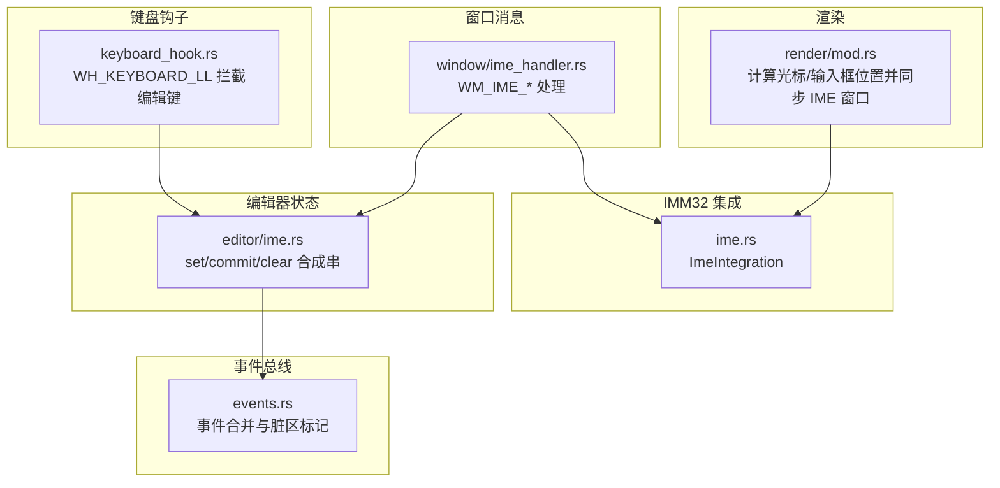
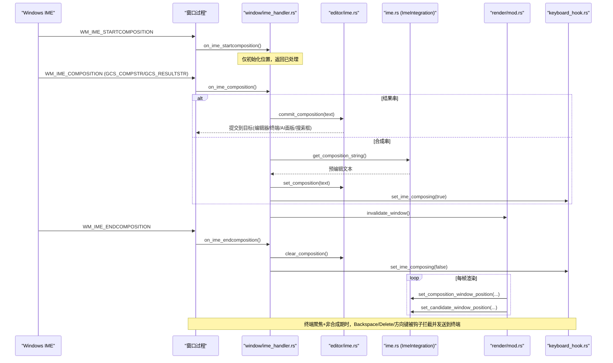
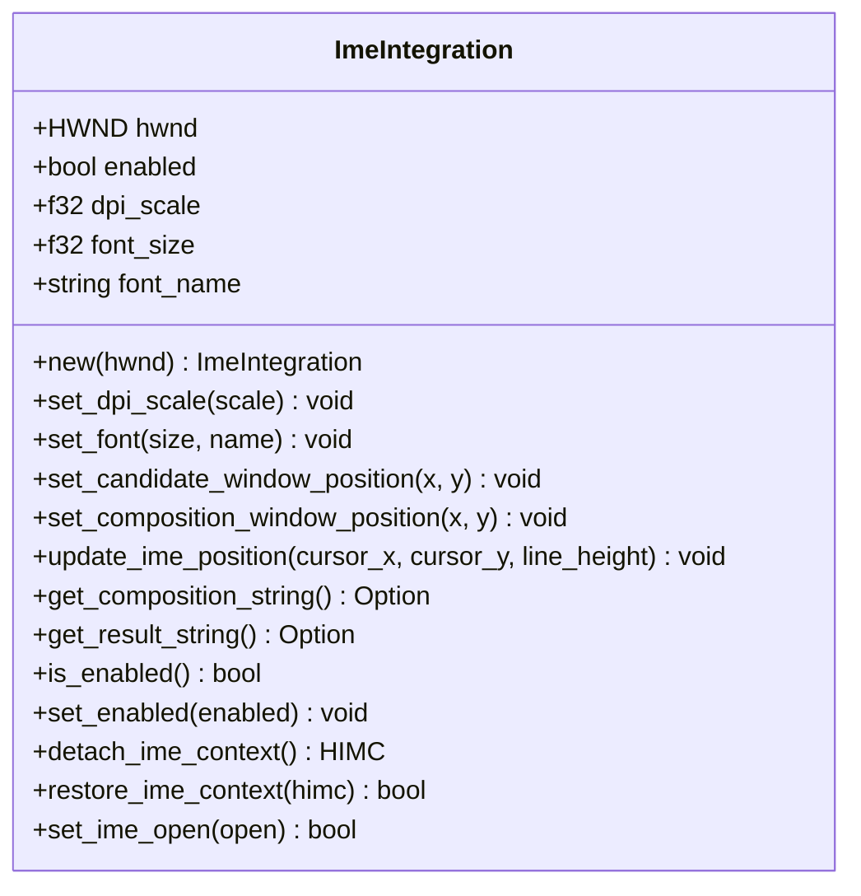
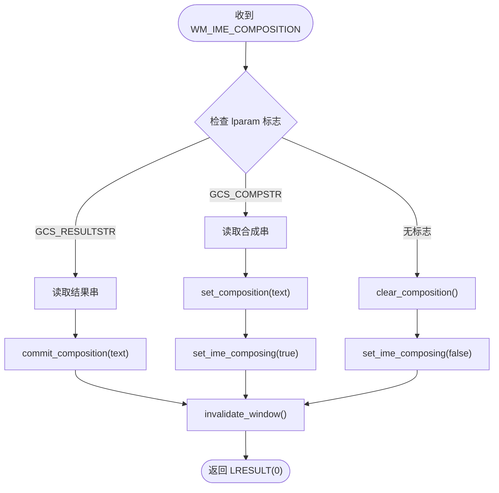
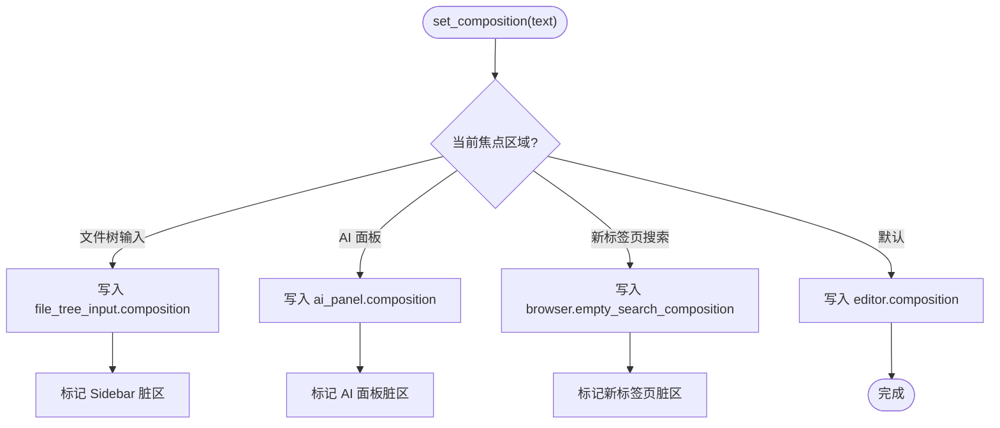
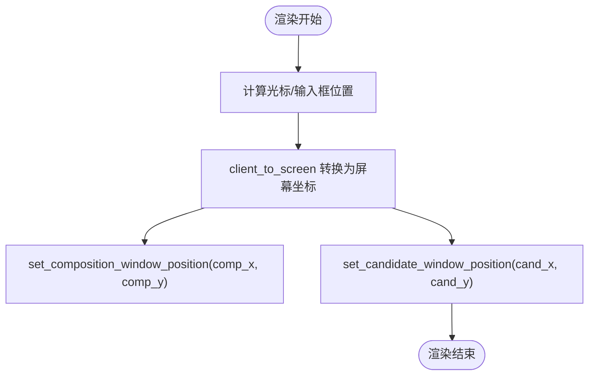
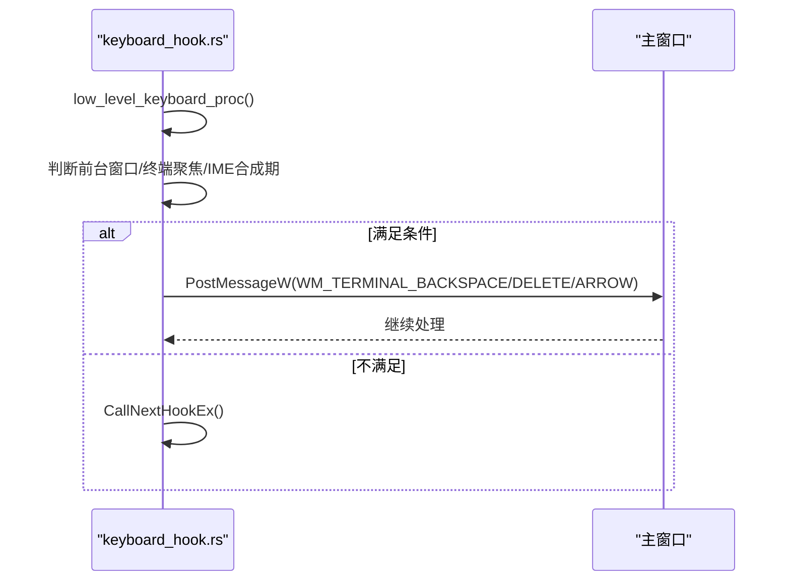
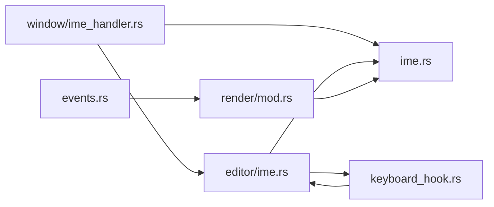

# 输入法事件处理

<cite>
**本文引用的文件**
- [crates/aether-win32/src/ime.rs](file://crates/aether-win32/src/ime.rs)
- [crates/aether-win32/src/window/ime_handler.rs](file://crates/aether-win32/src/window/ime_handler.rs)
- [crates/aether-win32/src/editor/ime.rs](file://crates/aether-win32/src/editor/ime.rs)
- [crates/aether-win32/src/render/mod.rs](file://crates/aether-win32/src/render/mod.rs)
- [crates/aether-win32/src/keyboard_hook.rs](file://crates/aether-win32/src/keyboard_hook.rs)
- [crates/aether-editor/src/events.rs](file://crates/aether-editor/src/events.rs)
</cite>

## 目录
1. [简介](#简介)
2. [项目结构](#项目结构)
3. [核心组件](#核心组件)
4. [架构总览](#架构总览)
5. [详细组件分析](#详细组件分析)
6. [依赖关系分析](#依赖关系分析)
7. [性能考虑](#性能考虑)
8. [故障排查指南](#故障排查指南)
9. [结论](#结论)

## 简介
本文件面向 Windows IME（输入法）集成与事件处理，系统性说明输入法检测、状态管理、消息路由机制；中文输入流程（拼音输入、候选词选择、最终文本确认）；合成窗口管理与候选词窗口定位；多输入法兼容性策略；IME 生命周期管理；以及性能优化与常见问题解决方案。目标是帮助开发者理解并维护一个稳定、高性能、跨输入法的编辑体验。

## 项目结构
本项目将 IME 相关能力拆分为多个模块：
- IMM32 集成层：负责与系统 IME API 交互（候选窗口/合成窗口位置、读取合成串/结果串、开关 IME）。
- 窗口消息处理层：处理 WM_IME_STARTCOMPOSITION、WM_IME_COMPOSITION、WM_IME_ENDCOMPOSITION、WM_IME_CHAR。
- 编辑器状态层：维护当前合成串、提交逻辑、多焦点区域（编辑器、终端、AI 面板、搜索框等）的 IME 行为。
- 渲染层：在绘制时计算光标/输入框位置，同步更新 IME 合成窗口与候选窗口坐标。
- 低层键盘钩子：拦截 Backspace/Delete/方向键，解决终端聚焦时 IME 拦截导致的删除问题。
- 事件总线：合并与分发编辑器事件，减少重复重绘。

**图表来源**
- [crates/aether-win32/src/window/ime_handler.rs:1-132](file://crates/aether-win32/src/window/ime_handler.rs#L1-L132)
- [crates/aether-win32/src/ime.rs:1-255](file://crates/aether-win32/src/ime.rs#L1-L255)
- [crates/aether-win32/src/editor/ime.rs:1-271](file://crates/aether-win32/src/editor/ime.rs#L1-L271)
- [crates/aether-win32/src/render/mod.rs:1250-1450](file://crates/aether-win32/src/render/mod.rs#L1250-L1450)
- [crates/aether-win32/src/keyboard_hook.rs:1-315](file://crates/aether-win32/src/keyboard_hook.rs#L1-L315)
- [crates/aether-editor/src/events.rs:1-394](file://crates/aether-editor/src/events.rs#L1-L394)

**章节来源**
- [crates/aether-win32/src/window/ime_handler.rs:1-132](file://crates/aether-win32/src/window/ime_handler.rs#L1-L132)
- [crates/aether-win32/src/ime.rs:1-255](file://crates/aether-win32/src/ime.rs#L1-L255)
- [crates/aether-win32/src/editor/ime.rs:1-271](file://crates/aether-win32/src/editor/ime.rs#L1-L271)
- [crates/aether-win32/src/render/mod.rs:1250-1450](file://crates/aether-win32/src/render/mod.rs#L1250-L1450)
- [crates/aether-win32/src/keyboard_hook.rs:1-315](file://crates/aether-win32/src/keyboard_hook.rs#L1-L315)
- [crates/aether-editor/src/events.rs:1-394](file://crates/aether-editor/src/events.rs#L1-L394)

## 核心组件
- ImeIntegration（IMM32 集成）
  - 提供设置候选窗口/合成窗口位置、读取合成串/结果串、开关 IME、解绑/恢复 HIMC 的能力。
  - 支持 DPI 缩放，确保高 DPI 下候选窗口可读。
- 窗口 IME 处理器
  - 处理 WM_IME_STARTCOMPOSITION、WM_IME_COMPOSITION、WM_IME_ENDCOMPOSITION、WM_IME_CHAR。
  - 区分 GCS_COMPSTR（预编辑文本）与 GCS_RESULTSTR（已提交文本），分别更新显示或提交到目标区域。
- 编辑器 IME 状态
  - set_composition/clear_composition/commit_composition：维护当前合成串、清除状态、提交文本到正确目标（编辑器、终端、AI 面板、搜索框等）。
  - 终端聚焦时关闭 IME 以绕过系统级拦截，保证 Backspace 直达终端。
- 渲染层 IME 同步
  - 在绘制阶段计算光标/输入框位置，调用 ImeIntegration 更新合成窗口与候选窗口坐标。
- 低层键盘钩子
  - 安装 WH_KEYBOARD_LL，拦截 Backspace/Delete/方向键，当终端聚焦且不在 IME 合成期时，将按键转义序列发送到 ConPTY。
- 事件总线
  - 合并同类事件（如连续滚动、光标移动、文本变化），减少重绘开销。

**章节来源**
- [crates/aether-win32/src/ime.rs:1-255](file://crates/aether-win32/src/ime.rs#L1-L255)
- [crates/aether-win32/src/window/ime_handler.rs:1-132](file://crates/aether-win32/src/window/ime_handler.rs#L1-L132)
- [crates/aether-win32/src/editor/ime.rs:1-271](file://crates/aether-win32/src/editor/ime.rs#L1-L271)
- [crates/aether-win32/src/render/mod.rs:1250-1450](file://crates/aether-win32/src/render/mod.rs#L1250-L1450)
- [crates/aether-win32/src/keyboard_hook.rs:1-315](file://crates/aether-win32/src/keyboard_hook.rs#L1-L315)
- [crates/aether-editor/src/events.rs:1-394](file://crates/aether-editor/src/events.rs#L1-L394)

## 架构总览
下图展示了从系统 IME 消息到编辑器/终端提交的完整链路，包括候选窗口定位与键盘钩子的协同。

**图表来源**
- [crates/aether-win32/src/window/ime_handler.rs:1-132](file://crates/aether-win32/src/window/ime_handler.rs#L1-L132)
- [crates/aether-win32/src/editor/ime.rs:1-271](file://crates/aether-win32/src/editor/ime.rs#L1-L271)
- [crates/aether-win32/src/ime.rs:1-255](file://crates/aether-win32/src/ime.rs#L1-L255)
- [crates/aether-win32/src/render/mod.rs:1250-1450](file://crates/aether-win32/src/render/mod.rs#L1250-L1450)
- [crates/aether-win32/src/keyboard_hook.rs:1-315](file://crates/aether-win32/src/keyboard_hook.rs#L1-L315)

## 详细组件分析

### 组件A：IMM32 集成（ImeIntegration）
- 职责
  - 设置候选窗口位置（跟随光标下方，带偏移避免遮挡）。
  - 设置合成窗口位置（预编辑文本显示区域）。
  - 读取合成串/结果串（UTF-16 转换）。
  - 开关 IME（ImmSetOpenStatus）、解绑/恢复 HIMC（ImmAssociateContext）。
  - DPI 缩放：基础尺寸按 dpi_scale 缩放，适配高 DPI。
- 关键点
  - RAII 守卫 HimcGuard 确保释放 HIMC 上下文。
  - 通过 ImmGetCompositionStringW 两次调用获取长度与数据。
  - 提供 update_ime_position 统一更新合成与候选窗口。

**图表来源**
- [crates/aether-win32/src/ime.rs:1-255](file://crates/aether-win32/src/ime.rs#L1-L255)

**章节来源**
- [crates/aether-win32/src/ime.rs:1-255](file://crates/aether-win32/src/ime.rs#L1-L255)

### 组件B：窗口 IME 消息处理
- 职责
  - 处理 WM_IME_STARTCOMPOSITION：仅做位置初始化。
  - 处理 WM_IME_COMPOSITION：
    - GCS_RESULTSTR：读取结果串并提交到目标区域（编辑器/终端/AI面板/搜索框）。
    - GCS_COMPSTR：读取合成串并更新显示，进入合成期。
    - 无标志：取消合成。
  - 处理 WM_IME_ENDCOMPOSITION：清除合成串，必要时关闭 IME（终端场景）。
  - 处理 WM_IME_CHAR：阻止重复插入字符。
- 关键点
  - 使用 EDITOR_STATE 访问当前 UI 状态。
  - 通过 keyboard_hook::set_ime_composing 控制低层钩子是否放行编辑键。

**图表来源**
- [crates/aether-win32/src/window/ime_handler.rs:1-132](file://crates/aether-win32/src/window/ime_handler.rs#L1-L132)

**章节来源**
- [crates/aether-win32/src/window/ime_handler.rs:1-132](file://crates/aether-win32/src/window/ime_handler.rs#L1-L132)

### 组件C：编辑器 IME 状态管理
- 职责
  - set_composition：根据当前焦点区域（编辑器、终端、AI 面板、搜索框、文件树输入）写入合成串并标记脏区。
  - commit_composition：提交文本到目标区域；终端聚焦时直接送入 ConPTY，并在提交后关闭 IME。
  - clear_composition：清除对应区域的合成串并标记脏区。
  - set_terminal_ime_bypass：终端聚焦时关闭 IME，非聚焦时恢复，并同步低层钩子标志。
- 关键点
  - 多焦点区域感知：确保 IME 输入进入正确的 UI 组件。
  - 终端场景特殊处理：避免 IME 拦截导致无法删除。

**图表来源**
- [crates/aether-win32/src/editor/ime.rs:1-271](file://crates/aether-win32/src/editor/ime.rs#L1-L271)

**章节来源**
- [crates/aether-win32/src/editor/ime.rs:1-271](file://crates/aether-win32/src/editor/ime.rs#L1-L271)

### 组件D：渲染层 IME 窗口同步
- 职责
  - 在绘制阶段计算光标/输入框位置，转换为屏幕坐标后调用 ImeIntegration 更新合成窗口与候选窗口位置。
  - 覆盖多种场景：终端行内输入、文件树输入、浏览器地址栏、新标签页搜索框、AI 面板输入框、默认编辑器光标。
- 关键点
  - 使用 client_to_screen 进行坐标转换。
  - 针对不同 UI 组件计算文本宽度以确定候选窗口起始位置。

**图表来源**
- [crates/aether-win32/src/render/mod.rs:1250-1450](file://crates/aether-win32/src/render/mod.rs#L1250-L1450)
- [crates/aether-win32/src/ime.rs:1-255](file://crates/aether-win32/src/ime.rs#L1-L255)

**章节来源**
- [crates/aether-win32/src/render/mod.rs:1250-1450](file://crates/aether-win32/src/render/mod.rs#L1250-L1450)
- [crates/aether-win32/src/ime.rs:1-255](file://crates/aether-win32/src/ime.rs#L1-L255)

### 组件E：低层键盘钩子（WH_KEYBOARD_LL）
- 职责
  - 安装全局低层键盘钩子，拦截 Backspace/Delete/方向键。
  - 仅在“前台窗口为本应用”、“终端聚焦”、“非 IME 合成期”时拦截。
  - 将按键转为 ANSI 序列或字节发送到 ConPTY。
- 关键点
  - 使用 AtomicBool 同步 TERMINAL_FOCUSED_FLAG 与 IME_COMPOSING_FLAG。
  - PostMessageW 将自定义消息投递到主窗口处理。

**图表来源**
- [crates/aether-win32/src/keyboard_hook.rs:1-315](file://crates/aether-win32/src/keyboard_hook.rs#L1-L315)

**章节来源**
- [crates/aether-win32/src/keyboard_hook.rs:1-315](file://crates/aether-win32/src/keyboard_hook.rs#L1-L315)

### 组件F：事件总线（EditorEvent & EventQueue）
- 职责
  - 定义编辑器事件类型（文本变化、光标移动、选择变化、滚动、窗口尺寸变化等）。
  - 合并同类事件，减少重复重绘。
  - 将事件应用到脏矩形追踪器，驱动局部或全窗口重绘。
- 关键点
  - 全窗口事件会清空并忽略后续局部事件。
  - 支持批量入队与清理。

**章节来源**
- [crates/aether-editor/src/events.rs:1-394](file://crates/aether-editor/src/events.rs#L1-L394)

## 依赖关系分析
- 窗口消息处理依赖编辑器状态与 IMM32 集成。
- 编辑器状态依赖 IMM32 集成（读取字符串、开关 IME）与低层键盘钩子（同步合成期标志）。
- 渲染层依赖 IMM32 集成（设置窗口位置）与布局计算。
- 低层键盘钩子依赖编辑器状态中的终端聚焦标志。
- 事件总线独立于 IME 细节，但受 IME 提交触发的事件影响。

**图表来源**
- [crates/aether-win32/src/window/ime_handler.rs:1-132](file://crates/aether-win32/src/window/ime_handler.rs#L1-L132)
- [crates/aether-win32/src/editor/ime.rs:1-271](file://crates/aether-win32/src/editor/ime.rs#L1-L271)
- [crates/aether-win32/src/ime.rs:1-255](file://crates/aether-win32/src/ime.rs#L1-L255)
- [crates/aether-win32/src/render/mod.rs:1250-1450](file://crates/aether-win32/src/render/mod.rs#L1250-L1450)
- [crates/aether-win32/src/keyboard_hook.rs:1-315](file://crates/aether-win32/src/keyboard_hook.rs#L1-L315)
- [crates/aether-editor/src/events.rs:1-394](file://crates/aether-editor/src/events.rs#L1-L394)

**章节来源**
- [crates/aether-win32/src/window/ime_handler.rs:1-132](file://crates/aether-win32/src/window/ime_handler.rs#L1-L132)
- [crates/aether-win32/src/editor/ime.rs:1-271](file://crates/aether-win32/src/editor/ime.rs#L1-L271)
- [crates/aether-win32/src/ime.rs:1-255](file://crates/aether-win32/src/ime.rs#L1-L255)
- [crates/aether-win32/src/render/mod.rs:1250-1450](file://crates/aether-win32/src/render/mod.rs#L1250-L1450)
- [crates/aether-win32/src/keyboard_hook.rs:1-315](file://crates/aether-win32/src/keyboard_hook.rs#L1-L315)
- [crates/aether-editor/src/events.rs:1-394](file://crates/aether-editor/src/events.rs#L1-L394)

## 性能考虑
- 事件合并：通过 EventQueue 合并连续的光标移动、滚动、文本变化事件，减少重绘次数。
- 脏区标记：精确标记受影响区域（编辑器内容、侧边栏、右面板、底部面板、状态栏、查找替换、对话框），避免全窗口重绘。
- IME 窗口同步：仅在渲染阶段计算并设置合成/候选窗口位置，降低频繁系统调用开销。
- DPI 缩放：基础尺寸乘以 dpi_scale，避免在高 DPI 下重新设计布局。
- 内存管理：HIMC 上下文通过 RAII 守卫自动释放，避免泄漏。
- 终端场景优化：提交后立即关闭 IME，减少系统级拦截带来的额外处理。

[本节为通用性能建议，未直接分析具体代码片段]

## 故障排查指南
- 候选词错位
  - 现象：候选窗口与光标位置不一致。
  - 排查：检查渲染层是否正确计算光标/输入框位置并调用 set_composition_window_position/set_candidate_window_position；确认 DPI 缩放因子设置正确。
  - 参考路径：[crates/aether-win32/src/render/mod.rs:1250-1450](file://crates/aether-win32/src/render/mod.rs#L1250-L1450)、[crates/aether-win32/src/ime.rs:63-134](file://crates/aether-win32/src/ime.rs#L63-L134)
- 输入法崩溃恢复
  - 现象：IME 异常后无法输入或删除。
  - 排查：确保在 WM_IME_ENDCOMPOSITION 中清除合成串并关闭 IME；必要时解绑/恢复 HIMC 上下文。
  - 参考路径：[crates/aether-win32/src/window/ime_handler.rs:95-118](file://crates/aether-win32/src/window/ime_handler.rs#L95-L118)、[crates/aether-win32/src/ime.rs:208-242](file://crates/aether-win32/src/ime.rs#L208-L242)
- 终端无法删除汉字
  - 现象：Backspace 无效。
  - 排查：确认终端聚焦时关闭 IME；检查低层键盘钩子是否拦截并发送 \x7f；确保 set_ime_composing 正确切换。
  - 参考路径：[crates/aether-win32/src/editor/ime.rs:85-107](file://crates/aether-win32/src/editor/ime.rs#L85-L107)、[crates/aether-win32/src/keyboard_hook.rs:151-245](file://crates/aether-win32/src/keyboard_hook.rs#L151-L245)
- 中文输入被“偷”到编辑器
  - 现象：终端聚焦时输入的字母进入编辑器而非终端。
  - 排查：确保 commit_composition 在终端聚焦时将文本送入 ConPTY；避免错误地写入编辑器。
  - 参考路径：[crates/aether-win32/src/editor/ime.rs:109-131](file://crates/aether-win32/src/editor/ime.rs#L109-L131)

**章节来源**
- [crates/aether-win32/src/render/mod.rs:1250-1450](file://crates/aether-win32/src/render/mod.rs#L1250-L1450)
- [crates/aether-win32/src/ime.rs:63-134](file://crates/aether-win32/src/ime.rs#L63-L134)
- [crates/aether-win32/src/window/ime_handler.rs:95-118](file://crates/aether-win32/src/window/ime_handler.rs#L95-L118)
- [crates/aether-win32/src/ime.rs:208-242](file://crates/aether-win32/src/ime.rs#L208-L242)
- [crates/aether-win32/src/editor/ime.rs:85-107](file://crates/aether-win32/src/editor/ime.rs#L85-L107)
- [crates/aether-win32/src/keyboard_hook.rs:151-245](file://crates/aether-win32/src/keyboard_hook.rs#L151-L245)
- [crates/aether-win32/src/editor/ime.rs:109-131](file://crates/aether-win32/src/editor/ime.rs#L109-L131)

## 结论
本系统通过分层设计实现了稳健的 Windows IME 集成：IMM32 集成层负责底层 API 交互，窗口消息处理层解析 IME 状态并路由到编辑器状态层，渲染层确保候选窗口与合成窗口精确定位，低层键盘钩子解决终端场景下的删除问题，事件总线优化重绘性能。该架构对微软拼音、搜狗输入法、Google 输入法等标准 IME 具有良好兼容性，并通过 DPI 缩放、RAII 资源管理、事件合并等策略保障性能与稳定性。

[本节为总结性内容，未直接分析具体文件]