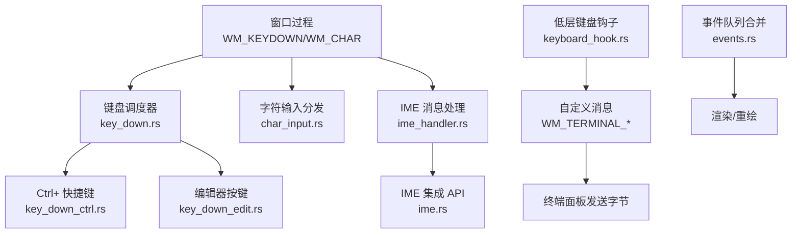
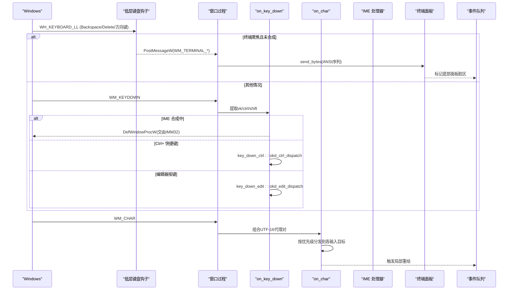
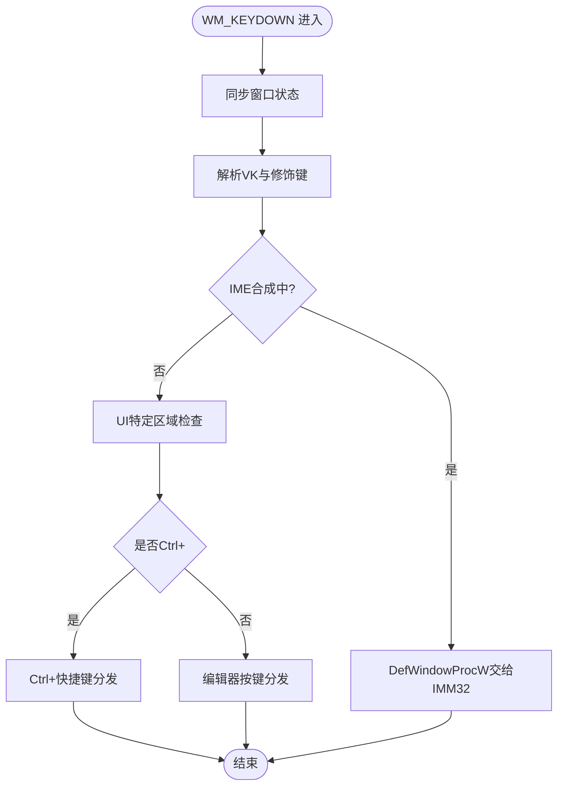
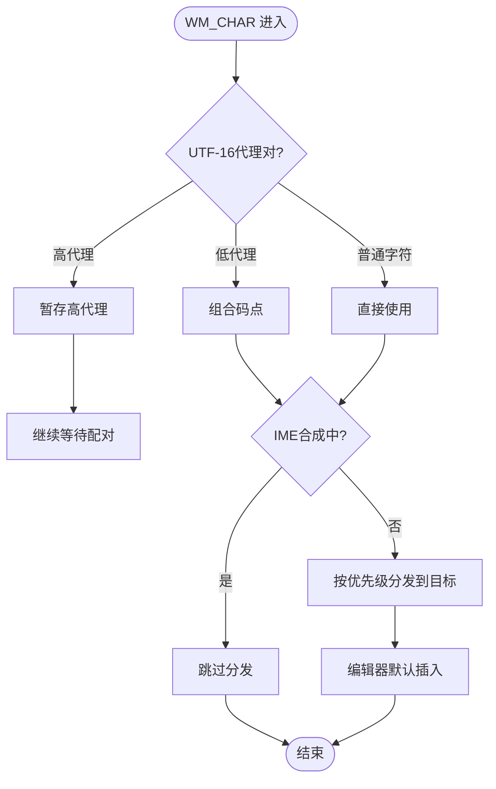
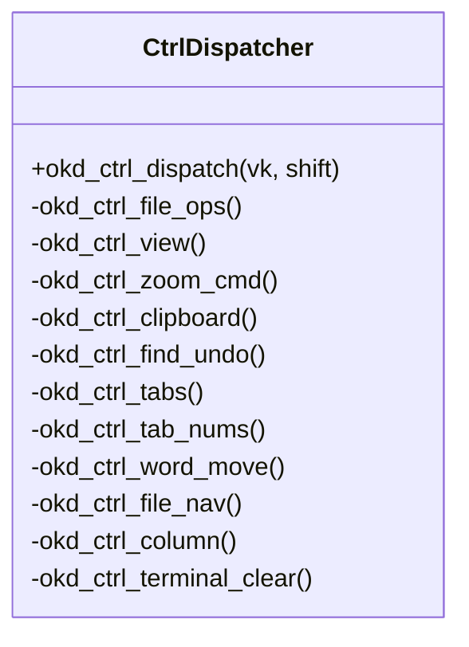
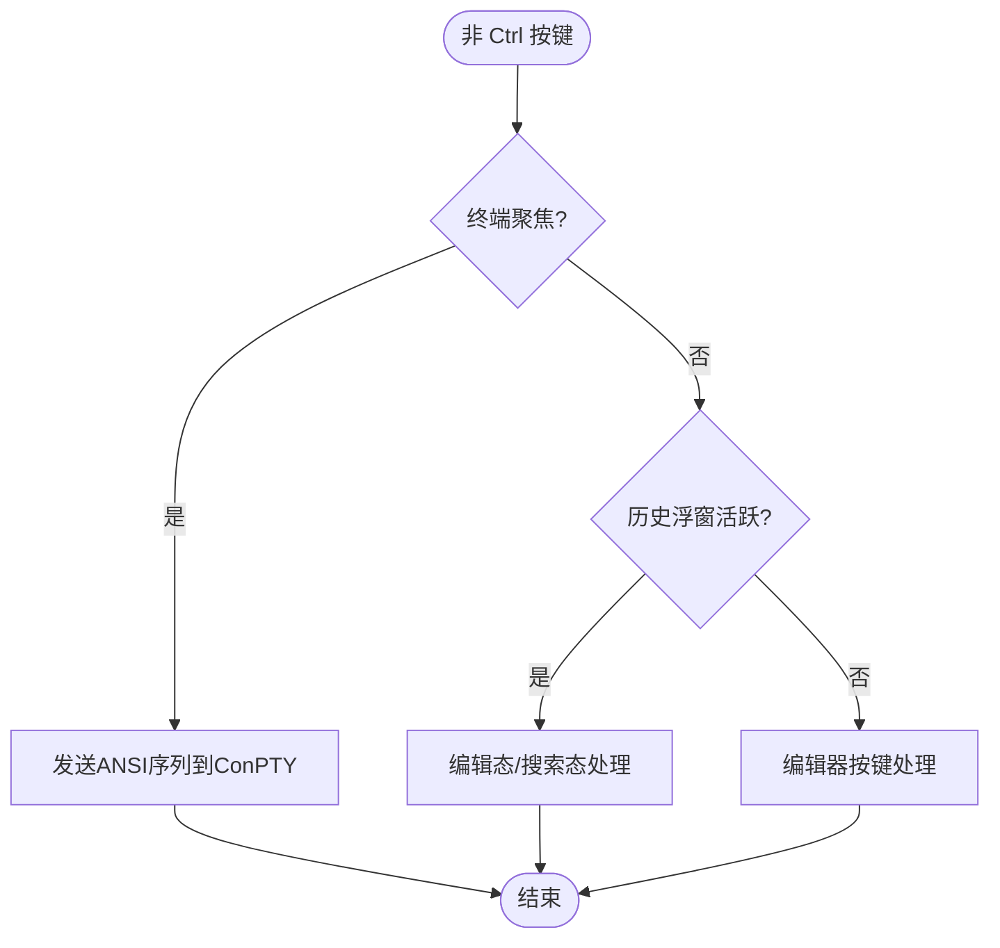
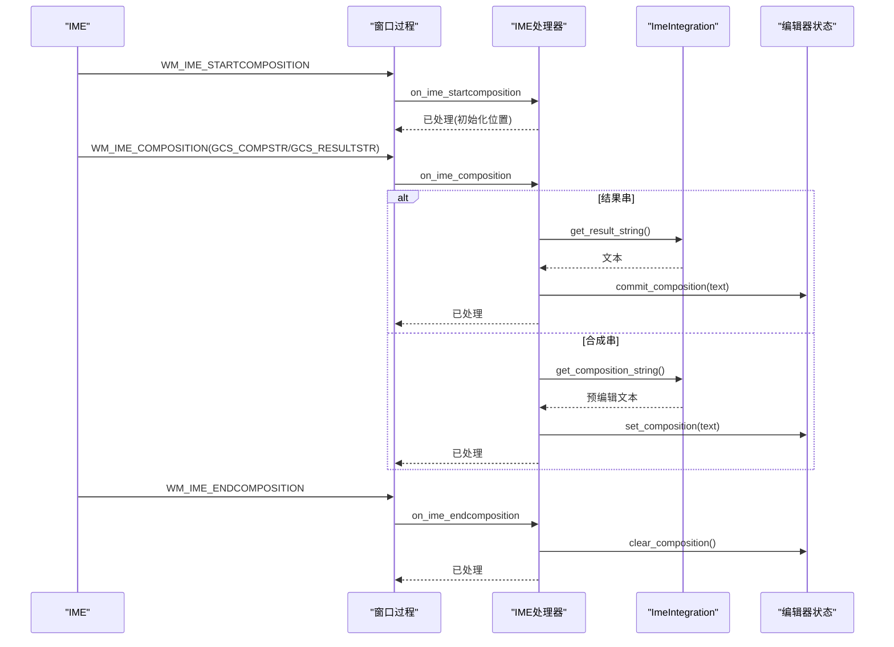
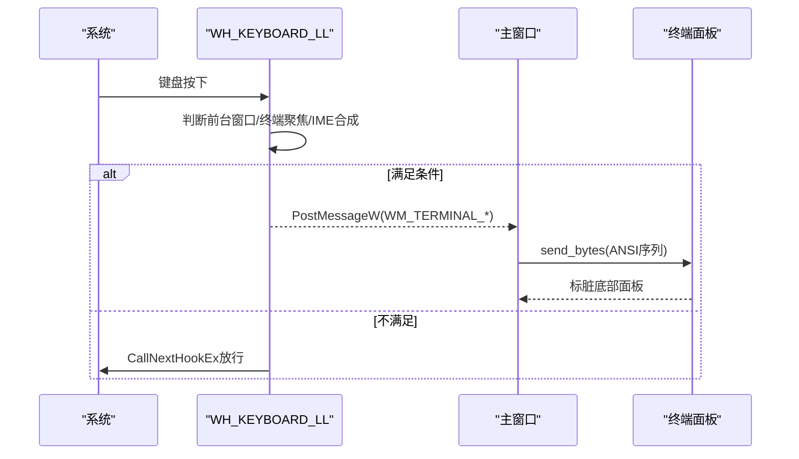
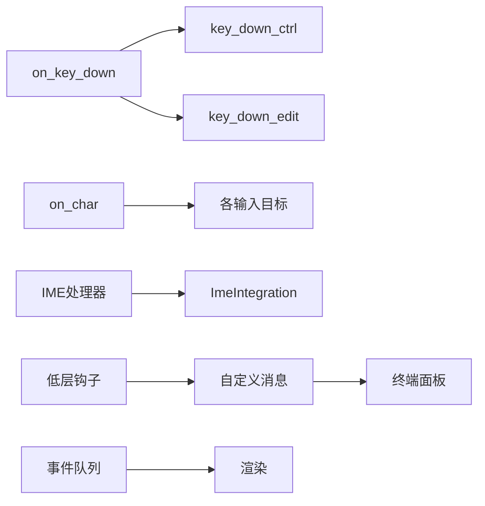

# 键盘事件处理

<cite>
**本文引用的文件**
- [keyboard_handler.rs](file://crates/aether-win32/src/window/keyboard_handler.rs)
- [key_down.rs](file://crates/aether-win32/src/window/keyboard_handler/key_down.rs)
- [char_input.rs](file://crates/aether-win32/src/window/keyboard_handler/char_input.rs)
- [key_down_ctrl.rs](file://crates/aether-win32/src/window/keyboard_handler/key_down_ctrl.rs)
- [key_down_edit.rs](file://crates/aether-win32/src/window/keyboard_handler/key_down_edit.rs)
- [ime_handler.rs](file://crates/aether-win32/src/window/ime_handler.rs)
- [ime.rs](file://crates/aether-win32/src/ime.rs)
- [keyboard_hook.rs](file://crates/aether-win32/src/keyboard_hook.rs)
- [events.rs](file://crates/aether-editor/src/events.rs)
</cite>

## 目录
1. [简介](#简介)
2. [项目结构](#项目结构)
3. [核心组件](#核心组件)
4. [架构总览](#架构总览)
5. [详细组件分析](#详细组件分析)
6. [依赖关系分析](#依赖关系分析)
7. [性能考虑](#性能考虑)
8. [故障排查指南](#故障排查指南)
9. [结论](#结论)
10. [附录](#附录)

## 简介
本文件系统性文档化编辑器中的键盘事件处理系统，覆盖按键捕获、字符输入、快捷键绑定与分发、编辑模式下的光标与选择行为、IME（输入法）集成与候选窗口管理，以及终端场景下的特殊路由。同时给出性能优化策略（事件合并、批量处理、防抖）和常见问题排查方法。

## 项目结构
键盘事件处理位于 Windows 平台模块中，按消息类型与职责拆分：
- WM_KEYDOWN 入口与调度：key_down.rs
- Ctrl+ 快捷键分组：key_down_ctrl.rs
- 非 Ctrl 编辑器按键：key_down_edit.rs
- WM_CHAR 字符输入分发：char_input.rs
- IME 合成/提交/取消：ime_handler.rs + ime.rs
- 低层键盘钩子（绕过 IME 拦截）：keyboard_hook.rs
- 事件队列与合并：events.rs

**图示来源**
- [keyboard_handler.rs:1-12](file://crates/aether-win32/src/window/keyboard_handler.rs#L1-L12)
- [key_down.rs:17-182](file://crates/aether-win32/src/window/keyboard_handler/key_down.rs#L17-L182)
- [char_input.rs:10-104](file://crates/aether-win32/src/window/keyboard_handler/char_input.rs#L10-L104)
- [ime_handler.rs:9-132](file://crates/aether-win32/src/window/ime_handler.rs#L9-L132)
- [keyboard_hook.rs:151-246](file://crates/aether-win32/src/keyboard_hook.rs#L151-L246)
- [events.rs:76-118](file://crates/aether-editor/src/events.rs#L76-L118)

**章节来源**
- [keyboard_handler.rs:1-12](file://crates/aether-win32/src/window/keyboard_handler.rs#L1-L12)

## 核心组件
- 键盘调度器（on_key_down）：提取 vk、ctrl、shift，优先处理 IME 合成期、浏览器地址栏、搜索面板、上下文菜单等 UI 状态，再分流到 Ctrl+ 或编辑器按键。
- 字符输入分发（on_char）：处理 UTF-16 代理对，按优先级将字符路由到各输入目标（设置面板、SSH 对话框、命令面板、查找替换、终端、AI 面板、编辑器默认）。
- 快捷键系统（Ctrl+ 组）：文件操作、视图切换、缩放、剪贴板、查找/撤销、标签页导航、词级移动、行注释等。
- 编辑器按键（非 Ctrl）：回车、退格、删除、方向键、Home/End/PageUp/Down、Tab；终端聚焦时直接转 ANSI 序列。
- IME 集成：合成串显示、结果串提交、候选窗口定位、DPI 缩放、打开/关闭 IME、解除关联以旁路 IME。
- 低层键盘钩子：在 IME 之前拦截 Backspace/Delete/方向键并投递自定义消息至主线程，确保终端可正常删除。
- 事件队列：合并同类重绘事件，避免重复刷新。

**章节来源**
- [key_down.rs:17-182](file://crates/aether-win32/src/window/keyboard_handler/key_down.rs#L17-L182)
- [char_input.rs:10-104](file://crates/aether-win32/src/window/keyboard_handler/char_input.rs#L10-L104)
- [key_down_ctrl.rs:14-800](file://crates/aether-win32/src/window/keyboard_handler/key_down_ctrl.rs#L14-L800)
- [key_down_edit.rs:14-791](file://crates/aether-win32/src/window/keyboard_handler/key_down_edit.rs#L14-L791)
- [ime_handler.rs:9-132](file://crates/aether-win32/src/window/ime_handler.rs#L9-L132)
- [ime.rs:25-243](file://crates/aether-win32/src/ime.rs#L25-L243)
- [keyboard_hook.rs:151-315](file://crates/aether-win32/src/keyboard_hook.rs#L151-L315)
- [events.rs:76-118](file://crates/aether-editor/src/events.rs#L76-L118)

## 架构总览
下图展示从系统消息到应用逻辑的完整链路，包括 IME 合成期的特殊路径与终端旁路机制。

**图示来源**
- [keyboard_hook.rs:151-246](file://crates/aether-win32/src/keyboard_hook.rs#L151-L246)
- [key_down.rs:17-182](file://crates/aether-win32/src/window/keyboard_handler/key_down.rs#L17-L182)
- [char_input.rs:10-104](file://crates/aether-win32/src/window/keyboard_handler/char_input.rs#L10-L104)
- [ime_handler.rs:21-93](file://crates/aether-win32/src/window/ime_handler.rs#L21-L93)
- [events.rs:76-118](file://crates/aether-editor/src/events.rs#L76-L118)

## 详细组件分析

### WM_KEYDOWN 调度与分发
- 进入 on_key_down 后同步当前窗口状态，读取虚拟键码与修饰键状态。
- IME 合成期间直接交给默认窗口过程，避免阻断 IMM32 对 Backspace/字母/方向键的处理。
- 依次尝试 UI 特定区域（浏览器地址栏、空搜索框、文件树输入、各类上下文菜单、搜索面板、欢迎页、补全弹窗、设置字段、沙盒字段、SSH/克隆对话框、命令面板）。
- Ctrl+ 分支：若文件树输入激活则吞掉所有 Ctrl 快捷键；否则调用 Ctrl+ 快捷键分发。
- Alt+Left/Right 返回/前进占位实现。
- 文件树选中节点支持 F2 重命名、Delete 删除。
- 最后调用编辑器按键分发（方向键、Home/End、PageUp/Down、Tab、回车、退格、删除等）。

**图示来源**
- [key_down.rs:17-182](file://crates/aether-win32/src/window/keyboard_handler/key_down.rs#L17-L182)

**章节来源**
- [key_down.rs:17-182](file://crates/aether-win32/src/window/keyboard_handler/key_down.rs#L17-L182)

### WM_CHAR 字符输入分发
- 处理 UTF-16 代理对：高代理暂存，低代理组合为完整码点；孤立低代理丢弃。
- IME 合成期间跳过原始字符分发，避免重复插入。
- 按优先级路由：浏览器地址栏、空搜索框、文件树输入、设置面板、沙盒字段、搜索面板、SSH/克隆对话框、新建项目、SSH 管理器、命令面板、查找替换、终端、历史浮窗、AI 面板、编辑器默认。
- 编辑器默认在多光标模式下广播插入字符。

**图示来源**
- [char_input.rs:10-104](file://crates/aether-win32/src/window/keyboard_handler/char_input.rs#L10-L104)

**章节来源**
- [char_input.rs:10-104](file://crates/aether-win32/src/window/keyboard_handler/char_input.rs#L10-L104)

### 快捷键绑定系统（Ctrl+）
- 文件操作：Ctrl+O/K/S/N（打开文件/文件夹、保存/另存为、新建项目）。
- 视图与面板：Ctrl+B（侧栏）、Ctrl+P（命令面板）、Ctrl+Shift+P（命令面板带“>”前缀）、Ctrl+`/J（终端面板切换）、Ctrl+,（设置）、Ctrl+Shift+E（资源管理器视图）、Ctrl+Shift+V（Markdown 预览切换）。
- 缩放：Ctrl+=/-/0（字体/图片缩放与重置）。
- 剪贴板：Ctrl+C/X/V/A（复制/剪切/粘贴/全选；终端聚焦时 Ctrl+C 中断进程）。
- 查找/撤销：Ctrl+F/H（查找/替换）、Ctrl+Z/Y（撤销/重做，含最近删除恢复）。
- 标签页：Ctrl+Tab/W/F4/T（切换/关闭/恢复）。
- 词级移动：Ctrl+Left/Right（含 Shift 选择）。
- 文件首末/多光标/注释：Ctrl+Home/End/D/OEM_2（添加下一个相同单词光标、切换行注释）。

**图示来源**
- [key_down_ctrl.rs:14-800](file://crates/aether-win32/src/window/keyboard_handler/key_down_ctrl.rs#L14-L800)

**章节来源**
- [key_down_ctrl.rs:14-800](file://crates/aether-win32/src/window/keyboard_handler/key_down_ctrl.rs#L14-L800)

### 编辑器按键行为（非 Ctrl）
- 终端聚焦时：将编辑键转换为 ANSI 序列发送到 ConPTY（Enter/Backspace/Delete/Tab/方向键/Home/End），并仅标脏底部面板区域以减少重绘。
- 历史浮窗：编辑态/搜索态优先拦截编辑键（回车提交/Esc退出/Backspace/左右/Home/End）。
- 编辑器内：回车（删除选中文本并换行）、退格（删除选中文本或多光标退格）、删除（向前删除）、方向键（移动/选择）、Home/End（Smart Home/行末）、PageUp/Down（翻页）、Tab（接受内联补全或插入制表符）。

**图示来源**
- [key_down_edit.rs:14-791](file://crates/aether-win32/src/window/keyboard_handler/key_down_edit.rs#L14-L791)

**章节来源**
- [key_down_edit.rs:14-791](file://crates/aether-win32/src/window/keyboard_handler/key_down_edit.rs#L14-L791)

### IME（输入法）集成
- 合成开始/合成中/合成结束：更新合成串显示、提交结果串、清除合成状态。
- 结果串优先：先提交文本，再清空合成串；提前重置合成标志以避免“提交汉字后无法立即删除”。
- 候选窗口与合成窗口：根据光标位置与 DPI 缩放设置候选窗口尺寸与位置，确保高 DPI 可读。
- 打开/关闭 IME：终端聚焦时关闭 IME 让 Backspace 直达终端；中文提交后关闭 IME 以便立即删除；用户可按 Ctrl+Shift 或输入法自身切换重新打开。
- 解除关联：彻底旁路 IME，避免系统级拦截导致终端无法删除。

**图示来源**
- [ime_handler.rs:9-132](file://crates/aether-win32/src/window/ime_handler.rs#L9-L132)
- [ime.rs:63-146](file://crates/aether-win32/src/ime.rs#L63-L146)

**章节来源**
- [ime_handler.rs:9-132](file://crates/aether-win32/src/window/ime_handler.rs#L9-L132)
- [ime.rs:25-243](file://crates/aether-win32/src/ime.rs#L25-L243)

### 低层键盘钩子与终端旁路
- 安装全局 WH_KEYBOARD_LL 钩子，在所有 IME 钩子链之前看到按键。
- 仅在前台窗口为本窗口、终端聚焦且未处于 IME 合成期时，拦截 Backspace/Delete/方向键。
- 抑制原事件并通过 PostMessageW 投递自定义消息（WM_TERMINAL_BACKSPACE/DELETE/ARROW）到主窗口。
- 主窗口处理器向 ConPTY 发送对应字节序列（\x7f、\x1b[3~、\x1b[A/B/C/D）。

**图示来源**
- [keyboard_hook.rs:151-315](file://crates/aether-win32/src/keyboard_hook.rs#L151-L315)

**章节来源**
- [keyboard_hook.rs:151-315](file://crates/aether-win32/src/keyboard_hook.rs#L151-L315)

## 依赖关系分析
- 键盘调度器依赖编辑器状态（EDITOR_STATE）与各 UI 模块（搜索面板、命令面板、SSH 对话框等）。
- 字符输入分发依赖 UTF-16 代理对处理与 IME 合成状态。
- IME 处理器依赖 ImeIntegration API 进行候选/合成窗口定位与字符串读取。
- 低层钩子通过原子标志（TERMINAL_FOCUSED_FLAG、IME_COMPOSING_FLAG）与主线程通信。
- 事件队列用于合并重绘事件，减少渲染压力。

**图示来源**
- [key_down.rs:17-182](file://crates/aether-win32/src/window/keyboard_handler/key_down.rs#L17-L182)
- [char_input.rs:10-104](file://crates/aether-win32/src/window/keyboard_handler/char_input.rs#L10-L104)
- [ime_handler.rs:9-132](file://crates/aether-win32/src/window/ime_handler.rs#L9-L132)
- [keyboard_hook.rs:151-315](file://crates/aether-win32/src/keyboard_hook.rs#L151-L315)
- [events.rs:76-118](file://crates/aether-editor/src/events.rs#L76-L118)

**章节来源**
- [key_down.rs:17-182](file://crates/aether-win32/src/window/keyboard_handler/key_down.rs#L17-L182)
- [char_input.rs:10-104](file://crates/aether-win32/src/window/keyboard_handler/char_input.rs#L10-L104)
- [ime_handler.rs:9-132](file://crates/aether-win32/src/window/ime_handler.rs#L9-L132)
- [keyboard_hook.rs:151-315](file://crates/aether-win32/src/keyboard_hook.rs#L151-L315)
- [events.rs:76-118](file://crates/aether-editor/src/events.rs#L76-L118)

## 性能考虑
- 事件合并：事件队列自动合并同类重绘事件，忽略已被全窗口事件覆盖的局部事件，减少无效刷新。
- 局部标脏：终端按键与字符输入仅标脏相应区域（底部面板、侧边栏等），避免全窗口重绘。
- 定时器控制：终端面板打开时启动周期刷新定时器以显示异步输出，关闭时停止定时器，降低空闲开销。
- IME 合成期短路：IME 合成期间直接交由 IMM32 处理，避免重复分发与额外计算。
- 低层钩子过滤：仅在必要条件下拦截按键，其余情况直接放行，降低钩子处理成本。

**章节来源**
- [events.rs:76-118](file://crates/aether-editor/src/events.rs#L76-L118)
- [key_down_edit.rs:156-171](file://crates/aether-win32/src/window/keyboard_handler/key_down_edit.rs#L156-L171)
- [key_down_ctrl.rs:186-209](file://crates/aether-win32/src/window/keyboard_handler/key_down_ctrl.rs#L186-L209)
- [key_down.rs:25-36](file://crates/aether-win32/src/window/keyboard_handler/key_down.rs#L25-L36)
- [keyboard_hook.rs:196-207](file://crates/aether-win32/src/keyboard_hook.rs#L196-L207)

## 故障排查指南
- 中文输入后无法删除：确认 IME 合成结束后已重置合成标志，并在终端聚焦时关闭 IME；检查低层钩子是否正确拦截 Backspace 并投递自定义消息。
- 字符重复插入：确保 WM_IME_CHAR 被阻止产生 WM_CHAR，提交文本已通过 GCS_RESULTSTR 处理。
- 终端方向键无效：验证低层钩子是否拦截方向键并发送 ANSI 序列；检查终端是否运行且聚焦。
- 快捷键误响应：确认文件树输入激活时 Ctrl+ 快捷键被吞掉；检查各 UI 区域的焦点状态。
- 候选窗口错位：检查 DPI 缩放因子与光标坐标转换；确认 update_ime_position 在光标移动时被调用。

**章节来源**
- [ime_handler.rs:34-93](file://crates/aether-win32/src/window/ime_handler.rs#L34-L93)
- [keyboard_hook.rs:227-241](file://crates/aether-win32/src/keyboard_hook.rs#L227-L241)
- [key_down.rs:94-105](file://crates/aether-win32/src/window/keyboard_handler/key_down.rs#L94-L105)
- [ime.rs:127-134](file://crates/aether-win32/src/ime.rs#L127-L134)

## 结论
本系统通过分层调度与模块化设计，实现了健壮的键盘事件处理：WM_KEYDOWN 负责按键分发与快捷键绑定，WM_CHAR 负责字符输入与多目标路由，IME 集成确保 CJK 输入体验，低层钩子解决终端删除问题，事件队列提升渲染效率。整体架构清晰、可扩展性强，便于后续新增快捷键与输入目标。

## 附录
- 常用快捷键速查（部分）：
  - 文件：Ctrl+O/K/S/N
  - 视图：Ctrl+B/J/`,`、Ctrl+P、Ctrl+Shift+P、Ctrl+Shift+E、Ctrl+Shift+V
  - 缩放：Ctrl+=/-/0
  - 剪贴板：Ctrl+C/X/V/A
  - 查找/撤销：Ctrl+F/H、Ctrl+Z/Y
  - 标签页：Ctrl+Tab/W/F4/T
  - 词级移动：Ctrl+Left/Right
  - 注释/多光标：Ctrl+D、Ctrl+/
- 调试建议：
  - 启用日志：RUST_LOG=hook=debug 查看钩子拦截详情。
  - 观察事件队列：检查是否有大量局部重绘事件未被合并。
  - 验证 IME 状态：在合成期与提交后分别检查合成标志与 IME 开关状态。