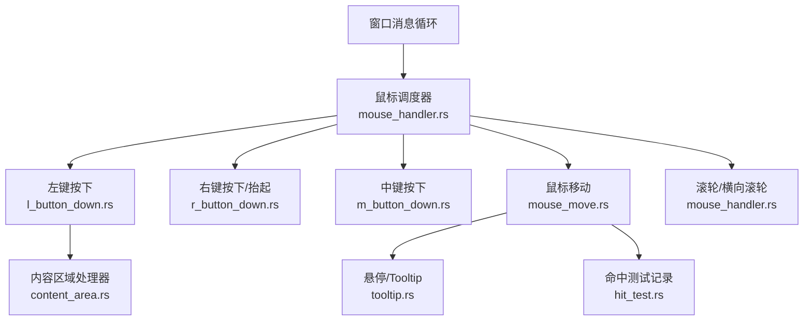
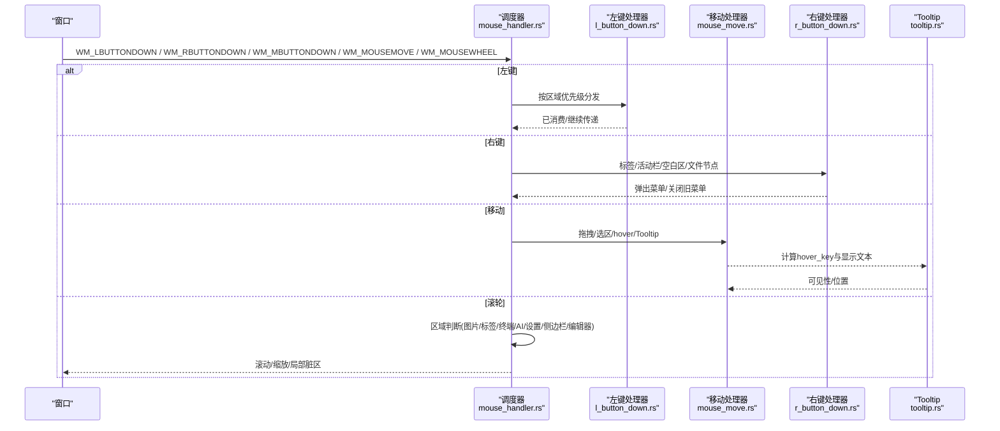
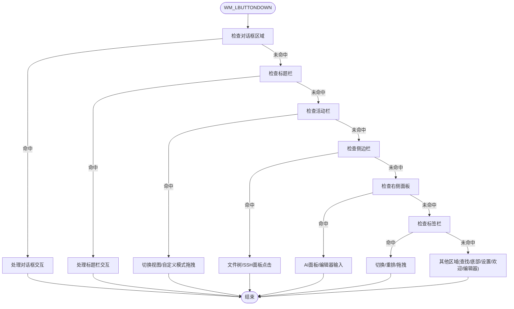
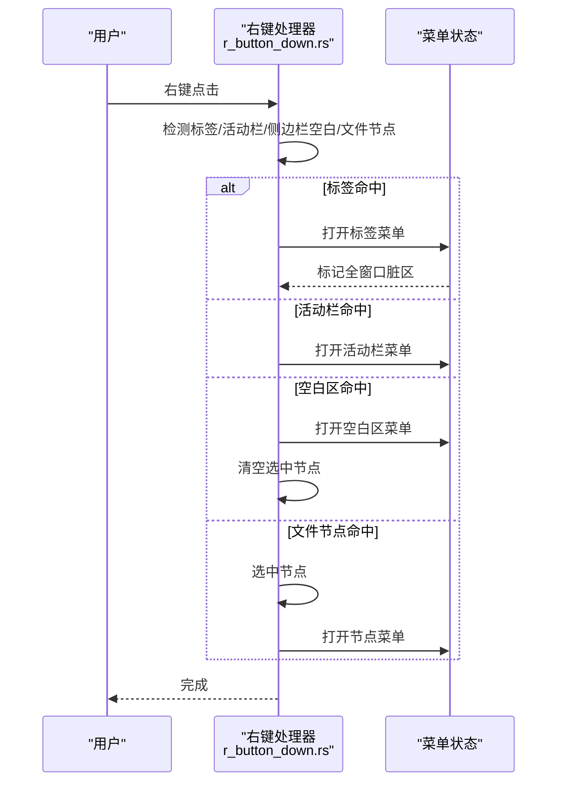
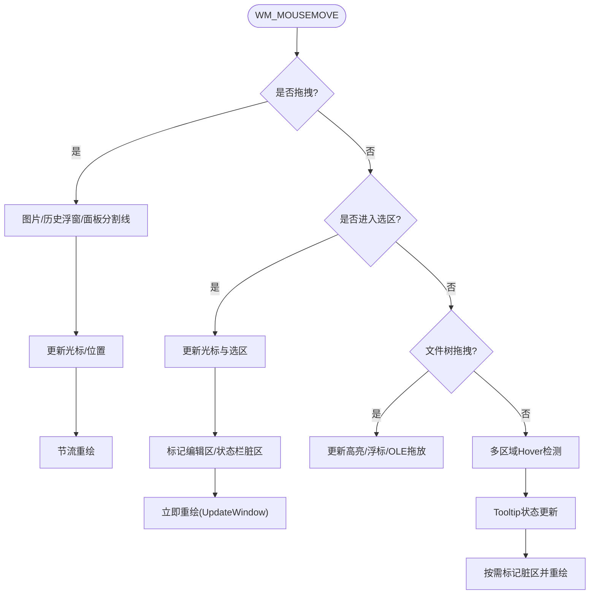
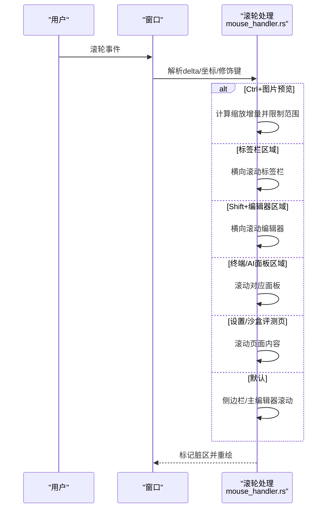
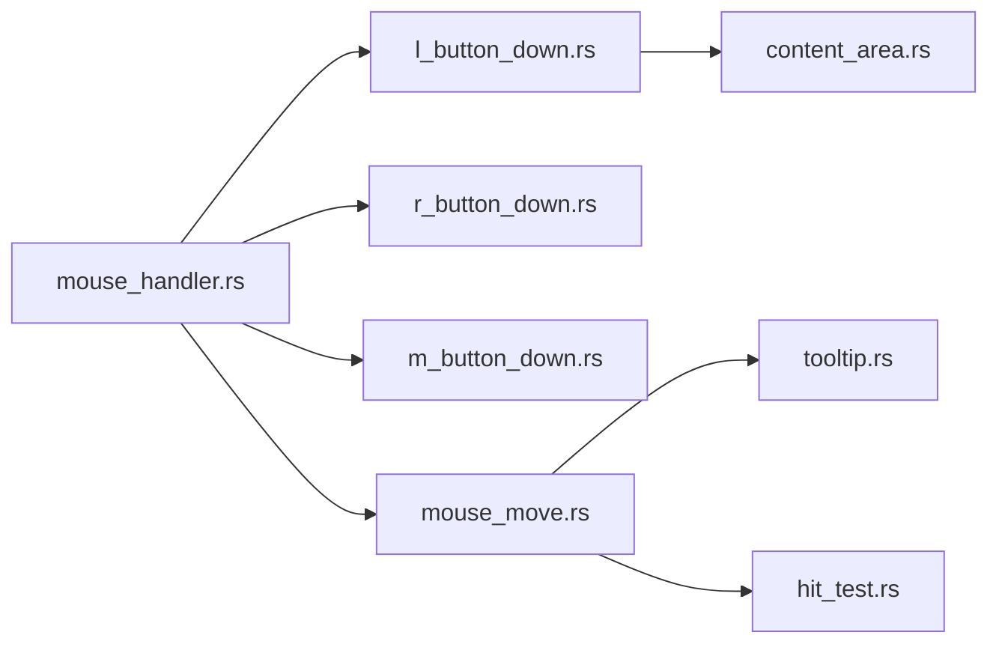

# 鼠标事件处理

<cite>
**本文引用的文件**
- [mouse_handler.rs](file://crates/aether-win32/src/window/mouse_handler.rs)
- [l_button_down.rs](file://crates/aether-win32/src/window/mouse_handler/l_button_down.rs)
- [content_area.rs](file://crates/aether-win32/src/window/mouse_handler/l_button_down/content_area.rs)
- [r_button_down.rs](file://crates/aether-win32/src/window/mouse_handler/r_button_down.rs)
- [m_button_down.rs](file://crates/aether-win32/src/window/mouse_handler/m_button_down.rs)
- [mouse_move.rs](file://crates/aether-win32/src/window/mouse_handler/mouse_move.rs)
- [tooltip.rs](file://crates/aether-win32/src/tooltip.rs)
- [hit_test.rs](file://crates/aether-win32/src/hit_test.rs)
</cite>

## 目录
1. [简介](#简介)
2. [项目结构](#项目结构)
3. [核心组件](#核心组件)
4. [架构总览](#架构总览)
5. [详细组件分析](#详细组件分析)
6. [依赖关系分析](#依赖关系分析)
7. [性能考量](#性能考量)
8. [故障排查指南](#故障排查指南)
9. [结论](#结论)
10. [附录](#附录)

## 简介
本文件系统化文档化“牧羊人编辑器”的鼠标事件处理机制，覆盖左键、右键、中键、滚轮与移动事件；深入说明文本编辑区的交互（光标定位、选择、拖拽、双击/三击）、上下文菜单触发逻辑、滚轮滚动与缩放、悬停提示与视觉反馈；并提供性能优化策略与常见问题解决方案。

## 项目结构
鼠标事件处理集中在 Windows 窗口层，采用“调度器 + 区域处理器”的分层组织：
- 顶层调度器：按优先级分发到各区域处理器（对话框、标题栏、活动栏、侧边栏、右侧面板、标签栏、查找面板、底部面板、设置页、欢迎页/编辑器等）。
- 子模块：分别实现左键按下、右键按下/抬起、中键按下、鼠标移动、滚轮等。
- 工具与辅助：悬停提示渲染、命中测试记录（调试构建）。

**图表来源**
- [mouse_handler.rs:1-16](file://crates/aether-win32/src/window/mouse_handler.rs#L1-L16)
- [l_button_down.rs:17-111](file://crates/aether-win32/src/window/mouse_handler/l_button_down.rs#L17-L111)
- [r_button_down.rs:15-235](file://crates/aether-win32/src/window/mouse_handler/r_button_down.rs#L15-L235)
- [m_button_down.rs:11-74](file://crates/aether-win32/src/window/mouse_handler/m_button_down.rs#L11-L74)
- [mouse_move.rs:39-323](file://crates/aether-win32/src/window/mouse_handler/mouse_move.rs#L39-L323)
- [tooltip.rs:1-226](file://crates/aether-win32/src/tooltip.rs#L1-L226)
- [hit_test.rs:1-244](file://crates/aether-win32/src/hit_test.rs#L1-L244)

**章节来源**
- [mouse_handler.rs:1-16](file://crates/aether-win32/src/window/mouse_handler.rs#L1-L16)
- [l_button_down.rs:17-111](file://crates/aether-win32/src/window/mouse_handler/l_button_down.rs#L17-L111)

## 核心组件
- 左键按下调度器：统一入口，按优先级尝试各区域处理器，返回已消费结果或继续传递。
- 右键菜单：标签、资源管理器空白区、活动栏、文件节点等右键弹出菜单，互斥显示与位置校正。
- 中键操作：关闭标签、图片预览拖拽平移。
- 鼠标移动：悬停检测、选区拖拽、面板拖拽调整、文件树拖拽、历史浮窗拖动、菜单 hover 更新、Tooltip 状态管理。
- 滚轮与横向滚轮：垂直/水平滚动、标签栏横向滚动、图片缩放、终端/AI 面板滚动、设置页与沙盒评测页滚动。
- Tooltip：延迟显示、移动容差、边界校正与绘制。
- 命中测试：调试构建下记录可点击区域，用于自动化测试。

**章节来源**
- [l_button_down.rs:17-111](file://crates/aether-win32/src/window/mouse_handler/l_button_down.rs#L17-L111)
- [r_button_down.rs:15-235](file://crates/aether-win32/src/window/mouse_handler/r_button_down.rs#L15-L235)
- [m_button_down.rs:11-74](file://crates/aether-win32/src/window/mouse_handler/m_button_down.rs#L11-L74)
- [mouse_move.rs:39-323](file://crates/aether-win32/src/window/mouse_handler/mouse_move.rs#L39-L323)
- [mouse_handler.rs:190-405](file://crates/aether-win32/src/window/mouse_handler.rs#L190-L405)
- [tooltip.rs:1-226](file://crates/aether-win32/src/tooltip.rs#L1-L226)
- [hit_test.rs:1-244](file://crates/aether-win32/src/hit_test.rs#L1-L244)

## 架构总览
鼠标事件从窗口消息进入调度器，经区域判定后交由具体处理器执行，必要时更新 UI 脏区并触发重绘。关键路径包括：
- 左键：对话框/标题栏/用户菜单/活动栏/侧边栏/右侧面板/标签栏/查找/底部/设置/欢迎/编辑器。
- 右键：标签/活动栏/资源管理器空白区/文件节点。
- 移动：高优先级拖拽（图片、历史浮窗、面板分割线）→ 文本选区 → 文件树拖拽 → 各区域 hover → Tooltip。
- 滚轮：图片缩放 → 标签栏横向滚动 → Shift+滚轮横向滚动 → 终端/AI 面板/设置/沙盒评测页滚动 → 侧边栏/主编辑器滚动。

**图表来源**
- [mouse_handler.rs:17-16](file://crates/aether-win32/src/window/mouse_handler.rs#L1-L16)
- [l_button_down.rs:17-111](file://crates/aether-win32/src/window/mouse_handler/l_button_down.rs#L17-L111)
- [r_button_down.rs:15-235](file://crates/aether-win32/src/window/mouse_handler/r_button_down.rs#L15-L235)
- [mouse_move.rs:39-323](file://crates/aether-win32/src/window/mouse_handler/mouse_move.rs#L39-L323)
- [tooltip.rs:26-168](file://crates/aether-win32/src/tooltip.rs#L26-L168)

## 详细组件分析

### 左键点击与内容区域交互
- 调度流程：在左键按下时，依次尝试对话框、标题栏、用户菜单、活动栏、侧边栏、右侧面板、标签栏、查找面板、底部面板、设置页、欢迎页/编辑器等区域处理器，首个返回 Some(LRESULT) 即视为已消费。
- 内容区域处理器：负责活动栏切换、面板边框拖拽（含拐角手柄）、侧边栏点击（含 SSH 管理面板按钮）、右侧面板（AI 面板或智能体模式下的编辑器）、标签栏点击等。
- 长按检测：为活动栏项设置定时器，超过阈值则区分点击与长按行为。

**图表来源**
- [l_button_down.rs:17-111](file://crates/aether-win32/src/window/mouse_handler/l_button_down.rs#L17-L111)
- [content_area.rs:19-244](file://crates/aether-win32/src/window/mouse_handler/l_button_down/content_area.rs#L19-L244)

**章节来源**
- [l_button_down.rs:17-111](file://crates/aether-win32/src/window/mouse_handler/l_button_down.rs#L17-L111)
- [content_area.rs:19-244](file://crates/aether-win32/src/window/mouse_handler/l_button_down/content_area.rs#L19-L244)

### 右键点击与上下文菜单
- 标签右键：命中标签栏某标签时，构建并打开标签上下文菜单，同时关闭其他菜单避免重叠。
- 活动栏右键：在活动栏区域内弹出活动栏上下文菜单。
- 资源管理器空白区：当侧边栏可见且处于文件树视图，且在空白区域（非新建按钮、非节点命中）右键时，弹出空白区菜单并清空选中节点。
- 文件节点右键：命中节点时选中节点并弹出节点级上下文菜单（文件夹额外提供新建入口）。
- 菜单互斥：打开新菜单前关闭已有菜单，确保不会重叠。

**图表来源**
- [r_button_down.rs:15-235](file://crates/aether-win32/src/window/mouse_handler/r_button_down.rs#L15-L235)

**章节来源**
- [r_button_down.rs:15-235](file://crates/aether-win32/src/window/mouse_handler/r_button_down.rs#L15-L235)

### 中键操作
- 标签关闭：在标签栏区域内按下中键，命中标签则调用关闭逻辑，复用 dirty 检查。
- 图片预览拖拽：在图片预览模式下，中键按下开始拖拽平移，移动事件中同步更新偏移量。

**章节来源**
- [m_button_down.rs:11-74](file://crates/aether-win32/src/window/mouse_handler/m_button_down.rs#L11-L74)
- [mouse_move.rs:64-81](file://crates/aether-win32/src/window/mouse_handler/mouse_move.rs#L64-L81)

### 鼠标移动与文本编辑交互
- 高优先级拖拽：图片预览拖拽、历史浮窗拖动、面板分割线/拐角调整，均跳过 hover 检测以提升性能。
- 文本选区：按下左键进入编辑区后，移动超过阈值启动选区；移动过程中更新光标与选区，仅对变更区域标记脏区并立即刷新。
- 文件树拖拽：按下候选节点后，超过阈值进入拖拽；移出侧边栏转系统 OLE 拖放；内部拖拽更新高亮与浮标，节流重绘。
- Hover 与 Tooltip：多区域 hover 检测（标题栏、活动栏、标签栏、文件树、设置页、AI 面板、欢迎页、状态栏），结合 Tooltip 延迟与移动容差，减少误触与闪烁。

**图表来源**
- [mouse_move.rs:39-323](file://crates/aether-win32/src/window/mouse_handler/mouse_move.rs#L39-L323)
- [tooltip.rs:26-168](file://crates/aether-win32/src/tooltip.rs#L26-L168)

**章节来源**
- [mouse_move.rs:39-323](file://crates/aether-win32/src/window/mouse_handler/mouse_move.rs#L39-L323)
- [tooltip.rs:26-168](file://crates/aether-win32/src/tooltip.rs#L26-L168)

### 双击/三击行为
- 双击选词：在编辑器内容区内双击时，根据鼠标坐标定位并选择当前单词，随后触发重绘。

**章节来源**
- [mouse_handler.rs:150-188](file://crates/aether-win32/src/window/mouse_handler.rs#L150-L188)

### 滚轮事件处理
- 图片缩放：Ctrl+滚轮在图片预览编辑器内缩放，限制缩放范围。
- 标签栏横向滚动：光标在标签栏区域时，进行平滑横向滚动，仅标记标签栏脏区。
- Shift+滚轮横向滚动：在编辑器区域内，Shift+滚轮实现横向查看。
- 终端/AI 面板滚动：光标在底部终端或右侧 AI 面板聊天区域时，滚动对应内容。
- 设置页/沙盒评测页滚动：在相应页面内滚动内容。
- 侧边栏/主编辑器滚动：默认回退到侧边栏或主编辑器滚动。

**图表来源**
- [mouse_handler.rs:190-405](file://crates/aether-win32/src/window/mouse_handler.rs#L190-L405)

**章节来源**
- [mouse_handler.rs:190-405](file://crates/aether-win32/src/window/mouse_handler.rs#L190-L405)

### 悬停效果与工具提示
- 悬停检测：标题栏按钮、活动栏项、标签栏、文件树、设置页、AI 面板、欢迎页、状态栏等区域均有 hover 状态更新。
- Tooltip 显示：基于 hover_key 与显示文本，延迟 500ms 显示，支持 4px 移动容差；绘制圆角半透明背景与文本，自动边界校正。
- 脏区优化：hover 变化仅标记相关区域，Tooltip 显示/隐藏需全窗口重绘。

**章节来源**
- [mouse_move.rs:232-323](file://crates/aether-win32/src/window/mouse_handler/mouse_move.rs#L232-L323)
- [tooltip.rs:26-168](file://crates/aether-win32/src/tooltip.rs#L26-L168)

## 依赖关系分析
- 调度器依赖各区域处理器，形成“单一入口、多分支处理”的结构，降低耦合度。
- 移动处理器依赖布局管理器与脏区追踪，确保只重绘必要区域。
- Tooltip 与 hover 状态解耦，通过 compute_tooltip_hover_key 生成 key 与文本，渲染阶段独立处理。
- 命中测试仅在调试构建启用，release 构建空实现零开销。

**图表来源**
- [mouse_handler.rs:1-16](file://crates/aether-win32/src/window/mouse_handler.rs#L1-L16)
- [l_button_down.rs:17-111](file://crates/aether-win32/src/window/mouse_handler/l_button_down.rs#L17-L111)
- [r_button_down.rs:15-235](file://crates/aether-win32/src/window/mouse_handler/r_button_down.rs#L15-L235)
- [m_button_down.rs:11-74](file://crates/aether-win32/src/window/mouse_handler/m_button_down.rs#L11-L74)
- [mouse_move.rs:39-323](file://crates/aether-win32/src/window/mouse_handler/mouse_move.rs#L39-L323)
- [tooltip.rs:1-226](file://crates/aether-win32/src/tooltip.rs#L1-L226)
- [hit_test.rs:1-244](file://crates/aether-win32/src/hit_test.rs#L1-L244)

**章节来源**
- [mouse_handler.rs:1-16](file://crates/aether-win32/src/window/mouse_handler.rs#L1-L16)
- [mouse_move.rs:39-323](file://crates/aether-win32/src/window/mouse_handler/mouse_move.rs#L39-L323)

## 性能考量
- 事件节流：面板拖拽重绘节流至约 120fps，避免高回报率鼠标导致管线压垮。
- 区域检测优先：拖拽期间跳过 hover 检测，减少逐帧命中开销。
- 局部脏区：仅标记变更区域（编辑区、状态栏、标签栏、侧边栏、AI 面板、标题栏、对话框），避免全窗口重绘。
- 立即重绘：在选区/菜单 hover 等热路径使用 UpdateWindow 绕过消息队列，防止 WM_PAINT 被饿死。
- 命中测试：调试构建下记录可点击区域，release 构建空实现零开销。

**章节来源**
- [mouse_move.rs:20-37](file://crates/aether-win32/src/window/mouse_handler/mouse_move.rs#L20-L37)
- [mouse_move.rs:143-183](file://crates/aether-win32/src/window/mouse_handler/mouse_move.rs#L143-L183)
- [mouse_move.rs:232-323](file://crates/aether-win32/src/window/mouse_handler/mouse_move.rs#L232-L323)
- [hit_test.rs:57-178](file://crates/aether-win32/src/hit_test.rs#L57-L178)

## 故障排查指南
- 右键菜单不显示：确认是否在目标区域（标签/活动栏/空白区/文件节点）；检查是否有其他菜单遮挡；确认互斥关闭逻辑生效。
- 文本选区不更新：检查是否进入编辑区并按下左键；确认移动超过阈值；查看是否因 hover 变化提前跳过了选区更新。
- 滚轮无效：确认光标所在区域；检查修饰键（Ctrl/Shift）；确认对应区域可见（如终端/AI 面板）。
- Tooltip 不显示：确认 hover_key 是否变化；检查延迟与移动容差；查看是否被对话框或菜单覆盖。
- 性能卡顿：观察是否频繁全窗口重绘；检查是否在高回报鼠标下未节流；确认脏区标记是否正确。

**章节来源**
- [r_button_down.rs:15-235](file://crates/aether-win32/src/window/mouse_handler/r_button_down.rs#L15-L235)
- [mouse_move.rs:126-183](file://crates/aether-win32/src/window/mouse_handler/mouse_move.rs#L126-L183)
- [mouse_handler.rs:190-405](file://crates/aether-win32/src/window/mouse_handler.rs#L190-L405)
- [tooltip.rs:26-168](file://crates/aether-win32/src/tooltip.rs#L26-L168)

## 结论
本系统通过清晰的调度器与区域处理器分工，实现了全面的鼠标事件处理；结合局部脏区、事件节流与立即重绘策略，在保证交互流畅性的同时兼顾性能。悬停提示与上下文菜单提供了良好的用户体验。建议在实际使用中关注区域检测准确性与脏区标记粒度，以进一步优化响应速度与稳定性。

## 附录
- 术语解释：
  - 调度器：接收原始鼠标消息并按优先级分发给具体处理器。
  - 脏区：需要重绘的区域，用于增量渲染。
  - 命中测试：判断鼠标是否落在某个交互区域。
- 最佳实践：
  - 优先处理高优先级拖拽，避免不必要的 hover 检测。
  - 使用局部脏区减少重绘开销。
  - 合理设置 Tooltip 延迟与容差，提升交互自然度。
  - 在热路径使用立即重绘，避免消息队列阻塞。