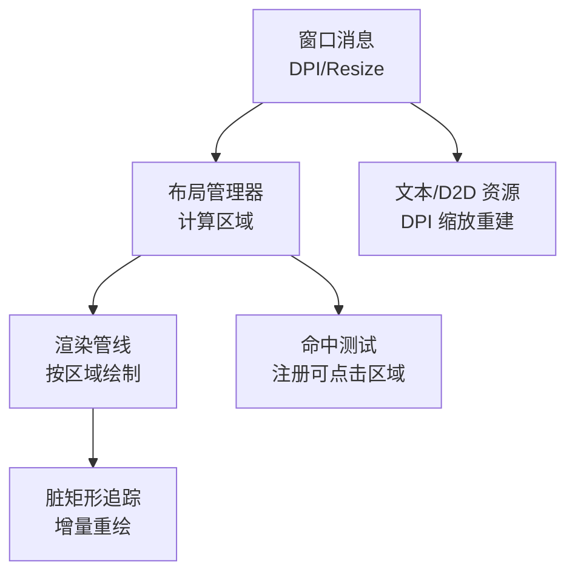
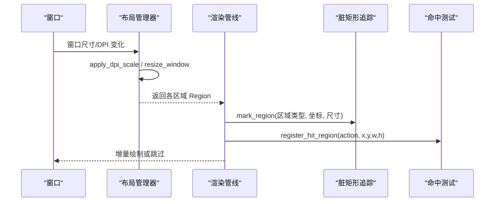
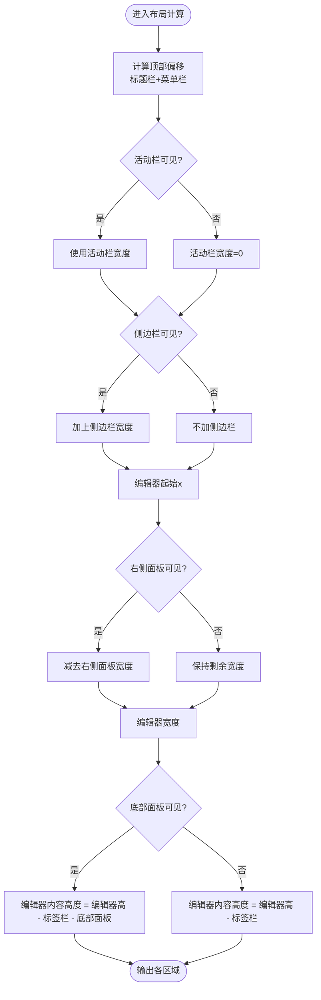
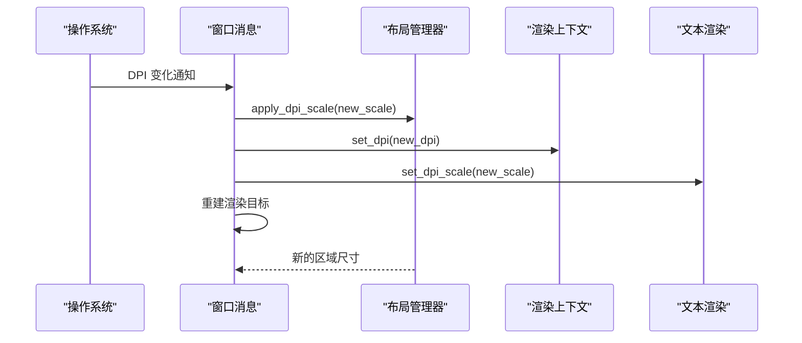
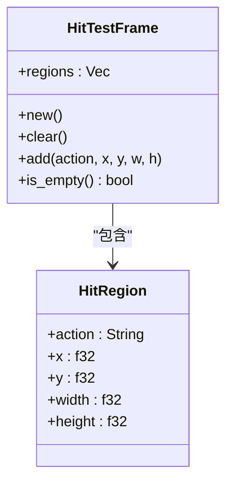
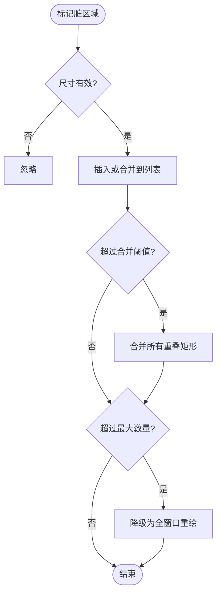
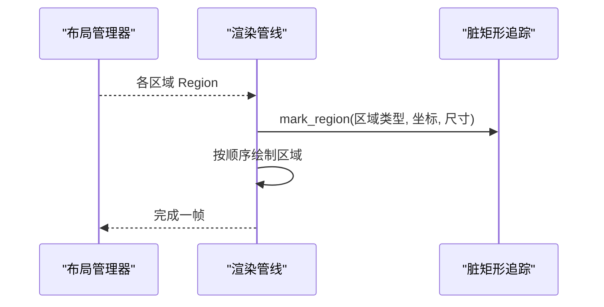
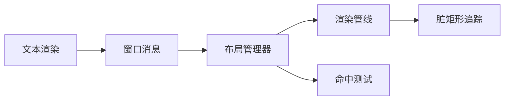

# 布局系统

<cite>
**本文引用的文件**
- [aether-ui/src/layout.rs](file://crates/aether-ui/src/layout.rs)
- [aether-win32/src/layout.rs](file://crates/aether-win32/src/layout.rs)
- [aether-render-win/src/layout.rs](file://crates/aether-render-win/src/layout.rs)
- [aether-ui/src/hit_test.rs](file://crates/aether-ui/src/hit_test.rs)
- [aether-win32/src/hit_test.rs](file://crates/aether-win32/src/hit_test.rs)
- [aether-win32/src/dirty_rect.rs](file://crates/aether-win32/src/dirty_rect.rs)
- [aether-editor/src/dirty_rect.rs](file://crates/aether-editor/src/dirty_rect.rs)
- [aether-win32/src/render/mod.rs](file://crates/aether-win32/src/render/mod.rs)
- [aether-win32/src/window/window_messages.rs](file://crates/aether-win32/src/window/window_messages.rs)
- [aether-render/src/d2d/text.rs](file://crates/aether-render/src/d2d/text.rs)
</cite>

## 目录
1. [简介](#简介)
2. [项目结构](#项目结构)
3. [核心组件](#核心组件)
4. [架构总览](#架构总览)
5. [详细组件分析](#详细组件分析)
6. [依赖关系分析](#依赖关系分析)
7. [性能考量](#性能考量)
8. [故障排除指南](#故障排除指南)
9. [结论](#结论)
10. [附录](#附录)

## 简介
本文件系统化说明编辑器布局系统的实现与使用，覆盖控件定位算法、尺寸计算、响应式布局（窗口大小变化与 DPI 缩放）、命中测试机制、性能优化（脏区域、增量布局、批量更新）、自定义扩展方式以及与渲染系统的集成。目标是帮助开发者理解并高效扩展布局子系统。

## 项目结构
布局系统由多模块协作完成：
- 布局管理器：负责窗口各区域的几何计算、可见性控制、动画与 DPI 缩放。
- 命中测试：记录每帧可点击区域，用于自动化与调试。
- 脏矩形追踪：标记需要重绘的区域，驱动增量渲染。
- 渲染管线：根据布局结果进行绘制，并在 DPI 变化时重建资源。

图表来源
- [aether-win32/src/window/window_messages.rs:848-878](file://crates/aether-win32/src/window/window_messages.rs#L848-L878)
- [aether-win32/src/layout.rs:308-358](file://crates/aether-win32/src/layout.rs#L308-L358)
- [aether-win32/src/render/mod.rs:728-894](file://crates/aether-win32/src/render/mod.rs#L728-L894)
- [aether-win32/src/dirty_rect.rs:102-162](file://crates/aether-win32/src/dirty_rect.rs#L102-L162)
- [aether-render/src/d2d/text.rs:70-100](file://crates/aether-render/src/d2d/text.rs#L70-L100)

章节来源
- [aether-win32/src/layout.rs:222-358](file://crates/aether-win32/src/layout.rs#L222-L358)
- [aether-win32/src/render/mod.rs:728-894](file://crates/aether-win32/src/render/mod.rs#L728-L894)
- [aether-win32/src/dirty_rect.rs:1-162](file://crates/aether-win32/src/dirty_rect.rs#L1-L162)
- [aether-win32/src/window/window_messages.rs:848-878](file://crates/aether-win32/src/window/window_messages.rs#L848-L878)
- [aether-render/src/d2d/text.rs:70-100](file://crates/aether-render/src/d2d/text.rs#L70-L100)

## 核心组件
- 布局管理器（LayoutManager）：维护窗口尺寸、各面板尺寸与可见性、动画状态、DPI 缩放因子；提供标题栏、菜单栏、活动栏、侧边栏、编辑器区、标签栏、右侧面板、底部面板、状态栏等区域计算 API。
- 命中测试（Hit Test）：在调试构建中收集每帧可点击区域，输出 JSONL 供外部工具使用；发布构建零开销。
- 脏矩形追踪（DirtyRectTracker）：合并重叠脏矩形、阈值降级为全窗口重绘，提供按区域类型的重绘判定与命令推断。
- 渲染集成：依据布局区域顺序绘制，结合脏矩形进行增量更新；DPI 变化时重建渲染目标与文本格式缓存。

章节来源
- [aether-win32/src/layout.rs:222-700](file://crates/aether-win32/src/layout.rs#L222-L700)
- [aether-ui/src/hit_test.rs:1-178](file://crates/aether-ui/src/hit_test.rs#L1-L178)
- [aether-win32/src/dirty_rect.rs:1-426](file://crates/aether-win32/src/dirty_rect.rs#L1-L426)
- [aether-win32/src/render/mod.rs:728-894](file://crates/aether-win32/src/render/mod.rs#L728-L894)

## 架构总览
布局系统以“布局管理器”为中心，向上承接窗口事件（尺寸、DPI），向下驱动渲染与命中测试，并通过脏矩形追踪实现增量更新。

图表来源
- [aether-win32/src/layout.rs:308-358](file://crates/aether-win32/src/layout.rs#L308-L358)
- [aether-win32/src/render/mod.rs:514-547](file://crates/aether-win32/src/render/mod.rs#L514-L547)
- [aether-ui/src/hit_test.rs:60-178](file://crates/aether-ui/src/hit_test.rs#L60-L178)
- [aether-win32/src/dirty_rect.rs:120-162](file://crates/aether-win32/src/dirty_rect.rs#L120-L162)

## 详细组件分析

### 布局管理器与区域计算
- 区域定义：统一的 Region(x, y, width, height)，提供 contains/right/bottom 等几何方法。
- 常量与约束：标题栏/菜单栏/活动栏/侧边栏/状态栏/标签栏高度宽度常量，以及最小/最大面板尺寸限制。
- 可见性与占位：活动栏在欢迎页固定常驻；侧边栏在欢迎页默认抑制显示但可手动调起。
- 区域计算：
  - 标题栏/菜单栏：基于可见性与高度。
  - 活动栏/侧边栏：考虑活动栏隐藏时的对齐修正。
  - 编辑器区：扣除活动栏、侧边栏与右侧面板宽度。
  - 标签栏/编辑器内容：扣除标签栏与底部面板高度。
  - 右侧面板/底部面板：从右/下边缘向内收缩。
  - 拐角手柄：仅在侧边栏与底部面板同时可见时存在。
- 交互调整：
  - 侧边栏拖拽：低于阈值不立即隐藏，松手后启动收起动画；拖回自动恢复可见。
  - 右侧面板/底部面板：增量调整并钳制到合理范围。
  - 切换可见性：带动画或即时切换。
- DPI 缩放：应用新 DPI 到所有布局常量与用户可调尺寸，避免丢失用户设置。

图表来源
- [aether-win32/src/layout.rs:374-497](file://crates/aether-win32/src/layout.rs#L374-L497)
- [aether-win32/src/layout.rs:580-699](file://crates/aether-win32/src/layout.rs#L580-L699)

章节来源
- [aether-win32/src/layout.rs:222-700](file://crates/aether-win32/src/layout.rs#L222-L700)
- [aether-ui/src/layout.rs:222-648](file://crates/aether-ui/src/layout.rs#L222-L648)
- [aether-render-win/src/layout.rs:222-648](file://crates/aether-render-win/src/layout.rs#L222-L648)

### 响应式布局与 DPI 缩放
- 窗口尺寸变化：通过 resize_window 更新宽高，后续区域计算自动生效。
- DPI 变化：
  - 窗口消息处理中调用 apply_dpi_scale，同步 UI 布局、IME、渲染目标与文本格式缓存。
  - 布局管理器按比例换算用户可调尺寸（侧边栏、右侧/底部面板），避免重置导致体验中断。
  - 文本渲染层重建 DirectWrite 格式与度量，确保字体与行高正确。

图表来源
- [aether-win32/src/window/window_messages.rs:848-878](file://crates/aether-win32/src/window/window_messages.rs#L848-L878)
- [aether-win32/src/layout.rs:339-358](file://crates/aether-win32/src/layout.rs#L339-L358)
- [aether-render/src/d2d/text.rs:70-100](file://crates/aether-render/src/d2d/text.rs#L70-L100)

章节来源
- [aether-win32/src/window/window_messages.rs:848-878](file://crates/aether-win32/src/window/window_messages.rs#L848-L878)
- [aether-win32/src/layout.rs:339-358](file://crates/aether-win32/src/layout.rs#L339-L358)
- [aether-render/src/d2d/text.rs:70-100](file://crates/aether-render/src/d2d/text.rs#L70-L100)

### 命中测试（Hit Test）机制
- 目的：记录当前帧所有可点击区域及其名称，便于自动化测试与调试。
- 行为：
  - 调试构建：线程安全地收集 HitRegion，支持清空与导出 JSONL。
  - 发布构建：空实现，零运行时开销。
- 使用建议：在渲染阶段为每个交互元素注册命中区域；在测试框架读取输出文件验证命中逻辑。

图表来源
- [aether-ui/src/hit_test.rs:12-55](file://crates/aether-ui/src/hit_test.rs#L12-L55)

章节来源
- [aether-ui/src/hit_test.rs:1-178](file://crates/aether-ui/src/hit_test.rs#L1-L178)
- [aether-win32/src/hit_test.rs:1-178](file://crates/aether-win32/src/hit_test.rs#L1-L178)

### 脏区域与增量布局
- 脏矩形类型：标题栏、菜单栏、活动栏、侧边栏、编辑器内容、标签栏、状态栏、右侧面板、底部面板、对话框、全窗口。
- 策略：
  - 合并相邻同类型脏矩形，减少绘制次数。
  - 超过阈值触发合并；过多则降级为全窗口重绘。
  - 无状态变化时返回“无需重绘”，避免无效渲染。
- 辅助 API：标记单行、光标、状态栏等便捷方法；按区域类型判断是否需要重绘。

图表来源
- [aether-win32/src/dirty_rect.rs:120-162](file://crates/aether-win32/src/dirty_rect.rs#L120-L162)
- [aether-editor/src/dirty_rect.rs:120-162](file://crates/aether-editor/src/dirty_rect.rs#L120-L162)

章节来源
- [aether-win32/src/dirty_rect.rs:1-426](file://crates/aether-win32/src/dirty_rect.rs#L1-L426)
- [aether-editor/src/dirty_rect.rs:1-426](file://crates/aether-editor/src/dirty_rect.rs#L1-L426)

### 与渲染系统的集成
- 渲染顺序：标题栏 → 菜单栏 → 活动栏 → 侧边栏 → 标签栏/编辑器内容 → 右侧面板 → 底部面板 → 状态栏。
- 增量渲染：根据脏矩形决定绘制范围；菜单悬停快速路径仅重绘菜单本体。
- 特殊场景：智能体模式左侧对话面板、设置页导航+内容、图片预览、Markdown 预览等均在编辑器内容区域内渲染。

图表来源
- [aether-win32/src/render/mod.rs:728-894](file://crates/aether-win32/src/render/mod.rs#L728-L894)
- [aether-win32/src/dirty_rect.rs:514-547](file://crates/aether-win32/src/dirty_rect.rs#L514-L547)

章节来源
- [aether-win32/src/render/mod.rs:728-894](file://crates/aether-win32/src/render/mod.rs#L728-L894)

## 依赖关系分析
- 布局管理器依赖：
  - 常量与枚举：标题栏/菜单栏/活动栏/侧边栏/状态栏/标签栏高度宽度、面板最小/最大尺寸。
  - 动画：侧边栏展开/收起的线性插值。
  - 欢迎页模式：活动栏固定常驻、侧边栏面板抑制。
- 渲染管线依赖：
  - 布局管理器提供的区域信息。
  - 脏矩形追踪器进行增量更新。
  - 文本渲染层在 DPI 变化时重建格式。
- 命中测试依赖：
  - 调试构建的全局帧记录与文件输出。

图表来源
- [aether-win32/src/layout.rs:222-700](file://crates/aether-win32/src/layout.rs#L222-L700)
- [aether-win32/src/render/mod.rs:728-894](file://crates/aether-win32/src/render/mod.rs#L728-L894)
- [aether-win32/src/window/window_messages.rs:848-878](file://crates/aether-win32/src/window/window_messages.rs#L848-L878)
- [aether-ui/src/hit_test.rs:1-178](file://crates/aether-ui/src/hit_test.rs#L1-L178)

章节来源
- [aether-win32/src/layout.rs:222-700](file://crates/aether-win32/src/layout.rs#L222-L700)
- [aether-win32/src/render/mod.rs:728-894](file://crates/aether-win32/src/render/mod.rs#L728-L894)
- [aether-win32/src/window/window_messages.rs:848-878](file://crates/aether-win32/src/window/window_messages.rs#L848-L878)
- [aether-ui/src/hit_test.rs:1-178](file://crates/aether-ui/src/hit_test.rs#L1-L178)

## 性能考量
- 增量渲染：通过脏矩形追踪合并重叠区域，避免全量重绘；无状态变化时直接跳过渲染。
- 阈值与降级：当脏矩形数量过多时触发合并或降级为全窗口重绘，保证稳定性。
- 命中测试零开销：发布构建移除 Mutex 与 I/O，避免影响性能。
- DPI 缩放优化：仅在 DPI 变化时重建必要资源，避免频繁重建导致的卡顿。
- 面板尺寸钳制：防止极端拖拽导致布局异常，提升鲁棒性。

[本节为通用性能讨论，不直接分析具体文件]

## 故障排除指南
- 布局错位：
  - 检查活动栏与侧边栏可见性组合是否正确；确认欢迎页模式下侧边栏是否被抑制。
  - 核对区域计算中的 x/y/width/height 是否受 DPI 缩放影响。
- 命中测试失效：
  - 确认在调试构建中已注册命中区域；检查区域尺寸是否为正数。
  - 查看导出的 JSONL 文件是否包含预期区域。
- 渲染闪烁或卡顿：
  - 检查脏矩形是否合理合并；过多小区域可能导致性能下降。
  - 菜单悬停快速路径是否生效；必要时调整脏区域类型。
- DPI 相关：
  - 确保窗口消息处理中调用 apply_dpi_scale 并重建渲染目标与文本格式缓存。
  - 验证文本行高与字符宽度在新 DPI 下正确测量。

章节来源
- [aether-win32/src/layout.rs:374-497](file://crates/aether-win32/src/layout.rs#L374-L497)
- [aether-ui/src/hit_test.rs:60-178](file://crates/aether-ui/src/hit_test.rs#L60-L178)
- [aether-win32/src/dirty_rect.rs:120-162](file://crates/aether-win32/src/dirty_rect.rs#L120-L162)
- [aether-win32/src/window/window_messages.rs:848-878](file://crates/aether-win32/src/window/window_messages.rs#L848-L878)
- [aether-render/src/d2d/text.rs:70-100](file://crates/aether-render/src/d2d/text.rs#L70-L100)

## 结论
该布局系统通过清晰的区域计算、完善的 DPI 缩放、高效的命中测试与脏矩形追踪，实现了稳定且高性能的界面布局。其模块化设计便于扩展与定制，适合复杂编辑器的多面板、多模式场景。建议在新增自定义控件时遵循现有区域计算与命中测试规范，并结合脏矩形进行增量渲染，以获得最佳性能与一致性。

[本节为总结，不直接分析具体文件]

## 附录
- 常用 API 参考：
  - 布局管理器：title_bar_region、menu_bar_region、activity_bar_region、sidebar_region、editor_region、tab_bar_region、editor_content_region、right_panel_region、bottom_panel_region、status_bar_region、top_offset、content_height、resize_*、toggle_*、apply_dpi_scale。
  - 命中测试：register_hit_region、clear_hit_regions、flush_hit_regions_to_file。
  - 脏矩形：mark_region、mark_editor_line、mark_cursor、merge_all_rects、infer_from_state。
- 扩展建议：
  - 新增面板：定义常量与最小/最大尺寸，实现区域计算与可见性切换。
  - 自定义命中：在渲染阶段注册命中区域，确保尺寸有效。
  - 增量渲染：在状态变化时标记对应脏区域，避免全量重绘。

[本节为补充信息，不直接分析具体文件]