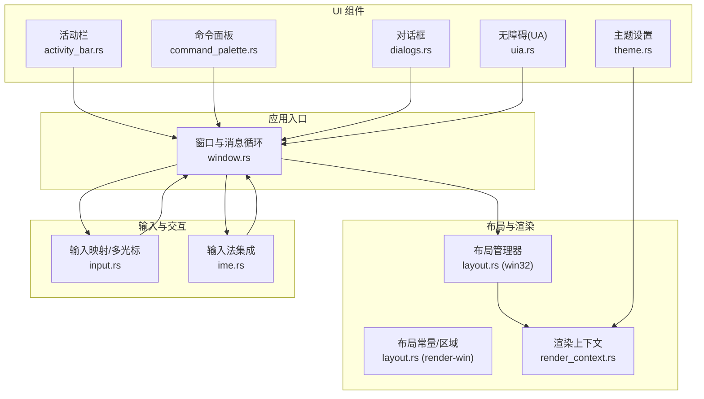
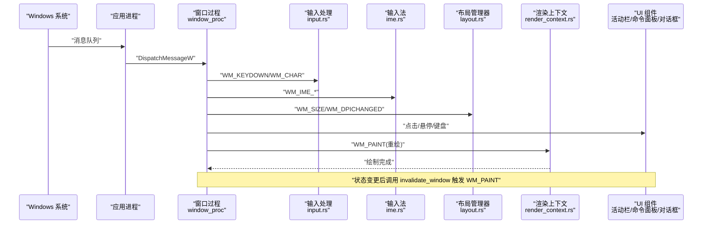
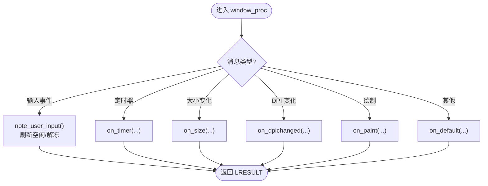
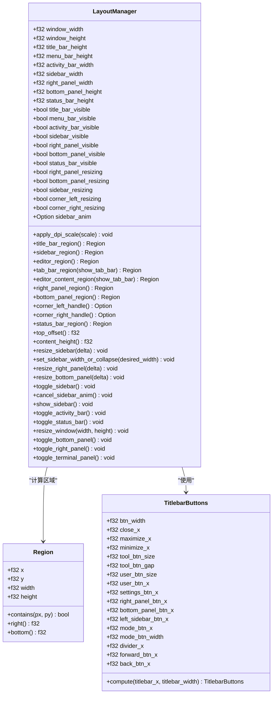
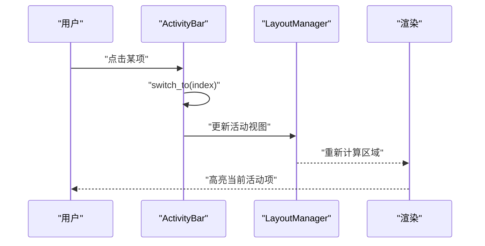
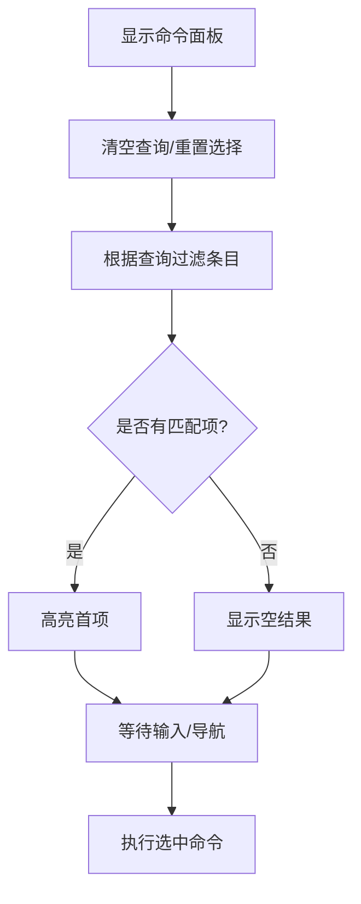
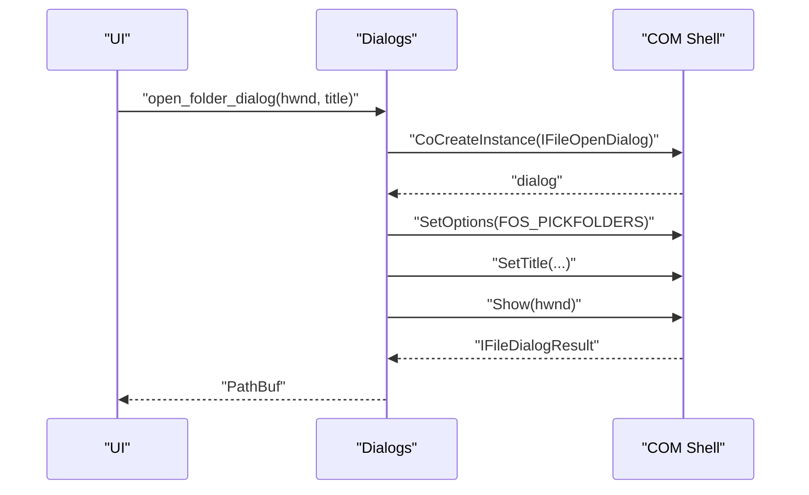
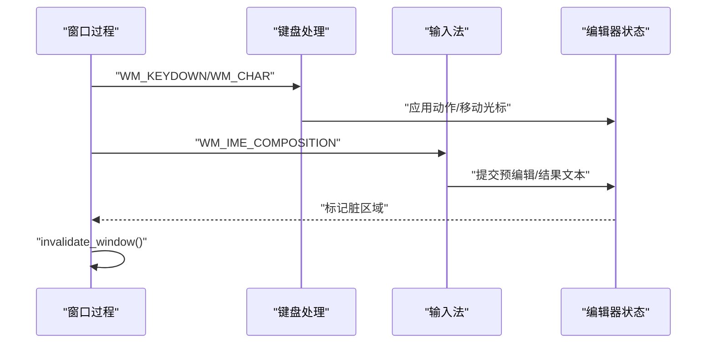
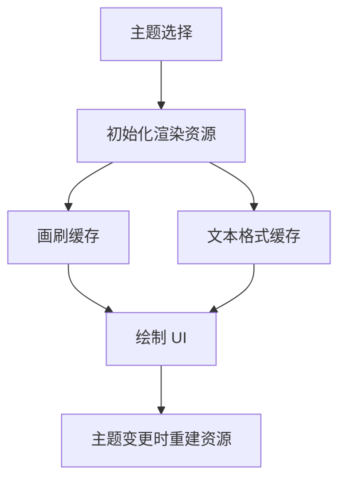
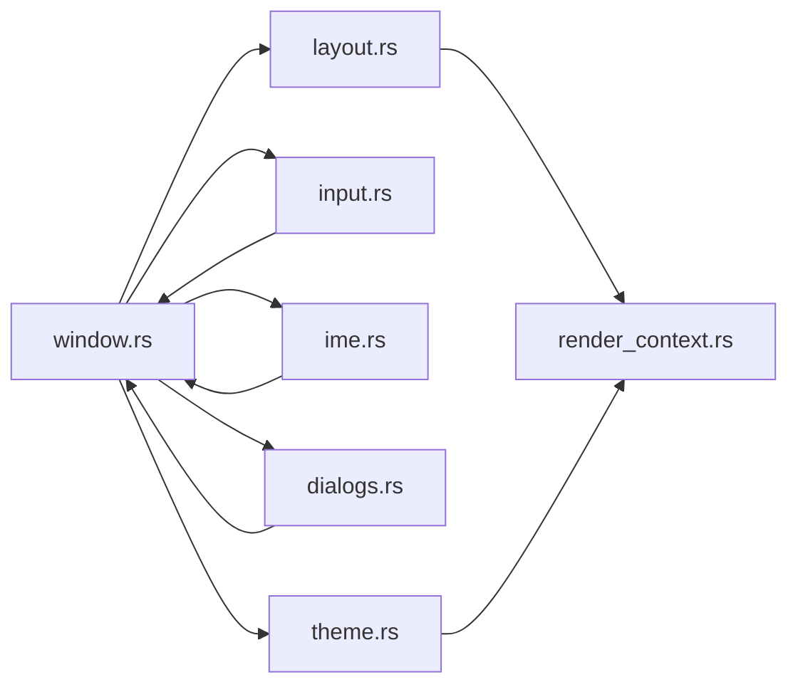

# 用户界面

<cite>
**本文引用的文件**
- [crates/aether-win32/src/window.rs](file://crates/aether-win32/src/window.rs)
- [crates/aether-win32/src/layout.rs](file://crates/aether-win32/src/layout.rs)
- [crates/aether-render-win/src/layout.rs](file://crates/aether-render-win/src/layout.rs)
- [crates/aether-render-win/src/render_context.rs](file://crates/aether-render-win/src/render_context.rs)
- [crates/aether-win32/src/input.rs](file://crates/aether-win32/src/input.rs)
- [crates/aether-win32/src/ime.rs](file://crates/aether-win32/src/ime.rs)
- [crates/aether-win32/src/activity_bar.rs](file://crates/aether-win32/src/activity_bar.rs)
- [crates/aether-win32/src/command_palette.rs](file://crates/aether-win32/src/command_palette.rs)
- [crates/aether-win32/src/dialogs.rs](file://crates/aether-win32/src/dialogs.rs)
- [crates/aether-win32/src/theme.rs](file://crates/aether-win32/src/theme.rs)
- [crates/aether-win32/src/uia.rs](file://crates/aether-win32/src/uia.rs)
</cite>

## 目录
1. [简介](#简介)
2. [项目结构](#项目结构)
3. [核心组件](#核心组件)
4. [架构总览](#架构总览)
5. [详细组件分析](#详细组件分析)
6. [依赖关系分析](#依赖关系分析)
7. [性能考量](#性能考量)
8. [故障排查指南](#故障排查指南)
9. [结论](#结论)
10. [附录](#附录)

## 简介
本文件面向 UI 开发者，系统化说明 Windows 原生窗口管理、消息循环与事件处理、布局系统（控件定位、尺寸计算、响应式）、自定义控件（活动栏、命令面板、对话框等）、输入事件（键盘、鼠标、输入法）以及主题系统与无障碍支持。文档以代码级为依据，提供架构图、时序图与流程图，并给出最佳实践与常见问题排查建议。

## 项目结构
本项目将 UI 相关能力分层组织：
- aether-win32：Windows 平台集成层，包含窗口创建、消息循环、输入处理、IME、UI 组件实现（活动栏、命令面板、对话框等）。
- aether-render-win：渲染层封装 Direct2D/DirectWrite，提供渲染上下文、布局常量与区域计算。
- aether-ui：跨平台 UI 组件抽象（部分与 win32 实现并列存在）。
- aether-editor：编辑器核心（文本编辑、光标、选择、查找替换、自动保存、事件系统等）。

图表来源
- [crates/aether-win32/src/window.rs:132-204](file://crates/aether-win32/src/window.rs#L132-L204)
- [crates/aether-win32/src/layout.rs:237-700](file://crates/aether-win32/src/layout.rs#L237-L700)
- [crates/aether-render-win/src/layout.rs:222-648](file://crates/aether-render-win/src/layout.rs#L222-L648)
- [crates/aether-render-win/src/render_context.rs:6-31](file://crates/aether-render-win/src/render_context.rs#L6-L31)
- [crates/aether-win32/src/input.rs:119-244](file://crates/aether-win32/src/input.rs#L119-L244)
- [crates/aether-win32/src/ime.rs:25-49](file://crates/aether-win32/src/ime.rs#L25-L49)
- [crates/aether-win32/src/activity_bar.rs:21-50](file://crates/aether-win32/src/activity_bar.rs#L21-L50)
- [crates/aether-win32/src/command_palette.rs:11-34](file://crates/aether-win32/src/command_palette.rs#L11-L34)
- [crates/aether-win32/src/dialogs.rs:41-98](file://crates/aether-win32/src/dialogs.rs#L41-L98)
- [crates/aether-win32/src/theme.rs:1-26](file://crates/aether-win32/src/theme.rs#L1-L26)
- [crates/aether-win32/src/uia.rs:5-24](file://crates/aether-win32/src/uia.rs#L5-L24)

章节来源
- [crates/aether-win32/src/lib.rs:4-57](file://crates/aether-win32/src/lib.rs#L4-L57)
- [crates/aether-ui/src/lib.rs:4-33](file://crates/aether-ui/src/lib.rs#L4-L33)

## 核心组件
- 窗口与消息循环：注册窗口类、创建主窗口、安装钩子、启动消息循环；WndProc 统一分发各类消息到具体处理器。
- 布局系统：LayoutManager 维护各区域几何与可见性，支持 DPI 缩放、侧边栏/右侧/底部面板的显示切换与拖拽调整，并提供拐角手柄同时调整两个维度。
- 渲染上下文：封装 Direct2D/HwndRenderTarget、画刷缓存、文本格式与布局缓存，支持设备丢失恢复与冰冻态资源释放。
- 输入系统：虚拟键到动作映射、多光标管理、ToUnicode 多键盘布局字符转换。
- 输入法：候选窗口与合成窗口位置跟随光标，DPI 缩放，终端聚焦时旁路 IME 避免按键被拦截。
- 自定义控件：活动栏（可排序、拖拽、持久化顺序）、命令面板（模糊搜索、导航执行）、对话框（文件/文件夹选择、信息/确认框）。
- 主题与样式：玻璃/深色主题切换，渲染前初始化常用画刷与文本格式。
- 无障碍：UI Automation 接口封装，预留文本与选区变更通知。

章节来源
- [crates/aether-win32/src/window.rs:355-447](file://crates/aether-win32/src/window.rs#L355-L447)
- [crates/aether-win32/src/layout.rs:237-700](file://crates/aether-win32/src/layout.rs#L237-L700)
- [crates/aether-render-win/src/render_context.rs:6-31](file://crates/aether-render-win/src/render_context.rs#L6-L31)
- [crates/aether-win32/src/input.rs:119-244](file://crates/aether-win32/src/input.rs#L119-L244)
- [crates/aether-win32/src/ime.rs:25-49](file://crates/aether-win32/src/ime.rs#L25-L49)
- [crates/aether-win32/src/activity_bar.rs:21-50](file://crates/aether-win32/src/activity_bar.rs#L21-L50)
- [crates/aether-win32/src/command_palette.rs:11-34](file://crates/aether-win32/src/command_palette.rs#L11-L34)
- [crates/aether-win32/src/dialogs.rs:41-98](file://crates/aether-win32/src/dialogs.rs#L41-L98)
- [crates/aether-win32/src/theme.rs:1-26](file://crates/aether-win32/src/theme.rs#L1-L26)
- [crates/aether-win32/src/uia.rs:5-24](file://crates/aether-win32/src/uia.rs#L5-L24)

## 架构总览
下图展示从消息循环到布局、渲染、输入与组件的整体数据流与控制流。

图表来源
- [crates/aether-win32/src/window.rs:195-204](file://crates/aether-win32/src/window.rs#L195-L204)
- [crates/aether-win32/src/window.rs:355-447](file://crates/aether-win32/src/window.rs#L355-L447)
- [crates/aether-win32/src/layout.rs:339-358](file://crates/aether-win32/src/layout.rs#L339-L358)
- [crates/aether-render-win/src/render_context.rs:65-79](file://crates/aether-render-win/src/render_context.rs#L65-L79)

## 详细组件分析

### 窗口管理与消息循环
- 窗口类注册与创建：设置 DPI 感知、加载图标、RegisterClassW、CreateWindowExW，启用 DWM 效果与拖放。
- 消息循环：GetMessageW + TranslateMessage + DispatchMessageW 驱动事件分发。
- 窗口过程：catch_unwind 包裹，按消息类型路由到具体处理器；对输入事件刷新空闲计时并处理“冰冻”解冻。
- 脏矩形重绘：通过 InvalidateRect 标记失效区域，由 WM_PAINT 统一渲染，避免重复绘制。

图表来源
- [crates/aether-win32/src/window.rs:355-447](file://crates/aether-win32/src/window.rs#L355-L447)

章节来源
- [crates/aether-win32/src/window.rs:132-204](file://crates/aether-win32/src/window.rs#L132-L204)
- [crates/aether-win32/src/window.rs:210-338](file://crates/aether-win32/src/window.rs#L210-L338)
- [crates/aether-win32/src/window.rs:355-447](file://crates/aether-win32/src/window.rs#L355-L447)

### 布局系统
- 区域模型：Region(x,y,width,height)，提供 contains/right/bottom 等方法。
- 布局常量：标题栏、菜单栏、活动栏、侧边栏、状态栏、标签栏高度/宽度，拐角手柄尺寸等。
- LayoutManager：维护窗口尺寸、各区域可见性与尺寸、动画状态；提供 apply_dpi_scale、toggle_sidebar/toggle_right_panel/toggle_bottom_panel、resize_* 等方法；支持欢迎页抑制侧边栏面板。
- 按钮布局：TitlebarButtons.compute 集中计算标题栏右侧按钮位置，消除多处硬编码不一致。

图表来源
- [crates/aether-win32/src/layout.rs:1-136](file://crates/aether-win32/src/layout.rs#L1-L136)
- [crates/aether-win32/src/layout.rs:144-216](file://crates/aether-win32/src/layout.rs#L144-L216)
- [crates/aether-win32/src/layout.rs:237-700](file://crates/aether-win32/src/layout.rs#L237-L700)

章节来源
- [crates/aether-win32/src/layout.rs:1-136](file://crates/aether-win32/src/layout.rs#L1-L136)
- [crates/aether-win32/src/layout.rs:144-216](file://crates/aether-win32/src/layout.rs#L144-L216)
- [crates/aether-win32/src/layout.rs:237-700](file://crates/aether-win32/src/layout.rs#L237-L700)
- [crates/aether-render-win/src/layout.rs:1-220](file://crates/aether-render-win/src/layout.rs#L1-L220)
- [crates/aether-render-win/src/layout.rs:222-648](file://crates/aether-render-win/src/layout.rs#L222-L648)

### 自定义控件

#### 活动栏
- 数据结构：ActivityItem(view, tooltip, is_active)、ActivityBar(items, active_index, hover_index, customize_mode, drag_index, drop_index)。
- 功能：切换活动视图、命中测试、图标区域计算、拖拽排序、持久化顺序应用。
- 与布局联动：使用 ACTIVITY_BAR_WIDTH/ACTION_BUTTON_SIZE 进行命中与渲染。

图表来源
- [crates/aether-win32/src/activity_bar.rs:21-50](file://crates/aether-win32/src/activity_bar.rs#L21-L50)
- [crates/aether-win32/src/activity_bar.rs:52-86](file://crates/aether-win32/src/activity_bar.rs#L52-L86)
- [crates/aether-win32/src/activity_bar.rs:98-185](file://crates/aether-win32/src/activity_bar.rs#L98-L185)

章节来源
- [crates/aether-win32/src/activity_bar.rs:1-256](file://crates/aether-win32/src/activity_bar.rs#L1-L256)

#### 命令面板
- 数据结构：CommandPaletteItem(label, description, shortcut, command_id, icon)、CommandPalette(visible, query, items, filtered_items, selected_index, max_visible_items)。
- 功能：构建命令列表、显示/隐藏、查询过滤、上下选择、获取选中命令。
- 与输入联动：Ctrl+Shift+P 打开，支持模糊匹配。

图表来源
- [crates/aether-win32/src/command_palette.rs:11-34](file://crates/aether-win32/src/command_palette.rs#L11-L34)
- [crates/aether-win32/src/command_palette.rs:241-341](file://crates/aether-win32/src/command_palette.rs#L241-L341)

章节来源
- [crates/aether-win32/src/command_palette.rs:1-442](file://crates/aether-win32/src/command_palette.rs#L1-L442)

#### 对话框
- 文件/文件夹选择：基于 COM IFileOpenDialog/IFileSaveDialog，记忆上次目录，设置默认起始路径。
- 信息/确认框：MessageBoxW 封装错误、信息、是/否确认。
- RAII 守卫：ComGuard 确保 CoInitializeEx/CoUninitialize 配对。

图表来源
- [crates/aether-win32/src/dialogs.rs:11-36](file://crates/aether-win32/src/dialogs.rs#L11-L36)
- [crates/aether-win32/src/dialogs.rs:41-98](file://crates/aether-win32/src/dialogs.rs#L41-L98)

章节来源
- [crates/aether-win32/src/dialogs.rs:1-414](file://crates/aether-win32/src/dialogs.rs#L1-L414)

### 输入事件处理机制
- 键盘：KeyMap 将虚拟键与修饰键组合映射为 EditorAction；支持 ToUnicode 多键盘布局字符转换；多光标管理器 MultiCursor 维护多个光标及选区。
- 鼠标：窗口过程分发 WM_LBUTTONDOWN/UP、WM_MOUSEMOVE/WHEEL 等至对应处理器（在 window.rs 中路由）。
- 输入法：ImeIntegration 负责候选/合成窗口位置跟随光标、DPI 缩放、读取合成串/结果串；终端聚焦时 detach_ime_context 旁路 IME，避免 Backspace/Delete 等被系统级拦截。

图表来源
- [crates/aether-win32/src/input.rs:119-244](file://crates/aether-win32/src/input.rs#L119-L244)
- [crates/aether-win32/src/ime.rs:63-134](file://crates/aether-win32/src/ime.rs#L63-L134)
- [crates/aether-win32/src/window.rs:355-447](file://crates/aether-win32/src/window.rs#L355-L447)

章节来源
- [crates/aether-win32/src/input.rs:1-355](file://crates/aether-win32/src/input.rs#L1-L355)
- [crates/aether-win32/src/ime.rs:1-255](file://crates/aether-win32/src/ime.rs#L1-L255)
- [crates/aether-win32/src/window.rs:355-447](file://crates/aether-win32/src/window.rs#L355-L447)

### 主题系统与样式定制
- 主题设置：UiSettings(glass_enabled) 控制玻璃效果开关；提供 glass_theme/dark_theme 两种主题。
- 渲染初始化：RenderContext::init_common_resources 预初始化常用画刷与文本格式，提升渲染性能。
- DPI 适配：布局与 IME 均按 dpi_scale 缩放，保证高 DPI 下可读性。

图表来源
- [crates/aether-win32/src/theme.rs:1-26](file://crates/aether-win32/src/theme.rs#L1-L26)
- [crates/aether-render-win/src/render_context.rs:189-217](file://crates/aether-render-win/src/render_context.rs#L189-L217)

章节来源
- [crates/aether-win32/src/theme.rs:1-26](file://crates/aether-win32/src/theme.rs#L1-L26)
- [crates/aether-render-win/src/render_context.rs:189-217](file://crates/aether-render-win/src/render_context.rs#L189-L217)

### 无障碍支持与国际化考虑
- 无障碍：UiaAccessibility 封装 UI Automation 接口，预留文本与选区变更通知；实际绑定需在窗口元素就绪后完成。
- 国际化：活动栏标签、命令面板描述等字符串本地化；输入法支持 CJK 语言；ToUnicode 适配多键盘布局。

章节来源
- [crates/aether-win32/src/uia.rs:1-63](file://crates/aether-win32/src/uia.rs#L1-L63)
- [crates/aether-win32/src/activity_bar.rs:33-96](file://crates/aether-win32/src/activity_bar.rs#L33-L96)
- [crates/aether-win32/src/command_palette.rs:36-239](file://crates/aether-win32/src/command_palette.rs#L36-L239)
- [crates/aether-win32/src/input.rs:246-288](file://crates/aether-win32/src/input.rs#L246-L288)

## 依赖关系分析
- 窗口模块依赖布局、输入、IME、主题、对话框等子系统。
- 布局模块提供区域计算与可见性控制，供渲染与命中测试使用。
- 渲染上下文依赖主题颜色与字体配置，提供画刷与文本格式缓存。
- 输入模块与窗口过程紧密耦合，将底层消息转换为高层动作。
- 组件（活动栏、命令面板、对话框）通过窗口过程与布局/渲染协作。

图表来源
- [crates/aether-win32/src/window.rs:132-204](file://crates/aether-win32/src/window.rs#L132-L204)
- [crates/aether-win32/src/layout.rs:237-700](file://crates/aether-win32/src/layout.rs#L237-L700)
- [crates/aether-render-win/src/render_context.rs:6-31](file://crates/aether-render-win/src/render_context.rs#L6-L31)

章节来源
- [crates/aether-win32/src/window.rs:132-204](file://crates/aether-win32/src/window.rs#L132-L204)
- [crates/aether-win32/src/layout.rs:237-700](file://crates/aether-win32/src/layout.rs#L237-L700)
- [crates/aether-render-win/src/render_context.rs:6-31](file://crates/aether-render-win/src/render_context.rs#L6-L31)

## 性能考量
- 合并重绘：通过 InvalidateRect 标记脏区域，WM_PAINT 统一渲染，避免重复绘制。
- 渲染缓存：画刷、文本格式、TextLayout 缓存减少 COM 对象创建开销。
- 设备丢失恢复：handle_device_lost/release_for_suspend 快速重建或释放资源。
- 布局动画：侧边栏展开/收起采用线性插值动画，提升用户体验。
- 多矩形裁剪：push_multi_clip 尝试 PushLayer 多路径，失败回退包围盒快路径。

章节来源
- [crates/aether-win32/src/window.rs:84-93](file://crates/aether-win32/src/window.rs#L84-L93)
- [crates/aether-render-win/src/render_context.rs:102-155](file://crates/aether-render-win/src/render_context.rs#L102-L155)
- [crates/aether-render-win/src/render_context.rs:219-231](file://crates/aether-render-win/src/render_context.rs#L219-L231)
- [crates/aether-win32/src/layout.rs:277-306](file://crates/aether-win32/src/layout.rs#L277-L306)

## 故障排查指南
- 窗口过程 panic：已用 catch_unwind 捕获并回退到 DefWindowProcW，检查日志输出定位问题。
- IME 按键被拦截：终端聚焦时调用 detach_ime_context 旁路 IME；中文提交后关闭 IME 以便删除。
- 高 DPI 错位：确保 apply_dpi_scale 在初始化与 WM_DPICHANGED 时调用；布局常量与 IME 窗口尺寸按 dpi_scale 缩放。
- 对话框崩溃：使用 ComGuard 确保 COM 初始化/反初始化配对；检查 last_folder 读写权限。
- 渲染闪烁：避免直接 render()，改用 invalidate_window 触发 WM_PAINT。

章节来源
- [crates/aether-win32/src/window.rs:355-447](file://crates/aether-win32/src/window.rs#L355-L447)
- [crates/aether-win32/src/ime.rs:208-242](file://crates/aether-win32/src/ime.rs#L208-L242)
- [crates/aether-win32/src/layout.rs:339-358](file://crates/aether-win32/src/layout.rs#L339-L358)
- [crates/aether-win32/src/dialogs.rs:11-36](file://crates/aether-win32/src/dialogs.rs#L11-L36)
- [crates/aether-win32/src/window.rs:84-93](file://crates/aether-win32/src/window.rs#L84-L93)

## 结论
本 UI 系统以 Windows 原生窗口为核心，结合自研布局管理器与 Direct2D 渲染上下文，实现了高效、可扩展的用户界面。通过完善的输入与 IME 支持、丰富的自定义控件、主题与无障碍能力，满足现代编辑器场景需求。建议在扩展新组件时遵循现有布局与渲染约定，利用 InvalidateRect 与缓存机制保障性能，并通过单元测试覆盖关键逻辑。

## 附录
- 组件开发最佳实践
  - 新增控件：定义 Region 与命中测试，复用 LayoutManager 的区域计算方法。
  - 输入处理：优先使用 KeyMap 映射动作，避免硬编码；必要时扩展 Key 枚举。
  - IME 集成：在光标移动时更新候选/合成窗口位置；终端聚焦时旁路 IME。
  - 主题适配：使用 theme 提供的颜色与字体；在 DPI 变化时重新计算布局。
  - 无障碍：在元素就绪后绑定 UIA 接口，并在内容/选区变更时发送通知。
  - 性能：使用缓存、合并重绘、最小化 COM 对象创建。