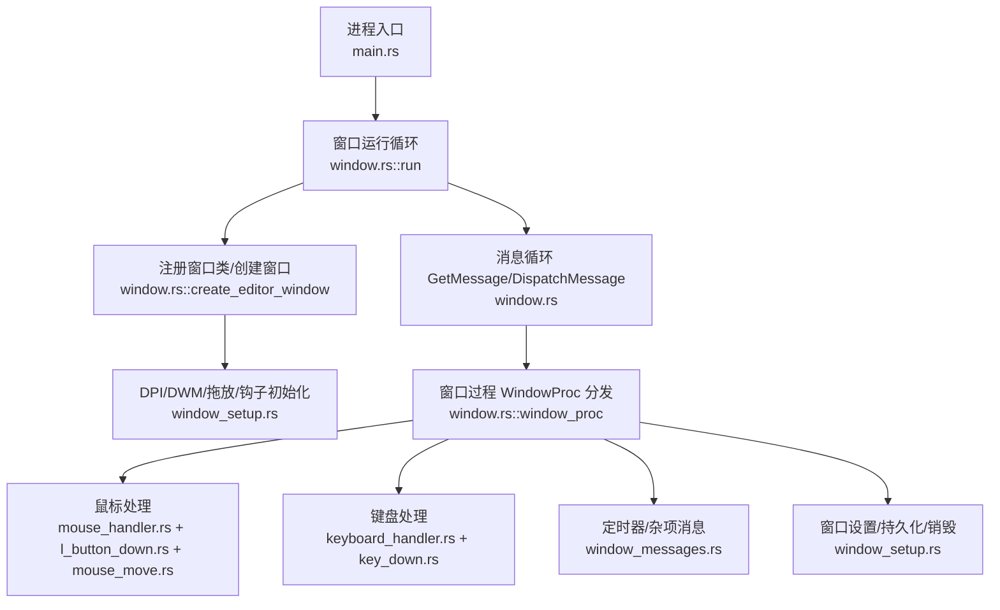
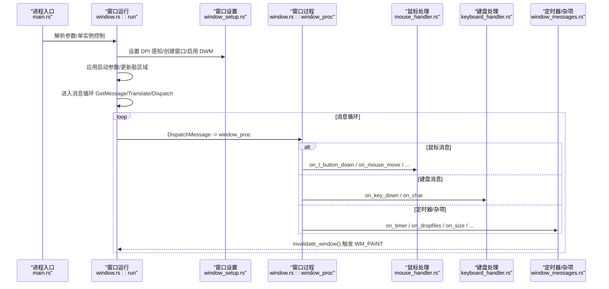
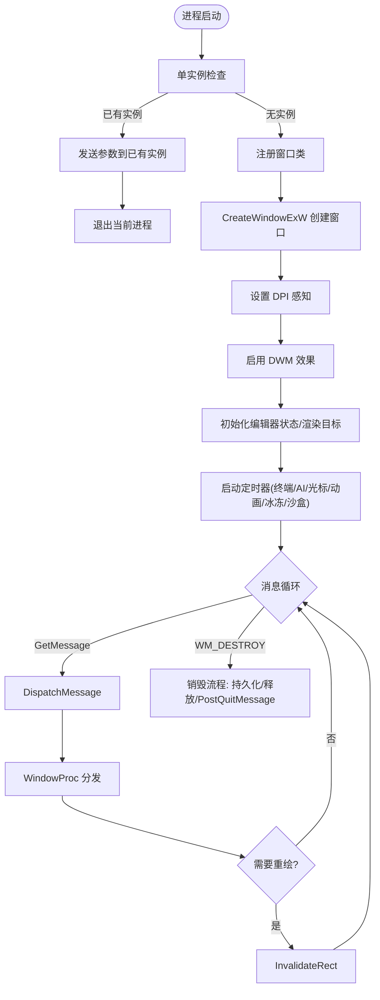
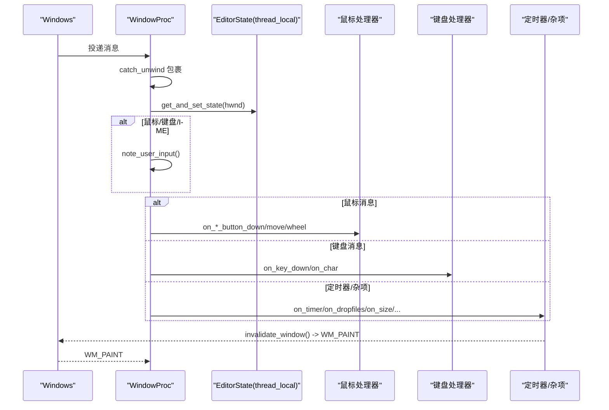
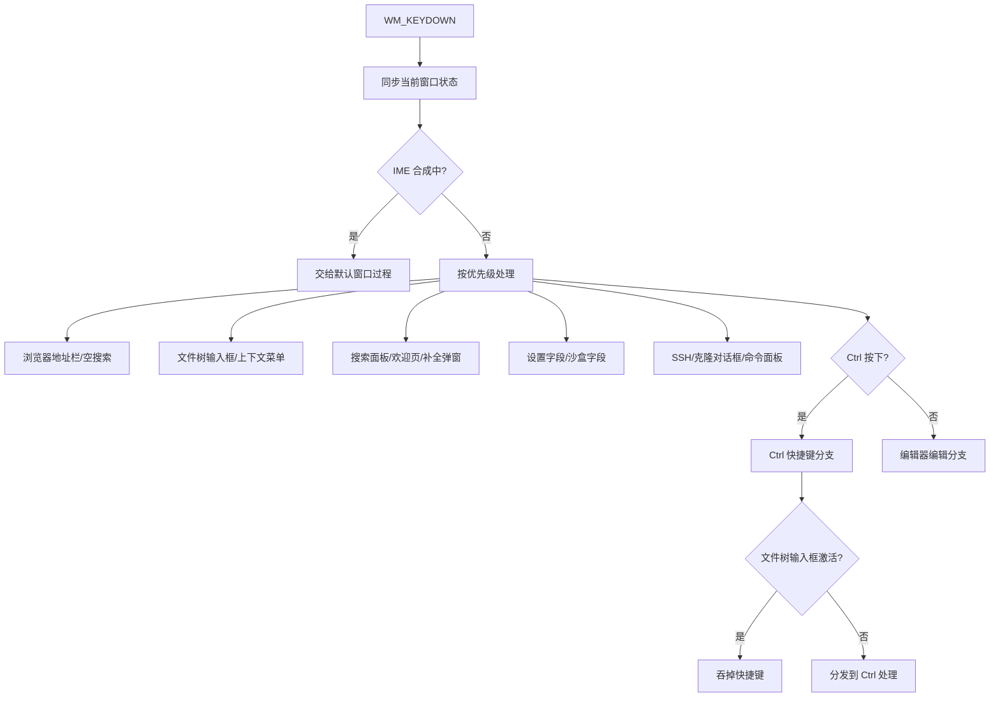
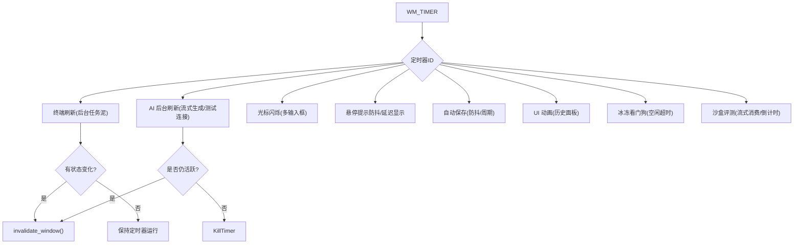
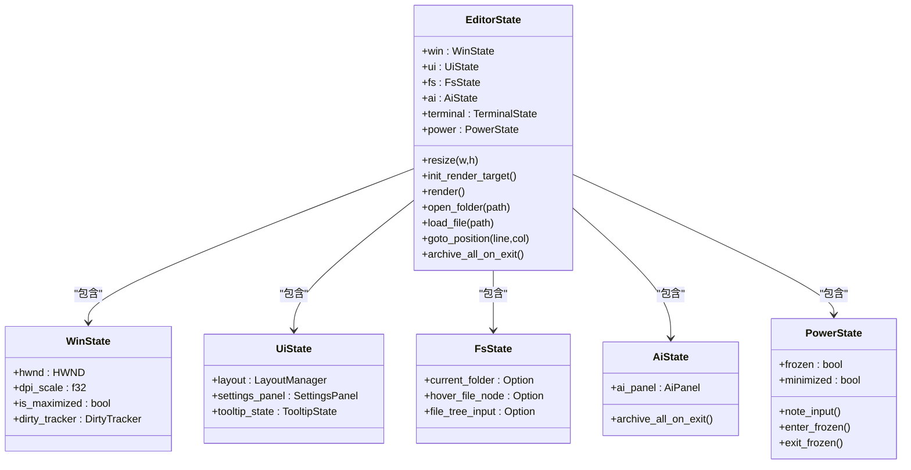
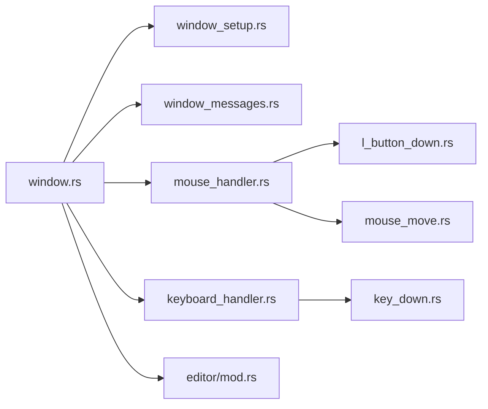

# 窗口管理

<cite>
**本文引用的文件**
- [main.rs](file://crates/aether-win32/src/main.rs)
- [window.rs](file://crates/aether-win32/src/window.rs)
- [lib.rs](file://crates/aether-win32/src/lib.rs)
- [window_setup.rs](file://crates/aether-win32/src/window/window_setup.rs)
- [window_messages.rs](file://crates/aether-win32/src/window/window_messages.rs)
- [mouse_handler.rs](file://crates/aether-win32/src/window/mouse_handler.rs)
- [l_button_down.rs](file://crates/aether-win32/src/window/mouse_handler/l_button_down.rs)
- [mouse_move.rs](file://crates/aether-win32/src/window/mouse_handler/mouse_move.rs)
- [keyboard_handler.rs](file://crates/aether-win32/src/window/keyboard_handler.rs)
- [key_down.rs](file://crates/aether-win32/src/window/keyboard_handler/key_down.rs)
- [editor/mod.rs](file://crates/aether-win32/src/editor/mod.rs)
</cite>

## 目录
1. [简介](#简介)
2. [项目结构](#项目结构)
3. [核心组件](#核心组件)
4. [架构总览](#架构总览)
5. [详细组件分析](#详细组件分析)
6. [依赖关系分析](#依赖关系分析)
7. [性能考量](#性能考量)
8. [故障排查指南](#故障排查指南)
9. [结论](#结论)
10. [附录](#附录)

## 简介
本文件面向“牧羊人编辑器”Windows 原生窗口的创建、初始化与生命周期管理，系统性说明窗口过程（WindowProc）的消息循环、消息分发与事件处理机制；文档化窗口状态管理（编辑器状态存储与检索、多窗口支持、DPI 感知与缩放）、窗口消息处理流程（鼠标、键盘、绘制等），以及窗口设置与配置（窗口样式、位置恢复、DWM 效果启用）。同时提供最佳实践与常见问题解决方案，并包含窗口性能优化与多窗口协调的技术细节。

## 项目结构
本项目将 Windows 窗口相关代码集中在 aether-win32 crate 中，采用“按职责拆分”的模块化组织：
- 入口与单实例控制：main.rs
- 窗口主流程与消息分派：window.rs
- 窗口创建与设置：window/window_setup.rs
- 杂项消息与定时器：window/window_messages.rs
- 输入处理：window/mouse_handler.rs、window/keyboard_handler.rs
- 具体消息处理：mouse_handler/*、keyboard_handler/*
- 编辑器状态聚合：editor/mod.rs

图表来源
- [main.rs:1-26](file://crates/aether-win32/src/main.rs#L1-L26)
- [window.rs:132-204](file://crates/aether-win32/src/window.rs#L132-L204)
- [window_setup.rs:18-86](file://crates/aether-win32/src/window/window_setup.rs#L18-L86)
- [window_messages.rs:21-59](file://crates/aether-win32/src/window/window_messages.rs#L21-L59)

章节来源
- [main.rs:1-26](file://crates/aether-win32/src/main.rs#L1-L26)
- [window.rs:132-204](file://crates/aether-win32/src/window.rs#L132-L204)
- [window_setup.rs:18-86](file://crates/aether-win32/src/window/window_setup.rs#L18-L86)

## 核心组件
- 进程入口与单实例控制：负责解析启动参数、单实例互斥、向已有实例转发参数或等待窗口关闭。
- 窗口运行循环：设置 DPI 感知、注册窗口类、创建主窗口、应用启动参数、进入消息循环。
- 窗口过程（WindowProc）：统一捕获 panic、维护空闲/冰冻态、从 GWLP_USERDATA 获取当前窗口状态、分发到各处理器。
- 窗口设置：DPI 感知、DWM 效果（Acrylic/Mica）、窗口矩形恢复与持久化、拖放文件、低层键盘钩子安装。
- 输入处理：鼠标（点击、双击、滚轮、移动、拖拽）、键盘（按键、字符、IME 合成）。
- 定时器系统：用于终端刷新、AI 后台刷新、光标闪烁、悬停提示、自动保存、UI 动画、冰冻看门狗、沙盒评测等。
- 编辑器状态：通过 Rc<RefCell<EditorState>> 关联到每个窗口，线程局部变量维护“活跃窗口状态”，保证多窗口消息路由正确。

章节来源
- [window.rs:75-128](file://crates/aether-win32/src/window.rs#L75-L128)
- [window.rs:132-204](file://crates/aether-win32/src/window.rs#L132-L204)
- [window.rs:355-446](file://crates/aether-win32/src/window.rs#L355-L446)
- [window_setup.rs:18-86](file://crates/aether-win32/src/window/window_setup.rs#L18-L86)
- [window_setup.rs:101-178](file://crates/aether-win32/src/window/window_setup.rs#L101-L178)
- [window_setup.rs:180-266](file://crates/aether-win32/src/window/window_setup.rs#L180-L266)
- [window_messages.rs:21-59](file://crates/aether-win32/src/window/window_messages.rs#L21-L59)

## 架构总览
下图展示从进程启动到消息处理的完整路径，包括单实例控制、窗口创建、DPI/DWM 设置、消息循环与 WindowProc 分发。

图表来源
- [main.rs:8-26](file://crates/aether-win32/src/main.rs#L8-L26)
- [window.rs:132-204](file://crates/aether-win32/src/window.rs#L132-L204)
- [window_setup.rs:18-86](file://crates/aether-win32/src/window/window_setup.rs#L18-L86)
- [window_messages.rs:21-59](file://crates/aether-win32/src/window/window_messages.rs#L21-L59)

## 详细组件分析

### 窗口创建与生命周期
- 单实例控制：若已有实例运行，则发送参数至已有实例并退出；否则继续初始化主窗口。
- 窗口类注册与创建：设置窗口样式（WS_POPUP | WS_VISIBLE | WS_THICKFRAME | WS_MINIMIZEBOX | WS_MAXIMIZEBOX），非主窗口使用 WS_EX_APPWINDOW | WS_EX_WINDOWEDGE。
- DPI 感知：优先使用 Per-Monitor V2，失败回退到 Per-Monitor。
- DWM 效果：启用沉浸式暗色模式、主机 backdrop brush、Mica/Acrylic 兼容属性、NC 渲染策略。
- 拖放文件：启用 DragAcceptFiles。
- 编辑器状态初始化：计算 DPI 缩放、布局常量缩放、IME 尺寸缩放、客户区尺寸、初始化渲染目标、首次渲染、安装低层键盘钩子、启动多个定时器。
- 状态关联：将 EditorState 指针存入 GWLP_USERDATA，便于消息处理时获取。
- 最大化恢复：若上次为最大化，创建后调用 ShowWindow 最大化。
- 销毁流程：卸载键盘钩子、持久化窗口状态（矩形/最大化/工作区 AI 标签页快照）、清理 thread_local 活跃状态、原子计数器递减并在最后一个窗口关闭时 PostQuitMessage。

图表来源
- [main.rs:8-26](file://crates/aether-win32/src/main.rs#L8-L26)
- [window.rs:210-279](file://crates/aether-win32/src/window.rs#L210-L279)
- [window.rs:281-338](file://crates/aether-win32/src/window.rs#L281-L338)
- [window_setup.rs:18-86](file://crates/aether-win32/src/window/window_setup.rs#L18-L86)
- [window_setup.rs:101-178](file://crates/aether-win32/src/window/window_setup.rs#L101-L178)
- [window_setup.rs:180-266](file://crates/aether-win32/src/window/window_setup.rs#L180-L266)
- [window.rs:327-385](file://crates/aether-win32/src/window.rs#L327-L385)

章节来源
- [main.rs:8-26](file://crates/aether-win32/src/main.rs#L8-L26)
- [window.rs:210-279](file://crates/aether-win32/src/window.rs#L210-L279)
- [window.rs:281-338](file://crates/aether-win32/src/window.rs#L281-L338)
- [window_setup.rs:18-86](file://crates/aether-win32/src/window/window_setup.rs#L18-L86)
- [window_setup.rs:101-178](file://crates/aether-win32/src/window/window_setup.rs#L101-L178)
- [window_setup.rs:180-266](file://crates/aether-win32/src/window/window_setup.rs#L180-L266)
- [window.rs:327-385](file://crates/aether-win32/src/window.rs#L327-L385)

### 窗口过程（WindowProc）与消息分发
- 异常保护：catch_unwind 包裹整个函数体，panic 时记录信息并回退到 DefWindowProcW。
- 用户输入检测：对鼠标/键盘/IME 消息调用 note_user_input，刷新空闲计时，必要时解冻冰冻态。
- 状态同步：根据消息类型，先 get_and_set_state(hwnd) 将当前窗口状态同步到 thread_local，避免多窗口消息交错导致错误路由。
- 消息分发：鼠标、键盘、定时器、大小变化、DPI 变化、焦点、绘制、IME、拖放、自定义消息等分别路由到对应处理器。
- 绘制驱动：事件处理不直接 render()，而是标记脏区域并调用 invalidate_window()，由 WM_PAINT 统一渲染，避免双重渲染。

图表来源
- [window.rs:355-446](file://crates/aether-win32/src/window.rs#L355-L446)
- [window_messages.rs:21-59](file://crates/aether-win32/src/window/window_messages.rs#L21-L59)

章节来源
- [window.rs:355-446](file://crates/aether-win32/src/window.rs#L355-L446)

### 鼠标事件处理
- 左键按下：按优先级依次尝试对话框、标题栏、用户菜单、资源管理器空白区域、文件节点上下文菜单、活动栏上下文菜单、标签上下文菜单、子菜单、历史浮窗、活动栏、面板调整、侧边栏、右侧面板、标签栏、查找面板、底部面板、设置页、沙盒页、欢迎页/编辑器。
- 左键抬起：结束选择、结束面板拖拽、拐角手柄复位、侧边栏收起动画、文件树拖拽完成、活动栏/菜单栏自定义模式重排并持久化、标签拖拽重排或切换。
- 双击：在编辑器内容区双击选词。
- 滚轮：图片预览缩放（Ctrl+滚轮）、标签栏横向滚动、Shift+滚轮横向滚动、底部终端面板滚动、历史浮窗滚动、右侧 AI 面板滚动、设置页滚动、沙盒评测页滚动、侧边栏/编辑器滚动。
- 水平滚轮：仅在编辑器区域内响应横向滚动。
- 移动：高回报率节流（~120fps）、文本拖拽选区、文件树拖拽（内部/外部 OLE）、面板拖拽调整、悬停状态更新、Tooltip 防抖与延迟显示。

```mermaid
flowchart TD
LBD["WM_LBUTTONDOWN"] --> Priority["按区域优先级调度"]
Priority --> Dialogs["对话框/菜单/上下文菜单"]
Priority --> Titlebar["标题栏/工具按钮"]
Priority --> Activity["活动栏/标签栏"]
Priority --> Sidebar["侧边栏/文件树"]
Priority --> RightPanel["右侧面板/AI 面板"]
Priority --> Bottom["底部面板/终端"]
Priority --> Settings["设置页/沙盒页"]
Priority --> Welcome["欢迎页/编辑器"]
LBU["WM_LBUTTONUP"] --> EndDrag["结束拖拽/选择/调整"]
LBU --> Persist["持久化自定义顺序/重排标签"]
Wheel["WM_MOUSEWHEEL/HWHEEL"] --> RegionHit["命中区域判定"]
RegionHit --> Zoom["图片预览缩放(Ctrl)"]
RegionHit --> TabScroll["标签栏横向滚动"]
RegionHit --> ShiftScroll["Shift+滚轮横向滚动"]
RegionHit --> Terminal["终端面板滚动"]
RegionHit --> History["历史浮窗滚动"]
RegionHit --> AI["AI 面板滚动"]
RegionHit --> SettingsScroll["设置页/沙盒页滚动"]
RegionHit --> DefaultScroll["侧边栏/编辑器滚动"]
Move["WM_MOUSEMOVE"] --> Drag["文本/文件/面板拖拽"]
Move --> Hover["悬停状态更新"]
Move --> Tooltip["Tooltip 防抖/延迟显示"]
```

图表来源
- [l_button_down.rs:17-111](file://crates/aether-win32/src/window/mouse_handler/l_button_down.rs#L17-L111)
- [mouse_handler.rs:44-188](file://crates/aether-win32/src/window/mouse_handler.rs#L44-L188)
- [mouse_handler.rs:190-406](file://crates/aether-win32/src/window/mouse_handler.rs#L190-L406)
- [mouse_move.rs:39-323](file://crates/aether-win32/src/window/mouse_handler/mouse_move.rs#L39-L323)

章节来源
- [l_button_down.rs:17-111](file://crates/aether-win32/src/window/mouse_handler/l_button_down.rs#L17-L111)
- [mouse_handler.rs:44-188](file://crates/aether-win32/src/window/mouse_handler.rs#L44-L188)
- [mouse_handler.rs:190-406](file://crates/aether-win32/src/window/mouse_handler.rs#L190-L406)
- [mouse_move.rs:39-323](file://crates/aether-win32/src/window/mouse_handler/mouse_move.rs#L39-L323)

### 键盘事件处理
- 进入时同步当前窗口状态到 thread_local。
- IME 合成期间：直接交给默认窗口过程，让 IMM32 处理按键（修复 Backspace 无法更新合成串的问题）。
- 优先级处理：浏览器地址栏、空搜索框、文件树输入框、各种上下文菜单、搜索面板、欢迎页导航、补全弹窗导航、设置字段、沙盒字段、SSH/克隆对话框、命令面板。
- Ctrl 快捷键：在文件树输入框激活时吞掉所有 Ctrl 快捷键防止编辑器误响应；否则交由 Ctrl 分支处理。
- Alt+Left/Right：返回/前进导航（占位实现）。
- F2：文件树选中节点重命名。
- Delete：文件树选中节点删除（移至回收站）。
- 文件树输入框激活时：拦截非 Ctrl 编辑器按键，字符输入由 WM_CHAR 处理。
- AI 面板输入框：方向键、Home/End、Delete 处理。
- 编辑器编辑：交由 key_down_edit 模块处理。

图表来源
- [key_down.rs:17-182](file://crates/aether-win32/src/window/keyboard_handler/key_down.rs#L17-L182)

章节来源
- [key_down.rs:17-182](file://crates/aether-win32/src/window/keyboard_handler/key_down.rs#L17-L182)

### 定时器与后台任务
- 终端刷新：周期性执行后台任务泥（AI 流、Agent 回环、LSP 诊断、终端输出），冻结态停止定时器，由 AI 无头泵保活。
- AI 后台刷新：流式生成或测试连接期间周期性重绘，结束后自动停止。
- 光标闪烁：新建项目对话框、文件树输入框、AI 助手输入框、新标签页快捷搜索框、编辑器内容区光标闪烁。
- 悬停提示：Hover tooltip 防抖定时器，Tooltip 延迟显示定时器。
- 自动保存：空闲防抖定时器与周期兜底定时器。
- UI 动画：历史记录下拉面板展开/收起动画，结束后自动停止。
- 冰冻看门狗：低频检查空闲时长，满足条件进入冰冻态释放内存。
- 智能体沙盒评测：评测运行期间驱动流式消费、倒计时与任务推进，结束后自动停止。

图表来源
- [window_messages.rs:21-59](file://crates/aether-win32/src/window/window_messages.rs#L21-L59)
- [window_messages.rs:62-84](file://crates/aether-win32/src/window/window_messages.rs#L62-L84)
- [window_messages.rs:86-99](file://crates/aether-win32/src/window/window_messages.rs#L86-L99)
- [window_messages.rs:101-115](file://crates/aether-win32/src/window/window_messages.rs#L101-L115)
- [window_messages.rs:117-123](file://crates/aether-win32/src/window/window_messages.rs#L117-L123)
- [window_messages.rs:125-165](file://crates/aether-win32/src/window/window_messages.rs#L125-L165)
- [window_messages.rs:167-236](file://crates/aether-win32/src/window/window_messages.rs#L167-L236)
- [window_messages.rs:238-275](file://crates/aether-win32/src/window/window_messages.rs#L238-L275)
- [window_messages.rs:277-425](file://crates/aether-win32/src/window/window_messages.rs#L277-L425)

章节来源
- [window_messages.rs:21-59](file://crates/aether-win32/src/window/window_messages.rs#L21-L59)
- [window_messages.rs:62-84](file://crates/aether-win32/src/window/window_messages.rs#L62-L84)
- [window_messages.rs:86-99](file://crates/aether-win32/src/window/window_messages.rs#L86-L99)
- [window_messages.rs:101-115](file://crates/aether-win32/src/window/window_messages.rs#L101-L115)
- [window_messages.rs:117-123](file://crates/aether-win32/src/window/window_messages.rs#L117-L123)
- [window_messages.rs:125-165](file://crates/aether-win32/src/window/window_messages.rs#L125-L165)
- [window_messages.rs:167-236](file://crates/aether-win32/src/window/window_messages.rs#L167-L236)
- [window_messages.rs:238-275](file://crates/aether-win32/src/window/window_messages.rs#L238-L275)
- [window_messages.rs:277-425](file://crates/aether-win32/src/window/window_messages.rs#L277-L425)

### 窗口状态管理与多窗口支持
- 编辑器状态存储：Rc<RefCell<EditorState>> 通过 GWLP_USERDATA 与窗口关联；thread_local EDITOR_STATE 维护“当前活跃窗口状态”。
- 多窗口计数：全局原子计数器 WINDOW_COUNT 防止任一窗口关闭就退出整个应用；最后一个窗口销毁时 PostQuitMessage。
- 状态获取与同步：get_and_set_state(hwnd) 从窗口读取状态并设为活跃状态，确保键盘输入路由到正确窗口。
- 窗口矩形恢复：compute_restored_window_rect 从 settings.json 恢复 x/y/width/height/maximized，校验显示器边界，拒绝异常尺寸。
- 持久化：persist_window_state 在销毁前保存窗口矩形、最大化标志、AI 打开标签页快照；last_workspace 由 open_folder/close_workspace 即时读写，避免多窗口覆盖。

图表来源
- [editor/mod.rs:73-199](file://crates/aether-win32/src/editor/mod.rs#L73-L199)
- [window.rs:75-128](file://crates/aether-win32/src/window.rs#L75-L128)
- [window_setup.rs:101-178](file://crates/aether-win32/src/window/window_setup.rs#L101-L178)
- [window_setup.rs:180-266](file://crates/aether-win32/src/window/window_setup.rs#L180-L266)

章节来源
- [window.rs:75-128](file://crates/aether-win32/src/window.rs#L75-L128)
- [window_setup.rs:101-178](file://crates/aether-win32/src/window/window_setup.rs#L101-L178)
- [window_setup.rs:180-266](file://crates/aether-win32/src/window/window_setup.rs#L180-L266)
- [editor/mod.rs:73-199](file://crates/aether-win32/src/editor/mod.rs#L73-L199)

### DPI 感知与缩放处理
- 进程级 DPI 感知：优先 SetProcessDpiAwarenessContext(V2)，失败回退到 SetProcessDpiAwareness。
- 窗口级 DPI：init_editor_state 中 GetDpiForWindow 计算 dpi_scale，应用到布局常量与 IME 尺寸。
- 初始尺寸：get_dpi_scaled_size 基于系统 DPI 计算默认窗口尺寸作为回退值。
- 恢复尺寸：compute_restored_window_rect 从 settings.json 恢复窗口矩形，校验显示器边界，拒绝异常尺寸。

章节来源
- [window_setup.rs:18-30](file://crates/aether-win32/src/window/window_setup.rs#L18-L30)
- [window_setup.rs:88-99](file://crates/aether-win32/src/window/window_setup.rs#L88-L99)
- [window.rs:281-297](file://crates/aether-win32/src/window.rs#L281-L297)
- [window_setup.rs:101-178](file://crates/aether-win32/src/window/window_setup.rs#L101-L178)

### 窗口设置与配置
- 窗口样式：WS_POPUP | WS_VISIBLE | WS_THICKFRAME | WS_MINIMIZEBOX | WS_MAXIMIZEBOX；非主窗口额外 WS_EX_APPWINDOW | WS_EX_WINDOWEDGE。
- 位置恢复：compute_restored_window_rect 从 settings.json 恢复 x/y/width/height/maximized，校验显示器边界。
- DWM 效果：启用沉浸式暗色模式、主机 backdrop brush、Mica/Acrylic 兼容属性、NC 渲染策略。
- 拖放文件：DragAcceptFiles 启用。
- 低层键盘钩子：install/uninstall 确保终端编辑键不被 IME 系统级拦截。

章节来源
- [window.rs:210-279](file://crates/aether-win32/src/window.rs#L210-L279)
- [window_setup.rs:18-86](file://crates/aether-win32/src/window/window_setup.rs#L18-L86)
- [window_setup.rs:101-178](file://crates/aether-win32/src/window/window_setup.rs#L101-L178)

## 依赖关系分析
- 模块耦合：window.rs 作为中心，依赖 window_setup.rs（创建/设置）、window_messages.rs（定时器/杂项）、mouse_handler.rs/keyboard_handler.rs（输入处理）、editor/mod.rs（编辑器状态）。
- 外部依赖：windows crate（Win32 API）、aether_shared/settings（配置持久化）、aether_render（D2D/GPU 渲染）、aether_lsp（语言服务器事件）。
- 潜在循环依赖：通过子模块拆分与明确接口避免；window.rs 仅暴露 run/create_editor_window/invalidate_window/get_and_set_state 等接口。

图表来源
- [lib.rs:1-58](file://crates/aether-win32/src/lib.rs#L1-L58)
- [window.rs:13-30](file://crates/aether-win32/src/window.rs#L13-L30)
- [mouse_handler.rs:1-16](file://crates/aether-win32/src/window/mouse_handler.rs#L1-L16)
- [keyboard_handler.rs:1-13](file://crates/aether-win32/src/window/keyboard_handler.rs#L1-L13)

章节来源
- [lib.rs:1-58](file://crates/aether-win32/src/lib.rs#L1-L58)
- [window.rs:13-30](file://crates/aether-win32/src/window.rs#L13-L30)
- [mouse_handler.rs:1-16](file://crates/aether-win32/src/window/mouse_handler.rs#L1-L16)
- [keyboard_handler.rs:1-13](file://crates/aether-win32/src/window/keyboard_handler.rs#L1-L13)

## 性能考量
- 渲染合并：事件处理调用 invalidate_window() 而非直接 render()，Windows 自动合并多次 InvalidateRect 为一次 WM_PAINT，消除双重渲染。
- 高回报率鼠标节流：面板拖拽同步重绘节流至 ~120fps，被跳过的帧由后续 WM_PAINT 合并补齐。
- 立即重绘：在关键路径（如文本拖拽选区、菜单 hover）使用 UpdateWindow 绕过消息队列优先级，避免 WM_PAINT 被饿死。
- 定时任务分离：终端刷新与 AI 后台刷新使用独立定时器，避免每帧渲染前阻塞 IO。
- 冰冻态优化：最小化或长期空闲进入冰冻态释放内存，后台任务由 AI 无头泵保活，减少资源消耗。
- 脏区域追踪：按区域标记脏区（标题栏、活动栏、侧边栏、编辑器内容、状态栏、底部面板、对话框），避免全窗口重绘。

[本节为通用性能指导，无需特定文件引用]

## 故障排查指南
- 窗口过程 panic：catch_unwind 捕获并记录 msg 与 panic 信息，回退到 DefWindowProcW，保证进程稳定。
- 多窗口状态错乱：确保 get_and_set_state(hwnd) 在消息处理前同步当前窗口状态到 thread_local。
- 位置恢复异常：compute_restored_window_rect 校验显示器边界，拒绝异常尺寸；若恢复失败回退默认。
- DWM 效果未生效：检查 enable_dwm_acrylic 调用顺序与属性设置；不同 Windows 版本使用不同属性。
- 输入法问题：IME 合成期间交给默认窗口过程；低层键盘钩子安装失败会导致终端汉字无法删除。
- 定时器未停止：检查 on_timer_* 中 active 状态判断，确保完成后 KillTimer。

章节来源
- [window.rs:355-446](file://crates/aether-win32/src/window.rs#L355-L446)
- [window_setup.rs:101-178](file://crates/aether-win32/src/window/window_setup.rs#L101-L178)
- [window_setup.rs:18-86](file://crates/aether-win32/src/window/window_setup.rs#L18-L86)
- [window_messages.rs:62-84](file://crates/aether-win32/src/window/window_messages.rs#L62-L84)

## 结论
本项目通过清晰的模块化设计与严格的窗口过程保护机制，实现了稳定的 Windows 原生窗口管理。DPI 感知与 DWM 效果提升了视觉体验，定时器系统与脏区域追踪保障了性能，多窗口支持与状态同步确保了交互一致性。遵循本文档的最佳实践可有效避免常见陷阱，提升开发效率与用户体验。

[本节为总结性内容，无需特定文件引用]

## 附录
- 最佳实践
  - 始终通过 invalidate_window() 触发重绘，避免直接 render()。
  - 在高回报率鼠标路径中使用节流与 UpdateWindow 优化响应。
  - 在消息处理前调用 get_and_set_state(hwnd) 同步状态。
  - 使用 compute_restored_window_rect 恢复窗口位置，校验显示器边界。
  - 启用 DWM 效果时注意 Windows 版本兼容性。
  - 定时器完成后及时 KillTimer，避免资源泄漏。
- 常见问题
  - 窗口过程 panic：检查 catch_unwind 日志，定位消息类型。
  - 多窗口状态错乱：确认 thread_local 活跃状态同步。
  - 输入法异常：检查 IME 合成期间消息处理与低层键盘钩子安装。
  - 位置恢复失败：检查 settings.json 中的窗口矩形数据。

[本节为补充性内容，无需特定文件引用]