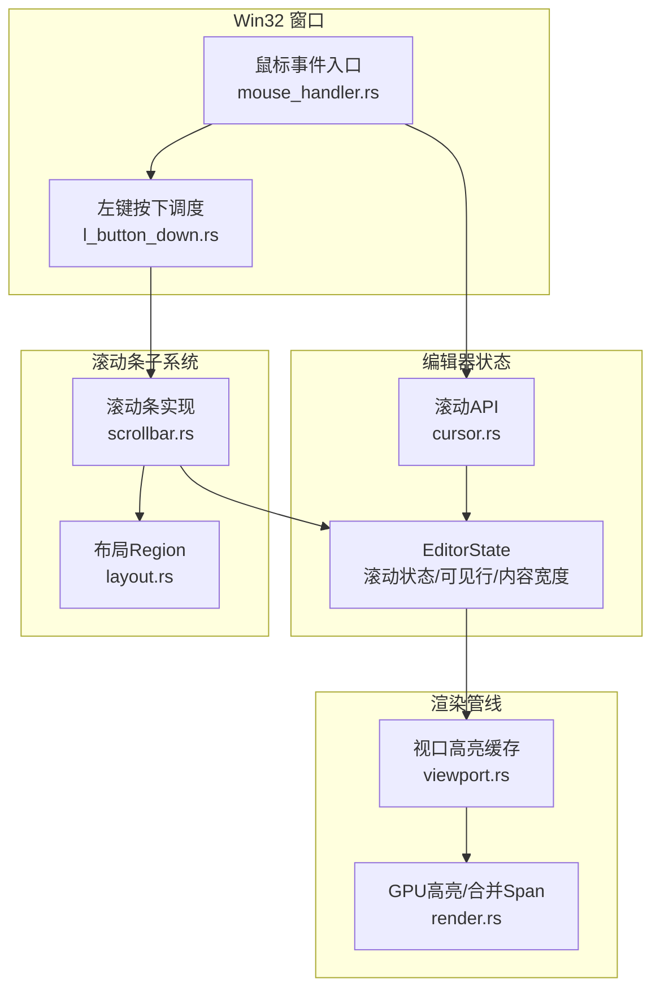
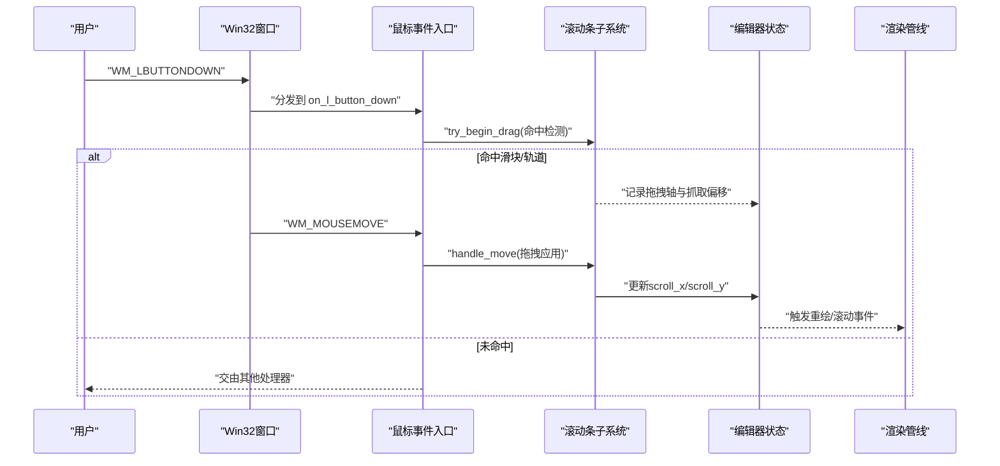
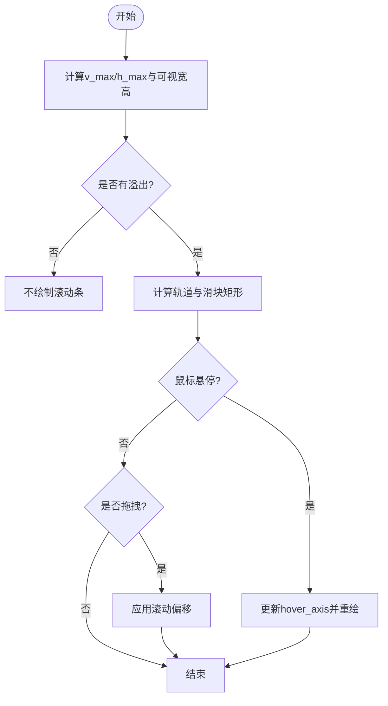
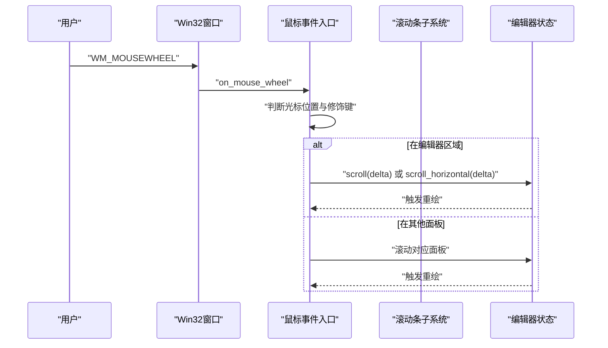
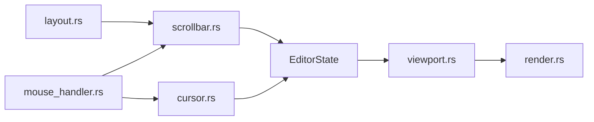

# 统一滚动条系统

<cite>
**本文引用的文件**
- [scrollbar.rs](file://crates/aether-win32/src/editor/scrollbar.rs)
- [mouse_handler.rs](file://crates/aether-win32/src/window/mouse_handler.rs)
- [l_button_down.rs](file://crates/aether-win32/src/window/mouse_handler/l_button_down.rs)
- [cursor.rs](file://crates/aether-win32/src/editor/cursor.rs)
- [viewport.rs](file://crates/aether-render/src/gpu/viewport.rs)
- [render.rs](file://crates/aether-render/src/gpu/render.rs)
- [layout.rs](file://crates/aether-win32/src/layout.rs)
</cite>

## 目录
1. [简介](#简介)
2. [项目结构](#项目结构)
3. [核心组件](#核心组件)
4. [架构总览](#架构总览)
5. [详细组件分析](#详细组件分析)
6. [依赖关系分析](#依赖关系分析)
7. [性能考量](#性能考量)
8. [故障排查指南](#故障排查指南)
9. [结论](#结论)

## 简介
本文件围绕“统一滚动条系统”展开，系统化梳理了编辑器中覆盖式滚动条（类 VS Code）的几何计算、命中检测、拖拽交互、渲染与滚轮路由。该系统的目标是：在多种视图（经典中间编辑区、智能体右侧标签面板等）下提供一致的滚动体验，并保证高性能与可维护性。

## 项目结构
滚动条系统横跨 UI 层（Win32 窗口消息）、编辑器状态管理、渲染管线与布局模块：
- Win32 鼠标事件入口：负责将 WM_LBUTTONDOWN / WM_MOUSEMOVE / WM_MOUSEWHEEL 等消息路由到统一的滚动条处理逻辑。
- 编辑器状态：维护滚动偏移、可见区域、内容宽度缓存等。
- 渲染管线：GPU/CPU 高亮与视口增量更新，配合滚动条的可视范围。
- 布局模块：定义 Region、TabBar 高度等，用于计算滚动条轨道与滑块位置。

图表来源
- [mouse_handler.rs:195-399](file://crates/aether-win32/src/window/mouse_handler.rs#L195-L399)
- [l_button_down.rs:17-110](file://crates/aether-win32/src/window/mouse_handler/l_button_down.rs#L17-L110)
- [scrollbar.rs:45-103](file://crates/aether-win32/src/editor/scrollbar.rs#L45-L103)
- [cursor.rs:58-93](file://crates/aether-win32/src/editor/cursor.rs#L58-L93)
- [viewport.rs:3-22](file://crates/aether-render/src/gpu/viewport.rs#L3-L22)
- [render.rs:74-126](file://crates/aether-render/src/gpu/render.rs#L74-L126)
- [layout.rs:1-31](file://crates/aether-win32/src/layout.rs#L1-L31)

章节来源
- [mouse_handler.rs:195-399](file://crates/aether-win32/src/window/mouse_handler.rs#L195-L399)
- [l_button_down.rs:17-110](file://crates/aether-win32/src/window/mouse_handler/l_button_down.rs#L17-L110)
- [scrollbar.rs:45-103](file://crates/aether-win32/src/editor/scrollbar.rs#L45-L103)
- [cursor.rs:58-93](file://crates/aether-win32/src/editor/cursor.rs#L58-L93)
- [viewport.rs:3-22](file://crates/aether-render/src/gpu/viewport.rs#L3-L22)
- [render.rs:74-126](file://crates/aether-render/src/gpu/render.rs#L74-L126)
- [layout.rs:1-31](file://crates/aether-win32/src/layout.rs#L1-L31)

## 核心组件
- 滚动条几何与交互（scrollbar.rs）
  - 计算垂直/水平轨道与滑块的矩形区域，考虑同时存在时的拐角避让。
  - 命中检测优先级：滑块优先于轨道；垂直优先于水平。
  - 拖拽应用：根据鼠标位置反推滚动偏移，更新 EditorState 的 scroll_x/scroll_y。
  - 悬停高亮：跟踪 hover_axis 以改变滑块透明度。
  - 统一入口：try_begin_drag/handle_move/jump_and_grab 为左右键与移动事件提供一致行为。
  - 激活条件：仅在代码编辑器视图有效时绘制与响应。
- 鼠标事件路由（mouse_handler.rs, l_button_down.rs）
  - 左键按下：按区域优先级分发，最终落到编辑器区域时调用滚动条 try_begin_drag。
  - 鼠标移动：handle_move 区分拖拽与悬停变化，触发重绘。
  - 滚轮：Shift+滚轮横向滚动；光标在特定面板（终端、AI 对话、设置页等）时优先滚动对应区域；否则进入编辑器滚动。
- 编辑器滚动 API（cursor.rs）
  - 垂直滚动：基于行高与滚动偏移。
  - 水平滚动：基于字符宽度与最长行宽，钳制到最大可滚动范围。
  - 确保光标可见：必要时调整 scroll_x/scroll_y。
- 视口与高亮缓存（viewport.rs, render.rs）
  - 视口高亮缓存：仅缓存可见行范围的 token，支持窗口移动与增量更新。
  - GPU 高亮：将 TokenKind 映射为主题颜色，合并相邻同色 Span 减少绘制调用。

章节来源
- [scrollbar.rs:19-43](file://crates/aether-win32/src/editor/scrollbar.rs#L19-L43)
- [scrollbar.rs:145-176](file://crates/aether-win32/src/editor/scrollbar.rs#L145-L176)
- [scrollbar.rs:178-227](file://crates/aether-win32/src/editor/scrollbar.rs#L178-L227)
- [scrollbar.rs:229-285](file://crates/aether-win32/src/editor/scrollbar.rs#L229-L285)
- [scrollbar.rs:287-327](file://crates/aether-win32/src/editor/scrollbar.rs#L287-L327)
- [mouse_handler.rs:195-399](file://crates/aether-win32/src/window/mouse_handler.rs#L195-L399)
- [l_button_down.rs:17-110](file://crates/aether-win32/src/window/mouse_handler/l_button_down.rs#L17-L110)
- [cursor.rs:58-93](file://crates/aether-win32/src/editor/cursor.rs#L58-L93)
- [viewport.rs:3-22](file://crates/aether-render/src/gpu/viewport.rs#L3-L22)
- [render.rs:74-126](file://crates/aether-render/src/gpu/render.rs#L74-L126)

## 架构总览
统一滚动条系统的关键流程如下：
- 几何计算：根据当前编辑器内容高度/宽度与可视区域，计算轨道与滑块尺寸及位置。
- 命中检测：判断鼠标是否命中滑块或轨道，决定交互模式。
- 交互处理：拖拽滑块或点击轨道跳转，更新滚动偏移并触发重绘。
- 滚轮路由：根据光标位置与修饰键，选择目标滚动区域（编辑器、终端、AI 对话、设置页等）。
- 渲染联动：滚动条绘制叠加在文本之上；视口高亮缓存随滚动更新，减少重复计算。

图表来源
- [mouse_handler.rs:195-399](file://crates/aether-win32/src/window/mouse_handler.rs#L195-L399)
- [l_button_down.rs:17-110](file://crates/aether-win32/src/window/mouse_handler/l_button_down.rs#L17-L110)
- [scrollbar.rs:229-285](file://crates/aether-win32/src/editor/scrollbar.rs#L229-L285)

## 详细组件分析

### 滚动条几何与交互（scrollbar.rs）
- 几何计算 geometry
  - 垂直方向：基于行数×行高得到总高度，结合可视高度计算最大可滚动距离 v_max。
  - 水平方向：基于最长行字符数×字符宽度得到内容宽度，扣除行号宽度与内边距得到可视宽度，计算 h_max。
  - 轨道与滑块：当存在溢出时绘制轨道；滑块长度由可视比例决定，最小长度 THUMB_MIN 保证可抓取。
  - 拐角避让：两条同时存在时各自让出角落，避免重叠。
- 命中检测 hit_test
  - 优先级：垂直滑块 > 水平滑块 > 垂直轨道 > 水平轨道。
  - 返回 Hit::Thumb(axis, offset) 或 Hit::Track(axis)，供上层决定交互。
- 拖拽与跳转 apply_scroll / jump_and_grab
  - 根据鼠标位置与抓取偏移，计算相对轨道的比例，映射到 scroll_x/scroll_y。
  - 轨道点击将滑块中心对齐点击位置，并返回新的抓取偏移以便继续拖拽。
- 悬停与移动 handle_move
  - 若处于拖拽状态则应用滚动；否则更新 hover_axis，触发局部重绘。
- 激活条件 scrollbars_active
  - 仅在代码编辑器视图有效时启用滚动条（排除欢迎页、新标签、浏览器、设置、沙盒评测、终端、图片语言、空标签栏等）。
- 渲染 render_scrollbars
  - 刷新内容宽度缓存后计算几何；根据 hover/drag 状态设置不同透明度绘制轨道与滑块。

图表来源
- [scrollbar.rs:45-103](file://crates/aether-win32/src/editor/scrollbar.rs#L45-L103)
- [scrollbar.rs:145-176](file://crates/aether-win32/src/editor/scrollbar.rs#L145-L176)
- [scrollbar.rs:178-227](file://crates/aether-win32/src/editor/scrollbar.rs#L178-L227)
- [scrollbar.rs:263-285](file://crates/aether-win32/src/editor/scrollbar.rs#L263-L285)

章节来源
- [scrollbar.rs:45-103](file://crates/aether-win32/src/editor/scrollbar.rs#L45-L103)
- [scrollbar.rs:145-176](file://crates/aether-win32/src/editor/scrollbar.rs#L145-L176)
- [scrollbar.rs:178-227](file://crates/aether-win32/src/editor/scrollbar.rs#L178-L227)
- [scrollbar.rs:263-285](file://crates/aether-win32/src/editor/scrollbar.rs#L263-L285)
- [scrollbar.rs:287-327](file://crates/aether-win32/src/editor/scrollbar.rs#L287-L327)

### 鼠标事件路由（mouse_handler.rs, l_button_down.rs）
- 左键按下 on_l_button_down
  - 按区域优先级依次尝试对话框、标题栏、活动栏、侧边栏、右面板、标签栏、查找面板、底部面板、设置页、沙盒页、欢迎/编辑器。
  - 最终落到编辑器区域时调用滚动条 try_begin_drag，捕获鼠标并开始拖拽。
- 鼠标移动 with handle_move
  - 若处于滚动条拖拽状态则应用滚动；否则更新悬停高亮。
- 滚轮 on_mouse_wheel
  - Shift+滚轮：横向滚动。
  - 光标在特定面板（终端、AI 对话、设置页、沙盒页）时优先滚动对应区域。
  - 智能体模式下中间区域为 AI 对话面板，优先滚动对话。
  - 否则进入 active_code_editor_region 进行编辑器滚动。
- 释放 on_l_button_up
  - 结束滚动条拖拽并释放鼠标捕获；清理面板拖拽、标签拖拽等状态。

图表来源
- [mouse_handler.rs:195-399](file://crates/aether-win32/src/window/mouse_handler.rs#L195-L399)
- [l_button_down.rs:17-110](file://crates/aether-win32/src/window/mouse_handler/l_button_down.rs#L17-L110)
- [scrollbar.rs:229-285](file://crates/aether-win32/src/editor/scrollbar.rs#L229-L285)

章节来源
- [mouse_handler.rs:195-399](file://crates/aether-win32/src/window/mouse_handler.rs#L195-L399)
- [l_button_down.rs:17-110](file://crates/aether-win32/src/window/mouse_handler/l_button_down.rs#L17-L110)

### 编辑器滚动 API（cursor.rs）
- 水平滚动 scroll_horizontal
  - 计算可见范围内最长行的字符宽度，结合行号宽度与内边距得到文本可视宽度，计算最大可滚动范围并钳制 scroll_x。
- 垂直滚动 scroll
  - 基于行高与滚动偏移更新 scroll_y。
- 确保光标可见 ensure_cursor_visible_horizontal/vertical
  - 在光标移动后调整滚动偏移，使光标始终可见。

章节来源
- [cursor.rs:58-93](file://crates/aether-win32/src/editor/cursor.rs#L58-L93)

### 视口与高亮缓存（viewport.rs, render.rs）
- 视口高亮缓存 ViewportHighlightCache
  - 仅缓存可见行范围的 token，支持窗口移动与增量更新。
  - 使用编辑距离检测显著变化，跨 token 边界或超过阈值时标记脏行重新高亮。
- GPU 高亮渲染
  - 将 TokenKind 映射为主题颜色，合并相邻同色 Span 减少绘制调用。
  - DoubleBuffer/GpuBufferPool 提升内存复用与并行处理能力。

章节来源
- [viewport.rs:3-22](file://crates/aether-render/src/gpu/viewport.rs#L3-L22)
- [viewport.rs:63-106](file://crates/aether-render/src/gpu/viewport.rs#L63-L106)
- [viewport.rs:108-154](file://crates/aether-render/src/gpu/viewport.rs#L108-L154)
- [render.rs:74-126](file://crates/aether-render/src/gpu/render.rs#L74-L126)

## 依赖关系分析
- scrollbar.rs 依赖 layout.rs 的 Region 与 TAB_BAR_HEIGHT，用于计算滚动条轨道与滑块位置。
- mouse_handler.rs 通过 EditorState 的方法访问 active_code_editor_region 与滚动 API，实现多区域滚动路由。
- cursor.rs 提供滚动 API，被滚动条与滚轮路由共同调用。
- viewport.rs 与 render.rs 提供高亮与渲染优化，受滚动影响进行增量更新。

图表来源
- [layout.rs:1-31](file://crates/aether-win32/src/layout.rs#L1-L31)
- [scrollbar.rs:45-103](file://crates/aether-win32/src/editor/scrollbar.rs#L45-L103)
- [mouse_handler.rs:195-399](file://crates/aether-win32/src/window/mouse_handler.rs#L195-L399)
- [cursor.rs:58-93](file://crates/aether-win32/src/editor/cursor.rs#L58-L93)
- [viewport.rs:3-22](file://crates/aether-render/src/gpu/viewport.rs#L3-L22)
- [render.rs:74-126](file://crates/aether-render/src/gpu/render.rs#L74-L126)

章节来源
- [layout.rs:1-31](file://crates/aether-win32/src/layout.rs#L1-L31)
- [scrollbar.rs:45-103](file://crates/aether-win32/src/editor/scrollbar.rs#L45-L103)
- [mouse_handler.rs:195-399](file://crates/aether-win32/src/window/mouse_handler.rs#L195-L399)
- [cursor.rs:58-93](file://crates/aether-win32/src/editor/cursor.rs#L58-L93)
- [viewport.rs:3-22](file://crates/aether-render/src/gpu/viewport.rs#L3-L22)
- [render.rs:74-126](file://crates/aether-render/src/gpu/render.rs#L74-L126)

## 性能考量
- 内容宽度缓存 refresh_content_width
  - 小文件：buffer_version 变化时全量扫描，保证精确。
  - 大文件：仅按可见行单调递增更新，避免每次击键全量扫描导致的卡顿。
- 视口高亮缓存 ViewportHighlightCache
  - 仅缓存可见行范围，窗口移动时保留重叠部分，新进入窗口的行标记为脏。
  - 编辑距离检测显著变化，跨 token 边界或超过阈值时重新高亮。
- GPU 高亮与合并 Span
  - 合并相邻同色 Span 减少 DrawText 调用次数。
  - DoubleBuffer/GpuBufferPool 提升内存复用与并行处理能力。
- 局部重绘
  - 滚轮与拖拽过程中尽量只标记脏区域（如标签栏、底部面板），避免全窗口重绘。

章节来源
- [scrollbar.rs:105-143](file://crates/aether-win32/src/editor/scrollbar.rs#L105-L143)
- [viewport.rs:63-106](file://crates/aether-render/src/gpu/viewport.rs#L63-L106)
- [viewport.rs:108-154](file://crates/aether-render/src/gpu/viewport.rs#L108-L154)
- [render.rs:74-126](file://crates/aether-render/src/gpu/render.rs#L74-L126)
- [mouse_handler.rs:238-254](file://crates/aether-win32/src/window/mouse_handler.rs#L238-L254)

## 故障排查指南
- 滚动条不显示
  - 检查 scrollbars_active 条件：是否在代码编辑器视图、非欢迎页、非新标签、非浏览器、非设置、非沙盒评测、非终端、非图片语言、非空标签栏。
  - 确认 content_width 缓存已刷新，水平滚动条比例正确。
- 拖拽无响应
  - 确认 try_begin_drag 命中检测成功，且 SetCapture 调用成功。
  - 检查 handle_move 是否进入拖拽分支并应用滚动。
- 滚轮滚动错乱
  - 检查光标位置与修饰键（Shift/Ctrl）对滚动方向的判定。
  - 确认各面板（终端、AI 对话、设置页、沙盒页）的滚动优先级是否正确。
- 水平滚动异常
  - 检查 scroll_horizontal 的最大可滚动范围计算，确保行号宽度与内边距扣除正确。
  - 确认 ensure_cursor_visible_horizontal 在光标移动后调整滚动偏移。

章节来源
- [scrollbar.rs:287-327](file://crates/aether-win32/src/editor/scrollbar.rs#L287-L327)
- [scrollbar.rs:229-285](file://crates/aether-win32/src/editor/scrollbar.rs#L229-L285)
- [mouse_handler.rs:195-399](file://crates/aether-win32/src/window/mouse_handler.rs#L195-L399)
- [cursor.rs:58-93](file://crates/aether-win32/src/editor/cursor.rs#L58-L93)

## 结论
统一滚动条系统通过几何计算、命中检测、拖拽交互与滚轮路由，实现了跨视图的一致滚动体验。其设计兼顾性能（内容宽度缓存、视口高亮缓存、GPU 高亮）与可维护性（模块化拆分、统一入口）。在实际使用中，应关注激活条件、缓存刷新与局部重绘策略，以确保流畅的用户体验。