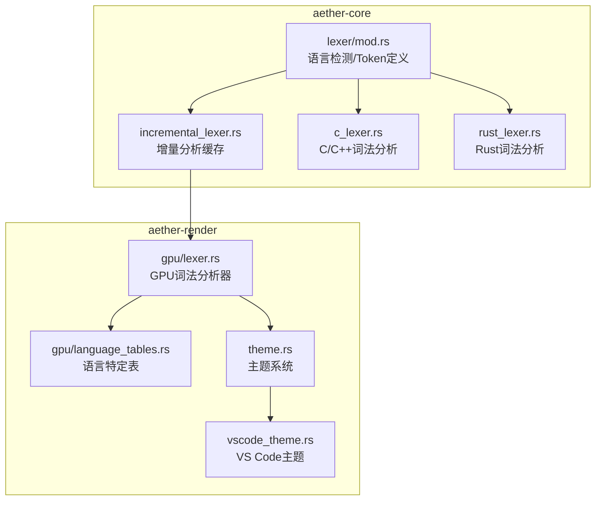
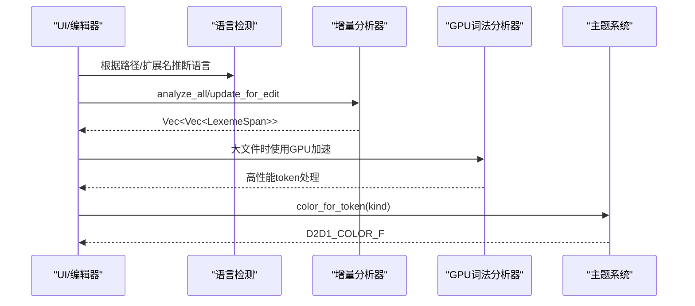
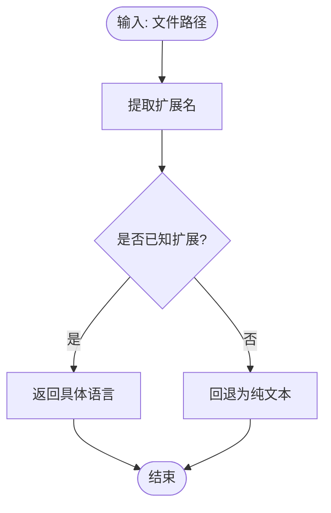
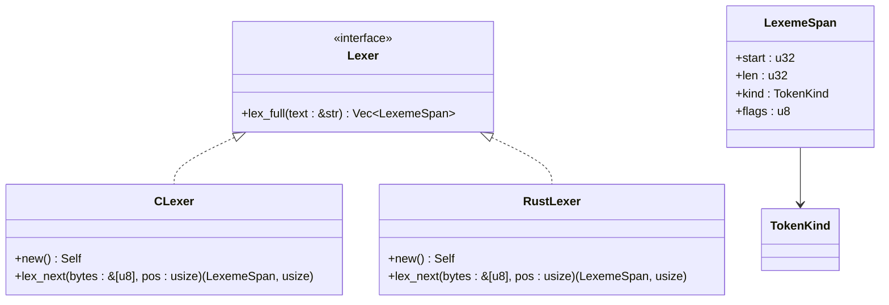
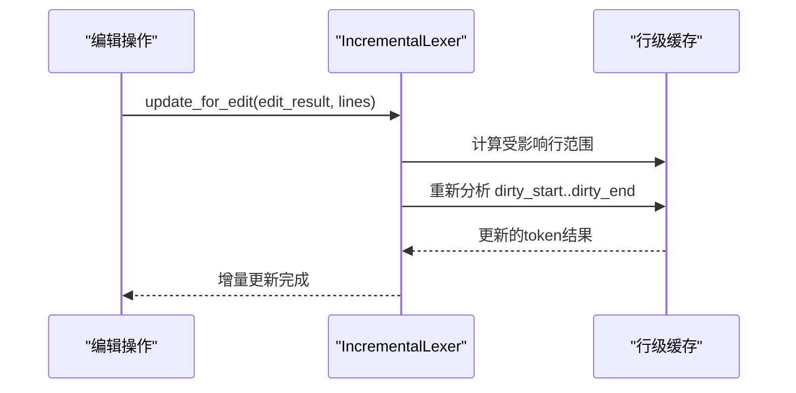
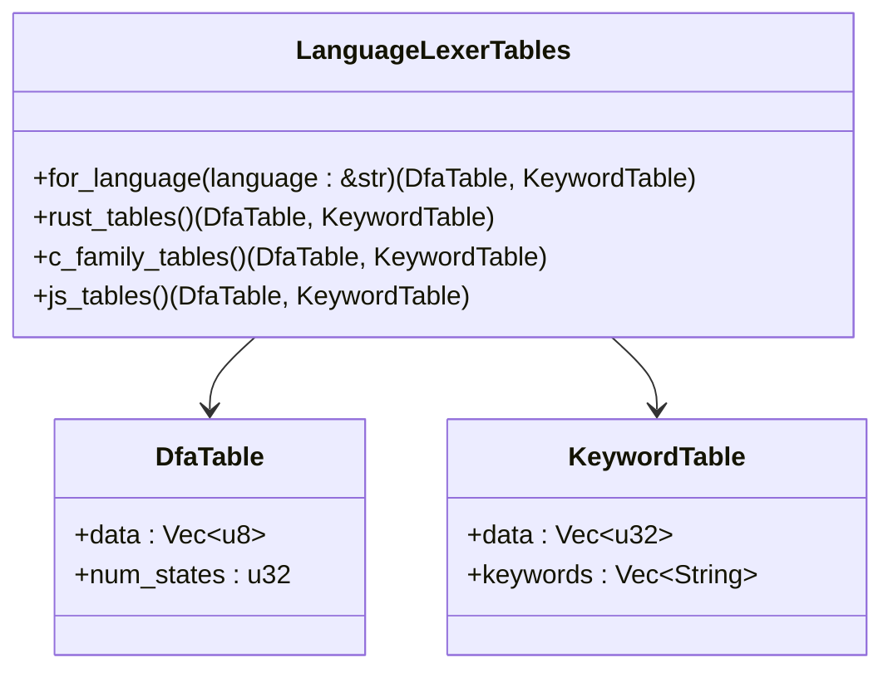
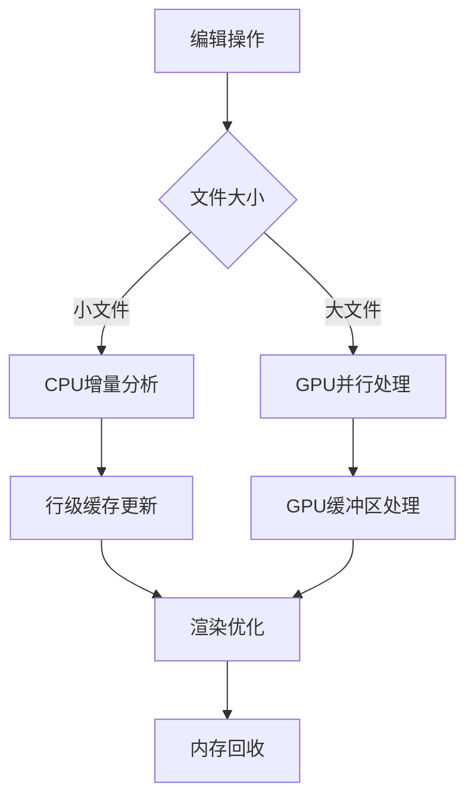

# 自定义词法分析与GPU加速高亮系统

<cite>
**本文引用的文件**
- [crates/aether-core/src/lexer/mod.rs](file://crates/aether-core/src/lexer/mod.rs)
- [crates/aether-core/src/incremental_lexer.rs](file://crates/aether-core/src/incremental_lexer.rs)
- [crates/aether-render/src/gpu/lexer.rs](file://crates/aether-render/src/gpu/lexer.rs)
- [crates/aether-render/src/gpu/language_tables.rs](file://crates/aether-render/src/gpu/language_tables.rs)
- [crates/aether-render/src/gpu/render.rs](file://crates/aether-render/src/gpu/render.rs)
- [crates/aether-render/src/theme.rs](file://crates/aether-render/src/theme.rs)
- [crates/aether-render/src/vscode_theme.rs](file://crates/aether-render/src/vscode_theme.rs)
- [crates/aether-core/src/lexer/c_lexer.rs](file://crates/aether-core/src/lexer/c_lexer.rs)
- [crates/aether-core/src/lexer/rust_lexer.rs](file://crates/aether-core/src/lexer/rust_lexer.rs)
</cite>

## 更新摘要
**所做更改**
- 完全移除 Tree-sitter 依赖，转向自定义词法分析器架构
- 实现 GPU 加速的高亮系统，使用 D3D11 Compute Shader 进行并行处理
- 构建多语言支持的语言特定 DFA 表和关键字哈希表
- 实现增量词法分析器，优化编辑性能
- 建立主题映射系统，支持 VS Code 主题格式
- 提供性能基准测试和内存管理优化

## 目录
1. [简介](#简介)
2. [项目结构](#项目结构)
3. [核心组件](#核心组件)
4. [架构总览](#架构总览)
5. [详细组件分析](#详细组件分析)
6. [GPU 加速实现](#gpu-加速实现)
7. [多语言支持](#多语言支持)
8. [性能与内存管理](#性能与内存管理)
9. [故障排查指南](#故障排查指南)
10. [结论](#结论)
11. [附录：扩展指南](#附录扩展指南)

## 简介
本文件面向牧羊人编辑器的自定义词法分析与GPU加速高亮系统，系统性阐述以下方面：
- 自定义词法分析器架构（替代 Tree-sitter）
- GPU 加速的高亮系统实现（D3D11 Compute Shader）
- 多语言支持机制（语言特定的 DFA 表和关键字表）
- 增量词法分析优化（编辑时只重新分析受影响行）
- 主题映射系统（VS Code 主题兼容）
- 性能调优与内存管理策略

## 项目结构
系统由两个主要部分组成：
- **aether-core**: 包含自定义词法分析器、增量分析和语言检测
- **aether-render**: 包含 GPU 加速渲染、主题系统和可视化

**图表来源**
- [crates/aether-core/src/lexer/mod.rs:94-196](file://crates/aether-core/src/lexer/mod.rs#L94-L196)
- [crates/aether-core/src/incremental_lexer.rs:8-16](file://crates/aether-core/src/incremental_lexer.rs#L8-L16)
- [crates/aether-render/src/gpu/lexer.rs:48-77](file://crates/aether-render/src/gpu/lexer.rs#L48-L77)
- [crates/aether-render/src/gpu/language_tables.rs:1-35](file://crates/aether-render/src/gpu/language_tables.rs#L1-L35)

## 核心组件
- **语言检测**: `Language` 枚举提供从文件扩展名到语言类型的映射
- **词法分析器**: 每个语言都有专门的 Lexer 实现，基于 DFA 算法
- **增量分析器**: `IncrementalLexer` 缓存每行 token，编辑时只重新分析受影响区域
- **GPU 词法分析器**: `GpuLexer` 使用 D3D11 Compute Shader 并行处理大文件
- **主题系统**: 将 TokenKind 映射为 D2D1_COLOR_F 颜色值
- **语言表生成器**: 为不同语言生成 DFA 状态转换表和关键字哈希表

**章节来源**
- [crates/aether-core/src/lexer/mod.rs:94-196](file://crates/aether-core/src/lexer/mod.rs#L94-L196)
- [crates/aether-core/src/incremental_lexer.rs:8-16](file://crates/aether-core/src/incremental_lexer.rs#L8-L16)
- [crates/aether-render/src/gpu/lexer.rs:48-77](file://crates/aether-render/src/gpu/lexer.rs#L48-L77)
- [crates/aether-render/src/theme.rs:7-31](file://crates/aether-render/src/theme.rs#L7-L31)

## 架构总览
整体数据流从"语言检测"开始，经"词法分析器"生成 Token 列表，再通过"GPU 加速"或"CPU 回退"进行处理，最后经"主题系统"转换为渲染颜色。

**图表来源**
- [crates/aether-core/src/lexer/mod.rs:113-196](file://crates/aether-core/src/lexer/mod.rs#L113-L196)
- [crates/aether-core/src/incremental_lexer.rs:28-101](file://crates/aether-core/src/incremental_lexer.rs#L28-L101)
- [crates/aether-render/src/gpu/lexer.rs:86-163](file://crates/aether-render/src/gpu/lexer.rs#L86-L163)
- [crates/aether-render/src/theme.rs:261-278](file://crates/aether-render/src/theme.rs#L261-L278)

## 详细组件分析

### 语言检测机制
- **扩展名匹配**: `Language::from_extension` 将扩展名映射到内部 Language 枚举
- **路径检测**: `Language::from_path` 从路径提取扩展名并调用 from_extension
- **优先级策略**: 按扩展名精确匹配，无匹配则回退 PlainText；HTML/CSS 等使用专用 lexer

**图表来源**
- [crates/aether-core/src/lexer/mod.rs:113-157](file://crates/aether-core/src/lexer/mod.rs#L113-L157)

**章节来源**
- [crates/aether-core/src/lexer/mod.rs:113-157](file://crates/aether-core/src/lexer/mod.rs#L113-L157)

### 自定义词法分析器架构
- **统一接口**: `Lexer` trait 定义了 `lex_full` 方法，所有语言实现统一接口
- **DFA 算法**: 基于确定性有限自动机的高效词法分析
- **语言特定实现**: C/C++、Rust、Python、JavaScript 等都有专门优化
- **Token 分类**: 统一的 `TokenKind` 枚举，支持关键字、字符串、注释、运算符等

**图表来源**
- [crates/aether-core/src/lexer/mod.rs:1-68](file://crates/aether-core/src/lexer/mod.rs#L1-L68)
- [crates/aether-core/src/lexer/c_lexer.rs:4-113](file://crates/aether-core/src/lexer/c_lexer.rs#L4-L113)
- [crates/aether-core/src/lexer/rust_lexer.rs:4-167](file://crates/aether-core/src/lexer/rust_lexer.rs#L4-L167)

**章节来源**
- [crates/aether-core/src/lexer/mod.rs:1-68](file://crates/aether-core/src/lexer/mod.rs#L1-L68)
- [crates/aether-core/src/lexer/c_lexer.rs:4-113](file://crates/aether-core/src/lexer/c_lexer.rs#L4-L113)
- [crates/aether-core/src/lexer/rust_lexer.rs:4-167](file://crates/aether-core/src/lexer/rust_lexer.rs#L4-L167)

### 增量词法分析器
- **行级缓存**: 使用 `Vec<Vec<LexemeSpan>>` 存储每行的 token 结果
- **智能失效**: 编辑后只重新分析受影响的行，避免全量重分析
- **版本控制**: 通过版本号跟踪缓存有效性
- **管理器**: `IncrementalLexerManager` 管理多个文件的 lexer 实例

**图表来源**
- [crates/aether-core/src/incremental_lexer.rs:36-101](file://crates/aether-core/src/incremental_lexer.rs#L36-L101)

**章节来源**
- [crates/aether-core/src/incremental_lexer.rs:36-101](file://crates/aether-core/src/incremental_lexer.rs#L36-L101)

## GPU 加速实现

### GPU 词法分析器架构
- **Compute Shader**: 使用 D3D11 Compute Shader 进行并行词法分析
- **DFA 表**: 预编译的 DFA 状态转换表存储在 GPU 内存中
- **关键字哈希表**: 完美哈希表用于快速关键字识别
- **工作缓冲区**: 字符分类、token 扫描、关键字查找的中间结果

**图表来源**
- [crates/aether-render/src/gpu/lexer.rs:86-163](file://crates/aether-render/src/gpu/lexer.rs#L86-L163)
- [crates/aether-render/src/gpu/lexer.rs:349-389](file://crates/aether-render/src/gpu/lexer.rs#L349-L389)

**章节来源**
- [crates/aether-render/src/gpu/lexer.rs:86-163](file://crates/aether-render/src/gpu/lexer.rs#L86-L163)
- [crates/aether-render/src/gpu/lexer.rs:349-389](file://crates/aether-render/src/gpu/lexer.rs#L349-L389)

### 语言特定表生成
- **DFA 表生成**: 为每种语言生成优化的状态转换表
- **关键字表构建**: 使用完美哈希算法提高查找效率
- **多语言支持**: Rust、C/C++、JavaScript、Python、Go、Java 等

**图表来源**
- [crates/aether-render/src/gpu/language_tables.rs:18-35](file://crates/aether-render/src/gpu/language_tables.rs#L18-L35)
- [crates/aether-render/src/gpu/language_tables.rs:6-16](file://crates/aether-render/src/gpu/language_tables.rs#L6-L16)

**章节来源**
- [crates/aether-render/src/gpu/language_tables.rs:18-35](file://crates/aether-render/src/gpu/language_tables.rs#L18-L35)

## 多语言支持

### 支持的编程语言
- **C/C++**: 完整的语法支持，包括预处理指令、模板、异常处理
- **Rust**: 生命周期、所有权、宏、泛型等特性
- **JavaScript/TypeScript**: ES6+ 语法、类型注解、模块系统
- **Python**: 动态类型、装饰器、异步语法
- **Go**: 并发原语、接口、包管理
- **Java**: 面向对象特性、泛型、注解
- **JSON/TOML**: 配置文件格式
- **Markdown/HTML/CSS**: 标记语言和样式

### 语言特定优化
- **关键字识别**: 每种语言都有优化的关键字表
- **语法模式**: 针对语言特性的特殊处理逻辑
- **性能调优**: 针对不同语言的 DFA 状态机优化

**章节来源**
- [crates/aether-core/src/lexer/mod.rs:94-111](file://crates/aether-core/src/lexer/mod.rs#L94-L111)
- [crates/aether-render/src/gpu/language_tables.rs:20-35](file://crates/aether-render/src/gpu/language_tables.rs#L20-L35)

## 性能与内存管理

### 性能优化策略
- **增量分析**: 编辑时只重新分析受影响行，避免全量重分析
- **GPU 加速**: 大文件使用 GPU 并行处理，提升解析速度
- **缓存策略**: 行级 token 缓存，减少重复计算
- **内存池**: 预分配缓冲区，减少内存分配开销

### 内存管理
- **缓冲区复用**: GPU 缓冲区在对象生命周期内保持活跃
- **缓存限制**: 最多缓存 32 个文件的 lexer 实例
- **资源释放**: 文件关闭时及时释放相关资源
- **内存监控**: 提供缓存统计信息用于调试

**图表来源**
- [crates/aether-core/src/incremental_lexer.rs:139-141](file://crates/aether-core/src/incremental_lexer.rs#L139-L141)
- [crates/aether-render/src/gpu/viewport.rs:297-323](file://crates/aether-render/src/gpu/viewport.rs#L297-L323)

**章节来源**
- [crates/aether-core/src/incremental_lexer.rs:139-141](file://crates/aether-core/src/incremental_lexer.rs#L139-L141)
- [crates/aether-render/src/gpu/viewport.rs:297-323](file://crates/aether-render/src/gpu/viewport.rs#L297-L323)

## 故障排查指南

### 常见问题诊断
- **语言检测失败**: 检查文件扩展名是否在支持列表中
- **GPU 初始化失败**: 确认 DirectX 11 环境正确配置
- **内存溢出**: 检查缓存限制和缓冲区大小设置
- **性能问题**: 分析增量分析命中率和 GPU 使用率

### 调试工具
- **性能基准测试**: 内置 benchmark 套件评估性能
- **缓存统计**: 查看增量分析的命中率
- **GPU 监控**: 监控 GPU 资源使用情况
- **日志输出**: 详细的错误信息和性能指标

**章节来源**
- [crates/aether-core/src/benchmarks.rs:271-334](file://crates/aether-core/src/benchmarks.rs#L271-L334)
- [crates/aether-core/src/incremental_lexer.rs:125-128](file://crates/aether-core/src/incremental_lexer.rs#L125-L128)

## 结论
牧羊人编辑器已成功从 Tree-sitter 迁移到自定义词法分析器和 GPU 加速方案，实现了：
- **高性能**: GPU 并行处理大幅提升大文件解析速度
- **低延迟**: 增量分析确保编辑响应性
- **多语言**: 支持主流编程语言的完整语法高亮
- **可扩展**: 模块化设计便于添加新语言支持
- **资源友好**: 智能缓存和内存管理优化资源使用

该架构为未来的功能扩展奠定了坚实基础，同时保持了优秀的性能和用户体验。

## 附录：扩展指南

### 添加新语言支持步骤
1. **实现 Lexer**: 创建新的词法分析器类，实现 `Lexer` trait
2. **注册语言**: 在 `Language` 枚举中添加新语言变体
3. **扩展名映射**: 在 `from_extension` 中添加扩展名到语言的映射
4. **GPU 表生成**: 在 `LanguageLexerTables` 中添加语言特定的 DFA 和关键字表
5. **主题映射**: 在主题系统中添加新语言的 Token 颜色映射

### 自定义高亮规则
- **Token 类型扩展**: 在 `TokenKind` 中添加新的 token 类型
- **颜色映射**: 在 `SyntaxColors` 中添加对应的颜色字段
- **主题适配**: 更新 VS Code 主题解析以支持新 token 类型

### 性能调优建议
- **调整 GPU 阈值**: 根据文件大小调整 GPU 使用的最小阈值
- **优化缓存策略**: 根据使用模式调整缓存大小和淘汰策略
- **并行度调优**: 调整 GPU 线程组大小以获得最佳性能

**章节来源**
- [crates/aether-core/src/lexer/mod.rs:94-196](file://crates/aether-core/src/lexer/mod.rs#L94-L196)
- [crates/aether-render/src/gpu/language_tables.rs:18-35](file://crates/aether-render/src/gpu/language_tables.rs#L18-L35)
- [crates/aether-render/src/theme.rs:33-86](file://crates/aether-render/src/theme.rs#L33-L86)