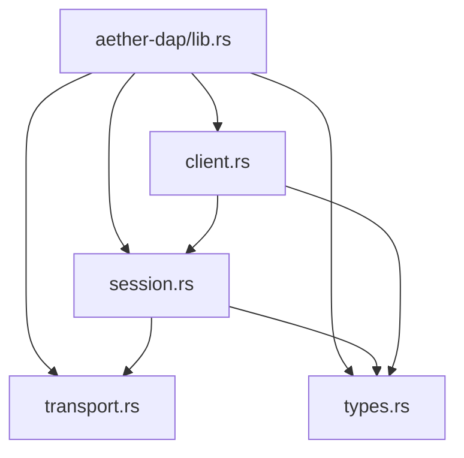
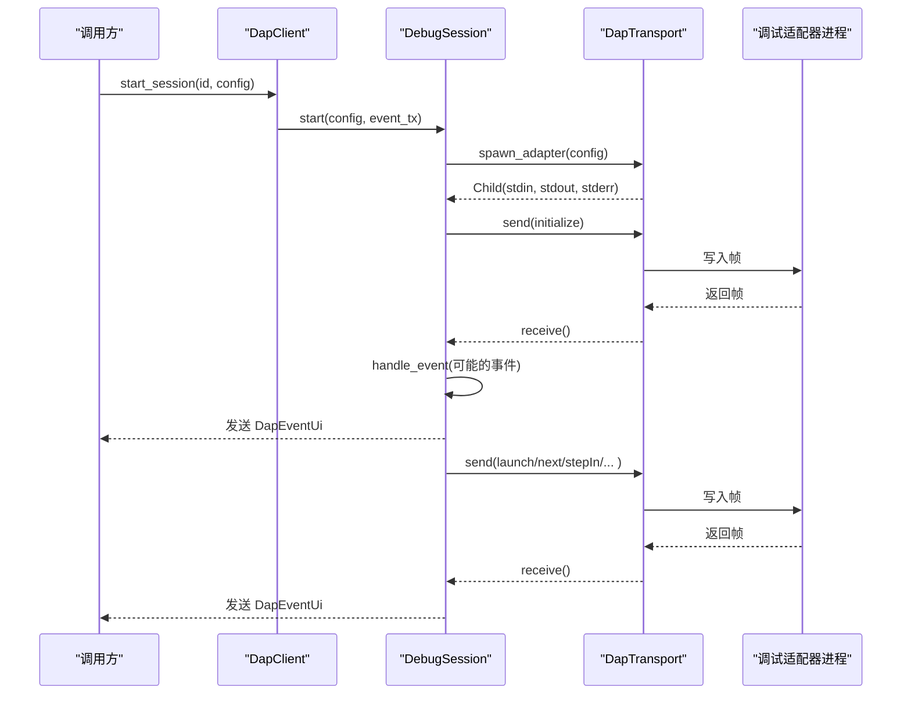
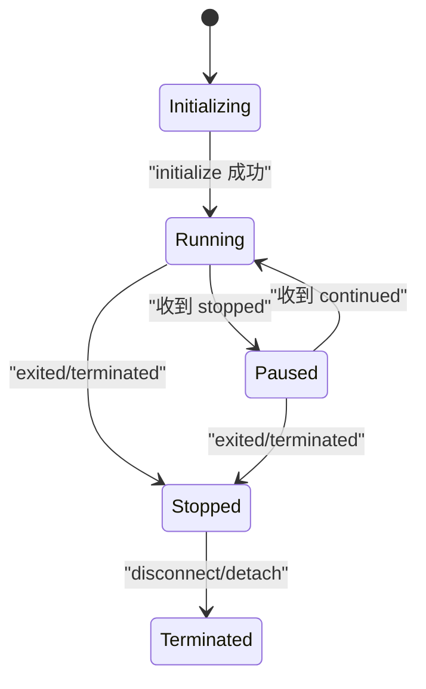
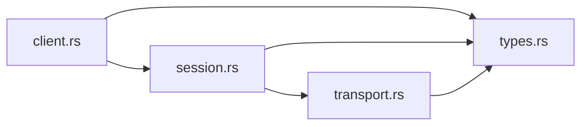

# DAP 客户端

<cite>
**本文引用的文件**
- [lib.rs](file://crates/aether-dap/src/lib.rs)
- [client.rs](file://crates/aether-dap/src/client.rs)
- [session.rs](file://crates/aether-dap/src/session.rs)
- [transport.rs](file://crates/aether-dap/src/transport.rs)
- [types.rs](file://crates/aether-dap/src/types.rs)
- [Cargo.toml](file://crates/aether-dap/Cargo.toml)
</cite>

## 目录
1. [简介](#简介)
2. [项目结构](#项目结构)
3. [核心组件](#核心组件)
4. [架构总览](#架构总览)
5. [详细组件分析](#详细组件分析)
6. [依赖关系分析](#依赖关系分析)
7. [性能与优化](#性能与优化)
8. [故障排除指南](#故障排除指南)
9. [结论](#结论)
10. [附录：协议消息示例与扩展指南](#附录协议消息示例与扩展指南)

## 简介
本技术文档面向调试适配器协议（DAP）客户端实现，聚焦于 aether-dap crate。内容涵盖调试会话管理、断点控制、变量监视、调试器连接建立与管理（进程启动、连接复用、异常处理）、调试事件处理机制（断点命中、单步执行、堆栈跟踪）、调试信息展示与用户交互流程、协议消息示例与错误处理策略，以及如何配置和扩展以支持不同调试器，并提供性能优化与故障排除建议。

## 项目结构
aether-dap crate 采用分层设计：
- types：定义 DAP 消息、数据结构与状态机类型
- transport：负责 JSON-RPC 帧的序列化/反序列化、Content-Length 头解析、子进程 I/O
- session：封装单个调试适配器的生命周期、请求-响应编排、事件分发与状态机
- client：多会话管理与默认适配器发现
- lib：对外暴露模块与公共类型



图表来源
- [lib.rs:1-8](file://crates/aether-dap/src/lib.rs#L1-L8)
- [client.rs:1-43](file://crates/aether-dap/src/client.rs#L1-L43)
- [session.rs:1-35](file://crates/aether-dap/src/session.rs#L1-L35)
- [transport.rs:1-16](file://crates/aether-dap/src/transport.rs#L1-L16)
- [types.rs:1-16](file://crates/aether-dap/src/types.rs#L1-L16)

章节来源
- [lib.rs:1-8](file://crates/aether-dap/src/lib.rs#L1-L8)
- [Cargo.toml:1-19](file://crates/aether-dap/Cargo.toml#L1-L19)

## 核心组件
- DapClient：多会话管理器，维护会话映射与事件通道，提供启动/停止/获取会话能力，并内置常见语言的默认适配器配置发现。
- DebugSession：单会话控制器，负责 initialize/launch/断点/执行控制/堆栈/作用域/变量/表达式求值/断开等完整流程；维护状态机与超时控制；派发 UI 事件。
- DapTransport：JSON-RPC 帧传输层，处理 Content-Length 头部读取、消息体大小限制、序列化/反序列化、子进程 stdin/stdout/stderr 管理。
- types：统一的数据模型，包括 DapMessage/DapRequest/DapResponse/DapEvent、Breakpoint/Source/StackFrame/Scope/Variable、DebugSessionState、DapEventUi、RequestIdGenerator、AdapterConfig。

章节来源
- [client.rs:7-43](file://crates/aether-dap/src/client.rs#L7-L43)
- [session.rs:23-35](file://crates/aether-dap/src/session.rs#L23-L35)
- [transport.rs:9-16](file://crates/aether-dap/src/transport.rs#L9-L16)
- [types.rs:4-16](file://crates/aether-dap/src/types.rs#L4-L16)

## 架构总览
整体流程：上层通过 DapClient 创建或获取 DebugSession；Session 使用 Transport 与外部调试适配器进程通信；Transport 负责子进程启动、I/O 读写与安全限制；Session 内部维护状态机，将 DAP 事件转换为 UI 事件并通过 mpsc 通道推送给调用方。



图表来源
- [client.rs:24-29](file://crates/aether-dap/src/client.rs#L24-L29)
- [session.rs:37-74](file://crates/aether-dap/src/session.rs#L37-L74)
- [transport.rs:118-142](file://crates/aether-dap/src/transport.rs#L118-L142)
- [session.rs:595-677](file://crates/aether-dap/src/session.rs#L595-L677)

## 详细组件分析

### 调试会话管理（DebugSession）
- 生命周期：Initializing → Running → Paused/Stopped → Terminated。状态变更由事件驱动，终止后忽略非终止类事件，避免“复活”。
- 初始化：发送 initialize 请求，等待响应；期间可接收事件并转发到 UI。
- 启动：launch 携带 program/args/cwd；成功后进入 Running。
- 执行控制：continue/next/stepIn/stepOut/pause 均通过通用简单请求方法发送，校验 success 字段。
- 数据查询：stackTrace/scopes/variables/evaluate 分别对应调用栈、作用域、变量、表达式求值。
- 断开/分离：disconnect 终止被调试进程；detach 保留被调试进程但释放调试器；两者均回收子进程与 stderr 任务。
- 超时：initialize/launch 使用更长超时；其他请求使用默认超时；所有请求在超时时返回错误。
- 事件处理：stopped/continued/exited/terminated/output/breakpoint 等事件更新状态并推送到 UI。



图表来源
- [session.rs:116-129](file://crates/aether-dap/src/session.rs#L116-L129)
- [session.rs:131-194](file://crates/aether-dap/src/session.rs#L131-L194)
- [session.rs:595-677](file://crates/aether-dap/src/session.rs#L595-L677)
- [session.rs:483-535](file://crates/aether-dap/src/session.rs#L483-L535)

章节来源
- [session.rs:37-194](file://crates/aether-dap/src/session.rs#L37-L194)
- [session.rs:196-481](file://crates/aether-dap/src/session.rs#L196-L481)
- [session.rs:483-677](file://crates/aether-dap/src/session.rs#L483-L677)

### 断点控制（setBreakpoints）
- 构造 setBreakpoints 请求参数，包含 source.path 与 breakpoints 列表（line）。
- 等待响应，解析 breakpoints 数组并返回；期间处理事件。
- 超时保护：默认请求超时。

```mermaid
flowchart TD
Start(["开始"]) --> BuildArgs["构建 setBreakpoints 参数"]
BuildArgs --> SendReq["发送请求"]
SendReq --> Loop{"接收消息"}
Loop --> |Response(command=setBreakpoints)| CheckSuccess{"success?"}
CheckSuccess --> |是| ParseBPs["解析 breakpoints"]
CheckSuccess --> |否| ReturnErr["返回错误"]
Loop --> |Event| HandleEvt["handle_event"]
HandleEvt --> Loop
ParseBPs --> End(["结束"])
ReturnErr --> End
```

图表来源
- [session.rs:196-253](file://crates/aether-dap/src/session.rs#L196-L253)

章节来源
- [session.rs:196-253](file://crates/aether-dap/src/session.rs#L196-L253)

### 变量监视与作用域（scopes/variables）
- scopes：按 frameId 获取作用域列表，用于后续变量展开。
- variables：按 variablesReference 获取变量集合，支持嵌套对象展开。
- 超时保护：默认请求超时。

章节来源
- [session.rs:332-424](file://crates/aether-dap/src/session.rs#L332-L424)

### 调试事件处理机制
- stopped：暂停状态，附带 reason 与 threadId，推送到 UI。
- continued：恢复运行，附带 threadId。
- exited/terminated：进程退出或调试器终止，清理资源并通知 UI。
- output：控制台输出，分类别推送。
- breakpoint：断点验证结果，回传给 UI。

章节来源
- [session.rs:595-677](file://crates/aether-dap/src/session.rs#L595-L677)

### 调试器连接建立与管理
- 进程启动：spawn_adapter 根据 AdapterConfig 启动外部调试适配器，设置 args/env/cwd，并捕获 stdin/stdout/stderr。
- 连接复用：当前实现为每会话独立进程；如需复用，可在上层缓存进程句柄并在会话间共享 Transport。
- 异常处理：
  - 传输层对 Content-Length 进行上限检查，防止 OOM。
  - 子进程 stderr 后台 drain，避免管道阻塞导致适配器卡死。
  - disconnect/detach 时强制回收子进程，防止僵尸进程。

章节来源
- [transport.rs:118-162](file://crates/aether-dap/src/transport.rs#L118-L162)
- [session.rs:483-535](file://crates/aether-dap/src/session.rs#L483-L535)

### 调试信息展示与用户交互
- 通过 DapEventUi 将底层事件抽象为 UI 友好的事件类型，包括停止原因、线程 ID、退出码、输出类别与内容、断点验证结果等。
- 上层订阅事件通道，渲染断点高亮、变量面板、控制台输出等。

章节来源
- [types.rs:126-153](file://crates/aether-dap/src/types.rs#L126-L153)
- [session.rs:595-677](file://crates/aether-dap/src/session.rs#L595-L677)

## 依赖关系分析
- aether-dap 依赖 tokio（process/io-util/sync/rt/macros/time）、serde/serde_json、tracing、thiserror 等。
- 模块耦合：
  - client 依赖 session 与 types。
  - session 依赖 transport 与 types。
  - transport 依赖 types。
  - types 无内部依赖。



图表来源
- [client.rs:1-43](file://crates/aether-dap/src/client.rs#L1-L43)
- [session.rs:1-35](file://crates/aether-dap/src/session.rs#L1-L35)
- [transport.rs:1-16](file://crates/aether-dap/src/transport.rs#L1-L16)
- [types.rs:1-16](file://crates/aether-dap/src/types.rs#L1-L16)

章节来源
- [Cargo.toml:6-15](file://crates/aether-dap/Cargo.toml#L6-L15)

## 性能与优化
- 传输层安全与稳定：
  - 最大消息体限制（64MB），防止恶意适配器导致内存耗尽。
  - 头部长度限制（8KB），防止畸形头攻击。
  - 后台 stderr drain，避免管道缓冲区满导致适配器阻塞。
- 超时控制：
  - initialize/launch 使用较长超时，适应慢速适配器初始化与编译。
  - 其他请求使用默认超时，避免长时间挂起。
- 资源回收：
  - disconnect/detach 时主动中止 stderr drain 任务，等待或强制 kill 子进程，避免僵尸进程。
- 可扩展性：
  - 通过 AdapterConfig 注入命令、参数、环境变量与工作目录，便于适配不同语言与工具链。
  - 默认适配器发现函数简化常用语言配置。

[本节为通用指导，不直接分析具体文件]

## 故障排除指南
- 无法启动适配器：
  - 检查 AdapterConfig.command 是否设置；未设置会返回无效输入错误。
  - 确认命令路径正确且具备执行权限。
- 初始化超时：
  - 检查网络/磁盘 IO 或编译器速度；必要时调整超时策略。
- 断点未生效：
  - 查看 breakpoint 事件中的 verified 字段与 message；确认源文件路径与行号匹配。
- 变量为空或加载缓慢：
  - 检查 expensive 标志；按需分页或延迟加载。
- 进程残留：
  - 确保调用 disconnect/detach；若适配器未自行退出，将触发强制 kill。
- 传输错误：
  - 关注 InvalidData 错误，通常来自 Content-Length 缺失、超大消息或 JSON 解析失败。

章节来源
- [transport.rs:40-93](file://crates/aether-dap/src/transport.rs#L40-L93)
- [session.rs:483-535](file://crates/aether-dap/src/session.rs#L483-L535)
- [session.rs:595-677](file://crates/aether-dap/src/session.rs#L595-L677)

## 结论
aether-dap 提供了稳健的 DAP 客户端实现，覆盖会话管理、断点控制、变量监视、事件处理与资源回收等关键能力。通过分层设计与严格的安全限制，能够在多种调试器环境下稳定工作。上层可通过 AdapterConfig 灵活扩展对不同语言与工具链的支持，并结合 UI 事件通道完成丰富的调试体验。

[本节为总结，不直接分析具体文件]

## 附录：协议消息示例与扩展指南

### 典型请求-响应序列
- initialize
  - 请求：type=request, command=initialize, arguments={clientID, clientName, adapterID, linesStartAt1, columnsStartAt1, supportsVariableType, locale}
  - 响应：type=response, command=initialize, success=true/false
- launch
  - 请求：type=request, command=launch, arguments={program, args, cwd?}
  - 响应：type=response, command=launch, success=true/false
- setBreakpoints
  - 请求：type=request, command=setBreakpoints, arguments={source:{path}, breakpoints:[{line}]}
  - 响应：type=response, command=setBreakpoints, body={breakpoints:[...]}
- stackTrace
  - 请求：type=request, command=stackTrace, arguments={threadId}
  - 响应：type=response, command=stackTrace, body={stackFrames:[...]}
- scopes
  - 请求：type=request, command=scopes, arguments={frameId}
  - 响应：type=response, command=scopes, body={scopes:[...]}
- variables
  - 请求：type=request, command=variables, arguments={variablesReference}
  - 响应：type=response, command=variables, body={variables:[...]}
- evaluate
  - 请求：type=request, command=evaluate, arguments={expression, context=repl, frameId?}
  - 响应：type=response, command=evaluate, body={result}

章节来源
- [session.rs:76-129](file://crates/aether-dap/src/session.rs#L76-L129)
- [session.rs:131-194](file://crates/aether-dap/src/session.rs#L131-L194)
- [session.rs:196-253](file://crates/aether-dap/src/session.rs#L196-L253)
- [session.rs:285-330](file://crates/aether-dap/src/session.rs#L285-L330)
- [session.rs:332-377](file://crates/aether-dap/src/session.rs#L332-L377)
- [session.rs:379-424](file://crates/aether-dap/src/session.rs#L379-L424)
- [session.rs:426-481](file://crates/aether-dap/src/session.rs#L426-L481)

### 事件类型
- stopped：reason, threadId
- continued：threadId
- exited：exitCode
- terminated：无 body
- output：category, output
- breakpoint：Breakpoint 对象

章节来源
- [types.rs:126-153](file://crates/aether-dap/src/types.rs#L126-L153)
- [session.rs:595-677](file://crates/aether-dap/src/session.rs#L595-L677)

### 错误处理策略
- 传输层：
  - 缺少 Content-Length：InvalidData
  - 超大消息：InvalidData（超过 64MB）
  - JSON 解析失败：InvalidData
- 会话层：
  - 请求失败：success=false 时返回错误，包含适配器消息
  - 超时：TimedOut，提示具体命令
- 进程管理：
  - 子进程未退出：超时后强制 kill，避免僵尸进程

章节来源
- [transport.rs:40-93](file://crates/aether-dap/src/transport.rs#L40-L93)
- [session.rs:542-593](file://crates/aether-dap/src/session.rs#L542-L593)
- [session.rs:483-535](file://crates/aether-dap/src/session.rs#L483-L535)

### 配置与扩展
- 默认适配器发现：
  - rust/c/cpp → lldb-dap
  - python → debugpy.adapter
  - javascript/typescript → node + node-debug2-adapter
- 自定义适配器：
  - 通过 AdapterConfig 指定 command/args/env/cwd/program
  - 在上层实现适配器注册表，按语言 ID 选择配置

章节来源
- [client.rs:45-71](file://crates/aether-dap/src/client.rs#L45-L71)
- [types.rs:55-63](file://crates/aether-dap/src/types.rs#L55-L63)