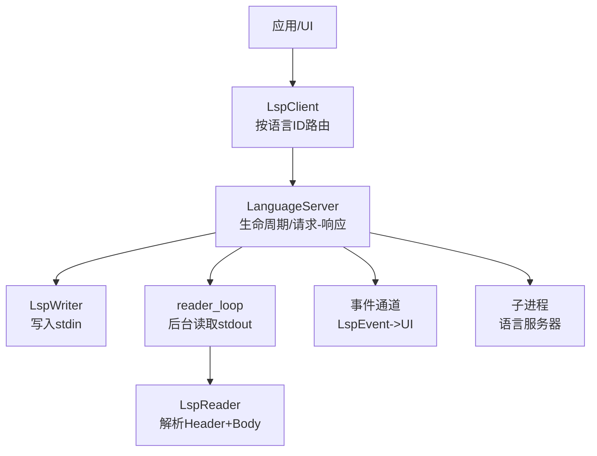
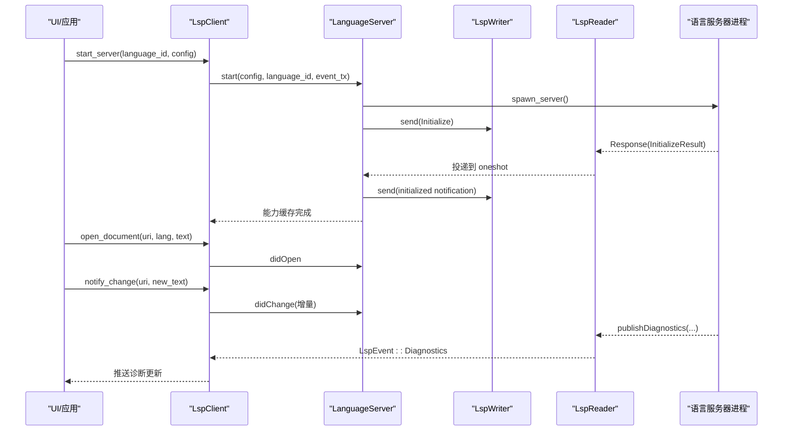
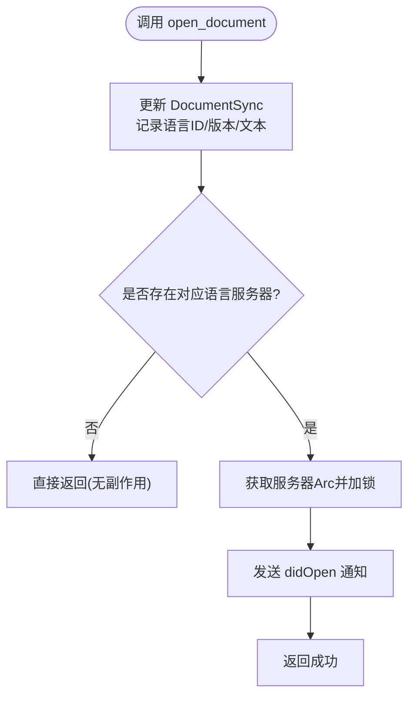
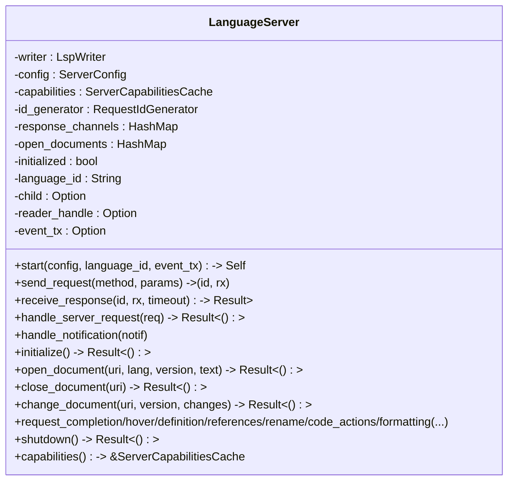
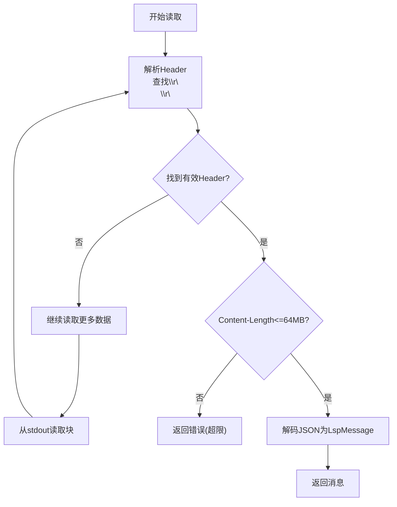
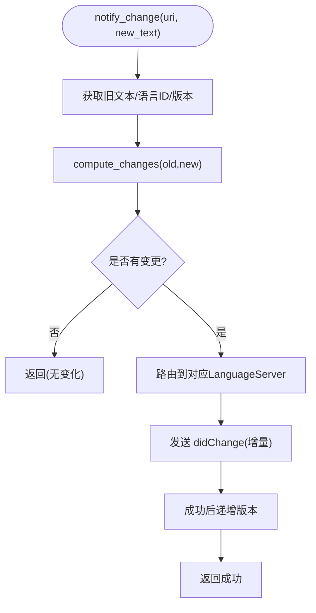
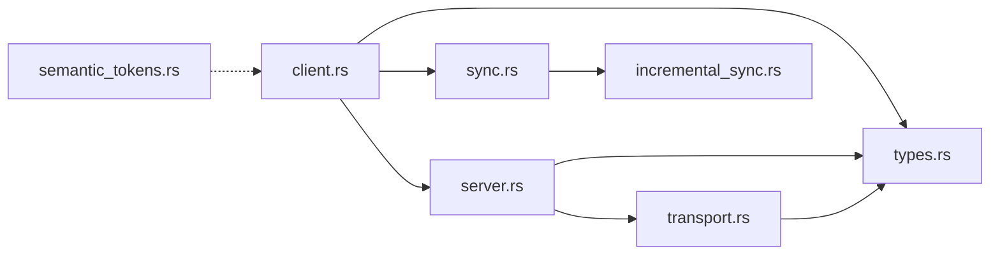

# LSP 客户端

<cite>
**本文引用的文件**
- [lib.rs](file://crates/aether-lsp/src/lib.rs)
- [client.rs](file://crates/aether-lsp/src/client.rs)
- [server.rs](file://crates/aether-lsp/src/server.rs)
- [transport.rs](file://crates/aether-lsp/src/transport.rs)
- [types.rs](file://crates/aether-lsp/src/types.rs)
- [sync.rs](file://crates/aether-lsp/src/sync.rs)
- [incremental_sync.rs](file://crates/aether-lsp/src/incremental_sync.rs)
- [semantic_tokens.rs](file://crates/aether-lsp/src/semantic_tokens.rs)
- [Cargo.toml](file://crates/aether-lsp/Cargo.toml)
</cite>

## 目录
1. [简介](#简介)
2. [项目结构](#项目结构)
3. [核心组件](#核心组件)
4. [架构总览](#架构总览)
5. [详细组件分析](#详细组件分析)
6. [依赖关系分析](#依赖关系分析)
7. [性能考虑](#性能考虑)
8. [故障排查指南](#故障排查指南)
9. [结论](#结论)
10. [附录](#附录)

## 简介
本技术文档面向 LSP（Language Server Protocol）客户端实现，聚焦于连接管理、消息路由与协议实现；语言服务器的启动、连接建立与生命周期管理；文档同步、代码补全、符号查找等请求处理机制；传输层（进程间 stdio 通信）的实现细节；以及配置扩展、性能优化与调试方法。该实现基于 Rust + Tokio 异步运行时，采用“主线程写 + 后台 reader 任务读”的解耦设计，确保高吞吐与低延迟的消息分发。

## 项目结构
aether-lsp crate 提供完整的 LSP 客户端能力，模块职责如下：
- lib.rs：模块导出与对外 API 入口
- client.rs：LspClient 管理器，负责多语言服务器实例管理与按语言ID路由请求
- server.rs：LanguageServer 单实例生命周期管理，封装 initialize、文档同步、各类请求与响应等待
- transport.rs：JSON-RPC over stdio 编码/解码、子进程启动、stderr 管道清理
- types.rs：LSP 消息类型、配置、能力缓存、ID 生成器等基础类型
- sync.rs：文档状态与增量变更计算（基于共同前缀/后缀的字符级 diff）
- incremental_sync.rs：高性能行索引、编辑合并、大文件策略等增量同步优化
- semantic_tokens.rs：语义令牌解码、映射与增量更新

图表来源
- [client.rs:11-25](file://crates/aether-lsp/src/client.rs#L11-L25)
- [server.rs:23-61](file://crates/aether-lsp/src/server.rs#L23-L61)
- [transport.rs:8-28](file://crates/aether-lsp/src/transport.rs#L8-L28)
- [transport.rs:110-160](file://crates/aether-lsp/src/transport.rs#L110-L160)

章节来源
- [lib.rs:1-16](file://crates/aether-lsp/src/lib.rs#L1-L16)
- [Cargo.toml:1-20](file://crates/aether-lsp/Cargo.toml#L1-L20)

## 核心组件
- LspClient：多语言服务器实例管理、文档同步协调、诊断缓存、事件推送、按语言ID路由请求到对应 LanguageServer
- LanguageServer：单个语言服务器实例的生命周期（启动→initialize→运行→关闭），请求-响应配对（oneshot channel），通知转发，能力缓存
- Transport：LspWriter/LspReader/LspTransport，实现 JSON-RPC over stdio 的编码/解码、Content-Length 校验、最大消息限制、子进程启动与 stderr 清理
- Types：LspMessage（Request/Response/Notification）、ServerConfig、DocumentState、RequestIdGenerator、ServerCapabilitiesCache
- Sync：DocumentSync 维护打开文档的状态与版本；compute_changes 计算增量变更
- Incremental Sync：FastLineIndex 高效 UTF-16 位置转换；IncrementalChangeCalculator.merge_edits 合并相邻编辑；LargeFileSyncStrategy 大文件策略
- Semantic Tokens：SemanticTokensDecoder 解码完整/增量令牌；类型与修饰符映射

章节来源
- [client.rs:11-25](file://crates/aether-lsp/src/client.rs#L11-L25)
- [server.rs:23-61](file://crates/aether-lsp/src/server.rs#L23-L61)
- [transport.rs:8-28](file://crates/aether-lsp/src/transport.rs#L8-L28)
- [types.rs:5-62](file://crates/aether-lsp/src/types.rs#L5-L62)
- [sync.rs:6-80](file://crates/aether-lsp/src/sync.rs#L6-L80)
- [incremental_sync.rs:9-94](file://crates/aether-lsp/src/incremental_sync.rs#L9-L94)
- [semantic_tokens.rs:3-16](file://crates/aether-lsp/src/semantic_tokens.rs#L3-L16)

## 架构总览
整体采用“请求-响应 + 通知”的双向消息模型：
- 出站：LspClient → LanguageServer → LspWriter → 子进程 stdin
- 入站：子进程 stdout → LspReader → reader_loop → 匹配 oneshot 或转发通知
- 能力协商：initialize 阶段声明客户端能力，后续按需调用各功能
- 文档同步：open/didOpen → didChange（增量）→ close/didClose
- 错误与超时：receive_response 使用超时保护，异常时清理 pending sender

图表来源
- [server.rs:63-124](file://crates/aether-lsp/src/server.rs#L63-L124)
- [server.rs:304-484](file://crates/aether-lsp/src/server.rs#L304-L484)
- [transport.rs:255-339](file://crates/aether-lsp/src/transport.rs#L255-L339)
- [client.rs:89-144](file://crates/aether-lsp/src/client.rs#L89-L144)

## 详细组件分析

### LspClient：多语言服务器管理与路由
- 管理多个 LanguageServer 实例，键为 language_id，每个实例用 tokio::sync::Mutex 包装以避免全局锁跨 await
- 维护 DocumentSync 跟踪文档状态与版本，用于增量同步
- 维护诊断缓存（DiagnosticCollection），支持快照查询与清空
- 通过 mpsc::UnboundedSender<LspEvent> 向 UI 推送事件（诊断、补全、悬停、引用、重命名、代码操作、格式化、语义令牌、内联提示、服务器就绪/退出/日志）
- 提供默认服务器配置发现（rust-analyzer、pylsp、typescript-language-server、clangd）

关键流程
- start_server：启动并初始化服务器，发送 ServerReady 事件，注册到 servers map
- open/close/notify_change：先更新本地 DocumentSync，再路由到对应 LanguageServer
- request_*：根据 uri 获取 language_id，路由到对应服务器执行请求
- shutdown_all/remove_server：优雅关闭所有服务器，清理诊断缓存

图表来源
- [client.rs:116-144](file://crates/aether-lsp/src/client.rs#L116-L144)

章节来源
- [client.rs:11-25](file://crates/aether-lsp/src/client.rs#L11-L25)
- [client.rs:89-144](file://crates/aether-lsp/src/client.rs#L89-L144)
- [client.rs:215-286](file://crates/aether-lsp/src/client.rs#L215-L286)
- [client.rs:288-567](file://crates/aether-lsp/src/client.rs#L288-L567)
- [client.rs:569-617](file://crates/aether-lsp/src/client.rs#L569-L617)
- [client.rs:620-653](file://crates/aether-lsp/src/client.rs#L620-L653)

### LanguageServer：生命周期与请求-响应
- 启动：spawn_server 创建子进程，分离 stdin/stdout/stderr，启动 stderr 清理任务，启动 reader_loop 后台任务
- initialize：发送 initialize 请求，设置客户端能力（工作区、文本文档、补全、悬停、定义、引用、重命名、代码操作、格式化、语义令牌、内联提示等），接收 InitializeResult 并缓存能力，随后发送 initialized 通知
- 文档同步：didOpen/didClose/didChange（增量）
- 请求封装：send_request 生成唯一 id 并注册 oneshot receiver；receive_response 等待响应或错误，支持超时清理
- 反向请求处理：handle_server_request 处理 workspace/configuration、client/registerCapability、workspace/applyEdit、workspace/workspaceFolders 等
- 通知转发：handle_notification 将服务器推送的通知转发到 UI 层
- 优雅关闭：shutdown 发送 shutdown 请求与 exit 通知，等待子进程退出，超时则 kill

图表来源
- [server.rs:23-61](file://crates/aether-lsp/src/server.rs#L23-L61)
- [server.rs:63-124](file://crates/aether-lsp/src/server.rs#L63-L124)
- [server.rs:140-216](file://crates/aether-lsp/src/server.rs#L140-L216)
- [server.rs:218-302](file://crates/aether-lsp/src/server.rs#L218-L302)
- [server.rs:304-484](file://crates/aether-lsp/src/server.rs#L304-L484)
- [server.rs:506-590](file://crates/aether-lsp/src/server.rs#L506-L590)
- [server.rs:592-800](file://crates/aether-lsp/src/server.rs#L592-L800)
- [server.rs:661-695](file://crates/aether-lsp/src/server.rs#L661-L695)

章节来源
- [server.rs:63-124](file://crates/aether-lsp/src/server.rs#L63-L124)
- [server.rs:140-216](file://crates/aether-lsp/src/server.rs#L140-L216)
- [server.rs:218-302](file://crates/aether-lsp/src/server.rs#L218-L302)
- [server.rs:304-484](file://crates/aether-lsp/src/server.rs#L304-L484)
- [server.rs:506-590](file://crates/aether-lsp/src/server.rs#L506-L590)
- [server.rs:592-800](file://crates/aether-lsp/src/server.rs#L592-L800)
- [server.rs:661-695](file://crates/aether-lsp/src/server.rs#L661-L695)

### 传输层：JSON-RPC over stdio
- LspWriter：仅持有 stdin，序列化消息并写入，flush 保证发送
- LspReader：独占 stdout，循环读取直到完整消息到达；解析 Header（Content-Length 校验，最大 64MB），解码 JSON
- LspTransport：兼容旧测试的双向封装
- encode_message：构造标准 LSP 头部与 JSON body
- spawn_server/build_command：构建命令、设置环境变量、Windows 下禁止控制台窗口
- probe_server_command：启动前探测二进制可用性（--version），避免 shim 导致的静默失败
- spawn_stderr_drain：后台持续读取 stderr，防止缓冲区满导致子进程阻塞

图表来源
- [transport.rs:110-209](file://crates/aether-lsp/src/transport.rs#L110-L209)
- [transport.rs:211-253](file://crates/aether-lsp/src/transport.rs#L211-L253)
- [transport.rs:255-339](file://crates/aether-lsp/src/transport.rs#L255-L339)
- [transport.rs:341-359](file://crates/aether-lsp/src/transport.rs#L341-L359)

章节来源
- [transport.rs:8-28](file://crates/aether-lsp/src/transport.rs#L8-L28)
- [transport.rs:30-108](file://crates/aether-lsp/src/transport.rs#L30-L108)
- [transport.rs:110-209](file://crates/aether-lsp/src/transport.rs#L110-L209)
- [transport.rs:211-253](file://crates/aether-lsp/src/transport.rs#L211-L253)
- [transport.rs:255-339](file://crates/aether-lsp/src/transport.rs#L255-L339)
- [transport.rs:341-359](file://crates/aether-lsp/src/transport.rs#L341-L359)

### 文档同步与增量计算
- DocumentSync：维护打开文档集合，支持 open/close/get_language_id/increment_version/update_text/is_open
- compute_changes：基于共同前缀/后缀的字节级 diff，超过阈值或变更过大时回退为全文替换；使用 FastLineIndex 将字节偏移转换为 LSP Position（UTF-16 码元计数）
- IncrementalChangeCalculator：从编辑操作直接生成变更；merge_edits 仅合并真正相邻的编辑（next.start == current.end），避免丢失中间文本
- OptimizedDocumentSync：记录编辑历史、批量发送、清理过期记录
- LargeFileSyncStrategy：大文件阈值判断、是否发送完整内容、同步延迟

图表来源
- [client.rs:215-286](file://crates/aether-lsp/src/client.rs#L215-L286)
- [sync.rs:82-148](file://crates/aether-lsp/src/sync.rs#L82-L148)
- [incremental_sync.rs:9-80](file://crates/aether-lsp/src/incremental_sync.rs#L9-L80)

章节来源
- [sync.rs:6-80](file://crates/aether-lsp/src/sync.rs#L6-L80)
- [sync.rs:82-148](file://crates/aether-lsp/src/sync.rs#L82-L148)
- [incremental_sync.rs:9-80](file://crates/aether-lsp/src/incremental_sync.rs#L9-L80)
- [incremental_sync.rs:96-190](file://crates/aether-lsp/src/incremental_sync.rs#L96-L190)
- [incremental_sync.rs:192-357](file://crates/aether-lsp/src/incremental_sync.rs#L192-L357)

### 语义令牌处理
- SemanticTokensDecoder：解码完整 token 数组与 delta 更新；支持增量编辑后的 token 列表合并
- 类型与修饰符映射：SemanticTokenTypeKind/SemanticTokenModifierKind 提供标准类型与位掩码检查
- map_tokens：将解码后的 token 映射为渲染可用信息（类型+修饰符+范围）

章节来源
- [semantic_tokens.rs:3-86](file://crates/aether-lsp/src/semantic_tokens.rs#L3-L86)
- [semantic_tokens.rs:88-264](file://crates/aether-lsp/src/semantic_tokens.rs#L88-L264)

## 依赖关系分析
- aether-lsp 依赖 lsp-types（LSP 类型定义）、serde/serde_json（序列化）、tokio/tokio-util（异步IO与进程）、bytes（缓冲）、tracing（日志）、thiserror（错误）
- 内部模块耦合：
  - client 依赖 server、sync、types
  - server 依赖 transport、types、client（事件类型）
  - transport 依赖 types（LspMessage）
  - sync 依赖 incremental_sync
  - semantic_tokens 独立，供上层渲染使用

图表来源
- [lib.rs:1-16](file://crates/aether-lsp/src/lib.rs#L1-L16)
- [Cargo.toml:6-16](file://crates/aether-lsp/Cargo.toml#L6-L16)

章节来源
- [Cargo.toml:6-16](file://crates/aether-lsp/Cargo.toml#L6-L16)
- [lib.rs:1-16](file://crates/aether-lsp/src/lib.rs#L1-L16)

## 性能考虑
- 并发与锁粒度：每个 LanguageServer 使用独立的 tokio::sync::Mutex，避免全局 RwLock 跨 await 持有，减少锁竞争
- 增量同步：compute_changes 对大文件或大范围变更回退为全文替换，避免无效增量；FastLineIndex 提供 O(log n) 行查找与 UTF-16 位置转换
- 编辑合并：merge_edits 仅合并真正相邻的编辑，减少消息数量且避免数据丢失
- 传输层保护：Header 大小限制（8KB）、Content-Length 上限（64MB），防止恶意或异常消息导致 OOM
- 超时控制：默认请求超时 30s，initialize 允许更长（60s），避免长时间阻塞
- 子进程 stderr 清理：后台任务持续读取 stderr，避免管道缓冲区满导致服务器阻塞
- 诊断缓存：按 URI 聚合诊断，支持快照读取，避免长期持有锁

[本节为通用性能指导，不直接分析具体文件]

## 故障排查指南
常见问题与定位方法：
- 服务器无法启动或静默退出：
  - 使用 probe_server_command 在启动前验证二进制可用性（--version）
  - 检查 build_command 参数与环境变量是否正确
  - 确认 spawn_stderr_drain 已启动，避免 stderr 阻塞
- 请求超时：
  - 检查 receive_response 超时设置与服务器处理能力
  - 查看 response_channels 中是否残留未清理的 sender（超时路径会移除）
- 诊断未显示：
  - 确认 handle_notification 已转发通知到 event_tx
  - 检查 LspEvent::Diagnostics 是否被 UI 消费
- 文档不同步：
  - 核对 DocumentSync 版本递增时机（H-09：发送成功后才递增）
  - 验证 compute_changes 是否产生有效增量或回退为全文
- 语义令牌异常：
  - 检查 SemanticTokensDecoder 解码逻辑与 delta 应用顺序（逆序应用 edits）

章节来源
- [transport.rs:255-306](file://crates/aether-lsp/src/transport.rs#L255-L306)
- [server.rs:170-216](file://crates/aether-lsp/src/server.rs#L170-L216)
- [server.rs:218-302](file://crates/aether-lsp/src/server.rs#L218-L302)
- [client.rs:215-286](file://crates/aether-lsp/src/client.rs#L215-L286)
- [semantic_tokens.rs:52-86](file://crates/aether-lsp/src/semantic_tokens.rs#L52-L86)

## 结论
该 LSP 客户端实现了健壮的连接管理、消息路由与协议处理，具备完善的生命周期管理、增量同步、语义令牌支持与传输层安全限制。通过模块化设计与异步并发模型，能够在多语言服务器场景下稳定运行。建议在生产环境中结合探针检测、超时保护与日志追踪进行监控与调优。

[本节为总结性内容，不直接分析具体文件]

## 附录

### 配置与扩展
- 新增语言服务器：
  - 在 default_server_config 中添加语言ID到可执行文件的映射
  - 必要时调整 args/env/root_uri/initialization_options
- 扩展能力：
  - 在 initialize 中声明新的客户端能力（如特定 feature）
  - 在 server.rs 中实现对应的 request_* 方法与参数构造
- 自定义传输：
  - 通过 LspTransport::new_generic 注入自定义 AsyncRead/AsyncWrite 对进行测试或替代实现

章节来源
- [client.rs:620-653](file://crates/aether-lsp/src/client.rs#L620-L653)
- [server.rs:304-484](file://crates/aether-lsp/src/server.rs#L304-L484)
- [transport.rs:51-64](file://crates/aether-lsp/src/transport.rs#L51-L64)

### 协议消息示例（路径引用）
- initialize 请求与初始化选项构造：[server.rs:304-484](file://crates/aether-lsp/src/server.rs#L304-L484)
- didOpen/didClose/didChange 通知构造：[server.rs:506-590](file://crates/aether-lsp/src/server.rs#L506-L590)
- 请求封装与响应等待：[server.rs:140-216](file://crates/aether-lsp/src/server.rs#L140-L216)
- JSON-RPC over stdio 编码/解码：[transport.rs:211-253](file://crates/aether-lsp/src/transport.rs#L211-L253)

### 调试方法
- 启用 tracing 日志（依赖已在 Cargo.toml 中声明）
- 使用 probe_server_command 验证二进制可用性
- 通过 LspEvent::Log 捕获服务器输出与状态
- 在 reader_loop 与 receive_response 中增加日志以定位消息流问题

章节来源
- [Cargo.toml:6-16](file://crates/aether-lsp/Cargo.toml#L6-L16)
- [transport.rs:255-306](file://crates/aether-lsp/src/transport.rs#L255-L306)
- [server.rs:218-302](file://crates/aether-lsp/src/server.rs#L218-L302)