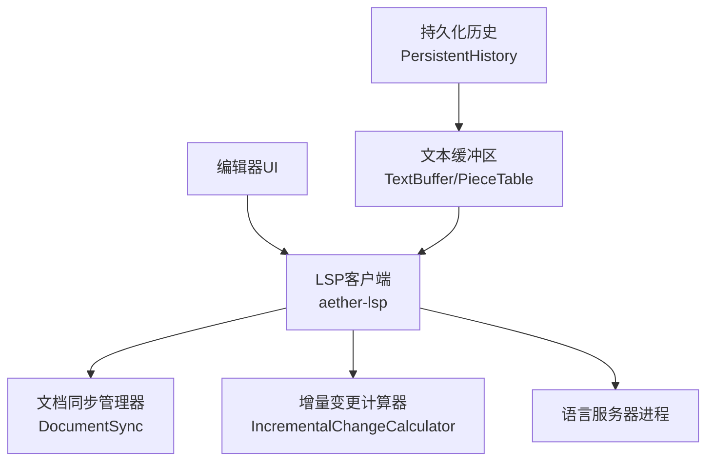
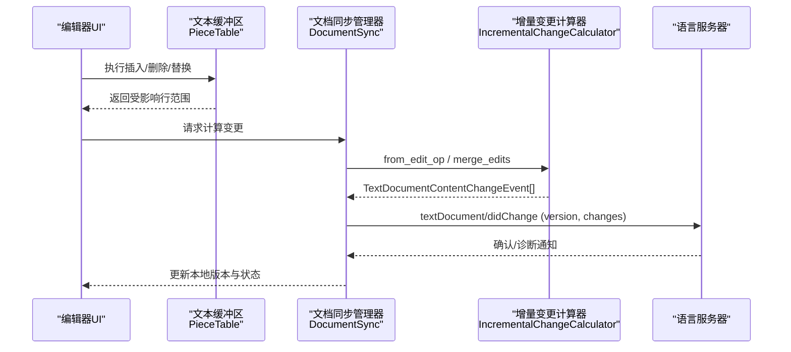
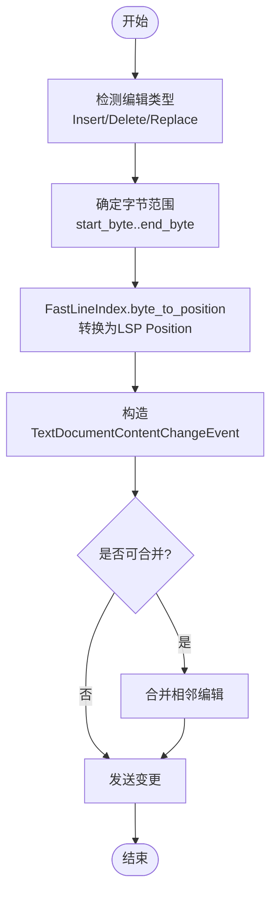
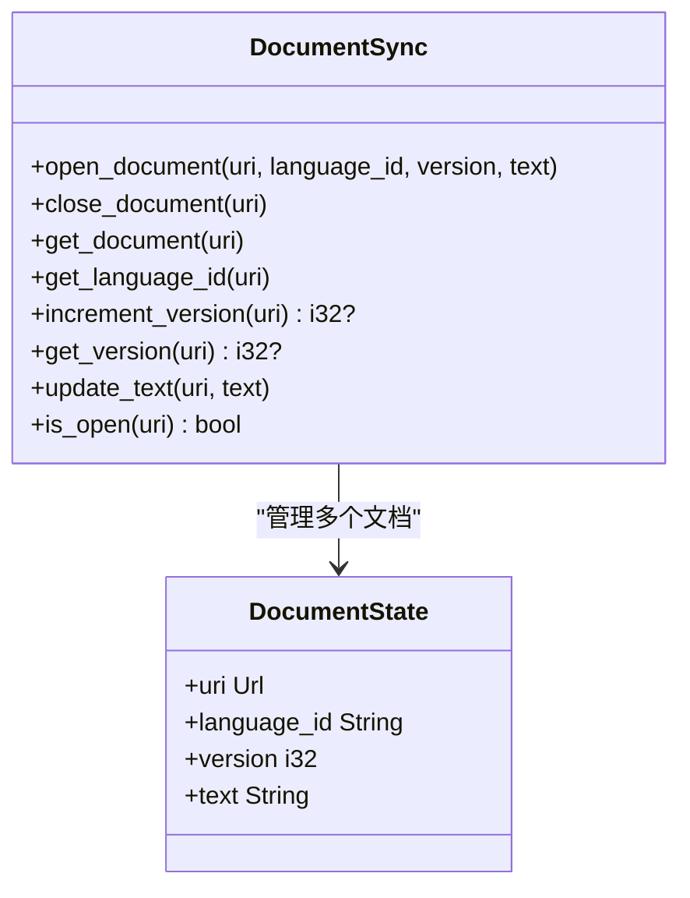
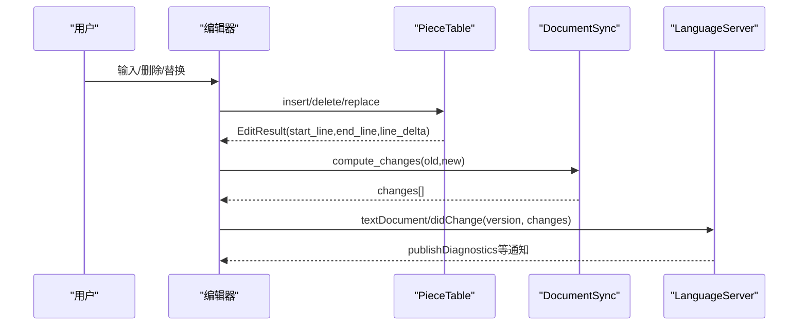
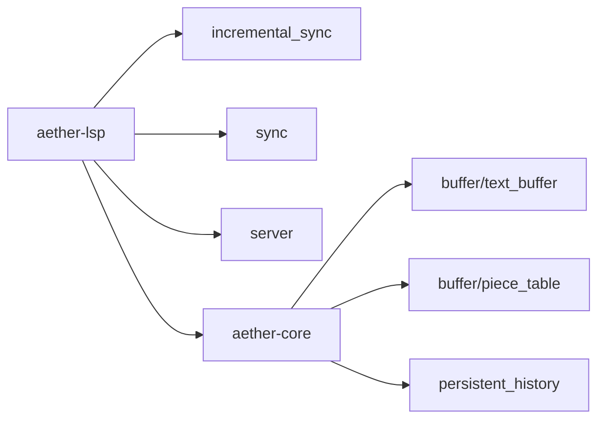

# 文档同步

<cite>
**本文引用的文件**
- [incremental_sync.rs](file://crates/aether-lsp/src/incremental_sync.rs)
- [sync.rs](file://crates/aether-lsp/src/sync.rs)
- [server.rs](file://crates/aether-lsp/src/server.rs)
- [text_buffer.rs](file://crates/aether-core/src/buffer/text_buffer.rs)
- [piece_table.rs](file://crates/aether-core/src/buffer/piece_table.rs)
- [persistent_history.rs](file://crates/aether-core/src/persistent_history.rs)
</cite>

## 目录
1. [简介](#简介)
2. [项目结构](#项目结构)
3. [核心组件](#核心组件)
4. [架构总览](#架构总览)
5. [详细组件分析](#详细组件分析)
6. [依赖关系分析](#依赖关系分析)
7. [性能考量](#性能考量)
8. [故障排查指南](#故障排查指南)
9. [结论](#结论)
10. [附录](#附录)

## 简介
本技术文档围绕“文档同步系统”展开，重点解释增量同步算法的实现（文本变更检测、差异计算与高效更新）、文档状态管理（版本控制、变更跟踪与冲突解决）、从用户编辑到语言服务器响应的完整链路、不同同步策略的选择与应用场景、同步消息示例与性能优化技巧，以及大文件和复杂文档的同步处理、故障恢复与数据一致性保证。

## 项目结构
与文档同步相关的代码主要分布在以下模块：
- LSP 层：负责与语言服务器通信、发送/接收文档同步消息、维护打开文档的状态与版本。
- 缓冲区层：提供高性能文本存储与编辑能力（PieceTable），支持高效的行索引、增量更新与快照。
- 历史与版本：提供持久化历史、撤销/重做与版本快照能力。

图表来源
- [server.rs:506-590](file://crates/aether-lsp/src/server.rs#L506-L590)
- [sync.rs:6-80](file://crates/aether-lsp/src/sync.rs#L6-L80)
- [incremental_sync.rs:3-80](file://crates/aether-lsp/src/incremental_sync.rs#L3-L80)
- [text_buffer.rs:1-49](file://crates/aether-core/src/buffer/text_buffer.rs#L1-L49)
- [piece_table.rs:11-35](file://crates/aether-core/src/buffer/piece_table.rs#L11-L35)
- [persistent_history.rs:79-115](file://crates/aether-core/src/persistent_history.rs#L79-L115)

章节来源
- [server.rs:506-590](file://crates/aether-lsp/src/server.rs#L506-L590)
- [sync.rs:6-80](file://crates/aether-lsp/src/sync.rs#L6-L80)
- [incremental_sync.rs:3-80](file://crates/aether-lsp/src/incremental_sync.rs#L3-L80)
- [text_buffer.rs:1-49](file://crates/aether-core/src/buffer/text_buffer.rs#L1-L49)
- [piece_table.rs:11-35](file://crates/aether-core/src/buffer/piece_table.rs#L11-L35)
- [persistent_history.rs:79-115](file://crates/aether-core/src/persistent_history.rs#L79-L115)

## 核心组件
- 增量变更计算器：基于编辑操作直接生成 LSP 增量变更，避免全文对比；支持相邻编辑合并以减少消息数量。
- 快速行索引：将字节偏移转换为 LSP Position（UTF-16 码元计数），支持 O(log n) 行查找。
- 文档同步管理器：维护已打开文档的状态、语言ID、版本和文本内容，并计算增量变更。
- 文本缓冲区（PieceTable）：高性能文本存储，支持 O(1) 插入/删除、零拷贝大文件打开、增量行索引更新与不可变快照。
- 持久化历史：记录版本快照、支持撤销/重做、批量操作合并与容量限制。

章节来源
- [incremental_sync.rs:3-80](file://crates/aether-lsp/src/incremental_sync.rs#L3-L80)
- [incremental_sync.rs:89-190](file://crates/aether-lsp/src/incremental_sync.rs#L89-L190)
- [sync.rs:6-80](file://crates/aether-lsp/src/sync.rs#L6-L80)
- [text_buffer.rs:1-49](file://crates/aether-core/src/buffer/text_buffer.rs#L1-L49)
- [piece_table.rs:11-35](file://crates/aether-core/src/buffer/piece_table.rs#L11-L35)
- [persistent_history.rs:79-115](file://crates/aether-core/src/persistent_history.rs#L79-L115)

## 架构总览
下图展示了从用户编辑到语言服务器的完整同步流程，包括增量变更计算、版本管理与消息发送。

图表来源
- [server.rs:562-590](file://crates/aether-lsp/src/server.rs#L562-L590)
- [incremental_sync.rs:9-80](file://crates/aether-lsp/src/incremental_sync.rs#L9-L80)
- [sync.rs:82-148](file://crates/aether-lsp/src/sync.rs#L82-L148)
- [piece_table.rs:450-562](file://crates/aether-core/src/buffer/piece_table.rs#L450-L562)

## 详细组件分析

### 增量同步算法
- 文本变更检测：通过 PieceTable 的编辑操作（插入/删除/替换）直接获取受影响的字节范围，无需全文对比。
- 差异计算：使用 FastLineIndex 将字节偏移转换为 LSP Position（UTF-16 码元计数），确保位置准确。
- 高效更新：对相邻编辑进行合并，减少 LSP 消息数量；对大文件或大范围变更回退为全文替换以提升效率。

图表来源
- [incremental_sync.rs:9-80](file://crates/aether-lsp/src/incremental_sync.rs#L9-L80)
- [incremental_sync.rs:89-190](file://crates/aether-lsp/src/incremental_sync.rs#L89-L190)
- [sync.rs:82-148](file://crates/aether-lsp/src/sync.rs#L82-L148)

章节来源
- [incremental_sync.rs:9-80](file://crates/aether-lsp/src/incremental_sync.rs#L9-L80)
- [incremental_sync.rs:89-190](file://crates/aether-lsp/src/incremental_sync.rs#L89-L190)
- [sync.rs:82-148](file://crates/aether-lsp/src/sync.rs#L82-L148)

### 文档状态管理
- 版本控制：每个文档维护递增版本号，用于 LSP 协议中的版本标识。
- 变更跟踪：记录编辑历史（版本、字节范围、文本、时间戳），支持按版本过滤生成变更。
- 冲突解决：当变更过大或无法精确合并时，回退为全文替换；在客户端侧保持版本一致，失败时不递增版本以避免失步。

图表来源
- [sync.rs:6-80](file://crates/aether-lsp/src/sync.rs#L6-L80)

章节来源
- [sync.rs:6-80](file://crates/aether-lsp/src/sync.rs#L6-L80)

### 完整同步流程（从用户编辑到语言服务器响应）
- 用户在编辑器中触发编辑操作。
- 文本缓冲区应用编辑并返回受影响行范围。
- 同步管理器根据编辑操作生成增量变更。
- 通过 LSP 客户端发送 didChange 通知至语言服务器。
- 语言服务器可能返回诊断或其他通知，客户端转发至 UI。

图表来源
- [piece_table.rs:450-562](file://crates/aether-core/src/buffer/piece_table.rs#L450-L562)
- [sync.rs:82-148](file://crates/aether-lsp/src/sync.rs#L82-L148)
- [server.rs:562-590](file://crates/aether-lsp/src/server.rs#L562-L590)

章节来源
- [piece_table.rs:450-562](file://crates/aether-core/src/buffer/piece_table.rs#L450-L562)
- [sync.rs:82-148](file://crates/aether-lsp/src/sync.rs#L82-L148)
- [server.rs:562-590](file://crates/aether-lsp/src/server.rs#L562-L590)

### 同步策略选择与应用场景
- 小文件/小变更：使用增量同步，精确到字节范围，减少传输量。
- 大文件/大范围变更：当变更超过原文本一定比例或文件大小超过阈值时，回退为全文替换。
- 批量编辑：合并相邻编辑，减少消息数量，提高吞吐。

章节来源
- [sync.rs:82-148](file://crates/aether-lsp/src/sync.rs#L82-L148)
- [incremental_sync.rs:33-80](file://crates/aether-lsp/src/incremental_sync.rs#L33-L80)

### 同步消息示例
- didOpen：打开文档，包含 URI、语言ID、版本、全文。
- didChange：变更文档，包含 URI、版本、变更数组（range、range_length、text）。
- didClose：关闭文档，包含 URI。

章节来源
- [server.rs:506-590](file://crates/aether-lsp/src/server.rs#L506-L590)

### 大文件与复杂文档处理
- 内存映射：大文件打开时使用内存映射，避免全量加载。
- 零拷贝读取：优先使用零拷贝路径读取行或字节范围。
- 增量行索引：编辑后仅更新受影响行的起始偏移，避免全量重建。
- 前缀和缓存：加速 piece 定位与长度查询。

章节来源
- [piece_table.rs:408-448](file://crates/aether-core/src/buffer/piece_table.rs#L408-L448)
- [piece_table.rs:710-741](file://crates/aether-core/src/buffer/piece_table.rs#L710-L741)
- [piece_table.rs:946-1023](file://crates/aether-core/src/buffer/piece_table.rs#L946-L1023)
- [piece_table.rs:881-932](file://crates/aether-core/src/buffer/piece_table.rs#L881-L932)

### 故障恢复与数据一致性
- 版本一致性：发送成功后再递增版本，避免失败导致版本失步。
- 历史合并：批量操作合并为一次历史记录，减少开销。
- 容量限制：历史容量有限，溢出时保留最新版本与可撤销能力。
- 边界保护：删除区间钳位，防止越界损坏数据结构。

章节来源
- [client.rs:229-266](file://crates/aether-lsp/src/client.rs#L229-L266)
- [persistent_history.rs:79-115](file://crates/aether-core/src/persistent_history.rs#L79-L115)
- [piece_table.rs:569-688](file://crates/aether-core/src/buffer/piece_table.rs#L569-L688)

## 依赖关系分析
- LSP 层依赖增量变更计算器与快速行索引以生成准确的变更事件。
- 文本缓冲区提供底层编辑能力，上层同步逻辑依赖其返回的受影响行范围。
- 持久化历史为撤销/重做与版本快照提供支持。

图表来源
- [incremental_sync.rs:1-80](file://crates/aether-lsp/src/incremental_sync.rs#L1-L80)
- [sync.rs:1-80](file://crates/aether-lsp/src/sync.rs#L1-L80)
- [server.rs:1-61](file://crates/aether-lsp/src/server.rs#L1-L61)
- [text_buffer.rs:1-49](file://crates/aether-core/src/buffer/text_buffer.rs#L1-L49)
- [piece_table.rs:1-35](file://crates/aether-core/src/buffer/piece_table.rs#L1-L35)
- [persistent_history.rs:79-115](file://crates/aether-core/src/persistent_history.rs#L79-L115)

章节来源
- [incremental_sync.rs:1-80](file://crates/aether-lsp/src/incremental_sync.rs#L1-L80)
- [sync.rs:1-80](file://crates/aether-lsp/src/sync.rs#L1-L80)
- [server.rs:1-61](file://crates/aether-lsp/src/server.rs#L1-L61)
- [text_buffer.rs:1-49](file://crates/aether-core/src/buffer/text_buffer.rs#L1-L49)
- [piece_table.rs:1-35](file://crates/aether-core/src/buffer/piece_table.rs#L1-L35)
- [persistent_history.rs:79-115](file://crates/aether-core/src/persistent_history.rs#L79-L115)

## 性能考量
- 增量同步优于全文对比，尤其在频繁小编辑场景。
- 相邻编辑合并减少网络与序列化开销。
- 大文件使用内存映射与零拷贝读取，降低内存占用与复制成本。
- 行索引增量更新避免全量重建，提升编辑响应速度。
- 前缀和缓存加速 piece 定位与长度查询。

[本节为通用性能指导，不直接分析具体文件]

## 故障排查指南
- 版本失步：检查是否在发送成功后才递增版本，避免失败后版本不一致。
- 变更丢失：确认相邻编辑合并条件严格（next.start == current.end），避免合并非相邻编辑导致中间文本丢失。
- 大文件卡顿：检查是否回退为全文替换，或是否存在全量字符串拼接。
- 行索引不一致：验证删除区间钳位与行索引增量更新逻辑，确保边界正确。

章节来源
- [client.rs:229-266](file://crates/aether-lsp/src/client.rs#L229-L266)
- [incremental_sync.rs:33-80](file://crates/aether-lsp/src/incremental_sync.rs#L33-L80)
- [sync.rs:82-148](file://crates/aether-lsp/src/sync.rs#L82-L148)
- [piece_table.rs:569-688](file://crates/aether-core/src/buffer/piece_table.rs#L569-L688)

## 结论
该文档同步系统通过增量变更计算、快速行索引转换、高效文本缓冲区与版本管理机制，实现了从用户编辑到语言服务器响应的低延迟、高吞吐同步流程。针对大文件与复杂文档，采用内存映射、零拷贝与增量行索引等技术保障性能。同时，通过版本一致性、历史合并与边界保护机制，确保数据一致性与故障恢复能力。

[本节为总结性内容，不直接分析具体文件]

## 附录
- LSP 同步相关方法：didOpen、didChange、didClose。
- 关键数据结构：DocumentState、EditRecord、Piece、LineIndex。
- 性能优化点：相邻编辑合并、大文件回退策略、前缀和缓存、增量行索引更新。

[本节为补充信息，不直接分析具体文件]