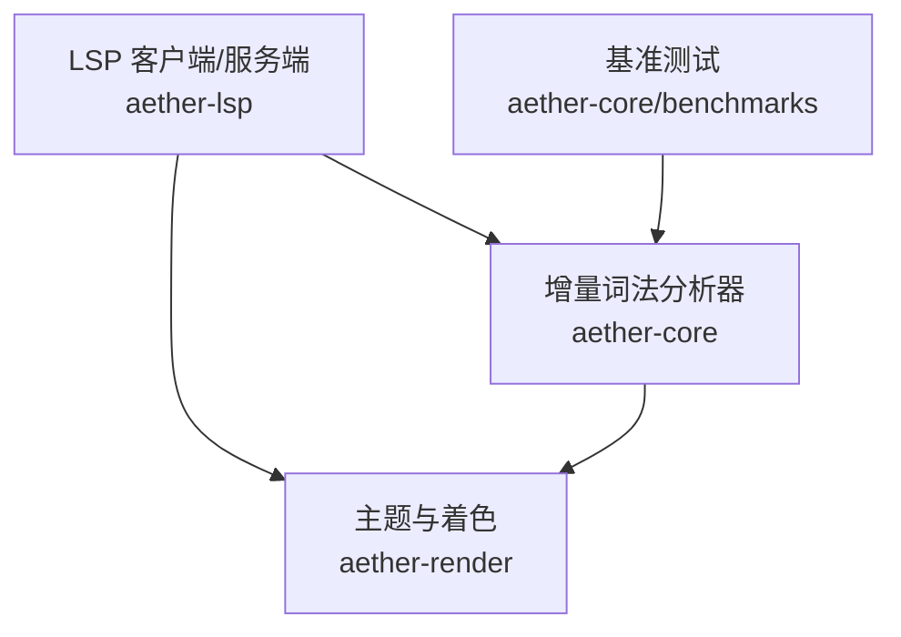
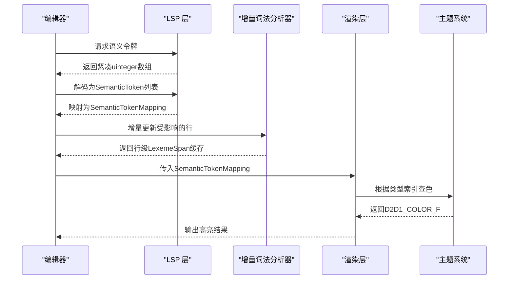
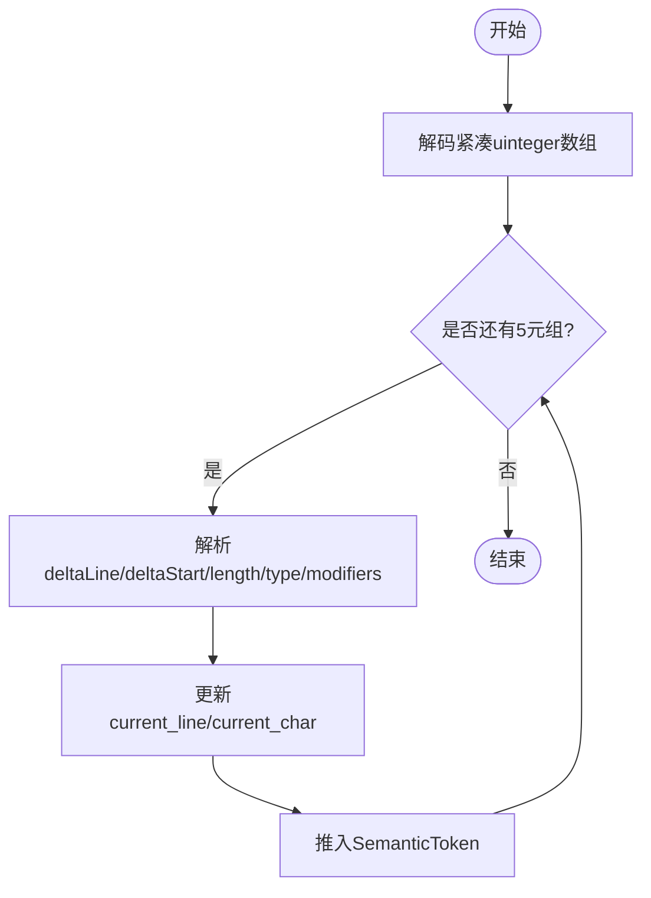
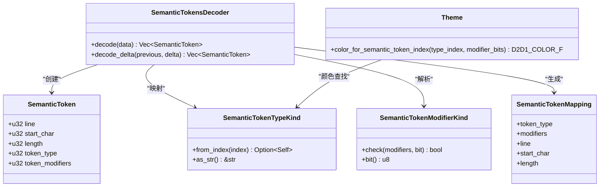
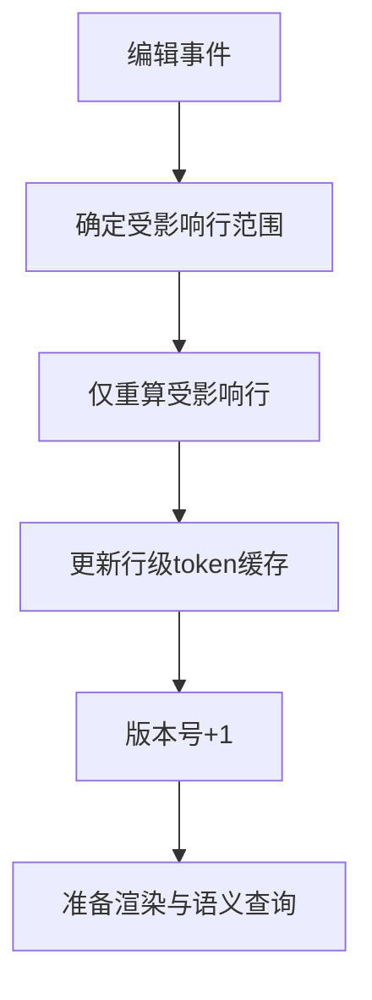
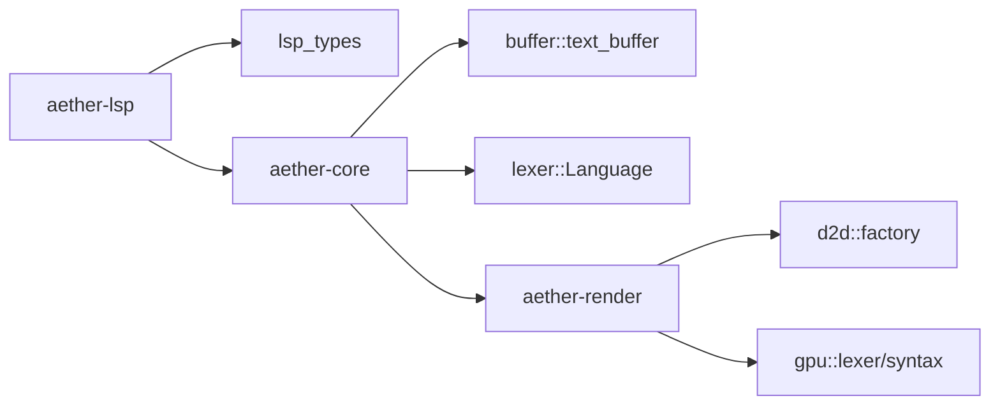

# 语义令牌

<cite>
**本文引用的文件**
- [semantic_tokens.rs](file://crates/aether-lsp/src/semantic_tokens.rs)
- [server.rs](file://crates/aether-lsp/src/server.rs)
- [incremental_lexer.rs](file://crates/aether-core/src/incremental_lexer.rs)
- [benchmarks.rs](file://crates/aether-core/src/benchmarks.rs)
- [theme.rs](file://crates/aether-render/src/theme.rs)
- [vscode_theme.rs](file://crates/aether-render/src/vscode_theme.rs)
- [render.rs](file://crates/aether-render/src/gpu/render.rs)
</cite>

## 目录
1. [简介](#简介)
2. [项目结构](#项目结构)
3. [核心组件](#核心组件)
4. [架构总览](#架构总览)
5. [详细组件分析](#详细组件分析)
6. [依赖关系分析](#依赖关系分析)
7. [性能考量](#性能考量)
8. [故障排查指南](#故障排查指南)
9. [结论](#结论)
10. [附录](#附录)

## 简介
本技术文档围绕“语义令牌系统”展开，覆盖以下主题：
- 语义令牌的编码格式与传输协议（类型、修饰符、范围表示）
- 语义分析结果的解析与渲染机制（语法高亮、类型提示、重构支持）
- 与词法分析器的集成方式及利用语义信息实现智能编辑
- 性能优化策略（增量更新与缓存机制）
- 令牌数据结构与处理示例
- 扩展语义令牌以支持自定义语言特性
- 调试与验证工具使用方法

## 项目结构
本项目将语义令牌能力分布在多个 crate 中：
- LSP 层负责语义令牌的解码、映射与增量更新
- 核心层提供增量词法分析器，用于高效维护行级 token 缓存
- 渲染层负责根据主题和语义令牌进行着色与绘制
- 基准测试提供性能对比数据

图表来源
- [semantic_tokens.rs:1-86](file://crates/aether-lsp/src/semantic_tokens.rs#L1-L86)
- [incremental_lexer.rs:1-129](file://crates/aether-core/src/incremental_lexer.rs#L1-L129)
- [theme.rs:213-244](file://crates/aether-render/src/theme.rs#L213-L244)
- [benchmarks.rs:271-334](file://crates/aether-core/src/benchmarks.rs#L271-L334)

章节来源
- [semantic_tokens.rs:1-86](file://crates/aether-lsp/src/semantic_tokens.rs#L1-L86)
- [incremental_lexer.rs:1-129](file://crates/aether-core/src/incremental_lexer.rs#L1-L129)
- [theme.rs:213-244](file://crates/aether-render/src/theme.rs#L213-L244)
- [benchmarks.rs:271-334](file://crates/aether-core/src/benchmarks.rs#L271-L334)

## 核心组件
- 语义令牌解码与映射（LSP 层）
  - 将 LSP 返回的紧凑 uinteger 数组解码为结构化 token 列表
  - 支持完整数据与 delta 增量更新
  - 将 LSP 标准类型索引映射到内部枚举类型，并解析修饰符位集
- 增量词法分析器（核心层）
  - 按行缓存 token，编辑时仅重算受影响行
  - 管理多文件 lexer 缓存，限制最大缓存数量
- 主题与着色（渲染层）
  - 提供基于语义令牌索引的颜色查找
  - 支持 VS Code 主题 JSON 加载与映射
  - GPU 渲染管线将 token 转换为 LexemeSpan 并应用颜色

章节来源
- [semantic_tokens.rs:1-264](file://crates/aether-lsp/src/semantic_tokens.rs#L1-L264)
- [incremental_lexer.rs:1-129](file://crates/aether-core/src/incremental_lexer.rs#L1-L129)
- [theme.rs:213-244](file://crates/aether-render/src/theme.rs#L213-L244)
- [vscode_theme.rs:103-176](file://crates/aether-render/src/vscode_theme.rs#L103-L176)
- [render.rs:7-32](file://crates/aether-render/src/gpu/render.rs#L7-L32)

## 架构总览
语义令牌从 LSP 服务获取，经解码与映射后进入渲染流程。增量词法分析器在编辑时快速更新行级 token，减少重复计算。主题系统根据语义令牌索引选择颜色，完成最终的高亮显示。

图表来源
- [semantic_tokens.rs:17-86](file://crates/aether-lsp/src/semantic_tokens.rs#L17-L86)
- [semantic_tokens.rs:222-264](file://crates/aether-lsp/src/semantic_tokens.rs#L222-L264)
- [incremental_lexer.rs:28-101](file://crates/aether-core/src/incremental_lexer.rs#L28-L101)
- [theme.rs:213-244](file://crates/aether-render/src/theme.rs#L213-L244)

## 详细组件分析

### 语义令牌编码与传输协议
- 编码格式
  - 每 5 个 uinteger 描述一个 token：[deltaLine, deltaStartChar, length, tokenType, tokenModifiers]
  - 行号与列号使用增量表示，跨行时重置当前列
- 类型与修饰符
  - 类型：遵循 LSP 标准的 22 种类型（namespace、type、class、enum、interface、struct、typeParameter、parameter、variable、property、enumMember、event、function、method、macro、keyword、modifier、comment、string、number、regexp、operator）
  - 修饰符：10 位位集，包括 declaration、definition、readonly、static、deprecated、abstract、async、modification、documentation、defaultLibrary
- 范围表示
  - line、start_char、length 共同定义文本范围
  - 增量更新通过 edits 对之前的 token 列表进行删除与插入

图表来源
- [semantic_tokens.rs:17-50](file://crates/aether-lsp/src/semantic_tokens.rs#L17-L50)

章节来源
- [semantic_tokens.rs:17-86](file://crates/aether-lsp/src/semantic_tokens.rs#L17-L86)
- [semantic_tokens.rs:88-172](file://crates/aether-lsp/src/semantic_tokens.rs#L88-L172)
- [semantic_tokens.rs:174-209](file://crates/aether-lsp/src/semantic_tokens.rs#L174-L209)
- [server.rs:1052-1084](file://crates/aether-lsp/src/server.rs#L1052-L1084)

### 语义分析结果解析与渲染机制
- 解析
  - 将 LSP 返回的 token 解码为 SemanticToken
  - 将类型索引映射为内部枚举类型，解析修饰符位集生成 SemanticTokenMapping
- 渲染
  - 渲染层根据语义令牌索引调用主题系统获取颜色
  - GPU 管线将 token 转换为 LexemeSpan，结合语法分类得到最终 TokenKind
  - 主题系统支持 VS Code 主题 JSON 加载，映射到 SyntaxColors

图表来源
- [semantic_tokens.rs:1-264](file://crates/aether-lsp/src/semantic_tokens.rs#L1-L264)
- [theme.rs:213-244](file://crates/aether-render/src/theme.rs#L213-L244)

章节来源
- [semantic_tokens.rs:222-264](file://crates/aether-lsp/src/semantic_tokens.rs#L222-L264)
- [theme.rs:213-244](file://crates/aether-render/src/theme.rs#L213-L244)
- [render.rs:7-32](file://crates/aether-render/src/gpu/render.rs#L7-L32)
- [vscode_theme.rs:103-176](file://crates/aether-render/src/vscode_theme.rs#L103-L176)

### 与词法分析器的集成与智能编辑
- 增量词法分析器
  - 首次打开文件时全量分析所有行，缓存每行的 LexemeSpan
  - 编辑后仅重新分析受影响的行，更新版本号和行数
  - 管理器支持多文件切换与缓存上限保护
- 智能编辑
  - 利用语义令牌提供的精确范围与类型信息，辅助代码补全、跳转、重命名等
  - 与增量词法分析器协同，确保编辑后的即时高亮与语义信息一致性

图表来源
- [incremental_lexer.rs:28-101](file://crates/aether-core/src/incremental_lexer.rs#L28-L101)

章节来源
- [incremental_lexer.rs:1-129](file://crates/aether-core/src/incremental_lexer.rs#L1-L129)
- [incremental_lexer.rs:131-187](file://crates/aether-core/src/incremental_lexer.rs#L131-L187)

### 性能优化策略
- 增量更新
  - 避免全量重算，仅针对编辑区域进行 lexing
  - 使用 Vec 存储行级 token，O(1) 访问与连续内存布局
- 缓存机制
  - 每个文件独立 IncrementalLexer，管理器限制最大缓存文件数
  - 版本控制用于失效检测
- 基准测试
  - 提供增量 vs 全量的性能对比，验证速度提升

章节来源
- [incremental_lexer.rs:1-129](file://crates/aether-core/src/incremental_lexer.rs#L1-L129)
- [incremental_lexer.rs:131-187](file://crates/aether-core/src/incremental_lexer.rs#L131-L187)
- [benchmarks.rs:271-334](file://crates/aether-core/src/benchmarks.rs#L271-L334)

### 令牌数据结构与处理示例
- 数据结构
  - SemanticToken：包含行、列、长度、类型索引、修饰符位集
  - SemanticTokenTypeKind：LSP 标准 22 种类型
  - SemanticTokenModifierKind：10 种修饰符位
  - SemanticTokenMapping：映射后的渲染可用信息
- 处理示例
  - 解码完整数据：将紧凑数组转为结构化 token 列表
  - 解码增量数据：应用 edits 到之前的 token 列表
  - 映射类型与修饰符：生成可用于着色的映射对象

章节来源
- [semantic_tokens.rs:1-86](file://crates/aether-lsp/src/semantic_tokens.rs#L1-L86)
- [semantic_tokens.rs:88-264](file://crates/aether-lsp/src/semantic_tokens.rs#L88-L264)

### 扩展语义令牌以支持自定义语言特性
- 类型与修饰符扩展
  - 在类型枚举中添加新变体，并在 from_index 中增加映射
  - 在修饰符枚举中添加新位，并在 check/bit 中实现
- 主题映射
  - 在主题系统中为新类型添加颜色字段，并在 color_for_semantic_token_index 中映射
- 主题加载
  - 在 VS Code 主题解析中新增 scope 到颜色的映射规则

章节来源
- [semantic_tokens.rs:88-172](file://crates/aether-lsp/src/semantic_tokens.rs#L88-L172)
- [semantic_tokens.rs:174-209](file://crates/aether-lsp/src/semantic_tokens.rs#L174-L209)
- [theme.rs:213-244](file://crates/aether-render/src/theme.rs#L213-L244)
- [vscode_theme.rs:178-234](file://crates/aether-render/src/vscode_theme.rs#L178-L234)

### 调试与验证工具使用方法
- 单元测试
  - 解码基本用例、不完整数据忽略、多行与同行连续 token
  - 增量更新的边界情况（越界、删除计数超过长度、多个 edits 反向应用）
  - 类型与修饰符的全覆盖测试
- 基准测试
  - 增量 vs 全量性能对比，验证增量更新的速度优势
- 主题解析测试
  - 十六进制颜色解析、无效颜色回退、VS Code 主题 JSON 字符串与文件加载

章节来源
- [semantic_tokens.rs:266-557](file://crates/aether-lsp/src/semantic_tokens.rs#L266-L557)
- [benchmarks.rs:271-334](file://crates/aether-core/src/benchmarks.rs#L271-L334)
- [vscode_theme.rs:342-619](file://crates/aether-render/src/vscode_theme.rs#L342-L619)

## 依赖关系分析
- LSP 层依赖
  - lsp_types：标准类型与修饰符定义
  - 内部类型映射与解码逻辑
- 核心层依赖
  - buffer::text_buffer::EditResult：编辑结果输入
  - lexer::Language：语言特定的词法器创建
- 渲染层依赖
  - d2d::factory::color_f：颜色构造
  - gpu::lexer::GpuToken：GPU 生成的 token
  - gpu::syntax::SyntaxClass：语法分类

图表来源
- [semantic_tokens.rs:1-2](file://crates/aether-lsp/src/semantic_tokens.rs#L1-L2)
- [incremental_lexer.rs:1-2](file://crates/aether-core/src/incremental_lexer.rs#L1-L2)
- [theme.rs:1-5](file://crates/aether-render/src/theme.rs#L1-L5)
- [render.rs:1-5](file://crates/aether-render/src/gpu/render.rs#L1-L5)

章节来源
- [semantic_tokens.rs:1-2](file://crates/aether-lsp/src/semantic_tokens.rs#L1-L2)
- [incremental_lexer.rs:1-2](file://crates/aether-core/src/incremental_lexer.rs#L1-L2)
- [theme.rs:1-5](file://crates/aether-render/src/theme.rs#L1-L5)
- [render.rs:1-5](file://crates/aether-render/src/gpu/render.rs#L1-L5)

## 性能考量
- 增量更新显著降低编辑时的重算成本
- 行级缓存与版本控制提高命中率与失效检测效率
- 基准测试验证增量 vs 全量的性能差异，指导进一步优化

章节来源
- [incremental_lexer.rs:28-101](file://crates/aether-core/src/incremental_lexer.rs#L28-L101)
- [benchmarks.rs:271-334](file://crates/aether-core/src/benchmarks.rs#L271-L334)

## 故障排查指南
- 解码异常
  - 检查输入是否为完整的 5 元组，不完整将被忽略
  - 验证类型索引是否在有效范围内（0-21）
- 增量更新错误
  - 确认 edits 的 start 与 delete_count 不越界
  - 多个 edits 需按反向顺序应用
- 主题解析失败
  - 检查十六进制颜色格式是否正确
  - 无效颜色将回退到默认值

章节来源
- [semantic_tokens.rs:266-557](file://crates/aether-lsp/src/semantic_tokens.rs#L266-L557)
- [vscode_theme.rs:342-619](file://crates/aether-render/src/vscode_theme.rs#L342-L619)

## 结论
本系统通过 LSP 标准语义令牌实现精确的代码理解与高亮，结合增量词法分析器与主题系统，提供高性能、可扩展的智能编辑体验。通过完善的测试与基准，确保了正确性与性能。未来可通过扩展类型与修饰符、主题映射进一步支持自定义语言特性。

## 附录
- 术语表
  - 语义令牌：携带语言语义信息的标记，用于高亮、导航、重构等
  - 增量更新：仅对编辑影响区域进行重新分析
  - 主题系统：根据令牌类型与修饰符选择颜色进行渲染