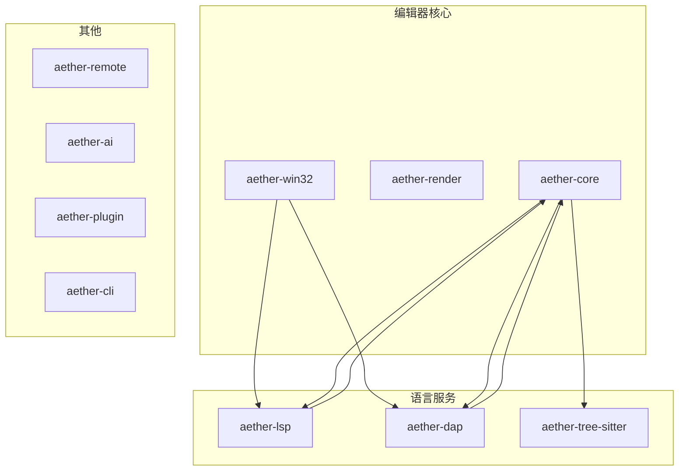
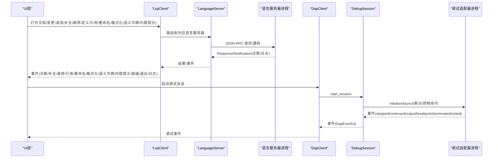
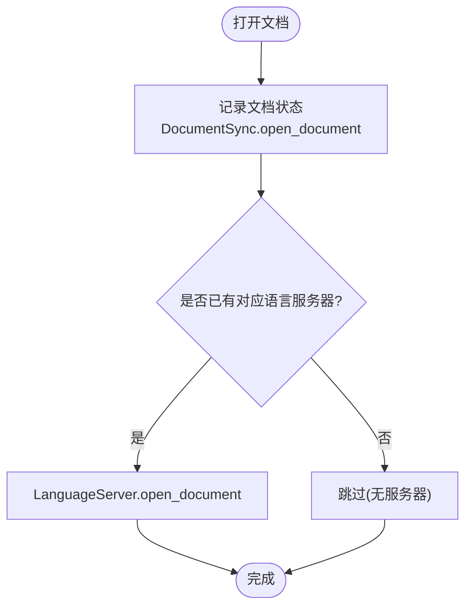
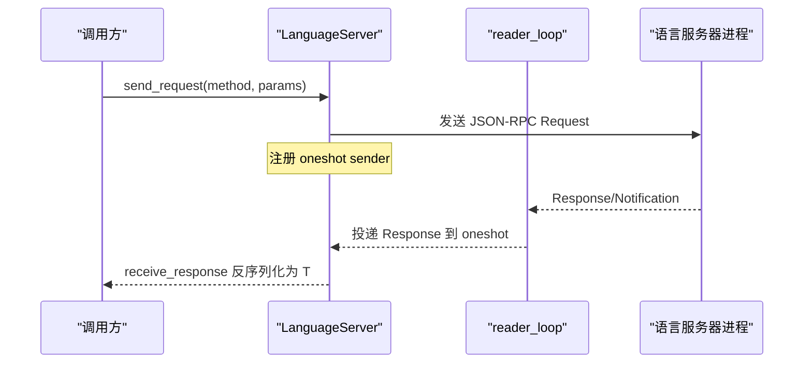
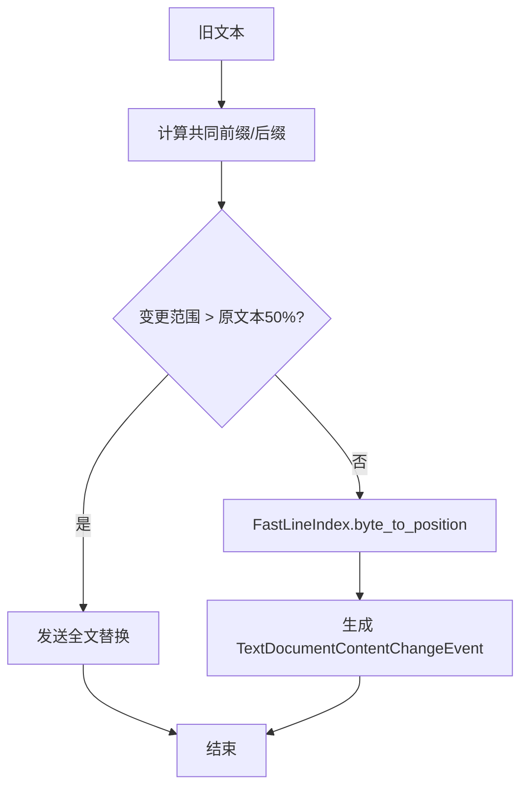
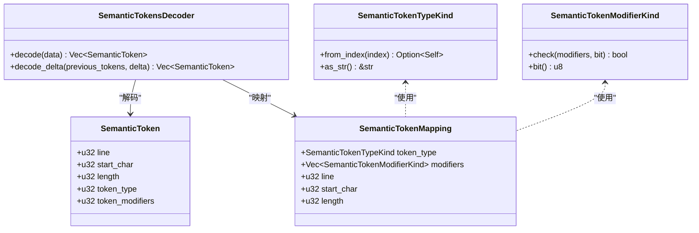
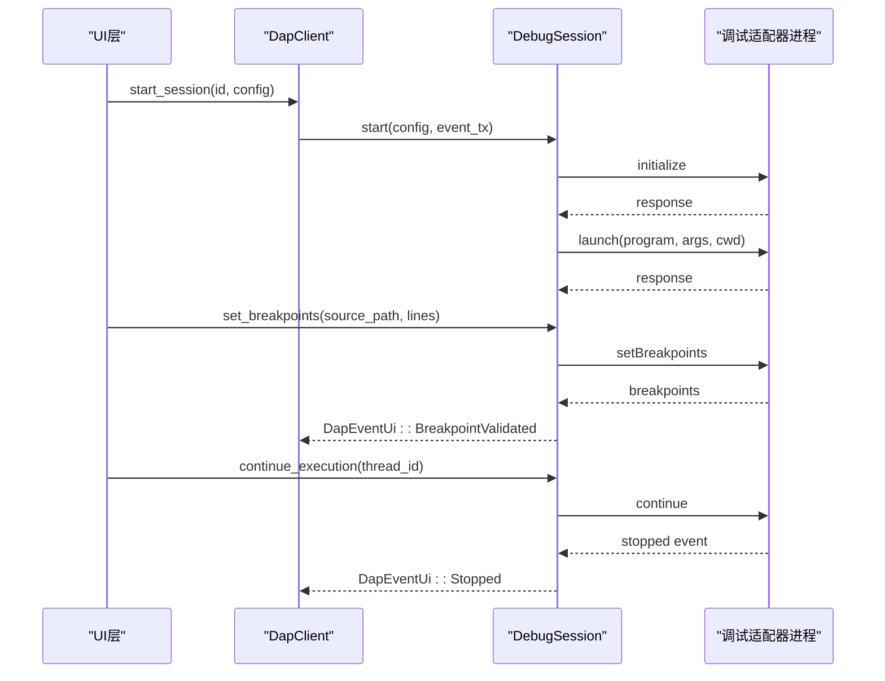
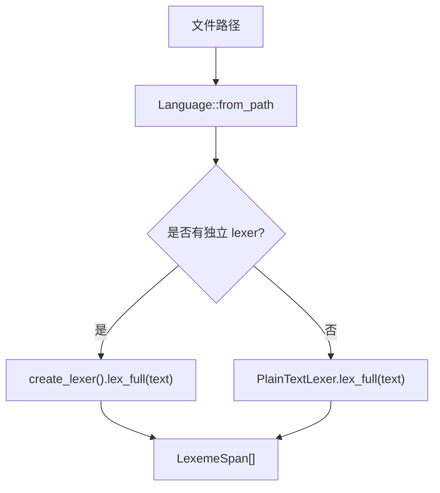
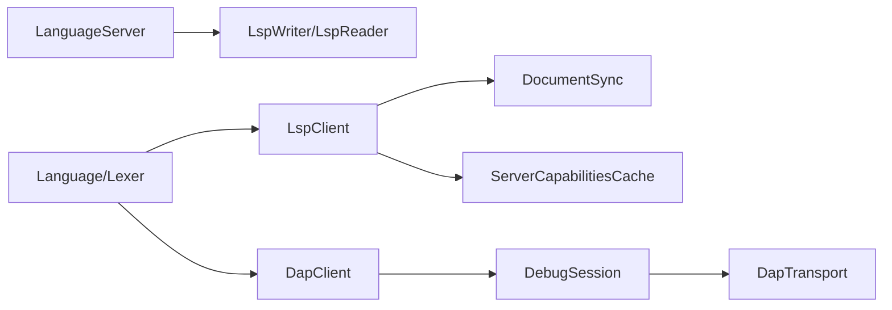

# 语言服务集成

<cite>
**本文引用的文件**
- [aether-lsp/src/lib.rs](file://crates/aether-lsp/src/lib.rs)
- [aether-lsp/src/client.rs](file://crates/aether-lsp/src/client.rs)
- [aether-lsp/src/server.rs](file://crates/aether-lsp/src/server.rs)
- [aether-lsp/src/sync.rs](file://crates/aether-lsp/src/sync.rs)
- [aether-lsp/src/incremental_sync.rs](file://crates/aether-lsp/src/incremental_sync.rs)
- [aether-lsp/src/semantic_tokens.rs](file://crates/aether-lsp/src/semantic_tokens.rs)
- [aether-dap/src/lib.rs](file://crates/aether-dap/src/lib.rs)
- [aether-dap/src/client.rs](file://crates/aether-dap/src/client.rs)
- [aether-dap/src/session.rs](file://crates/aether-dap/src/session.rs)
- [aether-dap/src/transport.rs](file://crates/aether-dap/src/transport.rs)
- [aether-core/src/lexer/mod.rs](file://crates/aether-core/src/lexer/mod.rs)
- [README.md](file://README.md)
</cite>

## 目录
1. [简介](#简介)
2. [项目结构](#项目结构)
3. [核心组件](#核心组件)
4. [架构总览](#架构总览)
5. [详细组件分析](#详细组件分析)
6. [依赖关系分析](#依赖关系分析)
7. [性能考量](#性能考量)
8. [故障排查指南](#故障排查指南)
9. [结论](#结论)
10. [附录](#附录)

## 简介
本技术文档面向“语言服务集成”，聚焦以下目标：
- LSP（Language Server Protocol）客户端实现：协议规范、文档同步、语义令牌处理与增量同步机制。
- DAP（Debug Adapter Protocol）客户端基础实现：调试会话管理、断点处理与调试信息展示。
- 语言检测、语法解析与 Tree-sitter 集成的说明与定位。
- 诊断信息的处理与显示机制。
- 语言服务器配置与扩展开发指南，包含协议消息示例与错误处理策略。
- 性能优化技巧与调试方法，以及语言服务扩展的最佳实践。

本项目在 Windows 平台使用 Rust + Win32 API 构建，提供高性能文本编辑、多语言词法分析、LSP/DAP 支持、Tree-sitter 集成等能力。

**章节来源**
- [README.md:48-66](file://README.md#L48-L66)
- [README.md:162-178](file://README.md#L162-L178)

## 项目结构
仓库采用 Cargo Workspace 组织，按职责拆分为多个 crate：
- aether-core：编辑器核心（文本缓冲、历史栈、词法分析器、工作区数据结构、搜索）。
- aether-render：渲染抽象、主题系统、画笔缓存。
- aether-win32：Windows 原生 UI 层（窗口、消息循环、菜单、布局、事件处理、应用入口）。
- aether-shared：共享配置与持久化设置。
- aether-lsp：LSP 客户端实现（同步、增量同步、语义令牌）。
- aether-dap：DAP 客户端基础实现（类型、传输、会话、客户端）。
- aether-remote：远程操作抽象。
- aether-ai：AI 服务接口与请求处理。
- aether-tree-sitter：语法解析、语言检测、主题映射。
- aether-plugin：插件注册、权限与运行时。
- aether-cli：命令行启动器。

**图表来源**
- [README.md:162-178](file://README.md#L162-L178)

**章节来源**
- [README.md:162-178](file://README.md#L162-L178)

## 核心组件
- LSP 客户端管理器（LspClient）：管理多个语言服务器实例，按语言ID路由请求；维护文档同步状态、诊断集合，并向UI层推送事件。
- 语言服务器实例（LanguageServer）：负责单个语言服务器的生命周期（发现→启动→初始化→运行→关闭），处理请求-响应与通知转发。
- 文档同步（DocumentSync）：跟踪已打开文档的状态和版本，计算增量变更。
- 增量同步优化（IncrementalChangeCalculator/FastLineIndex/OptimizedDocumentSync）：基于编辑操作直接生成LSP增量变更，合并相邻编辑，大文件策略。
- 语义令牌（SemanticTokensDecoder/map_tokens）：解码LSP返回的紧凑uinteger数组为结构化token列表，并映射到渲染可用信息。
- DAP 客户端管理器（DapClient）：管理多个调试会话，发送默认适配器配置。
- 调试会话（DebugSession）：管理单个调试适配器的完整生命周期，处理initialize/launch/断点/调用栈/变量/表达式评估等。
- DAP 传输层（DapTransport）：JSON-RPC 帧格式通信，带 Content-Length 头与大小限制，后台stderr读取避免阻塞。
- 语言检测与词法分析（Language/Lexer）：根据扩展名检测语言，创建对应Lexer进行全量词法分析。

**章节来源**
- [aether-lsp/src/lib.rs:1-16](file://crates/aether-lsp/src/lib.rs#L1-L16)
- [aether-lsp/src/client.rs:11-25](file://crates/aether-lsp/src/client.rs#L11-L25)
- [aether-lsp/src/server.rs:23-61](file://crates/aether-lsp/src/server.rs#L23-L61)
- [aether-lsp/src/sync.rs:6-10](file://crates/aether-lsp/src/sync.rs#L6-L10)
- [aether-lsp/src/incremental_sync.rs:3-7](file://crates/aether-lsp/src/incremental_sync.rs#L3-L7)
- [aether-lsp/src/semantic_tokens.rs:3-11](file://crates/aether-lsp/src/semantic_tokens.rs#L3-L11)
- [aether-dap/src/lib.rs:1-8](file://crates/aether-dap/src/lib.rs#L1-L8)
- [aether-dap/src/client.rs:7-12](file://crates/aether-dap/src/client.rs#L7-L12)
- [aether-dap/src/session.rs:23-34](file://crates/aether-dap/src/session.rs#L23-L34)
- [aether-dap/src/transport.rs:9-15](file://crates/aether-dap/src/transport.rs#L9-L15)
- [aether-core/src/lexer/mod.rs:1-11](file://crates/aether-core/src/lexer/mod.rs#L1-L11)

## 架构总览
下图展示了 LSP/DAP 客户端与编辑器核心、渲染层之间的交互关系，包括进程间通信、事件通道、超时与错误处理。

**图表来源**
- [aether-lsp/src/client.rs:73-114](file://crates/aether-lsp/src/client.rs#L73-L114)
- [aether-lsp/src/server.rs:63-124](file://crates/aether-lsp/src/server.rs#L63-L124)
- [aether-dap/src/client.rs:24-43](file://crates/aether-dap/src/client.rs#L24-L43)
- [aether-dap/src/session.rs:36-74](file://crates/aether-dap/src/session.rs#L36-L74)

**章节来源**
- [aether-lsp/src/client.rs:73-114](file://crates/aether-lsp/src/client.rs#L73-L114)
- [aether-lsp/src/server.rs:63-124](file://crates/aether-lsp/src/server.rs#L63-L124)
- [aether-dap/src/client.rs:24-43](file://crates/aether-dap/src/client.rs#L24-L43)
- [aether-dap/src/session.rs:36-74](file://crates/aether-dap/src/session.rs#L36-L74)

## 详细组件分析

### LSP 客户端（LspClient）
- 功能：管理多个语言服务器实例，按语言ID路由请求；维护文档同步状态、诊断集合；向UI层推送事件。
- 关键流程：
  - 启动服务器：start_server 启动 LanguageServer，发送 ServerReady 事件，注册到 servers map。
  - 打开/关闭文档：open_document/close_document 更新 DocumentSync 并通知服务器。
  - 变更通知：notify_change 计算增量变更并发送到服务器；notify_change_raw 高级用法，成功后递增版本。
  - 请求方法：completion/hover/definition/references/rename/code_actions/formatting/semantic_tokens/inlay_hints。
  - 诊断缓存：update_diagnostics/remove_diagnostics/diagnostics_for/all_diagnostics/clear_diagnostics。
  - 关闭所有服务器：shutdown_all 清理诊断缓存。
  - 能力查询：get_capabilities。

**图表来源**
- [aether-lsp/src/client.rs:116-144](file://crates/aether-lsp/src/client.rs#L116-L144)

**章节来源**
- [aether-lsp/src/client.rs:73-114](file://crates/aether-lsp/src/client.rs#L73-L114)
- [aether-lsp/src/client.rs:116-172](file://crates/aether-lsp/src/client.rs#L116-L172)
- [aether-lsp/src/client.rs:215-286](file://crates/aether-lsp/src/client.rs#L215-L286)
- [aether-lsp/src/client.rs:288-567](file://crates/aether-lsp/src/client.rs#L288-L567)
- [aether-lsp/src/client.rs:569-617](file://crates/aether-lsp/src/client.rs#L569-L617)

### 语言服务器实例（LanguageServer）
- 功能：单个语言服务器的完整生命周期管理；请求-响应通过 oneshot channel 配对；后台 reader task 持续读 stdout 并分发；处理反向请求与通知转发。
- 关键流程：
  - 启动：spawn_server 获取 stdin/stdout/stderr，启动 stderr drain 与 reader_loop，发送 initialize 请求，等待响应并缓存能力。
  - 文档同步：open_document/close_document/change_document 发送 didOpen/didClose/didChange。
  - 请求封装：send_request/receive_response 统一序列化参数、超时处理、错误传播。
  - 反向请求处理：handle_server_request 最小可用响应（workspace/configuration、registerCapability、applyEdit、workspaceFolders）。
  - 优雅关闭：shutdown 发送 shutdown/exit，等待子进程退出或强制 kill。

**图表来源**
- [aether-lsp/src/server.rs:140-216](file://crates/aether-lsp/src/server.rs#L140-L216)
- [aether-lsp/src/server.rs:218-302](file://crates/aether-lsp/src/server.rs#L218-L302)
- [aether-lsp/src/server.rs:304-484](file://crates/aether-lsp/src/server.rs#L304-L484)

**章节来源**
- [aether-lsp/src/server.rs:63-124](file://crates/aether-lsp/src/server.rs#L63-L124)
- [aether-lsp/src/server.rs:140-216](file://crates/aether-lsp/src/server.rs#L140-L216)
- [aether-lsp/src/server.rs:304-484](file://crates/aether-lsp/src/server.rs#L304-L484)
- [aether-lsp/src/server.rs:661-695](file://crates/aether-lsp/src/server.rs#L661-L695)

### 文档同步与增量同步
- 文档同步（DocumentSync）：跟踪已打开文档的状态和版本，提供 open/close/get_language_id/increment_version/update_text/is_open。
- 增量变更计算（compute_changes）：基于共同前缀/后缀的字符级 diff，大文件或变更过大时回退为全文替换；使用 FastLineIndex 将字节偏移转换为 LSP Position（UTF-16 码元）。
- 增量同步优化：
  - IncrementalChangeCalculator：从编辑操作直接生成 LSP 增量变更，合并相邻编辑。
  - FastLineIndex：预计算行起始位置数组，O(log n) 行查找，character 按 UTF-16 码元计数。
  - OptimizedDocumentSync：记录编辑历史，生成自上次同步以来的增量变更，批量发送阈值控制。
  - LargeFileSyncStrategy：大文件阈值判断、是否发送完整内容、同步延迟。

**图表来源**
- [aether-lsp/src/sync.rs:82-148](file://crates/aether-lsp/src/sync.rs#L82-L148)
- [aether-lsp/src/incremental_sync.rs:96-190](file://crates/aether-lsp/src/incremental_sync.rs#L96-L190)
- [aether-lsp/src/incremental_sync.rs:307-357](file://crates/aether-lsp/src/incremental_sync.rs#L307-L357)

**章节来源**
- [aether-lsp/src/sync.rs:6-71](file://crates/aether-lsp/src/sync.rs#L6-L71)
- [aether-lsp/src/sync.rs:82-148](file://crates/aether-lsp/src/sync.rs#L82-L148)
- [aether-lsp/src/incremental_sync.rs:3-80](file://crates/aether-lsp/src/incremental_sync.rs#L3-L80)
- [aether-lsp/src/incremental_sync.rs:96-190](file://crates/aether-lsp/src/incremental_sync.rs#L96-L190)
- [aether-lsp/src/incremental_sync.rs:192-305](file://crates/aether-lsp/src/incremental_sync.rs#L192-L305)
- [aether-lsp/src/incremental_sync.rs:307-357](file://crates/aether-lsp/src/incremental_sync.rs#L307-L357)

### 语义令牌处理
- 解码器（SemanticTokensDecoder）：将 LSP 返回的紧凑 uinteger 数组解码为结构化 token 列表；支持 delta 更新合并。
- 类型映射（SemanticTokenTypeKind/SemanticTokenModifierKind）：LSP 标准22种类型与10种修饰符位掩码检查。
- 映射函数（map_tokens）：将解码后的 token 映射为渲染可用的 SemanticTokenMapping（类型、修饰符、位置、长度）。

**图表来源**
- [aether-lsp/src/semantic_tokens.rs:3-11](file://crates/aether-lsp/src/semantic_tokens.rs#L3-L11)
- [aether-lsp/src/semantic_tokens.rs:13-86](file://crates/aether-lsp/src/semantic_tokens.rs#L13-L86)
- [aether-lsp/src/semantic_tokens.rs:88-220](file://crates/aether-lsp/src/semantic_tokens.rs#L88-L220)
- [aether-lsp/src/semantic_tokens.rs:222-264](file://crates/aether-lsp/src/semantic_tokens.rs#L222-L264)

**章节来源**
- [aether-lsp/src/semantic_tokens.rs:13-86](file://crates/aether-lsp/src/semantic_tokens.rs#L13-L86)
- [aether-lsp/src/semantic_tokens.rs:88-220](file://crates/aether-lsp/src/semantic_tokens.rs#L88-L220)
- [aether-lsp/src/semantic_tokens.rs:222-264](file://crates/aether-lsp/src/semantic_tokens.rs#L222-L264)

### DAP 客户端与会话管理
- DapClient：管理多个调试会话，启动/停止会话，默认适配器配置发现。
- DebugSession：管理单个调试适配器的完整生命周期，处理 initialize/launch/断点/调用栈/变量/表达式评估/断开连接等。
- 事件处理：stopped/continued/exited/terminated/output/breakpoint 事件转换为 DapEventUi 推送到 UI。
- 超时与错误：各请求设置超时时间，失败响应返回 io::Error。

**图表来源**
- [aether-dap/src/client.rs:24-43](file://crates/aether-dap/src/client.rs#L24-L43)
- [aether-dap/src/session.rs:36-74](file://crates/aether-dap/src/session.rs#L36-L74)
- [aether-dap/src/session.rs:131-194](file://crates/aether-dap/src/session.rs#L131-L194)
- [aether-dap/src/session.rs:196-253](file://crates/aether-dap/src/session.rs#L196-L253)
- [aether-dap/src/session.rs:595-677](file://crates/aether-dap/src/session.rs#L595-L677)

**章节来源**
- [aether-dap/src/client.rs:7-43](file://crates/aether-dap/src/client.rs#L7-L43)
- [aether-dap/src/session.rs:23-74](file://crates/aether-dap/src/session.rs#L23-L74)
- [aether-dap/src/session.rs:131-194](file://crates/aether-dap/src/session.rs#L131-L194)
- [aether-dap/src/session.rs:196-253](file://crates/aether-dap/src/session.rs#L196-L253)
- [aether-dap/src/session.rs:595-677](file://crates/aether-dap/src/session.rs#L595-L677)

### 语言检测、语法解析与 Tree-sitter 集成
- 语言检测：Language::from_extension/from_path 根据扩展名或路径检测语言，未知扩展名归为 PlainText。
- 词法分析：Language::create_lexer/lex_full 创建对应 Lexer 进行全量词法分析，支持多种语言（C/Rust/Python/JS/TS/Go/Java/Json/Markdown/Toml/Html/Css/PlainText/Image）。
- Tree-sitter 集成：项目 README 提及 Tree-sitter 用于语法解析、语言检测、TextMate 主题映射、高亮渲染与文件切换高亮缓存；具体实现在 aether-tree-sitter crate（未在本文档中展开）。

**图表来源**
- [aether-core/src/lexer/mod.rs:113-196](file://crates/aether-core/src/lexer/mod.rs#L113-L196)

**章节来源**
- [aether-core/src/lexer/mod.rs:113-196](file://crates/aether-core/src/lexer/mod.rs#L113-L196)
- [README.md:58-61](file://README.md#L58-L61)

### 诊断信息的处理与显示机制
- LSP 诊断缓存：LspClient.update_diagnostics/remove_diagnostics/diagnostics_for/all_diagnostics/clear_diagnostics 管理 URI -> 诊断列表的映射。
- 服务器推送：LanguageServer.handle_notification 转发服务器推送的诊断到 UI 层（通过 event_tx）。
- 关闭清理：shutdown_all/remove_server 清空诊断缓存，避免显示过期诊断。

**章节来源**
- [aether-lsp/src/client.rs:174-213](file://crates/aether-lsp/src/client.rs#L174-L213)
- [aether-lsp/src/server.rs:295-302](file://crates/aether-lsp/src/server.rs#L295-L302)
- [aether-lsp/src/client.rs:569-603](file://crates/aether-lsp/src/client.rs#L569-L603)

### 语言服务器配置与扩展开发指南
- 默认服务器配置：default_server_config 为常见语言提供默认命令（rust-analyzer/pylsp/typescript-language-server/clangd）。
- 默认适配器配置：default_adapter_config 为常见语言提供默认调试适配器（lldb-dap/debugpy.adapter/node-debug2-adapter）。
- 扩展开发建议：
  - 新增语言：在 default_server_config/default_adapter_config 中添加映射。
  - 自定义能力：在 LanguageServer.initialize 中调整 ClientCapabilities。
  - 事件处理：在 handle_event/handle_notification 中扩展 UI 事件。
  - 错误处理：确保所有请求设置超时，失败响应返回 io::Error。

**章节来源**
- [aether-lsp/src/client.rs:620-653](file://crates/aether-lsp/src/client.rs#L620-L653)
- [aether-dap/src/client.rs:45-71](file://crates/aether-dap/src/client.rs#L45-L71)
- [aether-lsp/src/server.rs:304-484](file://crates/aether-lsp/src/server.rs#L304-L484)

### 协议消息示例与错误处理策略
- LSP 消息：
  - 请求：textDocument/completion/textDocument/hover/textDocument/definition/textDocument/references/textDocument/rename/textDocument/codeAction/textDocument/formatting。
  - 通知：textDocument/didOpen/textDocument/didClose/textDocument/didChange。
  - 响应：CompletionResponse/Hover/GotoDefinitionResponse/Vec<Location>/WorkspaceEdit/CodeActionResponse/Vec<TextEdit>。
- DAP 消息：
  - 请求：initialize/launch/setBreakpoints/continue/next/stepIn/stepOut/pause/stackTrace/scopes/variables/evaluate。
  - 事件：stopped/continued/exited/terminated/output/breakpoint。
- 错误处理：
  - LSP：receive_response 检查 resp.error，超时清理 pending sender。
  - DAP：send_simple_request 检查 resp.success，超时返回 TimedOut。
  - 传输层：DapTransport.receive 限制 Content-Length 最大 64MB，防止 OOM。

**章节来源**
- [aether-lsp/src/server.rs:140-216](file://crates/aether-lsp/src/server.rs#L140-L216)
- [aether-dap/src/session.rs:542-593](file://crates/aether-dap/src/session.rs#L542-L593)
- [aether-dap/src/transport.rs:40-93](file://crates/aether-dap/src/transport.rs#L40-L93)

### 性能优化技巧与调试方法
- 增量同步：compute_changes 对大文件或大变更回退为全文替换；IncrementalChangeCalculator.merge_edits 合并相邻编辑减少消息数量。
- 行索引优化：FastLineIndex 预计算行起始位置，O(log n) 查找，UTF-16 码元准确转换。
- 超时控制：LSP/DAP 各请求设置合理超时，避免长时间阻塞。
- 进程管理：stderr drain 避免管道缓冲区满导致进程阻塞；disconnect/kill 防止僵尸进程。
- 调试方法：
  - 启用日志：LspEvent::Log 输出服务器日志。
  - 单元测试：各模块提供丰富测试用例验证行为。
  - 基准测试：aether-core/benches/lexer_bench.rs 评估词法分析性能。

**章节来源**
- [aether-lsp/src/sync.rs:82-148](file://crates/aether-lsp/src/sync.rs#L82-L148)
- [aether-lsp/src/incremental_sync.rs:33-80](file://crates/aether-lsp/src/incremental_sync.rs#L33-L80)
- [aether-lsp/src/incremental_sync.rs:96-190](file://crates/aether-lsp/src/incremental_sync.rs#L96-L190)
- [aether-dap/src/transport.rs:144-162](file://crates/aether-dap/src/transport.rs#L144-L162)
- [aether-dap/src/session.rs:514-535](file://crates/aether-dap/src/session.rs#L514-L535)

### 最佳实践
- 语言服务扩展：
  - 优先使用增量同步，避免全文替换。
  - 合理设置超时，避免长时间阻塞。
  - 处理服务器推送事件，及时更新 UI。
  - 使用默认配置快速启动，按需自定义能力。
- 调试会话管理：
  - 正确管理会话生命周期，避免重复 launch。
  - 处理 terminated/exited 事件，清理资源。
  - 使用 detach 保留被调试进程，适用于附加场景。
- 性能优化：
  - 合并相邻编辑，减少消息数量。
  - 使用 FastLineIndex 精确计算位置。
  - 监控 stderr 输出，避免阻塞。

**章节来源**
- [aether-lsp/src/incremental_sync.rs:33-80](file://crates/aether-lsp/src/incremental_sync.rs#L33-L80)
- [aether-dap/src/session.rs:483-512](file://crates/aether-dap/src/session.rs#L483-L512)
- [aether-dap/src/transport.rs:144-162](file://crates/aether-dap/src/transport.rs#L144-L162)

## 依赖关系分析
LSP/DAP 客户端与核心组件的依赖关系如下：

**图表来源**
- [aether-lsp/src/client.rs:11-25](file://crates/aether-lsp/src/client.rs#L11-L25)
- [aether-lsp/src/server.rs:23-61](file://crates/aether-lsp/src/server.rs#L23-L61)
- [aether-dap/src/client.rs:7-12](file://crates/aether-dap/src/client.rs#L7-L12)
- [aether-dap/src/session.rs:23-34](file://crates/aether-dap/src/session.rs#L23-L34)
- [aether-core/src/lexer/mod.rs:113-196](file://crates/aether-core/src/lexer/mod.rs#L113-L196)

**章节来源**
- [aether-lsp/src/client.rs:11-25](file://crates/aether-lsp/src/client.rs#L11-L25)
- [aether-lsp/src/server.rs:23-61](file://crates/aether-lsp/src/server.rs#L23-L61)
- [aether-dap/src/client.rs:7-12](file://crates/aether-dap/src/client.rs#L7-L12)
- [aether-dap/src/session.rs:23-34](file://crates/aether-dap/src/session.rs#L23-L34)
- [aether-core/src/lexer/mod.rs:113-196](file://crates/aether-core/src/lexer/mod.rs#L113-L196)

## 性能考量
- 增量同步：对大文件或大变更回退为全文替换，避免性能瓶颈。
- 行索引优化：FastLineIndex 预计算行起始位置，支持高效位置转换。
- 超时控制：合理设置请求超时，避免长时间阻塞。
- 进程管理：stderr drain 避免管道缓冲区满导致进程阻塞；disconnect/kill 防止僵尸进程。
- 内存安全：DapTransport 限制 Content-Length 最大 64MB，防止恶意消息导致 OOM。

[本节提供一般性指导，无需特定文件分析]

## 故障排查指南
- LSP 诊断丢失：检查 LanguageServer.handle_notification 是否正确转发通知；确认 event_tx 是否有效。
- 调试会话卡死：检查 DapTransport.receive 是否收到有效 Content-Length；确认 stderr drain 任务是否正常运行。
- 服务器未响应：检查 receive_response/send_simple_request 超时设置；确认服务器进程是否正常启动。
- 诊断缓存过期：确认 shutdown_all/remove_server 是否清空诊断缓存。

**章节来源**
- [aether-lsp/src/server.rs:295-302](file://crates/aether-lsp/src/server.rs#L295-L302)
- [aether-dap/src/transport.rs:40-93](file://crates/aether-dap/src/transport.rs#L40-L93)
- [aether-dap/src/session.rs:542-593](file://crates/aether-dap/src/session.rs#L542-L593)
- [aether-lsp/src/client.rs:569-603](file://crates/aether-lsp/src/client.rs#L569-L603)

## 结论
本项目实现了完整的 LSP/DAP 客户端框架，支持多语言服务器管理与调试会话控制。通过增量同步、语义令牌处理、语言检测与词法分析，提供了高性能的语言服务集成。开发者可基于此框架扩展新语言支持，优化性能，并遵循最佳实践确保稳定性与可维护性。

[本节总结内容，无需特定文件分析]

## 附录
- 构建与运行：参考 README.md 中的构建与运行指令。
- 测试：使用 cargo test --workspace 运行单元测试；使用 coverage.ps1 收集覆盖率。
- 基准测试：aether-core/benches/lexer_bench.rs 评估词法分析性能。

**章节来源**
- [README.md:85-118](file://README.md#L85-L118)
- [README.md:127-159](file://README.md#L127-L159)