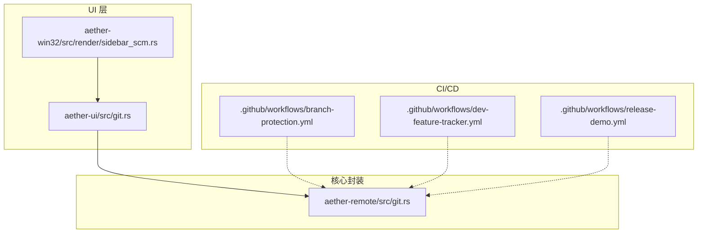
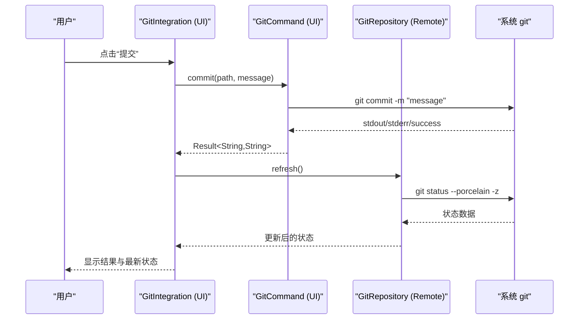
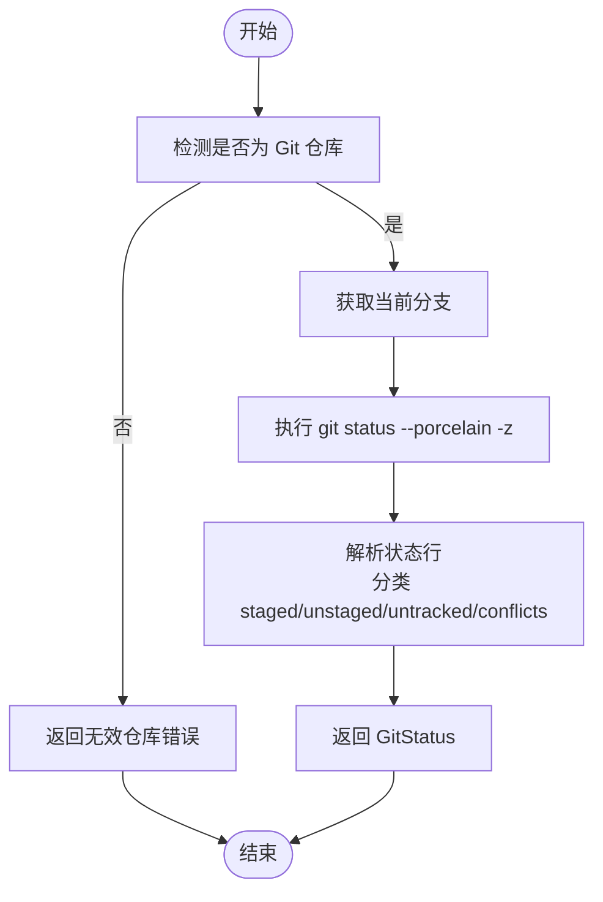
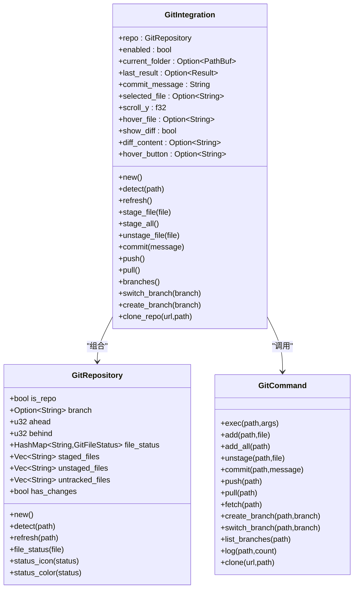
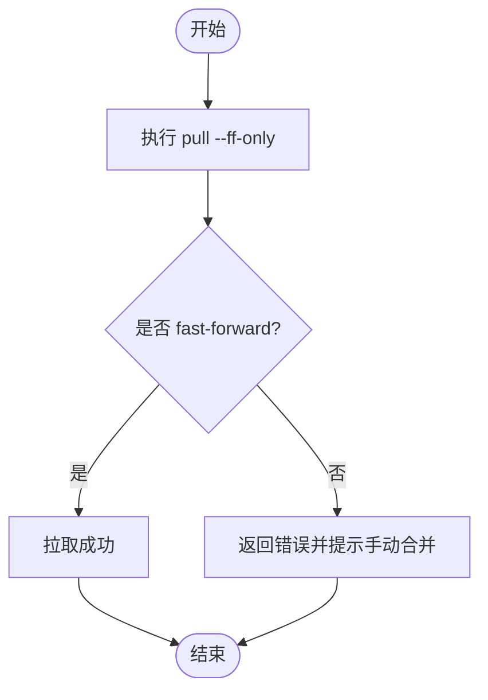
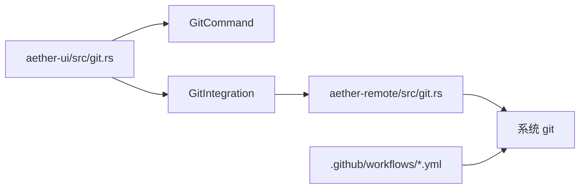

# Git 集成

<cite>
**本文引用的文件**
- [crates/aether-remote/src/git.rs](file://crates/aether-remote/src/git.rs)
- [crates/aether-ui/src/git.rs](file://crates/aether-ui/src/git.rs)
- [crates/aether-win32/src/git.rs](file://crates/aether-win32/src/git.rs)
- [crates/aether-win32/src/render/sidebar_scm.rs](file://crates/aether-win32/src/render/sidebar_scm.rs)
- [.github/workflows/branch-protection.yml](file://.github/workflows/branch-protection.yml)
- [.github/workflows/dev-feature-tracker.yml](file://.github/workflows/dev-feature-tracker.yml)
- [.github/workflows/release-demo.yml](file://.github/workflows/release-demo.yml)
- [.gitignore](file://.gitignore)
</cite>

## 目录
1. [简介](#简介)
2. [项目结构](#项目结构)
3. [核心组件](#核心组件)
4. [架构总览](#架构总览)
5. [详细组件分析](#详细组件分析)
6. [依赖关系分析](#依赖关系分析)
7. [性能考虑](#性能考虑)
8. [故障排除指南](#故障排除指南)
9. [结论](#结论)
10. [附录：API 参考与使用示例](#附录api-参考与使用示例)

## 简介
本文件面向“牧羊人编辑器”的 Git 集成功能，系统性说明版本控制命令的封装实现、工作区状态监控、冲突解决机制、远程仓库交互、Git 钩子支持与自定义扩展点，以及在工作流中的集成方案（预提交检查与持续集成触发）。文档同时提供常见操作的 API 参考与使用示例，并给出故障排除与性能优化建议。

## 项目结构
Git 相关能力主要分布在以下模块：
- aether-remote：通过系统 git 二进制执行命令，提供仓库克隆、分支、提交、拉取、推送、日志等高级封装。
- aether-ui：UI 层对 Git 状态的检测、解析与展示，包含文件状态枚举、命令执行器与集成管理器。
- aether-win32：Windows 平台 UI 渲染与 SCM 侧边栏，负责将 Git 状态可视化呈现给用户。
- .github/workflows：CI/CD 流程，包括分支保护、特性追踪、发布流水线等。

图表来源
- [crates/aether-ui/src/git.rs:1-562](file://crates/aether-ui/src/git.rs#L1-L562)
- [crates/aether-win32/src/render/sidebar_scm.rs:1-643](file://crates/aether-win32/src/render/sidebar_scm.rs#L1-L643)
- [crates/aether-remote/src/git.rs:1-531](file://crates/aether-remote/src/git.rs#L1-L531)
- [.github/workflows/branch-protection.yml:1-80](file://.github/workflows/branch-protection.yml#L1-L80)
- [.github/workflows/dev-feature-tracker.yml:1-76](file://.github/workflows/dev-feature-tracker.yml#L1-L76)
- [.github/workflows/release-demo.yml:135-147](file://.github/workflows/release-demo.yml#L135-L147)

章节来源
- [crates/aether-ui/src/git.rs:1-562](file://crates/aether-ui/src/git.rs#L1-L562)
- [crates/aether-win32/src/render/sidebar_scm.rs:1-643](file://crates/aether-win32/src/render/sidebar_scm.rs#L1-L643)
- [crates/aether-remote/src/git.rs:1-531](file://crates/aether-remote/src/git.rs#L1-L531)
- [.github/workflows/branch-protection.yml:1-80](file://.github/workflows/branch-protection.yml#L1-L80)
- [.github/workflows/dev-feature-tracker.yml:1-76](file://.github/workflows/dev-feature-tracker.yml#L1-L76)
- [.github/workflows/release-demo.yml:135-147](file://.github/workflows/release-demo.yml#L135-L147)

## 核心组件
- GitRepository（aether-remote）：基于系统 git 的二进制封装，提供 clone/open/current_branch/status/add/commit/checkout_branch/list_branches/log/pull/push 等方法；统一错误类型 GitError；支持 SSH/HTTPS/Local 仓库类型识别。
- GitCommand（aether-ui / aether-win32）：轻量级命令执行器，封装 add/commit/push/pull/fetch/branch/log/clone 等操作，返回 stdout/stderr/success。
- GitIntegration（aether-ui / aether-win32）：UI 集成管理器，维护当前文件夹、分支名、暂存/未暂存/未跟踪文件列表、提交消息、diff 视图状态等，并提供 stage/unstage/commit/push/pull/switch/create branch/clone_repo 等便捷方法。
- GitFileStatus：文件状态枚举（未修改、已修改、已暂存、已删除、重命名、复制、未跟踪、忽略、冲突），用于 UI 图标与颜色映射。
- SCM 侧边栏（sidebar_scm）：渲染源代码管理面板，显示分支、暂存更改、更改、未跟踪文件，并提供提交、刷新按钮交互。

章节来源
- [crates/aether-remote/src/git.rs:115-531](file://crates/aether-remote/src/git.rs#L115-L531)
- [crates/aether-ui/src/git.rs:186-562](file://crates/aether-ui/src/git.rs#L186-L562)
- [crates/aether-win32/src/git.rs:186-562](file://crates/aether-win32/src/git.rs#L186-L562)
- [crates/aether-win32/src/render/sidebar_scm.rs:1-643](file://crates/aether-win32/src/render/sidebar_scm.rs#L1-L643)

## 架构总览
整体采用“UI 层 + 核心封装 + CI/CD”的分层设计：
- UI 层（aether-ui / aether-win32）：负责用户交互、状态展示与基础命令调用。
- 核心封装（aether-remote）：提供更健壮、可复用的 Git 操作封装，统一错误处理与安全校验。
- CI/CD（GitHub Actions）：在 PR/合并/发布阶段执行分支保护、特性记录、清理与推送等自动化任务。

图表来源
- [crates/aether-ui/src/git.rs:482-516](file://crates/aether-ui/src/git.rs#L482-L516)
- [crates/aether-remote/src/git.rs:273-296](file://crates/aether-remote/src/git.rs#L273-L296)
- [crates/aether-remote/src/git.rs:199-257](file://crates/aether-remote/src/git.rs#L199-L257)

## 详细组件分析

### Git 命令封装与结果解析（aether-remote）
- 设计取舍：面向 Windows 开发者，默认安装 Git for Windows；零 C 依赖，运行期依赖系统 git。
- 关键能力：
  - 仓库检测与打开：open 校验 .git 目录，读取 origin URL 推断仓库类型。
  - 分支信息：current_branch 使用 symbolic-ref 获取当前分支，detached HEAD 时返回特定标识。
  - 工作区状态：status 使用 porcelain v1 -z 格式解析，区分 staged/unstaged/untracked/conflicts。
  - 提交历史：log 使用自定义 format 输出多字段，按记录分隔符解析为 GitCommit。
  - 远程交互：pull 仅允许 fast-forward；push 支持 force 标志；clone 支持 SSH/HTTPS/Local。
  - 安全加固：参数以 "--" 分隔，防止分支名/远程名以 "-" 开头被误解析为 flag。

图表来源
- [crates/aether-remote/src/git.rs:148-184](file://crates/aether-remote/src/git.rs#L148-L184)
- [crates/aether-remote/src/git.rs:199-257](file://crates/aether-remote/src/git.rs#L199-L257)

章节来源
- [crates/aether-remote/src/git.rs:1-531](file://crates/aether-remote/src/git.rs#L1-L531)

### 工作区状态监控（aether-ui / aether-win32）
- 状态检测：detect 检查 .git 目录存在性，读取 HEAD 获取分支名，调用 get_status 解析 porcelain 输出。
- 状态解析：get_status 逐行解析 index 与工作树状态，处理重命名箭头标记，构建文件状态映射与三类文件列表。
- UI 集成：GitIntegration 维护 current_folder、分支名、暂存/未暂存/未跟踪文件、提交消息、diff 视图等，并提供 stage/unstage/commit/push/pull/switch/create branch/clone_repo 等方法。
- 渲染：SCM 侧边栏显示分支、暂存更改、更改、未跟踪文件，提供提交与刷新按钮，并根据状态显示图标与颜色。

图表来源
- [crates/aether-ui/src/git.rs:19-184](file://crates/aether-ui/src/git.rs#L19-L184)
- [crates/aether-ui/src/git.rs:186-562](file://crates/aether-ui/src/git.rs#L186-L562)
- [crates/aether-win32/src/git.rs:19-184](file://crates/aether-win32/src/git.rs#L19-L184)
- [crates/aether-win32/src/git.rs:186-562](file://crates/aether-win32/src/git.rs#L186-L562)

章节来源
- [crates/aether-ui/src/git.rs:1-562](file://crates/aether-ui/src/git.rs#L1-L562)
- [crates/aether-win32/src/git.rs:1-562](file://crates/aether-win32/src/git.rs#L1-L562)
- [crates/aether-win32/src/render/sidebar_scm.rs:1-643](file://crates/aether-win32/src/render/sidebar_scm.rs#L1-L643)

### 冲突解决机制
- 冲突检测：status 解析中识别 U 状态或 A/A、D/D 组合，归类到 conflicts 列表。
- 自动合并策略：pull 仅允许 fast-forward，非 fast-forward 会返回错误，提示需要手动处理。
- 用户干预流程：UI 层检测到冲突后，可在 SCM 面板中展示冲突文件，引导用户进行手动合并或撤销操作。

图表来源
- [crates/aether-remote/src/git.rs:398-436](file://crates/aether-remote/src/git.rs#L398-L436)
- [crates/aether-remote/src/git.rs:235-253](file://crates/aether-remote/src/git.rs#L235-L253)

章节来源
- [crates/aether-remote/src/git.rs:199-257](file://crates/aether-remote/src/git.rs#L199-L257)
- [crates/aether-remote/src/git.rs:398-436](file://crates/aether-remote/src/git.rs#L398-L436)

### 与远程仓库的交互
- 克隆：clone 支持 SSH/HTTPS/Local，校验 URL 协议，避免危险协议。
- 拉取：pull 仅允许 fast-forward，确保线性历史。
- 推送：push 支持可选 remote/branch 与 force 标志。
- 获取：fetch 用于更新远程引用而不合并。
- 分支：list_branches 列出本地分支，checkout_branch 创建/切换分支。

章节来源
- [crates/aether-remote/src/git.rs:123-184](file://crates/aether-remote/src/git.rs#L123-L184)
- [crates/aether-remote/src/git.rs:398-483](file://crates/aether-remote/src/git.rs#L398-L483)
- [crates/aether-ui/src/git.rs:316-340](file://crates/aether-ui/src/git.rs#L316-L340)

### Git 钩子支持与自定义扩展点
- 钩子支持：当前代码库未直接实现 pre-commit/post-commit 等钩子调用；可通过外部脚本或 CI 流程触发。
- 扩展点：建议在 UI 层增加钩子配置与执行入口，或在 CI 中定义分支保护与提交前检查规则。
- 现有 CI：分支保护强制 PR 源分支规则与描述要求；特性追踪在合并后记录特性并推送。

章节来源
- [.github/workflows/branch-protection.yml:1-80](file://.github/workflows/branch-protection.yml#L1-L80)
- [.github/workflows/dev-feature-tracker.yml:1-76](file://.github/workflows/dev-feature-tracker.yml#L1-L76)

### 工作流程集成方案
- 预提交检查：可通过本地 hook 或 CI 在 PR 阶段执行分支保护与描述验证。
- 持续集成触发：PR 打开/编辑/同步/重新打开触发分支保护；PR 关闭且合并后触发特性记录；发布流程清理特性记录并提交到 dev。

章节来源
- [.github/workflows/branch-protection.yml:1-80](file://.github/workflows/branch-protection.yml#L1-L80)
- [.github/workflows/dev-feature-tracker.yml:1-76](file://.github/workflows/dev-feature-tracker.yml#L1-L76)
- [.github/workflows/release-demo.yml:135-147](file://.github/workflows/release-demo.yml#L135-L147)

## 依赖关系分析
- UI 层依赖 GitCommand 执行基础命令，并通过 GitIntegration 协调状态与交互。
- 核心封装依赖系统 git 二进制，提供统一错误处理与安全校验。
- CI/CD 依赖 GitHub Actions，执行分支保护、特性记录与发布流程。

图表来源
- [crates/aether-ui/src/git.rs:186-562](file://crates/aether-ui/src/git.rs#L186-L562)
- [crates/aether-remote/src/git.rs:115-531](file://crates/aether-remote/src/git.rs#L115-L531)
- [.github/workflows/branch-protection.yml:1-80](file://.github/workflows/branch-protection.yml#L1-L80)

章节来源
- [crates/aether-ui/src/git.rs:186-562](file://crates/aether-ui/src/git.rs#L186-L562)
- [crates/aether-remote/src/git.rs:115-531](file://crates/aether-remote/src/git.rs#L115-L531)
- [.github/workflows/branch-protection.yml:1-80](file://.github/workflows/branch-protection.yml#L1-L80)

## 性能考虑
- 状态查询优化：使用 porcelain v1 -z 格式减少解析开销，避免频繁 I/O。
- 批量操作：stage_all/add_all 减少多次命令调用。
- 缓存策略：UI 层缓存 diff 内容与状态，减少重复计算。
- CI 效率：合理设置 fetch-depth 与并行任务，减少构建时间。

[本节提供通用指导，无需具体文件分析]

## 故障排除指南
- Git 未安装：检查 PATH 中是否存在 git，若缺失则引导用户下载安装。
- 无效仓库：确认路径下存在 .git 目录，或先执行 clone。
- 认证失败：SSH 需配置 ~/.ssh/config 与 ssh-agent；HTTPS 需配置凭据。
- 非 fast-forward：pull 失败时提示手动合并，避免自动合并导致冲突。
- 分支名非法：分支名/远程名不能以 "-" 开头，防止被解析为 flag。

章节来源
- [crates/aether-remote/src/git.rs:15-25](file://crates/aether-remote/src/git.rs#L15-L25)
- [crates/aether-remote/src/git.rs:148-184](file://crates/aether-remote/src/git.rs#L148-L184)
- [crates/aether-remote/src/git.rs:398-436](file://crates/aether-remote/src/git.rs#L398-L436)
- [crates/aether-remote/src/git.rs:437-483](file://crates/aether-remote/src/git.rs#L437-L483)

## 结论
本项目通过分层设计与系统 git 二进制调用，实现了稳健的 Git 集成能力。UI 层提供直观的状态展示与交互，核心封装统一错误处理与安全校验，CI/CD 保障分支规范与自动化流程。未来可扩展钩子支持与更丰富的冲突解决策略，进一步提升用户体验与开发效率。

[本节总结内容，无需具体文件分析]

## 附录：API 参考与使用示例

### GitRepository（aether-remote）
- clone(url, path) -> Result<Self>
- open(path) -> Result<Self>
- current_branch() -> Result<String>
- status() -> Result<GitStatus>
- add(pathspec) -> Result<()>
- commit(message) -> Result<String>
- checkout_branch(branch_name, create) -> Result<()>
- list_branches() -> Result<Vec<String>>
- log(max_count) -> Result<Vec<GitCommit>>
- pull(remote_name, branch_name) -> Result<()>
- push(remote_name, branch_name, force) -> Result<()>

章节来源
- [crates/aether-remote/src/git.rs:123-483](file://crates/aether-remote/src/git.rs#L123-L483)

### GitCommand（aether-ui / aether-win32）
- exec(path, args) -> (String, String, bool)
- add(path, file) -> Result<String, String>
- add_all(path) -> Result<String, String>
- unstage(path, file) -> Result<String, String>
- commit(path, message) -> Result<String, String>
- push(path) -> Result<String, String>
- pull(path) -> Result<String, String>
- fetch(path) -> Result<String, String>
- create_branch(path, branch) -> Result<String, String>
- switch_branch(path, branch) -> Result<String, String>
- list_branches(path) -> Vec<String>
- log(path, count) -> Vec<String>
- clone(url, path) -> Result<String, String>

章节来源
- [crates/aether-ui/src/git.rs:186-340](file://crates/aether-ui/src/git.rs#L186-L340)
- [crates/aether-win32/src/git.rs:186-340](file://crates/aether-win32/src/git.rs#L186-L340)

### GitIntegration（aether-ui / aether-win32）
- new() -> Self
- detect(path)
- refresh()
- stage_file(file) -> Result<String, String>
- stage_all() -> Result<String, String>
- unstage_file(file) -> Result<String, String>
- commit(message) -> Result<String, String>
- push() -> Result<String, String>
- pull() -> Result<String, String>
- branches() -> Vec<String>
- switch_branch(branch) -> Result<String, String>
- create_branch(branch) -> Result<String, String>
- clone_repo(url, path) -> Result<String, String>

章节来源
- [crates/aether-ui/src/git.rs:342-562](file://crates/aether-ui/src/git.rs#L342-L562)
- [crates/aether-win32/src/git.rs:342-562](file://crates/aether-win32/src/git.rs#L342-L562)

### 使用示例
- 检测仓库：调用 GitRepository::detect(path)，若 is_repo 为真则继续后续操作。
- 暂存文件：调用 GitIntegration::stage_file(file)，成功后刷新状态。
- 提交更改：调用 GitIntegration::commit(message)，成功后刷新状态。
- 拉取远程：调用 GitIntegration::pull()，若失败则提示手动合并。
- 推送远程：调用 GitIntegration::push()，可选择 force 标志。

章节来源
- [crates/aether-ui/src/git.rs:419-516](file://crates/aether-ui/src/git.rs#L419-L516)
- [crates/aether-win32/src/git.rs:419-516](file://crates/aether-win32/src/git.rs#L419-L516)