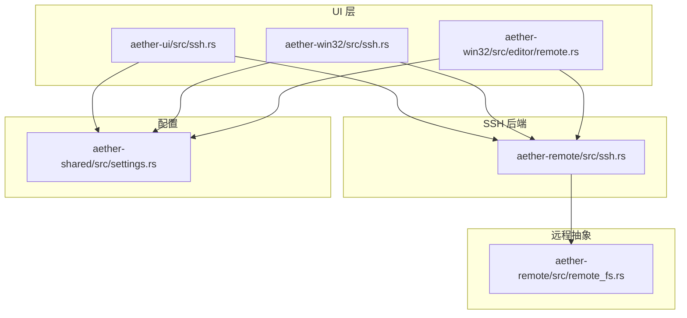
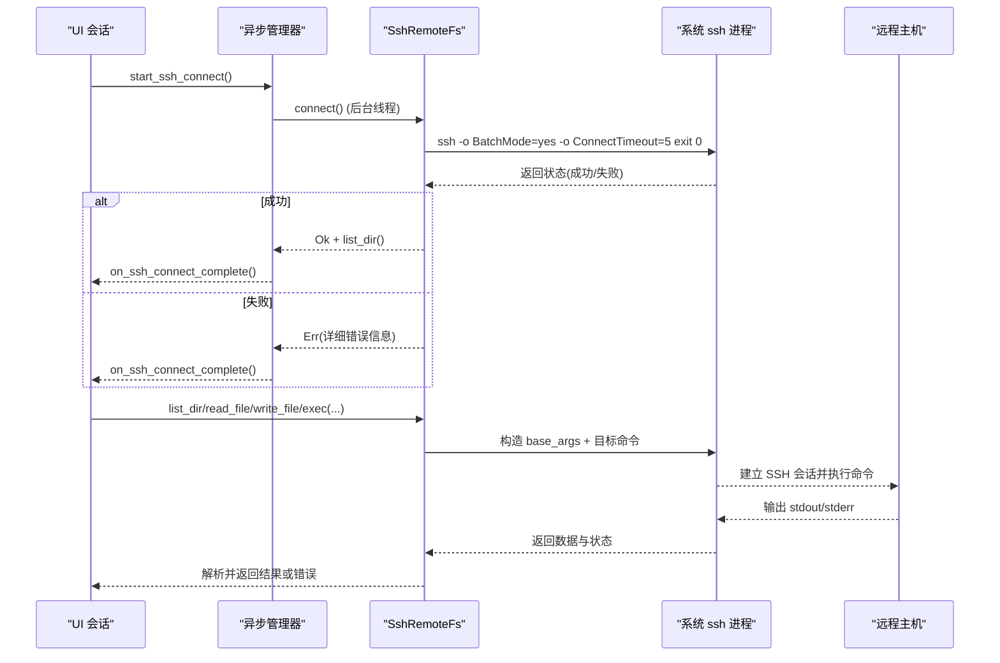
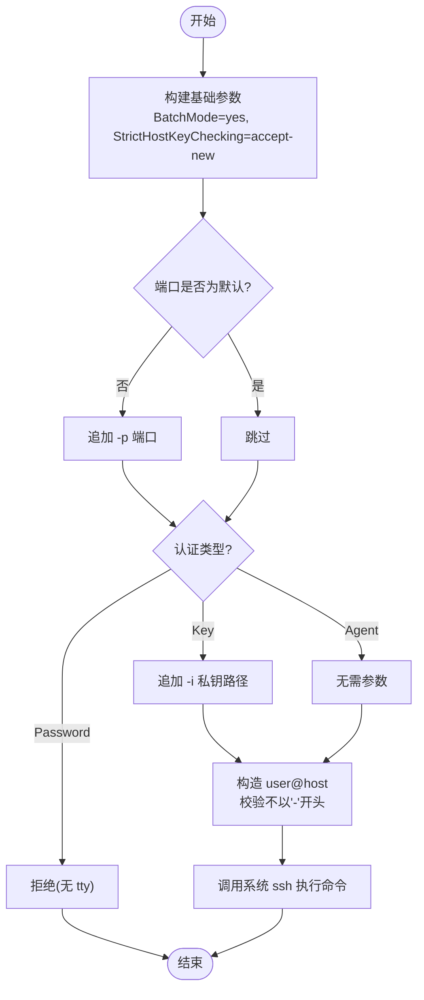
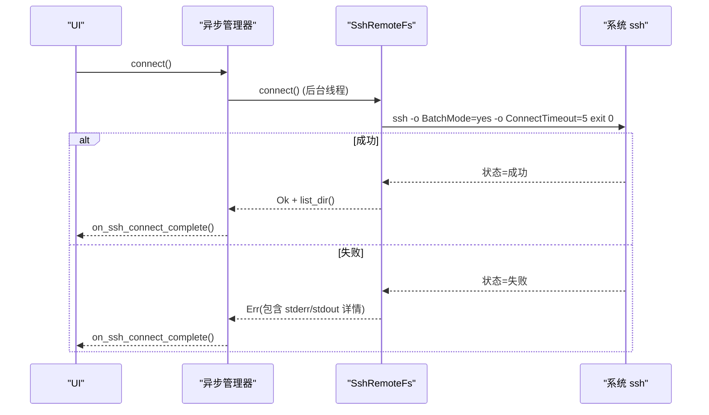
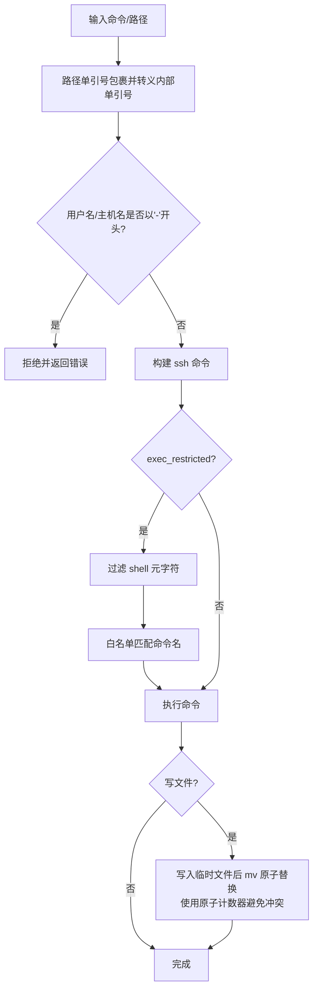
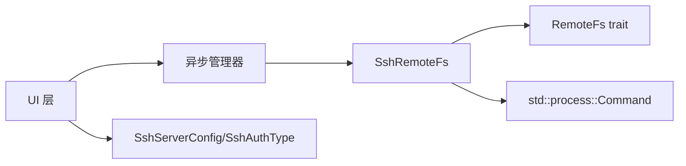
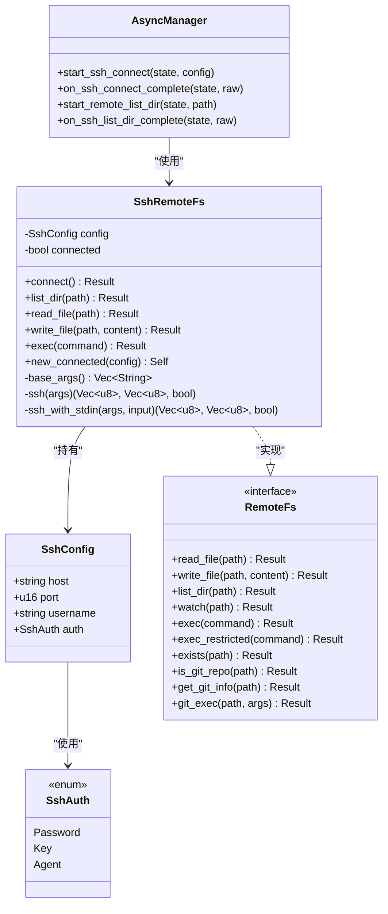
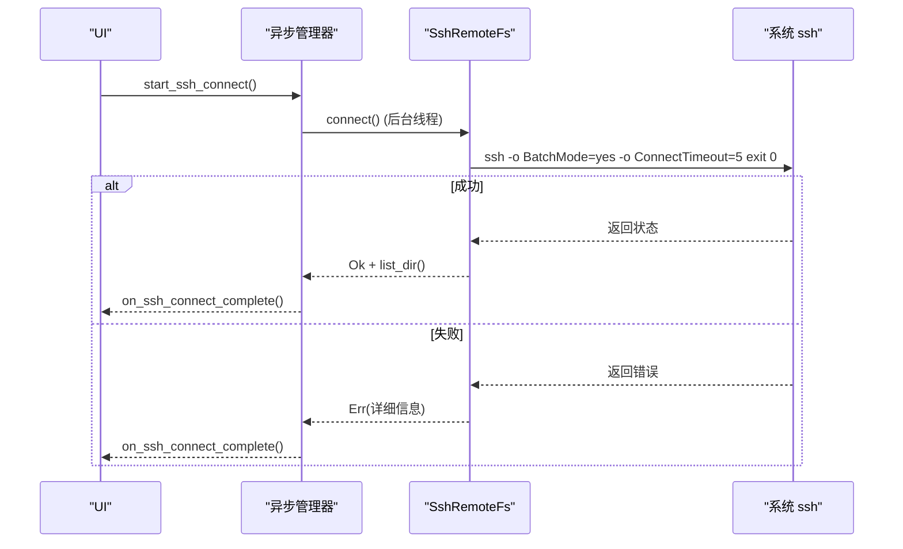
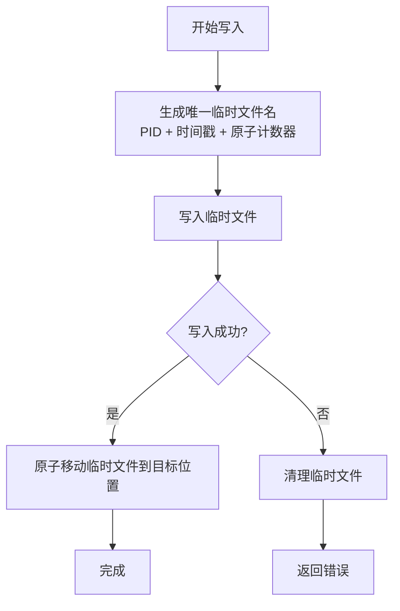
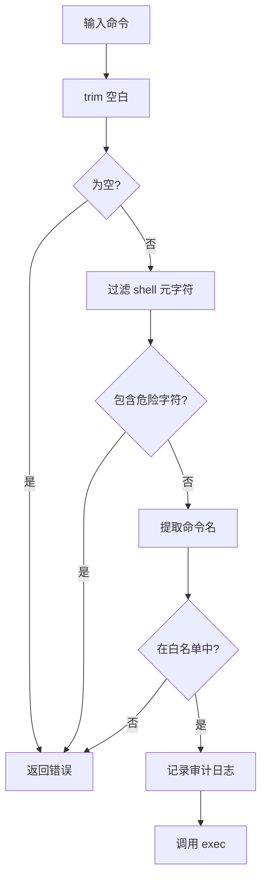

# SSH 连接管理

<cite>
**本文引用的文件**
- [crates/aether-remote/src/ssh.rs](file://crates/aether-remote/src/ssh.rs)
- [crates/aether-remote/src/remote_fs.rs](file://crates/aether-remote/src/remote_fs.rs)
- [crates/aether-ui/src/ssh.rs](file://crates/aether-ui/src/ssh.rs)
- [crates/aether-win32/src/ssh.rs](file://crates/aether-win32/src/ssh.rs)
- [crates/aether-shared/src/settings.rs](file://crates/aether-shared/src/settings.rs)
- [crates/aether-win32/src/editor/remote.rs](file://crates/aether-win32/src/editor/remote.rs)
</cite>

## 更新摘要
**变更内容**
- 增强了连接管理机制，支持后台线程复用已验证连接
- 改进了错误处理，提供更详细的连接失败信息
- 实现了完整的异步连接流程，避免UI阻塞
- 强化了原子写入机制，防止并发写入冲突
- 增强了命令注入防护和参数验证

## 目录
1. [简介](#简介)
2. [项目结构](#项目结构)
3. [核心组件](#核心组件)
4. [架构总览](#架构总览)
5. [详细组件分析](#详细组件分析)
6. [依赖关系分析](#依赖关系分析)
7. [性能考虑](#性能考虑)
8. [故障排除指南](#故障排除指南)
9. [结论](#结论)
10. [附录](#附录)

## 简介
本文件面向"基于系统 OpenSSH 客户端的 SSH 连接管理"能力，系统性说明进程调用模式、命令参数构建与安全策略；详解认证机制（密钥、Agent、密码）的差异与限制；文档化连接建立流程（连接测试、超时处理、错误恢复）；解释 shell 命令注入防护（路径转义、参数校验）；说明 Windows 平台的特殊处理（OpenSSH 检测与安装引导）；并提供配置最佳实践、性能优化建议与常见问题解决方案。

**最新更新**：增强了连接管理和错误处理能力，包括异步连接支持、原子写入改进和安全防护强化。

## 项目结构
该功能由以下模块协作实现：
- aether-remote: 提供远程文件系统抽象与 SSH 后端实现（通过系统 ssh 二进制执行）。
- aether-ui / aether-win32: UI 层封装，负责用户输入、会话状态、对话框与面板交互。
- aether-shared: 持久化设置模型（SSH 服务器配置、认证类型等）。

**图表来源**
- [crates/aether-remote/src/ssh.rs:1-403](file://crates/aether-remote/src/ssh.rs#L1-L403)
- [crates/aether-remote/src/remote_fs.rs:1-268](file://crates/aether-remote/src/remote_fs.rs#L1-L268)
- [crates/aether-ui/src/ssh.rs:1-616](file://crates/aether-ui/src/ssh.rs#L1-L616)
- [crates/aether-win32/src/ssh.rs:1-606](file://crates/aether-win32/src/ssh.rs#L1-L606)
- [crates/aether-shared/src/settings.rs:269-327](file://crates/aether-shared/src/settings.rs#L269-L327)
- [crates/aether-win32/src/editor/remote.rs:1-754](file://crates/aether-win32/src/editor/remote.rs#L1-L754)

**章节来源**
- [crates/aether-remote/src/ssh.rs:1-403](file://crates/aether-remote/src/ssh.rs#L1-L403)
- [crates/aether-remote/src/remote_fs.rs:1-268](file://crates/aether-remote/src/remote_fs.rs#L1-L268)
- [crates/aether-ui/src/ssh.rs:1-616](file://crates/aether-ui/src/ssh.rs#L1-L616)
- [crates/aether-win32/src/ssh.rs:1-606](file://crates/aether-win32/src/ssh.rs#L1-L606)
- [crates/aether-shared/src/settings.rs:269-327](file://crates/aether-shared/src/settings.rs#L269-L327)
- [crates/aether-win32/src/editor/remote.rs:1-754](file://crates/aether-win32/src/editor/remote.rs#L1-L754)

## 核心组件
- SshRemoteFs: 基于系统 ssh 的二进程调用实现，提供 read_file/write_file/list_dir/exec 等操作。
- RemoteFs trait: 统一远程文件系统接口，包含受限命令执行 exec_restricted 与 Git 操作辅助。
- SshConfig/SshAuth: 连接配置与认证方式（Agent/Key/Password）。
- UI 会话与面板: RemoteSession、SshConnectionDialog、SshManagerPanel 等，负责用户交互与状态管理。
- 设置模型: SshServerConfig/SshAuthType，用于持久化服务器配置与认证类型。
- **新增**: 异步连接管理器，支持后台线程处理和UI状态同步。

**章节来源**
- [crates/aether-remote/src/ssh.rs:42-106](file://crates/aether-remote/src/ssh.rs#L42-L106)
- [crates/aether-remote/src/remote_fs.rs:26-186](file://crates/aether-remote/src/remote_fs.rs#L26-L186)
- [crates/aether-ui/src/ssh.rs:22-182](file://crates/aether-ui/src/ssh.rs#L22-L182)
- [crates/aether-win32/src/ssh.rs:22-182](file://crates/aether-win32/src/ssh.rs#L22-L182)
- [crates/aether-shared/src/settings.rs:269-327](file://crates/aether-shared/src/settings.rs#L269-L327)
- [crates/aether-win32/src/editor/remote.rs:3-90](file://crates/aether-win32/src/editor/remote.rs#L3-L90)

## 架构总览
SSH 连接管理采用"进程外调用系统 OpenSSH 客户端"的模式，避免引入 SSH 库依赖，编译期零依赖，运行期依赖系统 ssh。所有文件操作与命令执行均通过构造 ssh 命令行并调用系统 ssh 完成。

**更新**：新增了异步连接架构，支持后台线程处理连接请求，避免UI阻塞。

**图表来源**
- [crates/aether-remote/src/ssh.rs:130-154](file://crates/aether-remote/src/ssh.rs#L130-L154)
- [crates/aether-remote/src/ssh.rs:166-223](file://crates/aether-remote/src/ssh.rs#L166-L223)
- [crates/aether-remote/src/ssh.rs:265-401](file://crates/aether-remote/src/ssh.rs#L265-L401)
- [crates/aether-win32/src/editor/remote.rs:3-90](file://crates/aether-win32/src/editor/remote.rs#L3-L90)

## 详细组件分析

### 进程调用模式与命令参数构建
- 基础参数: 每次调用都会附加 BatchMode=yes（禁用交互式提示）、StrictHostKeyChecking=accept-new（首次自动接受新主机密钥），并根据端口非默认时追加 -p。
- 认证参数: 若使用密钥认证，会追加 -i 指定私钥路径；Agent 认证则不传额外参数，交由 ssh 使用 ssh-agent。
- 目标构造: 以 user@host 形式拼接目标，并对用户名和主机名进行安全校验，拒绝以 '-' 开头的值，防止被解释为选项注入。
- 命令执行: 无 stdin 时使用 ssh(output)，带 stdin 时使用 ssh_with_stdin(spawn+stdin 写入)。

**更新**：增强了参数构建的安全性，增加了更严格的输入验证。

**图表来源**
- [crates/aether-remote/src/ssh.rs:166-202](file://crates/aether-remote/src/ssh.rs#L166-L202)
- [crates/aether-remote/src/ssh.rs:204-262](file://crates/aether-remote/src/ssh.rs#L204-L262)

**章节来源**
- [crates/aether-remote/src/ssh.rs:166-262](file://crates/aether-remote/src/ssh.rs#L166-L262)

### 认证机制与限制
- Agent 认证: 默认推荐，利用系统 ssh-agent，无需传递私钥路径。
- 密钥认证: 通过 -i 指定私钥路径，支持可选 passphrase（在 UI 层收集，但当前实现未将 passphrase 传入 ssh 参数，需确保私钥可被 ssh-agent 或本地解密）。
- 密码认证: 明确不支持。由于 shell out 模式无 tty，无法交互式输入密码；UI 层与连接层双重拦截，强制回退到 Agent。

**更新**：增强了认证机制的安全检查，在多个层级进行密码认证拦截。

**章节来源**
- [crates/aether-remote/src/ssh.rs:42-68](file://crates/aether-remote/src/ssh.rs#L42-L68)
- [crates/aether-remote/src/ssh.rs:130-154](file://crates/aether-remote/src/ssh.rs#L130-L154)
- [crates/aether-ui/src/ssh.rs:80-106](file://crates/aether-ui/src/ssh.rs#L80-L106)
- [crates/aether-win32/src/ssh.rs:80-106](file://crates/aether-win32/src/ssh.rs#L80-L106)
- [crates/aether-shared/src/settings.rs:269-327](file://crates/aether-shared/src/settings.rs#L269-L327)

### 连接建立流程（测试、超时、错误恢复）
- 连接测试: 使用 ssh -o BatchMode=yes -o ConnectTimeout=5 exit 0 快速探测连通性与认证可用性。
- 超时处理: ConnectTimeout 控制连接超时；BatchMode 禁止交互，保证非阻塞。
- 错误恢复: 连接失败时返回详细 stderr/stdout 信息；write_file 失败时会尝试清理临时文件。

**更新**：增强了错误恢复机制，提供了更详细的错误信息和更好的用户体验。

**图表来源**
- [crates/aether-remote/src/ssh.rs:130-154](file://crates/aether-remote/src/ssh.rs#L130-L154)
- [crates/aether-win32/src/editor/remote.rs:3-90](file://crates/aether-win32/src/editor/remote.rs#L3-L90)

**章节来源**
- [crates/aether-remote/src/ssh.rs:130-154](file://crates/aether-remote/src/ssh.rs#L130-L154)
- [crates/aether-win32/src/editor/remote.rs:3-90](file://crates/aether-win32/src/editor/remote.rs#L3-L90)

### Shell 命令注入防护
- 路径转义: 所有路径参数通过单引号包裹，内部单引号转义，避免 shell 注入。
- 参数验证: 用户名与主机名禁止以 '-' 开头，防止被解释为选项注入。
- 受限命令执行: exec_restricted 对命令进行白名单过滤与 shell 元字符过滤，仅允许只读或必要的安全命令；Git 操作通过 git_exec 进一步校验参数，阻止路径遍历与绝对路径。
- 原子写入: write_file 先写入同目录临时文件再 mv 原子替换，避免断连导致文件损坏。

**更新**：增强了原子写入机制，使用原子计数器避免并发写入时的临时文件冲突。

**图表来源**
- [crates/aether-remote/src/ssh.rs:25-28](file://crates/aether-remote/src/ssh.rs#L25-L28)
- [crates/aether-remote/src/ssh.rs:186-202](file://crates/aether-remote/src/ssh.rs#L186-L202)
- [crates/aether-remote/src/remote_fs.rs:46-94](file://crates/aether-remote/src/remote_fs.rs#L46-L94)
- [crates/aether-remote/src/remote_fs.rs:162-185](file://crates/aether-remote/src/remote_fs.rs#L162-L185)
- [crates/aether-remote/src/ssh.rs:285-321](file://crates/aether-remote/src/ssh.rs#L285-L321)

**章节来源**
- [crates/aether-remote/src/ssh.rs:25-28](file://crates/aether-remote/src/ssh.rs#L25-L28)
- [crates/aether-remote/src/ssh.rs:186-202](file://crates/aether-remote/src/ssh.rs#L186-L202)
- [crates/aether-remote/src/remote_fs.rs:46-94](file://crates/aether-remote/src/remote_fs.rs#L46-L94)
- [crates/aether-remote/src/remote_fs.rs:162-185](file://crates/aether-remote/src/remote_fs.rs#L162-L185)
- [crates/aether-remote/src/ssh.rs:285-321](file://crates/aether-remote/src/ssh.rs#L285-L321)

### Windows 平台特殊处理
- OpenSSH 检测: 启动前调用 ssh_available 检查系统是否存在 ssh 并可执行；缺失时引导用户访问官方下载页。
- 安装引导: 提供 SSH_DOWNLOAD_URL 常量，便于 UI 层跳转至 Microsoft OpenSSH 页面。
- 注意: 代码中未包含自动安装逻辑，仅做检测与引导。

**更新**：增强了Windows平台的错误处理，提供更友好的用户提示。

**章节来源**
- [crates/aether-remote/src/ssh.rs:19-40](file://crates/aether-remote/src/ssh.rs#L19-L40)
- [crates/aether-win32/src/editor/remote.rs:5-18](file://crates/aether-win32/src/editor/remote.rs#L5-L18)

### 连接配置与最佳实践
- 推荐认证方式: 优先使用 Agent 认证；其次使用密钥认证并确保私钥权限正确。
- 避免密码认证: 因无 tty，密码认证不可用；UI 层已强制回退到 Agent。
- 主机与用户名安全: 不要以 '-' 开头；避免包含危险字符。
- 端口与目标: 非默认端口需显式配置；目标格式 user@host。
- 原子写入: 写大文件时建议使用分块或流式传输以减少内存占用（当前实现通过 stdin 管道传输内容）。

**更新**：强调了异步连接的最佳实践，推荐使用后台线程处理连接请求。

**章节来源**
- [crates/aether-ui/src/ssh.rs:80-106](file://crates/aether-ui/src/ssh.rs#L80-L106)
- [crates/aether-win32/src/ssh.rs:80-106](file://crates/aether-win32/src/ssh.rs#L80-L106)
- [crates/aether-shared/src/settings.rs:269-327](file://crates/aether-shared/src/settings.rs#L269-L327)
- [crates/aether-win32/src/editor/remote.rs:153-229](file://crates/aether-win32/src/editor/remote.rs#L153-L229)

## 依赖关系分析
- UI 层依赖 aether_remote::ssh 提供的 SshRemoteFs、SshConfig、SshAuth 等。
- aether_remote::ssh 依赖系统 ssh 二进制，并通过 std::process::Command 调用。
- remote_fs trait 提供统一接口，SSH 后端实现具体方法。
- 设置模块提供持久化配置，UI 层读取并转换为运行时配置。

**更新**：新增了异步管理器对UI层的依赖关系。

**图表来源**
- [crates/aether-ui/src/ssh.rs:1-5](file://crates/aether-ui/src/ssh.rs#L1-L5)
- [crates/aether-remote/src/ssh.rs:12-17](file://crates/aether-remote/src/ssh.rs#L12-L17)
- [crates/aether-remote/src/remote_fs.rs:26-44](file://crates/aether-remote/src/remote_fs.rs#L26-L44)
- [crates/aether-shared/src/settings.rs:269-327](file://crates/aether-shared/src/settings.rs#L269-L327)
- [crates/aether-win32/src/editor/remote.rs:3-90](file://crates/aether-win32/src/editor/remote.rs#L3-L90)

**章节来源**
- [crates/aether-ui/src/ssh.rs:1-5](file://crates/aether-ui/src/ssh.rs#L1-L5)
- [crates/aether-remote/src/ssh.rs:12-17](file://crates/aether-remote/src/ssh.rs#L12-L17)
- [crates/aether-remote/src/remote_fs.rs:26-44](file://crates/aether-remote/src/remote_fs.rs#L26-L44)
- [crates/aether-shared/src/settings.rs:269-327](file://crates/aether-shared/src/settings.rs#L269-L327)
- [crates/aether-win32/src/editor/remote.rs:3-90](file://crates/aether-win32/src/editor/remote.rs#L3-L90)

## 性能考虑
- 进程开销: 每次操作都 fork 新的 ssh 进程，存在进程创建与销毁开销；适合低频或小批量操作。
- 批量化: 尽量合并操作（如一次性列出目录），减少多次连接。
- 超时与重试: 合理设置 ConnectTimeout；对网络抖动场景可实现指数退避重试。
- 大文件写入: 使用 stdin 管道传输，避免一次性加载到大内存；必要时分块写入。
- 缓存: 对频繁读取的小文件可在应用层做短期缓存（注意一致性）。
- **新增**: 异步连接：使用后台线程处理连接请求，避免UI阻塞，提升用户体验。
- **新增**: 连接复用：通过 `new_connected` 方法复用已验证的连接配置，避免重复连接探测。

## 故障排除指南
- 连接失败:
  - 检查系统是否安装 ssh 且 PATH 可用；参考 ssh_available 检测结果。
  - 查看错误信息中的 stderr/stdout 定位认证或网络问题。
- 认证失败:
  - 确认使用 Agent 或密钥认证；密码认证不可用。
  - 检查私钥路径与权限；确保 ssh-agent 已加载密钥。
- 写入失败:
  - 检查远程路径权限；临时文件清理可能失败，需手动清理。
- 命令执行失败:
  - 使用 exec_restricted 白名单限制；确认命令在白名单内。
  - 检查 shell 元字符是否被过滤。

**更新**：增强了故障排除指南，包含了异步连接相关的常见问题。

**章节来源**
- [crates/aether-remote/src/ssh.rs:130-154](file://crates/aether-remote/src/ssh.rs#L130-L154)
- [crates/aether-remote/src/ssh.rs:285-321](file://crates/aether-remote/src/ssh.rs#L285-L321)
- [crates/aether-remote/src/remote_fs.rs:46-94](file://crates/aether-remote/src/remote_fs.rs#L46-L94)
- [crates/aether-win32/src/editor/remote.rs:66-90](file://crates/aether-win32/src/editor/remote.rs#L66-L90)

## 结论
本实现通过系统 OpenSSH 客户端提供轻量、安全的 SSH 远程文件系统能力。其设计强调安全（路径转义、参数校验、受限命令白名单）、稳健（原子写入、超时与错误信息）与易用（Agent 默认、UI 层多重拦截）。在生产环境中，建议优先使用 Agent 认证，结合合理的超时与重试策略，以获得稳定高效的远程访问体验。

**更新总结**：最新的增强包括异步连接支持、原子写入改进、错误处理强化和安全防护增强，显著提升了系统的稳定性和用户体验。

## 附录

### 类图（代码级）

**图表来源**
- [crates/aether-remote/src/ssh.rs:42-106](file://crates/aether-remote/src/ssh.rs#L42-L106)
- [crates/aether-remote/src/ssh.rs:101-263](file://crates/aether-remote/src/ssh.rs#L101-L263)
- [crates/aether-remote/src/remote_fs.rs:26-186](file://crates/aether-remote/src/remote_fs.rs#L26-L186)
- [crates/aether-win32/src/editor/remote.rs:3-90](file://crates/aether-win32/src/editor/remote.rs#L3-L90)

### 序列图（异步连接建立）

**图表来源**
- [crates/aether-remote/src/ssh.rs:130-154](file://crates/aether-remote/src/ssh.rs#L130-L154)
- [crates/aether-win32/src/editor/remote.rs:3-90](file://crates/aether-win32/src/editor/remote.rs#L3-L90)

### 流程图（原子写入）

**图表来源**
- [crates/aether-remote/src/ssh.rs:285-321](file://crates/aether-remote/src/ssh.rs#L285-L321)

### 流程图（受限命令执行）

**图表来源**
- [crates/aether-remote/src/remote_fs.rs:46-94](file://crates/aether-remote/src/remote_fs.rs#L46-L94)