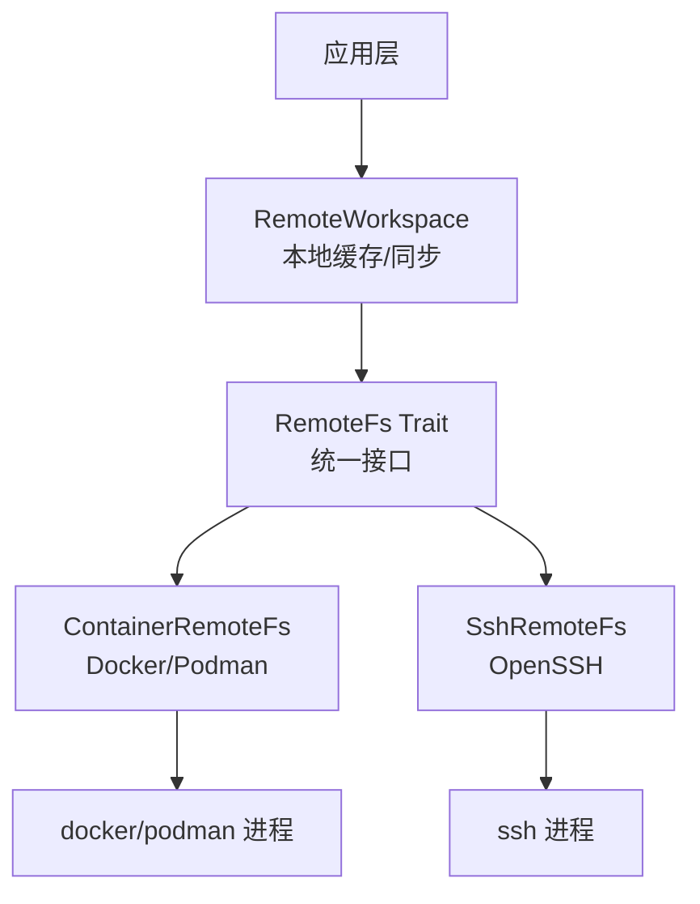
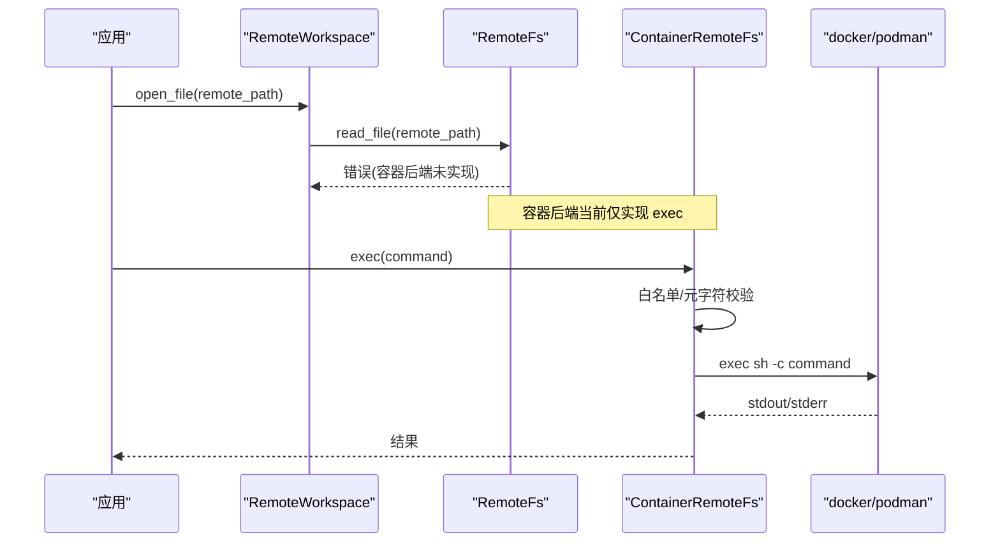
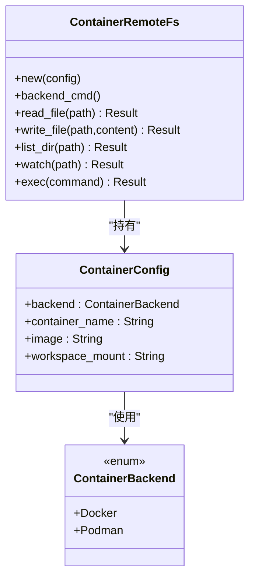
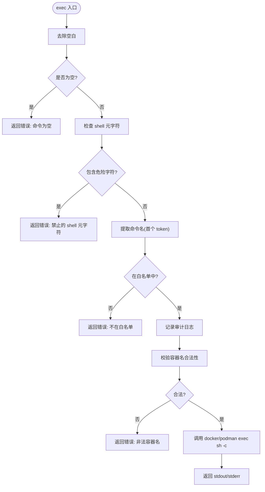
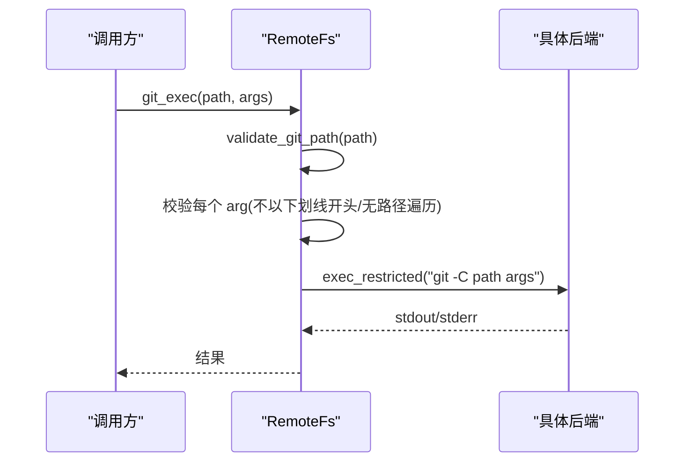
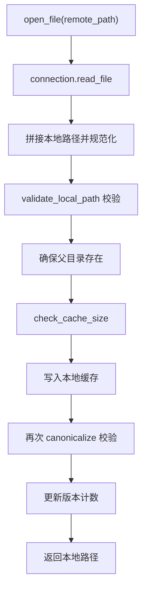
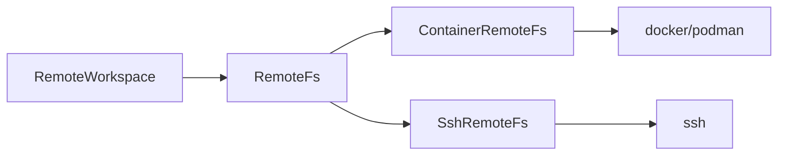

# 容器支持

<cite>
**本文引用的文件**
- [container.rs](file://crates/aether-remote/src/container.rs)
- [remote_fs.rs](file://crates/aether-remote/src/remote_fs.rs)
- [ssh.rs](file://crates/aether-remote/src/ssh.rs)
- [workspace.rs](file://crates/aether-remote/src/workspace.rs)
- [lib.rs](file://crates/aether-remote/src/lib.rs)
- [tests.rs](file://crates/aether-remote/src/tests.rs)
</cite>

## 目录
1. [简介](#简介)
2. [项目结构](#项目结构)
3. [核心组件](#核心组件)
4. [架构总览](#架构总览)
5. [详细组件分析](#详细组件分析)
6. [依赖关系分析](#依赖关系分析)
7. [性能考量](#性能考量)
8. [故障排查指南](#故障排查指南)
9. [结论](#结论)
10. [附录](#附录)

## 简介
本章节面向“容器支持”能力，基于仓库中的远程子系统实现，梳理容器连接、命令执行、安全校验与远程工作区缓存等关键机制。当前代码库提供了：
- 容器后端抽象（Docker/Podman）与受限命令执行通道
- 统一的远程文件系统接口（RemoteFs），SSH 与容器均可复用
- 远程工作区的本地缓存、路径校验与容量管理
- 对 SSH 远端的文件读写、目录枚举与命令执行

注意：镜像拉取、构建、版本控制、资源监控、编排与服务发现等高级能力在仓库中尚未实现，本节将明确标注为“未实现/待扩展”，并给出可落地的集成建议。

## 项目结构
远程能力集中在 aether-remote crate，提供统一抽象与多种后端实现：
- 容器后端：通过系统命令行调用 docker/podman exec 进入容器执行命令
- SSH 后端：通过系统 ssh 客户端访问远端文件系统
- RemoteFs trait：统一 read/write/list/watch/exec 等接口
- RemoteWorkspace：远程文件的本地缓存、同步与安全校验
- 工作区 URI 解析：支持 ssh:// 与 container:// 两种协议前缀

图表来源
- [container.rs:1-129](file://crates/aether-remote/src/container.rs#L1-L129)
- [remote_fs.rs:26-186](file://crates/aether-remote/src/remote_fs.rs#L26-L186)
- [ssh.rs:101-403](file://crates/aether-remote/src/ssh.rs#L101-L403)
- [workspace.rs:6-251](file://crates/aether-remote/src/workspace.rs#L6-L251)

章节来源
- [lib.rs:1-18](file://crates/aether-remote/src/lib.rs#L1-L18)
- [container.rs:1-129](file://crates/aether-remote/src/container.rs#L1-L129)
- [remote_fs.rs:1-268](file://crates/aether-remote/src/remote_fs.rs#L1-L268)
- [ssh.rs:1-403](file://crates/aether-remote/src/ssh.rs#L1-L403)
- [workspace.rs:1-251](file://crates/aether-remote/src/workspace.rs#L1-L251)

## 核心组件
- ContainerBackend：选择 Docker 或 Podman 作为运行时后端
- ContainerConfig：包含后端类型、容器名、镜像与工作区挂载路径
- ContainerRemoteFs：实现 RemoteFs，目前仅实现了 exec（受限命令执行）
- RemoteFs：定义统一远程文件系统接口，含受限命令执行 exec_restricted
- SshRemoteFs：基于 OpenSSH 的远程文件系统实现
- RemoteWorkspace：远程文件本地缓存、路径校验、容量清理与变更监听转发

章节来源
- [container.rs:5-38](file://crates/aether-remote/src/container.rs#L5-L38)
- [remote_fs.rs:26-186](file://crates/aether-remote/src/remote_fs.rs#L26-L186)
- [ssh.rs:101-165](file://crates/aether-remote/src/ssh.rs#L101-L165)
- [workspace.rs:6-251](file://crates/aether-remote/src/workspace.rs#L6-L251)

## 架构总览
容器支持以 RemoteFs 为核心抽象，屏蔽底层差异；上层通过 RemoteWorkspace 进行本地缓存与同步；容器后端通过系统命令与宿主容器引擎交互，执行受限命令。

图表来源
- [workspace.rs:58-100](file://crates/aether-remote/src/workspace.rs#L58-L100)
- [container.rs:40-123](file://crates/aether-remote/src/container.rs#L40-L123)
- [remote_fs.rs:26-44](file://crates/aether-remote/src/remote_fs.rs#L26-L44)

## 详细组件分析

### 容器后端与配置
- 后端选择：支持 Docker 与 Podman，通过枚举切换
- 配置项：容器名、镜像、工作区挂载路径
- 命令执行：通过系统进程调用 docker/podman exec 进入容器执行 sh -c 命令

图表来源
- [container.rs:5-38](file://crates/aether-remote/src/container.rs#L5-L38)
- [container.rs:21-38](file://crates/aether-remote/src/container.rs#L21-L38)

章节来源
- [container.rs:5-38](file://crates/aether-remote/src/container.rs#L5-L38)

### 受限命令执行与安全策略
- 命令白名单：区分只读与写入命令集合，仅允许受控命令
- Shell 元字符过滤：拒绝 ; | & ` $ > < \n \r ( ) ' " * ? [ ] { } ~ # ! 等危险字符
- 审计日志：所有 exec 与写入操作均记录审计信息
- 容器名校验：仅允许字母数字、连字符、下划线与点，防止注入 Docker 标志

图表来源
- [container.rs:58-123](file://crates/aether-remote/src/container.rs#L58-L123)
- [remote_fs.rs:46-94](file://crates/aether-remote/src/remote_fs.rs#L46-L94)

章节来源
- [container.rs:58-123](file://crates/aether-remote/src/container.rs#L58-L123)
- [remote_fs.rs:46-94](file://crates/aether-remote/src/remote_fs.rs#L46-L94)
- [tests.rs:582-618](file://crates/aether-remote/src/tests.rs#L582-L618)

### 远程文件系统抽象与 Git 安全执行
- RemoteFs trait 提供统一接口：read/write/list/watch/exec
- exec_restricted 默认实现：严格白名单 + 元字符过滤 + 审计
- Git 专用方法 git_exec：参数校验（不以 - 开头、无路径遍历、非绝对路径、无前缀 ./~/）
- is_git_repo 与 get_git_info：通过 list_dir 与受限命令获取仓库信息

图表来源
- [remote_fs.rs:162-185](file://crates/aether-remote/src/remote_fs.rs#L162-L185)
- [remote_fs.rs:117-160](file://crates/aether-remote/src/remote_fs.rs#L117-L160)

章节来源
- [remote_fs.rs:26-186](file://crates/aether-remote/src/remote_fs.rs#L26-L186)

### SSH 后端对比
- 连接方式：通过系统 ssh 客户端，支持密钥/Agent 认证（密码认证在 shell out 模式不支持）
- 文件操作：read_file 使用 cat，write_file 使用临时文件+mv 原子替换
- 目录枚举：find + stat 一次性获取条目属性
- 命令执行：exec 直接转发到远端 shell，带审计日志

章节来源
- [ssh.rs:101-403](file://crates/aether-remote/src/ssh.rs#L101-L403)

### 远程工作区与本地缓存
- 打开/保存文件：按需下载到本地缓存，保存时写回远程
- 路径安全：规范路径校验，防止路径穿越与符号链接 TOCTOU 攻击
- 容量管理：超过阈值自动清理最旧文件至目标比例
- 变更监听：转发底层 watch（容器/SSH 当前均返回不支持）

图表来源
- [workspace.rs:58-100](file://crates/aether-remote/src/workspace.rs#L58-L100)
- [workspace.rs:154-206](file://crates/aether-remote/src/workspace.rs#L154-L206)

章节来源
- [workspace.rs:6-251](file://crates/aether-remote/src/workspace.rs#L6-L251)

### 工作区 URI 解析
- 支持 ssh://host/path 与 container://name/path 格式
- 解析后返回协议与主机/容器名及路径组合

章节来源
- [workspace.rs:234-250](file://crates/aether-remote/src/workspace.rs#L234-L250)

## 依赖关系分析
- RemoteFs 是核心抽象，被 RemoteWorkspace 与上层逻辑依赖
- ContainerRemoteFs 与 SshRemoteFs 实现 RemoteFs，分别依赖外部进程（docker/podman、ssh）
- tests 覆盖容器后端行为与错误路径

图表来源
- [remote_fs.rs:26-44](file://crates/aether-remote/src/remote_fs.rs#L26-L44)
- [container.rs:21-38](file://crates/aether-remote/src/container.rs#L21-L38)
- [ssh.rs:101-165](file://crates/aether-remote/src/ssh.rs#L101-L165)

章节来源
- [lib.rs:1-18](file://crates/aether-remote/src/lib.rs#L1-L18)
- [tests.rs:568-642](file://crates/aether-remote/src/tests.rs#L568-L642)

## 性能考量
- 命令执行开销：每次 exec 都会启动外部进程，频繁调用会带来显著开销，建议批量操作或长连接方案
- 缓存策略：RemoteWorkspace 限制最大缓存大小并自动清理，避免磁盘无限增长
- 目录枚举：SSH 使用 find + stat 一次性获取属性，减少多次往返
- 原子写入：SSH write_file 采用临时文件+mv，降低断连导致的数据损坏风险

[本节为通用指导，不直接分析具体文件]

## 故障排查指南
- 命令被拒绝：检查是否包含 shell 元字符或不在白名单内
- 容器名非法：确保仅包含字母数字、连字符、下划线与点
- SSH 未连接：调用 connect 后再执行文件操作
- 路径穿越检测：确认远程路径不含 .. 与反斜杠，本地路径经规范校验
- 缓存溢出：检查本地缓存目录大小，触发自动清理

章节来源
- [container.rs:58-123](file://crates/aether-remote/src/container.rs#L58-L123)
- [ssh.rs:130-165](file://crates/aether-remote/src/ssh.rs#L130-L165)
- [workspace.rs:28-100](file://crates/aether-remote/src/workspace.rs#L28-L100)
- [workspace.rs:154-206](file://crates/aether-remote/src/workspace.rs#L154-L206)

## 结论
当前仓库已具备容器支持的骨架：统一的 RemoteFs 抽象、容器后端受限命令执行、SSH 远端文件操作以及远程工作区缓存与安全校验。尚未实现的能力包括：
- 容器发现与生命周期管理（创建/停止/删除）
- 端口映射、卷挂载与环境变量设置
- 容器间通信与网络隔离策略
- 镜像拉取、构建与版本控制
- 资源限制与监控（CPU/内存/磁盘）
- 多容器编排与服务发现
- 调试与日志收集工具

建议在现有抽象基础上逐步扩展：
- 在 ContainerRemoteFs 中补充 read_file/write_file/list_dir/watch，结合 docker cp / podman cp 与容器内文件系统 API
- 增加容器生命周期管理模块，封装 docker/podman 子命令（run/start/stop/rm）
- 引入网络与卷配置模型，解析 .devcontainer.json（当前 parse_devcontainer_json 未实现）
- 接入资源监控（如 cgroup 统计或引擎 API）与日志采集（stdout/stderr 持久化）
- 设计服务发现与编排层（可与 Kubernetes/Docker Compose 集成）

[本节为总结性内容，不直接分析具体文件]

## 附录
- 测试用例覆盖：容器后端命令白名单、元字符过滤、非法容器名、URI 解析等
- 审计日志：exec 与写入操作均输出审计信息，便于问题追踪

章节来源
- [tests.rs:568-642](file://crates/aether-remote/src/tests.rs#L568-L642)
- [container.rs:58-97](file://crates/aether-remote/src/container.rs#L58-L97)
- [ssh.rs:381-401](file://crates/aether-remote/src/ssh.rs#L381-L401)