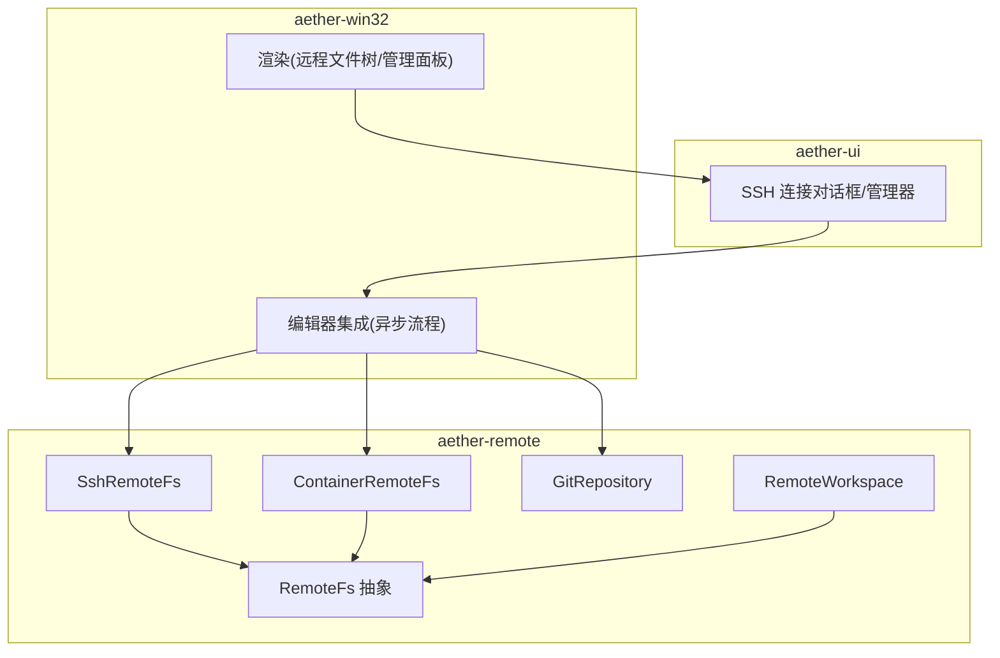
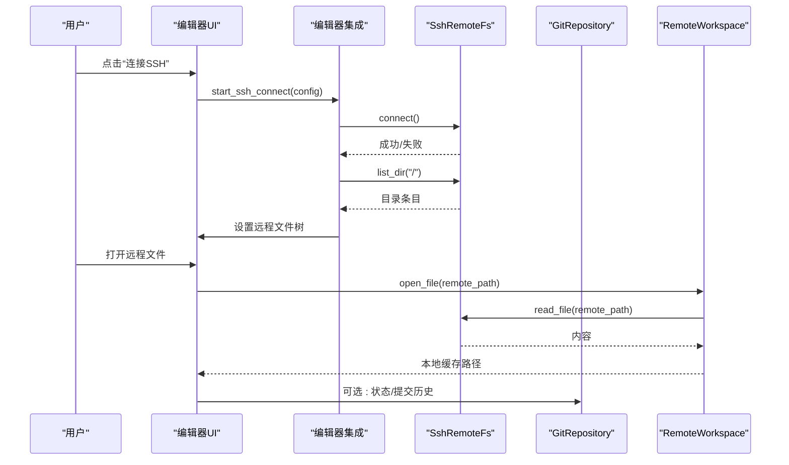
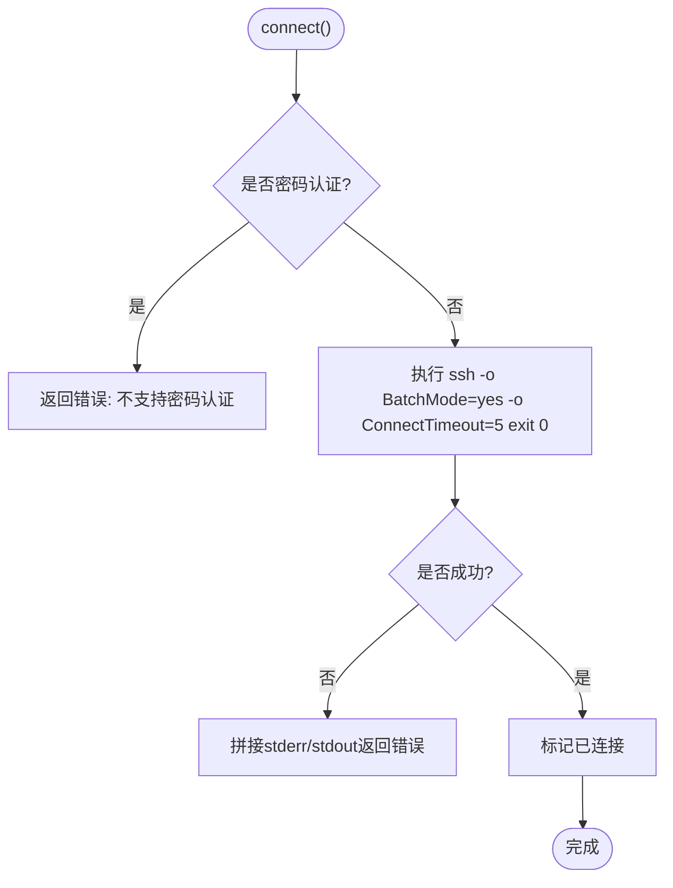
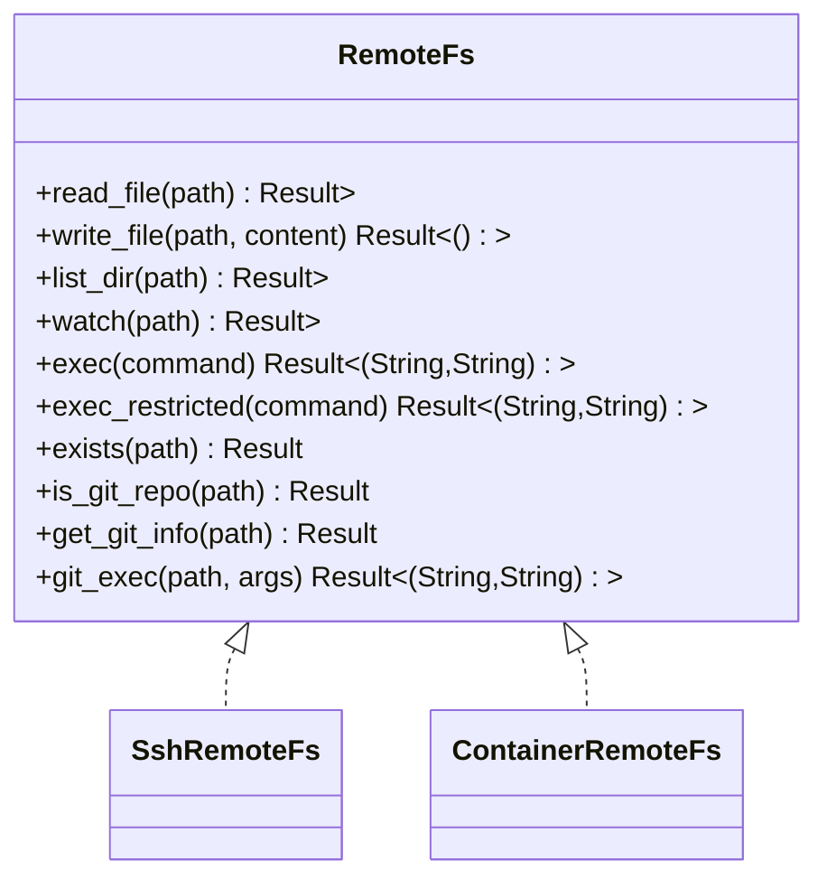
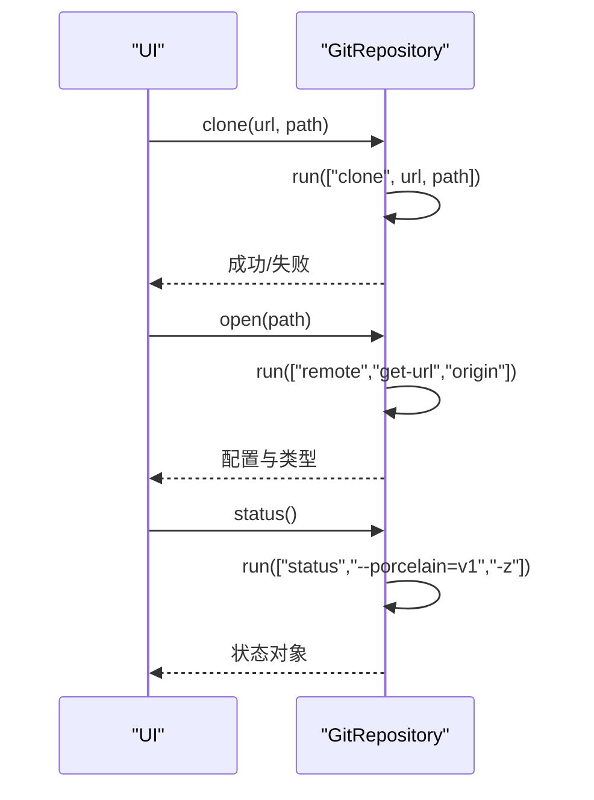
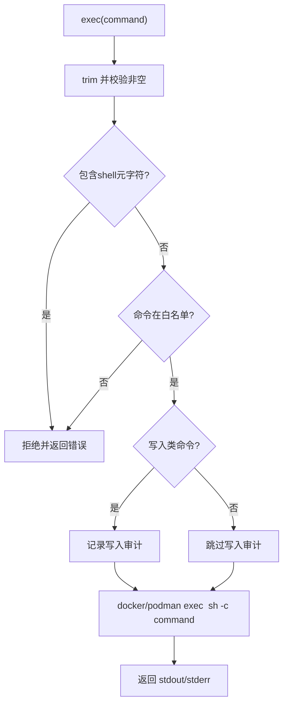
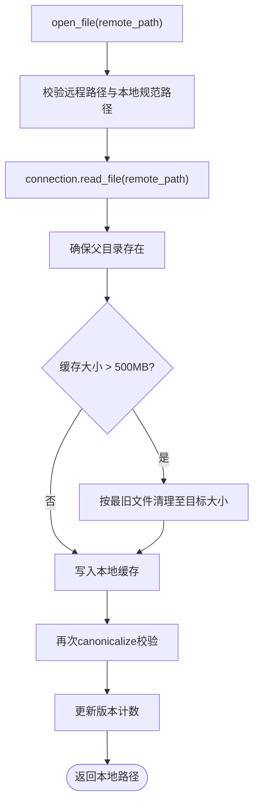
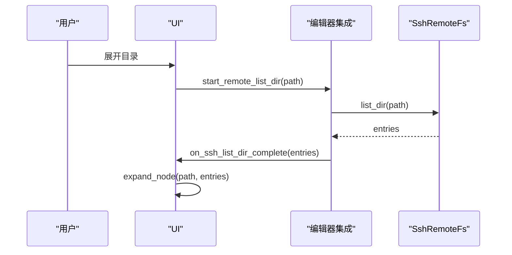
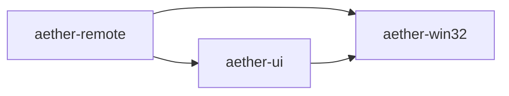

# 远程开发功能

<cite>
**本文引用的文件**
- [lib.rs](file://crates/aether-remote/src/lib.rs)
- [ssh.rs](file://crates/aether-remote/src/ssh.rs)
- [remote_fs.rs](file://crates/aether-remote/src/remote_fs.rs)
- [git.rs](file://crates/aether-remote/src/git.rs)
- [container.rs](file://crates/aether-remote/src/container.rs)
- [workspace.rs](file://crates/aether-remote/src/workspace.rs)
- [ssh.rs（UI）](file://crates/aether-ui/src/ssh.rs)
- [remote.rs（编辑器集成）](file://crates/aether-win32/src/editor/remote.rs)
- [remote.rs（渲染）](file://crates/aether-win32/src/render/remote.rs)
</cite>

## 目录
1. [简介](#简介)
2. [项目结构](#项目结构)
3. [核心组件](#核心组件)
4. [架构总览](#架构总览)
5. [详细组件分析](#详细组件分析)
6. [依赖关系分析](#依赖关系分析)
7. [性能与缓存](#性能与缓存)
8. [安全与可靠性](#安全与可靠性)
9. [故障排除指南](#故障排除指南)
10. [扩展与定制](#扩展与定制)
11. [结论](#结论)

## 简介
本章节面向“远程开发”能力，覆盖 SSH 连接管理、远程文件系统抽象、Git 集成、容器支持、工作流与最佳实践、网络安全性与可靠性保障、故障排除与性能调优，以及扩展与定制方法。目标是帮助开发者理解并高效使用远程编辑、版本控制与容器化协作能力。

## 项目结构
远程能力由 aether-remote 提供核心实现，aether-ui 提供 SSH 配置与连接对话框，aether-win32 负责 UI 交互与渲染。关键模块如下：
- aether-remote: 抽象 RemoteFs trait，并提供 SSH、容器后端；封装 Git 仓库操作；提供 RemoteWorkspace 本地缓存与同步。
- aether-ui: 管理 SSH 服务器列表、连接对话框、远程文件树模型。
- aether-win32: 异步启动连接/克隆/目录加载，处理消息回调，渲染远程文件树与管理面板。

图表来源
- [lib.rs:1-17](file://crates/aether-remote/src/lib.rs#L1-L17)
- [ssh.rs:101-164](file://crates/aether-remote/src/ssh.rs#L101-L164)
- [container.rs:21-38](file://crates/aether-remote/src/container.rs#L21-L38)
- [git.rs:115-184](file://crates/aether-remote/src/git.rs#L115-L184)
- [workspace.rs:6-26](file://crates/aether-remote/src/workspace.rs#L6-L26)
- [ssh.rs（UI）:22-127](file://crates/aether-ui/src/ssh.rs#L22-L127)
- [remote.rs（编辑器集成）:3-151](file://crates/aether-win32/src/editor/remote.rs#L3-L151)
- [remote.rs（渲染）:4-126](file://crates/aether-win32/src/render/remote.rs#L4-L126)

章节来源
- [lib.rs:1-17](file://crates/aether-remote/src/lib.rs#L1-L17)
- [ssh.rs:101-164](file://crates/aether-remote/src/ssh.rs#L101-L164)
- [container.rs:21-38](file://crates/aether-remote/src/container.rs#L21-L38)
- [git.rs:115-184](file://crates/aether-remote/src/git.rs#L115-L184)
- [workspace.rs:6-26](file://crates/aether-remote/src/workspace.rs#L6-L26)
- [ssh.rs（UI）:22-127](file://crates/aether-ui/src/ssh.rs#L22-L127)
- [remote.rs（编辑器集成）:3-151](file://crates/aether-win32/src/editor/remote.rs#L3-L151)
- [remote.rs（渲染）:4-126](file://crates/aether-win32/src/render/remote.rs#L4-L126)

## 核心组件
- RemoteFs 抽象：统一文件读取、写入、列出目录、监听事件、受限命令执行、Git 辅助方法。
- SshRemoteFs：通过系统 ssh 二进制进行远程文件访问与命令执行，包含连接测试、原子写入、目录列举等。
- ContainerRemoteFs：容器后端占位实现，提供 exec 白名单与审计日志，文件操作待完善。
- GitRepository：基于系统 git 的二进制调用，支持 clone/open/status/log/pull/push 等。
- RemoteWorkspace：远程工作区本地缓存与同步，含路径校验、容量限制与清理策略。
- UI 层：SSH 连接对话框、服务器管理面板、远程文件树与渲染逻辑。

章节来源
- [remote_fs.rs:26-186](file://crates/aether-remote/src/remote_fs.rs#L26-L186)
- [ssh.rs:101-403](file://crates/aether-remote/src/ssh.rs#L101-L403)
- [container.rs:21-124](file://crates/aether-remote/src/container.rs#L21-L124)
- [git.rs:115-531](file://crates/aether-remote/src/git.rs#L115-L531)
- [workspace.rs:6-232](file://crates/aether-remote/src/workspace.rs#L6-L232)
- [ssh.rs（UI）:22-182](file://crates/aether-ui/src/ssh.rs#L22-L182)
- [remote.rs（编辑器集成）:3-754](file://crates/aether-win32/src/editor/remote.rs#L3-L754)
- [remote.rs（渲染）:4-800](file://crates/aether-win32/src/render/remote.rs#L4-L800)

## 架构总览
远程开发采用“抽象 + 多后端 + 工作区缓存 + UI 异步”的架构：
- 抽象层 RemoteFs 定义统一接口，屏蔽 SSH/容器差异。
- SSH 后端通过 shell out 调用系统 ssh，零编译期依赖，运行期依赖 OpenSSH。
- 容器后端目前以 exec 白名单方式执行命令，文件读写待实现。
- Git 集成通过系统 git 二进制完成，避免引入重型库。
- 工作区在本地维护缓存，带容量上限与自动清理，防止磁盘膨胀。
- UI 侧通过后台线程+消息回调实现非阻塞体验。

图表来源
- [remote.rs（编辑器集成）:3-151](file://crates/aether-win32/src/editor/remote.rs#L3-L151)
- [ssh.rs:130-164](file://crates/aether-remote/src/ssh.rs#L130-L164)
- [workspace.rs:58-100](file://crates/aether-remote/src/workspace.rs#L58-L100)
- [git.rs:199-257](file://crates/aether-remote/src/git.rs#L199-L257)

## 详细组件分析

### SSH 连接管理
- 连接建立：connect() 使用 BatchMode=yes 与 ConnectTimeout=5 快速探测连通性；密码认证被拒绝，仅允许密钥或 Agent。
- 认证机制：支持 Key（可带 passphrase）与 Agent；用户名/主机名以“-”开头会被拒绝，防止选项注入。
- 错误处理：连接失败返回详细 stderr/stdout；断开仅重置软状态；每次操作独立调用 ssh，无持久连接。
- 文件操作：read_file 使用 cat；write_file 先写临时文件再 mv 保证原子性；list_dir 使用 find + stat 一次性获取属性；watch 不支持。
- 命令执行：exec 记录审计日志；exec_restricted 内置白名单与 shell 元字符过滤，防止注入。

图表来源
- [ssh.rs:130-164](file://crates/aether-remote/src/ssh.rs#L130-L164)
- [ssh.rs:166-202](file://crates/aether-remote/src/ssh.rs#L166-L202)
- [ssh.rs:265-403](file://crates/aether-remote/src/ssh.rs#L265-L403)

章节来源
- [ssh.rs:130-403](file://crates/aether-remote/src/ssh.rs#L130-L403)
- [remote_fs.rs:46-94](file://crates/aether-remote/src/remote_fs.rs#L46-L94)

### 远程文件系统抽象
- RemoteFs trait 提供 read/write/list/watch/exec/exec_restricted/exists/is_git_repo/get_git_info/git_exec。
- 默认 exec 返回未实现；exec_restricted 强制白名单与元字符过滤；git_exec 对参数做严格校验，禁止路径遍历与绝对路径。
- exists 优先用 list_dir 判断目录，否则尝试父目录枚举匹配文件名；is_git_repo 检查 .git 是否存在。

图表来源
- [remote_fs.rs:26-186](file://crates/aether-remote/src/remote_fs.rs#L26-L186)
- [ssh.rs:265-403](file://crates/aether-remote/src/ssh.rs#L265-L403)
- [container.rs:40-124](file://crates/aether-remote/src/container.rs#L40-L124)

章节来源
- [remote_fs.rs:26-186](file://crates/aether-remote/src/remote_fs.rs#L26-L186)

### Git 集成功能
- 可用性检测：git_available() 检查系统 git。
- 仓库类型：Local/Ssh/Https，从 URL 推断。
- 常用操作：clone/open/current_branch/status/add/commit/checkout_branch/list_branches/log/pull/push。
- 状态解析：porcelain v1 -z 格式解析 staged/unstaged/untracked/conflicts。
- 冲突处理：pull 仅 fast-forward，非 ff 时返回错误提示手动合并。

图表来源
- [git.rs:15-25](file://crates/aether-remote/src/git.rs#L15-L25)
- [git.rs:123-184](file://crates/aether-remote/src/git.rs#L123-L184)
- [git.rs:199-257](file://crates/aether-remote/src/git.rs#L199-L257)
- [git.rs:398-436](file://crates/aether-remote/src/git.rs#L398-L436)

章节来源
- [git.rs:15-531](file://crates/aether-remote/src/git.rs#L15-L531)

### 容器支持
- 后端选择：Docker/Podman，通过 backend_cmd() 切换。
- 命令执行：exec 使用白名单与元字符过滤，记录审计日志；写入类命令额外审计。
- 容器名校验：仅允许字母数字、连字符、下划线、点，防止注入 Docker 标志。
- 文件操作：当前为占位，read/write/list 返回未实现；watch 明确不支持。

图表来源
- [container.rs:58-124](file://crates/aether-remote/src/container.rs#L58-L124)

章节来源
- [container.rs:5-130](file://crates/aether-remote/src/container.rs#L5-L130)

### 远程工作区与缓存
- 本地缓存：open_file 将远程文件下载到本地缓存目录；save_file 将本地修改回写远程。
- 路径安全：validate_local_path 规范化路径并校验位于缓存目录内；写入后再次 canonicalize 防护 TOCTOU。
- 容量管理：超过 500MB 自动清理到目标的 80%，按最旧文件删除。
- 目录同步：sync_tree 递归创建本地目录结构。

图表来源
- [workspace.rs:28-100](file://crates/aether-remote/src/workspace.rs#L28-L100)
- [workspace.rs:154-206](file://crates/aether-remote/src/workspace.rs#L154-L206)

章节来源
- [workspace.rs:6-232](file://crates/aether-remote/src/workspace.rs#L6-L232)

### UI 与异步工作流
- 连接流程：start_ssh_connect 预检 ssh 可用性与认证方式，后台线程执行 connect + list_dir，完成后通过 WM_APP+4 回调更新 UI。
- 目录懒加载：展开目录时 start_remote_list_dir 后台线程 list_dir，WM_APP+6 回调 expand_node。
- 克隆流程：start_git_clone 预检 git 可用，后台线程 clone，WM_APP+5 回调打开受信任工作区。
- 渲染：render_remote_file_tree_sidebar 绘制标题与节点；draw_remote_nodes_recursive 递归绘制可见节点，支持悬停/选中/加载指示器。

图表来源
- [remote.rs（编辑器集成）:153-229](file://crates/aether-win32/src/editor/remote.rs#L153-L229)
- [ssh.rs（UI）:184-386](file://crates/aether-ui/src/ssh.rs#L184-L386)
- [remote.rs（渲染）:128-246](file://crates/aether-win32/src/render/remote.rs#L128-L246)

章节来源
- [remote.rs（编辑器集成）:3-754](file://crates/aether-win32/src/editor/remote.rs#L3-L754)
- [ssh.rs（UI）:22-386](file://crates/aether-ui/src/ssh.rs#L22-L386)
- [remote.rs（渲染）:4-800](file://crates/aether-win32/src/render/remote.rs#L4-L800)

## 依赖关系分析
- aether-remote 暴露 RemoteFs、SshRemoteFs、ContainerRemoteFs、GitRepository、RemoteWorkspace。
- aether-ui 依赖 aether_remote::ssh 与 RemoteFs，构建会话与文件树。
- aether-win32 依赖 aether_ui 与 aether_remote，编排异步流程与渲染。

图表来源
- [lib.rs:1-17](file://crates/aether-remote/src/lib.rs#L1-L17)
- [ssh.rs（UI）:1-5](file://crates/aether-ui/src/ssh.rs#L1-L5)
- [remote.rs（编辑器集成）:1-5](file://crates/aether-win32/src/editor/remote.rs#L1-L5)

章节来源
- [lib.rs:1-17](file://crates/aether-remote/src/lib.rs#L1-L17)
- [ssh.rs（UI）:1-5](file://crates/aether-ui/src/ssh.rs#L1-L5)
- [remote.rs（编辑器集成）:1-5](file://crates/aether-win32/src/editor/remote.rs#L1-L5)

## 性能与缓存
- SSH 后端：每次操作独立进程调用 ssh，适合低频操作；批量目录列举使用 find + stat 减少往返。
- 原子写入：write_file 使用临时文件 + mv，避免断连导致损坏。
- 工作区缓存：最大 500MB，超限时按最旧文件清理至 80% 目标值；TOCTOU 防护确保写入安全。
- 建议：
  - 大文件编辑优先使用 RemoteWorkspace 打开，减少重复下载。
  - 频繁目录浏览可结合缓存与懒加载，避免全量拉取。
  - 合理设置超时与重试策略（如网络抖动）。

[本节为通用指导，不直接分析具体文件]

## 安全与可靠性
- 命令注入防护：
  - SSH base_args 中用户名/主机名不以“-”开头校验。
  - exec_restricted 与容器 exec 均实施 shell 元字符过滤与白名单。
  - git_exec 对参数进行严格校验，禁止路径遍历与绝对路径。
- 路径安全：
  - RemoteWorkspace 对本地路径进行规范化与边界校验，写入后再校验，防范符号链接攻击。
- 认证限制：
  - 密码认证在 shell out 模式下禁用，推荐使用密钥或 Agent。
- 可靠性：
  - 连接测试使用 BatchMode 与短超时，避免阻塞。
  - 目录列举对空目录与不存在目录分别处理。
  - 容器 exec 对容器名进行字符集限制，防止注入。

章节来源
- [ssh.rs:166-202](file://crates/aether-remote/src/ssh.rs#L166-L202)
- [remote_fs.rs:46-94](file://crates/aether-remote/src/remote_fs.rs#L46-L94)
- [remote_fs.rs:162-186](file://crates/aether-remote/src/remote_fs.rs#L162-L186)
- [workspace.rs:28-100](file://crates/aether-remote/src/workspace.rs#L28-L100)
- [container.rs:58-124](file://crates/aether-remote/src/container.rs#L58-L124)

## 故障排除指南
- 未检测到 ssh：
  - 现象：连接前提示安装 OpenSSH。
  - 处理：安装 OpenSSH 并确保在 PATH 中；参考下载页引导。
- 密码认证失败：
  - 现象：提示密码认证不支持。
  - 处理：改用密钥或 Agent 认证。
- 连接失败：
  - 现象：连接错误包含 stderr/stdout 信息。
  - 处理：检查主机、端口、用户名、密钥路径与权限；确认 known_hosts 策略。
- 目录为空或不存在：
  - 现象：列出目录报错或返回空列表。
  - 处理：确认路径存在且具备读权限；注意空目录行为。
- Git 未安装：
  - 现象：克隆/状态操作提示未安装 git。
  - 处理：安装 Git for Windows 并确保在 PATH 中。
- 容器命令被拒绝：
  - 现象：exec 返回不在白名单。
  - 处理：使用白名单中的只读或写入命令；避免 shell 元字符。

章节来源
- [remote.rs（编辑器集成）:3-151](file://crates/aether-win32/src/editor/remote.rs#L3-L151)
- [ssh.rs:130-164](file://crates/aether-remote/src/ssh.rs#L130-L164)
- [git.rs:15-25](file://crates/aether-remote/src/git.rs#L15-L25)
- [container.rs:58-124](file://crates/aether-remote/src/container.rs#L58-L124)

## 扩展与定制
- 新增 RemoteFs 后端：
  - 实现 RemoteFs trait，覆盖 read/write/list/watch/exec/exec_restricted 等方法。
  - 在 lib.rs 中导出新类型，并在 UI/编辑器集成中注册。
- 自定义命令白名单：
  - 在 remote_fs.rs 的 exec_restricted 与 container.rs 的 exec 中调整 ALLOWED_COMMANDS。
- 工作区策略：
  - 调整 MAX_CACHE_SIZE 与 CACHE_CLEANUP_RATIO，或替换清理算法。
- UI 扩展：
  - 在 aether-ui 中添加新的连接表单字段与校验逻辑。
  - 在 aether-win32 中增加对应的异步流程与渲染。

章节来源
- [remote_fs.rs:46-94](file://crates/aether-remote/src/remote_fs.rs#L46-L94)
- [container.rs:58-124](file://crates/aether-remote/src/container.rs#L58-L124)
- [workspace.rs:14-18](file://crates/aether-remote/src/workspace.rs#L14-L18)
- [ssh.rs（UI）:22-127](file://crates/aether-ui/src/ssh.rs#L22-L127)
- [remote.rs（编辑器集成）:3-151](file://crates/aether-win32/src/editor/remote.rs#L3-L151)

## 结论
本项目通过统一的 RemoteFs 抽象实现了 SSH 与容器的远程文件访问，结合 Git 集成与工作区缓存，提供了完整的远程开发体验。设计上强调安全（白名单、路径校验、认证限制）、可靠（连接测试、原子写入、错误处理）与性能（懒加载、缓存清理、批量列举）。建议在大规模协作场景中结合缓存与懒加载优化体验，并根据业务需求扩展命令白名单与工作区策略。