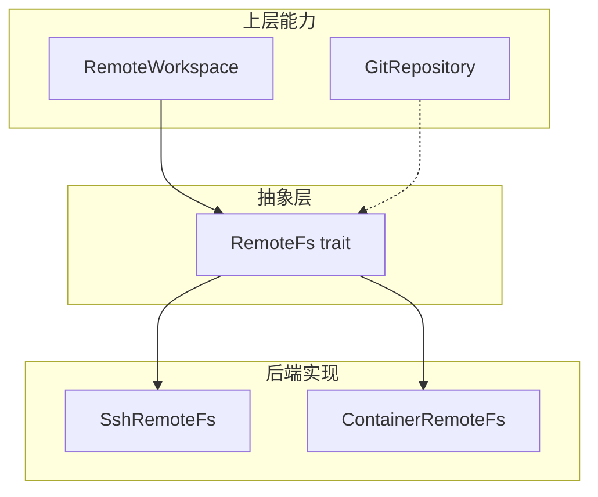
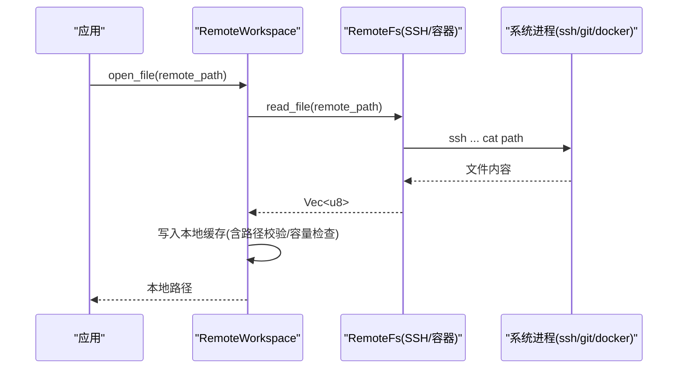
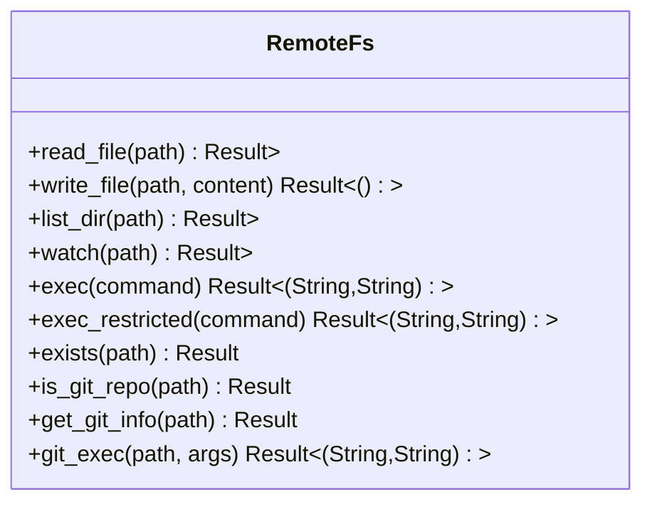
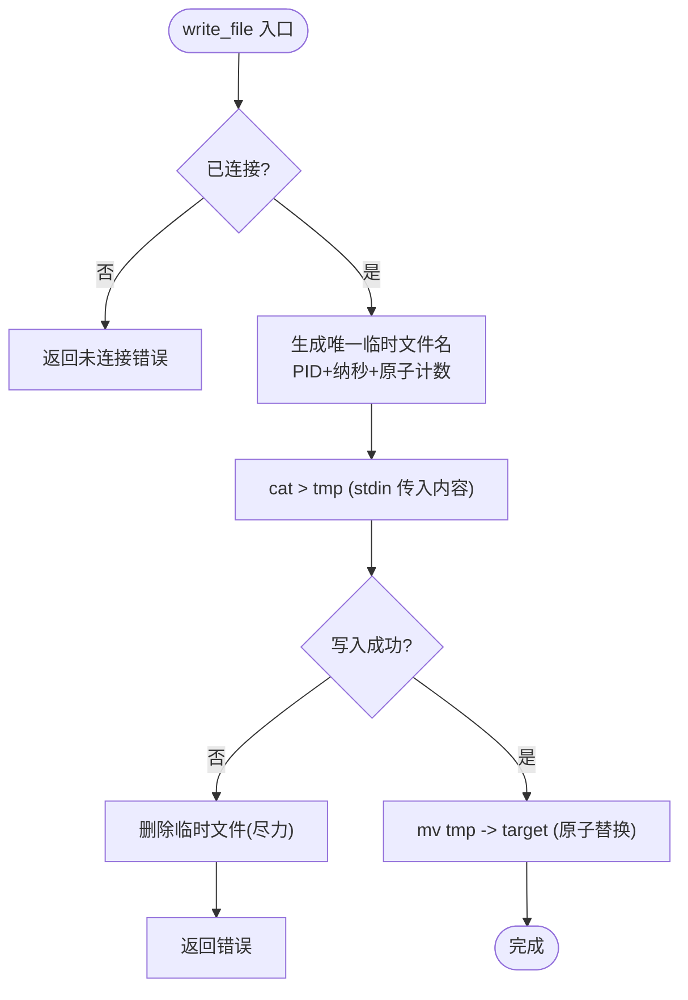
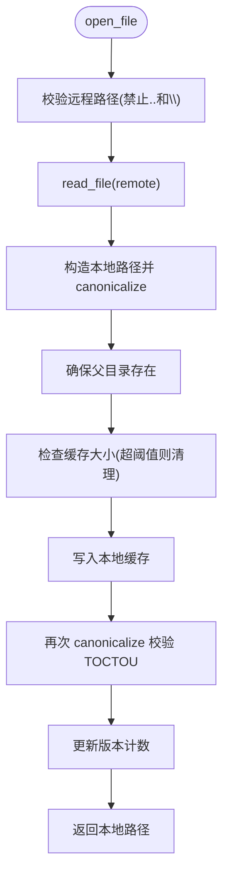
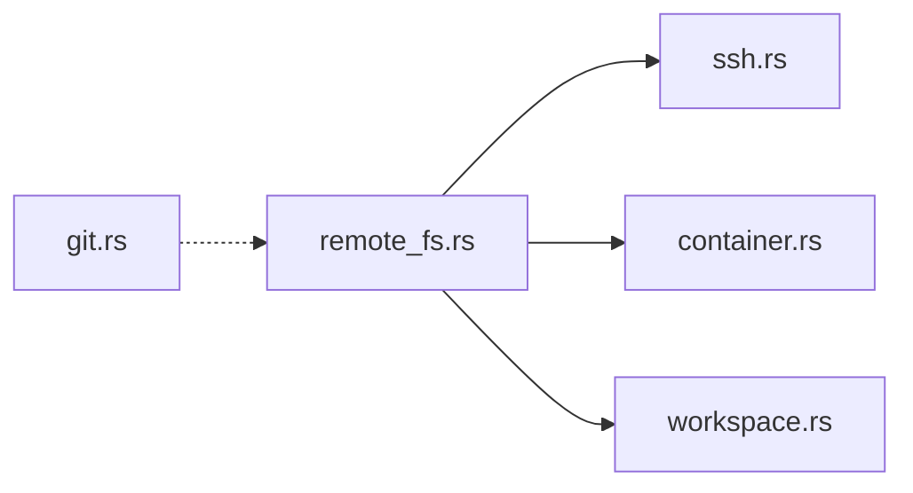

# 远程文件系统

<cite>
**本文引用的文件**
- [lib.rs](file://crates/aether-remote/src/lib.rs)
- [remote_fs.rs](file://crates/aether-remote/src/remote_fs.rs)
- [ssh.rs](file://crates/aether-remote/src/ssh.rs)
- [container.rs](file://crates/aether-remote/src/container.rs)
- [workspace.rs](file://crates/aether-remote/src/workspace.rs)
- [git.rs](file://crates/aether-remote/src/git.rs)
- [tests.rs](file://crates/aether-remote/src/tests.rs)
- [Cargo.toml](file://crates/aether-remote/Cargo.toml)
</cite>

## 目录
1. [简介](#简介)
2. [项目结构](#项目结构)
3. [核心组件](#核心组件)
4. [架构总览](#架构总览)
5. [详细组件分析](#详细组件分析)
6. [依赖关系分析](#依赖关系分析)
7. [性能与缓存优化](#性能与缓存优化)
8. [错误处理与重试机制](#错误处理与重试机制)
9. [扩展新后端指南](#扩展新后端指南)
10. [故障排查](#故障排查)
11. [结论](#结论)

## 简介
本模块为“远程文件系统抽象层”，通过统一的 RemoteFs trait 屏蔽 SSH、容器等后端差异，提供一致的文件读取、写入、目录操作、命令执行以及 Git 能力。同时提供本地工作区缓存与同步（RemoteWorkspace），实现按需拉取、增量更新、容量控制与路径安全校验。SSH 后端采用系统 ssh 二进制进行 shell out 调用，具备原子写入、白名单命令执行、审计日志等安全特性；容器后端提供受限命令执行与基础配置解析占位。Git 模块封装了本地仓库的克隆、状态、提交、分支、日志等操作。

## 项目结构
aether-remote 以 trait + 多实现的方式组织：
- remote_fs.rs：定义 RemoteFs trait、通用数据结构与默认方法（如 exists、is_git_repo、get_git_info、git_exec）。
- ssh.rs：基于系统 ssh 的二进制实现的 SshRemoteFs，支持 read/write/list/exec/watch（watch 不支持）。
- container.rs：容器后端的 ContainerRemoteFs，目前仅实现 exec 的安全校验与占位文件操作。
- workspace.rs：RemoteWorkspace 管理本地缓存、路径校验、大小清理、目录同步与 watch 透传。
- git.rs：GitRepository 封装本地 git 操作（clone/open/status/log/pull/push 等）。
- lib.rs：对外暴露模块与类型别名。
- tests.rs：覆盖关键行为与安全边界。

图表来源
- [remote_fs.rs:26-186](file://crates/aether-remote/src/remote_fs.rs#L26-L186)
- [ssh.rs:101-403](file://crates/aether-remote/src/ssh.rs#L101-L403)
- [container.rs:21-124](file://crates/aether-remote/src/container.rs#L21-L124)
- [workspace.rs:6-231](file://crates/aether-remote/src/workspace.rs#L6-L231)
- [git.rs:115-505](file://crates/aether-remote/src/git.rs#L115-L505)

章节来源
- [lib.rs:1-18](file://crates/aether-remote/src/lib.rs#L1-L18)

## 核心组件
- RemoteFs trait：统一接口，包含 read_file、write_file、list_dir、watch、exec、exec_restricted、exists、is_git_repo、get_git_info、git_exec。
- SshRemoteFs：通过系统 ssh 执行远程命令，实现原子写入（临时文件+mv）、目录枚举（find+stat）、只读命令白名单与元字符过滤。
- ContainerRemoteFs：容器内命令执行的安全校验（白名单+元字符过滤+容器名合法性），文件读写为占位。
- RemoteWorkspace：本地缓存、路径校验、容量限制与自动清理、目录同步、watch 透传。
- GitRepository：本地 Git 仓库操作（clone/open/status/log/pull/push/branch 等）。

章节来源
- [remote_fs.rs:26-186](file://crates/aether-remote/src/remote_fs.rs#L26-L186)
- [ssh.rs:101-403](file://crates/aether-remote/src/ssh.rs#L101-L403)
- [container.rs:21-124](file://crates/aether-remote/src/container.rs#L21-L124)
- [workspace.rs:6-231](file://crates/aether-remote/src/workspace.rs#L6-L231)
- [git.rs:115-505](file://crates/aether-remote/src/git.rs#L115-L505)

## 架构总览
RemoteFs 作为稳定契约，屏蔽底层差异。上层通过 RemoteWorkspace 获得带缓存的工作区体验；Git 能力既可通过 RemoteFs::git_exec 在远程执行，也可通过 GitRepository 在本地仓库上操作。

图表来源
- [workspace.rs:58-100](file://crates/aether-remote/src/workspace.rs#L58-L100)
- [ssh.rs:265-321](file://crates/aether-remote/src/ssh.rs#L265-L321)

## 详细组件分析

### RemoteFs trait 设计
- 目标：统一 SSH、容器等远程环境的文件访问接口，并提供安全的命令执行与 Git 辅助方法。
- 关键方法：
  - 文件 I/O：read_file、write_file、list_dir
  - 事件监听：watch（返回 mpsc::Receiver<FsEvent>）
  - 命令执行：exec（默认拒绝）、exec_restricted（白名单+元字符过滤）
  - 路径与仓库：exists、is_git_repo、get_git_info、git_exec
- 安全要点：
  - exec_restricted 严格白名单与 shell 元字符过滤，防止命令注入。
  - git_exec 对参数做前缀与路径遍历防护。
  - validate_git_path 提前校验路径安全性。

图表来源
- [remote_fs.rs:26-186](file://crates/aether-remote/src/remote_fs.rs#L26-L186)

章节来源
- [remote_fs.rs:26-186](file://crates/aether-remote/src/remote_fs.rs#L26-L186)

### SSH 后端（SshRemoteFs）
- 连接模型：无持久连接，每次操作独立调用系统 ssh；connect() 用于探测连通性并拒绝密码认证模式。
- 原子写入：先写入同目录临时文件（PID+纳秒时间戳+原子计数器避免碰撞），成功后 mv 原子替换目标文件；失败时尝试清理临时文件。
- 目录枚举：使用 find + stat 一次性获取条目信息，空目录返回空列表。
- 命令执行：exec 记录审计日志；exec_restricted 继承 trait 的白名单与元字符过滤。
- 事件监听：当前不支持，返回错误。

图表来源
- [ssh.rs:285-321](file://crates/aether-remote/src/ssh.rs#L285-L321)

章节来源
- [ssh.rs:101-403](file://crates/aether-remote/src/ssh.rs#L101-L403)

### 容器后端（ContainerRemoteFs）
- 命令执行：严格白名单（只读/写入两类），拒绝 shell 元字符，校验容器名合法，使用 docker/podman exec sh -c 执行命令。
- 文件操作：read_file/write_file/list_dir 尚未实现，返回错误。
- 事件监听：不支持，返回错误。

章节来源
- [container.rs:21-124](file://crates/aether-remote/src/container.rs#L21-L124)

### 工作区与缓存（RemoteWorkspace）
- 打开文件：从远程读取到本地缓存，写入前检查缓存大小，超过阈值按最旧优先清理至目标的 80%。
- 保存文件：将本地缓存写回远程，递增版本计数。
- 目录同步：根据远程目录条目创建本地目录结构，跳过非法名称（含 ..、/、\）。
- 路径安全：canonicalize 校验规范路径，TOCTOU 二次校验写入后仍在缓存目录内。
- 事件监听：透传到后端 watch。

图表来源
- [workspace.rs:58-100](file://crates/aether-remote/src/workspace.rs#L58-L100)
- [workspace.rs:154-206](file://crates/aether-remote/src/workspace.rs#L154-L206)

章节来源
- [workspace.rs:6-231](file://crates/aether-remote/src/workspace.rs#L6-L231)

### Git 能力
- 远程侧：RemoteFs::get_git_info 通过 exec_restricted 安全地查询远程仓库信息（remote URL、当前分支、是否有未提交变更）。
- 远程侧：RemoteFs::git_exec 对 git 参数做严格校验后执行。
- 本地侧：GitRepository 提供 clone/open/status/log/pull/push/branch 等完整能力，错误类型丰富且可格式化输出。

章节来源
- [remote_fs.rs:117-186](file://crates/aether-remote/src/remote_fs.rs#L117-L186)
- [git.rs:115-505](file://crates/aether-remote/src/git.rs#L115-L505)

## 依赖关系分析
- 模块耦合：
  - ssh.rs、container.rs 均依赖 remote_fs.rs 的 trait 与数据类型。
  - workspace.rs 依赖 remote_fs.rs 的 trait 与 FsEvent。
  - git.rs 独立于 RemoteFs，但可与 RemoteFs::git_exec 配合使用。
- 外部依赖：
  - 运行期依赖系统 ssh、git、docker/podman 等二进制。
  - Cargo 依赖 serde、serde_json、shell-escape（用于转义）。

图表来源
- [remote_fs.rs:1-268](file://crates/aether-remote/src/remote_fs.rs#L1-L268)
- [ssh.rs:1-403](file://crates/aether-remote/src/ssh.rs#L1-L403)
- [container.rs:1-130](file://crates/aether-remote/src/container.rs#L1-L130)
- [workspace.rs:1-251](file://crates/aether-remote/src/workspace.rs#L1-L251)
- [git.rs:1-531](file://crates/aether-remote/src/git.rs#L1-L531)

章节来源
- [Cargo.toml:1-13](file://crates/aether-remote/Cargo.toml#L1-L13)

## 性能与缓存优化
- 原子写入减少网络中断导致的损坏风险，并通过临时文件命名策略避免并发冲突。
- 目录枚举使用 find + stat 批量获取属性，减少多次往返。
- 工作区缓存：
  - 最大 500MB，超过阈值按最旧优先清理至目标的 80%，避免无限增长。
  - 打开文件时按需下载，避免全量同步。
  - 保存文件时直接写回远程，保持最小本地驻留。
- 增量同步：
  - 当前实现为全量目录结构同步；可在 list_dir 基础上结合 mtime 实现增量更新（建议后续增强）。
- 批量操作：
  - 建议在高层聚合多次 read/write，减少 ssh 进程启动开销（当前每次操作 spawn 一次 ssh）。

[本节为通用指导，不直接分析具体代码]

## 错误处理与重试机制
- 统一结果类型：Result<T> = std::result::Result<T, String>，便于快速定位错误信息。
- SSH：
  - 未连接时所有操作返回明确错误。
  - 连接测试失败返回详细 stdout/stderr。
  - 写入失败尽力清理临时文件。
- 容器：
  - 命令为空、包含 shell 元字符、不在白名单、容器名非法均返回错误。
- Git：
  - 丰富的 GitError 枚举，Display 友好提示，包含安装引导链接。
- 工作区：
  - 路径穿越检测（包含 .. 或 \ 拒绝）。
  - TOCTOU 防护：写入后重新 canonicalize 校验，越界立即删除并报错。
- 重试机制：
  - 当前未内置重试；可在调用方根据错误类型（如网络超时）实现指数退避重试。

章节来源
- [ssh.rs:130-164](file://crates/aether-remote/src/ssh.rs#L130-L164)
- [ssh.rs:265-321](file://crates/aether-remote/src/ssh.rs#L265-L321)
- [container.rs:58-124](file://crates/aether-remote/src/container.rs#L58-L124)
- [git.rs:70-113](file://crates/aether-remote/src/git.rs#L70-L113)
- [workspace.rs:28-99](file://crates/aether-remote/src/workspace.rs#L28-L99)

## 扩展新后端指南
- 步骤：
  1. 在 crate 中新增模块，实现 RemoteFs trait 的所有方法。
  2. 若支持命令执行，请遵循 exec_restricted 的安全模型（白名单+元字符过滤），或在 exec 中自行实现强约束。
  3. 若支持事件监听，实现 watch 返回 mpsc::Receiver<FsEvent>；否则返回“不支持”错误。
  4. 在 lib.rs 中导出新类型与模块。
- 最佳实践：
  - 保持路径安全：拒绝包含 ..、绝对路径、特殊字符的输入。
  - 原子写入：尽量使用临时文件+mv 保证一致性。
  - 资源管理：避免长连接泄漏，必要时提供 connect/disconnect。
  - 错误语义：区分“不存在”、“权限不足”、“网络错误”等，便于上层重试与降级。
  - 审计日志：对 exec 类操作记录审计信息。
- 参考实现：
  - SSH 后端：shell out 模式、白名单、原子写入、目录枚举。
  - 容器后端：命令白名单、容器名校验、exec 安全。

章节来源
- [remote_fs.rs:26-186](file://crates/aether-remote/src/remote_fs.rs#L26-L186)
- [ssh.rs:101-403](file://crates/aether-remote/src/ssh.rs#L101-L403)
- [container.rs:21-124](file://crates/aether-remote/src/container.rs#L21-L124)
- [lib.rs:1-18](file://crates/aether-remote/src/lib.rs#L1-L18)

## 故障排查
- SSH 无法连接：
  - 确认系统安装了 OpenSSH 并在 PATH 中；使用 ssh_available 检测。
  - 使用 connect() 测试连通性；失败时查看 stderr/stdout 诊断。
  - 密码认证不可用，需配置密钥或 agent。
- 写入失败：
  - 检查临时文件是否被清理；查看远程磁盘空间与权限。
- 目录列出为空：
  - 空目录会返回空列表；确认路径是否存在。
- 命令执行被拒绝：
  - 检查是否在白名单；是否包含 shell 元字符；容器名是否合法。
- 工作区路径异常：
  - 检查是否包含 .. 或 \；确认 canonicalize 后的路径仍在缓存目录内。

章节来源
- [ssh.rs:30-40](file://crates/aether-remote/src/ssh.rs#L30-L40)
- [ssh.rs:130-164](file://crates/aether-remote/src/ssh.rs#L130-L164)
- [ssh.rs:265-321](file://crates/aether-remote/src/ssh.rs#L265-L321)
- [container.rs:58-124](file://crates/aether-remote/src/container.rs#L58-L124)
- [workspace.rs:28-99](file://crates/aether-remote/src/workspace.rs#L28-L99)

## 结论
该远程文件系统抽象层通过 RemoteFs trait 实现了 SSH 与容器后端的统一接口，提供了安全的命令执行、原子写入、路径校验与缓存管理。工作区层提升了用户体验与性能，Git 能力贯穿远程与本地场景。未来可进一步增强事件监听、增量同步与批量操作，以提升大规模文件协作的效率与可靠性。