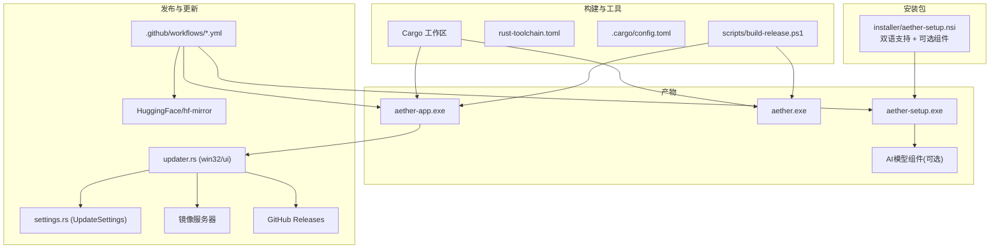
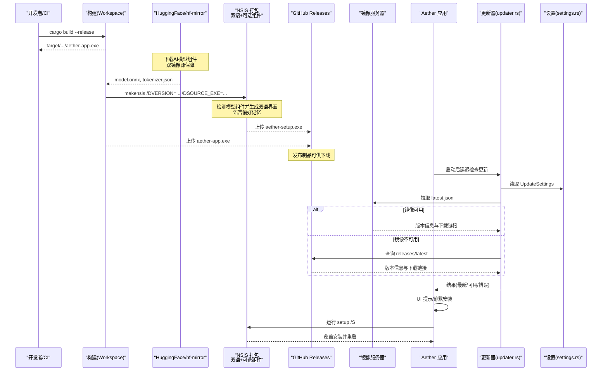
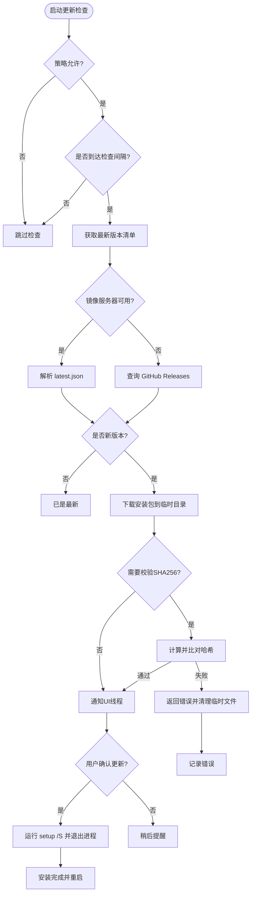
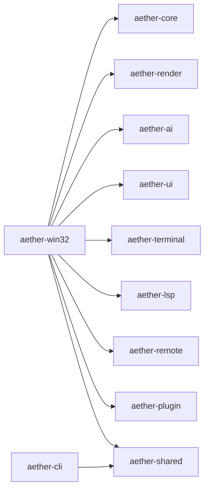

# 部署和发布

<cite>
**本文引用的文件**
- [Cargo.toml](file://Cargo.toml)
- [.cargo/config.toml](file://.cargo/config.toml)
- [rust-toolchain.toml](file://rust-toolchain.toml)
- [scripts/build-release.ps1](file://scripts/build-release.ps1)
- [installer/aether-setup.nsi](file://installer/aether-setup.nsi)
- [crates/aether-win32/Cargo.toml](file://crates/aether-win32/Cargo.toml)
- [crates/aether-cli/Cargo.toml](file://crates/aether-cli/Cargo.toml)
- [crates/aether-win32/src/updater.rs](file://crates/aether-win32/src/updater.rs)
- [crates/aether-ui/src/updater.rs](file://crates/aether-ui/src/updater.rs)
- [crates/aether-win32/src/window/window_messages.rs](file://crates/aether-win32/src/window/window_messages.rs)
- [crates/aether-win32/src/render/settings_update.rs](file://crates/aether-win32/src/render/settings_update.rs)
- [crates/aether-shared/src/settings.rs](file://crates/aether-shared/src/settings.rs)
- [crates/aether-ai-panel/src/embedding.rs](file://crates/aether-ai-panel/src/embedding.rs)
- [.github/workflows/ci.yml](file://.github/workflows/ci.yml)
- [.github/workflows/release-main.yml](file://.github/workflows/release-main.yml)
- [.github/workflows/release-demo.yml](file://.github/workflows/release-demo.yml)
</cite>

## 更新摘要
**所做更改**
- 更新了 NSIS 安装包配置，增强双语支持（简体中文/英文），支持语言偏好记忆
- 新增可选 AI 语义检索模型组件安装功能，提供详细的组件描述
- 增强了 CI/CD 流水线，在发布构建过程中自动下载嵌入模型
- 实现了双镜像源下载机制（HuggingFace主用，hf-mirror备用）提高可靠性
- 更新了自动更新机制的双镜像回退策略

## 目录
1. [简介](#简介)
2. [项目结构](#项目结构)
3. [核心组件](#核心组件)
4. [架构总览](#架构总览)
5. [详细组件分析](#详细组件分析)
6. [依赖分析](#依赖分析)
7. [性能考虑](#性能考虑)
8. [故障排除指南](#故障排除指南)
9. [结论](#结论)
10. [附录](#附录)

## 简介
本文件面向运维与发布工程师，提供 Aether Studio（Windows 桌面应用）的构建、打包、签名、发布、部署、自动更新、监控与维护的完整操作文档。内容覆盖：
- 构建配置：工作区、目标平台、交叉编译、Rust 工具链与优化选项
- 安装包制作：NSIS 脚本、双语支持、可选组件、静默安装、卸载与快捷方式
- 自动更新机制：版本检查、双镜像回退下载与校验、静默升级流程
- 发布流程：版本管理策略、发布渠道、质量检查与制品上传
- 环境准备：依赖安装、环境变量与 CI/CD 集成
- 运维实践：监控、回滚策略、自动化与持续交付最佳实践

## 项目结构
仓库采用 Rust Workspace 多 crate 组织，GUI 主程序位于 aether-win32，CLI 工具位于 aether-cli；安装包由增强的 NSIS 脚本生成，支持双语界面和可选组件；发布与质量检查通过 GitHub Actions 工作流完成；自动更新逻辑在 win32 与 ui 模块中实现，具备双镜像回退能力。

**图表来源**
- [Cargo.toml:1-37](file://Cargo.toml#L1-L37)
- [rust-toolchain.toml:1-5](file://rust-toolchain.toml#L1-L5)
- [.cargo/config.toml:1-31](file://.cargo/config.toml#L1-L31)
- [scripts/build-release.ps1:1-42](file://scripts/build-release.ps1#L1-L42)
- [installer/aether-setup.nsi:1-231](file://installer/aether-setup.nsi#L1-L231)
- [.github/workflows/release-main.yml:1-211](file://.github/workflows/release-main.yml#L1-L211)
- [crates/aether-win32/src/updater.rs:1-351](file://crates/aether-win32/src/updater.rs#L1-L351)
- [crates/aether-shared/src/settings.rs:1006-1035](file://crates/aether-shared/src/settings.rs#L1006-L1035)

## 核心组件
- 构建与工具链
  - 工作区定义与统一版本、发行版优化配置
  - 目标平台 x86_64-pc-windows-msvc，启用 LTO、单代码单元、strip 等
  - 工具链稳定通道并包含 rustfmt/clippy
- 增强的安装包制作
  - NSIS 脚本支持双语界面（简体中文/英文），自动跟随系统语言
  - 语言偏好记忆功能，用户选择会被保存到注册表
  - 可选 AI 语义检索模型组件（约90MB），提升AI助手长期记忆能力
  - 详细的组件描述，帮助用户理解每个组件的功能
  - 用户级安装至 %LOCALAPPDATA%\Programs\Aether Studio，无需 UAC
  - 注册表信息、开始菜单/桌面快捷方式、静默安装与卸载
- 双镜像回退自动更新
  - 后台线程检查最新版本（优先国内镜像服务器，失败回退 GitHub Releases）
  - 下载并校验 SHA256，UI 确认后静默安装并退出进程
- 发布流水线
  - CI 负责格式化、检查与测试；release-main 自动生成带日期的版本号、构建产物、NSIS 安装包并发布到 GitHub Releases
  - 支持可选模型组件的下载和打包，使用双镜像源提高可靠性

**章节来源**
- [Cargo.toml:22-37](file://Cargo.toml#L22-L37)
- [.cargo/config.toml:8-31](file://.cargo/config.toml#L8-L31)
- [rust-toolchain.toml:1-5](file://rust-toolchain.toml#L1-L5)
- [installer/aether-setup.nsi:16-231](file://installer/aether-setup.nsi#L16-L231)
- [crates/aether-win32/src/updater.rs:1-351](file://crates/aether-win32/src/updater.rs#L1-L351)
- [.github/workflows/ci.yml:1-26](file://.github/workflows/ci.yml#L1-L26)
- [.github/workflows/release-main.yml:1-211](file://.github/workflows/release-main.yml#L1-L211)

## 架构总览
下图展示从构建到发布再到自动更新的端到端流程，包括本地脚本、CI 流水线、双语安装包与运行时更新逻辑。

**图表来源**
- [scripts/build-release.ps1:1-42](file://scripts/build-release.ps1#L1-L42)
- [installer/aether-setup.nsi:16-231](file://installer/aether-setup.nsi#L16-L231)
- [.github/workflows/release-main.yml:68-211](file://.github/workflows/release-main.yml#L68-L211)
- [crates/aether-win32/src/updater.rs:1-351](file://crates/aether-win32/src/updater.rs#L1-L351)
- [crates/aether-shared/src/settings.rs:1006-1035](file://crates/aether-shared/src/settings.rs#L1006-L1035)

## 详细组件分析

### 构建配置与依赖管理
- 工作区与包元数据
  - 统一 workspace 版本、edition、authors、license、rust-version
  - release profile 开启 fat LTO、单代码单元、opt-level 3、panic abort、strip、关闭增量
- 目标平台与编译器标志
  - 默认 target 为 x86_64-pc-windows-msvc
  - 指定 target-cpu=sandybridge 以优化指令集
  - C/C++ 依赖统一使用 /MD 静态 CRT 以避免链接期运行时库冲突
- 工具链
  - 固定 stable 通道，附带 rustfmt、clippy，并声明 Windows 目标
- 关键 crate 依赖
  - GUI 主程序 aether-win32 依赖渲染、AI、LSP、终端、UI 等内部 crate，以及 tokio、tracing、windows、webview2-com 等外部库
  - CLI 工具 aether-cli 依赖 clap、anyhow、serde 系列及共享 crate

**章节来源**
- [Cargo.toml:1-37](file://Cargo.toml#L1-L37)
- [.cargo/config.toml:8-31](file://.cargo/config.toml#L8-L31)
- [rust-toolchain.toml:1-5](file://rust-toolchain.toml#L1-L5)
- [crates/aether-win32/Cargo.toml:1-44](file://crates/aether-win32/Cargo.toml#L1-L44)
- [crates/aether-cli/Cargo.toml:1-23](file://crates/aether-cli/Cargo.toml#L1-L23)

### 增强的安装包制作（NSIS）
- 双语界面支持
  - 支持简体中文和英文两种界面语言
  - 自动跟随系统语言，首次安装时选择语言并记住用户偏好
  - 所有界面文本均提供双语字符串资源
  - 语言选择保存在注册表中，下次安装/卸载直接沿用
- 可选 AI 语义检索模型组件
  - 提供 bge-small-zh-v1.5 模型（约90MB），让 AI 助手拥有长期记忆
  - 详细的组件描述，向用户说明模型功能和影响
  - 模型文件在 CI 阶段从 HuggingFace 或 hf-mirror.com 下载
  - 仅在暂存目录存在模型文件时才生成该可选组件
  - 不安装不影响基本使用，历史检索退化为关键词匹配
- 安装位置与权限
  - 每用户安装至 %LOCALAPPDATA%\Programs\Aether Studio，无需 UAC，便于后续直接替换 exe 进行无感更新
- 可配置参数
  - VERSION、VERSION_QUAD、SOURCE_EXE、OUTPUT_EXE 可通过 makensis /D 传入
- 安装行为
  - 安装前强制结束正在运行的 aether-app.exe
  - 复制主程序与图标资源
  - 写入注册表（安装路径、版本、卸载入口）
  - 创建开始菜单快捷方式与可选桌面快捷方式
  - 静默安装完成后自动重启应用
- 卸载行为
  - 删除安装文件、快捷方式与注册表项，保留用户数据目录

**更新** 新增了双语界面支持和可选 AI 模型组件功能，增强了用户体验

**章节来源**
- [installer/aether-setup.nsi:16-231](file://installer/aether-setup.nsi#L16-L231)
- [.github/workflows/release-main.yml:80-105](file://.github/workflows/release-main.yml#L80-L105)

### 双镜像回退自动更新机制
- 版本注入
  - 编译期通过环境变量 AETHER_VERSION 注入 APP_VERSION；开发构建回退到 Cargo 包版本
- 检查策略
  - 基于 UpdateSettings 的策略（禁用/自动/手动）、抑制天数、上次检查时间戳与周期间隔（4小时）决定是否检查
- 双镜像回退策略
  - 优先请求国内镜像服务器 https://aetherstudio.cn/downloads/latest.json
  - 镜像服务器不可用时自动回退到 GitHub Releases API
  - 镜像清单支持 downloadUrl 和 setup_url 两种字段格式
- 下载与校验
  - 下载 aether-setup.exe 到系统临时目录，限制最大字节数（300MB）
  - 若清单提供 sha256 则进行校验，失败删除临时文件
- UI 交互与静默安装
  - 后台线程检查结果并通过消息投递 UI 线程；用户确认后调用 run_setup_and_exit，启动 setup /S 并退出当前进程
  - 安装器负责杀进程、覆盖安装并重启应用

**更新** 增强了双镜像回退机制，提高下载可靠性

**图表来源**
- [crates/aether-win32/src/updater.rs:1-351](file://crates/aether-win32/src/updater.rs#L1-L351)
- [crates/aether-ui/src/updater.rs:1-351](file://crates/aether-ui/src/updater.rs#L1-L351)
- [crates/aether-win32/src/window/window_messages.rs:580-622](file://crates/aether-win32/src/window/window_messages.rs#L580-L622)
- [crates/aether-shared/src/settings.rs:1006-1035](file://crates/aether-shared/src/settings.rs#L1006-L1035)

**章节来源**
- [crates/aether-win32/src/updater.rs:1-351](file://crates/aether-win32/src/updater.rs#L1-L351)
- [crates/aether-ui/src/updater.rs:1-351](file://crates/aether-ui/src/updater.rs#L1-L351)
- [crates/aether-win32/src/window/window_messages.rs:580-622](file://crates/aether-win32/src/window/window_messages.rs#L580-L622)
- [crates/aether-win32/src/render/settings_update.rs:1-35](file://crates/aether-win32/src/render/settings_update.rs#L1-L35)
- [crates/aether-shared/src/settings.rs:1006-1035](file://crates/aether-shared/src/settings.rs#L1006-L1035)

### 发布流程与版本管理
- 版本生成
  - main 分支推送触发 release-main 工作流，按北京时间生成 vYYYY.MM.DD-build 格式版本号，并递增 build 号
  - 演示工作流支持手动触发，可选择输入版本号或自动生成
- 构建与制品
  - 构建 aether-app.exe，准备 release 目录并复制产物
  - 从 HuggingFace 或 hf-mirror.com 下载 AI 模型组件到暂存目录，使用双镜像源提高可靠性
  - 安装 NSIS（如未安装），使用 makensis 生成 aether-setup.exe
- 发布与说明
  - 创建 GitHub Release，自动从合入 main 的 PR 正文提取"新增功能"和"修复问题"，拼接发布说明
  - 上传 aether-app.exe 与 aether-setup.exe 作为制品
- 质量检查
  - dev 分支与 PR 触发 CI，执行格式化检查、cargo check 与测试

**更新** 增加了 AI 模型组件的下载和打包步骤，使用双镜像源提高下载成功率

**章节来源**
- [.github/workflows/release-main.yml:1-211](file://.github/workflows/release-main.yml#L1-L211)
- [.github/workflows/release-demo.yml:1-148](file://.github/workflows/release-demo.yml#L1-L148)
- [.github/workflows/ci.yml:1-26](file://.github/workflows/ci.yml#L1-L26)

### 部署环境准备与配置
- 本地环境
  - 安装 Rust 工具链（stable），确保包含 rustfmt、clippy
  - 安装 NSIS（makensis），用于生成安装包
  - 设置 PATH 包含 .cargo/bin
- 环境变量
  - 构建时注入 AETHER_VERSION 以控制应用内版本显示与更新比较
  - .cargo/config.toml 已配置 HTTP 超时与低速率限制，避免网络波动影响构建
- 目标平台
  - 默认目标为 x86_64-pc-windows-msvc，如需交叉编译需调整 .cargo/config.toml 的 target 字段

**章节来源**
- [rust-toolchain.toml:1-5](file://rust-toolchain.toml#L1-L5)
- [.cargo/config.toml:1-31](file://.cargo/config.toml#L1-L31)
- [scripts/build-release.ps1:1-42](file://scripts/build-release.ps1#L1-L42)

### 构建脚本使用方法与自定义选项
- 基本用法
  - 运行 scripts/build-release.ps1 进行 debug 构建
  - 添加 -Release 开关进行 release 构建
  - 添加 -Run 开关在构建完成后自动启动 GUI
- 输出位置
  - Debug 与 Release 二进制分别位于 target/x86_64-pc-windows-msvc/debug 与 release 目录
- 扩展建议
  - 可在脚本中添加签名步骤、产物校验、日志收集与上传等

**章节来源**
- [scripts/build-release.ps1:1-42](file://scripts/build-release.ps1#L1-L42)

### 发布后的监控与维护
- 更新日志与制品
  - GitHub Release 包含版本、构建日期、提交哈希、下载链接与变更摘要
- 客户端侧监控
  - 应用设置页显示当前版本、上次检查时间与发现的新版本
  - 更新检查遵循策略与抑制期，避免频繁打扰
- AI 模型组件维护
  - 应用启动时尝试加载安装的模型，失败时提供降级方案
  - 支持重新运行安装程序勾选模型组件或手动下载放置
  - 模型文件位于 resources/models/bge-small-zh-v1.5/ 或用户配置目录
- 维护建议
  - 定期审查 Release 资产完整性
  - 关注镜像服务器 latest.json 可用性
  - 根据用户反馈调整更新策略与抑制天数
  - 监控 HuggingFace 和 hf-mirror 的可用性

**更新** 增加了 AI 模型组件的监控和维护指导，以及双镜像源的监控

**章节来源**
- [crates/aether-win32/src/render/settings_update.rs:1-35](file://crates/aether-win32/src/render/settings_update.rs#L1-L35)
- [crates/aether-ai-panel/src/embedding.rs:208-241](file://crates/aether-ai-panel/src/embedding.rs#L208-L241)
- [.github/workflows/release-main.yml:96-211](file://.github/workflows/release-main.yml#L96-L211)

## 依赖分析
- 工作区耦合
  - aether-win32 聚合多个内部 crate（core、render、ai、ui、terminal、lsp、remote、plugin、shared 等），形成强耦合的主程序
  - aether-cli 轻量依赖 shared 与 db，适合命令行场景
- 外部依赖
  - GUI 依赖 windows、webview2-com、tokio、tracing、image、ort、tokenizers 等
  - 更新器依赖 ureq、serde_json、sha2
- 风险点
  - 外部网络访问（镜像/GitHub/HuggingFace）可能受网络环境影响
  - 大体积依赖（如 ort、tokenizers）会增加构建时间与产物大小
  - AI 模型组件增加安装包体积约90MB
  - 双镜像源依赖增加了网络复杂性

**图表来源**
- [crates/aether-win32/Cargo.toml:14-23](file://crates/aether-win32/Cargo.toml#L14-L23)
- [crates/aether-cli/Cargo.toml:13-20](file://crates/aether-cli/Cargo.toml#L13-L20)

**章节来源**
- [crates/aether-win32/Cargo.toml:1-44](file://crates/aether-win32/Cargo.toml#L1-L44)
- [crates/aether-cli/Cargo.toml:1-23](file://crates/aether-cli/Cargo.toml#L1-L23)

## 性能考虑
- 构建优化
  - release profile 启用 fat LTO、单代码单元、opt-level 3、strip，减少二进制体积并提升运行性能
  - 目标 CPU 指定 sandybridge，利用较新指令集
- 运行时优化
  - 更新检查延迟启动（避免首帧卡顿）
  - 周期检查间隔 4 小时，降低网络与 UI 干扰
  - 下载限制最大字节数，防止异常响应占用磁盘
  - 双镜像回退机制提高下载成功率
- 建议
  - 对大型依赖启用按需特性（如 image、ort）以减少体积
  - 合理配置缓存（CI 已启用 rust-cache）加速构建
  - AI 模型组件可选安装，减少基础安装包体积
  - 双镜像源配置可提高下载可靠性，但增加了网络复杂度

[本节为通用指导，不直接分析具体文件]

## 故障排除指南
- 构建失败
  - 检查 .cargo/config.toml 的 target 与 rustflags 是否与本机工具链匹配
  - 确认 CFLAGS/CXXFLAGS 设置为 /MD，避免链接期运行时库冲突
- 安装包构建失败
  - 确认 NSIS 已安装且 makensis 在 PATH 中
  - 检查 SOURCE_EXE 路径是否正确指向 release 产物
  - 模型组件下载失败不影响发布，安装包将不包含该可选组件
- 自动更新失败
  - 检查镜像服务器 https://aetherstudio.cn/downloads/latest.json 可达性与字段完整性
  - 若使用 GitHub Releases，确认存在名为 AetherStudio-Setup.exe 的资产
  - 查看 SHA256 校验失败日志，必要时重新发布正确哈希的制品
- 更新后无法启动
  - 确认安装器已正确覆盖安装并重启应用
  - 检查用户目录权限与杀毒软件拦截
- AI 模型组件问题
  - 确认模型文件 model.onnx 和 tokenizer.json 存在于 resources/models/bge-small-zh-v1.5/
  - 检查模型文件格式和完整性
  - 查看应用日志中的模型加载错误信息
- 双语安装问题
  - 检查系统语言设置是否正确识别
  - 确认注册表中语言偏好设置是否存在
  - 验证 NSIS 语言文件是否正确加载
- 模型下载失败
  - 检查 HuggingFace 和 hf-mirror 的连通性
  - 确认网络连接正常，防火墙未阻止下载
  - 查看 CI 日志中的下载错误信息

**更新** 增加了双语安装和模型下载相关的故障排除指导

**章节来源**
- [.cargo/config.toml:12-18](file://.cargo/config.toml#L12-L18)
- [installer/aether-setup.nsi:76-231](file://installer/aether-setup.nsi#L76-L231)
- [crates/aether-win32/src/updater.rs:155-289](file://crates/aether-win32/src/updater.rs#L155-L289)
- [crates/aether-ai-panel/src/embedding.rs:208-241](file://crates/aether-ai-panel/src/embedding.rs#L208-L241)

## 结论
本项目提供了完整的构建、打包、发布与自动更新能力。通过工作区与统一的 release 配置保证构建一致性；增强的 NSIS 脚本实现双语界面和可选组件的安装体验；CI 流水线自动化版本管理与制品发布；更新器具备双镜像回退机制，保障下载可靠性。建议在生产环境中结合签名验证、制品校验与监控告警，进一步提升发布质量与可观测性。

**更新** 增强了安装包的用户体验和自动更新的可靠性，通过双语支持和双镜像源提高了用户体验和系统稳定性

[本节为总结，不直接分析具体文件]

## 附录
- 常用命令参考
  - 本地构建：powershell 执行 scripts/build-release.ps1 -Release -Run
  - 构建安装包：makensis /DVERSION=0.1.0 /DSOURCE_EXE=..\target\x86_64-pc-windows-msvc\release\aether-app.exe /DOUTPUT_EXE=aether-setup.exe installer\aether-setup.nsi
  - CI 触发：push 到 main 分支自动发布；dev 分支与 PR 触发质量检查
- 环境变量
  - AETHER_VERSION：注入应用版本，用于更新比较与显示
- 配置文件要点
  - .cargo/config.toml：目标平台、编译标志、C/C++ 运行时库统一
  - rust-toolchain.toml：固定工具链与组件
  - Cargo.toml：工作区成员、版本与 release profile
- 双语支持配置
  - NSIS 脚本支持简体中文和英文界面
  - 自动跟随系统语言，用户选择会被记住
  - 语言偏好存储在注册表 HKCU\Software\AetherEditor\InstallerLanguage
- AI 模型组件
  - 可选安装 bge-small-zh-v1.5 语义检索模型
  - 模型文件约90MB，提供 AI 助手长期记忆功能
  - 不安装不影响基本使用，仅影响语义搜索能力
  - 模型文件位于 resources/models/bge-small-zh-v1.5/ 或用户配置目录
- 双镜像源配置
  - HuggingFace 为主用源，hf-mirror 为备用源
  - 下载失败时自动切换到备用源
  - 提高模型下载的可靠性和速度

**更新** 增加了双语支持、AI 模型组件和双镜像源的配置说明

**章节来源**
- [scripts/build-release.ps1:1-42](file://scripts/build-release.ps1#L1-L42)
- [installer/aether-setup.nsi:22-34](file://installer/aether-setup.nsi#L22-L34)
- [.cargo/config.toml:8-18](file://.cargo/config.toml#L8-L18)
- [rust-toolchain.toml:1-5](file://rust-toolchain.toml#L1-L5)
- [Cargo.toml:22-37](file://Cargo.toml#L22-L37)
- [.github/workflows/release-main.yml:80-105](file://.github/workflows/release-main.yml#L80-L105)