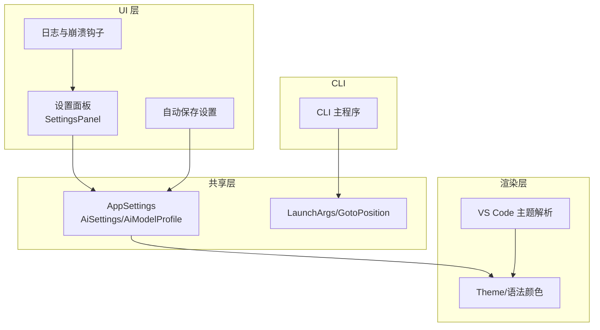
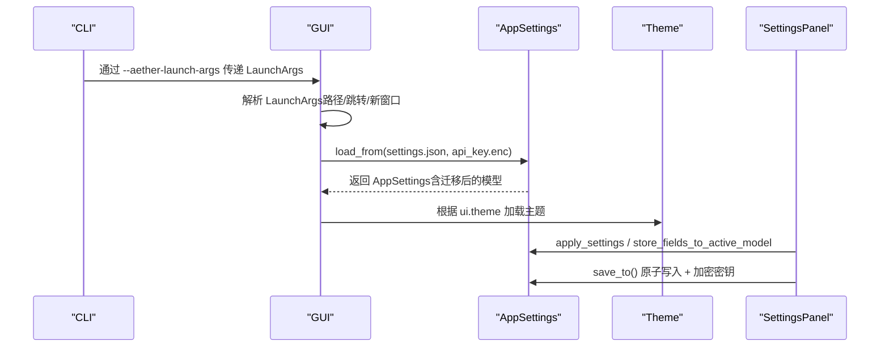
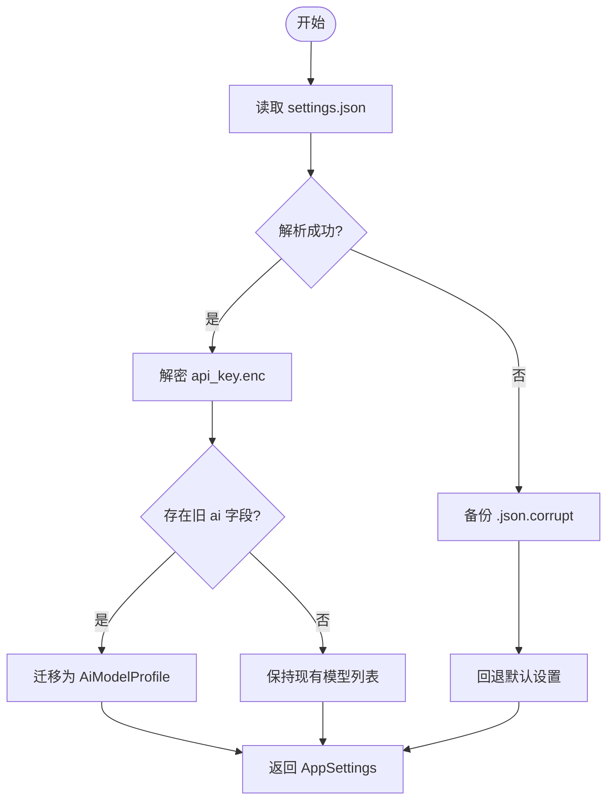
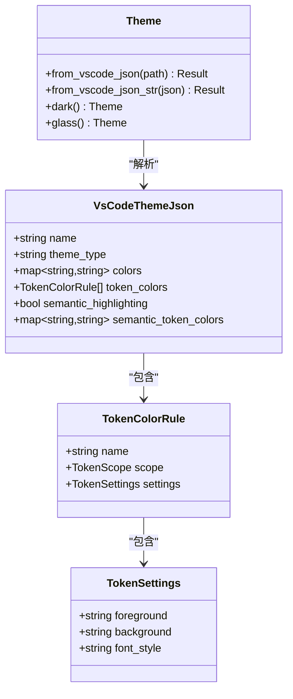
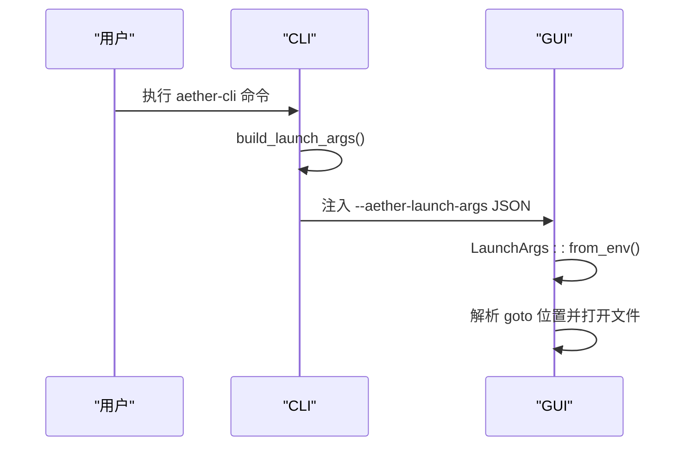
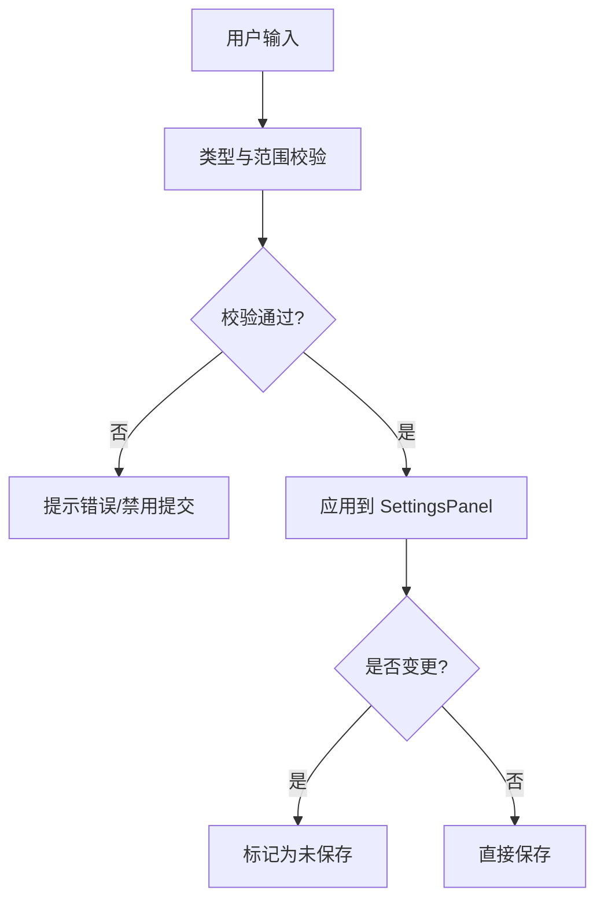
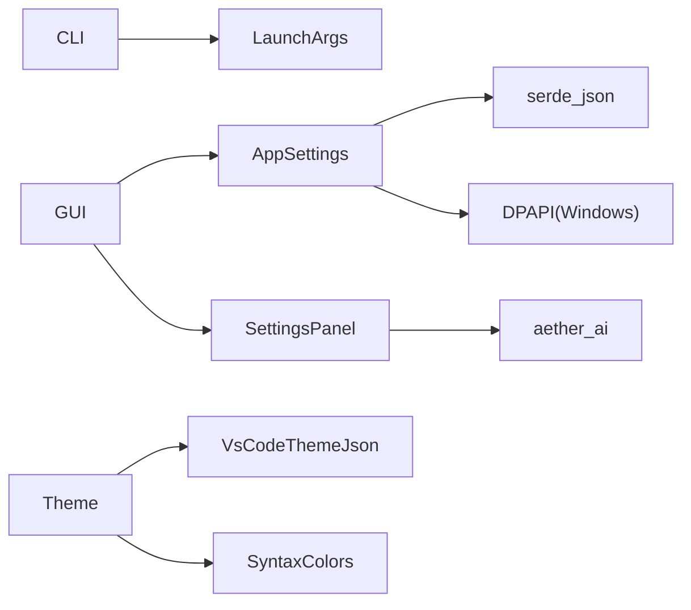

# 配置和设置

<cite>
**本文引用的文件**
- [settings.rs](file://crates/aether-shared/src/settings.rs)
- [launch.rs](file://crates/aether-shared/src/launch.rs)
- [vscode_theme.rs](file://crates/aether-render/src/vscode_theme.rs)
- [theme.rs](file://crates/aether-render/src/theme.rs)
- [settings.rs（Win32 设置面板）](file://crates/aether-win32/src/settings.rs)
- [auto_save.rs](file://crates/aether-win32/src/auto_save.rs)
- [logging.rs（Win32）](file://crates/aether-win32/src/logging.rs)
- [main.rs（CLI）](file://crates/aether-cli/src/main.rs)
</cite>

## 目录
1. [简介](#简介)
2. [项目结构](#项目结构)
3. [核心组件](#核心组件)
4. [架构总览](#架构总览)
5. [详细组件分析](#详细组件分析)
6. [依赖关系分析](#依赖关系分析)
7. [性能考虑](#性能考虑)
8. [故障排除指南](#故障排除指南)
9. [结论](#结论)
10. [附录](#附录)

## 简介
本章节面向“配置与设置”子系统，系统性说明应用的配置持久化机制、主题系统、启动参数处理、设置校验与错误处理、导入导出与备份恢复、以及扩展与定制方法。目标是帮助开发者与用户理解并安全地管理应用配置，确保数据一致性与可维护性。

## 项目结构
配置相关代码主要分布在以下模块：
- 共享层（aether-shared）：定义全局设置模型、加载/保存、加密存储、默认值与迁移逻辑。
- 渲染层（aether-render）：主题系统与 VS Code 主题兼容解析。
- Win32 UI（aether-win32）：设置面板交互、自动保存策略、日志与崩溃钩子。
- CLI（aether-cli）：命令行参数到启动参数的转换。
- 共享启动参数（aether-shared）：跨进程传递的启动参数结构。

**图表来源**
- [settings.rs:1-23](file://crates/aether-shared/src/settings.rs#L1-L23)
- [launch.rs:6-13](file://crates/aether-shared/src/launch.rs#L6-L13)
- [settings.rs（Win32 设置面板）:1-51](file://crates/aether-win32/src/settings.rs#L1-L51)
- [auto_save.rs:43-71](file://crates/aether-win32/src/auto_save.rs#L43-L71)
- [theme.rs:152-172](file://crates/aether-render/src/theme.rs#L152-L172)
- [vscode_theme.rs:10-31](file://crates/aether-render/src/vscode_theme.rs#L10-L31)
- [main.rs（CLI）:60-79](file://crates/aether-cli/src/main.rs#L60-L79)

**章节来源**
- [settings.rs:1-23](file://crates/aether-shared/src/settings.rs#L1-L23)
- [launch.rs:6-13](file://crates/aether-shared/src/launch.rs#L6-L13)
- [settings.rs（Win32 设置面板）:1-51](file://crates/aether-win32/src/settings.rs#L1-L51)
- [auto_save.rs:43-71](file://crates/aether-win32/src/auto_save.rs#L43-L71)
- [theme.rs:152-172](file://crates/aether-render/src/theme.rs#L152-L172)
- [vscode_theme.rs:10-31](file://crates/aether-render/src/vscode_theme.rs#L10-L31)
- [main.rs（CLI）:60-79](file://crates/aether-cli/src/main.rs#L60-L79)

## 核心组件
- 应用设置（AppSettings）：集中管理 UI、AI、远程、自动保存、更新等配置；提供加载、保存、路径计算、迁移与密钥管理。
- AI 设置（AiSettings/AiModelProfile）：支持多模型档案，API Key 单独加密存储，运行时通过 active_ai_settings 获取当前激活模型配置。
- 启动参数（LaunchArgs/GotoPosition）：跨进程传递打开路径、跳转位置、是否新窗口、等待等指令。
- 主题系统（Theme/VsCodeThemeJson）：内置主题与 VS Code 主题兼容解析，映射 UI 与语法高亮颜色。
- 设置面板（SettingsPanel）：UI 状态机，负责字段编辑、校验、模型列表管理、后台测试连接与模型拉取。
- 自动保存（AutoSaveSettings）：防抖空闲、失焦保存、周期兜底、大文件降级策略。

**章节来源**
- [settings.rs:1-23](file://crates/aether-shared/src/settings.rs#L1-L23)
- [settings.rs:73-115](file://crates/aether-shared/src/settings.rs#L73-L115)
- [settings.rs:143-166](file://crates/aether-shared/src/settings.rs#L143-L166)
- [launch.rs:6-13](file://crates/aether-shared/src/launch.rs#L6-L13)
- [launch.rs:40-59](file://crates/aether-shared/src/launch.rs#L40-L59)
- [vscode_theme.rs:10-31](file://crates/aether-render/src/vscode_theme.rs#L10-L31)
- [theme.rs:152-172](file://crates/aether-render/src/theme.rs#L152-L172)
- [settings.rs（Win32 设置面板）:119-149](file://crates/aether-win32/src/settings.rs#L119-L149)
- [auto_save.rs:43-71](file://crates/aether-win32/src/auto_save.rs#L43-L71)

## 架构总览
配置系统的整体流程如下：
- 启动阶段：CLI 将命令行参数转换为 LaunchArgs，通过环境变量注入 GUI；GUI 读取 LaunchArgs 决定打开的文件与跳转位置。
- 配置加载：AppSettings::load_from 从 settings.json 加载，解密 api_key.enc 注入各模型 API Key；若 JSON 损坏则回退默认值并备份原文件。
- 配置保存：AppSettings::save_to 原子写入 settings.json，并将所有模型的 API Key 以 JSON map 形式 DPAPI 加密保存到 api_key.enc。
- 主题加载：Theme 可从内置或 VS Code 主题文件加载，映射 UI 与语法高亮颜色。
- 设置面板：用户修改后，SettingsPanel 进行输入校验与状态同步，最终调用 AppSettings 持久化。

**图表来源**
- [launch.rs:16-32](file://crates/aether-shared/src/launch.rs#L16-L32)
- [settings.rs:389-453](file://crates/aether-shared/src/settings.rs#L389-L453)
- [settings.rs:487-559](file://crates/aether-shared/src/settings.rs#L487-L559)
- [vscode_theme.rs:103-117](file://crates/aether-render/src/vscode_theme.rs#L103-L117)
- [settings.rs（Win32 设置面板）:622-641](file://crates/aether-win32/src/settings.rs#L622-L641)

**章节来源**
- [launch.rs:16-32](file://crates/aether-shared/src/launch.rs#L16-L32)
- [settings.rs:389-453](file://crates/aether-shared/src/settings.rs#L389-L453)
- [settings.rs:487-559](file://crates/aether-shared/src/settings.rs#L487-L559)
- [vscode_theme.rs:103-117](file://crates/aether-render/src/vscode_theme.rs#L103-L117)
- [settings.rs（Win32 设置面板）:622-641](file://crates/aether-win32/src/settings.rs#L622-L641)

## 详细组件分析

### 配置持久化机制
- 文件格式：settings.json 使用 serde_json 序列化 AppSettings；api_key.enc 使用 Windows DPAPI 加密（非 Windows 平台回退为 UTF-8 字节）。
- 版本迁移：加载时检测旧版单一 ai 配置，迁移为 AiModelProfile，并设置 active_model_id；迁移后不再写出旧 ai 字段。
- 默认值管理：AppSettings、UiSettings、AutoSaveSettings、UpdateSettings 均提供 Default 实现；缺失字段反序列化为默认值。
- 原子写入：临时文件 + fsync + rename，避免崩溃导致配置损坏；失败时清理临时文件。
- 最后工作区保护：save() 不直接写 last_workspace，由 persist_last_workspace() 单独维护，避免多窗口并发覆盖。

**图表来源**
- [settings.rs:389-453](file://crates/aether-shared/src/settings.rs#L389-L453)
- [settings.rs:487-559](file://crates/aether-shared/src/settings.rs#L487-L559)

**章节来源**
- [settings.rs:389-453](file://crates/aether-shared/src/settings.rs#L389-L453)
- [settings.rs:487-559](file://crates/aether-shared/src/settings.rs#L487-L559)
- [settings.rs:644-673](file://crates/aether-shared/src/settings.rs#L644-L673)

### 主题系统实现
- 内置主题：Theme::dark 与 Theme::glass 提供默认暗色与毛玻璃主题；默认主题为 glass。
- VS Code 主题兼容：VsCodeThemeJson 解析 name、type、colors、tokenColors、semanticHighlighting、semanticTokenColors；映射 editor/background/tab/statusBar/titleBar/activityBar/sideBar/dropdown/menu 等 UI 颜色，并将 tokenColors 映射到 SyntaxColors。
- 颜色解析：十六进制颜色字符串解析为 D2D1_COLOR_F；无效颜色跳过并保留默认。
- 语法高亮：parse_syntax_colors 将 TextMate scope 映射到 keyword/string/comment/number/function/type_name/operator/variable/preprocessor/macro/lifetime/regex/format_string/md_heading 等。

**图表来源**
- [vscode_theme.rs:10-31](file://crates/aether-render/src/vscode_theme.rs#L10-L31)
- [vscode_theme.rs:33-81](file://crates/aether-render/src/vscode_theme.rs#L33-L81)
- [vscode_theme.rs:103-117](file://crates/aether-render/src/vscode_theme.rs#L103-L117)
- [theme.rs:152-172](file://crates/aether-render/src/theme.rs#L152-L172)

**章节来源**
- [vscode_theme.rs:10-31](file://crates/aether-render/src/vscode_theme.rs#L10-L31)
- [vscode_theme.rs:103-117](file://crates/aether-render/src/vscode_theme.rs#L103-L117)
- [vscode_theme.rs:178-201](file://crates/aether-render/src/vscode_theme.rs#L178-L201)
- [theme.rs:152-172](file://crates/aether-render/src/theme.rs#L152-L172)

### 启动参数处理
- CLI 构建 LaunchArgs：build_launch_args 将 CLI 参数（路径、--goto、--new-window、--wait）转换为 LaunchArgs；--goto 支持 file.txt:line:column 或 line:column。
- GUI 解析 LaunchArgs：LaunchArgs::from_env 扫描命令行参数中的 --aether-launch-args JSON 片段，反序列化为 LaunchArgs；is_empty 判断是否无特殊指令。
- 跳转位置：GotoPosition 支持 1-based 行号与列号，并提供 zero_based_line/column 转换。

**图表来源**
- [main.rs（CLI）:60-79](file://crates/aether-cli/src/main.rs#L60-L79)
- [launch.rs:16-32](file://crates/aether-shared/src/launch.rs#L16-L32)
- [launch.rs:40-59](file://crates/aether-shared/src/launch.rs#L40-L59)
- [launch.rs:104-154](file://crates/aether-shared/src/launch.rs#L104-L154)

**章节来源**
- [main.rs（CLI）:60-79](file://crates/aether-cli/src/main.rs#L60-L79)
- [launch.rs:16-32](file://crates/aether-shared/src/launch.rs#L16-L32)
- [launch.rs:40-59](file://crates/aether-shared/src/launch.rs#L40-L59)
- [launch.rs:104-154](file://crates/aether-shared/src/launch.rs#L104-L154)

### 设置的验证与校验
- 数值范围校验：温度（0.0-2.0）、Top-p（0.0-1.0）、频率惩罚（-2.0~2.0）、存在惩罚（-2.0~2.0）、Max Tokens（1..=1_000_000）、最大输入 Token（1..=2_000_000）。
- 停止序列：逗号分隔，去空白、去空项，最多 16 个。
- 响应格式：text 或 json_object。
- 思考模式禁用采样参数：DeepSeek 思考模式下 temperature/top_p 不生效。
- 未保存更改检测：SettingsPanel 记录 baseline_ai，比较 to_ai_settings() 与 baseline 判断 is_dirty。

**图表来源**
- [settings.rs（Win32 设置面板）:1143-1171](file://crates/aether-win32/src/settings.rs#L1143-L1171)
- [settings.rs（Win32 设置面板）:254-267](file://crates/aether-win32/src/settings.rs#L254-L267)
- [settings.rs（Win32 设置面板）:1352-1364](file://crates/aether-win32/src/settings.rs#L1352-L1364)

**章节来源**
- [settings.rs（Win32 设置面板）:1143-1171](file://crates/aether-win32/src/settings.rs#L1143-L1171)
- [settings.rs（Win32 设置面板）:254-267](file://crates/aether-win32/src/settings.rs#L254-L267)
- [settings.rs（Win32 设置面板）:1352-1364](file://crates/aether-win32/src/settings.rs#L1352-L1364)

### 导入导出与备份恢复
- 导入：settings.json 反序列化为 AppSettings；若 JSON 损坏，备份为 .json.corrupt 并回退默认设置。
- 导出：AppSettings::save_to 原子写入 settings.json；同时将所有模型的 API Key 以 JSON map 形式 DPAPI 加密保存到 api_key.enc。
- 备份恢复：损坏配置自动备份；可通过手动恢复 .json.corrupt 文件；删除 api_key.enc 会清除加密密钥存储。

**章节来源**
- [settings.rs:389-453](file://crates/aether-shared/src/settings.rs#L389-L453)
- [settings.rs:487-559](file://crates/aether-shared/src/settings.rs#L487-L559)

### 自动保存策略
- 触发方式：防抖空闲保存、失焦立即保存、周期强制保存（兜底）。
- 大文件降级：超过阈值增大防抖延迟并关闭周期保存。
- 默认值：enabled=true、debounce_ms=1000、focus_loss_save=true、periodic_save_ms=30000、large_file_threshold=2MB、large_file_debounce_ms=5000。

**章节来源**
- [auto_save.rs:43-71](file://crates/aether-win32/src/auto_save.rs#L43-L71)

### 日志与调试
- 日志初始化：tracing_subscriber 配置环境过滤器、文件层与控制台层；安装 panic hook 在崩溃前 flush 日志。
- 调试建议：检查 settings.json 与 api_key.enc 是否存在且可读；查看日志目录定位错误；确认主题文件路径与内容有效。

**章节来源**
- [logging.rs（Win32）:71-108](file://crates/aether-win32/src/logging.rs#L71-L108)

## 依赖关系分析
- AppSettings 依赖 serde_json 进行序列化/反序列化；依赖 dirs crate 获取配置目录；Windows 平台依赖 DPAPI 加密密钥。
- SettingsPanel 依赖 aether_ai 进行连接测试与模型列表拉取；依赖 aether_shared::settings 进行数据绑定。
- Theme 依赖 vs code 主题解析与 D2D1 颜色构造；SyntaxColors 提供默认语法高亮映射。
- CLI 依赖 launch.rs 的 LaunchArgs 与 parse_goto 逻辑。

**图表来源**
- [main.rs（CLI）:60-79](file://crates/aether-cli/src/main.rs#L60-L79)
- [settings.rs:368-383](file://crates/aether-shared/src/settings.rs#L368-L383)
- [settings.rs:562-642](file://crates/aether-shared/src/settings.rs#L562-L642)
- [settings.rs（Win32 设置面板）:1371-1400](file://crates/aether-win32/src/settings.rs#L1371-L1400)
- [vscode_theme.rs:103-117](file://crates/aether-render/src/vscode_theme.rs#L103-L117)

**章节来源**
- [main.rs（CLI）:60-79](file://crates/aether-cli/src/main.rs#L60-L79)
- [settings.rs:368-383](file://crates/aether-shared/src/settings.rs#L368-L383)
- [settings.rs:562-642](file://crates/aether-shared/src/settings.rs#L562-L642)
- [settings.rs（Win32 设置面板）:1371-1400](file://crates/aether-win32/src/settings.rs#L1371-L1400)
- [vscode_theme.rs:103-117](file://crates/aether-render/src/vscode_theme.rs#L103-L117)

## 性能考虑
- 原子写入减少 I/O 竞争与崩溃风险；fsync 确保数据落盘后再 rename。
- 大文件自动保存降级避免频繁 I/O 影响性能。
- 主题解析跳过无效颜色，避免额外开销。
- 模型列表拉取采用后台线程与缓存指纹，避免重复请求。

[本节为通用指导，无需特定文件引用]

## 故障排除指南
- 配置损坏：检查 settings.json 是否为有效 JSON；若解析失败，查看 .json.corrupt 备份并恢复。
- 密钥问题：确认 api_key.enc 存在且可解密；若为空密钥，文件会被删除。
- 主题加载失败：检查 VS Code 主题文件路径与颜色格式；无效颜色将被忽略。
- 启动参数错误：验证 --goto 格式（file.txt:line:column 或 line:column）；确保 LaunchArgs JSON 正确。
- 日志定位：查看日志目录，启用更详细日志级别；崩溃前 panic hook 会记录关键信息。

**章节来源**
- [settings.rs:389-453](file://crates/aether-shared/src/settings.rs#L389-L453)
- [settings.rs:487-559](file://crates/aether-shared/src/settings.rs#L487-L559)
- [vscode_theme.rs:103-117](file://crates/aether-render/src/vscode_theme.rs#L103-L117)
- [launch.rs:104-154](file://crates/aether-shared/src/launch.rs#L104-L154)
- [logging.rs（Win32）:71-108](file://crates/aether-win32/src/logging.rs#L71-L108)

## 结论
配置与设置系统通过结构化模型、原子写入、加密密钥、版本迁移与严格校验，提供了稳定、安全且易用的配置管理能力。主题系统兼容 VS Code 生态，启动参数支持跨进程传递，自动保存策略兼顾用户体验与性能。开发者可基于现有接口扩展自定义主题、新增设置字段或集成外部服务。

[本节为总结，无需特定文件引用]

## 附录
- 配置文件示例路径：settings.json 位于系统配置目录下的 Aether 文件夹；api_key.enc 同目录。
- 最佳实践：
  - 定期备份 settings.json 与 api_key.enc。
  - 使用 VS Code 主题时确保颜色格式正确。
  - 谨慎修改自动保存阈值，避免影响性能。
  - 使用 --goto 精确跳转到文件位置，提升调试效率。
- 扩展方法：
  - 新增设置字段：在 AppSettings 中添加字段并提供默认值；在 SettingsPanel 中增加 UI 与校验逻辑。
  - 自定义主题：创建 VS Code 风格主题文件，通过 Theme::from_vscode_json 加载。
  - 集成外部服务：在 SettingsPanel 中增加测试连接逻辑，使用 aether_ai 客户端验证配置。

[本节为补充信息，无需特定文件引用]