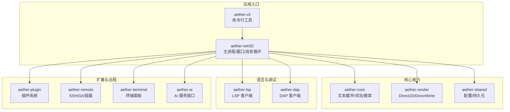
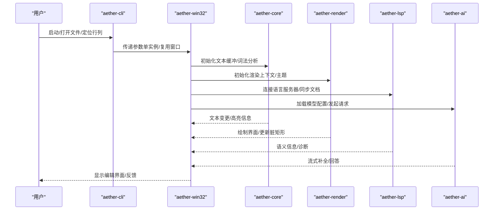
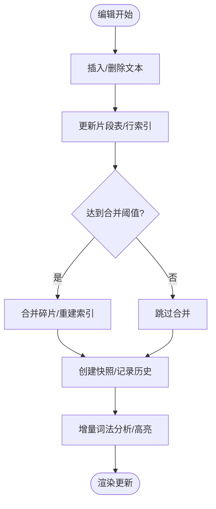
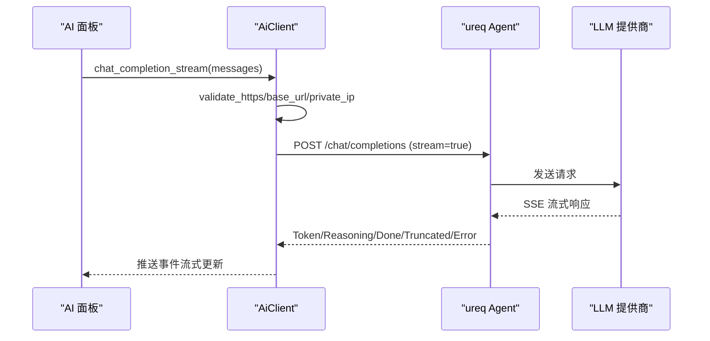
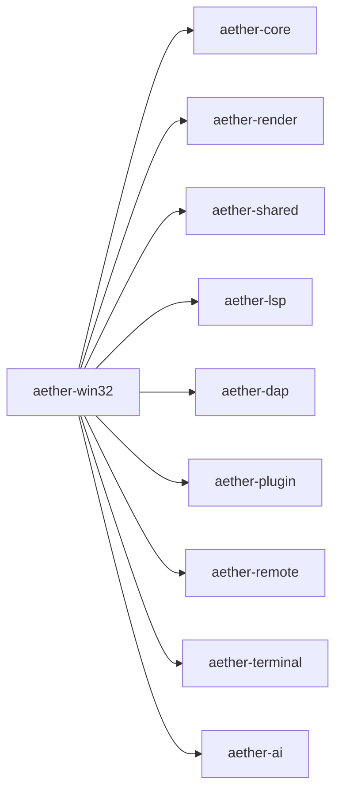

# 产品简介

<cite>
**本文引用的文件**
- [README.md](file://README.md)
- [Cargo.toml](file://Cargo.toml)
- [rust-toolchain.toml](file://rust-toolchain.toml)
- [main.rs](file://crates/aether-win32/src/main.rs)
- [lib.rs（aether-core）](file://crates/aether-core/src/lib.rs)
- [piece_table.rs](file://crates/aether-core/src/buffer/piece_table.rs)
- [lib.rs（aether-render）](file://crates/aether-render/src/lib.rs)
- [lib.rs（aether-lsp）](file://crates/aether-lsp/src/lib.rs)
- [lib.rs（a-terminal）](file://crates/aether-terminal/src/lib.rs)
- [lib.rs（aether-plugin）](file://crates/aether-plugin/src/lib.rs)
- [settings.rs](file://crates/aether-shared/src/settings.rs)
- [lib.rs（aether-ai）](file://crates/aether-ai/src/lib.rs)
</cite>

## 目录
1. [引言](#引言)
2. [项目结构](#项目结构)
3. [核心组件](#核心组件)
4. [架构总览](#架构总览)
5. [详细组件分析](#详细组件分析)
6. [依赖关系分析](#依赖关系分析)
7. [性能考量](#性能考量)
8. [故障排查指南](#故障排查指南)
9. [结论](#结论)
10. [附录](#附录)

## 引言
Aether Studio（牧羊人编辑器）是一款基于 Rust 与 Win32 API 构建的现代化代码编辑器，面向 Windows 平台提供原生体验。它兼顾轻量编辑器的简洁性与开发者在“编辑-构建-调试”闭环中的核心需求，提供全面的代码编辑、导航、语法高亮支持，并集成 AI 辅助编程、模块化扩展能力与原生 Windows 集成。

核心价值主张：
- 高性能文本编辑：采用 Piece Table 文本缓冲、多光标、撤销/重做历史栈、增量词法分析与 SIMD 优化，确保大文件流畅编辑。
- AI 辅助编程：内置 HTTP 方式对接主流 LLM（如 DeepSeek、Kimi），支持代码解释、改写、内联建议、Agent 工具结果回喂与模型配置面板。
- 原生 Windows 体验：Win32 窗口 + DWM 沉浸式深色模式、高 DPI、系统高对比度模式；自绘渲染引擎基于 Direct2D/DirectWrite，支持主题、半透明背景、阴影、动画与脏矩形优化。
- 现代开发工作流：LSP 客户端、DAP 调试基础、Tree-sitter 语法解析、远程开发（SSH/Git）、内置终端面板（ConPTY）。

目标用户群体：
- 普通开发者：追求快速启动、低延迟编辑、AI 辅助提升效率。
- 高级用户/团队：需要可配置的 LSP/DAP、插件体系、远程开发与统一工作区管理。
- 对性能敏感的用户：大文件编辑、复杂语法高亮与实时预览场景。

支持平台版本：Windows 10 1809+ 与 Windows 11（推荐 Windows 11）。

**章节来源**
- [README.md:42-66](file://README.md#L42-L66)
- [README.md:215-238](file://README.md#L215-L238)
- [README.md:85-92](file://README.md#L85-L92)

## 项目结构
仓库采用 Cargo Workspace 组织，按职责拆分为多个 Crate，形成清晰的分层与解耦：
- aether-core：文本缓冲、历史栈、词法分析器、工作区数据结构、搜索等核心能力。
- aether-render：Direct2D/DirectWrite 渲染抽象、主题系统与画笔缓存。
- aether-win32：Windows 原生 UI 层（窗口、消息循环、菜单、布局、事件处理、应用入口）。
- aether-shared：共享配置与持久化（UI、AI、最近项目、窗口状态）。
- aether-lsp：语言服务器协议客户端（文档同步、语义 token、增量同步）。
- aether-dap：调试适配器协议客户端基础实现。
- aether-remote：SSH/Git/容器远程操作抽象。
- aether-ai：AI 服务接口与请求处理。
- aether-terminal：终端面板（ConPTY、输出缓冲、Agent 命令回环）。
- aether-plugin：插件注册、权限控制与运行时基础。
- aether-cli：命令行启动器，支持打开路径、定位行列、等待窗口关闭等。

**图表来源**
- [Cargo.toml:1-19](file://Cargo.toml#L1-L19)
- [lib.rs（aether-core）:1-12](file://crates/aether-core/src/lib.rs#L1-L12)
- [lib.rs（aether-render）:1-5](file://crates/aether-render/src/lib.rs#L1-L5)
- [lib.rs（aether-lsp）:1-16](file://crates/aether-lsp/src/lib.rs#L1-L16)
- [lib.rs（a-terminal）:1-8](file://crates/aether-terminal/src/lib.rs#L1-L8)
- [lib.rs（aether-plugin）:1-8](file://crates/aether-plugin/src/lib.rs#L1-L8)
- [lib.rs（aether-ai）:1-800](file://crates/aether-ai/src/lib.rs#L1-L800)

**章节来源**
- [Cargo.toml:1-19](file://Cargo.toml#L1-L19)
- [README.md:162-179](file://README.md#L162-L179)

## 核心组件
- 文本缓冲与词法分析：Piece Table 实现 O(1) 插入/删除、零拷贝大文件打开、行索引与片段合并策略，配合增量词法分析与 SIMD 加速，保障大文件编辑流畅性。
- 渲染引擎：Direct2D/DirectWrite 自绘管线，支持主题、半透明背景、阴影、动画与脏矩形优化，提供高性能 UI 渲染。
- 语言服务：LSP 客户端框架，支持文档同步、语义 token、增量同步；DAP 客户端基础，便于接入调试器。
- AI 集成：HTTP 方式对接 OpenAI 兼容接口，内置 DeepSeek/Kimi 预设，支持流式响应、错误脱敏与安全校验（HTTPS、私有 IP 拦截、DNS TOCTOU 防护）。
- 终端面板：通过 ConPTY 支持 PowerShell/CMD 子进程，提供 Agent 命令回环与输出缓冲。
- 插件系统：插件注册、权限控制与运行时基础，为扩展能力提供安全边界。
- 配置与持久化：AppSettings 统一管理 UI/AI/远程/自动保存等设置，API Key 使用 DPAPI 加密存储，原子写入避免损坏。

**章节来源**
- [piece_table.rs:11-35](file://crates/aether-core/src/buffer/piece_table.rs#L11-L35)
- [lib.rs（aether-render）:1-5](file://crates/aether-render/src/lib.rs#L1-L5)
- [lib.rs（aether-lsp）:1-16](file://crates/aether-lsp/src/lib.rs#L1-L16)
- [lib.rs（aether-ai）:17-82](file://crates/aether-ai/src/lib.rs#L17-L82)
- [lib.rs（a-terminal）:1-8](file://crates/aether-terminal/src/lib.rs#L1-L8)
- [lib.rs（aether-plugin）:1-8](file://crates/aether-plugin/src/lib.rs#L1-L8)
- [settings.rs:6-23](file://crates/aether-shared/src/settings.rs#L6-L23)

## 架构总览
Aether Studio 采用分层架构：
- 应用入口层：aether-win32 负责 Windows 窗口、消息循环、事件分发；aether-cli 提供命令行入口。
- 核心能力层：aether-core 提供文本缓冲、词法分析、搜索与工作区数据；aether-render 提供渲染抽象与主题系统；aether-shared 提供配置与持久化。
- 语言与调试层：aether-lsp 与 aether-dap 分别实现 LSP 与 DAP 客户端基础。
- 扩展与远程层：aether-plugin 提供插件运行时；aether-remote 抽象 SSH/Git/容器；aether-terminal 提供终端面板；aether-ai 提供 AI 服务接口。

**图表来源**
- [main.rs:8-26](file://crates/aether-win32/src/main.rs#L8-L26)
- [lib.rs（aether-core）:1-12](file://crates/aether-core/src/lib.rs#L1-L12)
- [lib.rs（aether-render）:1-5](file://crates/aether-render/src/lib.rs#L1-L5)
- [lib.rs（aether-lsp）:1-16](file://crates/aether-lsp/src/lib.rs#L1-L16)
- [lib.rs（aether-ai）:259-320](file://crates/aether-ai/src/lib.rs#L259-L320)

**章节来源**
- [main.rs:8-26](file://crates/aether-win32/src/main.rs#L8-L26)
- [README.md:162-179](file://README.md#L162-L179)

## 详细组件分析

### 文本缓冲与词法分析（aether-core）
- Piece Table 文本缓冲：支持 O(1) 插入/删除、零拷贝大文件打开、行索引与片段合并策略，提供不可变快照用于撤销/重做与并发访问。
- 增量词法分析：结合 SIMD 优化，提升大文件语法高亮性能。
- 搜索与工作区：异步文件扫描、Git 状态标记、最近项目与拖拽支持。

**图表来源**
- [piece_table.rs:11-35](file://crates/aether-core/src/buffer/piece_table.rs#L11-L35)
- [piece_table.rs:1459-1566](file://crates/aether-core/src/buffer/piece_table.rs#L1459-L1566)

**章节来源**
- [piece_table.rs:11-35](file://crates/aether-core/src/buffer/piece_table.rs#L11-L35)
- [lib.rs（aether-core）:1-12](file://crates/aether-core/src/lib.rs#L1-L12)

### 渲染引擎（aether-render）
- Direct2D/DirectWrite 自绘管线：支持主题、半透明背景、阴影、动画与脏矩形优化。
- GPU 加速：通过计算着色器进行字符分类、关键词查找、语法分类与 token 扫描，提升渲染性能。
- VSCode 主题映射：兼容常见主题格式，降低迁移成本。

**章节来源**
- [lib.rs（aether-render）:1-5](file://crates/aether-render/src/lib.rs#L1-L5)
- [README.md:50-52](file://README.md#L50-L52)

### 语言服务（aether-lsp）
- LSP 客户端框架：文档同步、语义 token、增量同步，便于接入各类语言服务器。
- 类型与传输：统一的类型定义与传输层抽象，支持跨语言服务集成。

**章节来源**
- [lib.rs（aether-lsp）:1-16](file://crates/aether-lsp/src/lib.rs#L1-L16)
- [README.md:58-60](file://README.md#L58-L60)

### AI 集成（aether-ai）
- 提供商支持：DeepSeek、Kimi、自定义（OpenAI 兼容），提供默认 Base URL 与模型清单。
- 安全与健壮性：HTTPS 强制、私有 IP 拦截、DNS TOCTOU 防护、响应体大小限制、错误消息脱敏。
- 流式响应：SSE 流式输出，支持 Token/Reasoning/Done/Truncated/Error 事件。
- 配置管理：从 AppSettings 加载配置，支持思考模式、采样参数、停止序列与响应格式。

**图表来源**
- [lib.rs（aether-ai）:259-320](file://crates/aether-ai/src/lib.rs#L259-L320)
- [lib.rs（aether-ai）:712-800](file://crates/aether-ai/src/lib.rs#L712-L800)

**章节来源**
- [lib.rs（aether-ai）:17-82](file://crates/aether-ai/src/lib.rs#L17-L82)
- [lib.rs（aether-ai）:259-320](file://crates/aether-ai/src/lib.rs#L259-L320)
- [lib.rs（aether-ai）:712-800](file://crates/aether-ai/src/lib.rs#L712-L800)

### 终端面板（aether-terminal）
- ConPTY 支持：通过 ConPTY 运行 PowerShell/CMD 子进程，提供终端面板。
- 输出缓冲与 Agent 命令回环：支持 Agent 命令执行与结果回传。

**章节来源**
- [lib.rs（a-terminal）:1-8](file://crates/aether-terminal/src/lib.rs#L1-L8)
- [README.md:62-63](file://README.md#L62-L63)

### 插件系统（aether-plugin）
- 插件注册与权限控制：提供 PluginRegistry 与 PermissionGrant/PermissionLevel，确保插件安全运行。
- 运行时基础：PluginRuntime 提供插件生命周期管理与资源隔离。

**章节来源**
- [lib.rs（aether-plugin）:1-8](file://crates/aether-plugin/src/lib.rs#L1-L8)
- [README.md:63-64](file://README.md#L63-L64)

### 配置与持久化（aether-shared）
- AppSettings：统一管理 UI、AI、远程、自动保存等设置，支持多模型配置档案。
- 安全存储：API Key 使用 DPAPI 加密存储，settings.json 不写入明文密钥。
- 原子写入：临时文件 + fsync + rename，避免配置损坏。

**章节来源**
- [settings.rs:6-23](file://crates/aether-shared/src/settings.rs#L6-L23)
- [settings.rs:385-559](file://crates/aether-shared/src/settings.rs#L385-L559)
- [settings.rs:562-642](file://crates/aether-shared/src/settings.rs#L562-L642)

## 依赖关系分析
- 应用入口依赖：aether-win32 依赖 aether-core、aether-render、aether-shared、aether-lsp、aether-dap、aether-plugin、aether-remote、aether-terminal、aether-ai。
- 核心能力依赖：aether-core 提供文本缓冲与词法分析；aether-render 提供渲染抽象；aether-shared 提供配置与持久化。
- 语言与调试依赖：aether-lsp 与 aether-dap 独立实现，便于替换或扩展。
- 扩展与远程依赖：aether-plugin 提供插件运行时；aether-remote 抽象远程操作；aether-terminal 提供终端面板；aether-ai 提供 AI 服务接口。

**图表来源**
- [Cargo.toml:1-19](file://Cargo.toml#L1-L19)

**章节来源**
- [Cargo.toml:1-19](file://Cargo.toml#L1-L19)

## 性能考量
- 文本编辑性能：Piece Table 实现 O(1) 插入/删除，零拷贝大文件打开，行索引与片段合并策略减少内存占用与 CPU 开销。
- 渲染性能：Direct2D/DirectWrite 自绘管线，GPU 加速（计算着色器）与脏矩形优化，提升 UI 渲染效率。
- 词法分析性能：增量词法分析与 SIMD 优化，支持大文件实时高亮。
- 网络性能：AI 请求流式响应，限制响应体大小，避免阻塞与内存溢出。
- 构建优化：发布构建启用 fat LTO、单代码生成单元、strip，减小二进制体积并提升性能。

**章节来源**
- [piece_table.rs:11-35](file://crates/aether-core/src/buffer/piece_table.rs#L11-L35)
- [README.md:148-159](file://README.md#L148-L159)
- [Cargo.toml:29-37](file://Cargo.toml#L29-L37)

## 故障排查指南
- AI 连接问题：检查 HTTPS 配置、API Key 是否有效、Base URL 是否正确；查看错误消息是否被脱敏（safe_display）。
- 配置损坏：settings.json 解析失败时会自动备份并回退到默认设置；检查 api_key.enc 是否可解密。
- 插件权限：确认插件权限级别与授予状态，避免运行时权限不足。
- 终端面板：确认 ConPTY 支持与环境变量配置，检查子进程启动日志。

**章节来源**
- [lib.rs（aether-ai）:84-163](file://crates/aether-ai/src/lib.rs#L84-L163)
- [settings.rs:385-559](file://crates/aether-shared/src/settings.rs#L385-L559)
- [lib.rs（aether-plugin）:1-8](file://crates/aether-plugin/src/lib.rs#L1-L8)
- [lib.rs（a-terminal）:1-8](file://crates/aether-terminal/src/lib.rs#L1-L8)

## 结论
Aether Studio 以 Rust 与 Win32 API 为基础，提供高性能、低延迟的原生 Windows 代码编辑体验。其核心优势包括：
- 高性能文本编辑：Piece Table 与增量词法分析，支持大文件流畅编辑。
- AI 辅助编程：内置 LLM 集成，支持流式响应与安全校验。
- 原生 Windows 体验：Direct2D/DirectWrite 自绘渲染，主题与动画支持。
- 现代开发工作流：LSP/DAP、远程开发、终端面板与插件系统。

项目持续活跃开发，支持 Windows 10 1809+ 与 Windows 11，适合不同层次开发者使用。

[无章节来源，因为本节为总结性内容]

## 附录
- 构建环境：Rust stable 工具链、Visual Studio 2022、目标平台 x86_64-pc-windows-msvc。
- 构建命令：cargo build -p aether-win32 --bin aether-app（调试/发布构建）。
- 运行命令：cargo run -p aether-win32 --bin aether-app（直接启动 GUI）。

**章节来源**
- [README.md:85-118](file://README.md#L85-L118)
- [rust-toolchain.toml:1-5](file://rust-toolchain.toml#L1-L5)
- [Cargo.toml:29-37](file://Cargo.toml#L29-L37)