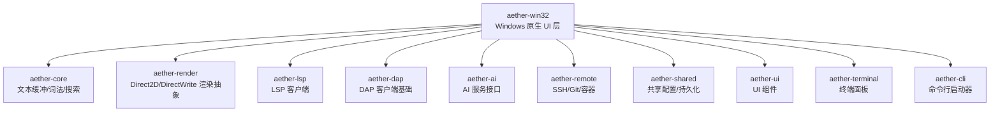
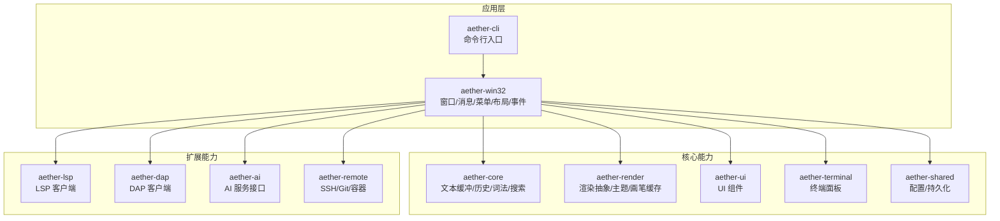
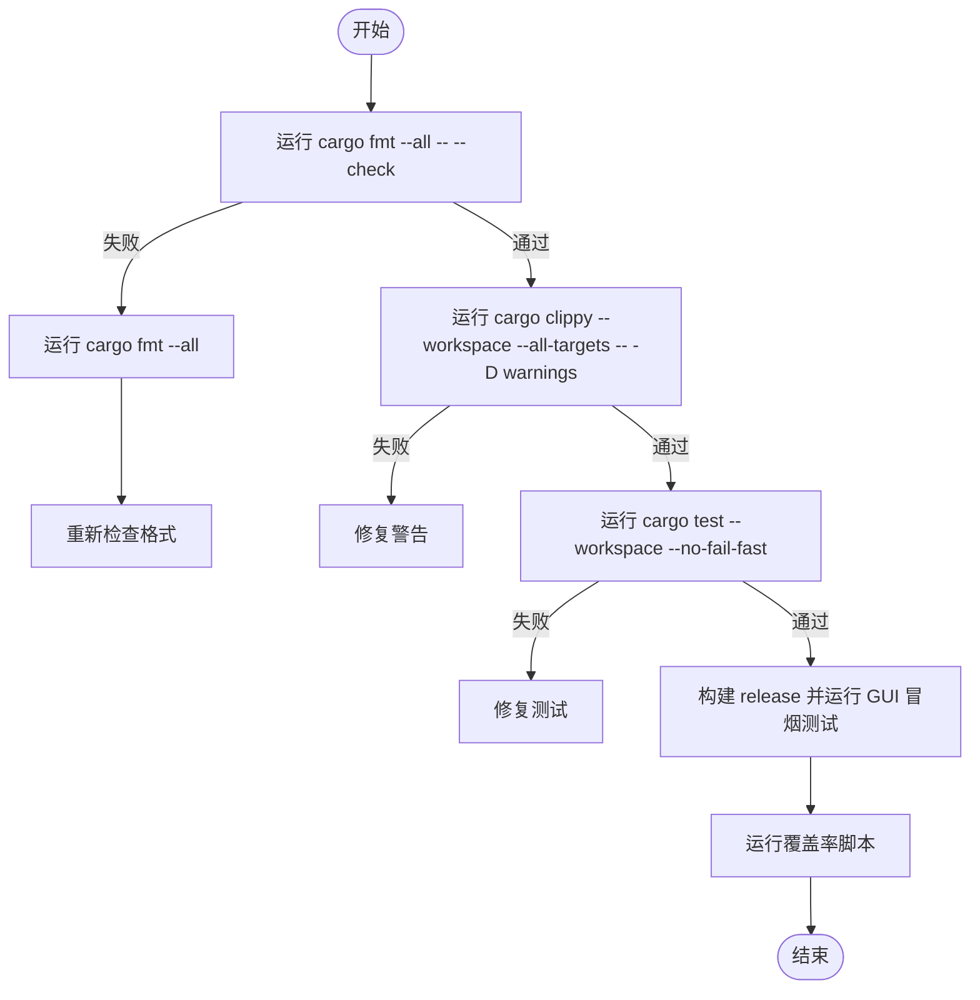
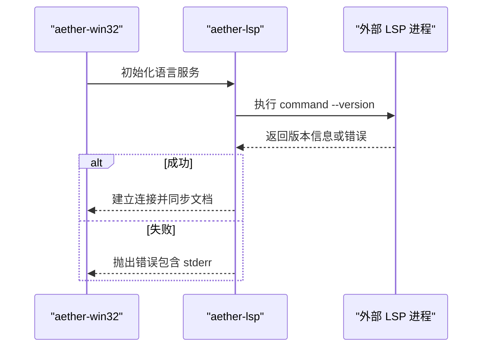
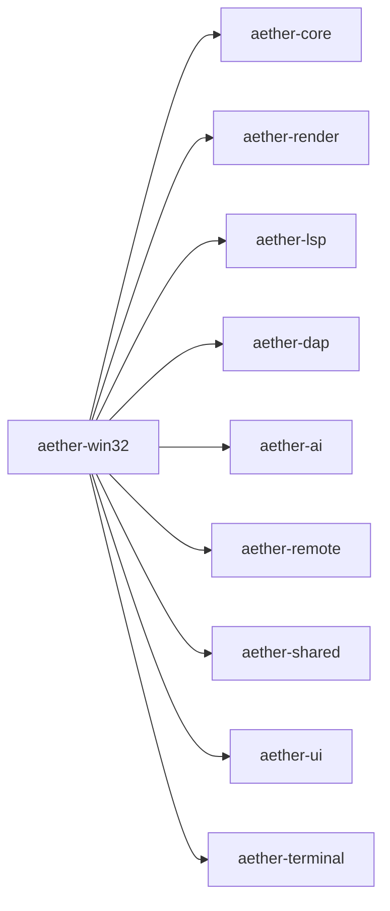

# 开发环境搭建

<cite>
**本文引用的文件**
- [Cargo.toml](file://Cargo.toml)
- [rust-toolchain.toml](file://rust-toolchain.toml)
- [.cargo/config.toml](file://.cargo/config.toml)
- [README.md](file://README.md)
- [CONTRIBUTING.md](file://CONTRIBUTING.md)
- [crates/aether-win32/Cargo.toml](file://crates/aether-win32/Cargo.toml)
- [crates/aether-core/Cargo.toml](file://crates/aether-core/Cargo.toml)
- [scripts/build-release.ps1](file://scripts/build-release.ps1)
- [tests/run_tests.ps1](file://tests/run_tests.ps1)
- [crates/aether-lsp/src/transport.rs](file://crates/aether-lsp/src/transport.rs)
- [crates/aether-lsp/src/client.rs](file://crates/aether-lsp/src/client.rs)
- [crates/aether-dap/src/client.rs](file://crates/aether-dap/src/client.rs)
- [crates/aether-remote/src/git.rs](file://crates/aether-remote/src/git.rs)
</cite>

## 目录
1. [简介](#简介)
2. [项目结构](#项目结构)
3. [核心组件](#核心组件)
4. [架构总览](#架构总览)
5. [详细组件分析](#详细组件分析)
6. [依赖关系分析](#依赖关系分析)
7. [性能与构建优化](#性能与构建优化)
8. [故障排查指南](#故障排查指南)
9. [结论](#结论)
10. [附录：常用命令速查](#附录：常用命令速查)

## 简介
本指南面向首次参与牧羊人编辑器（Aether Studio）开发的工程师，目标是帮助你在 Windows 平台上快速搭建完整的本地开发环境。内容涵盖工具链安装、IDE 配置建议、Workspace 与 Crate 依赖管理、日常开发与测试工作流、常见问题定位与解决。

本项目基于 Rust + Win32 API，目标平台为 x86_64-pc-windows-msvc，采用 Cargo Workspace 组织多个 crate，提供高性能文本编辑、自绘渲染、LSP/DAP 集成、AI 能力、远程开发、终端面板等特性。

**章节来源**
- [README.md:85-125](file://README.md#L85-L125)
- [README.md:258-319](file://README.md#L258-L319)

## 项目结构
仓库根目录包含 Cargo Workspace 定义、Rust 工具链锁定、.cargo 构建配置、脚本与测试框架等。核心业务分布在 crates 目录下，按职责拆分为多个 crate；GUI 入口在 aether-win32；CLI 工具在 aether-cli；渲染抽象在 aether-render；语言服务在 aether-lsp；调试适配在 aether-dap；远程能力在 aether-remote；AI 能力在 aether-ai；共享设置在 aether-shared；UI 组件在 aether-ui；终端在 aether-terminal；数据库在 aether-db；编辑器内核在 aether-core。

**图表来源**
- [Cargo.toml:1-19](file://Cargo.toml#L1-L19)
- [crates/aether-win32/Cargo.toml:14-23](file://crates/aether-win32/Cargo.toml#L14-L23)

**章节来源**
- [Cargo.toml:1-19](file://Cargo.toml#L1-L19)
- [crates/aether-win32/Cargo.toml:1-23](file://crates/aether-win32/Cargo.toml#L1-L23)

## 核心组件
- 工作区与工作单元
  - Workspace 成员列表定义了所有 crate，统一版本、Edition、作者、许可证与最低 Rust 版本。
  - 发布配置启用 fat LTO、单代码生成单元、优化等级 3、panic=abort、strip、关闭增量编译以减小体积并提升性能。
- 工具链与目标
  - rust-toolchain.toml 锁定 stable 工具链，并启用 rustfmt、clippy 组件，目标为 x86_64-pc-windows-msvc。
- 构建与链接
  - .cargo/config.toml 设置默认 target、CPU 指令集优化、C/C++ 运行时统一为 /MD，避免与 onnxruntime 预编译库冲突导致的链接错误。
  - 开发 profile 开启增量编译以提升迭代速度；发布 profile 与 workspace 一致。

**章节来源**
- [Cargo.toml:22-37](file://Cargo.toml#L22-L37)
- [rust-toolchain.toml:1-5](file://rust-toolchain.toml#L1-L5)
- [.cargo/config.toml:1-31](file://.cargo/config.toml#L1-L31)

## 架构总览
下图展示了 GUI 应用（aether-win32）如何组合核心能力：文本处理由 aether-core 提供，渲染通过 aether-render 抽象，语言服务通过 aether-lsp 与外部 LSP 进程通信，调试通过 aether-dap 与调试适配器交互，AI 能力通过 aether-ai 调用后端，远程能力通过 aether-remote 封装 SSH/Git/容器操作，UI 与终端分别由 aether-ui 和 aether-terminal 提供。

**图表来源**
- [crates/aether-win32/Cargo.toml:14-23](file://crates/aether-win32/Cargo.toml#L14-L23)
- [Cargo.toml:1-19](file://Cargo.toml#L1-L19)

## 详细组件分析

### Rust 工具链与目标平台
- 使用 rustup 安装稳定版工具链，自动读取 rust-toolchain.toml 中的 channel、components 与 targets。
- 确保已安装 MSVC 工具链（Visual Studio 2022 或 Windows SDK Build Tools），以便编译 x86_64-pc-windows-msvc 目标。
- 若网络较慢，可在用户级 ~/.cargo/config.toml 配置 crates.io 镜像源（项目级不再重复定义以避免冲突）。

**章节来源**
- [rust-toolchain.toml:1-5](file://rust-toolchain.toml#L1-L5)
- [README.md:85-93](file://README.md#L85-L93)
- [.cargo/config.toml:1-10](file://.cargo/config.toml#L1-L10)

### Visual Studio 2022 与 Windows SDK
- 安装 Visual Studio 2022 时勾选“使用 C++ 的桌面开发”工作负载，确保包含 MSVC 编译器、Windows SDK、CMake 等组件。
- 若仅需要构建工具，可安装“Windows SDK 构建工具”，但需保证 PATH 中包含必要的 cl.exe、link.exe 等。
- 验证方式：在命令行执行 cargo build 或 cargo check，若提示找不到 MSVC 工具链，则重新安装或修复 VS 安装。

**章节来源**
- [README.md:85-93](file://README.md#L85-L93)

### IDE 配置建议（VS Code / Visual Studio）
- VS Code
  - 安装 Rust 扩展（rust-analyzer）、C/C++ 扩展（用于查看第三方 C/C++ 依赖）、PowerShell 扩展（运行测试脚本）。
  - 设置 rustfmt 与 clippy 为保存时格式化与分析（可选）。
  - 配置任务以一键执行格式化、检查、测试。
- Visual Studio
  - 打开 Cargo Workspace 或使用 Rust 项目模板加载 aether-win32。
  - 设置启动参数为 aether-app，便于直接调试 GUI。
  - 配置断点与日志输出（tracing-subscriber 支持控制台/文件输出）。

**章节来源**
- [README.md:85-125](file://README.md#L85-L125)
- [CONTRIBUTING.md:99-109](file://CONTRIBUTING.md#L99-L109)

### Workspace 与 Crate 依赖管理
- 工作区成员在根 Cargo.toml 中声明，新增 crate 时需加入 members 列表。
- aether-win32 作为 GUI 二进制入口，依赖 core、render、ai、shared、remote、lsp、ai-panel、terminal、ui 等 crate。
- aether-core 依赖内存映射、字节扫描、并行计算、正则表达式、目录遍历等库，适合高性能文本处理。
- 建议在修改依赖时优先使用 workspace 版本约束，保持各 crate 版本一致。

**章节来源**
- [Cargo.toml:1-19](file://Cargo.toml#L1-L19)
- [crates/aether-win32/Cargo.toml:14-23](file://crates/aether-win32/Cargo.toml#L14-L23)
- [crates/aether-core/Cargo.toml:6-17](file://crates/aether-core/Cargo.toml#L6-L17)

### 构建与运行
- Debug 构建：cargo build -p aether-win32 --bin aether-app
- Release 构建：cargo build -p aether-win32 --bin aether-app --release
- CLI 工具：cargo build -p aether-cli --bin aether
- 直接运行 GUI：cargo run -p aether-win32 --bin aether-app
- 通过 CLI 打开文件或跳转行列：cargo run -p aether-cli --bin aether -- path/to/file 或 file.txt:10:5
- 一键构建脚本：scripts/build-release.ps1 支持 Release/Run 开关

**章节来源**
- [README.md:94-125](file://README.md#L94-L125)
- [scripts/build-release.ps1:1-42](file://scripts/build-release.ps1#L1-L42)

### 测试工作流
- 单元测试：cargo test --workspace --no-fail-fast（建议先设置 $env:CARGO_INCREMENTAL = '0' 避免 ICE）
- 静态分析：cargo clippy --workspace --all-targets -- -D warnings
- 格式检查：cargo fmt --all -- --check
- GUI 冒烟测试：先 release 构建 aether-win32，再运行 tests/gui_smoke.py（如存在）
- 覆盖率收集：tests/tools/coverage.ps1（需 llvm-tools-preview）
- 统一测试入口：tests/run_tests.ps1 支持 unit/gui/ai/coverage/all 套件

**图表来源**
- [README.md:127-146](file://README.md#L127-L146)
- [tests/run_tests.ps1:1-91](file://tests/run_tests.ps1#L1-L91)

**章节来源**
- [README.md:127-146](file://README.md#L127-L146)
- [tests/run_tests.ps1:1-91](file://tests/run_tests.ps1#L1-L91)
- [CONTRIBUTING.md:99-109](file://CONTRIBUTING.md#L99-L109)

### LSP 与 DAP 环境准备
- LSP 客户端默认服务器发现：
  - Rust：rust-analyzer
  - Python：pylsp
  - TypeScript/JavaScript：typescript-language-server（带 --stdio）
  - C/C++：clangd
- LSP 探测流程会执行命令 --version 并捕获 stderr，超时保护避免 rustup shim 解析耗时过长。
- DAP 客户端默认适配器发现：
  - Rust/C/C++：lldb-dap
  - Python：debugpy.adapter
  - JavaScript/TypeScript：node 与 node-debug2-adapter
- Git 可用性检测：通过系统 git 命令校验，缺失时引导用户安装 Git for Windows。

**图表来源**
- [crates/aether-lsp/src/client.rs:620-653](file://crates/aether-lsp/src/client.rs#L620-L653)
- [crates/aether-lsp/src/transport.rs:271-305](file://crates/aether-lsp/src/transport.rs#L271-L305)

**章节来源**
- [crates/aether-lsp/src/client.rs:620-653](file://crates/aether-lsp/src/client.rs#L620-L653)
- [crates/aether-lsp/src/transport.rs:271-305](file://crates/aether-lsp/src/transport.rs#L271-L305)
- [crates/aether-dap/src/client.rs:45-71](file://crates/aether-dap/src/client.rs#L45-L71)
- [crates/aether-remote/src/git.rs:12-25](file://crates/aether-remote/src/git.rs#L12-L25)

## 依赖关系分析
- aether-win32 是 GUI 二进制，聚合 core、render、ai、shared、remote、lsp、ai-panel、terminal、ui 等 crate。
- aether-core 提供底层文本处理能力，依赖内存映射、并行、正则、目录遍历等库。
- 其他 crate 围绕核心能力扩展：LSP/DAP 负责语言服务与调试，AI 负责大模型交互，Remote 负责远程操作，Terminal 提供终端面板，UI 提供界面组件，Shared 提供配置与持久化。

**图表来源**
- [crates/aether-win32/Cargo.toml:14-23](file://crates/aether-win32/Cargo.toml#L14-L23)
- [Cargo.toml:1-19](file://Cargo.toml#L1-L19)

**章节来源**
- [crates/aether-win32/Cargo.toml:14-23](file://crates/aether-win32/Cargo.toml#L14-L23)
- [Cargo.toml:1-19](file://Cargo.toml#L1-L19)

## 性能与构建优化
- 发布构建启用 fat LTO、单代码生成单元、opt-level 3、panic=abort、strip，显著减小体积并提升性能。
- 开发构建开启增量编译，缩短迭代时间。
- CPU 指令集优化：target-cpu=sandybridge，适用于较新 CPU 以获得更好性能。
- C/C++ 依赖统一使用 /MD 运行时，避免与 onnxruntime 预编译库及 Rust 运行时冲突导致的链接错误。

**章节来源**
- [Cargo.toml:29-37](file://Cargo.toml#L29-L37)
- [.cargo/config.toml:8-17](file://.cargo/config.toml#L8-L17)
- [.cargo/config.toml:19-31](file://.cargo/config.toml#L19-L31)

## 故障排查指南
- 构建失败：确认已安装 Visual Studio 2022 或 Windows SDK 构建工具，且目标平台为 x86_64-pc-windows-msvc。
- 链接错误（LNK2038 RuntimeLibrary 不匹配）：确保 C/C++ 依赖使用 /MD 运行时，已在 .cargo/config.toml 中统一设置。
- LSP 服务无法启动：检查 PATH 中是否存在对应 LSP 二进制（如 rust-analyzer、pylsp、typescript-language-server、clangd），并确认 rustup 工具链包含所需组件。
- LSP 探测超时：由于 rustup shim 解析工具链清单可能耗时较长，已设置 30 秒超时；若仍失败，请检查网络连接与代理设置。
- Git 不可用：通过 git_available 检测系统 git，缺失时引导安装 Git for Windows。
- 测试失败：先运行 cargo fmt --all 与 cargo clippy，再执行 cargo test --workspace --no-fail-fast，定位具体失败用例。

**章节来源**
- [.cargo/config.toml:12-17](file://.cargo/config.toml#L12-L17)
- [crates/aether-lsp/src/transport.rs:271-305](file://crates/aether-lsp/src/transport.rs#L271-L305)
- [crates/aether-remote/src/git.rs:12-25](file://crates/aether-remote/src/git.rs#L12-L25)
- [CONTRIBUTING.md:164-190](file://CONTRIBUTING.md#L164-L190)

## 结论
通过以上步骤，你可以在 Windows 上完成牧羊人编辑器的完整开发环境搭建。建议使用 VS Code 或 Visual Studio 进行日常开发，遵循提交前检查清单，确保代码质量与一致性。遇到问题时，优先检查工具链、依赖与环境变量，并结合测试与日志进行定位。

## 附录：常用命令速查
- 构建 GUI：cargo build -p aether-win32 --bin aether-app
- 构建 CLI：cargo build -p aether-cli --bin aether
- 运行 GUI：cargo run -p aether-win32 --bin aether-app
- 格式化检查：cargo fmt --all -- --check
- 静态分析：cargo clippy --workspace --all-targets -- -D warnings
- 单元测试：cargo test --workspace --no-fail-fast
- 一键构建脚本：powershell -File scripts/build-release.ps1
- 统一测试入口：pwsh -File tests/run_tests.ps1

**章节来源**
- [README.md:94-146](file://README.md#L94-L146)
- [scripts/build-release.ps1:1-42](file://scripts/build-release.ps1#L1-L42)
- [tests/run_tests.ps1:1-91](file://tests/run_tests.ps1#L1-L91)