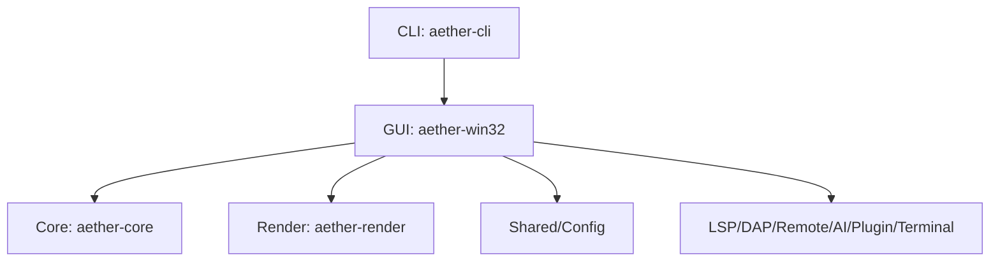
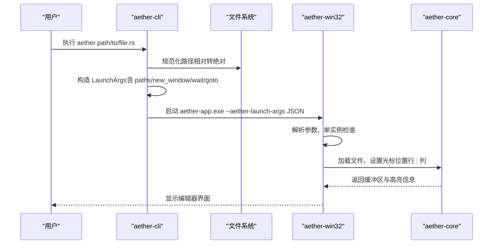
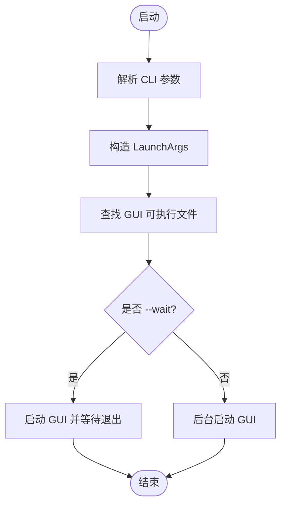
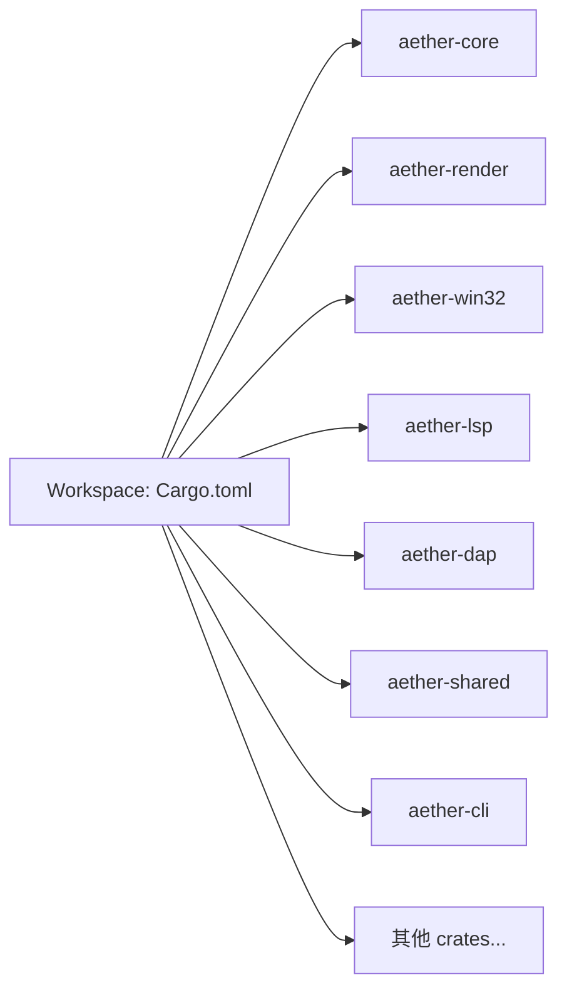

# 快速开始

<cite>
**本文引用的文件**
- [README.md](file://README.md)
- [Cargo.toml](file://Cargo.toml)
- [rust-toolchain.toml](file://rust-toolchain.toml)
- [.cargo/config.toml](file://.cargo/config.toml)
- [scripts/build-release.ps1](file://scripts/build-release.ps1)
- [crates/aether-win32/src/main.rs](file://crates/aether-win32/src/main.rs)
- [crates/aether-cli/src/main.rs](file://crates/aether-cli/src/main.rs)
</cite>

## 目录
1. [简介](#简介)
2. [项目结构](#项目结构)
3. [核心组件](#核心组件)
4. [架构总览](#架构总览)
5. [详细组件分析](#详细组件分析)
6. [依赖分析](#依赖分析)
7. [性能注意事项](#性能注意事项)
8. [故障排除指南](#故障排除指南)
9. [结论](#结论)
10. [附录：命令速查](#附录命令速查)

## 简介
本指南面向首次接触牧羊人编辑器（Aether Studio）的新用户，目标是帮助你在最短时间内完成环境搭建、构建与运行，并掌握通过命令行打开文件和定位行列的基本开发流程。本项目为 Windows 原生 Rust 应用，使用 Cargo Workspace 组织多个 crate，提供 GUI 主程序与 CLI 启动器。

## 项目结构
仓库采用 Cargo Workspace 管理多 crate，关键入口如下：
- GUI 主程序：aether-win32（Windows 原生 UI、消息循环、窗口与事件处理）
- CLI 启动器：aether-cli（解析参数、启动 GUI、支持 --wait / --new-window / --goto）
- 核心库：aether-core（文本缓冲、历史栈、词法分析、工作区数据结构、搜索）
- 渲染抽象：aether-render（Direct2D/DirectWrite 抽象、主题、画笔缓存）
- 其他能力：LSP、DAP、远程、AI、插件、终端等

图表来源
- [crates/aether-cli/src/main.rs:1-394](file://crates/aether-cli/src/main.rs#L1-L394)
- [crates/aether-win32/src/main.rs:1-52](file://crates/aether-win32/src/main.rs#L1-L52)
- [Cargo.toml:1-37](file://Cargo.toml#L1-L37)

章节来源
- [README.md:85-125](file://README.md#L85-L125)
- [Cargo.toml:1-37](file://Cargo.toml#L1-L37)

## 核心组件
- GUI 主程序（aether-win32）
  - 负责单实例控制、窗口创建、消息循环与应用初始化
  - 从环境变量读取启动参数，若已有实例则转发参数并退出或等待
- CLI 启动器（aether-cli）
  - 解析路径、--new-window、--wait、--goto 等参数
  - 将参数序列化为 JSON 并通过命令行传递给 GUI
  - 自动查找同目录下的 GUI 可执行文件并启动
- 共享配置与持久化（aether-shared）
  - 定义 LaunchArgs、GotoPosition 等跨进程通信的数据结构
  - 提供 goto 字符串解析（如 file.txt:10:5）

章节来源
- [crates/aether-win32/src/main.rs:1-52](file://crates/aether-win32/src/main.rs#L1-L52)
- [crates/aether-cli/src/main.rs:1-394](file://crates/aether-cli/src/main.rs#L1-L394)

## 架构总览
下图展示了从 CLI 到 GUI 的调用链路与数据流转：

图表来源
- [crates/aether-cli/src/main.rs:36-79](file://crates/aether-cli/src/main.rs#L36-L79)
- [crates/aether-cli/src/main.rs:91-133](file://crates/aether-cli/src/main.rs#L91-L133)
- [crates/aether-win32/src/main.rs:8-26](file://crates/aether-win32/src/main.rs#L8-L26)

## 详细组件分析

### 环境要求与安装
- 系统要求
  - Windows 10 1809 或更高版本（推荐 Windows 11）
- 工具链
  - Rust stable 工具链（由 rust-toolchain.toml 指定）
  - Visual Studio 2022（或 Windows SDK 构建工具）
  - 目标平台：x86_64-pc-windows-msvc
- 构建配置
  - 默认目标与编译标志在 .cargo/config.toml 中设置
  - 发布构建启用 fat LTO、单代码生成单元、strip 等优化

章节来源
- [README.md:85-93](file://README.md#L85-L93)
- [rust-toolchain.toml:1-5](file://rust-toolchain.toml#L1-L5)
- [.cargo/config.toml:8-10](file://.cargo/config.toml#L8-L10)
- [Cargo.toml:29-36](file://Cargo.toml#L29-L36)

### 构建步骤
- 调试构建
  - cargo build -p aether-win32 --bin aether-app
- 发布构建
  - cargo build -p aether-win32 --bin aether-app --release
- 构建 CLI
  - cargo build -p aether-cli --bin aether
- 一键脚本（可选）
  - powershell scripts/build-release.ps1 -Release
  - 输出产物位于 target\x86_64-pc-windows-msvc\debug 或 release

章节来源
- [README.md:94-105](file://README.md#L94-L105)
- [scripts/build-release.ps1:16-37](file://scripts/build-release.ps1#L16-L37)

### 运行示例
- 直接启动 GUI
  - cargo run -p aether-win32 --bin aether-app
- 通过 CLI 打开文件
  - cargo run -p aether-cli --bin aether -- path/to/file.rs
- 定位到指定行列
  - cargo run -p aether-cli --bin aether -- file.txt:10:5
- 强制新窗口与等待模式
  - --new-window：强制打开新窗口
  - --wait：等待 GUI 关闭后再返回

章节来源
- [README.md:107-118](file://README.md#L107-L118)
- [crates/aether-cli/src/main.rs:10-27](file://crates/aether-cli/src/main.rs#L10-L27)

### 启动流程与单实例机制
- CLI 侧
  - 解析参数，规范化路径，构造 LaunchArgs
  - 序列化参数为 JSON，通过命令行参数传递给 GUI
  - 根据 --wait 决定是否阻塞等待 GUI 退出
- GUI 侧
  - 从环境变量读取 LaunchArgs
  - 单实例控制：若已有实例，则将参数转发给已有窗口并退出当前进程；否则继续初始化主窗口
  - 若使用 --wait，会轮询等待目标窗口关闭

图表来源
- [crates/aether-cli/src/main.rs:36-79](file://crates/aether-cli/src/main.rs#L36-L79)
- [crates/aether-cli/src/main.rs:91-133](file://crates/aether-cli/src/main.rs#L91-L133)
- [crates/aether-win32/src/main.rs:8-26](file://crates/aether-win32/src/main.rs#L8-L26)

章节来源
- [crates/aether-cli/src/main.rs:36-79](file://crates/aether-cli/src/main.rs#L36-L79)
- [crates/aether-win32/src/main.rs:8-26](file://crates/aether-win32/src/main.rs#L8-L26)

### 常见问题与预期输出
- 找不到 GUI 主程序
  - 现象：CLI 报错提示找不到 aether-app.exe
  - 原因：CLI 与 GUI 未处于同一目录
  - 解决：确保 aether.exe 与 aether-app.exe 在同一目录
- 无法启动 GUI
  - 现象：CLI 报“无法启动 GUI 主程序”
  - 原因：权限不足或路径错误
  - 解决：以管理员权限运行或检查路径
- 增量编译导致 ICE
  - 现象：测试或构建异常
  - 解决：临时禁用增量编译 $env:CARGO_INCREMENTAL = '0'
- 链接期运行时库冲突
  - 现象：LNK2038 RuntimeLibrary 不匹配
  - 原因：C/C++ 依赖默认静态 CRT 与 onnxruntime 预编译库冲突
  - 解决：使用项目级 .cargo/config.toml 中的 CFLAGS/CXXFLAGS 统一为 /MD

章节来源
- [crates/aether-cli/src/main.rs:107-133](file://crates/aether-cli/src/main.rs#L107-L133)
- [README.md:127-146](file://README.md#L127-L146)
- [.cargo/config.toml:12-17](file://.cargo/config.toml#L12-L17)

## 依赖分析
- 工作区成员
  - 包含 core、render、win32、cli、shared、lsp、dap、remote、ai、plugin、terminal、ui 等 crate
- 构建目标与工具链
  - 固定 x86_64-pc-windows-msvc
  - 启用 rustfmt、clippy
- 发布优化
  - fat LTO、单代码生成单元、opt-level 3、panic=abort、strip=true

图表来源
- [Cargo.toml:1-19](file://Cargo.toml#L1-L19)
- [Cargo.toml:29-36](file://Cargo.toml#L29-L36)
- [rust-toolchain.toml:1-5](file://rust-toolchain.toml#L1-L5)

章节来源
- [Cargo.toml:1-37](file://Cargo.toml#L1-L37)
- [rust-toolchain.toml:1-5](file://rust-toolchain.toml#L1-L5)

## 性能注意事项
- 发布构建已启用 fat LTO、单代码生成单元与 strip，适合分发与最终性能
- 调试构建开启增量编译，提升迭代速度
- 文本编辑与渲染涉及高性能模块（Piece Table、Direct2D/DirectWrite），建议优先使用发布构建进行性能评估

章节来源
- [Cargo.toml:29-36](file://Cargo.toml#L29-L36)
- [.cargo/config.toml:19-30](file://.cargo/config.toml#L19-L30)

## 故障排除指南
- 网络与下载超时
  - 可通过 .cargo/config.toml 调整 HTTP 超时与低速限制
- 构建失败
  - 确认已安装 Visual Studio 2022 及所需组件
  - 确认目标平台与工具链一致
- 运行时问题
  - 查看日志与崩溃钩子记录（GUI 内置 panic hook 与日志系统）
  - 使用 --wait 模式便于捕获 CLI 与 GUI 交互过程

章节来源
- [.cargo/config.toml:1-7](file://.cargo/config.toml#L1-L7)
- [crates/aether-win32/src/logging.rs:71-108](file://crates/aether-win32/src/logging.rs#L71-L108)

## 结论
通过以上步骤，你可以在 Windows 环境下快速搭建牧羊人编辑器的开发环境并完成构建与运行。借助 CLI 可以便捷地打开文件与定位行列，配合 GUI 的单实例机制与等待模式，满足日常开发与调试需求。遇到问题时，可参考故障排除部分逐步排查。

## 附录：命令速查
- 调试构建
  - cargo build -p aether-win32 --bin aether-app
- 发布构建
  - cargo build -p aether-win32 --bin aether-app --release
- 构建 CLI
  - cargo build -p aether-cli --bin aether
- 运行 GUI
  - cargo run -p aether-win32 --bin aether-app
- 通过 CLI 打开文件
  - cargo run -p aether-cli --bin aether -- path/to/file.rs
- 定位行列
  - cargo run -p aether-cli --bin aether -- file.txt:10:5
- 强制新窗口
  - cargo run -p aether-cli --bin aether -- path/to/file.rs --new-window
- 等待 GUI 关闭后返回
  - cargo run -p aether-cli --bin aether -- path/to/file.rs --wait

章节来源
- [README.md:94-118](file://README.md#L94-L118)
- [scripts/build-release.ps1:16-37](file://scripts/build-release.ps1#L16-L37)