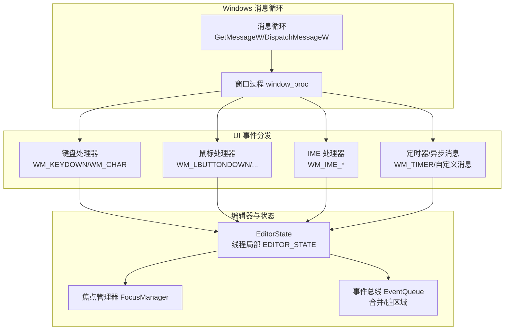
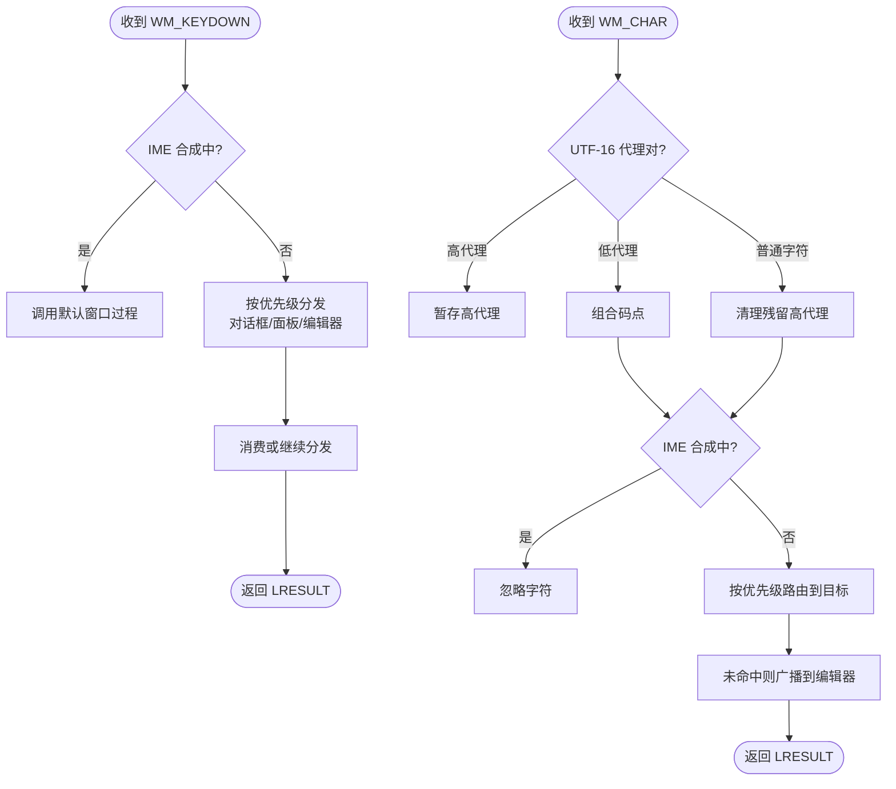
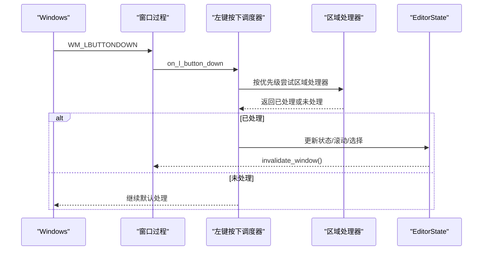
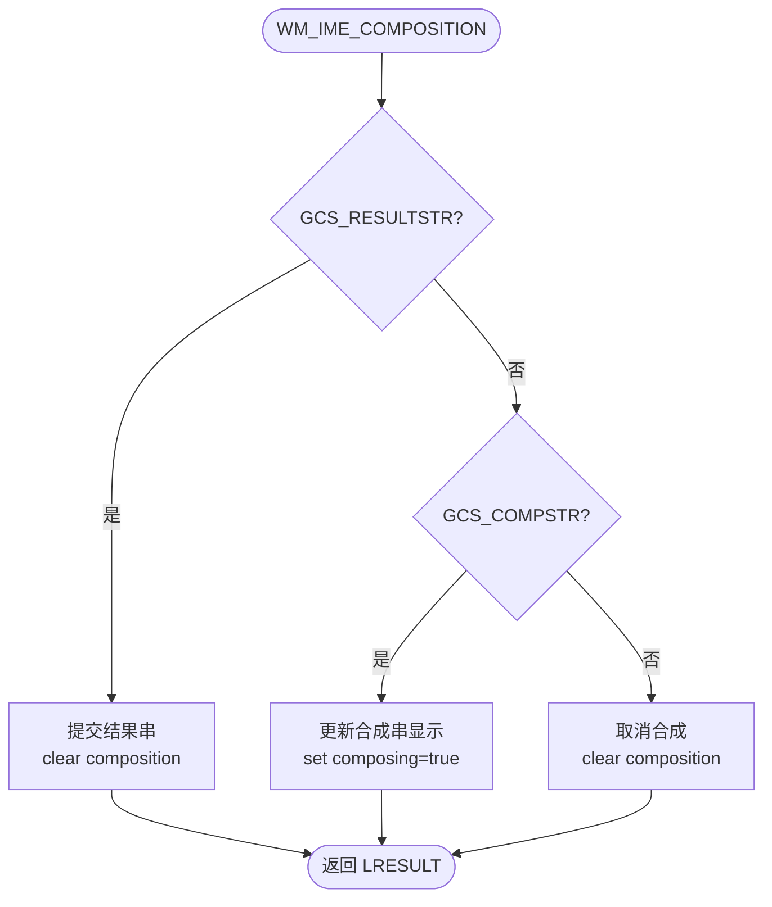
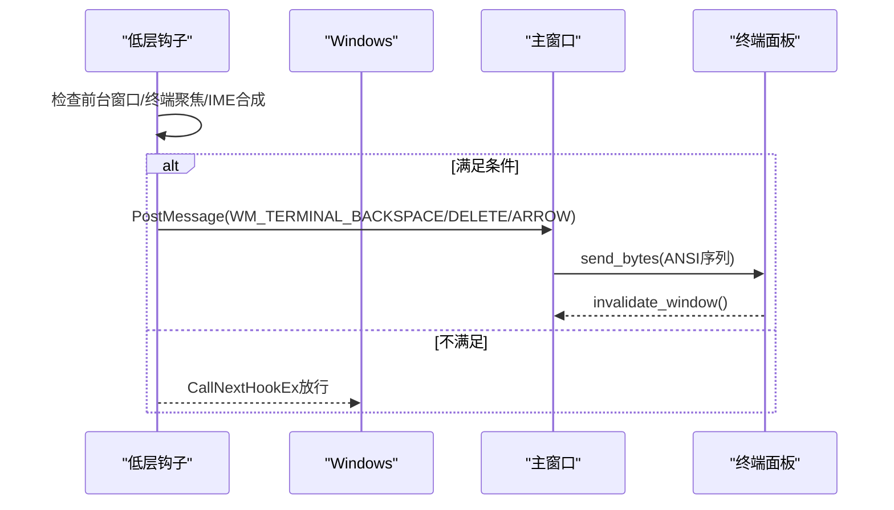
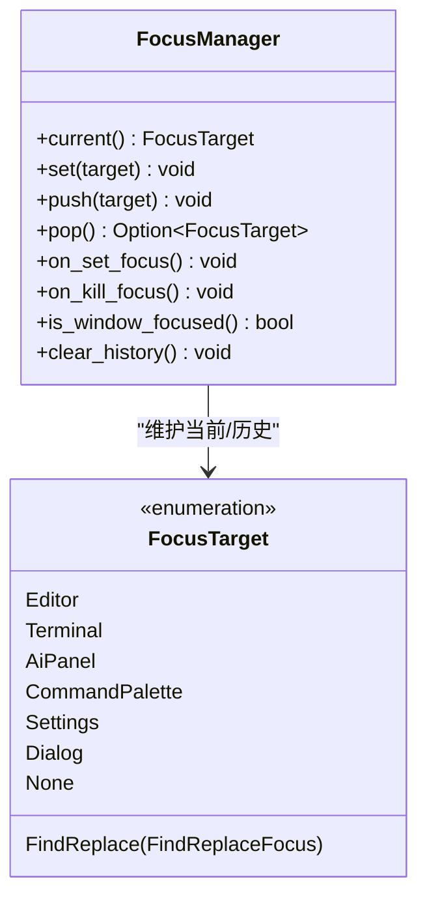
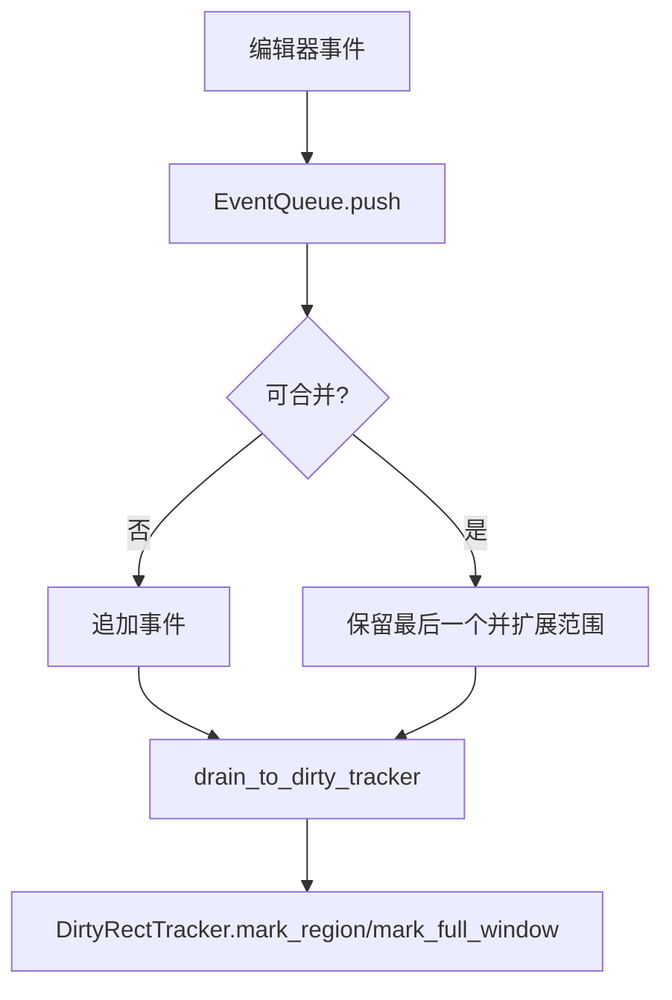
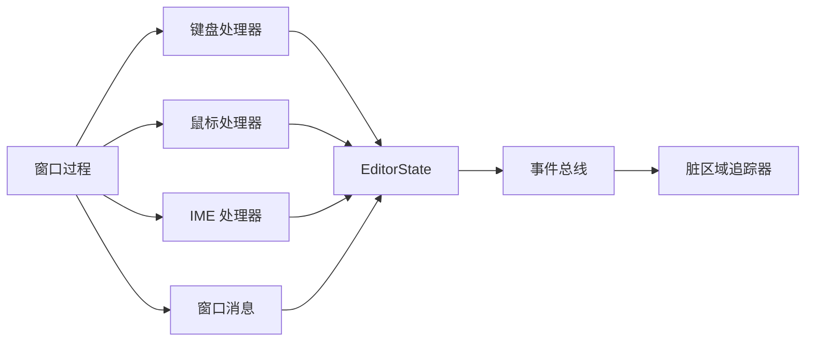

# UI 事件流处理

<cite>
**本文引用的文件**
- [window.rs](file://crates/aether-win32/src/window.rs)
- [keyboard_handler.rs](file://crates/aether-win32/src/window/keyboard_handler.rs)
- [char_input.rs](file://crates/aether-win32/src/window/keyboard_handler/char_input.rs)
- [key_down.rs](file://crates/aether-win32/src/window/keyboard_handler/key_down.rs)
- [mouse_handler.rs](file://crates/aether-win32/src/window/mouse_handler.rs)
- [l_button_down.rs](file://crates/aether-win32/src/window/mouse_handler/l_button_down.rs)
- [ime_handler.rs](file://crates/aether-win32/src/window/ime_handler.rs)
- [window_messages.rs](file://crates/aether-win32/src/window/window_messages.rs)
- [keyboard_hook.rs](file://crates/aether-win32/src/keyboard_hook.rs)
- [focus_manager.rs](file://crates/aether-win32/src/focus_manager.rs)
- [events.rs](file://crates/aether-editor/src/events.rs)
</cite>

## 目录
1. [简介](#简介)
2. [项目结构](#项目结构)
3. [核心组件](#核心组件)
4. [架构总览](#架构总览)
5. [详细组件分析](#详细组件分析)
6. [依赖关系分析](#依赖关系分析)
7. [性能考量](#性能考量)
8. [故障排查指南](#故障排查指南)
9. [结论](#结论)
10. [附录](#附录)

## 简介
本文件面向牧羊人编辑器的 UI 层，系统性说明用户输入（键盘、鼠标、触摸）如何被 Windows 消息循环捕获、路由到 Rust 事件系统，并最终分发到编辑器各组件。文档覆盖：
- 消息路由与事件冒泡策略
- 阻止默认行为与 IME 合成期处理
- 焦点管理与多窗口协调
- 时序图与错误处理策略
- 渲染与重绘的解耦机制

## 项目结构
UI 事件流围绕 aether-win32 窗体模块展开，按职责拆分为键盘、鼠标、IME、通用窗口消息等子模块；aether-editor 提供编辑器事件总线用于批量合并与脏区域标记；全局状态通过线程局部变量在消息处理中同步当前活跃窗口。



**图表来源**
- [window.rs:132-200](file://crates/aether-win32/src/window.rs#L132-L200)
- [keyboard_handler.rs:1-13](file://crates/aether-win32/src/window/keyboard_handler.rs#L1-L13)
- [mouse_handler.rs:1-16](file://crates/aether-win32/src/window/mouse_handler.rs#L1-L16)
- [ime_handler.rs:1-18](file://crates/aether-win32/src/window/ime_handler.rs#L1-L18)
- [window_messages.rs:21-60](file://crates/aether-win32/src/window/window_messages.rs#L21-L60)
- [events.rs:66-186](file://crates/aether-editor/src/events.rs#L66-L186)

**章节来源**
- [window.rs:132-200](file://crates/aether-win32/src/window.rs#L132-L200)
- [keyboard_handler.rs:1-13](file://crates/aether-win32/src/window/keyboard_handler.rs#L1-L13)
- [mouse_handler.rs:1-16](file://crates/aether-win32/src/window/mouse_handler.rs#L1-L16)
- [ime_handler.rs:1-18](file://crates/aether-win32/src/window/ime_handler.rs#L1-L18)
- [window_messages.rs:21-60](file://crates/aether-win32/src/window/window_messages.rs#L21-L60)
- [events.rs:66-186](file://crates/aether-editor/src/events.rs#L66-L186)

## 核心组件
- 窗口与消息循环：负责创建窗口、注册类、运行消息循环，并通过 invalidate_window 触发 WM_PAINT 统一渲染。
- 键盘处理器：拆分 WM_KEYDOWN 与 WM_CHAR 的高优先级调度器，将输入路由到对话框、面板或编辑器。
- 鼠标处理器：按区域优先级分发左键按下、移动、滚轮等事件，支持拖拽、标签栏滚动、侧边栏/终端/AI 面板滚动。
- IME 处理器：处理合成开始/结束/字符，避免重复插入，并在合成期让 IME 接管退格/方向键。
- 低层键盘钩子：在系统级拦截 Backspace/Delete/方向键直达终端，解决 IME 吞键问题。
- 焦点管理器：维护当前焦点目标与历史栈，支持窗口失焦/恢复时的焦点回退。
- 事件总线：收集一帧内的事件并合并同类项，映射到脏区域类型，驱动增量重绘。

**章节来源**
- [window.rs:84-128](file://crates/aether-win32/src/window.rs#L84-L128)
- [keyboard_handler.rs:1-13](file://crates/aether-win32/src/window/keyboard_handler.rs#L1-L13)
- [mouse_handler.rs:1-16](file://crates/aether-win32/src/window/mouse_handler.rs#L1-L16)
- [ime_handler.rs:1-18](file://crates/aether-win32/src/window/ime_handler.rs#L1-L18)
- [keyboard_hook.rs:1-25](file://crates/aether-win32/src/keyboard_hook.rs#L1-L25)
- [focus_manager.rs:1-52](file://crates/aether-win32/src/focus_manager.rs#L1-L52)
- [events.rs:9-64](file://crates/aether-editor/src/events.rs#L9-L64)

## 架构总览
下图展示从 Windows 消息到编辑器组件的完整路径，包括 IME 合成期的特殊分支与低层钩子的旁路注入。

```mermaid
sequenceDiagram
participant OS as "Windows"
participant Loop as "消息循环"
participant Proc as "窗口过程"
participant KBD as "键盘处理器"
participant CH as "字符分发"
participant MOUSE as "鼠标处理器"
participant IME as "IME 处理器"
participant HOOK as "低层键盘钩子"
participant ST as "EditorState"
participant BUS as "事件总线"
OS->>Loop : 投递 WM_*
Loop->>Proc : DispatchMessageW
alt 键盘按键
Proc->>KBD : on_key_down
KBD->>KBD : 检查 IME 合成期
alt IME 合成中
KBD-->>OS : 交给默认窗口过程
else 非合成期
KBD->>CH : 分发到面板/编辑器
CH->>ST : 更新状态
ST->>BUS : 推入事件(合并/脏区)
ST-->>Proc : invalidate_window()
end
else 鼠标事件
Proc->>MOUSE : on_l_button_down/on_mouse_wheel
MOUSE->>ST : 更新布局/滚动/选择
ST->>BUS : 推入事件
ST-->>Proc : invalidate_window()
else IME 消息
Proc->>IME : WM_IME_STARTCOMPOSITION/COMPOSITION/ENDCOMPOSITION
IME->>ST : 设置/清除合成串
ST-->>Proc : invalidate_window()
end
Note over HOOK,ST : 低层钩子在 IME 前拦截 Backspace/Delete/方向键直达终端
```

**图表来源**
- [window.rs:132-200](file://crates/aether-win32/src/window.rs#L132-L200)
- [key_down.rs:17-182](file://crates/aether-win32/src/window/keyboard_handler/key_down.rs#L17-L182)
- [char_input.rs:10-104](file://crates/aether-win32/src/window/keyboard_handler/char_input.rs#L10-L104)
- [mouse_handler.rs:17-16](file://crates/aether-win32/src/window/mouse_handler.rs#L17-L16)
- [ime_handler.rs:9-93](file://crates/aether-win32/src/window/ime_handler.rs#L9-L93)
- [keyboard_hook.rs:151-245](file://crates/aether-win32/src/keyboard_hook.rs#L151-L245)
- [events.rs:66-186](file://crates/aether-editor/src/events.rs#L66-L186)

## 详细组件分析

### 键盘事件流（WM_KEYDOWN / WM_CHAR）
- WM_KEYDOWN：提取 vk、ctrl、shift，优先处理 IME 合成期（交由默认窗口过程），再按优先级分发到搜索面板、欢迎页、补全弹窗、设置字段、SSH/克隆对话框、命令面板等，最后进入编辑器编辑分发。
- WM_CHAR：处理 UTF-16 代理对，过滤 IME 合成期字符，按优先级分发到浏览器地址栏、空搜索框、文件树输入、设置字段、沙盒字段、搜索面板、SSH/克隆对话框、命令面板、查找替换、终端、历史浮窗、AI 面板，最终广播到编辑器（Markdown 预览模式忽略）。



**图表来源**
- [key_down.rs:17-182](file://crates/aether-win32/src/window/keyboard_handler/key_down.rs#L17-L182)
- [char_input.rs:10-104](file://crates/aether-win32/src/window/keyboard_handler/char_input.rs#L10-L104)

**章节来源**
- [key_down.rs:17-182](file://crates/aether-win32/src/window/keyboard_handler/key_down.rs#L17-L182)
- [char_input.rs:10-104](file://crates/aether-win32/src/window/keyboard_handler/char_input.rs#L10-L104)

### 鼠标事件流（WM_LBUTTONDOWN / 滚轮 / 移动）
- 左键按下：坐标转换、退出自定义模式、按区域优先级分发到对话框、标题栏、用户菜单、上下文菜单、活动栏、面板调整、侧边栏、右侧面板、标签栏、查找面板、底部面板、设置页、沙盒页、欢迎页/编辑器。
- 滚轮：根据光标位置判断目标区域（图片缩放、标签栏横向滚动、Shift+滚轮横向滚动、底部终端、历史浮窗、右侧 AI 面板、设置页、沙盒页、侧边栏/主编辑器），执行对应滚动逻辑并标记脏区域。
- 移动：计算光标样式，支持悬停提示与拖拽。



**图表来源**
- [l_button_down.rs:17-112](file://crates/aether-win32/src/window/mouse_handler/l_button_down.rs#L17-L112)
- [mouse_handler.rs:190-406](file://crates/aether-win32/src/window/mouse_handler.rs#L190-L406)

**章节来源**
- [l_button_down.rs:17-112](file://crates/aether-win32/src/window/mouse_handler/l_button_down.rs#L17-L112)
- [mouse_handler.rs:190-406](file://crates/aether-win32/src/window/mouse_handler.rs#L190-L406)

### IME 输入法支持
- 合成开始：仅初始化位置，不消费消息。
- 合成进行中：优先处理结果串（提交文本），清空合成串并插入；否则更新显示合成串，通知低层钩子进入合成期。
- 合成结束：清除合成串显示，若终端聚焦则关闭 IME，通知低层钩子退出合成期。
- 阻止 WM_IME_CHAR 产生 WM_CHAR，避免重复插入。



**图表来源**
- [ime_handler.rs:21-93](file://crates/aether-win32/src/window/ime_handler.rs#L21-L93)

**章节来源**
- [ime_handler.rs:21-93](file://crates/aether-win32/src/window/ime_handler.rs#L21-L93)

### 低层键盘钩子与终端直通
- 安装全局 WH_KEYBOARD_LL，在前台窗口为本应用且终端聚焦且非 IME 合成期时，拦截 Backspace/Delete/方向键，PostMessage 到主窗口，再由主线程发送字节序列到 ConPTY。
- 通过原子标志位在主线程与钩子线程间共享终端聚焦与 IME 合成状态。



**图表来源**
- [keyboard_hook.rs:151-245](file://crates/aether-win32/src/keyboard_hook.rs#L151-L245)
- [keyboard_hook.rs:256-315](file://crates/aether-win32/src/keyboard_hook.rs#L256-L315)

**章节来源**
- [keyboard_hook.rs:151-245](file://crates/aether-win32/src/keyboard_hook.rs#L151-L245)
- [keyboard_hook.rs:256-315](file://crates/aether-win32/src/keyboard_hook.rs#L256-L315)

### 焦点管理
- 维护当前焦点目标（编辑器、终端、AI 面板、查找替换、命令面板、设置、对话框、无焦点）。
- 支持 push/pop 焦点历史栈，窗口失焦时 current() 返回 None，恢复时还原。
- 与键盘/鼠标处理联动：例如点击编辑器内容区时先关闭终端聚焦，切换 IME bypass。



**图表来源**
- [focus_manager.rs:18-116](file://crates/aether-win32/src/focus_manager.rs#L18-L116)

**章节来源**
- [focus_manager.rs:18-116](file://crates/aether-win32/src/focus_manager.rs#L18-L116)

### 多窗口事件协调
- 使用 thread_local EDITOR_STATE 保存当前活跃窗口状态，get_and_set_state 在消息处理开始时同步为当前窗口状态，避免 Alt+Tab 后键盘路由到错误窗口。
- 全局窗口计数防止单窗口关闭导致应用退出。

**章节来源**
- [window.rs:75-128](file://crates/aether-win32/src/window.rs#L75-L128)

### 事件总线与脏区域
- EditorEvent 定义文本变化、光标移动、选择变化、滚动、标签页、侧边栏、右侧面板、底部面板、状态栏、窗口尺寸、查找替换、对话框可见性等事件。
- EventQueue 在一帧内合并同类事件（如连续滚动、光标移动、选择变化、文本变化行范围合并），并映射到 DirtyRegionType，驱动增量重绘。



**图表来源**
- [events.rs:9-64](file://crates/aether-editor/src/events.rs#L9-L64)
- [events.rs:66-186](file://crates/aether-editor/src/events.rs#L66-L186)

**章节来源**
- [events.rs:9-64](file://crates/aether-editor/src/events.rs#L9-L64)
- [events.rs:66-186](file://crates/aether-editor/src/events.rs#L66-L186)

## 依赖关系分析
- 窗口过程依赖键盘/鼠标/IME/窗口消息子模块进行分发。
- 键盘/鼠标处理器依赖 EditorState 更新状态并触发重绘。
- IME 处理器与低层键盘钩子通过原子标志协同，确保合成期按键由 IME 处理，非合成期终端按键直通。
- 事件总线与脏区域追踪器解耦模型与渲染，减少重复绘制。



**图表来源**
- [window.rs:13-30](file://crates/aether-win32/src/window.rs#L13-L30)
- [keyboard_handler.rs:1-13](file://crates/aether-win32/src/window/keyboard_handler.rs#L1-L13)
- [mouse_handler.rs:1-16](file://crates/aether-win32/src/window/mouse_handler.rs#L1-L16)
- [ime_handler.rs:1-18](file://crates/aether-win32/src/window/ime_handler.rs#L1-L18)
- [window_messages.rs:21-60](file://crates/aether-win32/src/window/window_messages.rs#L21-L60)
- [events.rs:66-186](file://crates/aether-editor/src/events.rs#L66-L186)

**章节来源**
- [window.rs:13-30](file://crates/aether-win32/src/window.rs#L13-L30)
- [keyboard_handler.rs:1-13](file://crates/aether-win32/src/window/keyboard_handler.rs#L1-L13)
- [mouse_handler.rs:1-16](file://crates/aether-win32/src/window/mouse_handler.rs#L1-L16)
- [ime_handler.rs:1-18](file://crates/aether-win32/src/window/ime_handler.rs#L1-L18)
- [window_messages.rs:21-60](file://crates/aether-win32/src/window/window_messages.rs#L21-L60)
- [events.rs:66-186](file://crates/aether-editor/src/events.rs#L66-L186)

## 性能考量
- 统一渲染：事件处理只修改状态并调用 invalidate_window，由 WM_PAINT 合并重绘，避免双重渲染。
- 事件合并：EventQueue 合并连续滚动、光标移动、选择变化与文本变化行范围，降低渲染压力。
- 局部脏区：滚动与输入仅标记相关区域（标签栏、底部面板、侧边栏、编辑器内容等），提升流畅度。
- 定时器优化：终端刷新、AI 后台刷新、悬停提示、光标闪烁等使用独立定时器，避免阻塞渲染路径。

**章节来源**
- [window.rs:84-93](file://crates/aether-win32/src/window.rs#L84-L93)
- [events.rs:66-186](file://crates/aether-editor/src/events.rs#L66-L186)
- [window_messages.rs:167-236](file://crates/aether-win32/src/window/window_messages.rs#L167-L236)

## 故障排查指南
- IME 合成期按键无效：确认 WM_KEYDOWN 在合成期直接交给默认窗口过程；检查 ime_handler 是否正确设置/清除合成串与低层钩子标志。
- 终端无法删除汉字：检查低层键盘钩子是否安装成功，终端聚焦标志与 IME 合成标志是否正确；确认 WM_TERMINAL_BACKSPACE/DELETE/ARROW 处理器是否发送正确 ANSI 序列。
- 字符重复插入：确认 WM_IME_CHAR 被阻止，且 IME 合成期 WM_CHAR 被忽略；检查 char_input 中的代理对处理与 IME 合成期分支。
- 多窗口键盘路由错误：确认 get_and_set_state 在每个消息处理开头同步当前窗口状态；检查 EDITOR_STATE 线程局部变量是否正确设置。
- 重绘卡顿：检查是否频繁调用 render() 而非 invalidate_window；确认事件总线合并与脏区域标记是否生效。

**章节来源**
- [ime_handler.rs:21-93](file://crates/aether-win32/src/window/ime_handler.rs#L21-L93)
- [keyboard_hook.rs:151-245](file://crates/aether-win32/src/keyboard_hook.rs#L151-L245)
- [char_input.rs:10-104](file://crates/aether-win32/src/window/keyboard_handler/char_input.rs#L10-L104)
- [window.rs:118-128](file://crates/aether-win32/src/window.rs#L118-L128)
- [events.rs:66-186](file://crates/aether-editor/src/events.rs#L66-L186)

## 结论
牧羊人编辑器的 UI 事件流以 Windows 消息循环为入口，通过模块化键盘/鼠标/IME 处理器进行优先级分发，结合低层键盘钩子解决 IME 吞键问题；焦点管理器保障多场景下的输入目标正确性；事件总线与脏区域追踪器实现模型与渲染解耦，提升性能与稳定性。开发者应遵循“状态变更 + 标记脏区”的模式，避免直接渲染，确保事件处理的清晰与高效。

## 附录
- 关键常量：窗口类名、窗口标题、各类定时器 ID、长按阈值、刷新间隔等。
- 常用函数：invalidate_window、get_and_set_state、install/uninstall 低层钩子、FocusManager 方法。
- 建议实践：新增输入目标时，在键盘/鼠标分发链中添加优先级分支；确保 IME 合成期正确处理；使用事件总线合并高频事件；仅标记必要脏区域。

**章节来源**
- [window.rs:32-72](file://crates/aether-win32/src/window.rs#L32-L72)
- [window.rs:84-128](file://crates/aether-win32/src/window.rs#L84-L128)
- [keyboard_hook.rs:56-149](file://crates/aether-win32/src/keyboard_hook.rs#L56-L149)
- [focus_manager.rs:54-116](file://crates/aether-win32/src/focus_manager.rs#L54-L116)