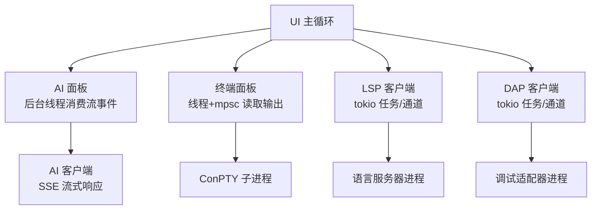
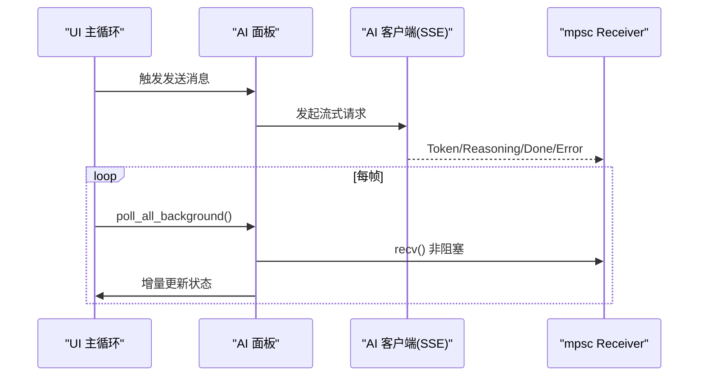
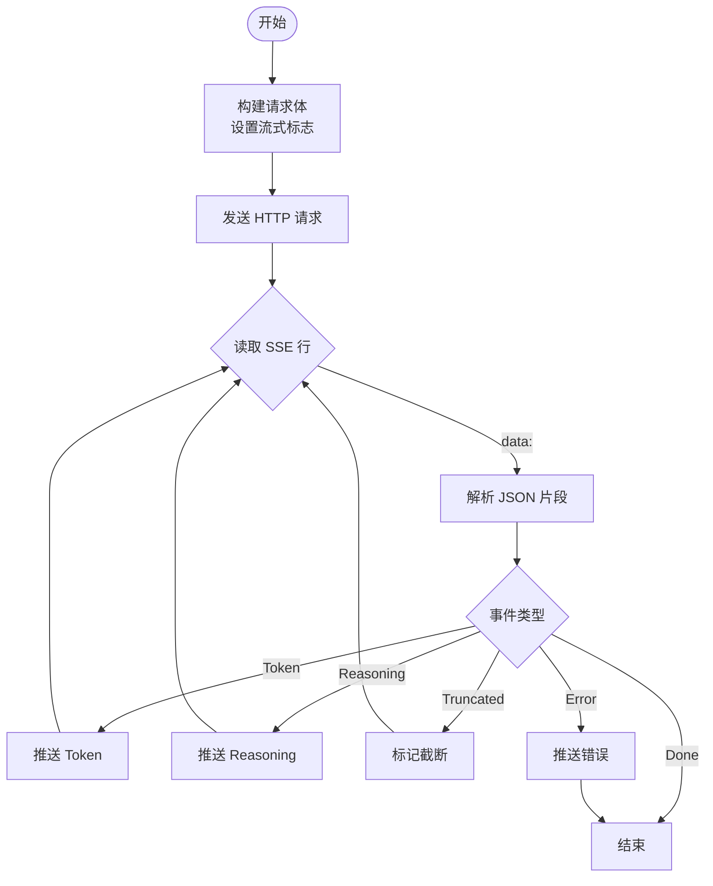
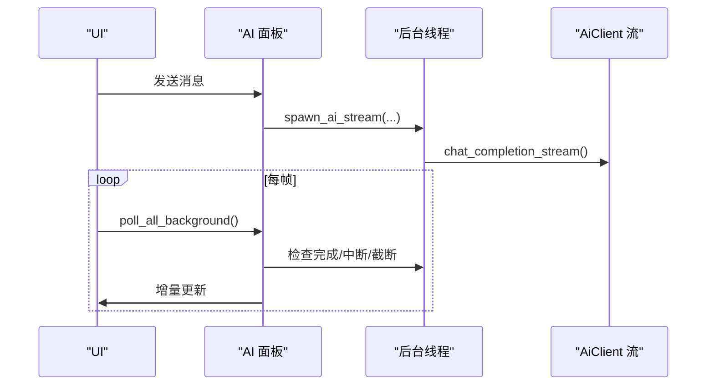
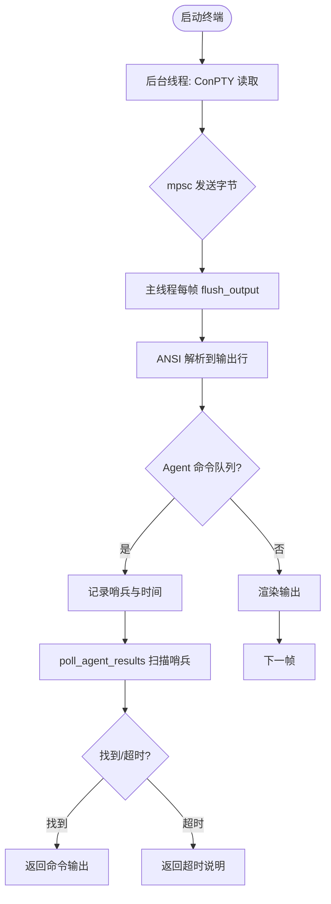
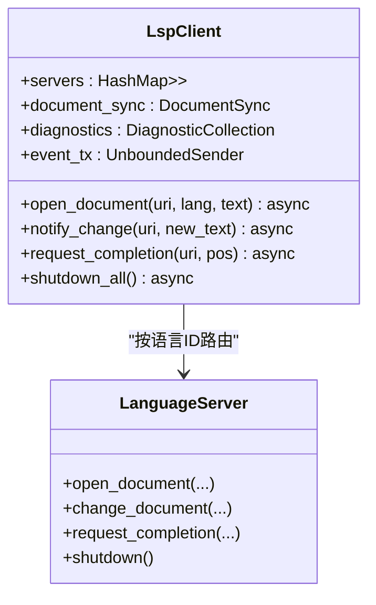
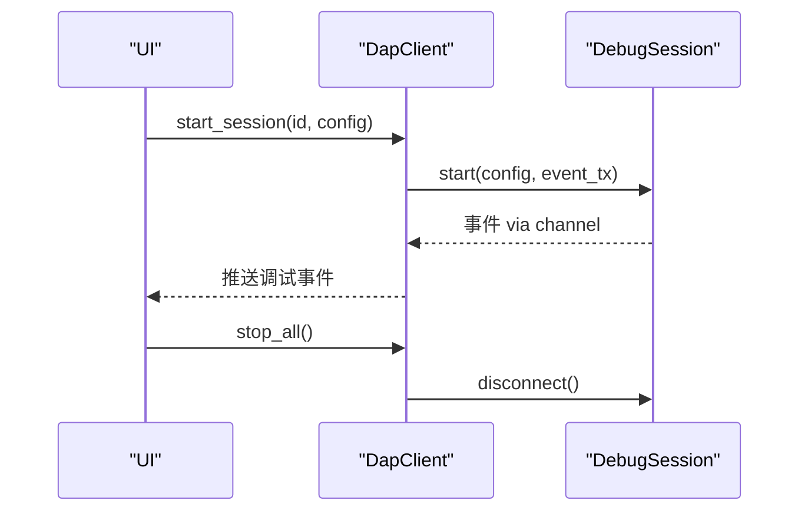
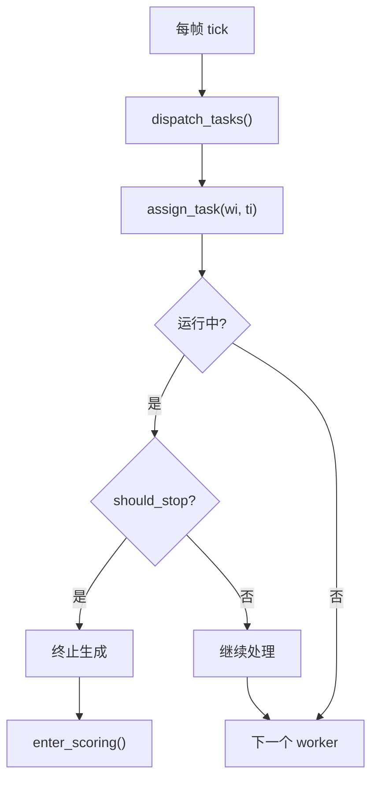
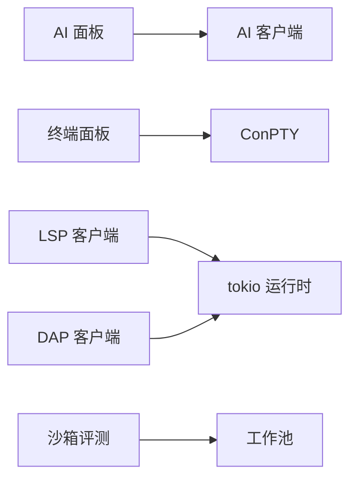

# 异步数据处理

<cite>
**本文引用的文件**
- [aether-ai/src/lib.rs](file://crates/aether-ai/src/lib.rs)
- [aether-ai-panel/src/ai_panel.rs](file://crates/aether-ai-panel/src/ai_panel.rs)
- [aether-terminal/src/terminal.rs](file://crates/aether-terminal/src/terminal.rs)
- [aether-lsp/src/client.rs](file://crates/aether-lsp/src/client.rs)
- [aether-dap/src/client.rs](file://crates/aether-dap/src/client.rs)
- [aether-win32/src/sandbox_eval.rs](file://crates/aether-win32/src/sandbox_eval.rs)
</cite>

## 目录
1. [简介](#简介)
2. [项目结构](#项目结构)
3. [核心组件](#核心组件)
4. [架构总览](#架构总览)
5. [详细组件分析](#详细组件分析)
6. [依赖关系分析](#依赖关系分析)
7. [性能考量](#性能考量)
8. [故障排查指南](#故障排查指南)
9. [结论](#结论)
10. [附录](#附录)

## 简介
本文件面向牧羊人编辑器的异步数据流与并发模型，聚焦以下目标：
- 说明文件 I/O、网络请求、AI 服务调用等异步操作的并发处理模型。
- 解释 tokio 运行时在编辑器中的应用（任务调度、背压处理、错误恢复）。
- 描述 WebSocket/流式响应处理与实时数据同步模式。
- 提供异步编程最佳实践与性能调优建议，帮助实现高效、可观测、可恢复的异步数据流。

## 项目结构
本项目采用多 crate 分层组织，异步能力分布在多个子系统：
- AI 客户端与流式 SSE：负责网络请求、SSE 解析、事件分发。
- AI 面板：后台线程消费流事件，更新共享状态，UI 轮询渲染。
- 终端面板：基于线程 + mpsc 的 ConPTY 输出读取与命令队列。
- LSP 客户端：基于 tokio 的任务与通道管理语言服务器交互。
- DAP 客户端：基于 tokio 的调试会话管理与事件通道。
- 沙箱评测：任务派发、超时控制、错误回收与打分阶段。

图表来源
- [aether-ai-panel/src/ai_panel.rs:731-838](file://crates/aether-ai-panel/src/ai_panel.rs#L731-L838)
- [aether-terminal/src/terminal.rs:170-264](file://crates/aether-terminal/src/terminal.rs#L170-L264)
- [aether-lsp/src/client.rs:73-113](file://crates/aether-lsp/src/client.rs#L73-L113)
- [aether-dap/src/client.rs:14-42](file://crates/aether-dap/src/client.rs#L14-L42)
- [aether-ai/src/lib.rs:716-920](file://crates/aether-ai/src/lib.rs#L716-L920)

章节来源
- [aether-ai/src/lib.rs:716-920](file://crates/aether-ai/src/lib.rs#L716-L920)
- [aether-ai-panel/src/ai_panel.rs:731-838](file://crates/aether-ai-panel/src/ai_panel.rs#L731-L838)
- [aether-terminal/src/terminal.rs:170-264](file://crates/aether-terminal/src/terminal.rs#L170-L264)
- [aether-lsp/src/client.rs:73-113](file://crates/aether-lsp/src/client.rs#L73-L113)
- [aether-dap/src/client.rs:14-42](file://crates/aether-dap/src/client.rs#L14-L42)

## 核心组件
- AI 客户端（SSE 流）：构建 HTTP 请求，解析 SSE data 行，按 token/reasoning/done/truncated/error 事件推送到 mpsc 通道；支持安全校验、限长响应体、可重试错误分类。
- AI 面板（后台消费）：在新线程发起流式请求，将事件写入共享状态；UI 每帧轮询并渲染增量内容；支持停止信号、截断提示、错误分类展示。
- 终端面板（线程+通道）：后台线程从 ConPTY 管道读取字节，通过 mpsc 发送到主线程；主线程非阻塞批量拉取、ANSI 解析、输出行缓存与滚动；支持 Agent 命令哨兵与超时兜底。
- LSP 客户端（tokio）：使用 tokio::sync::RwLock/Mutex 管理多语言服务器实例；文档变更计算增量并发送；诊断集合以 Mutex 保护供 UI 快照读取。
- DAP 客户端（tokio）：管理多个调试会话，启动/断开会话，事件通过 UnboundedChannel 推送至 UI。
- 沙箱评测（任务编排）：工作池派发任务、限时终止、错误抢救、进入打分阶段。

章节来源
- [aether-ai/src/lib.rs:716-920](file://crates/aether-ai/src/lib.rs#L716-L920)
- [aether-ai-panel/src/ai_panel.rs:731-838](file://crates/aether-ai-panel/src/ai_panel.rs#L731-L838)
- [aether-terminal/src/terminal.rs:170-264](file://crates/aether-terminal/src/terminal.rs#L170-L264)
- [aether-lsp/src/client.rs:73-113](file://crates/aether-lsp/src/client.rs#L73-L113)
- [aether-dap/src/client.rs:14-42](file://crates/aether-dap/src/client.rs#L14-L42)
- [aether-win32/src/sandbox_eval.rs:708-770](file://crates/aether-win32/src/sandbox_eval.rs#L708-L770)

## 架构总览
整体异步架构围绕“生产者-消费者”与“事件驱动”展开：
- 网络/I/O 作为生产者，通过通道或回调将事件推入队列。
- UI 主循环作为消费者，每帧轮询并应用增量更新。
- tokio 用于需要长时间运行的 I/O 绑定任务（如 LSP/DAP），而 CPU 密集或阻塞型 I/O（如 ConPTY 读取）使用线程 + std::sync::mpsc。
- 背压通过无界/有界通道策略与轮询频率控制；错误恢复通过分类与重试策略、超时与哨兵机制保障稳定性。

图表来源
- [aether-ai-panel/src/ai_panel.rs:731-838](file://crates/aether-ai-panel/src/ai_panel.rs#L731-L838)
- [aether-ai/src/lib.rs:716-920](file://crates/aether-ai/src/lib.rs#L716-L920)

章节来源
- [aether-ai-panel/src/ai_panel.rs:731-838](file://crates/aether-ai-panel/src/ai_panel.rs#L731-L838)
- [aether-ai/src/lib.rs:716-920](file://crates/aether-ai/src/lib.rs#L716-L920)

## 详细组件分析

### AI 客户端：SSE 流式响应与错误恢复
- 流式接口：返回 mpsc::Receiver<AiStreamEvent>，后台线程持续读取 SSE data 行，解析 JSON 片段，推送 Token/Reasoning/Done/Truncated/Error。
- 安全与限流：限制响应体大小，HTTPS 强制，私有 IP/元数据端点拦截，TOCTOU DNS 校验。
- 错误恢复：区分暂时性错误（429/500/503）与永久错误（400/401/402/403/404/422），提供 safe_display 脱敏信息。

图表来源
- [aether-ai/src/lib.rs:716-920](file://crates/aether-ai/src/lib.rs#L716-L920)

章节来源
- [aether-ai/src/lib.rs:716-920](file://crates/aether-ai/src/lib.rs#L716-L920)

### AI 面板：后台线程消费与 UI 轮询
- 后台线程：spawn_ai_stream 在新线程中发起流式请求，接收事件并写入共享 AiStreamState。
- UI 轮询：poll_all_background 对活动会话与后台会话进行 drain，识别 Completed/Interrupted/Truncated/Pending。
- 停止与恢复：AtomicBool should_stop 控制中断；截断时保留继续生成入口。

图表来源
- [aether-ai-panel/src/ai_panel.rs:731-838](file://crates/aether-ai-panel/src/ai_panel.rs#L731-L838)
- [aether-ai-panel/src/ai_panel.rs:1420-1448](file://crates/aether-ai-panel/src/ai_panel.rs#L1420-L1448)

章节来源
- [aether-ai-panel/src/ai_panel.rs:731-838](file://crates/aether-ai-panel/src/ai_panel.rs#L731-L838)
- [aether-ai-panel/src/ai_panel.rs:1420-1448](file://crates/aether-ai-panel/src/ai_panel.rs#L1420-L1448)

### 终端面板：线程+通道与命令哨兵
- 启动流程：start 创建后台线程，ConPTY 读取线程通过 PipeReader 读取字节，经 mpsc 发送到主线程。
- 主线程轮询：flush_output 非阻塞批量接收，ANSI 解析后写入 output_lines，支持滚动与窗口裁剪。
- Agent 命令：queue_agent_command 追加哨兵，poll_agent_results 扫描输出行匹配哨兵，超时兜底返回结果。

图表来源
- [aether-terminal/src/terminal.rs:170-264](file://crates/aether-terminal/src/terminal.rs#L170-L264)
- [aether-terminal/src/terminal.rs:321-393](file://crates/aether-terminal/src/terminal.rs#L321-L393)
- [aether-terminal/src/terminal.rs:631-728](file://crates/aether-terminal/src/terminal.rs#L631-L728)

章节来源
- [aether-terminal/src/terminal.rs:170-264](file://crates/aether-terminal/src/terminal.rs#L170-L264)
- [aether-terminal/src/terminal.rs:321-393](file://crates/aether-terminal/src/terminal.rs#L321-L393)
- [aether-terminal/src/terminal.rs:631-728](file://crates/aether-terminal/src/terminal.rs#L631-L728)

### LSP 客户端：tokio 任务与文档增量同步
- 服务器管理：每个语言服务器用 Arc<tokio::sync::Mutex<LanguageServer>> 包装，避免全局写锁跨 await。
- 文档同步：DocumentSync 保存旧文本，compute_changes 计算增量变更，notify_change/notify_change_raw 发送变更。
- 事件推送：LspEvent 通过 UnboundedChannel 推送至 UI，包含诊断、补全、悬停、重命名等。

图表来源
- [aether-lsp/src/client.rs:11-25](file://crates/aether-lsp/src/client.rs#L11-L25)
- [aether-lsp/src/client.rs:73-113](file://crates/aether-lsp/src/client.rs#L73-L113)
- [aether-lsp/src/client.rs:215-286](file://crates/aether-lsp/src/client.rs#L215-L286)

章节来源
- [aether-lsp/src/client.rs:11-25](file://crates/aether-lsp/src/client.rs#L11-L25)
- [aether-lsp/src/client.rs:73-113](file://crates/aether-lsp/src/client.rs#L73-L113)
- [aether-lsp/src/client.rs:215-286](file://crates/aether-lsp/src/client.rs#L215-L286)

### DAP 客户端：tokio 调试会话管理
- 会话管理：DapClient 维护 sessions 映射，start_session 启动调试会话，stop_all 断开所有会话。
- 事件通道：UnboundedChannel 向 UI 推送调试事件（如 Terminated）。

图表来源
- [aether-dap/src/client.rs:14-42](file://crates/aether-dap/src/client.rs#L14-L42)

章节来源
- [aether-dap/src/client.rs:14-42](file://crates/aether-dap/src/client.rs#L14-L42)

### 沙箱评测：任务派发与错误恢复
- 任务派发：dispatch_tasks 遍历 worker，分配 Pending 任务，天然避免响应路径重入。
- 超时控制：on_deadline_reached 设置停止标志，标记未完成为超时，进入打分阶段。
- 错误抢救：on_worker_error 抢救已接收文件块，标记失败，worker 转空闲。

图表来源
- [aether-win32/src/sandbox_eval.rs:708-770](file://crates/aether-win32/src/sandbox_eval.rs#L708-L770)

章节来源
- [aether-win32/src/sandbox_eval.rs:708-770](file://crates/aether-win32/src/sandbox_eval.rs#L708-L770)

## 依赖关系分析
- AI 面板依赖 AI 客户端的流式通道；终端面板依赖 ConPTY 与 ANSI 解析；LSP/DAP 依赖 tokio 任务与通道；沙箱评测依赖工作池与状态机。
- 耦合点：
  - 共享状态（如 AiStreamState）通过 Arc<Mutex<...>> 在多线程间安全访问。
  - 事件通道（mpsc/unbounded）解耦生产与消费，允许不同速率处理。
  - 超时与哨兵机制确保长时间操作的可控性与可恢复性。

图表来源
- [aether-ai-panel/src/ai_panel.rs:731-838](file://crates/aether-ai-panel/src/ai_panel.rs#L731-L838)
- [aether-terminal/src/terminal.rs:170-264](file://crates/aether-terminal/src/terminal.rs#L170-L264)
- [aether-lsp/src/client.rs:73-113](file://crates/aether-lsp/src/client.rs#L73-L113)
- [aether-dap/src/client.rs:14-42](file://crates/aether-dap/src/client.rs#L14-L42)
- [aether-win32/src/sandbox_eval.rs:708-770](file://crates/aether-win32/src/sandbox_eval.rs#L708-L770)

章节来源
- [aether-ai-panel/src/ai_panel.rs:731-838](file://crates/aether-ai-panel/src/ai_panel.rs#L731-L838)
- [aether-terminal/src/terminal.rs:170-264](file://crates/aether-terminal/src/terminal.rs#L170-L264)
- [aether-lsp/src/client.rs:73-113](file://crates/aether-lsp/src/client.rs#L73-L113)
- [aether-dap/src/client.rs:14-42](file://crates/aether-dap/src/client.rs#L14-L42)
- [aether-win32/src/sandbox_eval.rs:708-770](file://crates/aether-win32/src/sandbox_eval.rs#L708-L770)

## 性能考量
- 通道选择：
  - 高吞吐且无需背压的场景使用 unbounded_channel（如 LSP/DAP 事件推送）。
  - 需要背压控制的场景使用 bounded_channel 或 try_recv 非阻塞轮询（如终端输出、AI 流事件）。
- 轮询频率：
  - UI 主循环每帧调用 poll_* 方法，避免阻塞；终端输出批量拉取减少系统调用开销。
- 资源限制：
  - AI 客户端限制响应体大小，防止内存膨胀；连接与读超时分离，避免长生成被误杀。
- 任务隔离：
  - 每个语言服务器独立 Mutex，避免全局锁竞争；终端读取线程与主线程解耦。
- 优化建议：
  - 对高频小消息合并批次发送（如终端输出聚合）。
  - 对长耗时任务设置超时与取消信号（如 AI 流 with should_stop）。
  - 使用增量同步（LSP 文档变更）减少冗余传输。

[本节为通用指导，不直接分析具体文件]

## 故障排查指南
- AI 流式请求失败：
  - 检查网络连接、DNS 解析、API Key 配置；查看错误分类（暂时性/永久）与 safe_display 提示。
  - 关注 Truncated 事件，必要时调整 max_tokens 或启用思考模式参数。
- 终端无输出：
  - 确认 ConPTY 启动成功（poll_startup），检查输出通道是否断开；观察 ANSI 解析日志。
  - 若 shell 初始化慢，等待提示符就绪后再发送命令。
- LSP 服务器异常：
  - 监听 ServerExited 事件，移除死亡实例并清理诊断缓存；重启按需启动。
- DAP 会话断开：
  - 检查 adapter 进程是否存活；调用 stop_all 清理会话。
- 沙箱任务超时：
  - 检查 should_stop 标志与 on_deadline_reached 逻辑；确认任务状态标记与打分阶段。

章节来源
- [aether-ai/src/lib.rs:716-920](file://crates/aether-ai/src/lib.rs#L716-L920)
- [aether-terminal/src/terminal.rs:266-294](file://crates/aether-terminal/src/terminal.rs#L266-L294)
- [aether-lsp/src/client.rs:569-603](file://crates/aether-lsp/src/client.rs#L569-L603)
- [aether-dap/src/client.rs:36-42](file://crates/aether-dap/src/client.rs#L36-L42)
- [aether-win32/src/sandbox_eval.rs:731-770](file://crates/aether-win32/src/sandbox_eval.rs#L731-L770)

## 结论
牧羊人编辑器的异步数据流以“后台生产者 + UI 轮询消费者”为核心，结合 tokio 与线程通道实现高并发、低延迟的数据处理。AI 流式响应、终端输出、LSP/DAP 通信均遵循一致的背压与错误恢复模式。通过合理的通道选择、超时控制、增量同步与任务隔离，系统在复杂交互场景下保持稳定与高性能。

[本节为总结，不直接分析具体文件]

## 附录
- 最佳实践清单：
  - 使用非阻塞轮询（try_recv）避免 UI 卡顿。
  - 对长耗时任务设置取消信号与超时。
  - 对敏感错误信息进行脱敏展示。
  - 使用增量同步减少网络与 CPU 开销。
  - 对关键路径添加日志与指标以便定位问题。

[本节为通用指导，不直接分析具体文件]