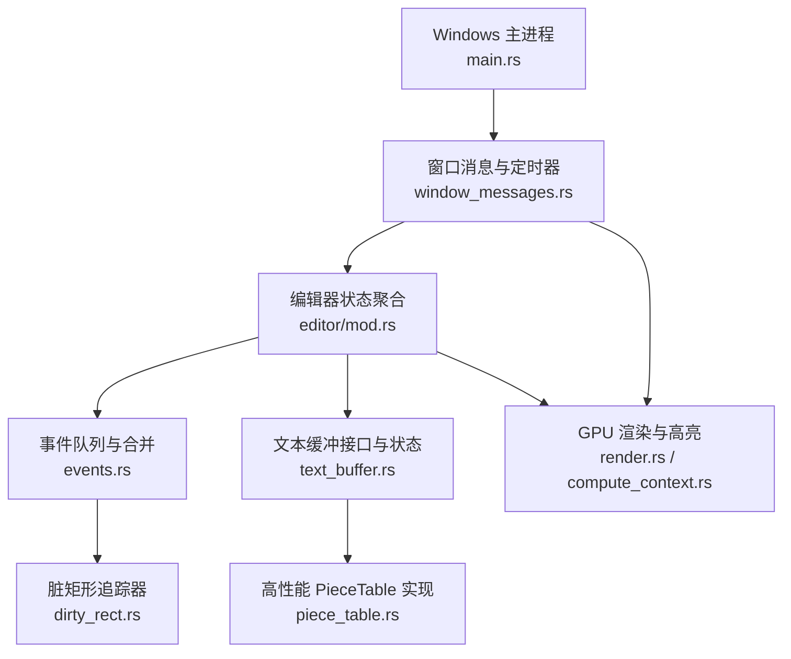
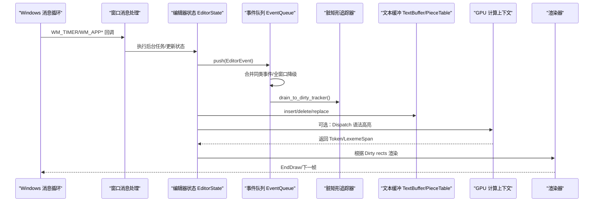
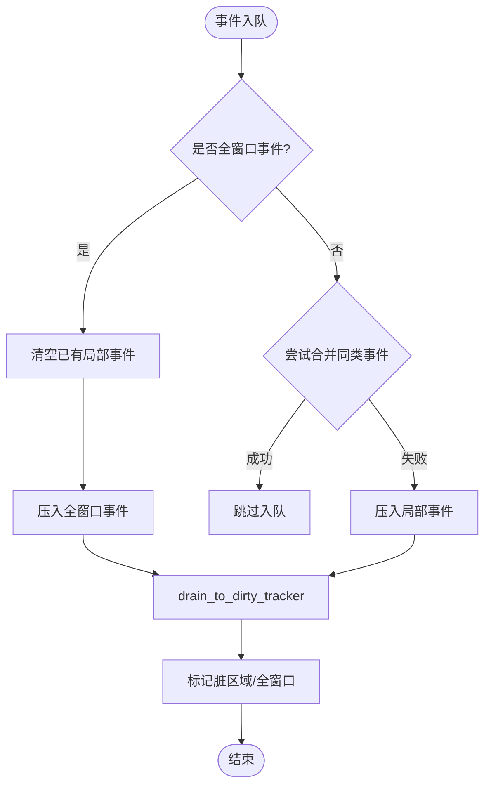
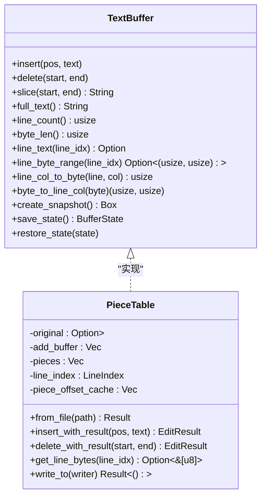
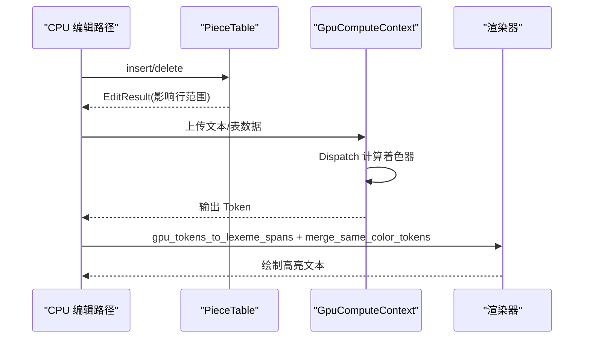
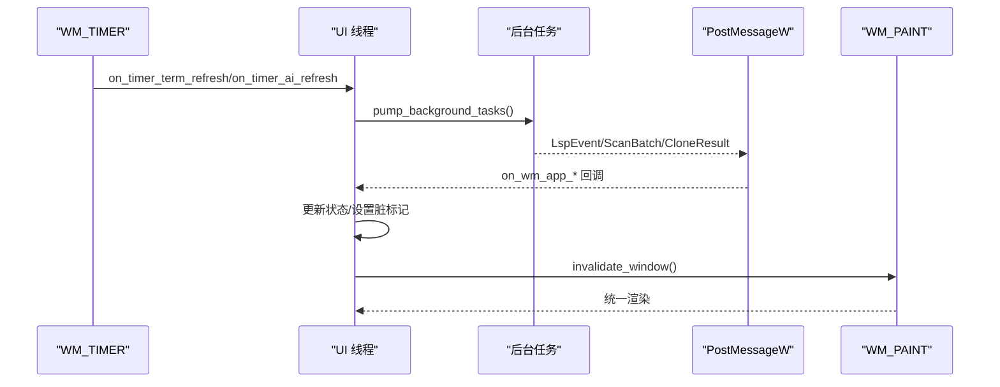
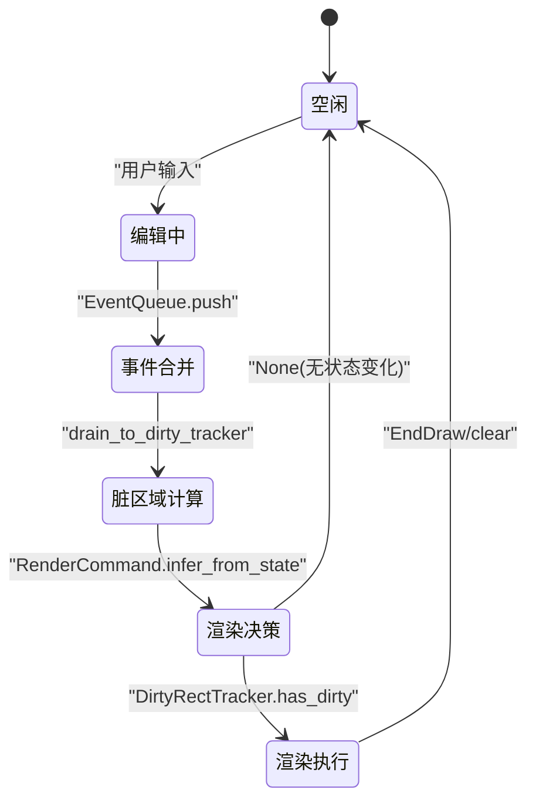
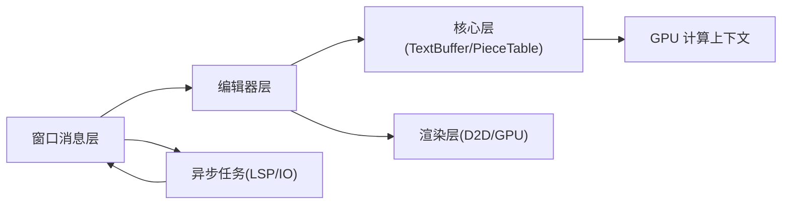

# 数据流设计

<cite>
**本文引用的文件**
- [crates/aether-win32/src/main.rs](file://crates/aether-win32/src/main.rs)
- [crates/aether-win32/src/window/window_messages.rs](file://crates/aether-win32/src/window/window_messages.rs)
- [crates/aether-editor/src/events.rs](file://crates/aether-editor/src/events.rs)
- [crates/aether-editor/src/dirty_rect.rs](file://crates/aether-editor/src/dirty_rect.rs)
- [crates/aether-core/src/buffer/text_buffer.rs](file://crates/aether-core/src/buffer/text_buffer.rs)
- [crates/aether-core/src/buffer/piece_table.rs](file://crates/aether-core/src/buffer/piece_table.rs)
- [crates/aether-render/src/gpu/render.rs](file://crates/aether-render/src/gpu/render.rs)
- [crates/aether-render/src/gpu/compute_context.rs](file://crates/aether-render/src/gpu/compute_context.rs)
- [crates/aether-win32/src/editor/mod.rs](file://crates/aether-win32/src/editor/mod.rs)
</cite>

## 目录
1. [引言](#引言)
2. [项目结构](#项目结构)
3. [核心组件](#核心组件)
4. [架构总览](#架构总览)
5. [详细组件分析](#详细组件分析)
6. [依赖分析](#依赖分析)
7. [性能考虑](#性能考虑)
8. [故障排查指南](#故障排查指南)
9. [结论](#结论)
10. [附录](#附录)

## 引言
本文件面向牧羊人编辑器的数据流设计，聚焦“用户输入 → 事件处理 → 文本缓冲更新 → 脏区域计算 → 渲染”的完整链路，并解释异步数据处理模型（文件 I/O、网络请求、GPU 计算的并发）与状态管理模式（单向数据流与响应式更新）。文档提供关键数据流的时序图与状态转换图，帮助开发者理解数据在系统中的流转过程。

## 项目结构
编辑器采用分层模块化组织：
- UI/窗口层：Windows 消息循环、定时器、PostMessage 跨线程通信、统一重绘触发
- 编辑器层：事件总线、脏矩形追踪、焦点管理、内联补全等
- 核心层：文本缓冲区（PieceTable）、增量词法、搜索、工作区
- 渲染层：Direct2D/Direct3D11 渲染、GPU 语法高亮、主题
- 集成层：LSP、远程开发、终端、AI 面板等

图表来源
- [crates/aether-win32/src/main.rs:1-26](file://crates/aether-win32/src/main.rs#L1-L26)
- [crates/aether-win32/src/window/window_messages.rs:22-59](file://crates/aether-win32/src/window/window_messages.rs#L22-L59)
- [crates/aether-win32/src/editor/mod.rs:650-676](file://crates/aether-win32/src/editor/mod.rs#L650-L676)
- [crates/aether-editor/src/events.rs:1-74](file://crates/aether-editor/src/events.rs#L1-L74)
- [crates/aether-editor/src/dirty_rect.rs:87-112](file://crates/aether-editor/src/dirty_rect.rs#L87-L112)
- [crates/aether-core/src/buffer/text_buffer.rs:1-49](file://crates/aether-core/src/buffer/text_buffer.rs#L1-L49)
- [crates/aether-core/src/buffer/piece_table.rs:11-35](file://crates/aether-core/src/buffer/piece_table.rs#L11-L35)
- [crates/aether-render/src/gpu/render.rs:116-126](file://crates/aether-render/src/gpu/render.rs#L116-L126)
- [crates/aether-render/src/gpu/compute_context.rs:17-36](file://crates/aether-render/src/gpu/compute_context.rs#L17-L36)

章节来源
- [crates/aether-win32/src/main.rs:1-26](file://crates/aether-win32/src/main.rs#L1-L26)
- [crates/aether-win32/src/window/window_messages.rs:22-59](file://crates/aether-win32/src/window/window_messages.rs#L22-L59)

## 核心组件
- 事件系统：EditorEvent 枚举与 EventQueue 负责一帧内事件收集、合并与降级，避免重复重绘。
- 脏矩形追踪：DirtyRectTracker 记录需要重绘的区域，支持按区域类型标记、重叠合并与阈值降级为全窗口重绘。
- 文本缓冲：TextBuffer trait 抽象编辑操作；PieceTable 提供 O(1) 插入/删除、内存映射大文件、行索引分块优化。
- GPU 渲染：GpuComputeContext 封装 D3D11 Compute Shader 资源；render.rs 将 GPU Token 转换为 LexemeSpan 并合并同色片段以减少绘制调用。
- 窗口与异步：window_messages.rs 通过 WM_TIMER 驱动后台任务泥（终端刷新、AI 刷新、自动保存等），并通过 PostMessageW 将后台结果投递到 UI 线程，统一触发 WM_PAINT。

章节来源
- [crates/aether-editor/src/events.rs:1-186](file://crates/aether-editor/src/events.rs#L1-L186)
- [crates/aether-editor/src/dirty_rect.rs:8-112](file://crates/aether-editor/src/dirty_rect.rs#L8-L112)
- [crates/aether-core/src/buffer/text_buffer.rs:1-171](file://crates/aether-core/src/buffer/text_buffer.rs#L1-L171)
- [crates/aether-core/src/buffer/piece_table.rs:11-35](file://crates/aether-core/src/buffer/piece_table.rs#L11-L35)
- [crates/aether-render/src/gpu/render.rs:74-126](file://crates/aether-render/src/gpu/render.rs#L74-L126)
- [crates/aether-render/src/gpu/compute_context.rs:17-36](file://crates/aether-render/src/gpu/compute_context.rs#L17-L36)
- [crates/aether-win32/src/window/window_messages.rs:167-236](file://crates/aether-win32/src/window/window_messages.rs#L167-L236)

## 架构总览
下图展示从 Windows 消息到渲染输出的整体数据流，包括事件合并、脏区域计算、文本缓冲更新与 GPU/CPU 并行路径。

图表来源
- [crates/aether-win32/src/window/window_messages.rs:22-59](file://crates/aether-win32/src/window/window_messages.rs#L22-L59)
- [crates/aether-editor/src/events.rs:66-186](file://crates/aether-editor/src/events.rs#L66-L186)
- [crates/aether-editor/src/dirty_rect.rs:145-162](file://crates/aether-editor/src/dirty_rect.rs#L145-L162)
- [crates/aether-core/src/buffer/text_buffer.rs:8-49](file://crates/aether-core/src/buffer/text_buffer.rs#L8-L49)
- [crates/aether-core/src/buffer/piece_table.rs:450-562](file://crates/aether-core/src/buffer/piece_table.rs#L450-L562)
- [crates/aether-render/src/gpu/compute_context.rs:232-272](file://crates/aether-render/src/gpu/compute_context.rs#L232-L272)
- [crates/aether-render/src/gpu/render.rs:10-32](file://crates/aether-render/src/gpu/render.rs#L10-L32)

## 详细组件分析

### 事件系统与脏区域计算
- 事件类型与区域映射：EditorEvent 定义文本变化、光标移动、选择变化、滚动、标签页切换、侧边栏/右侧/底部面板变化、状态栏变化、窗口尺寸变化、查找替换变化、对话框可见性变化等，并映射到 DirtyRegionType。
- 事件队列合并：连续滚动、光标移动、选择变化可合并；TextChanged 的行范围会合并；全窗口事件会清空局部事件并覆盖后续局部事件。
- 脏矩形追踪：支持 mark_full_window、mark_region、mark_editor_line、mark_cursor、is_*_dirty 等查询；当脏矩形数量超过阈值或过多时降级为全窗口重绘。

图表来源
- [crates/aether-editor/src/events.rs:84-186](file://crates/aether-editor/src/events.rs#L84-L186)
- [crates/aether-editor/src/dirty_rect.rs:114-162](file://crates/aether-editor/src/dirty_rect.rs#L114-L162)

章节来源
- [crates/aether-editor/src/events.rs:1-186](file://crates/aether-editor/src/events.rs#L1-L186)
- [crates/aether-editor/src/dirty_rect.rs:8-162](file://crates/aether-editor/src/dirty_rect.rs#L8-L162)

### 文本缓冲与 PieceTable
- 文本缓冲接口：基于字节偏移的 insert/delete/slice/full_text/line_count/byte_len/line_text/line_byte_range/line_col_to_byte/byte_to_line_col，以及不可变快照用于后台线程安全访问。
- 编辑结果：EditResult 包含受影响行范围与行数变化，用于精确缓存失效与脏区域计算。
- PieceTable 实现：使用内存映射原始文件与追加缓冲区，维护有序片段表与行索引分块；insert_with_result/delete_with_result 返回 EditResult；支持零拷贝读取与高效写入。

图表来源
- [crates/aether-core/src/buffer/text_buffer.rs:8-49](file://crates/aether-core/src/buffer/text_buffer.rs#L8-L49)
- [crates/aether-core/src/buffer/piece_table.rs:11-35](file://crates/aether-core/src/buffer/piece_table.rs#L11-L35)
- [crates/aether-core/src/buffer/piece_table.rs:408-448](file://crates/aether-core/src/buffer/piece_table.rs#L408-L448)
- [crates/aether-core/src/buffer/piece_table.rs:450-562](file://crates/aether-core/src/buffer/piece_table.rs#L450-L562)
- [crates/aether-core/src/buffer/piece_table.rs:569-688](file://crates/aether-core/src/buffer/piece_table.rs#L569-L688)
- [crates/aether-core/src/buffer/piece_table.rs:710-794](file://crates/aether-core/src/buffer/piece_table.rs#L710-L794)

章节来源
- [crates/aether-core/src/buffer/text_buffer.rs:1-171](file://crates/aether-core/src/buffer/text_buffer.rs#L1-L171)
- [crates/aether-core/src/buffer/piece_table.rs:408-794](file://crates/aether-core/src/buffer/piece_table.rs#L408-L794)

### GPU 高亮与渲染管线
- GPU 计算上下文：封装 D3D11 设备与上下文，支持创建 Compute Shader、结构化缓冲区、SRV/UAV、Dispatch、读写缓冲区。
- 渲染桥接：gpu_tokens_to_lexeme_spans 将 GPU Token 转换为 LexemeSpan；merge_same_color_tokens 合并相邻同色 Token 减少 DrawText 调用；GpuHighlightRenderer 将 TokenKind 映射为主题颜色。
- 双缓冲与池化：DoubleBuffer 用于 CPU/GPU 并行；GpuBufferPool 复用 GPU 缓冲区，避免频繁分配释放。

图表来源
- [crates/aether-render/src/gpu/compute_context.rs:232-272](file://crates/aether-render/src/gpu/compute_context.rs#L232-L272)
- [crates/aether-render/src/gpu/render.rs:10-32](file://crates/aether-render/src/gpu/render.rs#L10-L32)
- [crates/aether-render/src/gpu/render.rs:74-126](file://crates/aether-render/src/gpu/render.rs#L74-L126)
- [crates/aether-core/src/buffer/piece_table.rs:450-562](file://crates/aether-core/src/buffer/piece_table.rs#L450-L562)

章节来源
- [crates/aether-render/src/gpu/compute_context.rs:17-36](file://crates/aether-render/src/gpu/compute_context.rs#L17-L36)
- [crates/aether-render/src/gpu/render.rs:74-126](file://crates/aether-render/src/gpu/render.rs#L74-L126)

### 异步数据处理模型
- 定时器驱动后台任务：终端刷新、AI 刷新、自动保存防抖/周期、悬停提示、UI 动画、电源冰冻态检查等。
- 跨线程通信：LSP 事件、文件夹扫描批次、子目录扫描结果、SSH/Git 异步完成、更新检查等通过 PostMessageW 投递到 UI 线程，统一触发 WM_PAINT，避免直接 render 导致双重渲染。
- 冰冻态：最小化或长期空闲进入冰冻态释放内存，后台任务由无头泵继续消费但不触发重绘，保证 AI 生成与文件落盘不中断。

图表来源
- [crates/aether-win32/src/window/window_messages.rs:167-236](file://crates/aether-win32/src/window/window_messages.rs#L167-L236)
- [crates/aether-win32/src/window/window_messages.rs:442-466](file://crates/aether-win32/src/window/window_messages.rs#L442-L466)
- [crates/aether-win32/src/window/window_messages.rs:476-490](file://crates/aether-win32/src/window/window_messages.rs#L476-L490)
- [crates/aether-win32/src/window/window_messages.rs:538-582](file://crates/aether-win32/src/window/window_messages.rs#L538-L582)
- [crates/aether-win32/src/window/window_messages.rs:585-641](file://crates/aether-win32/src/window/window_messages.rs#L585-L641)

章节来源
- [crates/aether-win32/src/window/window_messages.rs:167-236](file://crates/aether-win32/src/window/window_messages.rs#L167-L236)
- [crates/aether-win32/src/window/window_messages.rs:442-641](file://crates/aether-win32/src/window/window_messages.rs#L442-L641)

### 状态管理模式
- 单向数据流：输入事件 → 编辑器状态变更 → 事件队列 → 脏区域 → 渲染。
- 响应式更新：通过 PrevFrameState 对比上一帧状态检测变化；EventQueue 合并同类事件；DirtyRectTracker 按区域类型判断是否需要重绘；RenderCommand::infer_from_state 推断最优渲染命令。
- 状态聚合：EditorState 聚合窗口渲染状态、编辑器内容、文件树、AI 面板、终端、浏览器、LSP、UI 面板、输入交互、远程开发、电源管理等。

图表来源
- [crates/aether-editor/src/events.rs:84-186](file://crates/aether-editor/src/events.rs#L84-L186)
- [crates/aether-editor/src/dirty_rect.rs:368-426](file://crates/aether-editor/src/dirty_rect.rs#L368-L426)
- [crates/aether-win32/src/editor/mod.rs:191-236](file://crates/aether-win32/src/editor/mod.rs#L191-L236)
- [crates/aether-win32/src/editor/mod.rs:650-676](file://crates/aether-win32/src/editor/mod.rs#L650-L676)

章节来源
- [crates/aether-editor/src/events.rs:84-186](file://crates/aether-editor/src/events.rs#L84-L186)
- [crates/aether-editor/src/dirty_rect.rs:368-426](file://crates/aether-editor/src/dirty_rect.rs#L368-L426)
- [crates/aether-win32/src/editor/mod.rs:191-236](file://crates/aether-win32/src/editor/mod.rs#L191-L236)
- [crates/aether-win32/src/editor/mod.rs:650-676](file://crates/aether-win32/src/editor/mod.rs#L650-L676)

## 依赖分析
- 模块耦合：窗口消息层依赖编辑器状态与事件系统；编辑器层依赖核心文本缓冲与渲染脏区域；渲染层依赖 GPU 上下文与主题。
- 外部依赖：Windows API（消息、D2D/D3D11）、Tokio 运行时（LSP 异步）、memmap2（大文件内存映射）。
- 潜在循环依赖：通过 trait 抽象（TextBuffer）与事件解耦避免循环；GPU 与渲染分离，Compute Context 仅暴露必要接口。

图表来源
- [crates/aether-win32/src/window/window_messages.rs:22-59](file://crates/aether-win32/src/window/window_messages.rs#L22-L59)
- [crates/aether-core/src/buffer/text_buffer.rs:8-49](file://crates/aether-core/src/buffer/text_buffer.rs#L8-L49)
- [crates/aether-render/src/gpu/compute_context.rs:17-36](file://crates/aether-render/src/gpu/compute_context.rs#L17-L36)

章节来源
- [crates/aether-win32/src/window/window_messages.rs:22-59](file://crates/aether-win32/src/window/window_messages.rs#L22-L59)
- [crates/aether-core/src/buffer/text_buffer.rs:8-49](file://crates/aether-core/src/buffer/text_buffer.rs#L8-L49)
- [crates/aether-render/src/gpu/compute_context.rs:17-36](file://crates/aether-render/src/gpu/compute_context.rs#L17-L36)

## 性能考虑
- 事件合并与脏区域优化：连续事件合并、重叠矩形合并、阈值降级为全窗口重绘，减少无效渲染。
- 文本缓冲性能：PieceTable 支持 O(1) 插入/删除、内存映射大文件、行索引分块与偏移缓存，避免全量扫描。
- GPU 加速：Compute Shader 进行语法高亮，Token 合并减少绘制调用，双缓冲与缓冲区池化降低分配开销。
- 异步 IO：后台任务泥与定时器驱动，避免阻塞 UI 线程；冰冻态下无头泵保活后台任务。

## 故障排查指南
- 无重绘问题：检查 EventQueue 是否正确 push 事件；DirtyRectTracker 是否被 mark_full_window 覆盖；RenderCommand 是否推断为 None。
- 卡顿问题：确认 PieceTable 编辑是否返回正确 EditResult；GPU 计算是否阻塞；后台任务是否在定时器中执行而非渲染路径。
- 状态不一致：验证 PrevFrameState 对比逻辑；确保 WM_PAINT 统一渲染，避免多处直接调用 render。
- 内存泄漏：检查 PostMessageW 传递的 Box 指针是否正确重建与 drop；GPU 缓冲区是否正确 release。

章节来源
- [crates/aether-editor/src/events.rs:84-186](file://crates/aether-editor/src/events.rs#L84-L186)
- [crates/aether-editor/src/dirty_rect.rs:114-162](file://crates/aether-editor/src/dirty_rect.rs#L114-L162)
- [crates/aether-core/src/buffer/piece_table.rs:450-688](file://crates/aether-core/src/buffer/piece_table.rs#L450-L688)
- [crates/aether-render/src/gpu/render.rs:74-126](file://crates/aether-render/src/gpu/render.rs#L74-L126)
- [crates/aether-win32/src/window/window_messages.rs:442-641](file://crates/aether-win32/src/window/window_messages.rs#L442-L641)

## 结论
牧羊人编辑器通过事件队列与脏矩形追踪实现高效的局部重绘，结合 PieceTable 的高性能文本缓冲与 GPU 加速的语法高亮，构建了稳定流畅的数据流。异步数据处理模型将 I/O 与网络请求隔离到后台任务，通过定时器与消息机制统一驱动 UI 更新，确保响应性与一致性。状态管理采用单向数据流与响应式更新，便于调试与扩展。

## 附录
- 关键路径参考：
  - 用户输入到渲染：[crates/aether-win32/src/window/window_messages.rs:167-236](file://crates/aether-win32/src/window/window_messages.rs#L167-L236)
  - 事件合并与脏区域：[crates/aether-editor/src/events.rs:84-186](file://crates/aether-editor/src/events.rs#L84-L186), [crates/aether-editor/src/dirty_rect.rs:114-162](file://crates/aether-editor/src/dirty_rect.rs#L114-L162)
  - 文本缓冲编辑：[crates/aether-core/src/buffer/piece_table.rs:450-688](file://crates/aether-core/src/buffer/piece_table.rs#L450-L688)
  - GPU 高亮渲染：[crates/aether-render/src/gpu/render.rs:10-32](file://crates/aether-render/src/gpu/render.rs#L10-L32), [crates/aether-render/src/gpu/compute_context.rs:232-272](file://crates/aether-render/src/gpu/compute_context.rs#L232-L272)