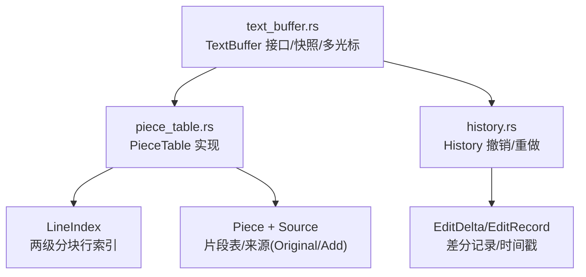
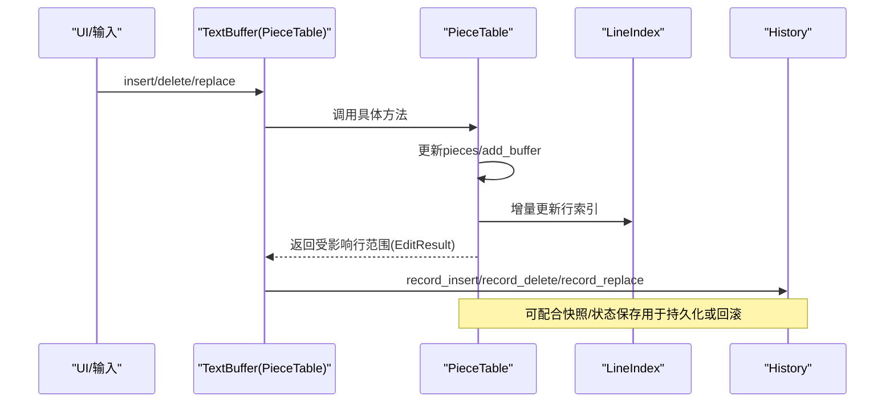
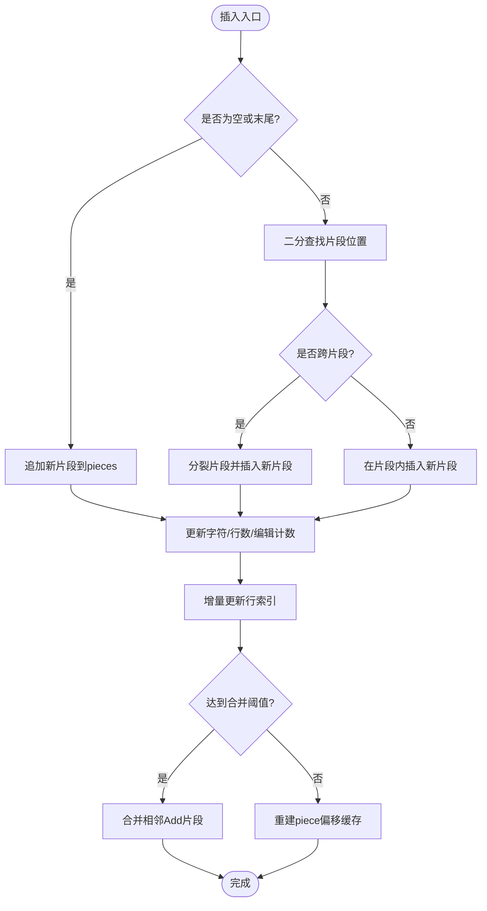
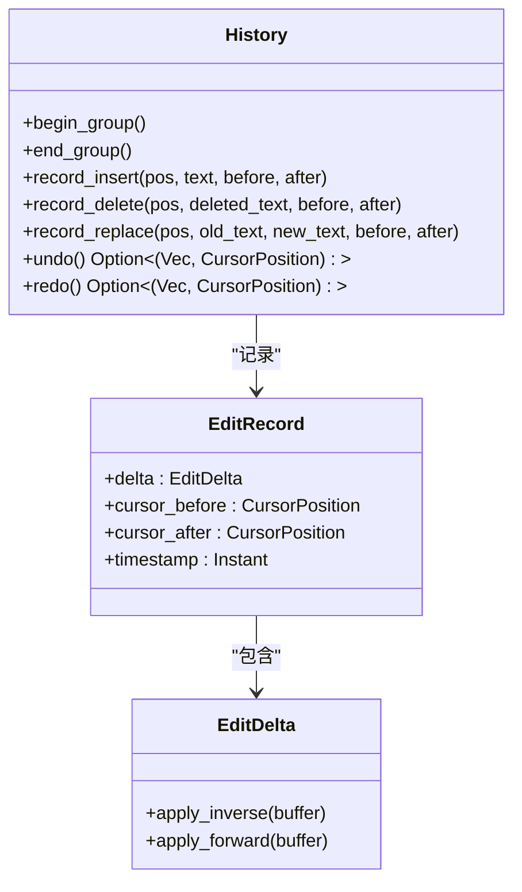
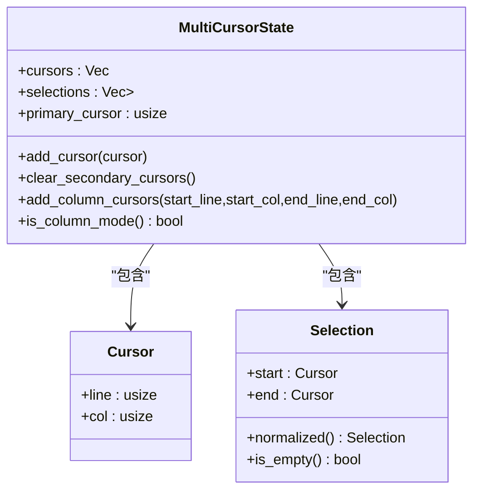
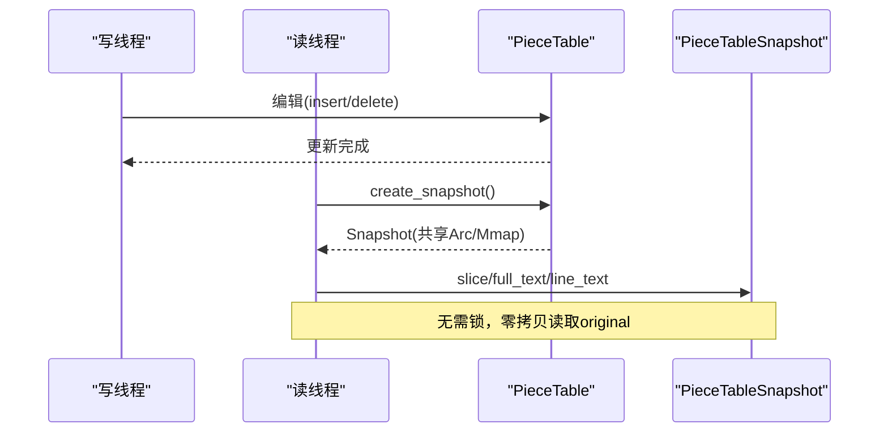
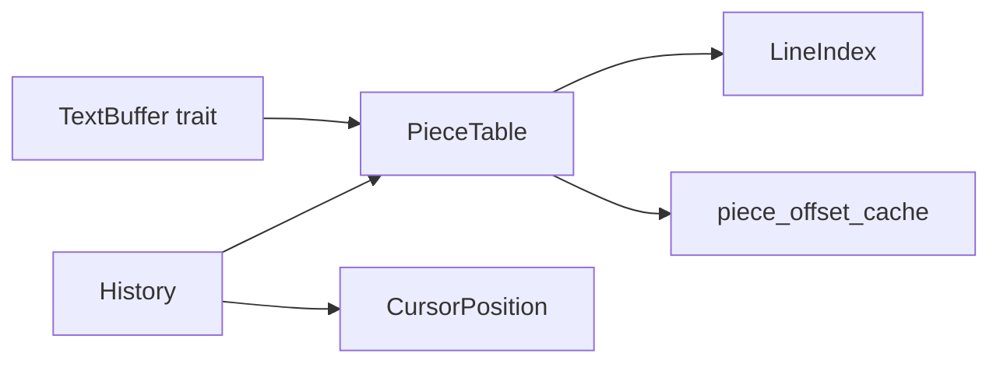

# 文本缓冲同步

<cite>
**本文引用的文件**
- [crates/aether-core/src/buffer/mod.rs](file://crates/aether-core/src/buffer/mod.rs)
- [crates/aether-core/src/buffer/text_buffer.rs](file://crates/aether-core/src/buffer/text_buffer.rs)
- [crates/aether-core/src/buffer/piece_table.rs](file://crates/aether-core/src/buffer/piece_table.rs)
- [crates/aether-core/src/buffer/history.rs](file://crates/aether-core/src/buffer/history.rs)
</cite>

## 目录
1. [简介](#简介)
2. [项目结构](#项目结构)
3. [核心组件](#核心组件)
4. [架构总览](#架构总览)
5. [详细组件分析](#详细组件分析)
6. [依赖关系分析](#依赖关系分析)
7. [性能考量](#性能考量)
8. [故障排查指南](#故障排查指南)
9. [结论](#结论)
10. [附录](#附录)

## 简介
本文件面向牧羊人编辑器的“文本缓冲同步”子系统，聚焦以下目标：
- 解释文本编辑操作如何通过 Piece Table 高效更新缓冲区状态（插入、删除、替换）。
- 说明撤销/重做历史栈的管理机制（操作压缩、内存优化与持久化策略）。
- 描述多光标状态同步、选择区域管理与快照机制。
- 梳理文本变更的传播流程与性能优化策略，帮助开发者理解核心数据结构的同步机制。

## 项目结构
文本缓冲相关代码集中在 aether-core 的 buffer 模块中，采用分层设计：
- text_buffer.rs：定义统一的 TextBuffer trait、不可变快照接口、编辑结果与多光标状态等公共抽象。
- piece_table.rs：基于 Piece Table 的高性能实现，包含行索引、增量更新、零拷贝读取、合并碎片等。
- history.rs：基于差分记录的 Undo/Redo 历史管理，支持连续输入合并、撤销组、最大步数限制等。
- mod.rs：统一导出核心类型，便于上层使用。

图表来源
- [crates/aether-core/src/buffer/text_buffer.rs:1-49](file://crates/aether-core/src/buffer/text_buffer.rs#L1-L49)
- [crates/aether-core/src/buffer/piece_table.rs:11-66](file://crates/aether-core/src/buffer/piece_table.rs#L11-L66)
- [crates/aether-core/src/buffer/history.rs:14-43](file://crates/aether-core/src/buffer/history.rs#L14-L43)

章节来源
- [crates/aether-core/src/buffer/mod.rs:1-9](file://crates/aether-core/src/buffer/mod.rs#L1-L9)

## 核心组件
- TextBuffer trait：以字节偏移为单位的统一编辑接口，提供插入、删除、切片、行号转换、快照创建、状态保存/恢复等能力。
- PieceTable：高性能文本存储，维护 original（内存映射）与 add_buffer（只追加），通过有序片段表 pieces 组织逻辑顺序；维护 LineIndex 行索引与 piece_offset_cache 前缀和缓存，支持 O(1)/O(log n) 访问。
- History：记录 EditDelta（Insert/Delete/Replace），支持连续同位置输入/删除合并、撤销组、最大步骤数限制，以及 undo/redo 时应用逆/正向差分。
- MultiCursorState：多光标与选择区域管理，支持列选择模式、主光标钳位、清理次要光标等。

章节来源
- [crates/aether-core/src/buffer/text_buffer.rs:1-180](file://crates/aether-core/src/buffer/text_buffer.rs#L1-L180)
- [crates/aether-core/src/buffer/piece_table.rs:11-66](file://crates/aether-core/src/buffer/piece_table.rs#L11-L66)
- [crates/aether-core/src/buffer/history.rs:14-43](file://crates/aether-core/src/buffer/history.rs#L14-L43)
- [crates/aether-core/src/buffer/text_buffer.rs:173-258](file://crates/aether-core/src/buffer/text_buffer.rs#L173-L258)

## 架构总览
整体数据流围绕“编辑 → 数据结构更新 → 索引/缓存增量维护 → 历史记录 → 可选快照/持久化”展开。

图表来源
- [crates/aether-core/src/buffer/piece_table.rs:450-562](file://crates/aether-core/src/buffer/piece_table.rs#L450-L562)
- [crates/aether-core/src/buffer/piece_table.rs:569-688](file://crates/aether-core/src/buffer/piece_table.rs#L569-L688)
- [crates/aether-core/src/buffer/history.rs:140-280](file://crates/aether-core/src/buffer/history.rs#L140-L280)

## 详细组件分析

### Piece Table 算法与缓冲区更新
- 数据结构
  - pieces：有序片段列表，每个 Piece 指向 Original（内存映射）或 Add（追加缓冲）的一段字节区间，并缓存该段换行符数量。
  - line_index：两级分块行索引，支持 O(1) 行起始查找与批量平移/插入/删除。
  - piece_offset_cache：piece 起始字节偏移的前缀和缓存，支持 O(log n) 定位片段与 O(1) 获取总长度。
- 插入（insert_with_result）
  - 将新文本写入 add_buffer，计算新增换行数，按插入点所在片段进行分裂/拼接，更新 len_chars/len_lines，增量更新行索引，必要时触发碎片合并。
- 删除（delete_with_result）
  - 根据起止字节定位片段，裁剪/移除片段，重新统计长度与行数，增量更新行索引（删除中间行起点并平移后续行偏移）。
- 读取与零拷贝
  - get_line_bytes：若单片段覆盖整行则直接返回切片（零拷贝），否则回退到拼接。
  - write_to：逐片段写出，避免全量 String 分配。
- 行索引维护
  - update_line_index_for_insert：收集新行起点，平移后续行偏移，splice 插入新行起点。
  - update_line_index_for_delete：删除被覆盖的行起点，平移剩余行偏移。
- 碎片合并
  - coalesce_pieces：相邻且连续的 Add 片段合并，减少碎片数量，重建前缀和缓存。

图表来源
- [crates/aether-core/src/buffer/piece_table.rs:450-562](file://crates/aether-core/src/buffer/piece_table.rs#L450-L562)
- [crates/aether-core/src/buffer/piece_table.rs:991-1023](file://crates/aether-core/src/buffer/piece_table.rs#L991-L1023)
- [crates/aether-core/src/buffer/piece_table.rs:1843-1876](file://crates/aether-core/src/buffer/piece_table.rs#L1843-L1876)

章节来源
- [crates/aether-core/src/buffer/piece_table.rs:11-66](file://crates/aether-core/src/buffer/piece_table.rs#L11-L66)
- [crates/aether-core/src/buffer/piece_table.rs:450-688](file://crates/aether-core/src/buffer/piece_table.rs#L450-L688)
- [crates/aether-core/src/buffer/piece_table.rs:700-794](file://crates/aether-core/src/buffer/piece_table.rs#L700-L794)
- [crates/aether-core/src/buffer/piece_table.rs:934-1060](file://crates/aether-core/src/buffer/piece_table.rs#L934-L1060)
- [crates/aether-core/src/buffer/piece_table.rs:1843-1876](file://crates/aether-core/src/buffer/piece_table.rs#L1843-L1876)

### 撤销/重做历史栈
- 差分记录
  - EditDelta：Insert/Delete/Replace，提供 apply_inverse（撤销）与 apply_forward（重做）方法。
  - EditRecord：包含 delta、编辑前后光标位置、时间戳。
- 合并策略
  - 连续快速同位置输入/删除（500ms 窗口）会合并为一条记录，显著降低历史记录膨胀。
  - 替换操作不参与合并，保持原子性。
- 撤销组
  - begin_group/end_group 将多条记录归入同一撤销步骤，一次 undo/redo 撤销/重做整个组。
- 内存与持久化
  - 仅记录差分与光标位置，不保存完整 piece 表，避免 O(N²) 内存增长。
  - BufferState 序列化 piece 元数据（source/start/len/line_breaks）、add_buffer_len、line_count、byte_len，供状态保存/恢复使用；恢复时严格校验边界与一致性。

图表来源
- [crates/aether-core/src/buffer/history.rs:14-43](file://crates/aether-core/src/buffer/history.rs#L14-L43)
- [crates/aether-core/src/buffer/history.rs:79-107](file://crates/aether-core/src/buffer/history.rs#L79-L107)
- [crates/aether-core/src/buffer/history.rs:140-280](file://crates/aether-core/src/buffer/history.rs#L140-L280)

章节来源
- [crates/aether-core/src/buffer/history.rs:14-107](file://crates/aether-core/src/buffer/history.rs#L14-L107)
- [crates/aether-core/src/buffer/history.rs:140-340](file://crates/aether-core/src/buffer/history.rs#L140-L340)
- [crates/aether-core/src/buffer/text_buffer.rs:61-81](file://crates/aether-core/src/buffer/text_buffer.rs#L61-L81)
- [crates/aether-core/src/buffer/piece_table.rs:1645-1671](file://crates/aether-core/src/buffer/piece_table.rs#L1645-L1671)
- [crates/aether-core/src/buffer/piece_table.rs:1674-1831](file://crates/aether-core/src/buffer/piece_table.rs#L1674-L1831)

### 多光标状态同步与选择区域管理
- MultiCursorState
  - 维护 cursors、selections、primary_cursor。
  - 提供添加光标、清理次要光标、列选择模式生成光标、主光标钳位等方法。
- Selection
  - 表示选择区域，支持规范化（start <= end）与空选判断。
- 与编辑操作的协同
  - 编辑后，可通过 EditResult 的 start_line/end_line/line_delta 精确计算受影响的行范围，从而调整多光标位置与选择区域。

图表来源
- [crates/aether-core/src/buffer/text_buffer.rs:83-122](file://crates/aether-core/src/buffer/text_buffer.rs#L83-L122)
- [crates/aether-core/src/buffer/text_buffer.rs:173-258](file://crates/aether-core/src/buffer/text_buffer.rs#L173-L258)

章节来源
- [crates/aether-core/src/buffer/text_buffer.rs:83-122](file://crates/aether-core/src/buffer/text_buffer.rs#L83-L122)
- [crates/aether-core/src/buffer/text_buffer.rs:173-258](file://crates/aether-core/src/buffer/text_buffer.rs#L173-L258)

### 快照机制与线程安全读取
- TextBufferSnapshot：不可变快照接口，允许后台线程安全读取文本内容。
- PieceTableSnapshot：轻量级快照，克隆 pieces 列表并通过 Arc 共享 add_buffer 与 original（Mmap），避免大文件拷贝。
- create_snapshot：构建快照，保留 len_lines 以便快速查询。

图表来源
- [crates/aether-core/src/buffer/piece_table.rs:1462-1504](file://crates/aether-core/src/buffer/piece_table.rs#L1462-L1504)
- [crates/aether-core/src/buffer/piece_table.rs:1632-1643](file://crates/aether-core/src/buffer/piece_table.rs#L1632-L1643)

章节来源
- [crates/aether-core/src/buffer/text_buffer.rs:51-59](file://crates/aether-core/src/buffer/text_buffer.rs#L51-L59)
- [crates/aether-core/src/buffer/piece_table.rs:1462-1504](file://crates/aether-core/src/buffer/piece_table.rs#L1462-L1504)
- [crates/aether-core/src/buffer/piece_table.rs:1632-1643](file://crates/aether-core/src/buffer/piece_table.rs#L1632-L1643)

## 依赖关系分析
- TextBuffer trait 解耦了上层对具体实现的依赖，PieceTable 作为默认实现提供高性能行为。
- History 依赖 PieceTable 的 insert/delete/replace 来应用差分，同时依赖光标位置信息以在撤销/重做后恢复正确光标。
- PieceTable 内部依赖 LineIndex 与 piece_offset_cache 以维持高效的行/字节定位。

图表来源
- [crates/aether-core/src/buffer/text_buffer.rs:1-49](file://crates/aether-core/src/buffer/text_buffer.rs#L1-L49)
- [crates/aether-core/src/buffer/piece_table.rs:101-114](file://crates/aether-core/src/buffer/piece_table.rs#L101-L114)
- [crates/aether-core/src/buffer/history.rs:14-43](file://crates/aether-core/src/buffer/history.rs#L14-L43)

章节来源
- [crates/aether-core/src/buffer/text_buffer.rs:1-49](file://crates/aether-core/src/buffer/text_buffer.rs#L1-L49)
- [crates/aether-core/src/buffer/piece_table.rs:101-114](file://crates/aether-core/src/buffer/piece_table.rs#L101-L114)
- [crates/aether-core/src/buffer/history.rs:14-43](file://crates/aether-core/src/buffer/history.rs#L14-L43)

## 性能考量
- 插入/删除复杂度
  - 片段插入/删除为 O(k)（k 为涉及片段数），通常很小；行索引增量更新为 O(K + 块大小 + 块数)，远优于全量重建。
- 读取优化
  - get_line_bytes 优先零拷贝路径；write_to 避免全量 String 分配；byte_at 利用二分查找定位片段。
- 行索引优化
  - 两级分块行索引，支持批量平移与插入，避免 O(总行数) 全量移动；SIMD 加速换行符查找。
- 碎片合并
  - 达到阈值后合并相邻 Add 片段，减少碎片数量，提升后续查找与读取效率。
- 历史压缩
  - 连续同位置输入/删除合并，减少历史记录条数；撤销组将多次编辑归为一个步骤。
- 内存优化
  - 历史仅记录差分与光标位置；快照通过 Arc 共享原始内存映射，避免大文件拷贝。

[本节为通用性能讨论，不直接分析具体文件]

## 故障排查指南
- 行索引不一致
  - 现象：get_line 结果与重建后的 PieceTable 不一致。
  - 排查：检查 delete_with_result 中的 drain_range 与 shift_from_sub 调用时机与参数；确认 end_line 在修改 pieces 前已计算。
  - 参考：[crates/aether-core/src/buffer/piece_table.rs:1025-1059](file://crates/aether-core/src/buffer/piece_table.rs#L1025-L1059)
- 撤销/重做异常
  - 现象：撤销后文本或光标不正确。
  - 排查：确认 record_insert/record_delete/record_replace 传入的 cursor_before/cursor_after 与实际一致；检查合并窗口与撤销组是否正确启用。
  - 参考：[crates/aether-core/src/buffer/history.rs:140-280](file://crates/aether-core/src/buffer/history.rs#L140-L280)
- 状态恢复失败
  - 现象：restore_state 静默失败或后续访问越界。
  - 排查：使用 restore_state_checked 捕获错误；检查 pieces_data 长度、source/start/len/line_breaks 合法性与 add_buffer_len 一致性。
  - 参考：[crates/aether-core/src/buffer/piece_table.rs:1674-1831](file://crates/aether-core/src/buffer/piece_table.rs#L1674-L1831)
- 多光标越界
  - 现象：primary_cursor 设置非法导致 panic。
  - 排查：通过 primary_idx 钳位访问；确保 clear_secondary_cursors 后重置 primary_cursor。
  - 参考：[crates/aether-core/src/buffer/text_buffer.rs:191-223](file://crates/aether-core/src/buffer/text_buffer.rs#L191-L223)

章节来源
- [crates/aether-core/src/buffer/piece_table.rs:1025-1059](file://crates/aether-core/src/buffer/piece_table.rs#L1025-L1059)
- [crates/aether-core/src/buffer/history.rs:140-280](file://crates/aether-core/src/buffer/history.rs#L140-L280)
- [crates/aether-core/src/buffer/piece_table.rs:1674-1831](file://crates/aether-core/src/buffer/piece_table.rs#L1674-L1831)
- [crates/aether-core/src/buffer/text_buffer.rs:191-223](file://crates/aether-core/src/buffer/text_buffer.rs#L191-L223)

## 结论
牧羊人编辑器的文本缓冲同步以 Piece Table 为核心，结合两级分块行索引与前缀和缓存，实现了高效的插入、删除与读取；History 通过差分记录与合并策略，在保证功能完整性的同时显著降低内存占用；MultiCursorState 与 Selection 提供了灵活的多光标与选择管理能力；快照机制支持线程安全的并发读取。整体设计在性能、内存与可维护性之间取得良好平衡，适合大规模文本编辑场景。

[本节为总结性内容，不直接分析具体文件]

## 附录
- 关键 API 路径参考
  - 插入：[crates/aether-core/src/buffer/piece_table.rs:450-562](file://crates/aether-core/src/buffer/piece_table.rs#L450-L562)
  - 删除：[crates/aether-core/src/buffer/piece_table.rs:569-688](file://crates/aether-core/src/buffer/piece_table.rs#L569-L688)
  - 行索引增量更新：[crates/aether-core/src/buffer/piece_table.rs:991-1059](file://crates/aether-core/src/buffer/piece_table.rs#L991-L1059)
  - 历史记录：[crates/aether-core/src/buffer/history.rs:140-280](file://crates/aether-core/src/buffer/history.rs#L140-L280)
  - 状态保存/恢复：[crates/aether-core/src/buffer/piece_table.rs:1645-1831](file://crates/aether-core/src/buffer/piece_table.rs#L1645-L1831)
  - 多光标管理：[crates/aether-core/src/buffer/text_buffer.rs:173-258](file://crates/aether-core/src/buffer/text_buffer.rs#L173-L258)

[本节为附录，不直接分析具体文件]