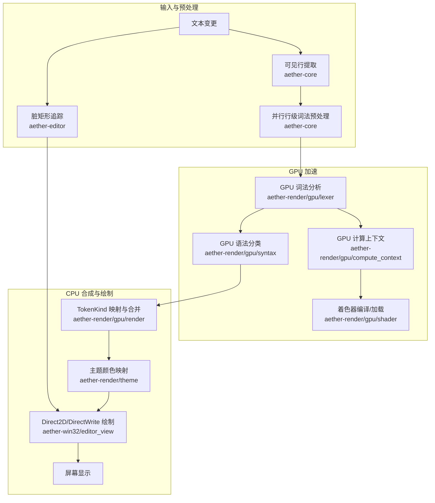
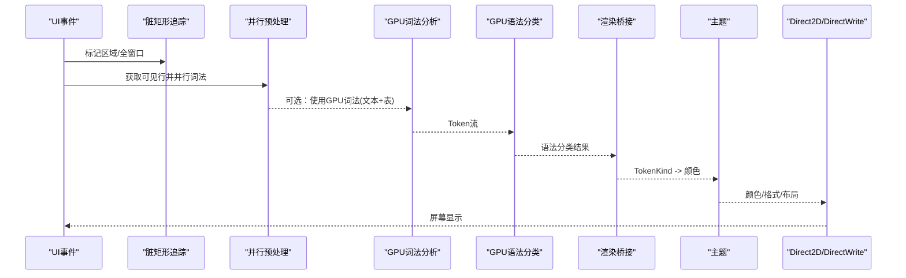
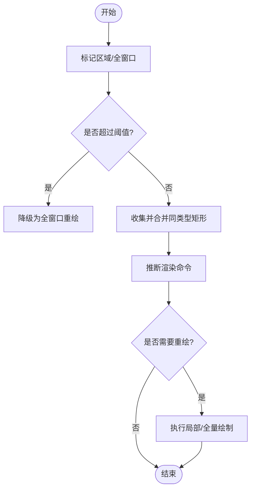
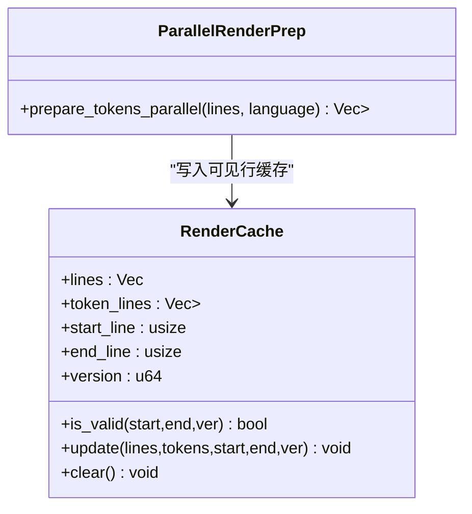
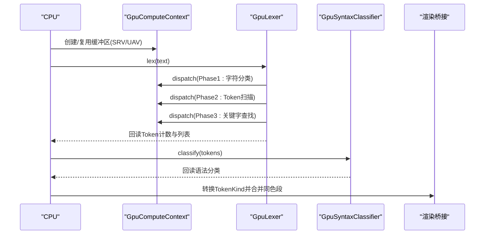
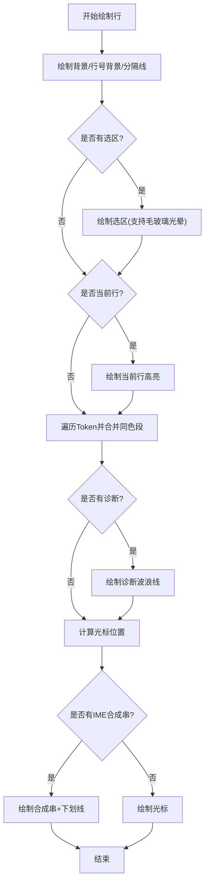
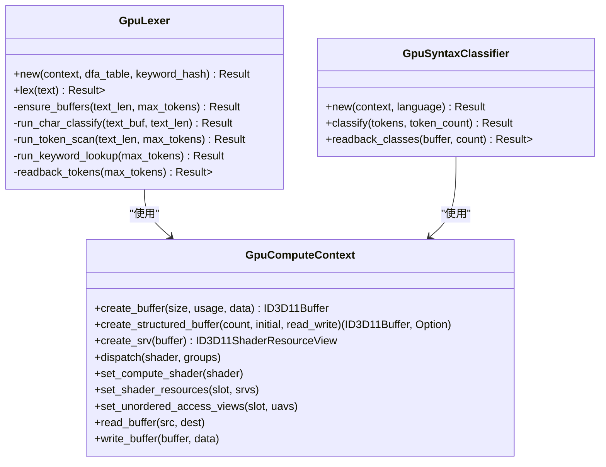
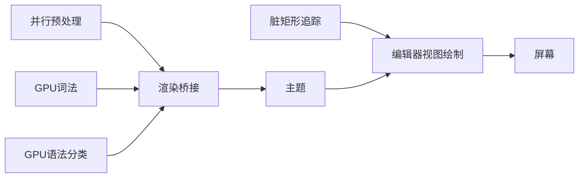

# 渲染流水线

<cite>
**本文引用的文件**
- [dirty_rect.rs](file://crates/aether-editor/src/dirty_rect.rs)
- [render_prep.rs](file://crates/aether-core/src/render_prep.rs)
- [lexer.rs](file://crates/aether-render/src/gpu/lexer.rs)
- [compute_context.rs](file://crates/aether-render/src/gpu/compute_context.rs)
- [shader.rs](file://crates/aether-render/src/gpu/shader.rs)
- [syntax.rs](file://crates/aether-render/src/gpu/syntax.rs)
- [render.rs](file://crates/aether-render/src/gpu/render.rs)
- [text.rs](file://crates/aether-render/src/d2d/text.rs)
- [theme.rs](file://crates/aether-render/src/theme.rs)
- [editor_view.rs](file://crates/aether-win32/src/render/editor_view.rs)
</cite>

## 目录
1. [简介](#简介)
2. [项目结构](#项目结构)
3. [核心组件](#核心组件)
4. [架构总览](#架构总览)
5. [详细组件分析](#详细组件分析)
6. [依赖关系分析](#依赖关系分析)
7. [性能考量](#性能考量)
8. [故障排查指南](#故障排查指南)
9. [结论](#结论)
10. [附录](#附录)

## 简介
本文件面向牧羊人编辑器的“渲染流水线”，从文本变更到屏幕显示，完整说明脏区域计算、增量更新与批量绘制优化；解释 GPU 加速渲染的实现（着色器程序、纹理上传与计算着色器）；描述 Direct2D/DirectWrite 的渲染管线（字体渲染、语法高亮与主题应用）；并提供性能监控与优化策略，帮助开发者理解图形数据的处理流程。

## 项目结构
渲染相关代码主要分布在以下模块：
- aether-editor: 脏矩形追踪与渲染命令推断
- aether-core: 并行行级词法预处理与可见行缓存
- aether-render: GPU 计算上下文、着色器编译、GPU 词法与语法分类、Direct2D 文本与主题
- aether-win32: 编辑器视图的实际绘制（背景、选区、行号、代码段、诊断波浪线、光标、内联补全、提示框等）

**图表来源**
- [dirty_rect.rs:87-366](file://crates/aether-editor/src/dirty_rect.rs#L87-L366)
- [render_prep.rs:13-67](file://crates/aether-core/src/render_prep.rs#L13-L67)
- [lexer.rs:48-221](file://crates/aether-render/src/gpu/lexer.rs#L48-L221)
- [compute_context.rs:17-242](file://crates/aether-render/src/gpu/compute_context.rs#L17-L242)
- [shader.rs:7-116](file://crates/aether-render/src/gpu/shader.rs#L7-L116)
- [syntax.rs:39-124](file://crates/aether-render/src/gpu/syntax.rs#L39-L124)
- [render.rs:7-126](file://crates/aether-render/src/gpu/render.rs#L7-L126)
- [theme.rs:8-279](file://crates/aether-render/src/theme.rs#L8-L279)
- [editor_view.rs:55-562](file://crates/aether-win32/src/render/editor_view.rs#L55-L562)

**章节来源**
- [dirty_rect.rs:87-366](file://crates/aether-editor/src/dirty_rect.rs#L87-L366)
- [render_prep.rs:13-67](file://crates/aether-core/src/render_prep.rs#L13-L67)
- [lexer.rs:48-221](file://crates/aether-render/src/gpu/lexer.rs#L48-L221)
- [compute_context.rs:17-242](file://crates/aether-render/src/gpu/compute_context.rs#L17-L242)
- [shader.rs:7-116](file://crates/aether-render/src/gpu/shader.rs#L7-L116)
- [syntax.rs:39-124](file://crates/aether-render/src/gpu/syntax.rs#L39-L124)
- [render.rs:7-126](file://crates/aether-render/src/gpu/render.rs#L7-L126)
- [theme.rs:8-279](file://crates/aether-render/src/theme.rs#L8-L279)
- [editor_view.rs:55-562](file://crates/aether-win32/src/render/editor_view.rs#L55-L562)

## 核心组件
- 脏矩形追踪器：记录需要重绘的区域类型与坐标，支持合并重叠区域与降级为全窗口重绘，提供渲染命令推断以跳过无变化帧。
- 并行渲染预处理：对可见行进行并行词法分析，生成每行的 LexemeSpan，并维护可见行缓存以避免重复计算。
- GPU 词法分析器：通过 D3D11 Compute Shader 完成字符分类、Token 扫描与关键字查找，输出 GPU Token。
- GPU 语法分类器：基于 Token 流与语言模式进行并行语法分类，产出 SyntaxClass。
- 渲染桥接：将 GPU Token 转换为 LexemeSpan，合并相邻同色段，映射为主题颜色。
- Direct2D/DirectWrite 绘制：按单元格网格对齐绘制代码段，处理选区、当前行高亮、诊断波浪线、光标与内联补全。
- 主题系统：定义 UI 与语法颜色，提供 TokenKind 到颜色的映射。

**章节来源**
- [dirty_rect.rs:87-366](file://crates/aether-editor/src/dirty_rect.rs#L87-L366)
- [render_prep.rs:13-67](file://crates/aether-core/src/render_prep.rs#L13-L67)
- [lexer.rs:48-221](file://crates/aether-render/src/gpu/lexer.rs#L48-L221)
- [syntax.rs:39-124](file://crates/aether-render/src/gpu/syntax.rs#L39-L124)
- [render.rs:7-126](file://crates/aether-render/src/gpu/render.rs#L7-L126)
- [editor_view.rs:55-562](file://crates/aether-win32/src/render/editor_view.rs#L55-L562)
- [theme.rs:8-279](file://crates/aether-render/src/theme.rs#L8-L279)

## 架构总览
下图展示从文本变更到屏幕显示的端到端流程，包括脏区域计算、增量更新、GPU 加速与 Direct2D 绘制。

**图表来源**
- [dirty_rect.rs:87-366](file://crates/aether-editor/src/dirty_rect.rs#L87-L366)
- [render_prep.rs:13-67](file://crates/aether-core/src/render_prep.rs#L13-L67)
- [lexer.rs:48-221](file://crates/aether-render/src/gpu/lexer.rs#L48-L221)
- [syntax.rs:39-124](file://crates/aether-render/src/gpu/syntax.rs#L39-L124)
- [render.rs:7-126](file://crates/aether-render/src/gpu/render.rs#L7-L126)
- [theme.rs:8-279](file://crates/aether-render/src/theme.rs#L8-L279)
- [editor_view.rs:55-562](file://crates/aether-win32/src/render/editor_view.rs#L55-L562)

## 详细组件分析

### 脏区域计算与增量更新
- 区域类型：标题栏、菜单栏、活动栏、侧边栏、编辑器内容、标签栏、状态栏、右侧面板、底部面板、对话框、全窗口。
- 合并策略：同类型相交矩形自动合并；超过阈值或数量过多时降级为全窗口重绘。
- 渲染命令推断：根据光标移动、选择变化、文本编辑、滚动、侧边栏/面板/状态变化等状态，推断最小必要重绘范围；无变化时返回“无需重绘”。

**图表来源**
- [dirty_rect.rs:87-366](file://crates/aether-editor/src/dirty_rect.rs#L87-L366)

**章节来源**
- [dirty_rect.rs:87-366](file://crates/aether-editor/src/dirty_rect.rs#L87-L366)

### 并行渲染预处理与可见行缓存
- 并行度：根据可用并行度设置线程池大小，行数较少时回退单线程。
- 可见行缓存：记录起始/结束行号与版本，避免重复计算；仅在可见范围变化或版本失效时更新。

**图表来源**
- [render_prep.rs:13-131](file://crates/aether-core/src/render_prep.rs#L13-L131)

**章节来源**
- [render_prep.rs:13-131](file://crates/aether-core/src/render_prep.rs#L13-L131)

### GPU 加速渲染（计算着色器、缓冲区与数据流）
- 计算上下文：封装 D3D11 设备与上下文，支持创建缓冲区、SRV/UAV、分派 Compute Shader、读写缓冲。
- 着色器编译：运行时编译 HLSL 为 CSO，或直接加载预编译字节码；提供便捷方法编译各阶段 Shader。
- GPU 词法分析：三阶段流水线（字符分类 → Token 扫描 → 关键字查找），输出 GpuToken。
- GPU 语法分类：基于 Token 序列与语言模式并行识别函数声明/调用、类型名、变量、字段访问、宏等。

**图表来源**
- [compute_context.rs:17-242](file://crates/aether-render/src/gpu/compute_context.rs#L17-L242)
- [shader.rs:7-116](file://crates/aether-render/src/gpu/shader.rs#L7-L116)
- [lexer.rs:48-221](file://crates/aether-render/src/gpu/lexer.rs#L48-L221)
- [syntax.rs:39-124](file://crates/aether-render/src/gpu/syntax.rs#L39-L124)
- [render.rs:7-126](file://crates/aether-render/src/gpu/render.rs#L7-L126)

**章节来源**
- [compute_context.rs:17-242](file://crates/aether-render/src/gpu/compute_context.rs#L17-L242)
- [shader.rs:7-116](file://crates/aether-render/src/gpu/shader.rs#L7-L116)
- [lexer.rs:48-221](file://crates/aether-render/src/gpu/lexer.rs#L48-L221)
- [syntax.rs:39-124](file://crates/aether-render/src/gpu/syntax.rs#L39-L124)
- [render.rs:7-126](file://crates/aether-render/src/gpu/render.rs#L7-L126)

### Direct2D/DirectWrite 渲染管线（字体、高亮与主题）
- 字体与度量：使用 DirectWrite 创建文本格式，实测等宽字体单字符宽度与行高，支持 DPI 缩放与字体大小调整。
- 代码段绘制：按单元格网格对齐绘制同色代码段；窄字符整段绘制，含宽字符时切分为窄区间与宽字符单独绘制，确保命中与视觉一致。
- 语法高亮：从缓存的 LexemeSpan 读取 token 类型，映射为主题颜色，合并相邻同色段减少绘制调用。
- 主题应用：主题对象提供 UI 与语法颜色；TokenKind 到颜色映射由主题决定。

**图表来源**
- [text.rs:19-153](file://crates/aether-render/src/d2d/text.rs#L19-L153)
- [editor_view.rs:55-562](file://crates/aether-win32/src/render/editor_view.rs#L55-L562)
- [theme.rs:8-279](file://crates/aether-render/src/theme.rs#L8-L279)
- [render.rs:7-126](file://crates/aether-render/src/gpu/render.rs#L7-L126)

**章节来源**
- [text.rs:19-153](file://crates/aether-render/src/d2d/text.rs#L19-L153)
- [editor_view.rs:55-562](file://crates/aether-win32/src/render/editor_view.rs#L55-L562)
- [theme.rs:8-279](file://crates/aether-render/src/theme.rs#L8-L279)
- [render.rs:7-126](file://crates/aether-render/src/gpu/render.rs#L7-L126)

### 类图：GPU 词法与语法分类组件

**图表来源**
- [compute_context.rs:17-242](file://crates/aether-render/src/gpu/compute_context.rs#L17-L242)
- [lexer.rs:48-221](file://crates/aether-render/src/gpu/lexer.rs#L48-L221)
- [syntax.rs:39-124](file://crates/aether-render/src/gpu/syntax.rs#L39-L124)

**章节来源**
- [compute_context.rs:17-242](file://crates/aether-render/src/gpu/compute_context.rs#L17-L242)
- [lexer.rs:48-221](file://crates/aether-render/src/gpu/lexer.rs#L48-L221)
- [syntax.rs:39-124](file://crates/aether-render/src/gpu/syntax.rs#L39-L124)

## 依赖关系分析
- 脏矩形追踪器依赖 UI 状态变化，输出最小重绘范围。
- 并行预处理依赖语言词法器，输出每行 LexemeSpan。
- GPU 词法与语法分类依赖 D3D11 上下文与着色器资源。
- 渲染桥接依赖 GPU 输出与主题映射。
- Direct2D 绘制依赖文本格式、布局缓存与主题颜色。

**图表来源**
- [dirty_rect.rs:87-366](file://crates/aether-editor/src/dirty_rect.rs#L87-L366)
- [render_prep.rs:13-67](file://crates/aether-core/src/render_prep.rs#L13-L67)
- [lexer.rs:48-221](file://crates/aether-render/src/gpu/lexer.rs#L48-L221)
- [syntax.rs:39-124](file://crates/aether-render/src/gpu/syntax.rs#L39-L124)
- [render.rs:7-126](file://crates/aether-render/src/gpu/render.rs#L7-L126)
- [theme.rs:8-279](file://crates/aether-render/src/theme.rs#L8-L279)
- [editor_view.rs:55-562](file://crates/aether-win32/src/render/editor_view.rs#L55-L562)

**章节来源**
- [dirty_rect.rs:87-366](file://crates/aether-editor/src/dirty_rect.rs#L87-L366)
- [render_prep.rs:13-67](file://crates/aether-core/src/render_prep.rs#L13-L67)
- [lexer.rs:48-221](file://crates/aether-render/src/gpu/lexer.rs#L48-L221)
- [syntax.rs:39-124](file://crates/aether-render/src/gpu/syntax.rs#L39-L124)
- [render.rs:7-126](file://crates/aether-render/src/gpu/render.rs#L7-L126)
- [theme.rs:8-279](file://crates/aether-render/src/theme.rs#L8-L279)
- [editor_view.rs:55-562](file://crates/aether-win32/src/render/editor_view.rs#L55-L562)

## 性能考量
- 脏区域合并与降级：当局部脏矩形过多时自动降级为全窗口重绘，避免过多绘制调用。
- 可见行缓存：仅对可见行进行词法分析与布局，减少无效计算。
- 并行预处理：利用 rayon 线程池并行处理多行，降低 CPU 瓶颈。
- GPU 加速：三阶段 Compute Shader 流水线并行处理字符分类、Token 扫描与关键字查找，适合大规模文本。
- 合并同色段：将相邻相同类型的 token 合并为一段，显著减少 DrawText 调用次数。
- 单元格网格对齐：避免 CJK 宽字符导致的字形漂移，保证命中与视觉一致性。
- 主题与格式缓存：Brush/TextFormat/Layout 缓存减少 COM 对象创建与内存分配。

[本节为通用性能建议，不直接分析具体文件]

## 故障排查指南
- GPU 词法失败：检查着色器字节码是否为空或编译失败；确认 D3D11 设备与上下文初始化成功。
- 缓冲区尺寸不足：确保工作缓冲区在 ensure_buffers 中按需扩容；关注最大 Token 数估算。
- 回读为空：检查 token 计数 UAV 是否正确创建与写入；确认 read_buffer 长度与偏移正确。
- 绘制错位：确认文本按单元格网格对齐；检查水平滚动偏移与裁剪区域设置。
- 主题颜色异常：核对 TokenKind 到颜色映射；验证语义 token 索引映射。

**章节来源**
- [compute_context.rs:96-114](file://crates/aether-render/src/gpu/compute_context.rs#L96-L114)
- [lexer.rs:258-314](file://crates/aether-render/src/gpu/lexer.rs#L258-L314)
- [lexer.rs:372-401](file://crates/aether-render/src/gpu/lexer.rs#L372-L401)
- [editor_view.rs:275-391](file://crates/aether-win32/src/render/editor_view.rs#L275-L391)
- [theme.rs:213-279](file://crates/aether-render/src/theme.rs#L213-L279)

## 结论
本渲染流水线通过脏区域计算与可见行缓存实现增量更新，结合 GPU 三阶段词法与语法分类提升大规模文本处理能力，并在 Direct2D/DirectWrite 层采用单元格网格对齐与同色段合并优化绘制性能。主题系统统一了 UI 与语法高亮配色，确保一致的视觉体验。通过合理的资源管理与缓存策略，系统在交互流畅性与渲染效率之间取得平衡。

[本节为总结性内容，不直接分析具体文件]

## 附录
- 术语
  - Token：源代码的最小语义单元（关键字、标识符、字符串等）。
  - LexemeSpan：包含起始位置、长度与类型的词法片段。
  - SyntaxClass：语法分类结果，包含类别与置信度。
  - SRV/UAV：着色器资源视图/无序访问视图，用于 GPU 读写数据。
  - 脏矩形：需要重绘的屏幕区域。

[本节为概念性内容，不直接分析具体文件]