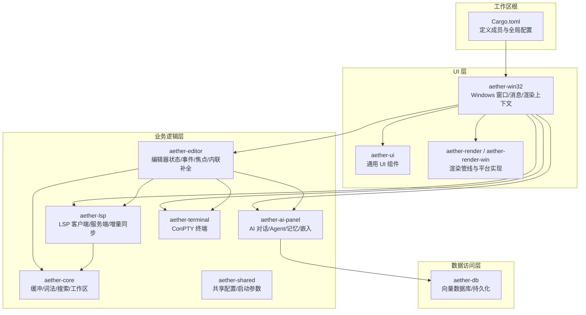
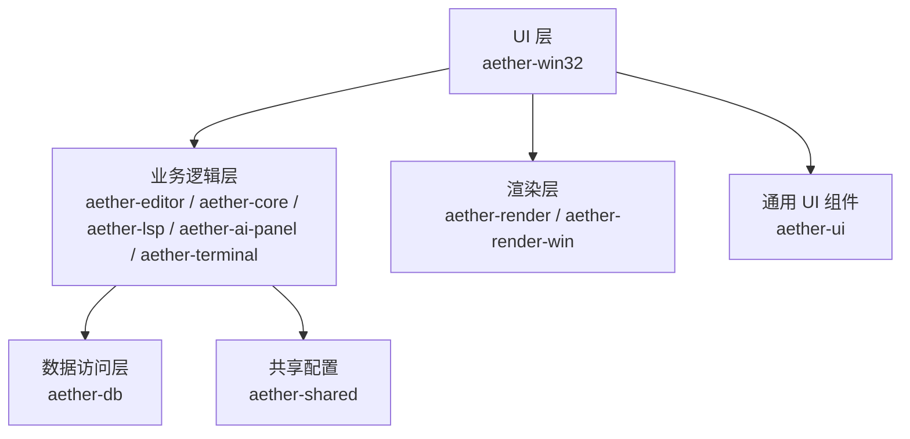
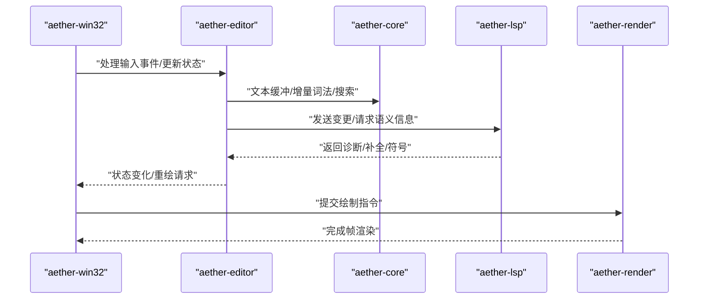
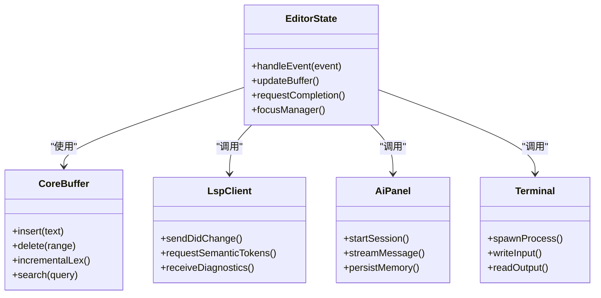
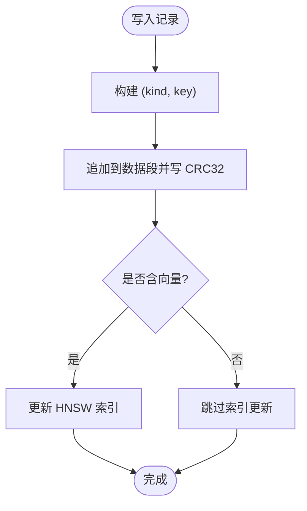
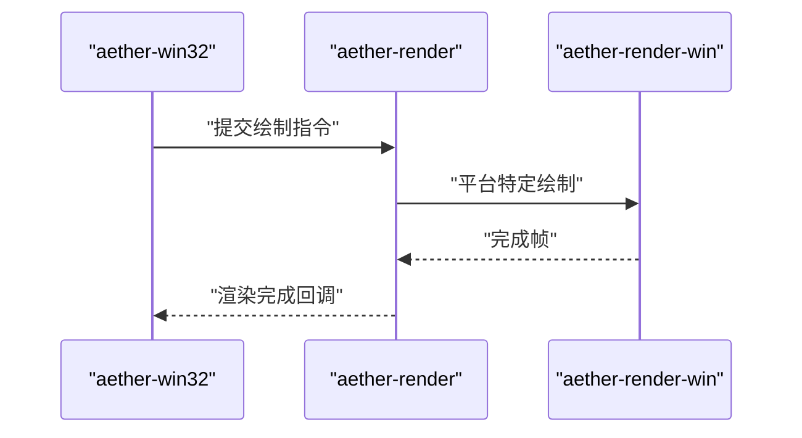
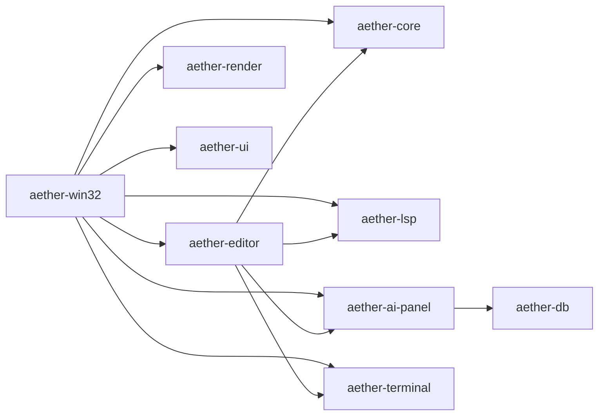

# 整体架构设计

<cite>
**本文引用的文件**
- [Cargo.toml](file://Cargo.toml)
- [aether-win32/Cargo.toml](file://crates/aether-win32/Cargo.toml)
- [aether-core/Cargo.toml](file://crates/aether-core/Cargo.toml)
- [aether-editor/Cargo.toml](file://crates/aether-editor/Cargo.toml)
- [aether-db/Cargo.toml](file://crates/aether-db/Cargo.toml)
- [aether-core/src/lib.rs](file://crates/aether-core/src/lib.rs)
- [aether-editor/src/lib.rs](file://crates/aether-editor/src/lib.rs)
- [aether-db/src/lib.rs](file://crates/aether-db/src/lib.rs)
- [aether-win32/src/lib.rs](file://crates/aether-win32/src/lib.rs)
- [aether-shared/src/lib.rs](file://crates/aether-shared/src/lib.rs)
- [aether-render/src/lib.rs](file://crates/aether-render/src/lib.rs)
- [aether-ui/src/lib.rs](file://crates/aether-ui/src/lib.rs)
- [aether-ai-panel/src/lib.rs](file://crates/aether-ai-panel/src/lib.rs)
- [aether-lsp/src/lib.rs](file://crates/aether-lsp/src/lib.rs)
- [aether-terminal/src/lib.rs](file://crates/aether-terminal/src/lib.rs)
</cite>

## 目录
1. [简介](#简介)
2. [项目结构](#项目结构)
3. [核心组件](#核心组件)
4. [架构总览](#架构总览)
5. [详细组件分析](#详细组件分析)
6. [依赖关系分析](#依赖关系分析)
7. [性能考量](#性能考量)
8. [故障排查指南](#故障排查指南)
9. [结论](#结论)
10. [附录](#附录)

## 简介
本文件为牧羊人编辑器的整体架构设计文档，聚焦于基于 Cargo Workspace 的多 Crate 架构模式与分层架构设计原则。系统采用清晰的三层职责划分：
- UI 层（aether-win32）：负责 Windows 平台窗口、消息循环、渲染上下文与用户交互编排。
- 业务逻辑层（aether-editor、aether-core、aether-lsp、aether-ai-panel、aether-terminal 等）：封装编辑器状态、事件、增量语法高亮、LSP 集成、AI 面板与终端能力。
- 数据访问层（aether-db）：提供自研轻量级嵌入式向量数据库与持久化存储抽象。

选择该架构的原因与优势：
- 职责清晰、边界明确：UI 不直接操作底层数据结构或存储，降低耦合度。
- 可测试性与可复用性：核心与业务逻辑以库形式存在，便于单元测试与跨平台复用。
- 扩展性强：新增语言支持、插件、远程能力只需在对应 crate 中扩展，不影响其他层。
- 构建与发布可控：通过 workspace 统一管理版本、依赖与发布配置，利于持续集成。

## 项目结构
仓库采用 Cargo Workspace 组织多个 crate，顶层 Cargo.toml 声明成员 crate 与全局包信息，各 crate 独立管理自身依赖与模块。关键成员包括：
- aether-core：文本缓冲、词法分析、工作区、搜索、增量解析等基础能力。
- aether-editor：编辑器核心状态机、事件系统、焦点管理、内联补全、脏矩形等。
- aether-win32：Windows 应用入口、窗口与消息处理、渲染上下文、UI 编排。
- aether-lsp：LSP 客户端/服务端通信、增量同步、语义令牌。
- aether-ai-panel：AI 对话、Agent、记忆与嵌入、持久化。
- aether-terminal：ConPTY 终端面板。
- aether-render / aether-render-win：渲染管线与平台渲染上下文。
- aether-ui：通用 UI 组件（设置、命令面板、菜单、活动栏等）。
- aether-db：自研向量数据库与存储抽象。
- aether-shared：共享配置与启动参数。

图表来源
- [Cargo.toml:1-19](file://Cargo.toml#L1-L19)
- [aether-win32/Cargo.toml:14-23](file://crates/aether-win32/Cargo.toml#L14-L23)
- [aether-editor/Cargo.toml:6-14](file://crates/aether-editor/Cargo.toml#L6-L14)
- [aether-core/Cargo.toml:6-13](file://crates/aether-core/Cargo.toml#L6-L13)
- [aether-db/Cargo.toml:6-7](file://crates/aether-db/Cargo.toml#L6-L7)

章节来源
- [Cargo.toml:1-37](file://Cargo.toml#L1-L37)

## 核心组件
- aether-core：提供文本缓冲、增量词法分析、工作区遍历、搜索与 SIMD 工具等基础能力，是编辑器性能的关键。
- aether-editor：维护编辑器状态、事件分发、焦点管理、内联补全、脏矩形计算等，协调上层 UI 与下层核心。
- aether-win32：Windows 应用主入口，负责窗口创建、消息循环、键盘/鼠标输入、渲染上下文初始化与各功能模块编排。
- aether-lsp：实现 LSP 协议通信、增量同步与语义令牌，为代码智能提供支撑。
- aether-ai-panel：管理 AI 会话、Agent、记忆存储与嵌入检索，结合 aether-db 进行持久化。
- aether-terminal：基于 ConPTY 的终端面板，支持命令执行与输出缓冲。
- aether-render / aether-render-win：GPU/Direct2D 渲染管线与平台相关渲染上下文。
- aether-ui：通用 UI 组件集合，供 UI 层复用。
- aether-db：自研轻量级嵌入式向量数据库，提供 HNSW 索引、标量过滤、追加式持久化与压缩回收。
- aether-shared：共享配置与启动参数，供多 crate 使用。

章节来源
- [aether-core/src/lib.rs:1-12](file://crates/aether-core/src/lib.rs#L1-L12)
- [aether-editor/src/lib.rs:1-9](file://crates/aether-editor/src/lib.rs#L1-L9)
- [aether-win32/src/lib.rs:1-58](file://crates/aether-win32/src/lib.rs#L1-L58)
- [aether-lsp/src/lib.rs:1-16](file://crates/aether-lsp/src/lib.rs#L1-L16)
- [aether-ai-panel/src/lib.rs:1-14](file://crates/aether-ai-panel/src/lib.rs#L1-L14)
- [aether-terminal/src/lib.rs:1-8](file://crates/aether-terminal/src/lib.rs#L1-L8)
- [aether-render/src/lib.rs:1-5](file://crates/aether-render/src/lib.rs#L1-L5)
- [aether-ui/src/lib.rs:1-34](file://crates/aether-ui/src/lib.rs#L1-L34)
- [aether-db/src/lib.rs:1-38](file://crates/aether-db/src/lib.rs#L1-L38)
- [aether-shared/src/lib.rs:1-3](file://crates/aether-shared/src/lib.rs#L1-L3)

## 架构总览
系统遵循“UI 层—业务逻辑层—数据访问层”的分层架构，配合 Cargo Workspace 的多 crate 组织方式，形成高内聚、低耦合的可扩展体系。

图表来源
- [aether-win32/Cargo.toml:14-23](file://crates/aether-win32/Cargo.toml#L14-L23)
- [aether-editor/Cargo.toml:6-14](file://crates/aether-editor/Cargo.toml#L6-L14)
- [aether-db/Cargo.toml:6-7](file://crates/aether-db/Cargo.toml#L6-L7)
- [aether-shared/src/lib.rs:1-3](file://crates/aether-shared/src/lib.rs#L1-L3)

章节来源
- [aether-win32/Cargo.toml:14-23](file://crates/aether-win32/Cargo.toml#L14-L23)
- [aether-editor/Cargo.toml:6-14](file://crates/aether-editor/Cargo.toml#L6-L14)
- [aether-db/Cargo.toml:6-7](file://crates/aether-db/Cargo.toml#L6-L7)

## 详细组件分析

### UI 层（aether-win32）
- 职责边界：负责 Windows 平台窗口生命周期、消息循环、输入事件捕获、渲染上下文初始化与各功能模块的编排；不直接持有编辑器核心数据结构。
- 交互方式：调用 aether-editor 的事件系统与状态管理，调用 aether-lsp 进行语言服务交互，调用 aether-ai-panel 与 aether-terminal 提供扩展能力，调用 aether-render 完成绘制。
- 设计要点：将平台相关细节隔离在 UI 层，保证业务逻辑可移植与可测试。

图表来源
- [aether-win32/src/lib.rs:1-58](file://crates/aether-win32/src/lib.rs#L1-L58)
- [aether-editor/src/lib.rs:1-9](file://crates/aether-editor/src/lib.rs#L1-L9)
- [aether-core/src/lib.rs:1-12](file://crates/aether-core/src/lib.rs#L1-L12)
- [aether-lsp/src/lib.rs:1-16](file://crates/aether-lsp/src/lib.rs#L1-L16)
- [aether-render/src/lib.rs:1-5](file://crates/aether-render/src/lib.rs#L1-L5)

章节来源
- [aether-win32/src/lib.rs:1-58](file://crates/aether-win32/src/lib.rs#L1-L58)

### 业务逻辑层（aether-editor、aether-core、aether-lsp、aether-ai-panel、aether-terminal）
- aether-editor：维护编辑器状态机、事件分发、焦点管理、内联补全、脏矩形计算；协调 UI 与核心能力。
- aether-core：提供高性能文本缓冲、增量词法分析、工作区遍历、搜索与 SIMD 工具；是编辑器性能基石。
- aether-lsp：实现 LSP 客户端/服务端通信、增量同步与语义令牌；为代码智能提供支撑。
- aether-ai-panel：管理 AI 会话、Agent、记忆存储与嵌入检索；结合 aether-db 进行持久化。
- aether-terminal：基于 ConPTY 的终端面板，支持命令执行与输出缓冲。

图表来源
- [aether-editor/src/lib.rs:1-9](file://crates/aether-editor/src/lib.rs#L1-L9)
- [aether-core/src/lib.rs:1-12](file://crates/aether-core/src/lib.rs#L1-L12)
- [aether-lsp/src/lib.rs:1-16](file://crates/aether-lsp/src/lib.rs#L1-L16)
- [aether-ai-panel/src/lib.rs:1-14](file://crates/aether-ai-panel/src/lib.rs#L1-L14)
- [aether-terminal/src/lib.rs:1-8](file://crates/aether-terminal/src/lib.rs#L1-L8)

章节来源
- [aether-editor/src/lib.rs:1-9](file://crates/aether-editor/src/lib.rs#L1-L9)
- [aether-core/src/lib.rs:1-12](file://crates/aether-core/src/lib.rs#L1-L12)
- [aether-lsp/src/lib.rs:1-16](file://crates/aether-lsp/src/lib.rs#L1-L16)
- [aether-ai-panel/src/lib.rs:1-14](file://crates/aether-ai-panel/src/lib.rs#L1-L14)
- [aether-terminal/src/lib.rs:1-8](file://crates/aether-terminal/src/lib.rs#L1-L8)

### 数据访问层（aether-db）
- 职责边界：提供自研轻量级嵌入式向量数据库，包含 HNSW 近似最近邻索引、标量过滤、追加式持久化与压缩回收；对外暴露统一 API。
- 交互方式：被 aether-ai-panel 用于会话与记忆的持久化与检索；对上层屏蔽存储细节。
- 设计要点：纯 Rust 零外部依赖，单文件持久化，崩溃安全，空间回收与 compaction。

图表来源
- [aether-db/src/lib.rs:1-38](file://crates/aether-db/src/lib.rs#L1-L38)

章节来源
- [aether-db/src/lib.rs:1-38](file://crates/aether-db/src/lib.rs#L1-L38)

### 渲染层（aether-render / aether-render-win）
- 职责边界：提供 GPU/Direct2D 渲染管线与平台相关渲染上下文；接收来自 UI 层的绘制指令并完成帧渲染。
- 交互方式：由 aether-win32 初始化渲染上下文并提交绘制任务；与 aether-ui 协作完成主题与图标加载。

图表来源
- [aether-render/src/lib.rs:1-5](file://crates/aether-render/src/lib.rs#L1-L5)
- [aether-win32/Cargo.toml:14-23](file://crates/aether-win32/Cargo.toml#L14-L23)

章节来源
- [aether-render/src/lib.rs:1-5](file://crates/aether-render/src/lib.rs#L1-L5)

### 通用 UI 组件（aether-ui）
- 职责边界：提供设置面板、欢迎页、命令面板、菜单栏、活动栏、状态栏等通用 UI 组件；供 UI 层复用。
- 交互方式：被 aether-win32 组合成完整界面；与 aether-shared 共享配置。

章节来源
- [aether-ui/src/lib.rs:1-34](file://crates/aether-ui/src/lib.rs#L1-L34)
- [aether-shared/src/lib.rs:1-3](file://crates/aether-shared/src/lib.rs#L1-L3)

## 依赖关系分析
- 工作区依赖：顶层 Cargo.toml 声明所有成员 crate，统一版本与发布配置。
- UI 层依赖：aether-win32 依赖 aether-editor、aether-core、aether-lsp、aether-ai-panel、aether-terminal、aether-render、aether-ui 等，体现其作为编排层的角色。
- 业务逻辑层依赖：aether-editor 依赖 aether-core、aether-lsp、aether-ai-panel、aether-terminal、aether-render、aether-ui；aether-lsp 与 aether-core 协同提供语言智能。
- 数据访问层依赖：aether-db 仅依赖 memmap2，保持轻量与稳定；被 aether-ai-panel 使用。

图表来源
- [Cargo.toml:1-19](file://Cargo.toml#L1-L19)
- [aether-win32/Cargo.toml:14-23](file://crates/aether-win32/Cargo.toml#L14-L23)
- [aether-editor/Cargo.toml:6-14](file://crates/aether-editor/Cargo.toml#L6-L14)
- [aether-db/Cargo.toml:6-7](file://crates/aether-db/Cargo.toml#L6-L7)

章节来源
- [Cargo.toml:1-37](file://Cargo.toml#L1-L37)
- [aether-win32/Cargo.toml:14-23](file://crates/aether-win32/Cargo.toml#L14-L23)
- [aether-editor/Cargo.toml:6-14](file://crates/aether-editor/Cargo.toml#L6-L14)
- [aether-db/Cargo.toml:6-7](file://crates/aether-db/Cargo.toml#L6-L7)

## 性能考量
- 增量词法与缓冲：aether-core 提供增量词法分析与高效缓冲，减少重复解析开销。
- 并行与 SIMD：利用 rayon 与 SIMD 工具提升文本处理性能。
- 渲染优化：GPU/Direct2D 渲染管线与脏矩形计算减少重绘区域。
- 存储优化：aether-db 采用追加式数据段与 compaction，控制垃圾回收阈值，保障写入与检索性能。
- 构建优化：workspace 启用 LTO、优化级别与 strip，提升发布性能与体积。

[本节为通用性能讨论，不直接分析具体文件]

## 故障排查指南
- 启动失败：检查 aether-win32 的窗口与渲染上下文初始化流程，确认依赖 crate 正确编译与链接。
- 渲染异常：验证 aether-render 与 aether-render-win 的平台实现是否正确加载；检查主题与图标资源。
- LSP 通信问题：确认 aether-lsp 的传输与增量同步模块正常；查看日志定位连接与消息错误。
- AI 面板持久化：检查 aether-db 的存储路径与权限；验证 HNSW 索引重建与 compaction 是否正常。
- 终端不可用：确认 ConPTY 初始化成功；检查进程创建与 IO 管道。

章节来源
- [aether-win32/src/lib.rs:1-58](file://crates/aether-win32/src/lib.rs#L1-L58)
- [aether-lsp/src/lib.rs:1-16](file://crates/aether-lsp/src/lib.rs#L1-L16)
- [aether-db/src/lib.rs:1-38](file://crates/aether-db/src/lib.rs#L1-L38)
- [aether-terminal/src/lib.rs:1-8](file://crates/aether-terminal/src/lib.rs#L1-L8)

## 结论
本架构通过 Cargo Workspace 的多 crate 组织与清晰的三层职责划分，实现了高内聚、低耦合、可扩展的编辑器系统。UI 层专注平台交互与编排，业务逻辑层封装编辑器核心能力与语言智能，数据访问层提供稳定高效的持久化与检索。该模式带来良好的可测试性、可复用性与扩展性，适合长期演进与团队协作。

[本节为总结性内容，不直接分析具体文件]

## 附录
- 构建与发布：workspace 统一版本与发布配置，启用 LTO、优化级别与 strip，确保发布性能与体积。
- 测试与基准：aether-core 提供基准测试，便于评估性能改进。
- 脚本与迁移：scripts 目录提供构建、迁移与清理脚本，辅助开发与发布流程。

[本节为补充信息，不直接分析具体文件]