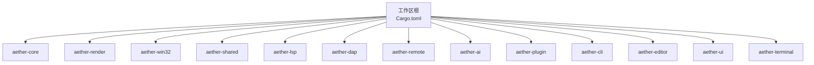
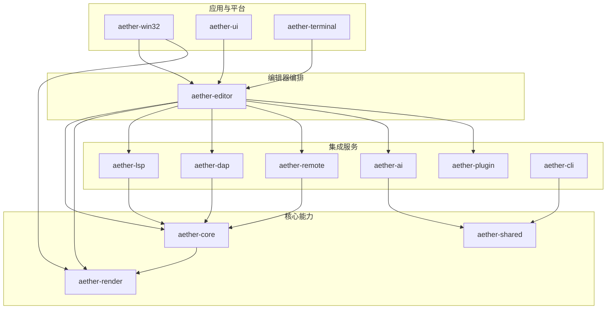
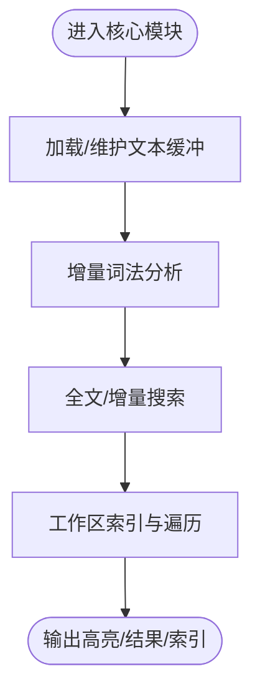
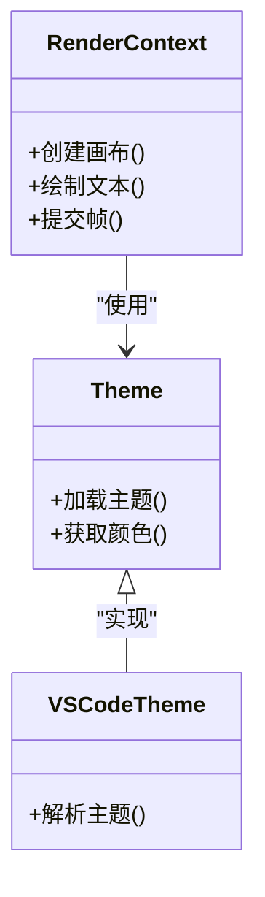
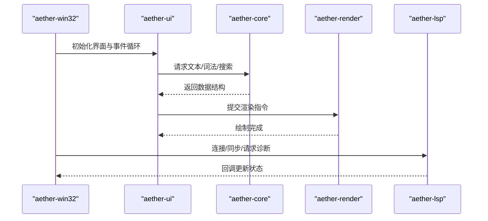
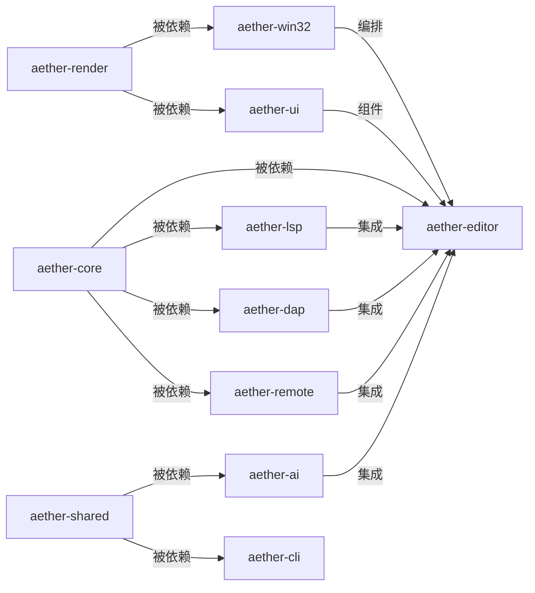

# 架构概览

<cite>
**本文引用的文件**
- [Cargo.toml](file://Cargo.toml)
- [aether-core/Cargo.toml](file://crates/aether-core/Cargo.toml)
- [aether-core/src/lib.rs](file://crates/aether-core/src/lib.rs)
- [aether-render/Cargo.toml](file://crates/aether-render/Cargo.toml)
- [aether-render/src/lib.rs](file://crates/aether-render/src/lib.rs)
- [aether-win32/Cargo.toml](file://crates/aether-win32/Cargo.toml)
- [aether-win32/src/lib.rs](file://crates/aether-win32/src/lib.rs)
- [aether-shared/Cargo.toml](file://crates/aether-shared/Cargo.toml)
- [aether-shared/src/lib.rs](file://crates/aether-shared/src/lib.rs)
- [aether-lsp/Cargo.toml](file://crates/aether-lsp/Cargo.toml)
- [aether-lsp/src/lib.rs](file://crates/aether-lsp/src/lib.rs)
- [aether-dap/Cargo.toml](file://crates/aether-dap/Cargo.toml)
- [aether-dap/src/lib.rs](file://crates/aether-dap/src/lib.rs)
- [aether-remote/Cargo.toml](file://crates/aether-remote/Cargo.toml)
- [aether-ai/Cargo.toml](file://crates/aether-ai/Cargo.toml)
- [aether-plugin/Cargo.toml](file://crates/aether-plugin/Cargo.toml)
- [aether-cli/Cargo.toml](file://crates/aether-cli/Cargo.toml)
- [aether-editor/Cargo.toml](file://crates/aether-editor/Cargo.toml)
- [aether-ui/Cargo.toml](file://crates/aether-ui/Cargo.toml)
- [aether-terminal/Cargo.toml](file://crates/aether-terminal/Cargo.toml)
</cite>

## 目录
1. [简介](#简介)
2. [项目结构](#项目结构)
3. [核心组件](#核心组件)
4. [架构总览](#架构总览)
5. [详细组件分析](#详细组件分析)
6. [依赖关系分析](#依赖关系分析)
7. [性能考量](#性能考量)
8. [故障排查指南](#故障排查指南)
9. [结论](#结论)
10. [附录](#附录)

## 简介
本文件为牧羊人编辑器的架构概览，聚焦 Cargo Workspace 的多 Crate 设计与分层架构。文档围绕以下核心模块展开：aether-core（编辑器核心）、aether-render（渲染抽象）、aether-win32（Windows 原生 UI 层）、aether-shared（共享配置）、aether-lsp（LSP 客户端）、aether-dap（DAP 客户端）、aether-remote（远程操作）、aether-ai（AI 服务接口）、aether-plugin（插件系统）、aether-cli（命令行工具）。通过架构图与数据流说明，帮助开发者理解整体系统设计、模块职责与交互边界。

## 项目结构
本项目采用 Rust Workspace 组织多 Crate，顶层 Cargo.toml 声明所有成员 crate，统一版本、发行配置与解析器。各 crate 按职责拆分，形成“核心能力—UI/平台—集成服务”的分层结构。

**图表来源**
- [Cargo.toml:1-19](file://Cargo.toml#L1-L19)

**章节来源**
- [Cargo.toml:1-37](file://Cargo.toml#L1-L37)

## 核心组件
- aether-core：编辑器内核，提供缓冲区、增量词法分析、搜索、工作区等基础能力，是上层模块的基石。
- aether-render：渲染抽象层，封装 Direct2D/DirectWrite/Direct3D/GPU 管线，向上提供主题与渲染上下文。
- aether-win32：Windows 原生应用入口与 UI 编排，整合窗口、事件、菜单、对话框、终端、设置等子系统。
- aether-shared：跨 crate 的配置与启动参数模型，统一序列化格式与路径策略。
- aether-lsp：语言服务器协议客户端，负责连接、同步、语义令牌与增量同步。
- aether-dap：调试适配器协议客户端，管理调试会话与传输。
- aether-remote：远程文件系统与 Git 操作抽象，支持 SSH/容器等后端。
- aether-ai：AI 服务接口，封装 HTTP 调用与配置。
- aether-plugin：插件系统与权限、注册表、运行时管理。
- aether-cli：命令行工具，提供清理、迁移等运维命令。
- aether-editor：编辑器高层编排，组合 core/render/lsp/ai-panel/terminal/ui/remote 等能力。
- aether-ui：通用 UI 组件库，面向 Windows 的控件与交互逻辑。
- aether-terminal：终端子系统，封装 ConPTY 与进程管理。

**章节来源**
- [aether-core/Cargo.toml:1-22](file://crates/aether-core/Cargo.toml#L1-L22)
- [aether-core/src/lib.rs:1-12](file://crates/aether-core/src/lib.rs#L1-L12)
- [aether-render/Cargo.toml:1-12](file://crates/aether-render/Cargo.toml#L1-L12)
- [aether-render/src/lib.rs:1-5](file://crates/aether-render/src/lib.rs#L1-L5)
- [aether-win32/Cargo.toml:1-44](file://crates/aether-win32/Cargo.toml#L1-L44)
- [aether-win32/src/lib.rs:1-58](file://crates/aether-win32/src/lib.rs#L1-L58)
- [aether-shared/Cargo.toml:1-13](file://crates/aether-shared/Cargo.toml#L1-L13)
- [aether-shared/src/lib.rs:1-3](file://crates/aether-shared/src/lib.rs#L1-L3)
- [aether-lsp/Cargo.toml:1-20](file://crates/aether-lsp/Cargo.toml#L1-L20)
- [aether-lsp/src/lib.rs:1-16](file://crates/aether-lsp/src/lib.rs#L1-L16)
- [aether-dap/Cargo.toml:1-19](file://crates/aether-dap/Cargo.toml#L1-L19)
- [aether-dap/src/lib.rs:1-8](file://crates/aether-dap/src/lib.rs#L1-L8)
- [aether-remote/Cargo.toml:1-13](file://crates/aether-remote/Cargo.toml#L1-L13)
- [aether-ai/Cargo.toml:1-12](file://crates/aether-ai/Cargo.toml#L1-L12)
- [aether-plugin/Cargo.toml:1-9](file://crates/aether-plugin/Cargo.toml#L1-L9)
- [aether-cli/Cargo.toml:1-23](file://crates/aether-cli/Cargo.toml#L1-L23)
- [aether-editor/Cargo.toml:1-24](file://crates/aether-editor/Cargo.toml#L1-L24)
- [aether-ui/Cargo.toml:1-23](file://crates/aether-ui/Cargo.toml#L1-L23)
- [aether-terminal/Cargo.toml:1-10](file://crates/aether-terminal/Cargo.toml#L1-L10)

## 架构总览
分层设计原则：
- 核心层（Core）：无平台依赖，提供文本、词法、搜索与工作区能力。
- 渲染层（Render）：抽象 GPU/D2D/DW 渲染细节，暴露主题与渲染上下文。
- 平台/应用层（Win32/UI）：承载窗口消息、输入、菜单、对话框、终端等。
- 集成层（LSP/DAP/Remote/AI/Plugin）：对接外部协议与服务，解耦业务与通信。
- 编排层（Editor）：组合核心、渲染与集成能力，驱动用户界面与业务流程。

**图表来源**
- [aether-win32/Cargo.toml:14-23](file://crates/aether-win32/Cargo.toml#L14-L23)
- [aether-editor/Cargo.toml:6-14](file://crates/aether-editor/Cargo.toml#L6-L14)
- [aether-lsp/Cargo.toml:6-16](file://crates/aether-lsp/Cargo.toml#L6-L16)
- [aether-dap/Cargo.toml:6-15](file://crates/aether-dap/Cargo.toml#L6-L15)
- [aether-remote/Cargo.toml:6-10](file://crates/aether-remote/Cargo.toml#L6-L10)
- [aether-ai/Cargo.toml:6-12](file://crates/aether-ai/Cargo.toml#L6-L12)
- [aether-cli/Cargo.toml:13-20](file://crates/aether-cli/Cargo.toml#L13-L20)

## 详细组件分析

### aether-core（编辑器核心）
- 职责：文本缓冲、增量词法分析、搜索、持久化历史、SIMD 优化、工作区扫描。
- 设计要点：无平台依赖；通过模块化导出 buffer、lexer、search、workspace 等子模块；提供基准测试以验证性能。
- 复杂度与优化：使用内存映射、并行处理（rayon）、正则匹配与 SIMD 工具提升大文件处理性能。

**图表来源**
- [aether-core/src/lib.rs:1-12](file://crates/aether-core/src/lib.rs#L1-L12)
- [aether-core/Cargo.toml:6-14](file://crates/aether-core/Cargo.toml#L6-L14)

**章节来源**
- [aether-core/src/lib.rs:1-12](file://crates/aether-core/src/lib.rs#L1-L12)
- [aether-core/Cargo.toml:1-22](file://crates/aether-core/Cargo.toml#L1-L22)

### aether-render（渲染抽象）
- 职责：封装 Direct2D/DirectWrite/Direct3D/GPU 计算着色器，提供主题与渲染上下文。
- 设计要点：将渲染细节隔离在 d2d/gpu/theme 子模块，对外暴露统一的渲染接口；依赖 core 获取文本与词法信息。
- 性能特性：GPU 加速语法分类与 token 扫描，减少 CPU 压力。

**图表来源**
- [aether-render/src/lib.rs:1-5](file://crates/aether-render/src/lib.rs#L1-L5)
- [aether-render/Cargo.toml:6-11](file://crates/aether-render/Cargo.toml#L6-L11)

**章节来源**
- [aether-render/src/lib.rs:1-5](file://crates/aether-render/src/lib.rs#L1-L5)
- [aether-render/Cargo.toml:1-12](file://crates/aether-render/Cargo.toml#L1-L12)

### aether-win32（Windows 原生 UI 层）
- 职责：应用入口、窗口生命周期、事件分发、菜单/对话框、设置、终端、AI 面板、远程、LSP 集成等。
- 设计要点：作为二进制目标与库同时存在；聚合多个子系统并协调渲染上下文；使用 tokio 进行异步任务调度。
- 扩展点：通过 editor、render、window 等子模块组织复杂 UI 流程。

**图表来源**
- [aether-win32/Cargo.toml:14-23](file://crates/aether-win32/Cargo.toml#L14-L23)
- [aether-win32/src/lib.rs:1-58](file://crates/aether-win32/src/lib.rs#L1-L58)
- [aether-lsp/Cargo.toml:6-16](file://crates/aether-lsp/Cargo.toml#L6-L16)

**章节来源**
- [aether-win32/Cargo.toml:1-44](file://crates/aether-win32/Cargo.toml#L1-L44)
- [aether-win32/src/lib.rs:1-58](file://crates/aether-win32/src/lib.rs#L1-L58)

### aether-shared（共享配置）
- 职责：定义跨 crate 使用的配置结构与启动参数，统一序列化与路径策略。
- 设计要点：仅包含数据模型与少量平台相关逻辑（如 Windows 安全加密），保持轻量。

**章节来源**
- [aether-shared/Cargo.toml:1-13](file://crates/aether-shared/Cargo.toml#L1-L13)
- [aether-shared/src/lib.rs:1-3](file://crates/aether-shared/src/lib.rs#L1-L3)

### aether-lsp（LSP 客户端）
- 职责：实现 LSP 客户端协议，包括连接、传输、增量同步、语义令牌与类型重导出。
- 设计要点：基于 tokio 的异步 IO；对 lsp-types 进行再导出，简化下游使用。

**章节来源**
- [aether-lsp/Cargo.toml:1-20](file://crates/aether-lsp/Cargo.toml#L1-L20)
- [aether-lsp/src/lib.rs:1-16](file://crates/aether-lsp/src/lib.rs#L1-L16)

### aether-dap（DAP 客户端）
- 职责：调试适配器协议客户端，管理会话与传输。
- 设计要点：与 LSP 类似的结构，使用 tokio 与字节编解码。

**章节来源**
- [aether-dap/Cargo.toml:1-19](file://crates/aether-dap/Cargo.toml#L1-L19)
- [aether-dap/src/lib.rs:1-8](file://crates/aether-dap/src/lib.rs#L1-L8)

### aether-remote（远程操作）
- 职责：远程文件系统、Git 操作与 SSH/容器等后端抽象。
- 设计要点：通过 serde 序列化配置；提供 shell 转义等工具。

**章节来源**
- [aether-remote/Cargo.toml:1-13](file://crates/aether-remote/Cargo.toml#L1-L13)

### aether-ai（AI 服务接口）
- 职责：HTTP 调用与配置封装，供上层 AI 功能使用。
- 设计要点：依赖 shared 配置；使用 ureq 发起网络请求。

**章节来源**
- [aether-ai/Cargo.toml:1-12](file://crates/aether-ai/Cargo.toml#L1-L12)

### aether-plugin（插件系统）
- 职责：插件注册、权限控制与运行时管理。
- 设计要点：轻量配置与序列化，便于扩展。

**章节来源**
- [aether-plugin/Cargo.toml:1-9](file://crates/aether-plugin/Cargo.toml#L1-L9)

### aether-cli（命令行工具）
- 职责：提供清理、迁移等运维命令。
- 设计要点：基于 clap 解析参数；依赖 shared 与 db 模块。

**章节来源**
- [aether-cli/Cargo.toml:1-23](file://crates/aether-cli/Cargo.toml#L1-L23)

### aether-editor（编辑器编排）
- 职责：组合 core、render、lsp、ai-panel、terminal、ui、remote 等能力，驱动编辑器主流程。
- 设计要点：作为高层编排层，屏蔽底层复杂性，提供统一 API 给 UI 与 Win32 层。

**章节来源**
- [aether-editor/Cargo.toml:1-24](file://crates/aether-editor/Cargo.toml#L1-L24)

### aether-ui（通用 UI 组件）
- 职责：提供 Windows 下的 UI 控件与交互逻辑，依赖 core/render/shared/remote。
- 设计要点：面向可复用 UI 组件，便于 win32 层组装。

**章节来源**
- [aether-ui/Cargo.toml:1-23](file://crates/aether-ui/Cargo.toml#L1-L23)

### aether-terminal（终端子系统）
- 职责：封装 ConPTY 与进程管理，提供终端能力。
- 设计要点：依赖 core 与 Windows 平台能力。

**章节来源**
- [aether-terminal/Cargo.toml:1-10](file://crates/aether-terminal/Cargo.toml#L1-L10)

## 依赖关系分析
- 核心依赖方向：win32/editor/ui 依赖 core/render；lsp/dap/remote/ai/plugin 依赖 core 或 shared；cli 依赖 shared/db。
- 耦合与内聚：core 与 render 低耦合；win32 作为编排中心，内聚度高；lsp/dap/remote 作为独立服务，易于替换与测试。
- 外部依赖：tokio 用于异步 IO；windows crate 用于平台能力；serde 用于序列化；tracing 用于日志。

**图表来源**
- [aether-editor/Cargo.toml:6-14](file://crates/aether-editor/Cargo.toml#L6-L14)
- [aether-win32/Cargo.toml:14-23](file://crates/aether-win32/Cargo.toml#L14-L23)
- [aether-lsp/Cargo.toml:6-16](file://crates/aether-lsp/Cargo.toml#L6-L16)
- [aether-dap/Cargo.toml:6-15](file://crates/aether-dap/Cargo.toml#L6-L15)
- [aether-remote/Cargo.toml:6-10](file://crates/aether-remote/Cargo.toml#L6-L10)
- [aether-ai/Cargo.toml:6-12](file://crates/aether-ai/Cargo.toml#L6-L12)
- [aether-cli/Cargo.toml:13-20](file://crates/aether-cli/Cargo.toml#L13-L20)

**章节来源**
- [Cargo.toml:1-19](file://Cargo.toml#L1-L19)
- [aether-editor/Cargo.toml:6-14](file://crates/aether-editor/Cargo.toml#L6-L14)
- [aether-win32/Cargo.toml:14-23](file://crates/aether-win32/Cargo.toml#L14-L23)

## 性能考量
- 文本与词法：aether-core 使用内存映射、并行处理与 SIMD 工具，降低大文件处理开销。
- 渲染：aether-render 利用 GPU 计算着色器进行语法分类与 token 扫描，减轻 CPU 负载。
- 异步 IO：LSP/DAP/Win32/Editor 广泛使用 tokio，提高并发与响应性。
- 构建优化：Workspace 启用 LTO、单代码生成单元与优化等级，减小体积并提升运行性能。

[本节为通用指导，不直接分析具体文件]

## 故障排查指南
- 日志与追踪：Win32/UI 使用 tracing 与 appender，建议开启环境过滤定位问题。
- 配置与路径：Shared 提供统一配置模型，检查序列化与路径策略是否正确。
- 外部服务：LSP/DAP/Remote/AI 依赖外部进程或服务，需检查连接、超时与错误码。
- 构建与发布：Workspace 发布配置确保 strip、LTO 与 panic 行为一致，便于定位崩溃。

**章节来源**
- [aether-win32/Cargo.toml:24-31](file://crates/aether-win32/Cargo.toml#L24-L31)
- [aether-ui/Cargo.toml:13-17](file://crates/aether-ui/Cargo.toml#L13-L17)
- [Cargo.toml:29-36](file://Cargo.toml#L29-L36)

## 结论
本项目通过 Cargo Workspace 将编辑器拆分为清晰的多 Crate 模块，遵循“核心—渲染—平台—集成—编排”的分层架构。aether-core 提供稳定内核，aether-render 抽象图形细节，aether-win32 承担平台与 UI 编排，aether-editor 组合各项能力，LSP/DAP/Remote/AI/Plugin 作为可扩展集成点。该设计提升了可维护性、可测试性与性能表现，适合持续演进与生态扩展。

## 附录
- 工作区成员列表与统一版本/发行配置见根 Cargo.toml。
- 各 crate 的依赖与导出接口可通过对应 Cargo.toml 与 lib.rs 快速定位。