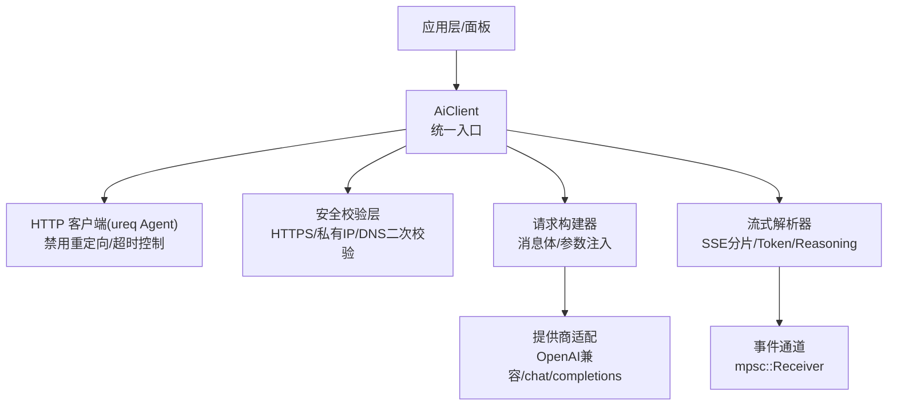
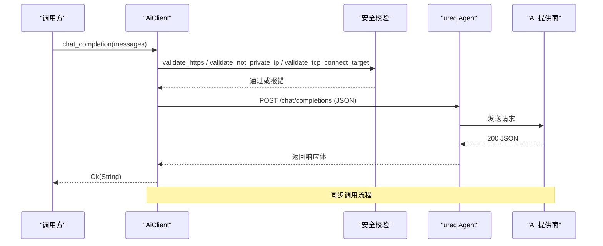
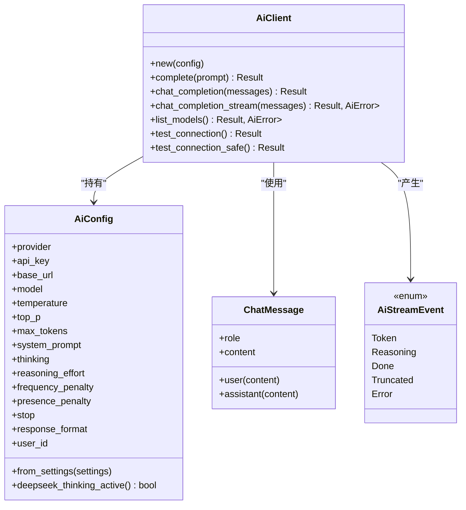

# AI 客户端 API

<cite>
**本文引用的文件**
- [lib.rs](file://crates/aether-ai/src/lib.rs)
- [settings.rs](file://crates/aether-shared/src/settings.rs)
</cite>

## 目录
1. [简介](#简介)
2. [项目结构](#项目结构)
3. [核心组件](#核心组件)
4. [架构总览](#架构总览)
5. [详细组件分析](#详细组件分析)
6. [依赖关系分析](#依赖关系分析)
7. [性能考量](#性能考量)
8. [故障排查指南](#故障排查指南)
9. [结论](#结论)
10. [附录：API 使用示例与最佳实践](#附录api-使用示例与最佳实践)

## 简介
本文件面向开发者，系统化说明 AI 客户端 API 的设计与用法，覆盖 AiClient 的公共接口、ChatMessage 数据模型、AiConfig 配置结构、AiStreamEvent 流式事件类型，以及安全验证机制（HTTPS 强制、私有 IP 检查、DNS 重绑定防护）和性能优化策略。文档同时提供同步调用、流式响应处理与错误处理的完整模式说明，帮助你在编辑器中稳定、安全地接入多种 AI 提供商。

## 项目结构
AI 客户端位于 aether-ai crate，核心实现集中在单一模块中；配置来源于 aether-shared 的 AiSettings，并在运行时转换为 AiConfig。整体组织遵循“单一职责 + 最小暴露”的原则：对外仅暴露必要的公共方法、数据结构与错误类型。

图表来源
- [lib.rs:308-320](file://crates/aether-ai/src/lib.rs#L308-L320)
- [lib.rs:394-534](file://crates/aether-ai/src/lib.rs#L394-L534)
- [lib.rs:738-830](file://crates/aether-ai/src/lib.rs#L738-L830)
- [lib.rs:832-920](file://crates/aether-ai/src/lib.rs#L832-L920)

章节来源
- [lib.rs:1-16](file://crates/aether-ai/src/lib.rs#L1-L16)
- [settings.rs:73-115](file://crates/aether-shared/src/settings.rs#L73-L115)

## 核心组件
- AiClient：统一的 AI 客户端，封装 HTTP 连接、安全校验、请求构造与流式解析。
- ChatMessage：对话消息的最小单元，包含角色与内容。
- AiConfig：运行时配置，承载提供商、模型、采样参数、思考模式等。
- AiStreamEvent：流式事件枚举，包括 Token、Reasoning、Done、Truncated、Error。
- AiError：统一错误类型，支持安全展示与可重试判断。

章节来源
- [lib.rs:165-190](file://crates/aether-ai/src/lib.rs#L165-L190)
- [lib.rs:259-299](file://crates/aether-ai/src/lib.rs#L259-L299)
- [lib.rs:84-163](file://crates/aether-ai/src/lib.rs#L84-L163)

## 架构总览
AiClient 通过 ureq 发起 HTTPS 请求，所有外部访问均经过严格的安全校验：强制 HTTPS、禁止私有/保留 IP、在请求前进行 DNS 二次校验以缓解 TOCTOU 风险。请求体根据提供商差异动态注入参数（如 DeepSeek 的思考模式开关），并支持流式 SSE 响应，将 token 与 reasoning 分流到不同事件。

图表来源
- [lib.rs:577-644](file://crates/aether-ai/src/lib.rs#L577-L644)
- [lib.rs:646-710](file://crates/aether-ai/src/lib.rs#L646-L710)
- [lib.rs:394-534](file://crates/aether-ai/src/lib.rs#L394-L534)

## 详细组件分析

### AiClient 公共方法
- complete(prompt)
  - 用途：简单文本补全，内部走 OpenAI 兼容路径，默认 max_tokens=100，探活场景会关闭思考模式。
  - 安全：强制 HTTPS、私有 IP 检查、TOCTOU DNS 校验。
  - 错误：空 API Key 直接返回配置错误；非 200 状态码返回 Api 错误并截断响应体。
  - 参考路径
    - [complete:572-575](file://crates/aether-ai/src/lib.rs#L572-L575)
    - [complete_openai_compatible:581-644](file://crates/aether-ai/src/lib.rs#L581-L644)

- chat_completion(messages)
  - 用途：多轮对话补全，统一走 OpenAI 兼容接口。
  - 安全：同上。
  - 错误：同上。
  - 参考路径
    - [chat_completion:577-579](file://crates/aether-ai/src/lib.rs#L577-L579)
    - [chat_openai_compatible:646-710](file://crates/aether-ai/src/lib.rs#L646-L710)

- chat_completion_stream(messages)
  - 用途：流式聊天补全，返回 mpsc::Receiver<AiStreamEvent>，后台线程持续推送 Token/Reasoning/Done/Truncated/Error。
  - 安全：同上。
  - 错误：非 200 状态码立即返回 Api 错误；流内解析失败发送 Error 事件。
  - 参考路径
    - [chat_completion_stream:716-722](file://crates/aether-ai/src/lib.rs#L716-L722)
    - [stream_openai_compatible:738-830](file://crates/aether-ai/src/lib.rs#L738-L830)
    - [stream_response:832-920](file://crates/aether-ai/src/lib.rs#L832-L920)

- list_models()
  - 用途：拉取提供商可用模型列表（GET /models）。
  - 安全：同上。
  - 错误：非 200 返回 Api 错误；解析失败返回 Parse 错误。
  - 参考路径
    - [list_models:335-372](file://crates/aether-ai/src/lib.rs#L335-L372)

- test_connection() / test_connection_safe()
  - 用途：轻量探活，关闭思考模式以减少延迟；safe 版本对错误信息脱敏后可用于 UI。
  - 参考路径
    - [test_connection:322-327](file://crates/aether-ai/src/lib.rs#L322-L327)
    - [test_connection_safe:329-333](file://crates/aether-ai/src/lib.rs#L329-L333)

章节来源
- [lib.rs:308-320](file://crates/aether-ai/src/lib.rs#L308-L320)
- [lib.rs:335-372](file://crates/aether-ai/src/lib.rs#L335-L372)
- [lib.rs:572-722](file://crates/aether-ai/src/lib.rs#L572-L722)
- [lib.rs:738-920](file://crates/aether-ai/src/lib.rs#L738-L920)

### ChatMessage 数据模型
- 字段：role（字符串）、content（字符串）。
- 便捷构造：user(content)、assistant(content)。
- 用途：作为消息数组传入 chat_completion/chat_completion_stream。
- 参考路径
  - [ChatMessage:264-284](file://crates/aether-ai/src/lib.rs#L264-L284)

章节来源
- [lib.rs:264-284](file://crates/aether-ai/src/lib.rs#L264-L284)

### AiConfig 配置结构
- 字段概览：provider、api_key、base_url、model、temperature、top_p、max_tokens、system_prompt、thinking、reasoning_effort、frequency_penalty、presence_penalty、stop、response_format、user_id。
- 行为要点：
  - from_settings：从 AiSettings 构建，缺失 base_url/model 时按提供商默认值填充。
  - deepseek_thinking_active：DeepSeek 思考模式下不发送采样类参数。
  - Debug 输出对 api_key 脱敏，system_prompt 仅显示存在性。
- 参考路径
  - [AiConfig:165-190](file://crates/aether-ai/src/lib.rs#L165-L190)
  - [from_settings:217-250](file://crates/aether-ai/src/lib.rs#L217-L250)
  - [deepseek_thinking_active:252-256](file://crates/aether-ai/src/lib.rs#L252-L256)
  - [Debug 实现:192-215](file://crates/aether-ai/src/lib.rs#L192-L215)

章节来源
- [lib.rs:165-256](file://crates/aether-ai/src/lib.rs#L165-L256)
- [settings.rs:73-115](file://crates/aether-shared/src/settings.rs#L73-L115)

### AiStreamEvent 流式事件类型
- Token：最终回答的新增片段。
- Reasoning：深度思考片段（如 reasoning_content/thinking_delta）。
- Done：正常结束（finish_reason = stop）。
- Truncated：达到长度限制（finish_reason = length/max_tokens）。
- Error：流式过程中发生错误。
- 参考路径
  - [AiStreamEvent:286-299](file://crates/aether-ai/src/lib.rs#L286-L299)
  - [流式解析与事件发送:832-920](file://crates/aether-ai/src/lib.rs#L832-L920)

章节来源
- [lib.rs:286-299](file://crates/aether-ai/src/lib.rs#L286-L299)
- [lib.rs:832-920](file://crates/aether-ai/src/lib.rs#L832-L920)

### 安全验证机制
- HTTPS 强制：validate_https 拒绝非 https:// 的 base_url。
- 私有 IP 检查：validate_not_private_ip 使用 url::Url 严格解析，拦截 IPv4/IPv6 私有/保留地址，并扩展云元数据端点黑名单。
- DNS 重绑定防护：resolve_and_lock 对域名进行 DNS 解析并校验所有返回 IP；validate_tcp_connect_target 在发起 HTTP 前做二次校验，缓解 TOCTOU。
- 注意：当前未固定 TLS 主机名校验时的连接 IP，因此仍存在残余风险；建议未来采用自定义 TLS connector + IP pinning 彻底修复。
- 参考路径
  - [validate_https:394-402](file://crates/aether-ai/src/lib.rs#L394-L402)
  - [validate_not_private_ip:404-456](file://crates/aether-ai/src/lib.rs#L404-L456)
  - [check_ip_private:458-489](file://crates/aether-ai/src/lib.rs#L458-L489)
  - [resolve_and_lock:491-528](file://crates/aether-ai/src/lib.rs#L491-L528)
  - [validate_tcp_connect_target:530-534](file://crates/aether-ai/src/lib.rs#L530-L534)

章节来源
- [lib.rs:394-534](file://crates/aether-ai/src/lib.rs#L394-L534)

### 性能优化策略
- 连接与超时：禁用自动重定向防止 SSRF；设置连接超时 15s、读空闲超时 300s，避免长生成被中断。
- 响应体限制：read_limited_response 限制最大 10MB，防止恶意大响应导致内存膨胀。
- 错误消息截断：truncate_error_message 将错误响应体截断至 200 字符边界，减少 UI 负载与敏感信息泄露风险。
- 流式处理：SSE 逐行读取，边接收边解析，降低峰值内存占用；后台线程解耦网络 I/O 与 UI 消费。
- 厂商参数优化：DeepSeek 思考模式下不发送 temperature/top_p/惩罚项，减少无效参数传输。
- 参考路径
  - [Agent 构建与超时:311-319](file://crates/aether-ai/src/lib.rs#L311-L319)
  - [read_limited_response:536-558](file://crates/aether-ai/src/lib.rs#L536-L558)
  - [truncate_error_message:560-570](file://crates/aether-ai/src/lib.rs#L560-L570)
  - [流式解析:832-920](file://crates/aether-ai/src/lib.rs#L832-L920)
  - [思考模式参数控制:773-799](file://crates/aether-ai/src/lib.rs#L773-L799)

章节来源
- [lib.rs:311-319](file://crates/aether-ai/src/lib.rs#L311-L319)
- [lib.rs:536-570](file://crates/aether-ai/src/lib.rs#L536-L570)
- [lib.rs:773-799](file://crates/aether-ai/src/lib.rs#L773-L799)
- [lib.rs:832-920](file://crates/aether-ai/src/lib.rs#L832-L920)

## 依赖关系分析
- AiClient 依赖 ureq::Agent 进行 HTTP 通信，依赖 serde_json 进行请求/响应序列化，依赖 std::sync::mpsc 实现流式事件通道。
- 配置来源为 aether_shared::settings::AiSettings，运行时转换为 AiConfig。
- 安全校验依赖标准库网络能力与 url crate 进行严格 URL 解析。

图表来源
- [lib.rs:165-299](file://crates/aether-ai/src/lib.rs#L165-L299)
- [lib.rs:308-320](file://crates/aether-ai/src/lib.rs#L308-L320)

章节来源
- [lib.rs:165-299](file://crates/aether-ai/src/lib.rs#L165-L299)
- [lib.rs:308-320](file://crates/aether-ai/src/lib.rs#L308-L320)

## 性能考量
- 流式优先：长文本生成建议使用 chat_completion_stream，避免一次性等待完整响应。
- 合理参数：根据任务选择 temperature/top_p/max_tokens；DeepSeek 思考模式下避免发送无关采样参数。
- 资源保护：响应体上限 10MB，错误消息截断至 200 字符，防止内存与 UI 压力。
- 连接复用：ureq Agent 可复用，避免频繁建立 TLS 握手。
- 超时策略：连接 15s、读空闲 300s，兼顾快速失败与长生成容忍度。

[本节为通用指导，不直接分析具体文件]

## 故障排查指南
- 常见错误分类：
  - 网络错误：Http 类型，提示检查网络连接。
  - 解析错误：Parse 类型，提示 API 响应结构异常。
  - 配置错误：Config 类型，提示 Base URL/Key 等问题。
  - API 错误：Api 类型，携带 HTTP 状态码与截断后的消息。
- 安全展示：使用 safe_display() 获取对用户友好的错误描述，避免泄露敏感信息。
- 可重试判断：is_retryable() 识别 429/500/503 等临时错误，适合指数退避重试。
- 永久错误：is_permanent() 识别 400/401/402/403/404/422，应提示用户检查配置。
- 参考路径
  - [AiError Display/safe_display:97-163](file://crates/aether-ai/src/lib.rs#L97-L163)

章节来源
- [lib.rs:84-163](file://crates/aether-ai/src/lib.rs#L84-L163)

## 结论
AI 客户端 API 提供了简洁、安全的统一入口，支持同步与流式两种调用方式，内置完善的安全校验与性能优化策略。通过 ChatMessage、AiConfig、AiStreamEvent 等核心类型，开发者可以灵活对接多种 AI 提供商，并在 UI 中安全、高效地呈现结果与错误信息。

[本节为总结，不直接分析具体文件]

## 附录：API 使用示例与最佳实践

### 同步调用示例（伪代码）
- 步骤：
  - 构造 AiSettings 并创建 AiClient。
  - 调用 complete 或 chat_completion。
  - 处理返回值或错误（使用 safe_display 展示给用户）。
- 参考路径
  - [complete:572-575](file://crates/aether-ai/src/lib.rs#L572-L575)
  - [chat_completion:577-579](file://crates/aether-ai/src/lib.rs#L577-L579)
  - [AiError safe_display:110-163](file://crates/aether-ai/src/lib.rs#L110-L163)

### 流式响应处理示例（伪代码）
- 步骤：
  - 调用 chat_completion_stream，获得 Receiver。
  - 循环读取事件：
    - Token：追加到 UI 缓冲区。
    - Reasoning：可选地在侧栏展示思考过程。
    - Truncated：提示用户增加 max_tokens。
    - Done：结束流。
    - Error：记录日志并提示用户。
- 参考路径
  - [chat_completion_stream:716-722](file://crates/aether-ai/src/lib.rs#L716-L722)
  - [stream_response:832-920](file://crates/aether-ai/src/lib.rs#L832-L920)

### 错误处理模式
- 网络/解析/配置错误：直接提示用户检查网络或配置。
- API 错误：根据状态码给出针对性建议（如 401 重新填写 Key，429 稍后重试）。
- 可重试逻辑：对 is_retryable() 为真的错误实施指数退避重试。
- 参考路径
  - [AiError 分类与 safe_display:84-163](file://crates/aether-ai/src/lib.rs#L84-L163)

### 安全最佳实践
- 始终使用 HTTPS 的 base_url。
- 不要将用户输入直接作为 base_url；如需白名单，应在上层进行更严格的域名校验。
- 避免在日志中打印 API Key；Debug 已脱敏，但仍需谨慎。
- 参考路径
  - [validate_https:394-402](file://crates/aether-ai/src/lib.rs#L394-L402)
  - [validate_not_private_ip:404-456](file://crates/aether-ai/src/lib.rs#L404-L456)

### 性能调优建议
- 长文本生成优先使用流式接口。
- 合理设置 max_tokens 与停止序列，避免过长输出。
- 在 DeepSeek 思考模式下，避免发送 temperature/top_p/惩罚项。
- 参考路径
  - [流式解析:832-920](file://crates/aether-ai/src/lib.rs#L832-L920)
  - [思考模式参数控制:773-799](file://crates/aether-ai/src/lib.rs#L773-L799)

[本节为使用指导，不直接分析具体文件]