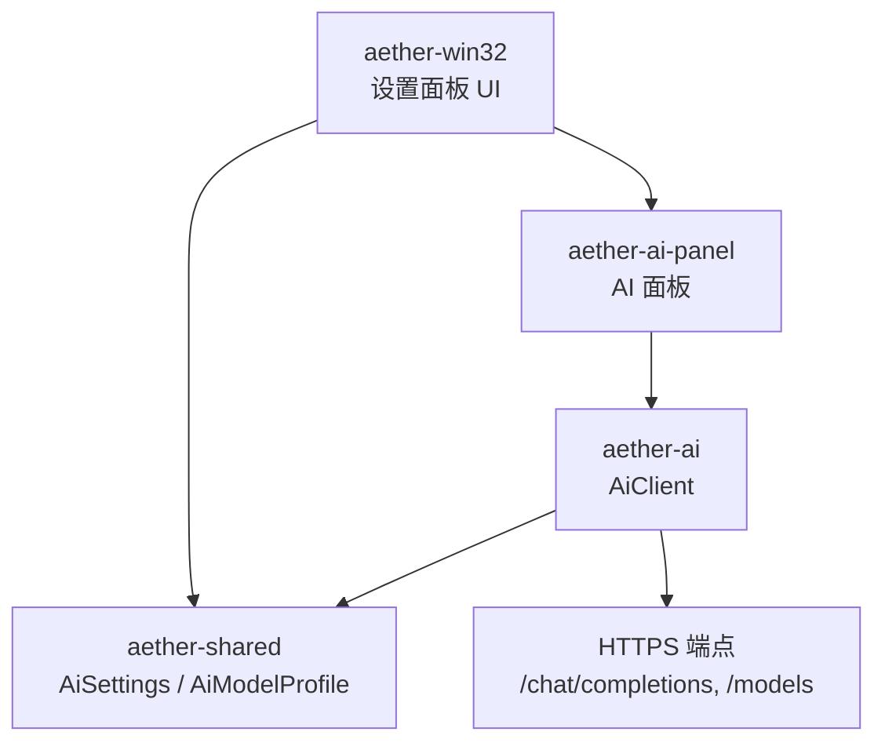
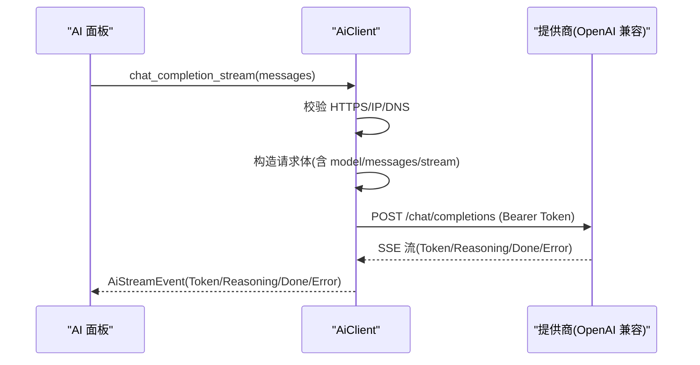
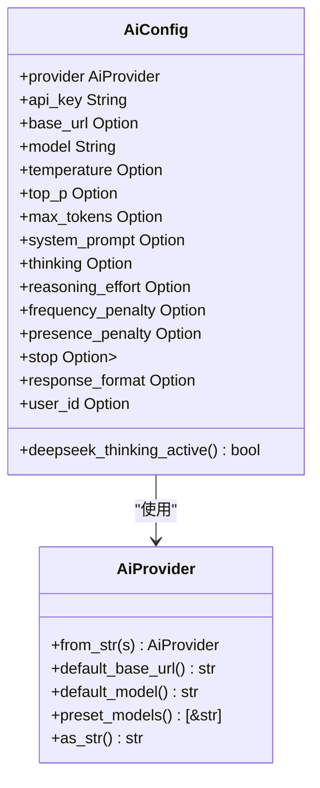
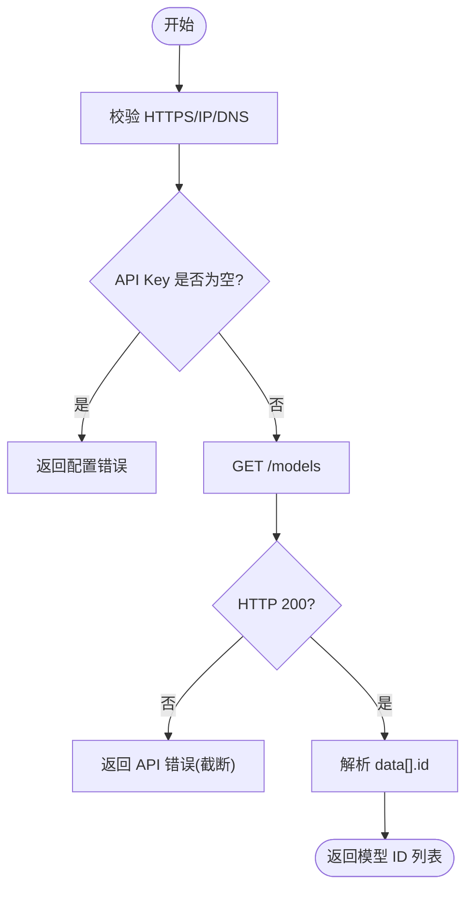
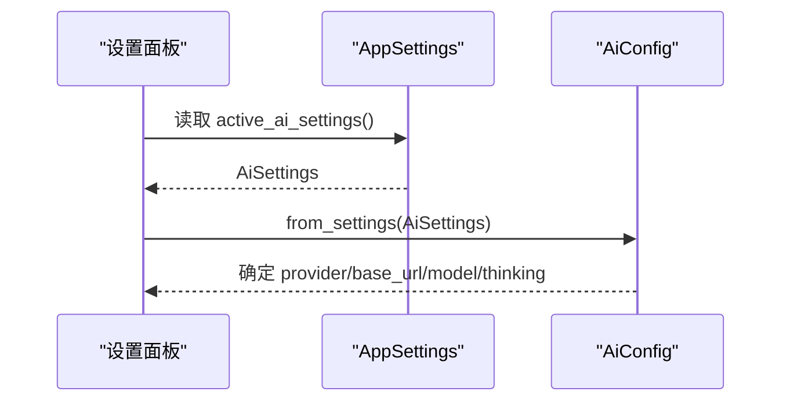
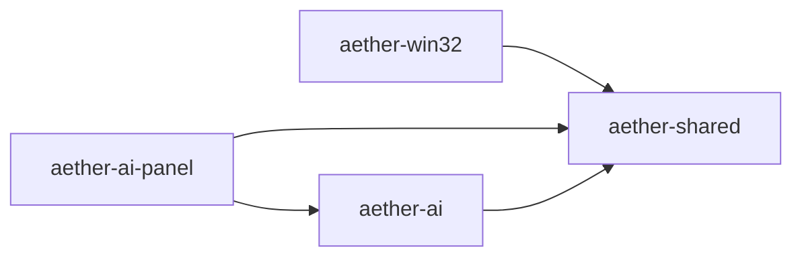

# AI 提供商集成

<cite>
**本文引用的文件**
- [aether-ai/src/lib.rs](file://crates/aether-ai/src/lib.rs)
- [aether-shared/src/settings.rs](file://crates/aether-shared/src/settings.rs)
- [aether-win32/src/settings.rs](file://crates/aether-win32/src/settings.rs)
- [aether-ai-panel/src/ai_panel.rs](file://crates/aether-ai-panel/src/ai_panel.rs)
</cite>

## 目录
1. [简介](#简介)
2. [项目结构](#项目结构)
3. [核心组件](#核心组件)
4. [架构总览](#架构总览)
5. [详细组件分析](#详细组件分析)
6. [依赖关系分析](#依赖关系分析)
7. [性能与可靠性](#性能与可靠性)
8. [故障排查指南](#故障排查指南)
9. [结论](#结论)
10. [附录：配置示例与扩展指南](#附录：配置示例与扩展指南)

## 简介
本模块为编辑器提供统一的 AI 提供商接入能力，当前支持 DeepSeek、Kimi（Moonshot）以及自定义 OpenAI 兼容接口。通过枚举化的提供商定义、默认配置与模型清单管理，结合统一的请求构造与响应解析，屏蔽各厂商差异，向上层提供一致的聊天补全、流式输出与模型列表查询能力。同时内置安全校验、错误脱敏与可重试策略，保障调用稳定性与安全性。

## 项目结构
围绕 AI 提供商集成的关键代码分布在以下 crate：
- aether-ai：提供商枚举、配置、客户端实现、HTTP 请求与响应处理、安全校验、错误类型与策略。
- aether-shared：跨 crate 的持久化设置结构（AiSettings、AiModelProfile），多模型档案管理与激活模型选择。
- aether-win32：设置面板 UI 状态与模板按钮（DeepSeek/Kimi/Custom），将 UI 字段映射到 AiSettings/AiModelProfile。
- aether-ai-panel：AI 面板业务逻辑，构建消息、发起流式请求、错误展示与用户提示。

图表来源
- [aether-ai/src/lib.rs:17-82](file://crates/aether-ai/src/lib.rs#L17-L82)
- [aether-shared/src/settings.rs:73-166](file://crates/aether-shared/src/settings.rs#L73-L166)
- [aether-win32/src/settings.rs:78-102](file://crates/aether-win32/src/settings.rs#L78-L102)
- [aether-ai-panel/src/ai_panel.rs:1-200](file://crates/aether-ai-panel/src/ai_panel.rs#L1-L200)

章节来源
- [aether-ai/src/lib.rs:17-82](file://crates/aether-ai/src/lib.rs#L17-L82)
- [aether-shared/src/settings.rs:73-166](file://crates/aether-shared/src/settings.rs#L73-L166)
- [aether-win32/src/settings.rs:78-102](file://crates/aether-win32/src/settings.rs#L78-L102)
- [aether-ai-panel/src/ai_panel.rs:1-200](file://crates/aether-ai-panel/src/ai_panel.rs#L1-L200)

## 核心组件
- 提供商枚举与默认值：AiProvider 定义了 DeepSeek、Kimi、Custom，并提供默认 base_url、默认模型与预置模型清单。
- 运行时配置：AiConfig 由 AiSettings 转换而来，封装 provider、api_key、base_url、model 及采样参数等。
- 客户端：AiClient 统一封装 HTTP 请求、SSE 流式响应、错误处理与安全校验。
- 设置与持久化：AiSettings/AiModelProfile 承载多模型配置；Win32 设置面板负责 UI 字段与配置的互转。
- 面板交互：AI 面板负责组装消息、发起流式请求、错误脱敏与用户提示。

章节来源
- [aether-ai/src/lib.rs:17-82](file://crates/aether-ai/src/lib.rs#L17-L82)
- [aether-ai/src/lib.rs:165-257](file://crates/aether-ai/src/lib.rs#L165-L257)
- [aether-shared/src/settings.rs:73-166](file://crates/aether-shared/src/settings.rs#L73-L166)
- [aether-win32/src/settings.rs:119-252](file://crates/aether-win32/src/settings.rs#L119-L252)
- [aether-ai-panel/src/ai_panel.rs:102-200](file://crates/aether-ai-panel/src/ai_panel.rs#L102-L200)

## 架构总览
整体采用“提供商抽象 + OpenAI 兼容接口”的统一路径：
- 所有提供商均走 /chat/completions（文本/流式）与 /models（模型列表）。
- 通过 AiProvider 区分厂商特性（如 DeepSeek 思考模式 thinking、reasoning_effort）。
- 统一的安全校验（HTTPS、私有 IP 阻断、DNS TOCTOU 防护）、错误脱敏与可重试策略。

图表来源
- [aether-ai/src/lib.rs:712-830](file://crates/aether-ai/src/lib.rs#L712-L830)
- [aether-ai/src/lib.rs:335-392](file://crates/aether-ai/src/lib.rs#L335-L392)

章节来源
- [aether-ai/src/lib.rs:335-392](file://crates/aether-ai/src/lib.rs#L335-L392)
- [aether-ai/src/lib.rs:712-830](file://crates/aether-ai/src/lib.rs#L712-L830)

## 详细组件分析

### 提供商枚举与默认配置
- 提供商枚举：DeepSeek、Kimi、Custom。
- 默认 base_url：DeepSeek 与 Kimi 有固定地址，Custom 为空需显式配置。
- 默认模型：DeepSeek 默认 deepseek-v4-pro，Kimi 默认 moonshot-v1-8k。
- 预置模型清单：DeepSeek 提供 v4-pro/v4-flash；Kimi 提供 moonshot-v1-* 系列与 kimi-latest；Custom 无预置。

图表来源
- [aether-ai/src/lib.rs:17-82](file://crates/aether-ai/src/lib.rs#L17-L82)
- [aether-ai/src/lib.rs:165-257](file://crates/aether-ai/src/lib.rs#L165-L257)

章节来源
- [aether-ai/src/lib.rs:17-82](file://crates/aether-ai/src/lib.rs#L17-L82)
- [aether-ai/src/lib.rs:165-257](file://crates/aether-ai/src/lib.rs#L165-L257)

### 模型列表管理
- 通过 GET /models 拉取数据，解析 data[].id 列表。
- 支持 list_models_safe 用于 UI 展示的错误脱敏版本。
- 在设置面板中可后台拉取并缓存模型列表，按配置指纹判断是否刷新。

图表来源
- [aether-ai/src/lib.rs:335-392](file://crates/aether-ai/src/lib.rs#L335-L392)

章节来源
- [aether-ai/src/lib.rs:335-392](file://crates/aether-ai/src/lib.rs#L335-L392)

### 提供商切换机制
- 字符串到枚举：from_str 支持大小写与别名（如 kimi/moonshot）。
- 从设置生成配置：AiConfig::from_settings 根据 provider 决定 base_url 与 model，并保留用户覆盖值。
- 深度思考模式开关：仅 DeepSeek 生效，None 表示服务端默认（开启），Some(true/false) 控制下发 thinking.type。

图表来源
- [aether-shared/src/settings.rs:329-342](file://crates/aether-shared/src/settings.rs#L329-L342)
- [aether-ai/src/lib.rs:217-257](file://crates/aether-ai/src/lib.rs#L217-L257)

章节来源
- [aether-shared/src/settings.rs:329-342](file://crates/aether-shared/src/settings.rs#L329-L342)
- [aether-ai/src/lib.rs:217-257](file://crates/aether-ai/src/lib.rs#L217-L257)

### API 兼容性、认证方式与请求格式差异
- 兼容性：所有提供商统一走 OpenAI 兼容接口 /chat/completions 与 /models。
- 认证：Authorization: Bearer <api_key>。
- 请求体差异：
  - DeepSeek：支持 thinking 对象（type: enabled/disabled）与 reasoning_effort（high/max）；思考模式下 temperature/top_p/惩罚项不生效且不下发。
  - Kimi：遵循标准 OpenAI 字段；不支持 DeepSeek 专属 thinking。
  - Custom：完全遵循 OpenAI 兼容规范，可按需传入 stop、response_format、user_id 等。
- 响应处理：统一解析 choices[0].message.content；流式事件包含 Token、Reasoning、Done、Truncated、Error。

章节来源
- [aether-ai/src/lib.rs:572-710](file://crates/aether-ai/src/lib.rs#L572-L710)
- [aether-ai/src/lib.rs:712-830](file://crates/aether-ai/src/lib.rs#L712-L830)

### 错误处理与脱敏
- 错误类型：Http、Parse、Config、Api(code,message)。
- 安全显示：safe_display 将 API 错误码映射为用户友好描述，避免泄露敏感信息。
- 可重试判定：429/500/503 视为可重试；400/401/402/403/404/422 为永久错误。
- UI 侧：ai_panel 对错误进行本地调用失败与 API 返回错误分类，附加提示。

章节来源
- [aether-ai/src/lib.rs:84-163](file://crates/aether-ai/src/lib.rs#L84-L163)
- [aether-ai-panel/src/ai_panel.rs:802-834](file://crates/aether-ai-panel/src/ai_panel.rs#L802-L834)

## 依赖关系分析
- aether-ai 依赖 aether-shared 的设置结构（AiSettings/AiModelProfile）。
- aether-win32 依赖 aether-shared 进行设置持久化与加载，并通过设置面板驱动 UI。
- aether-ai-panel 依赖 aether-ai 的 AiClient 发起请求，依赖 aether-shared 获取当前激活设置。

图表来源
- [aether-ai/src/lib.rs:1-5](file://crates/aether-ai/src/lib.rs#L1-L5)
- [aether-shared/src/settings.rs:1-23](file://crates/aether-shared/src/settings.rs#L1-L23)
- [aether-win32/src/settings.rs:1-2](file://crates/aether-win32/src/settings.rs#L1-L2)
- [aether-ai-panel/src/ai_panel.rs:1-9](file://crates/aether-ai-panel/src/ai_panel.rs#L1-L9)

章节来源
- [aether-ai/src/lib.rs:1-5](file://crates/aether-ai/src/lib.rs#L1-L5)
- [aether-shared/src/settings.rs:1-23](file://crates/aether-shared/src/settings.rs#L1-L23)
- [aether-win32/src/settings.rs:1-2](file://crates/aether-win32/src/settings.rs#L1-L2)
- [aether-ai-panel/src/ai_panel.rs:1-9](file://crates/aether-ai-panel/src/ai_panel.rs#L1-L9)

## 性能与可靠性
- 连接与超时：连接超时 15s，读空闲 300s，避免长生成被中断。
- 响应体限制：最大 10MB，防止内存膨胀。
- 安全：禁用自动重定向，HTTPS 强制，私有 IP 与云元数据黑名单拦截，DNS 二次校验。
- 流式：SSE 分片推送，减少首字节延迟。
- 重试：429/500/503 可重试，指数退避可由上层实现。

章节来源
- [aether-ai/src/lib.rs:308-320](file://crates/aether-ai/src/lib.rs#L308-L320)
- [aether-ai/src/lib.rs:536-558](file://crates/aether-ai/src/lib.rs#L536-L558)
- [aether-ai/src/lib.rs:394-456](file://crates/aether-ai/src/lib.rs#L394-L456)
- [aether-ai/src/lib.rs:147-163](file://crates/aether-ai/src/lib.rs#L147-L163)

## 故障排查指南
- 网络/连接问题：检查 base_url 是否为 HTTPS，确认 DNS 解析正常，查看错误是否属于 Http 类。
- 认证失败：确认 api_key 已正确设置且未过期；错误码 401 时提示重新填写。
- 余额不足/权限不足：错误码 402/403，引导至提供商官网或检查权限。
- 参数错误：400/422 时检查 model、temperature、max_tokens 等范围与格式。
- 速率限制：429 时稍后重试；500/503 服务器繁忙时建议重试。
- UI 错误展示：使用 safe_display 避免泄露密钥；区分本地调用失败与 API 返回错误。

章节来源
- [aether-ai/src/lib.rs:110-163](file://crates/aether-ai/src/lib.rs#L110-L163)
- [aether-ai-panel/src/ai_panel.rs:802-834](file://crates/aether-ai-panel/src/ai_panel.rs#L802-L834)

## 结论
本模块以提供商枚举与 OpenAI 兼容接口为核心，统一了 DeepSeek、Kimi 与自定义提供商的接入方式，提供安全的请求构造、流式响应与完善的错误处理。通过多模型配置与设置面板，用户可以灵活切换提供商与模型，并获得一致的使用体验。未来新增提供商只需扩展枚举、默认值与厂商特定参数注入逻辑即可。

## 附录：配置示例与扩展指南

### 支持的提供商与默认值
- DeepSeek
  - 默认 base_url：https://api.deepseek.com/v1
  - 默认模型：deepseek-v4-pro
  - 预置模型：deepseek-v4-pro、deepseek-v4-flash
  - 特有参数：thinking（enabled/disabled）、reasoning_effort（high/max）
- Kimi（Moonshot）
  - 默认 base_url：https://api.moonshot.cn/v1
  - 默认模型：moonshot-v1-8k
  - 预置模型：moonshot-v1-8k、moonshot-v1-32k、moonshot-v1-128k、kimi-latest
- Custom（OpenAI 兼容）
  - 默认 base_url：空（必须显式配置）
  - 默认模型：空（必须显式配置）
  - 预置模型：无

章节来源
- [aether-ai/src/lib.rs:44-73](file://crates/aether-ai/src/lib.rs#L44-L73)

### 认证方式与请求头
- 认证：Authorization: Bearer <api_key>
- Content-Type：application/json
- 安全：HTTPS 强制，私有 IP 与云元数据端点禁止访问

章节来源
- [aether-ai/src/lib.rs:616-622](file://crates/aether-ai/src/lib.rs#L616-L622)
- [aether-ai/src/lib.rs:394-456](file://crates/aether-ai/src/lib.rs#L394-L456)

### 请求体与响应处理
- 文本补全：POST /chat/completions，messages 包含 user 消息，max_tokens 控制长度。
- 流式补全：stream=true，接收 SSE 事件 Token/Reasoning/Done/Truncated/Error。
- 模型列表：GET /models，解析 data[].id。

章节来源
- [aether-ai/src/lib.rs:572-710](file://crates/aether-ai/src/lib.rs#L572-L710)
- [aether-ai/src/lib.rs:712-830](file://crates/aether-ai/src/lib.rs#L712-L830)
- [aether-ai/src/lib.rs:335-392](file://crates/aether-ai/src/lib.rs#L335-L392)

### 添加新的 AI 提供商步骤
1. 扩展提供商枚举：在 AiProvider 中添加新成员，并在 from_str 中增加字符串映射。
2. 设置默认值：实现 default_base_url 与 default_model。
3. 维护预置模型：在 preset_models 中添加该提供商的可用模型列表。
4. 厂商特定参数：如需新增专属参数（如 thinking），在 stream_openai_compatible 中按 provider 分支注入。
5. 更新 UI 模板：在设置面板 ProviderTemplateButton 中添加新选项，并绑定到下拉框与默认值。
6. 测试验证：确保 list_models、chat_completion、chat_completion_stream 与新提供商兼容。

章节来源
- [aether-ai/src/lib.rs:17-82](file://crates/aether-ai/src/lib.rs#L17-L82)
- [aether-win32/src/settings.rs:78-102](file://crates/aether-win32/src/settings.rs#L78-L102)
- [aether-ai/src/lib.rs:724-800](file://crates/aether-ai/src/lib.rs#L724-L800)

### 提供商特定的参数处理
- DeepSeek 思考模式：
  - thinking=Some(false) → 下发 {"type":"disabled"}
  - thinking=Some(true) → 下发 {"type":"enabled"}
  - thinking=None → 不下发（使用服务端默认，即开启）
  - 思考模式下不发送 temperature/top_p/frequency_penalty/presence_penalty
  - reasoning_effort 仅在思考模式且值为 high/max 时下发
- Kimi/Custom：
  - 遵循 OpenAI 标准字段；不支持 DeepSeek 专属 thinking
  - 可下发 stop、response_format、user_id 等通用参数

章节来源
- [aether-ai/src/lib.rs:724-800](file://crates/aether-ai/src/lib.rs#L724-L800)

### 错误处理机制
- 错误分类：Http/Parse/Config/Api
- 安全显示：safe_display 将错误码映射为用户友好描述
- 可重试：429/500/503 可重试；400/401/402/403/404/422 为永久错误
- UI 提示：区分本地调用失败与 API 返回错误，附加重试建议

章节来源
- [aether-ai/src/lib.rs:84-163](file://crates/aether-ai/src/lib.rs#L84-L163)
- [aether-ai-panel/src/ai_panel.rs:802-834](file://crates/aether-ai-panel/src/ai_panel.rs#L802-L834)