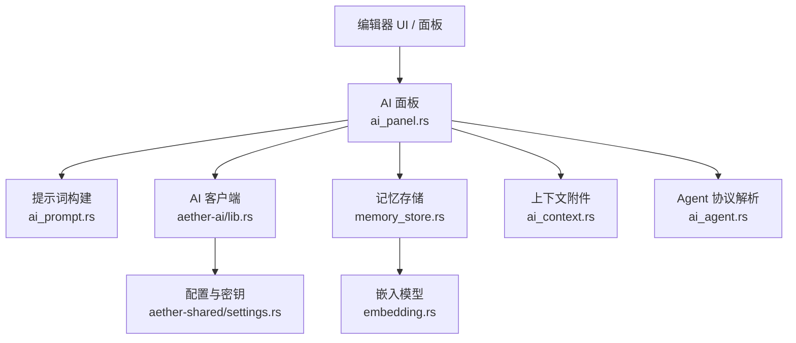
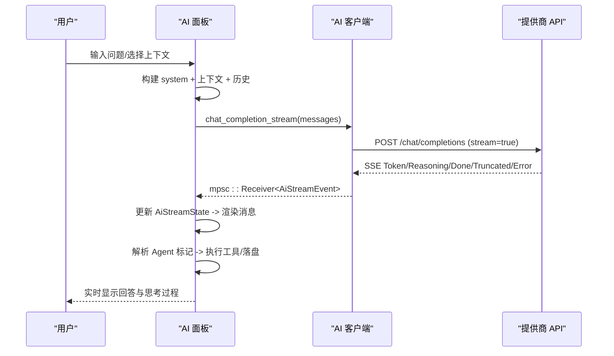
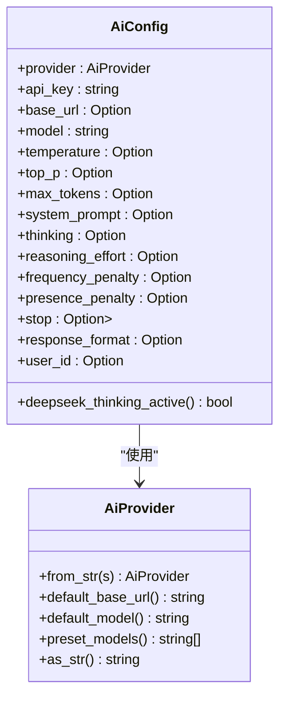
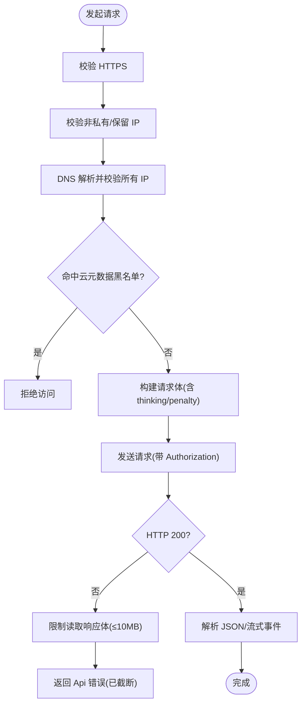
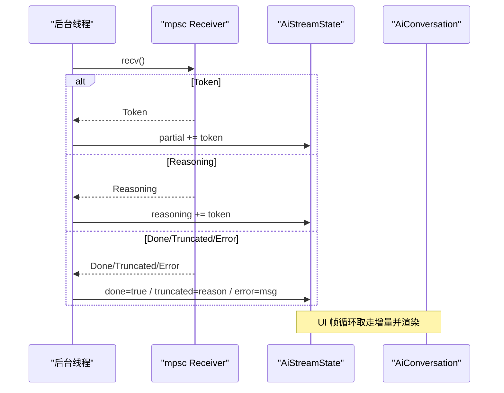
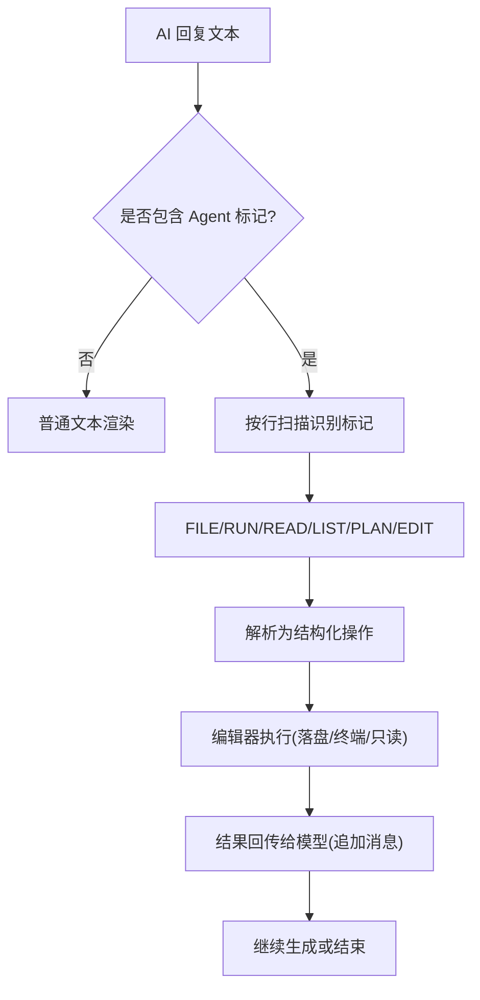
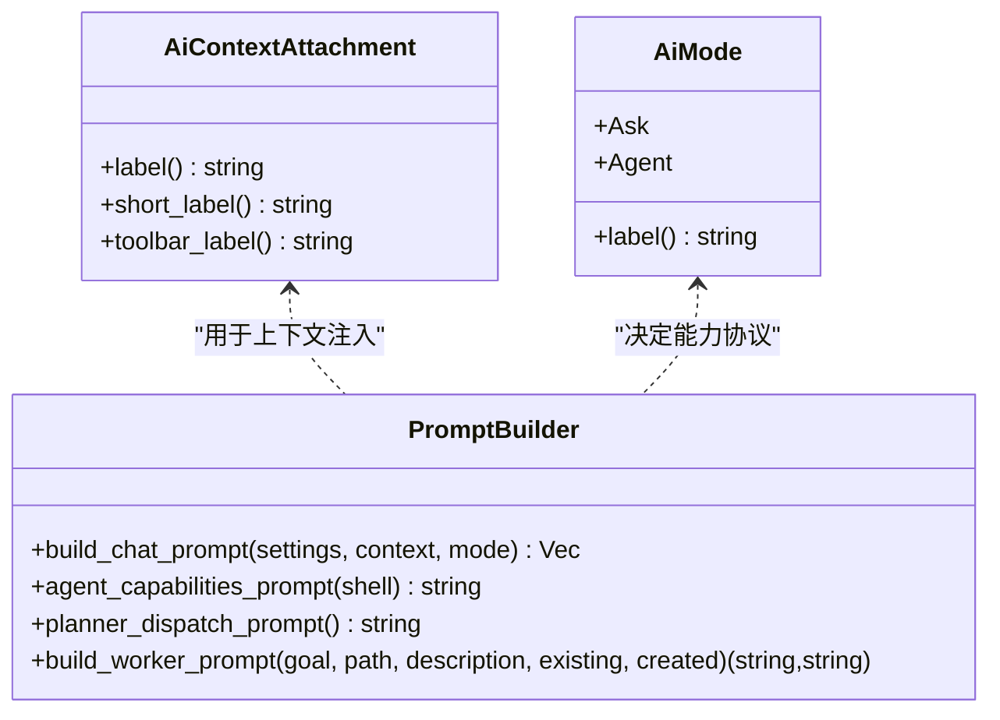
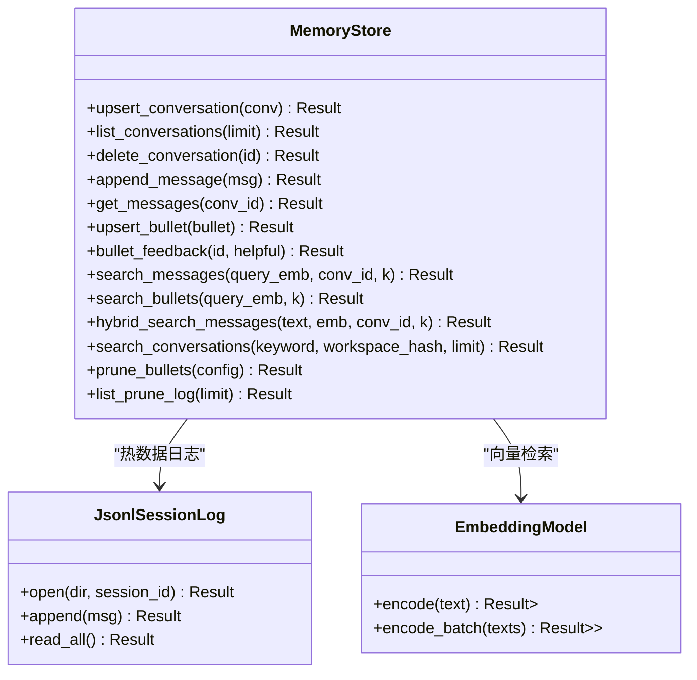
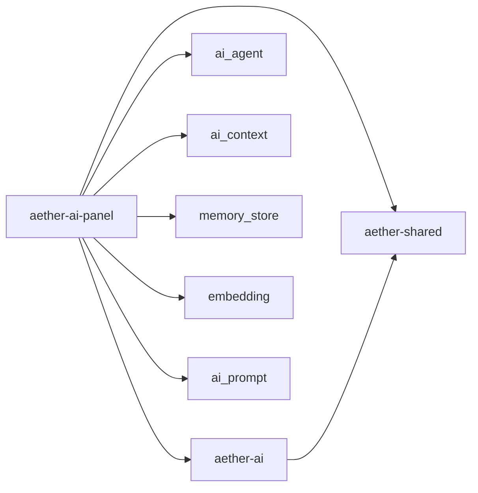

# aether-ai AI 服务

<cite>
**本文引用的文件**
- [lib.rs](file://crates/aether-ai/src/lib.rs)
- [settings.rs](file://crates/aether-shared/src/settings.rs)
- [ai_panel.rs](file://crates/aether-ai-panel/src/ai_panel.rs)
- [ai_agent.rs](file://crates/aether-ai-panel/src/ai_agent.rs)
- [ai_context.rs](file://crates/aether-ai-panel/src/ai_context.rs)
- [memory_store.rs](file://crates/aether-ai-panel/src/memory_store.rs)
- [embedding.rs](file://crates/aether-ai-panel/src/embedding.rs)
- [ai_prompt.rs](file://crates/aether-ai-panel/src/ai_prompt.rs)
</cite>

## 目录
1. [简介](#简介)
2. [项目结构](#项目结构)
3. [核心组件](#核心组件)
4. [架构总览](#架构总览)
5. [详细组件分析](#详细组件分析)
6. [依赖关系分析](#依赖关系分析)
7. [性能考量](#性能考量)
8. [故障排查指南](#故障排查指南)
9. [结论](#结论)
10. [附录：配置与集成示例](#附录：配置与集成示例)

## 简介
本模块为 aether-ai 提供统一的 AI 服务能力，抽象多提供商（DeepSeek、Kimi、自定义 OpenAI 兼容）的对话与流式接口，并实现 Agent 模式下的工具调用协议（文件读写、终端命令执行、只读探查）、对话上下文管理、持久化与语义检索、以及安全机制（HTTPS、SSRF 防护、错误脱敏）。同时提供与编辑器的协作方式（上下文附件、提示词构建、Agent 能力注入）和性能优化策略（流式响应、超时控制、向量检索回退）。

## 项目结构
- aether-ai：底层 HTTP 客户端与多提供商适配、流式事件、安全校验。
- aether-shared：全局设置与模型档案（AiSettings/AiModelProfile），API Key 加密存储。
- aether-ai-panel：面板层，负责对话管理、上下文组装、Agent 协议解析、流式状态、历史与记忆存储、嵌入模型。
- 编辑器侧（aether-win32）通过 trait 暴露 EditorContextProvider，将编辑器状态注入 AI 上下文。

图表来源
- [ai_panel.rs:1-120](file://crates/aether-ai-panel/src/ai_panel.rs#L1-L120)
- [ai_prompt.rs:25-69](file://crates/aether-ai-panel/src/ai_prompt.rs#L25-L69)
- [lib.rs:259-320](file://crates/aether-ai/src/lib.rs#L259-L320)
- [memory_store.rs:77-141](file://crates/aether-ai-panel/src/memory_store.rs#L77-L141)
- [embedding.rs:18-41](file://crates/aether-ai-panel/src/embedding.rs#L18-L41)
- [ai_context.rs:1-19](file://crates/aether-ai-panel/src/ai_context.rs#L1-L19)
- [ai_agent.rs:15-50](file://crates/aether-ai-panel/src/ai_agent.rs#L15-L50)
- [settings.rs:73-115](file://crates/aether-shared/src/settings.rs#L73-L115)

章节来源
- [lib.rs:17-82](file://crates/aether-ai/src/lib.rs#L17-L82)
- [settings.rs:73-115](file://crates/aether-shared/src/settings.rs#L73-L115)
- [ai_panel.rs:10-16](file://crates/aether-ai-panel/src/ai_panel.rs#L10-L16)

## 核心组件
- 提供商枚举与默认基址/模型：支持 DeepSeek、Kimi、Custom（OpenAI 兼容）。
- 配置对象 AiConfig：从 AiSettings 构造，包含温度、top_p、max_tokens、思考模式、惩罚项、停止序列、响应格式、用户标识等。
- 客户端 AiClient：封装 HTTP 请求、流式 SSE、安全校验（HTTPS、私有 IP、DNS TOCTOU、云元数据黑名单）、错误脱敏。
- 会话与消息：ChatMessage、AiMessage、AiConversation、AiStreamState。
- Agent 协议：文件块、运行命令、只读探查、精准定位/编辑、规划任务清单。
- 上下文附件：当前文件、选区、打开文件、诊断、文件树、自定义文本。
- 记忆存储 MemoryStore：会话、消息、Playbook 条目、向量检索（HNSW）、混合检索、剪枝审计。
- 嵌入模型：ONNX Runtime 加载 bge-small-zh-v1.5，未就绪时回退 n-gram 哈希向量。

章节来源
- [lib.rs:17-82](file://crates/aether-ai/src/lib.rs#L17-L82)
- [lib.rs:165-257](file://crates/aether-ai/src/lib.rs#L165-L257)
- [lib.rs:259-320](file://crates/aether-ai/src/lib.rs#L259-L320)
- [ai_panel.rs:102-168](file://crates/aether-ai-panel/src/ai_panel.rs#L102-L168)
- [ai_panel.rs:258-290](file://crates/aether-ai-panel/src/ai_panel.rs#L258-L290)
- [ai_panel.rs:170-225](file://crates/aether-ai-panel/src/ai_panel.rs#L170-L225)
- [ai_agent.rs:15-50](file://crates/aether-ai-panel/src/ai_agent.rs#L15-L50)
- [ai_context.rs:1-19](file://crates/aether-ai-panel/src/ai_context.rs#L1-L19)
- [memory_store.rs:28-71](file://crates/aether-ai-panel/src/memory_store.rs#L28-L71)
- [embedding.rs:18-41](file://crates/aether-ai-panel/src/embedding.rs#L18-L41)

## 架构总览
系统分层清晰：
- 配置层：AppSettings/AiSettings/AiModelProfile 提供多模型配置与密钥管理。
- 客户端层：AiClient 统一对接 OpenAI 兼容接口，处理流式与非流式请求，内置安全校验。
- 面板层：AiPanel 维护会话、流式状态、UI 交互；构建提示词、收集上下文、解析 Agent 协议。
- 存储层：MemoryStore 抽象会话/消息/Playbook 的增删改查与向量检索；JsonlSessionLog 作为热数据日志。
- 嵌入层：EmbeddingModel 提供文本到向量的编码，失败回退至 n-gram 哈希。

图表来源
- [ai_panel.rs:731-800](file://crates/aether-ai-panel/src/ai_panel.rs#L731-L800)
- [lib.rs:712-800](file://crates/aether-ai/src/lib.rs#L712-L800)

章节来源
- [ai_panel.rs:731-800](file://crates/aether-ai-panel/src/ai_panel.rs#L731-L800)
- [lib.rs:712-800](file://crates/aether-ai/src/lib.rs#L712-L800)

## 详细组件分析

### 提供商与配置
- 提供商枚举 AiProvider：DeepSeek、Kimi、Custom，提供默认 base_url、默认 model、预置模型列表。
- 配置 AiConfig：从 AiSettings 构造，支持 temperature/top_p/max_tokens/system_prompt/thinking/reasoning_effort/frequency_penalty/presence_penalty/stop/response_format/user_id。
- 深度思考开关：仅 DeepSeek 生效，非思考模式下才下发采样参数。

图表来源
- [lib.rs:17-82](file://crates/aether-ai/src/lib.rs#L17-L82)
- [lib.rs:165-257](file://crates/aether-ai/src/lib.rs#L165-L257)

章节来源
- [lib.rs:17-82](file://crates/aether-ai/src/lib.rs#L17-L82)
- [lib.rs:165-257](file://crates/aether-ai/src/lib.rs#L165-L257)
- [settings.rs:73-115](file://crates/aether-shared/src/settings.rs#L73-L115)

### 客户端与安全机制
- HTTPS 强制校验、私有/保留 IP 拦截、DNS TOCTOU 二次校验、云元数据端点黑名单。
- 连接超时与读空闲超时分离，避免长生成被整体超时中断。
- 错误脱敏 safe_display：对 UI 展示隐藏敏感信息，日志可用 Display。
- 重试判定：429/500/503 可自动重试（指数退避由上层决定）。

图表来源
- [lib.rs:394-456](file://crates/aether-ai/src/lib.rs#L394-L456)
- [lib.rs:491-534](file://crates/aether-ai/src/lib.rs#L491-L534)
- [lib.rs:536-570](file://crates/aether-ai/src/lib.rs#L536-L570)
- [lib.rs:581-644](file://crates/aether-ai/src/lib.rs#L581-L644)

章节来源
- [lib.rs:394-456](file://crates/aether-ai/src/lib.rs#L394-L456)
- [lib.rs:491-534](file://crates/aether-ai/src/lib.rs#L491-L534)
- [lib.rs:536-570](file://crates/aether-ai/src/lib.rs#L536-L570)
- [lib.rs:581-644](file://crates/aether-ai/src/lib.rs#L581-L644)

### 流式响应与对话管理
- 流式事件：Token、Reasoning、Done、Truncated、Error。
- 后台线程接收事件，写入共享 AiStreamState；UI 轮询消费 partial/reasoning/done/error/truncated。
- 会话 AiConversation：维护 messages、stream_state、should_stop、休眠/唤醒、归档价值判断。
- 背景会话 drain_background：合并 reasoning/content、结算思考耗时、处理截断与中断。

图表来源
- [ai_panel.rs:731-800](file://crates/aether-ai-panel/src/ai_panel.rs#L731-L800)
- [ai_panel.rs:364-459](file://crates/aether-ai-panel/src/ai_panel.rs#L364-L459)

章节来源
- [ai_panel.rs:170-225](file://crates/aether-ai-panel/src/ai_panel.rs#L170-L225)
- [ai_panel.rs:364-459](file://crates/aether-ai-panel/src/ai_panel.rs#L364-L459)
- [ai_panel.rs:731-800](file://crates/aether-ai-panel/src/ai_panel.rs#L731-L800)

### Agent 模式与工具调用
- 协议标记：文件块（创建/修改/删除）、运行命令、只读探查（READ/LIST）、精准定位/编辑、规划任务清单。
- 解析器：parse_edits、parse_run_commands、parse_tool_requests、parse_plan、parse_display_blocks。
- 行为：编辑器自动解析并执行，结果以特定消息回传（如“[终端命令执行结果]”、“[文件内容]”），供模型继续推理。

图表来源
- [ai_agent.rs:15-50](file://crates/aether-ai-panel/src/ai_agent.rs#L15-L50)
- [ai_agent.rs:174-236](file://crates/aether-ai-panel/src/ai_agent.rs#L174-L236)
- [ai_agent.rs:466-541](file://crates/aether-ai-panel/src/ai_agent.rs#L466-L541)
- [ai_agent.rs:560-617](file://crates/aether-ai-panel/src/ai_agent.rs#L560-L617)
- [ai_agent.rs:732-800](file://crates/aether-ai-panel/src/ai_agent.rs#L732-L800)

章节来源
- [ai_agent.rs:15-50](file://crates/aether-ai-panel/src/ai_agent.rs#L15-L50)
- [ai_agent.rs:174-236](file://crates/aether-ai-panel/src/ai_agent.rs#L174-L236)
- [ai_agent.rs:466-541](file://crates/aether-ai-panel/src/ai_agent.rs#L466-L541)
- [ai_agent.rs:560-617](file://crates/aether-ai-panel/src/ai_agent.rs#L560-L617)
- [ai_agent.rs:732-800](file://crates/aether-ai-panel/src/ai_agent.rs#L732-L800)

### 对话上下文与提示词构建
- 上下文附件：当前文件、选区、打开文件、诊断、文件树、自定义文本；提供标签与短标签用于 UI。
- 提示词构建：build_chat_prompt 组装 system 消息（基础约束 + 工作区上下文 + Agent 能力 + 规划分派），确保单条 system 且顺序利于注意力。
- 工作区上下文边界标记与防注入说明，避免上下文中的指令性文本被误判为指令。

图表来源
- [ai_context.rs:1-19](file://crates/aether-ai-panel/src/ai_context.rs#L1-L19)
- [ai_prompt.rs:4-23](file://crates/aether-ai-panel/src/ai_prompt.rs#L4-L23)
- [ai_prompt.rs:25-69](file://crates/aether-ai-panel/src/ai_prompt.rs#L25-L69)
- [ai_prompt.rs:80-144](file://crates/aether-ai-panel/src/ai_prompt.rs#L80-L144)
- [ai_prompt.rs:146-204](file://crates/aether-ai-panel/src/ai_prompt.rs#L146-L204)

章节来源
- [ai_context.rs:1-19](file://crates/aether-ai-panel/src/ai_context.rs#L1-L19)
- [ai_prompt.rs:25-69](file://crates/aether-ai-panel/src/ai_prompt.rs#L25-L69)
- [ai_prompt.rs:80-144](file://crates/aether-ai-panel/src/ai_prompt.rs#L80-L144)
- [ai_prompt.rs:146-204](file://crates/aether-ai-panel/src/ai_prompt.rs#L146-L204)

### 记忆存储与语义检索
- MemoryStore trait：会话 CRUD、消息 append/get、Playbook 条目 upsert/list/feedback、向量检索 search_messages/search_bullets、混合检索 hybrid_search_messages、会话搜索 search_conversations、剪枝 prune_bullets、审计日志 list_prune_log。
- JsonlSessionLog：活跃会话追加式日志，崩溃恢复重放。
- 嵌入模型：ONNX Runtime 加载 bge-small-zh-v1.5，未就绪回退 n-gram 哈希向量，保证维度一致。

图表来源
- [memory_store.rs:77-141](file://crates/aether-ai-panel/src/memory_store.rs#L77-L141)
- [memory_store.rs:249-306](file://crates/aether-ai-panel/src/memory_store.rs#L249-L306)
- [embedding.rs:18-41](file://crates/aether-ai-panel/src/embedding.rs#L18-L41)
- [embedding.rs:187-218](file://crates/aether-ai-panel/src/embedding.rs#L187-L218)

章节来源
- [memory_store.rs:77-141](file://crates/aether-ai-panel/src/memory_store.rs#L77-L141)
- [memory_store.rs:249-306](file://crates/aether-ai-panel/src/memory_store.rs#L249-L306)
- [embedding.rs:18-41](file://crates/aether-ai-panel/src/embedding.rs#L18-L41)
- [embedding.rs:187-218](file://crates/aether-ai-panel/src/embedding.rs#L187-L218)

## 依赖关系分析
- aether-ai-panel 依赖 aether-ai（客户端）、aether-shared（设置）、内部模块（ai_agent、ai_context、memory_store、embedding、ai_prompt）。
- aether-ai 依赖 aether-shared（设置）、标准库与 ureq/serde_json/url。
- 编辑器侧通过 EditorContextProvider trait 解耦，避免直接耦合 EditorState。

图表来源
- [ai_panel.rs:1-9](file://crates/aether-ai-panel/src/ai_panel.rs#L1-L9)
- [lib.rs:1-5](file://crates/aether-ai/src/lib.rs#L1-L5)
- [settings.rs:1-23](file://crates/aether-shared/src/settings.rs#L1-L23)

章节来源
- [ai_panel.rs:1-9](file://crates/aether-ai-panel/src/ai_panel.rs#L1-L9)
- [lib.rs:1-5](file://crates/aether-ai/src/lib.rs#L1-L5)
- [settings.rs:1-23](file://crates/aether-shared/src/settings.rs#L1-L23)

## 性能考量
- 流式响应：SSE 逐 token 推送，降低首包延迟，提升用户体验。
- 超时策略：连接超时 15s，读空闲 300s，避免长生成被整体超时中断。
- 响应体限制：非流式响应限制 10MB，防止内存爆炸。
- 向量检索：ONNX 模型优先，未就绪回退 n-gram 哈希，保证链路可用。
- 会话休眠/唤醒：非活动会话卸载消息体，减少内存占用；激活时从温数据层恢复。
- 原子写入：settings.json 临时文件 + fsync + rename，避免损坏。

章节来源
- [lib.rs:309-320](file://crates/aether-ai/src/lib.rs#L309-L320)
- [lib.rs:536-570](file://crates/aether-ai/src/lib.rs#L536-L570)
- [embedding.rs:154-185](file://crates/aether-ai-panel/src/embedding.rs#L154-L185)
- [ai_panel.rs:324-338](file://crates/aether-ai-panel/src/ai_panel.rs#L324-L338)
- [settings.rs:487-559](file://crates/aether-shared/src/settings.rs#L487-L559)

## 故障排查指南
- 网络/认证错误：检查 API Key、Base URL、HTTPS；查看 safe_display 提供的友好提示。
- 速率限制/服务器繁忙：429/503 可重试；建议指数退避。
- 输出截断：达到 max_tokens 会触发 Truncated；可发送“继续”续生成。
- Agent 标记未闭合：流式中断时 parse_trailing_create_block 抢救新建文件块。
- 嵌入模型未就绪：回退 n-gram 哈希，语义质量有限；按指引下载 ONNX 模型。

章节来源
- [lib.rs:110-163](file://crates/aether-ai/src/lib.rs#L110-L163)
- [lib.rs:536-570](file://crates/aether-ai/src/lib.rs#L536-L570)
- [ai_agent.rs:420-464](file://crates/aether-ai-panel/src/ai_agent.rs#L420-L464)
- [embedding.rs:154-185](file://crates/aether-ai-panel/src/embedding.rs#L154-L185)

## 结论
aether-ai 模块通过统一的客户端抽象、严格的安全机制、完善的流式与 Agent 协议、强大的上下文与记忆存储，实现了在多提供商间无缝切换的智能助手能力。结合编辑器的上下文注入与工具调用，提供了高效、安全、可扩展的 AI 集成方案。

## 附录：配置与集成示例
- 配置要点：
  - 选择 provider（deepseek/kimi/custom），设置 api_key、base_url、model。
  - 可选参数：temperature、top_p、max_tokens、system_prompt、thinking、reasoning_effort、frequency_penalty、presence_penalty、stop、response_format、user_id。
  - 多模型架构：AiModelProfile 列表，active_model_id 指定当前模型。
- 集成步骤：
  - 在编辑器侧实现 EditorContextProvider，提供 gather_context。
  - 使用 build_chat_prompt 构建 system 消息，附加上下文与历史。
  - 调用 AiClient.chat_completion_stream 获取流式事件，更新 UI。
  - 解析 Agent 标记，执行文件/命令操作，并将结果回传模型。
  - 使用 MemoryStore 持久化会话与消息，启用向量检索增强历史查询。

章节来源
- [settings.rs:73-115](file://crates/aether-shared/src/settings.rs#L73-L115)
- [settings.rs:329-366](file://crates/aether-shared/src/settings.rs#L329-L366)
- [ai_prompt.rs:25-69](file://crates/aether-ai-panel/src/ai_prompt.rs#L25-L69)
- [ai_panel.rs:10-16](file://crates/aether-ai-panel/src/ai_panel.rs#L10-L16)
- [memory_store.rs:77-141](file://crates/aether-ai-panel/src/memory_store.rs#L77-L141)