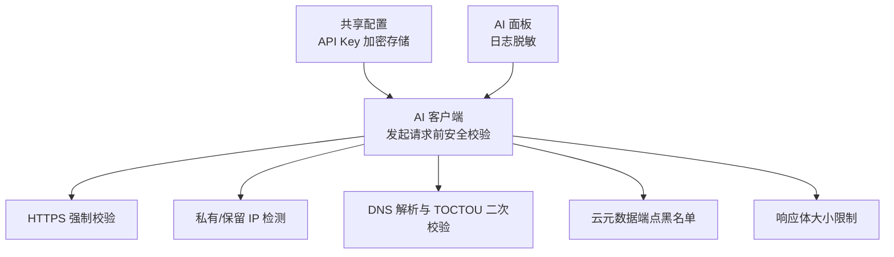
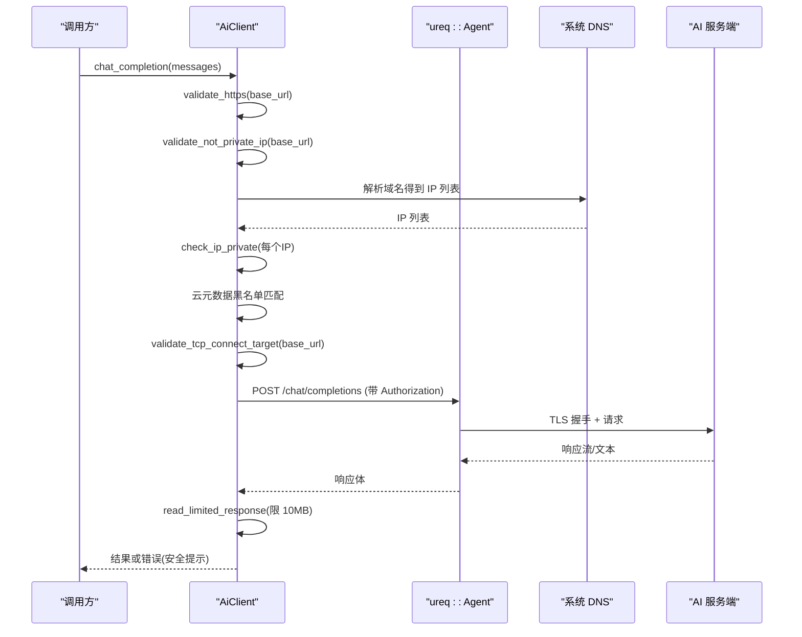
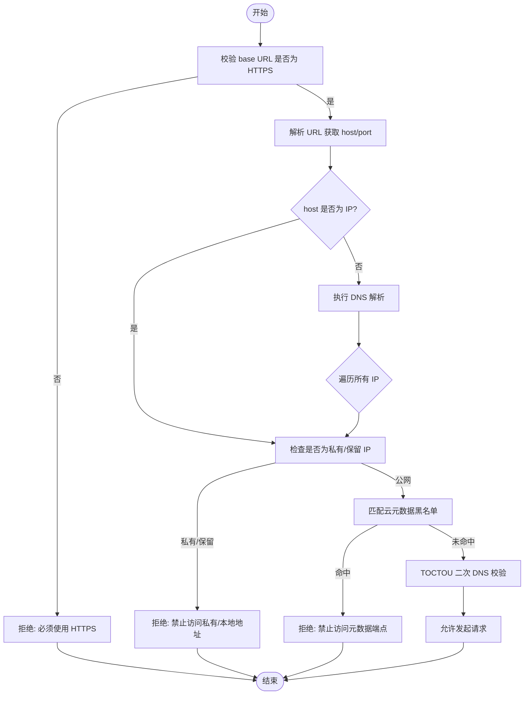
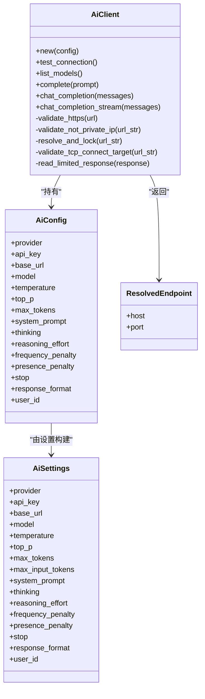
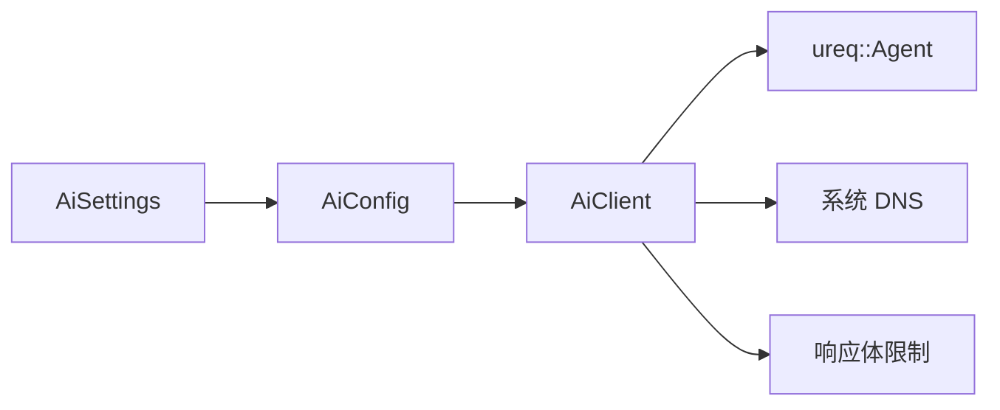

# 安全验证机制

<cite>
**本文引用的文件**
- [aether-ai/src/lib.rs](file://crates/aether-ai/src/lib.rs)
- [aether-shared/src/settings.rs](file://crates/aether-shared/src/settings.rs)
- [aether-ai-panel/src/ai_panel.rs](file://crates/aether-ai-panel/src/ai_panel.rs)
</cite>

## 目录
1. [简介](#简介)
2. [项目结构](#项目结构)
3. [核心组件](#核心组件)
4. [架构总览](#架构总览)
5. [详细组件分析](#详细组件分析)
6. [依赖关系分析](#依赖关系分析)
7. [性能考量](#性能考量)
8. [故障排查指南](#故障排查指南)
9. [结论](#结论)
10. [附录](#附录)

## 简介
本文件面向 AI 服务的安全验证机制，聚焦 SSRF（服务器端请求伪造）防护、TOCTOU（检查时与使用时不一致）漏洞防护策略，以及安全配置最佳实践。内容基于代码实现进行说明，包括 HTTPS 强制要求、私有 IP 地址检测、DNS 重绑定攻击防护思路与限制、云元数据端点黑名单、HTTP 请求前的二次 DNS 校验、API Key 管理、请求超时设置与响应体大小限制等。

## 项目结构
与安全验证相关的关键代码集中在 AI 客户端模块与共享配置模块：
- AI 客户端负责发起 HTTP(S) 请求，并内置多层安全校验（HTTPS 强制、私有 IP 拦截、DNS 解析校验、云元数据黑名单、响应体大小限制）。
- 共享配置模块负责 API Key 的加密存储与加载，避免明文落盘。
- AI 面板在日志中脱敏敏感头信息，降低密钥泄露风险。

图表来源
- [aether-ai/src/lib.rs:308-320](file://crates/aether-ai/src/lib.rs#L308-L320)
- [aether-ai/src/lib.rs:394-456](file://crates/aether-ai/src/lib.rs#L394-L456)
- [aether-ai/src/lib.rs:491-534](file://crates/aether-ai/src/lib.rs#L491-L534)
- [aether-ai/src/lib.rs:536-558](file://crates/aether-ai/src/lib.rs#L536-L558)
- [aether-shared/src/settings.rs:73-115](file://crates/aether-shared/src/settings.rs#L73-L115)
- [aether-ai-panel/src/ai_panel.rs:29-62](file://crates/aether-ai-panel/src/ai_panel.rs#L29-L62)

章节来源
- [aether-ai/src/lib.rs:308-320](file://crates/aether-ai/src/lib.rs#L308-L320)
- [aether-shared/src/settings.rs:73-115](file://crates/aether-shared/src/settings.rs#L73-L115)
- [aether-ai-panel/src/ai_panel.rs:29-62](file://crates/aether-ai-panel/src/ai_panel.rs#L29-L62)

## 核心组件
- AiClient：封装 HTTP 客户端构建与请求流程，内置安全校验链。
- AiSettings/AiConfig：承载模型与认证参数，其中 API Key 不序列化到配置文件。
- ResolvedEndpoint：用于记录已解析并校验的端点信息（主机与端口）。
- 错误类型 AiError：提供安全友好的用户提示与可重试判断。

章节来源
- [aether-ai/src/lib.rs:84-163](file://crates/aether-ai/src/lib.rs#L84-L163)
- [aether-ai/src/lib.rs:165-262](file://crates/aether-ai/src/lib.rs#L165-L262)
- [aether-ai/src/lib.rs:301-306](file://crates/aether-ai/src/lib.rs#L301-L306)

## 架构总览
下图展示一次聊天补全请求从配置到网络层的安全校验流程，体现 HTTPS 强制、私有 IP 检测、DNS 校验与黑名单拦截等多层防护。

图表来源
- [aether-ai/src/lib.rs:577-710](file://crates/aether-ai/src/lib.rs#L577-L710)
- [aether-ai/src/lib.rs:394-456](file://crates/aether-ai/src/lib.rs#L394-L456)
- [aether-ai/src/lib.rs:491-534](file://crates/aether-ai/src/lib.rs#L491-L534)
- [aether-ai/src/lib.rs:536-558](file://crates/aether-ai/src/lib.rs#L536-L558)

## 详细组件分析

### SSRF 防护措施
- HTTPS 强制要求：所有 base URL 必须为 https://，否则拒绝请求。
- 私有/保留 IP 检测：对直接 IP 与 DNS 解析后的所有 IP 进行私有、回环、链路本地、组播、广播、文档地址等检测，阻止访问内网资源。
- DNS 重绑定防护：在请求前进行 DNS 解析并校验所有返回 IP；同时在发起 TCP 连接前再次校验目标，形成“检查-使用”双重保障。由于当前 TLS 连接器不支持固定 IP 且保持主机名校验，仍存在残余风险，但作为纵深防御层有效降低静态与动态重绑定攻击面。
- 云元数据端点黑名单：显式禁止访问常见云平台元数据接口（如 AWS/GCP/Azure/阿里云/腾讯云），防止通过特殊域名或 IP 窃取实例凭证。

图表来源
- [aether-ai/src/lib.rs:394-456](file://crates/aether-ai/src/lib.rs#L394-L456)
- [aether-ai/src/lib.rs:491-534](file://crates/aether-ai/src/lib.rs#L491-L534)

章节来源
- [aether-ai/src/lib.rs:394-456](file://crates/aether-ai/src/lib.rs#L394-L456)
- [aether-ai/src/lib.rs:491-534](file://crates/aether-ai/src/lib.rs#L491-L534)

### TOCTOU（Time-of-Check-Time-of-Use）防护策略
- 首次校验：在构造请求前解析 URL 并进行 DNS 解析，对所有返回 IP 做私有地址检测与黑名单匹配。
- 二次校验：在发起 TCP 连接前再次执行 resolve_and_lock，确保两次查询间未被篡改为目标私有地址。
- 限制说明：当前实现不锁定 IP 直连以保留 TLS 主机名校验，因此仍受 DNS 重绑定残余风险影响；建议未来采用自定义 TLS connector 与 IP pinning 以实现彻底防护。

章节来源
- [aether-ai/src/lib.rs:491-534](file://crates/aether-ai/src/lib.rs#L491-L534)

### 安全配置最佳实践
- API Key 管理
  - API Key 不序列化到 settings.json，改为 DPAPI 加密单独存储，避免明文落盘。
  - 运行时从加密文件解密后注入请求头，并在日志中对敏感头进行脱敏处理。
- 请求超时设置
  - 连接超时：15 秒，避免长时间挂起。
  - 读空闲超时：300 秒，适配流式生成场景，避免长任务被误中断。
  - 禁用自动重定向：防止通过 302 跳转到内网地址引发 SSRF。
- 响应体大小限制
  - 统一限制响应体最大 10MB，防止恶意大响应导致内存耗尽。
  - 错误消息截断至 200 字符，避免将大量响应体传入 UI 造成信息泄露或性能问题。

章节来源
- [aether-shared/src/settings.rs:73-115](file://crates/aether-shared/src/settings.rs#L73-L115)
- [aether-shared/src/settings.rs:377-383](file://crates/aether-shared/src/settings.rs#L377-L383)
- [aether-shared/src/settings.rs:487-559](file://crates/aether-shared/src/settings.rs#L487-L559)
- [aether-ai/src/lib.rs:308-320](file://crates/aether-ai/src/lib.rs#L308-L320)
- [aether-ai/src/lib.rs:536-558](file://crates/aether-ai/src/lib.rs#L536-L558)
- [aether-ai-panel/src/ai_panel.rs:29-62](file://crates/aether-ai-panel/src/ai_panel.rs#L29-L62)

### 类图（代码级）

图表来源
- [aether-ai/src/lib.rs:165-262](file://crates/aether-ai/src/lib.rs#L165-L262)
- [aether-ai/src/lib.rs:301-306](file://crates/aether-ai/src/lib.rs#L301-L306)
- [aether-shared/src/settings.rs:73-115](file://crates/aether-shared/src/settings.rs#L73-L115)

## 依赖关系分析
- AiClient 依赖 ureq::Agent 进行网络通信，并通过配置对象 AiConfig 获取模型与认证参数。
- AiConfig 由 AiSettings 构建，后者来自共享配置模块，支持多模型档案与加密 API Key。
- 安全校验函数之间形成链式依赖：HTTPS 强制 → 私有 IP 检测 → DNS 解析 → 黑名单匹配 → TOCTOU 二次校验 → 响应体限制。

图表来源
- [aether-ai/src/lib.rs:165-262](file://crates/aether-ai/src/lib.rs#L165-L262)
- [aether-shared/src/settings.rs:73-115](file://crates/aether-shared/src/settings.rs#L73-L115)

章节来源
- [aether-ai/src/lib.rs:165-262](file://crates/aether-ai/src/lib.rs#L165-L262)
- [aether-shared/src/settings.rs:73-115](file://crates/aether-shared/src/settings.rs#L73-L115)

## 性能考量
- 流式生成场景下，整体 timeout 不宜设置过短，以免中断长任务；采用连接超时与读空闲超时分离的策略，兼顾安全性与可用性。
- 响应体读取采用分块缓冲与上限控制，避免一次性分配过大内存。
- DNS 解析与私有 IP 检测在请求前完成，减少无效网络开销。

[本节为通用指导，不直接分析具体文件]

## 故障排查指南
- HTTPS 强制失败：确认 base URL 是否以 https:// 开头。
- 私有/本地地址被拒：检查域名解析结果是否指向内网段或保留地址。
- 云元数据端点被拒：确认未配置平台元数据域名或特殊 IP。
- 响应体超限：服务端返回过大内容，需调整服务端或客户端限制。
- 超时问题：检查网络连接与服务端响应速度，必要时调整超时阈值。

章节来源
- [aether-ai/src/lib.rs:394-456](file://crates/aether-ai/src/lib.rs#L394-L456)
- [aether-ai/src/lib.rs:536-558](file://crates/aether-ai/src/lib.rs#L536-L558)
- [aether-ai/src/lib.rs:308-320](file://crates/aether-ai/src/lib.rs#L308-L320)

## 结论
该 AI 服务通过多层安全校验构建了较为完善的 SSRF 防护体系：强制 HTTPS、严格私有 IP 检测、DNS 解析与 TOCTOU 二次校验、云元数据端点黑名单，以及响应体大小限制。配合 API Key 的加密存储与日志脱敏，显著降低了敏感信息泄露与内网访问风险。尽管 DNS 重绑定攻击仍存在残余风险，但当前实现作为纵深防御层已具备较强实用性。建议在后续版本引入自定义 TLS connector 与 IP pinning，以进一步消除重绑定威胁。

[本节为总结性内容，不直接分析具体文件]

## 附录
- 关键函数路径参考
  - HTTPS 强制校验：[aether-ai/src/lib.rs:394-402](file://crates/aether-ai/src/lib.rs#L394-L402)
  - 私有 IP 检测与黑名单：[aether-ai/src/lib.rs:404-456](file://crates/aether-ai/src/lib.rs#L404-L456)
  - DNS 解析与 TOCTOU 二次校验：[aether-ai/src/lib.rs:491-534](file://crates/aether-ai/src/lib.rs#L491-L534)
  - 响应体大小限制：[aether-ai/src/lib.rs:536-558](file://crates/aether-ai/src/lib.rs#L536-L558)
  - API Key 加密存储路径：[aether-shared/src/settings.rs:377-383](file://crates/aether-shared/src/settings.rs#L377-L383)
  - 日志脱敏（Bearer/x-api-key）：[aether-ai-panel/src/ai_panel.rs:29-62](file://crates/aether-ai-panel/src/ai_panel.rs#L29-L62)