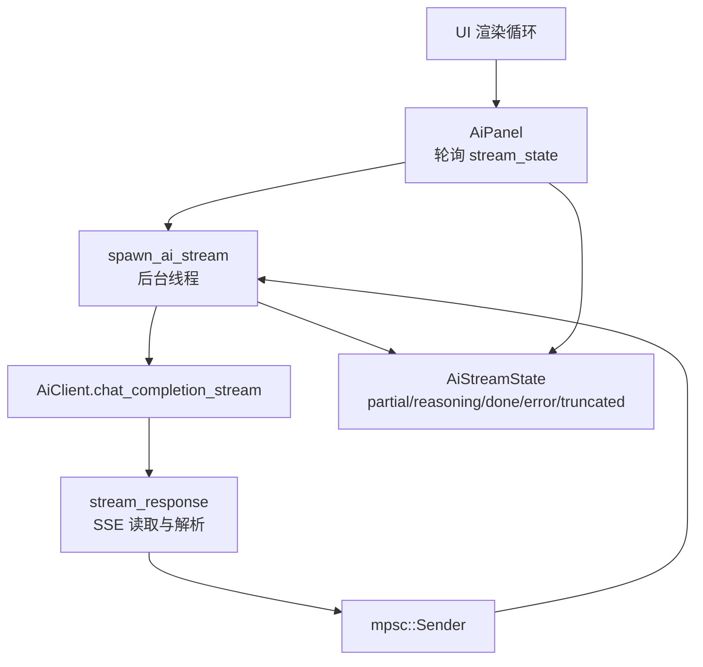
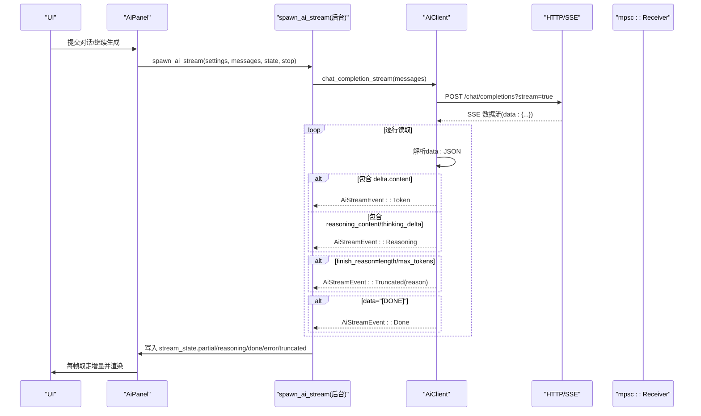
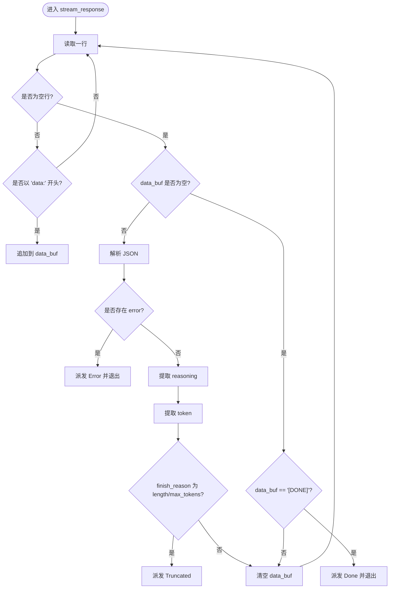
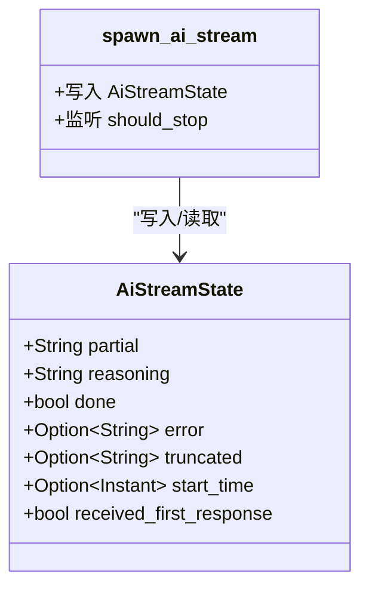
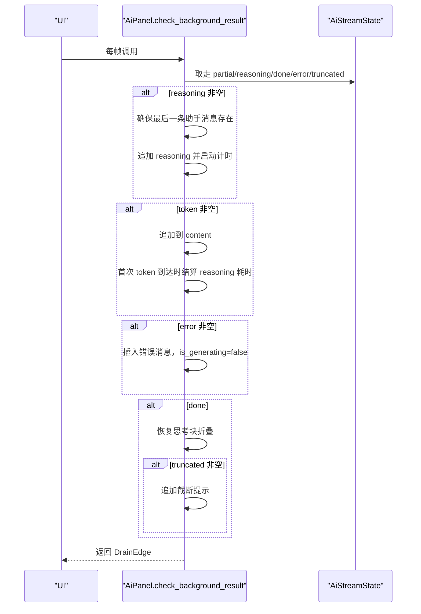
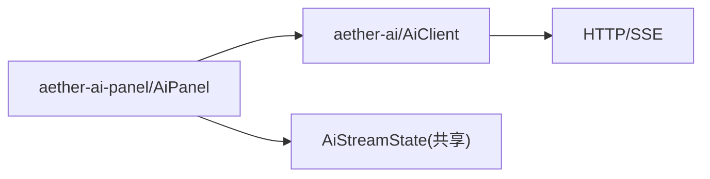

# 流式响应处理

<cite>
**本文引用的文件**
- [aether-ai/src/lib.rs](file://crates/aether-ai/src/lib.rs)
- [aether-ai-panel/src/ai_panel.rs](file://crates/aether-ai-panel/src/ai_panel.rs)
</cite>

## 目录
1. [简介](#简介)
2. [项目结构](#项目结构)
3. [核心组件](#核心组件)
4. [架构总览](#架构总览)
5. [详细组件分析](#详细组件分析)
6. [依赖关系分析](#依赖关系分析)
7. [性能与可靠性](#性能与可靠性)
8. [故障排查指南](#故障排查指南)
9. [结论](#结论)
10. [附录：UI 消费示例](#附录ui-消费示例)

## 简介
本文件面向“流式响应处理机制”，聚焦于 SSE（Server-Sent Events）在 AI 对话中的实现，包括：
- 消息分块接收与解析
- Token 级别的事件推送
- 深度思考内容的分流与展示
- 流状态管理与结束处理
- AiStreamEvent 枚举的语义与触发条件
- UI 侧如何实时消费并渲染流式内容

## 项目结构
本项目将“流式网络层”和“面板消费层”解耦：
- aether-ai：负责发起 OpenAI 兼容的流式请求、解析 SSE 数据、派发事件。
- aether-ai-panel：负责维护会话、轮询后台线程写入的共享状态、驱动 UI 更新。

图表来源
- [aether-ai/src/lib.rs:716-921](file://crates/aether-ai/src/lib.rs#L716-L921)
- [aether-ai-panel/src/ai_panel.rs:731-804](file://crates/aether-ai-panel/src/ai_panel.rs#L731-L804)

章节来源
- [aether-ai/src/lib.rs:716-921](file://crates/aether-ai/src/lib.rs#L716-L921)
- [aether-ai-panel/src/ai_panel.rs:731-804](file://crates/aether-ai-panel/src/ai_panel.rs#L731-L804)

## 核心组件
- AiStreamEvent：定义流式事件类型（Token、Reasoning、Done、Truncated、Error）。
- AiStreamState：后台线程与 UI 之间的共享状态，包含累积文本、思考内容、完成标志、错误与截断信息、开始时间与首包标记。
- spawn_ai_stream：后台线程封装，调用 AiClient 获取 Receiver，并将事件写入共享状态。
- AiClient.stream_openai_compatible / stream_response：构建请求体、发送流式请求、逐行读取 SSE 并解析 JSON 片段，提取 token、reasoning、finish_reason，派发事件。

章节来源
- [aether-ai/src/lib.rs:286-299](file://crates/aether-ai/src/lib.rs#L286-L299)
- [aether-ai-panel/src/ai_panel.rs:170-201](file://crates/aether-ai-panel/src/ai_panel.rs#L170-L201)
- [aether-ai-panel/src/ai_panel.rs:731-804](file://crates/aether-ai-panel/src/ai_panel.rs#L731-L804)
- [aether-ai/src/lib.rs:738-921](file://crates/aether-ai/src/lib.rs#L738-L921)

## 架构总览
流式响应的端到端流程如下：

图表来源
- [aether-ai/src/lib.rs:832-921](file://crates/aether-ai/src/lib.rs#L832-L921)
- [aether-ai-panel/src/ai_panel.rs:731-804](file://crates/aether-ai-panel/src/ai_panel.rs#L731-L804)

## 详细组件分析

### 事件模型：AiStreamEvent
- Token(String)：最终回答的新增片段。触发条件：SSE JSON 中包含 choices[0].delta.content 或 Anthropic 的 delta.text。
- Reasoning(String)：深度思考片段。触发条件：choices[0].delta.reasoning_content 或 Anthropic 的 thinking_delta.thinking。
- Done：流正常结束。触发条件：收到 "[DONE]" 行。
- Truncated(String)：输出被截断。触发条件：finish_reason 为 length 或 max_tokens。
- Error(String)：流式过程中出现错误。触发条件：网络/解析失败、API 返回 error 字段等。

章节来源
- [aether-ai/src/lib.rs:286-299](file://crates/aether-ai/src/lib.rs#L286-L299)
- [aether-ai/src/lib.rs:867-906](file://crates/aether-ai/src/lib.rs#L867-L906)
- [aether-ai/src/lib.rs:923-960](file://crates/aether-ai/src/lib.rs#L923-L960)

### 流解析器：stream_response
- 使用 BufReader 逐行读取 SSE 响应。
- 遇到空行时，若 data_buf 非空则尝试解析 JSON；若 data_buf 为 "[DONE]" 则派发 Done 并退出。
- 对每个 JSON 片段：
  - 若存在 error 字段，派发 Error 并终止。
  - 提取 reasoning_content/thinking_delta -> Reasoning。
  - 提取 delta.content/delta.text -> Token。
  - 检查 finish_reason -> Truncated。
- 将事件通过 mpsc::Sender 发送到后台线程，再由其写入共享状态。

图表来源
- [aether-ai/src/lib.rs:832-921](file://crates/aether-ai/src/lib.rs#L832-L921)

### 后台线程与共享状态：spawn_ai_stream 与 AiStreamState
- 后台线程从 Receiver 逐个取出事件，写入 AiStreamState：
  - Token -> partial
  - Reasoning -> reasoning
  - Done -> done=true 并退出
  - Truncated -> truncated=Some(reason)，不立即退出（等待后续 Done）
  - Error -> error=Some(msg)
- 同时记录 start_time 与 received_first_response，用于超时检测与 UI 提示。

图表来源
- [aether-ai-panel/src/ai_panel.rs:170-201](file://crates/aether-ai-panel/src/ai_panel.rs#L170-L201)
- [aether-ai-panel/src/ai_panel.rs:731-804](file://crates/aether-ai-panel/src/ai_panel.rs#L731-L804)

### UI 消费：check_background_result 与消息组装
- 每帧调用 check_background_result，从 stream_state 中“取走”增量（mem::take），避免重复渲染。
- 根据增量决定：
  - 新增 reasoning 时，确保最后一条助手消息承载 reasoning，并启动计时。
  - 新增 token 时，追加到 content，并在首次到达时结算 reasoning 耗时。
  - 发生 error 时，插入错误消息，停止生成。
  - done 时，恢复思考块折叠；若 truncated 有值，追加提示消息并返回 Truncated 边沿。
- 返回 DrainEdge 供上层编排器处理（Completed/Interrupted/Truncated）。

图表来源
- [aether-ai-panel/src/ai_panel.rs:364-459](file://crates/aether-ai-panel/src/ai_panel.rs#L364-L459)
- [aether-ai-panel/src/ai_panel.rs:2196-2219](file://crates/aether-ai-panel/src/ai_panel.rs#L2196-L2219)

章节来源
- [aether-ai-panel/src/ai_panel.rs:364-459](file://crates/aether-ai-panel/src/ai_panel.rs#L364-L459)
- [aether-ai-panel/src/ai_panel.rs:2196-2219](file://crates/aether-ai-panel/src/ai_panel.rs#L2196-L2219)

## 依赖关系分析
- aether-ai-panel 依赖 aether-ai 提供的 AiClient 与 AiStreamEvent。
- 流式通信通过 mpsc 通道解耦后台网络线程与 UI 主线程。
- 安全校验集中在 aether-ai 层（HTTPS、私有 IP/DNS 校验、SSRF 防护），降低上层风险。

图表来源
- [aether-ai/src/lib.rs:716-921](file://crates/aether-ai/src/lib.rs#L716-L921)
- [aether-ai-panel/src/ai_panel.rs:731-804](file://crates/aether-ai-panel/src/ai_panel.rs#L731-L804)

章节来源
- [aether-ai/src/lib.rs:716-921](file://crates/aether-ai/src/lib.rs#L716-L921)
- [aether-ai-panel/src/ai_panel.rs:731-804](file://crates/aether-ai-panel/src/ai_panel.rs#L731-L804)

## 性能与可靠性
- 流式传输：按行读取 SSE，避免整包缓冲，降低内存占用与首包延迟。
- 并发控制：后台线程独立运行，UI 仅做轻量轮询与增量合并。
- 安全限制：响应体大小限制、错误消息截断，防止大响应或敏感信息泄露。
- 可重试性：部分错误码支持自动重试策略（如 429/503），由上层编排器结合业务逻辑处理。

章节来源
- [aether-ai/src/lib.rs:536-570](file://crates/aether-ai/src/lib.rs#L536-L570)
- [aether-ai/src/lib.rs:147-162](file://crates/aether-ai/src/lib.rs#L147-L162)

## 故障排查指南
- 网络/连接错误：查看 Error 事件，区分本地调用失败与 API 返回错误，必要时检查代理、DNS、证书。
- 解析失败：确认服务端 SSE 格式是否符合预期（data: JSON 行，空行分隔）。
- 无首包超时：利用 received_first_response 与 start_time 判断长时间无响应场景。
- 输出截断：当 truncated 非空时，提示用户“继续生成”，或在 UI 提供续写入口。
- 错误脱敏：对外展示使用 safe_display 或 sanitize_error，避免泄露密钥等敏感信息。

章节来源
- [aether-ai-panel/src/ai_panel.rs:787-804](file://crates/aether-ai-panel/src/ai_panel.rs#L787-L804)
- [aether-ai/src/lib.rs:110-162](file://crates/aether-ai/src/lib.rs#L110-L162)

## 结论
该流式响应机制通过清晰的职责划分与事件模型，实现了低延迟、可扩展的 AI 回复渲染。Token 与 Reasoning 的分流使得“深度思考”与“最终回答”得以分别呈现，配合共享状态与边沿通知，UI 能够稳定地实时更新并正确处理结束与异常。

## 附录：UI 消费示例
以下示例说明如何在 UI 中消费流式响应，包括深度思考的特殊处理和流结束的正确处理方式。

- 初始化与提交
  - 设置 is_generating=true，重置 stream_state，构造系统提示与用户输入，调用 spawn_ai_stream 启动后台流。
  - 参考路径：[aether-ai-panel/src/ai_panel.rs:1882-1975](file://crates/aether-ai-panel/src/ai_panel.rs#L1882-L1975)

- 每帧轮询与渲染
  - 调用 check_background_result 取走增量，将 reasoning 追加到“思考过程”，将 token 追加到“回答内容”。
  - 首次 token 到达时结算思考耗时；done 时恢复思考块折叠；truncated 时追加提示。
  - 参考路径：[aether-ai-panel/src/ai_panel.rs:364-459](file://crates/aether-ai-panel/src/ai_panel.rs#L364-L459)、[aether-ai-panel/src/ai_panel.rs:2196-2219](file://crates/aether-ai-panel/src/ai_panel.rs#L2196-L2219)

- 深度思考特殊处理
  - 若回答为空但 reasoning 非空（例如简单问答场景），将 reasoning 作为正常回答显示。
  - 参考路径：[aether-ai-panel/src/ai_panel.rs:423-445](file://crates/aether-ai-panel/src/ai_panel.rs#L423-L445)

- 流结束与继续生成
  - 收到 Done 后，若 truncated 非空，提示用户“继续生成”；否则视为正常完成。
  - 参考路径：[aether-ai-panel/src/ai_panel.rs:446-455](file://crates/aether-ai-panel/src/ai_panel.rs#L446-L455)

- 错误处理
  - 区分本地调用失败与 API 返回错误，对用户展示友好提示。
  - 参考路径：[aether-ai-panel/src/ai_panel.rs:787-804](file://crates/aether-ai-panel/src/ai_panel.rs#L787-L804)

章节来源
- [aether-ai-panel/src/ai_panel.rs:1882-1975](file://crates/aether-ai-panel/src/ai_panel.rs#L1882-L1975)
- [aether-ai-panel/src/ai_panel.rs:364-459](file://crates/aether-ai-panel/src/ai_panel.rs#L364-L459)
- [aether-ai-panel/src/ai_panel.rs:2196-2219](file://crates/aether-ai-panel/src/ai_panel.rs#L2196-L2219)
- [aether-ai-panel/src/ai_panel.rs:787-804](file://crates/aether-ai-panel/src/ai_panel.rs#L787-L804)