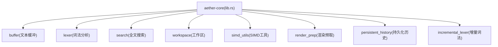
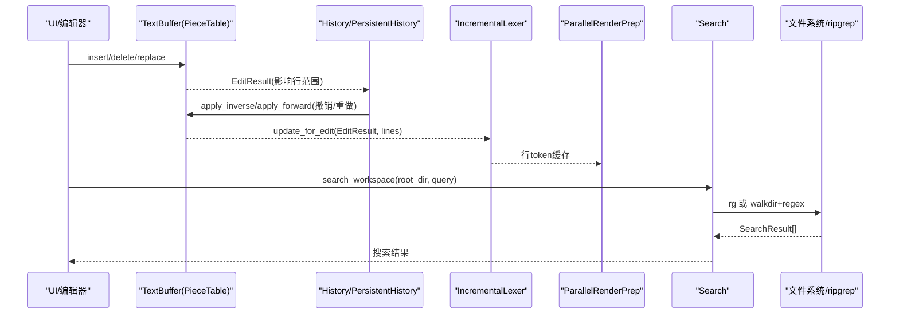
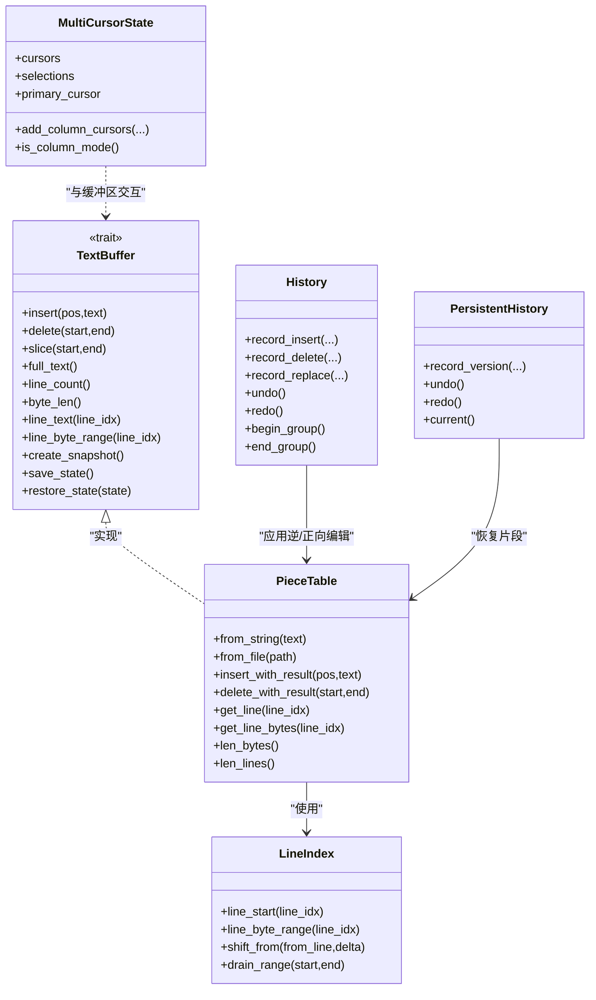
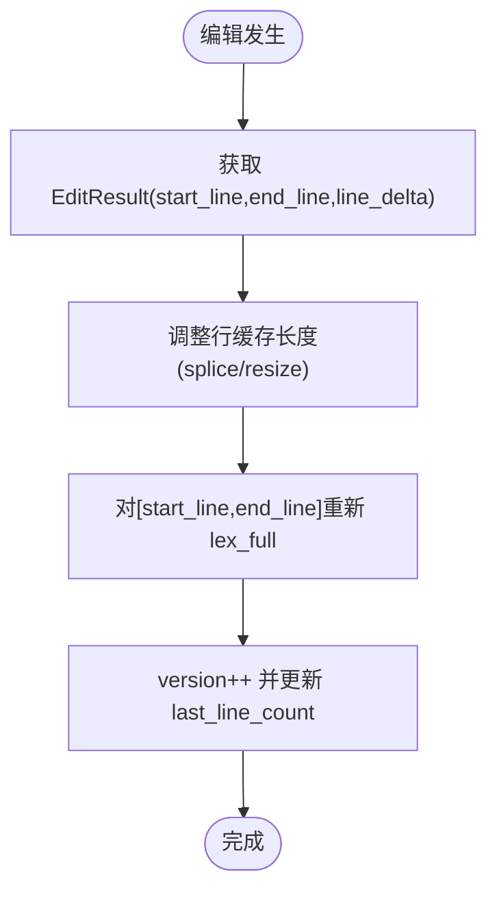
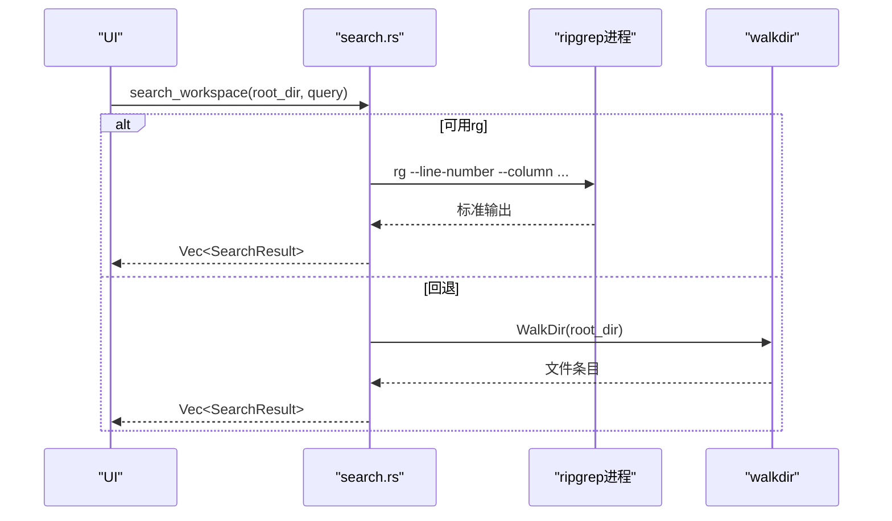
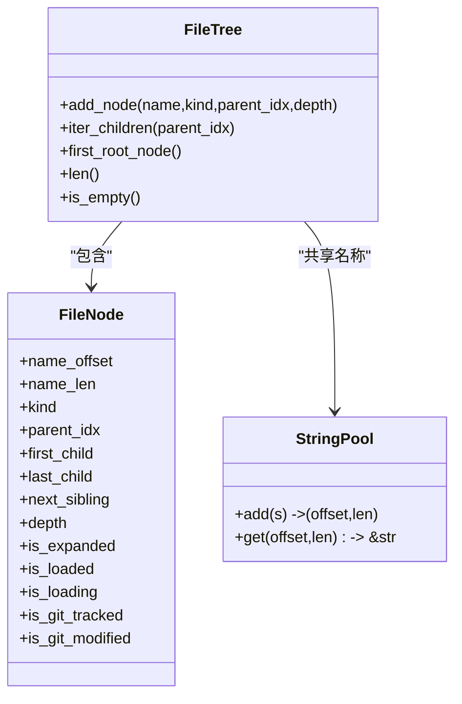
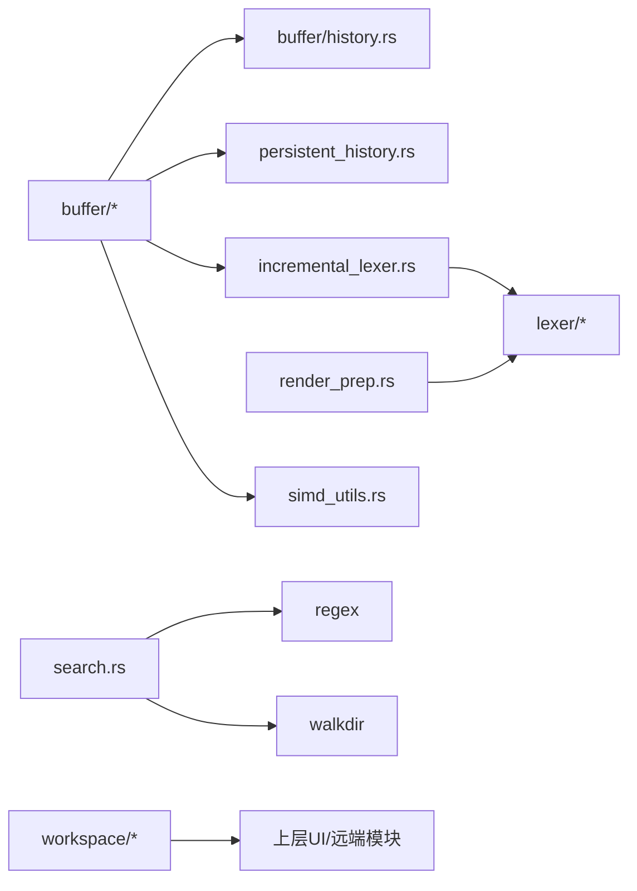

# aether-core 核心模块

<cite>
**本文引用的文件**
- [lib.rs](file://crates/aether-core/src/lib.rs)
- [Cargo.toml](file://crates/aether-core/Cargo.toml)
- [buffer/mod.rs](file://crates/aether-core/src/buffer/mod.rs)
- [buffer/piece_table.rs](file://crates/aether-core/src/buffer/piece_table.rs)
- [buffer/text_buffer.rs](file://crates/aether-core/src/buffer/text_buffer.rs)
- [buffer/history.rs](file://crates/aether-core/src/buffer/history.rs)
- [incremental_lexer.rs](file://crates/aether-core/src/incremental_lexer.rs)
- [lexer/mod.rs](file://crates/aether-core/src/lexer/mod.rs)
- [lexer/common.rs](file://crates/aether-core/src/lexer/common.rs)
- [search.rs](file://crates/aether-core/src/search.rs)
- [simd_utils.rs](file://crates/aether-core/src/simd_utils.rs)
- [workspace/mod.rs](file://crates/aether-core/src/workspace/mod.rs)
- [workspace/file_tree.rs](file://crates/aether-core/src/workspace/file_tree.rs)
- [persistent_history.rs](file://crates/aether-core/src/persistent_history.rs)
- [render_prep.rs](file://crates/aether-core/src/render_prep.rs)
</cite>

## 目录
1. [简介](#简介)
2. [项目结构](#项目结构)
3. [核心组件](#核心组件)
4. [架构总览](#架构总览)
5. [详细组件分析](#详细组件分析)
6. [依赖关系分析](#依赖关系分析)
7. [性能考量](#性能考量)
8. [故障排查指南](#故障排查指南)
9. [结论](#结论)
10. [附录](#附录)

## 简介
aether-core 是编辑器的核心库，提供高性能文本缓冲（Piece Table）、多光标与撤销重做、增量词法分析（多语言支持）、全文搜索（优先 ripgrep，回退 walkdir+regex）以及工作区文件树管理。它通过 trait 抽象与模块化设计，为上层 UI、渲染、LSP、终端等模块提供稳定、可扩展的底层能力。

## 项目结构
- 顶层模块在 lib.rs 中统一暴露：buffer、lexer、search、workspace、simd_utils、render_prep、persistent_history、incremental_lexer 等。
- buffer 子模块实现 Piece Table、TextBuffer trait、多光标状态与历史合并策略。
- lexer 子模块提供通用 Lexer trait、TokenKind、Language 分发及多种语言词法分析器；common 提供共享扫描工具。
- search 提供工作区搜索，优先调用外部 ripgrep，失败时回退到内存遍历匹配。
- workspace 提供紧凑的文件树结构与懒加载标记。
- simd_utils 提供基于 memchr/bytecount/SWAR 的高性能字节级工具。
- render_prep 提供并行行 token 预处理与可见行缓存。
- persistent_history 提供基于 Arc<Vec<Piece>> 的版本快照与时间/大小合并策略。

**图示来源**
- [lib.rs:1-12](file://crates/aether-core/src/lib.rs#L1-L12)

**章节来源**
- [lib.rs:1-12](file://crates/aether-core/src/lib.rs#L1-L12)
- [Cargo.toml:1-22](file://crates/aether-core/Cargo.toml#L1-L22)

## 核心组件
- 文本缓冲系统
  - Piece Table：O(1) 插入/删除、零拷贝大文件打开、行索引分块优化、片段偏移前缀和缓存。
  - TextBuffer trait：抽象编辑接口，支持不可变快照，便于后台线程安全读取。
  - 多光标状态：支持主光标、选择区域、列选择模式。
- 撤销重做
  - History：差分记录（Insert/Delete/Replace），连续输入合并，撤销组（begin/end_group）。
  - PersistentHistory：Arc 共享版本快照，时间/大小合并，环形历史队列。
- 词法分析
  - Lexer trait + Language 静态分发，覆盖 C/Rust/Python/JS/TS/Go/Java/Json/Markdown/Toml/Html/Css/PlainText/Image。
  - IncrementalLexer：按行缓存 token，编辑后仅重算受影响行。
  - common：跨语言共享跳过空白、注释、字符串、标识符、数字等工具。
- 搜索系统
  - 优先 ripgrep（--line-number/--column/--max-count/--max-filesize），解析输出；回退 walkdir+regex，支持 include/exclude glob。
- 工作区管理
  - FileTree：紧凑节点存储、字符串池、虚拟根节点、懒加载标记、Git 状态位。
- SIMD 工具
  - 换行计数、字节查找、空白跳过、字符分类、行长度计算等，利用 AVX2/SSE2 运行时分派。
- 渲染预取
  - ParallelRenderPrep：rayon 并行 token 预处理；RenderCache：可见行文本与 token 缓存。

**章节来源**
- [buffer/mod.rs:1-9](file://crates/aether-core/src/buffer/mod.rs#L1-L9)
- [buffer/piece_table.rs:11-35](file://crates/aether-core/src/buffer/piece_table.rs#L11-L35)
- [buffer/text_buffer.rs:1-49](file://crates/aether-core/src/buffer/text_buffer.rs#L1-L49)
- [buffer/history.rs:6-28](file://crates/aether-core/src/buffer/history.rs#L6-L28)
- [incremental_lexer.rs:4-16](file://crates/aether-core/src/incremental_lexer.rs#L4-L16)
- [lexer/mod.rs:1-111](file://crates/aether-core/src/lexer/mod.rs#L1-L111)
- [lexer/common.rs:1-151](file://crates/aether-core/src/lexer/common.rs#L1-L151)
- [search.rs:6-59](file://crates/aether-core/src/search.rs#L6-L59)
- [workspace/file_tree.rs:1-50](file://crates/aether-core/src/workspace/file_tree.rs#L1-L50)
- [simd_utils.rs:1-18](file://crates/aether-core/src/simd_utils.rs#L1-L18)
- [render_prep.rs:5-67](file://crates/aether-core/src/render_prep.rs#L5-L67)
- [persistent_history.rs:7-50](file://crates/aether-core/src/persistent_history.rs#L7-L50)

## 架构总览
aether-core 以“数据层（Piece Table）— 编辑历史（History/PersistentHistory）— 增量分析（IncrementalLexer）— 渲染/搜索（ParallelRenderPrep/Search）— 工作区（FileTree）”的分层组织，配合 SIMD 工具提升热点路径性能。

**图示来源**
- [buffer/piece_table.rs:450-562](file://crates/aether-core/src/buffer/piece_table.rs#L450-L562)
- [buffer/history.rs:45-77](file://crates/aether-core/src/buffer/history.rs#L45-L77)
- [incremental_lexer.rs:36-101](file://crates/aether-core/src/incremental_lexer.rs#L36-L101)
- [search.rs:45-59](file://crates/aether-core/src/search.rs#L45-L59)

## 详细组件分析

### 文本缓冲系统（Piece Table、多光标、撤销重做）
- Piece Table
  - 数据结构：original(mmap)、add_buffer(只追加)、pieces(有序片段)、LineIndex(两级分块行索引)、piece_offset_cache(前缀和)。
  - 关键操作：insert_with_result/delete_with_result 返回 EditResult(start_line,end_line,line_delta)，用于精确失效行缓存。
  - 行索引：LineBlock 使用 base+rel[u32] 表示相对偏移，支持 O(块数) 平移与分裂，避免全量重建。
  - 零拷贝：get_line_bytes/get_text_bytes 尽量返回切片，跨 piece 时回退拼接。
- TextBuffer trait
  - 抽象编辑接口与快照，屏蔽具体实现差异，便于替换 Rope 等后端。
- 多光标
  - MultiCursorState：维护 cursors、selections、primary_cursor，支持列选择模式与规范化选择。
- 撤销重做
  - History：EditDelta 记录 Insert/Delete/Replace，支持 500ms 同位置合并与撤销组（begin/end_group）。
  - PersistentHistory：VersionSnapshot 使用 Arc<Vec<Piece>> 共享片段，时间/大小合并减少历史膨胀。

**图示来源**
- [buffer/piece_table.rs:11-35](file://crates/aether-core/src/buffer/piece_table.rs#L11-L35)
- [buffer/piece_table.rs:101-179](file://crates/aether-core/src/buffer/piece_table.rs#L101-L179)
- [buffer/text_buffer.rs:1-49](file://crates/aether-core/src/buffer/text_buffer.rs#L1-L49)
- [buffer/text_buffer.rs:173-258](file://crates/aether-core/src/buffer/text_buffer.rs#L173-L258)
- [buffer/history.rs:6-28](file://crates/aether-core/src/buffer/history.rs#L6-L28)
- [persistent_history.rs:7-50](file://crates/aether-core/src/persistent_history.rs#L7-L50)

**章节来源**
- [buffer/piece_table.rs:450-562](file://crates/aether-core/src/buffer/piece_table.rs#L450-L562)
- [buffer/piece_table.rs:569-708](file://crates/aether-core/src/buffer/piece_table.rs#L569-L708)
- [buffer/text_buffer.rs:1-49](file://crates/aether-core/src/buffer/text_buffer.rs#L1-L49)
- [buffer/text_buffer.rs:173-258](file://crates/aether-core/src/buffer/text_buffer.rs#L173-L258)
- [buffer/history.rs:140-340](file://crates/aether-core/src/buffer/history.rs#L140-L340)
- [persistent_history.rs:66-136](file://crates/aether-core/src/persistent_history.rs#L66-L136)

### 词法分析器（增量词法、多语言支持）
- Lexer trait 与 Language 静态分发：根据扩展名创建对应语言词法分析器，支持 C/Rust/Python/JS/TS/Go/Java/Json/Markdown/Toml/Html/Css/PlainText/Image。
- IncrementalLexer：按行缓存 token，edit_result 驱动受影响行的增量更新；管理器支持多文件切换与缓存上限保护。
- common：跨语言共享 skip_whitespace/skip_line_comment/skip_block_comment/skip_quoted/skip_identifier_* 等工具。

**图示来源**
- [incremental_lexer.rs:36-101](file://crates/aether-core/src/incremental_lexer.rs#L36-L101)

**章节来源**
- [lexer/mod.rs:94-196](file://crates/aether-core/src/lexer/mod.rs#L94-L196)
- [incremental_lexer.rs:18-129](file://crates/aether-core/src/incremental_lexer.rs#L18-L129)
- [lexer/common.rs:5-90](file://crates/aether-core/src/lexer/common.rs#L5-L90)

### 搜索系统（全文搜索、SIMD 优化）
- 搜索流程：优先调用 ripgrep（--line-number/--column/--max-count/--max-filesize），解析 path:line:col:text；失败则回退 walkdir+regex，支持 include/exclude 过滤与大文件跳过。
- SIMD 优化：换行计数与字节查找委托给 bytecount/memchr（AVX2/SSE2 运行时分派），空白跳过使用 SWAR 批量检测。

**图示来源**
- [search.rs:45-171](file://crates/aether-core/src/search.rs#L45-L171)
- [simd_utils.rs:8-18](file://crates/aether-core/src/simd_utils.rs#L8-L18)

**章节来源**
- [search.rs:6-59](file://crates/aether-core/src/search.rs#L6-L59)
- [search.rs:61-171](file://crates/aether-core/src/search.rs#L61-L171)
- [simd_utils.rs:8-18](file://crates/aether-core/src/simd_utils.rs#L8-L18)

### 工作区管理功能（文件树）
- FileTree：扁平节点数组 + 字符串池，虚拟根节点首尾指针 O(1) 尾插，支持懒加载与 Git 状态位。
- 迭代器：iter_children 遍历兄弟链表；nodes_iter 遍历所有节点。

**图示来源**
- [workspace/file_tree.rs:1-50](file://crates/aether-core/src/workspace/file_tree.rs#L1-L50)
- [workspace/file_tree.rs:52-76](file://crates/aether-core/src/workspace/file_tree.rs#L52-L76)
- [workspace/file_tree.rs:78-190](file://crates/aether-core/src/workspace/file_tree.rs#L78-L190)

**章节来源**
- [workspace/mod.rs:1-2](file://crates/aether-core/src/workspace/mod.rs#L1-L2)
- [workspace/file_tree.rs:1-50](file://crates/aether-core/src/workspace/file_tree.rs#L1-L50)
- [workspace/file_tree.rs:78-190](file://crates/aether-core/src/workspace/file_tree.rs#L78-L190)

### 渲染预取与并行处理
- ParallelRenderPrep：行数较少时单线程，否则 rayon par_iter 并行 lex_full；自动探测 CPU 并行度并限制最大线程数。
- RenderCache：缓存可见行文本与 token，版本号失效检测。

**章节来源**
- [render_prep.rs:13-67](file://crates/aether-core/src/render_prep.rs#L13-L67)
- [render_prep.rs:69-131](file://crates/aether-core/src/render_prep.rs#L69-L131)

## 依赖关系分析
- 运行时依赖：memmap2（大文件 mmap）、memchr/bytecount（SIMD 加速）、rayon（并行）、regex（正则匹配）、walkdir（目录遍历）、smallvec（小向量优化）。
- 模块耦合：
  - buffer 与 history/persistent_history 强耦合（编辑结果驱动历史与增量分析）。
  - incremental_lexer 依赖 lexer 与 buffer 的 EditResult。
  - search 依赖 regex/walkdir，可选外部 rg。
  - render_prep 依赖 lexer 与 rayon。
  - workspace 独立，提供文件树结构供上层 UI/远端模块使用。

**图示来源**
- [Cargo.toml:6-17](file://crates/aether-core/Cargo.toml#L6-L17)
- [incremental_lexer.rs:1-16](file://crates/aether-core/src/incremental_lexer.rs#L1-L16)
- [search.rs:1-5](file://crates/aether-core/src/search.rs#L1-L5)
- [render_prep.rs:1-4](file://crates/aether-core/src/render_prep.rs#L1-L4)

**章节来源**
- [Cargo.toml:6-17](file://crates/aether-core/Cargo.toml#L6-L17)
- [incremental_lexer.rs:1-16](file://crates/aether-core/src/incremental_lexer.rs#L1-L16)
- [search.rs:1-5](file://crates/aether-core/src/search.rs#L1-L5)
- [render_prep.rs:1-4](file://crates/aether-core/src/render_prep.rs#L1-L4)

## 性能考量
- 文本缓冲
  - Piece Table 插入/删除 O(1) 级别（片段层面），行索引采用分块与基址平移，避免全量重建。
  - piece_offset_cache 使 len_bytes 与定位达到 O(log n)/O(1)。
  - get_line_bytes 零拷贝路径显著降低分配。
- 撤销重做
  - History 差分记录与合并窗口减少步骤数量；PersistentHistory 使用 Arc 共享片段，避免完整拷贝。
- 词法分析
  - IncrementalLexer 仅重算受影响行；Language::lex_full 静态分发避免 Box 分配与动态分发开销。
  - common 工具函数复用，减少重复逻辑。
- 搜索
  - 优先 ripgrep 利用原生 SIMD/多线程；回退路径限制文件大小与结果数量。
- SIMD
  - 换行计数/字节查找委托 memchr/bytecount；空白跳过使用 SWAR 批量检测，编译器可进一步向量化。
- 渲染
  - ParallelRenderPrep 阈值控制并行；RenderCache 避免每帧重复计算。

[本节为通用性能讨论，不直接分析具体文件]

## 故障排查指南
- 文本越界与边界钳位
  - delete_with_result 对 end 进行 min(len_bytes) 钳位，防止越界损坏。
  - MultiCursorState.primary_idx 钳位 primary_cursor，避免非法索引 panic。
- 行索引一致性
  - LineIndex 在 split/drain/shift 后重建前缀，确保 block_start_lines 正确。
- 历史合并与溢出
  - History 合并窗口与撤销组保证用户体验；PersistentHistory 环形队列与最小容量保护避免丢失当前版本。
- 搜索回退
  - rg 不可用或失败时自动回退 walkdir+regex，确保搜索可用性。
- 文件树别名与 UB
  - add_node 使用 split_at_mut 消除可变引用别名风险，debug_assert 检查 parent_idx != last_child。

**章节来源**
- [buffer/piece_table.rs:569-588](file://crates/aether-core/src/buffer/piece_table.rs#L569-L588)
- [buffer/text_buffer.rs:191-223](file://crates/aether-core/src/buffer/text_buffer.rs#L191-L223)
- [buffer/piece_table.rs:205-227](file://crates/aether-core/src/buffer/piece_table.rs#L205-L227)
- [buffer/history.rs:124-138](file://crates/aether-core/src/buffer/history.rs#L124-L138)
- [persistent_history.rs:116-136](file://crates/aether-core/src/persistent_history.rs#L116-L136)
- [search.rs:45-59](file://crates/aether-core/src/search.rs#L45-L59)
- [workspace/file_tree.rs:107-154](file://crates/aether-core/src/workspace/file_tree.rs#L107-L154)

## 结论
aether-core 通过 Piece Table、增量词法、高效搜索与工作区管理，构建了高性能、可扩展的编辑器内核。其设计强调：
- 数据结构的零拷贝与缓存优化（mmap、piece_offset_cache、LineIndex 分块）。
- 编辑历史的轻量差分与合并策略（History/PersistentHistory）。
- 多语言词法的统一抽象与静态分发（Lexer/Language）。
- 搜索系统的健壮性与回退机制（rg + walkdir）。
- 渲染预取的并行化与缓存（rayon + RenderCache）。
这些特性共同保障了在大文件、高频编辑与复杂工作区场景下的流畅体验。

[本节为总结性内容，不直接分析具体文件]

## 附录
- 使用示例（路径参考）
  - 文本缓冲：从字符串/文件创建 Piece Table，执行插入/删除并获取受影响的行范围。
    - [buffer/piece_table.rs:383-448](file://crates/aether-core/src/buffer/piece_table.rs#L383-L448)
    - [buffer/piece_table.rs:450-562](file://crates/aether-core/src/buffer/piece_table.rs#L450-L562)
  - 多光标：添加列选择模式光标并进入列模式。
    - [buffer/text_buffer.rs:229-258](file://crates/aether-core/src/buffer/text_buffer.rs#L229-L258)
  - 撤销重做：记录插入/删除/替换，支持撤销组。
    - [buffer/history.rs:140-340](file://crates/aether-core/src/buffer/history.rs#L140-L340)
  - 增量词法：全量分析与增量更新。
    - [incremental_lexer.rs:28-101](file://crates/aether-core/src/incremental_lexer.rs#L28-L101)
  - 搜索：构建查询并执行工作区搜索。
    - [search.rs:6-59](file://crates/aether-core/src/search.rs#L6-L59)
  - 工作区：添加节点与遍历子节点。
    - [workspace/file_tree.rs:83-190](file://crates/aether-core/src/workspace/file_tree.rs#L83-L190)
  - 渲染预取：并行预处理与缓存更新。
    - [render_prep.rs:32-67](file://crates/aether-core/src/render_prep.rs#L32-L67)
    - [render_prep.rs:96-131](file://crates/aether-core/src/render_prep.rs#L96-L131)

[本节为附录，不直接分析具体文件]